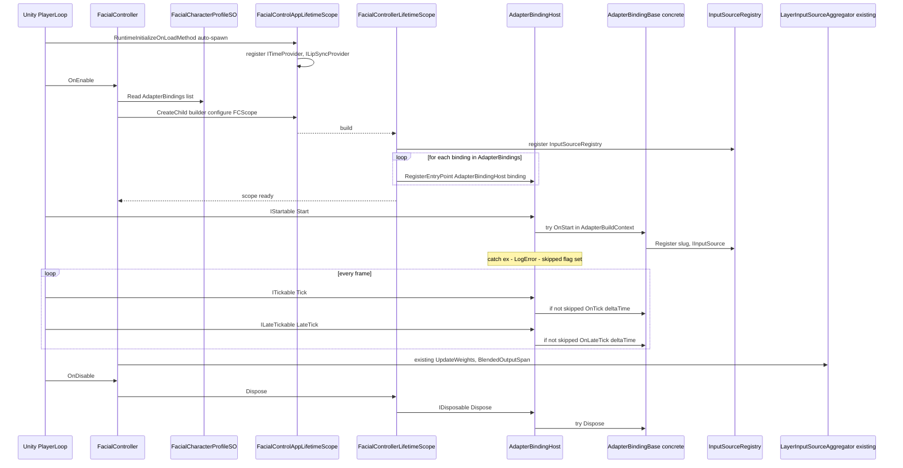
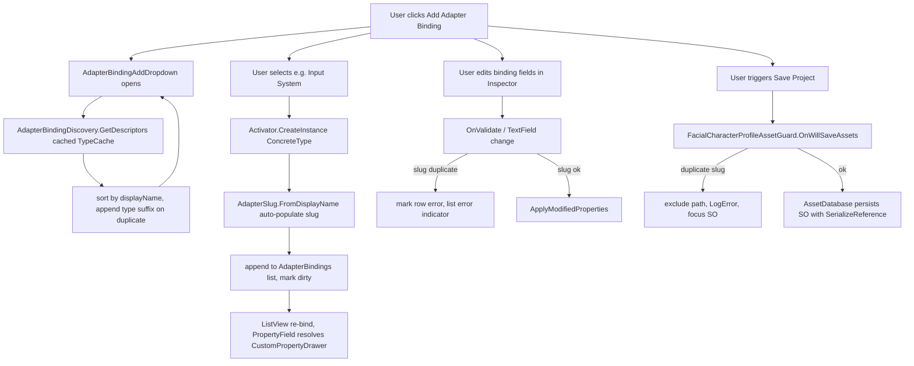
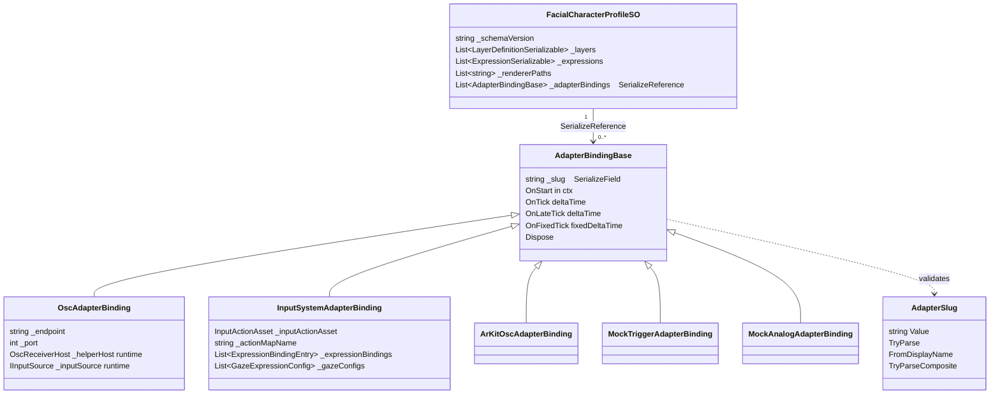
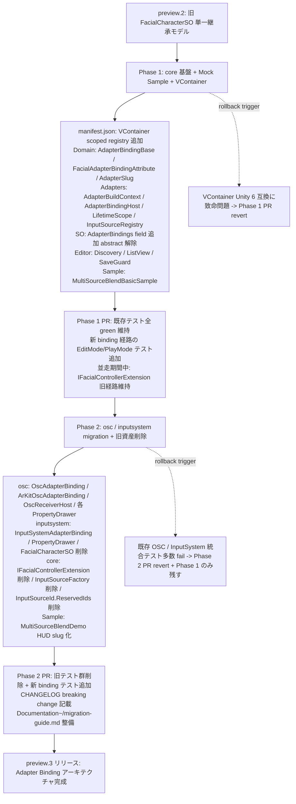

# Design Document: adapter-binding-architecture

## Overview

**Purpose**: 本仕様は FacialControl の preview 段階における破壊的アーキテクチャ刷新であり、`FacialCharacterProfileSO` を継承する単一継承モデル（現状の `FacialCharacterSO`）を撤廃し、core の `FacialCharacterProfileSO` に `[SerializeReference] List<AdapterBindingBase>` をコンポジションで持たせる属性駆動の Adapter Binding モデルへ移行する。これにより Unity エンジニアは 1 個の SO に InputSystem / OSC / ARKit など複数アダプタの設定を集約でき、複数アダプタ併用時の単一継承制約を解消する。

**Users**: FacialControl preview の利用者（Unity エンジニア）が、単一の `FacialCharacterProfileSO` Inspector 上で複数アダプタの結線を完結できる。新規アダプタパッケージ作成者は `AdapterBindingBase` 派生 + `[FacialAdapterBinding]` 属性 + `[CustomPropertyDrawer]` の 3 点セットを当該パッケージに追加するだけで core を一切変更せず Inspector に統合される。

**Impact**: 現在の Adapters 層 glue（`IFacialControllerExtension` MonoBehaviour 経路 + `InputSourceFactory.RegisterReserved` + `InputSourceId.ReservedIds`）を VContainer LifetimeScope ベースの `AdapterBindingHost` 経路 + slug-keyed `InputSourceRegistry` に全面置換する。Domain 層（`LayerInputSourceAggregator` / `LayerInputSourceWeightBuffer` / `LayerInputSourceRegistry` の 0-alloc MultiSourceBlend 実装）は一切変更しない。

### Goals
- **G-1**: `FacialCharacterProfileSO` 1 個に N 個の `AdapterBindingBase` 派生を `[SerializeReference]` で保持し、polymorphic round-trip を Unity 6 標準で実現する（Req 1, 2, 7）。
- **G-2**: core パッケージから adapter 具象型への compile-time 参照をゼロに保ち、新規アダプタ追加時に core を 1 行も変更させない（Req 1.5, 1.6, 4）。
- **G-3**: VContainer の Plain C# Entry Point（`IStartable` / `ITickable` / `ILateTickable` / `IFixedTickable` / `IDisposable`）に乗せる `AdapterBindingHost` ラッパーで binding lifecycle を委譲し、Domain は VContainer 非参照を維持する（Req 4.7-4.10, 13）。
- **G-4**: 既存 `IFacialControllerExtension` MonoBehaviour Extension モデルを撤廃し、`FacialController` が SO の `AdapterBindings` を読んで自動 build/dispose する「単一 SO ファイル UX」を実現する（Req 6.8, 6.9, 7）。
- **G-5**: 既存 reserved id 体系（`InputSourceId.ReservedIds`）を全廃し、すべての binding を slug ベースで識別する。`layer.inputSources[].id` は `<slug>` または `<slug>:<sub>` 形式に統一する（Req 12, D-13）。
- **G-6**: Domain 層 MultiSourceBlend 実装（既存 0-alloc 資産）を 1 行も変更せず、Adapters 層の glue だけで全要件を消化する（Req 5, 9）。
- **G-7**: Phase 1（core 基盤 + Mock サンプル + VContainer）と Phase 2（osc / inputsystem migration + 旧資産削除）の 2 段階移行で、各 PR を中規模に保つ。

### Non-Goals
- ランタイムでのアダプタの動的有効化/無効化（preview.2 以降）。
- ScriptableObject 以外のデータ永続化形式（preview.2 以降）。
- 既存 `FacialCharacterSO` 等の旧 schema からの自動マイグレーション（Req 8.3、preview 破壊許容）。
- Timeline 統合 / VRM 対応 / VR・モバイル対応。
- Domain 層 MultiSourceBlend ロジックの変更（既存実装を維持）。
- 新規アダプタの実装そのもの（OSC / InputSystem / ARKit の移行は対象だが新規センサー対応は対象外）。

## Boundary Commitments

### This Spec Owns
- core `Hidano.FacialControl.Domain` 層に追加する抽象基底 `AdapterBindingBase`、属性 `FacialAdapterBindingAttribute`、値オブジェクト `AdapterSlug`、中立 struct `AdapterBuildContext`（後者 2 つは Adapters 層に置く）。
- core `Hidano.FacialControl.Adapters` 層の VContainer 統合：`FacialControlAppLifetimeScope`、`FacialControllerLifetimeScope`、`AdapterBindingHost`、`IInputSourceRegistry` / `InputSourceRegistry`（既存 `InputSourceFactory` のリネーム + 責務縮小）。
- core `Hidano.FacialControl.Editor` 層の Adapter Binding 編集 UI：`AdapterBindingDiscovery`（TypeCache discovery）、`AdapterBindingsListView`（UI Toolkit）、`FacialCharacterProfileAssetGuard`（slug 重複 save block）。
- `FacialCharacterProfileSO` への `[SerializeReference] List<AdapterBindingBase> AdapterBindings` フィールド追加と関連 API（`GetAdapterBindings()` 等）。
- `FacialController` の lifecycle 改修：旧 `IFacialControllerExtension` 経路の撤去、VContainer LifetimeScope build/dispose 経路への置換。
- core 同梱サンプル `Samples~/MultiSourceBlendBasicSample/`（HUD なし最小コード + Mock binding 2 種 + JSON プロファイル + README）。
- `com.hidano.facialcontrol.osc` package の `OscAdapterBinding` / `ArKitOscAdapterBinding` および各 PropertyDrawer 提供。`OscFacialControllerExtension` / `OscRegistration` の削除。
- `com.hidano.facialcontrol.inputsystem` package の `InputSystemAdapterBinding` および PropertyDrawer 提供。`FacialCharacterSO` / `FacialCharacterInputExtension` / `InputFacialControllerExtension` / `InputRegistration` の削除。
- 既存 `InputSourceId.ReservedIds` / `IsReservedId` / `IsReserved` の削除と、`AdapterSlug` への移行。

### Out of Boundary
- Domain 層 MultiSourceBlend 実装（`LayerInputSourceAggregator` / `LayerInputSourceWeightBuffer` / `LayerInputSourceRegistry`）の変更。**既存資産を 1 行も変更しない**。
- Domain 層の他の Models / Services（`FacialProfile` / `LayerBlender` 等）の変更。
- 旧 `FacialCharacterSO` / `IFacialControllerExtension` 利用 scene の自動マイグレーション（preview 破壊許容）。
- `inputsystem/Samples~/MultiSourceBlendDemo/` の HUD 実装更新（Phase 2 の本仕様内で実施するが、HUD のロジック設計は当該サンプルのスコープ）。
- VContainer 自体のフォーク / 自前 DI 抽象化（YAGNI、D-5）。
- ARKit 検出 (`ARKitDetector`) の改修（Editor only、本仕様の boundary 外）。

### Allowed Dependencies
- **Upstream**:
  - VContainer 1.17.x（OpenUPM scoped registry 経由）— core Adapters 層 / Editor 層のみ参照。Domain は非参照。
  - Unity 6 標準 API: `[SerializeReference]`、`UnityEditor.TypeCache`、`SerializationUtility.GetManagedReferencesWithMissingTypes`、`AssetModificationProcessor`、UI Toolkit `ListView`、`AdvancedDropdown`。
  - 既存 Domain 層: `LayerInputSourceAggregator` / `LayerInputSourceWeightBuffer` / `LayerInputSourceRegistry` / `IInputSource` / `FacialProfile` / `LayerBlender`。
- **Constraints not violatable**:
  - core asmdef は `com.hidano.facialcontrol.osc` / `com.hidano.facialcontrol.inputsystem` / 任意のアダプタ asmdef を参照しない（Req 4.1）。
  - Domain asmdef は `Unity.Collections` のみ参照可、VContainer 含め一切の Engine / 第三者 dll を参照しない（Req 4.8, 11.1）。
  - Editor asmdef は `includePlatforms: ["Editor"]` で隔離する（Req 11.3）。
  - Runtime 用 UI（IMGUI / UIElements）は提供しない（Req 11.6）。

### Revalidation Triggers
- `AdapterBindingBase` の virtual lifecycle method シグネチャ変更（`OnStart` / `OnTick` / `OnLateTick` / `OnFixedTick` / `Dispose`）。
- `AdapterBuildContext` のフィールド構成変更。
- `IInputSourceRegistry` の API 変更（`Register` / `TryResolve`）。
- `FacialAdapterBindingAttribute` のコンストラクタ引数変更。
- VContainer のメジャーバージョン更新（2.x への移行など）。
- `[SerializeReference]` の round-trip 仕様が Unity アップデートで変更された場合。

## Architecture

### Existing Architecture Analysis

#### 現状の構造（変更前）

| 構成要素 | 役割 | 本仕様での扱い |
|---------|------|-------------|
| `FacialCharacterProfileSO` (Adapters/ScriptableObject) | core SO 基底（`abstract`） | フィールド追加と `abstract` 解除 |
| `FacialCharacterSO : FacialCharacterProfileSO` (inputsystem) | InputSystem 結線統合 SO | **削除**（Req 6.4） |
| `IFacialControllerExtension` (core/Adapters/Playable) | MonoBehaviour 拡張 interface | **削除**（Req 6.8, C-2） |
| `OscFacialControllerExtension` (osc) | OSC 結線 MonoBehaviour | **削除**、`OscAdapterBinding` に置換 |
| `FacialCharacterInputExtension` (inputsystem) | Input 結線 MonoBehaviour | **削除**、`InputSystemAdapterBinding` に置換 |
| `InputSourceFactory` (core/Adapters/InputSources) | (id, options) → IInputSource ディスパッチ + JSON deserialize | **`InputSourceRegistry` にリネーム + 責務縮小**（slug-keyed lookup のみ）|
| `InputSourceId.ReservedIds` / `IsReserved` (core/Domain) | `osc` / `lipsync` / `input` 等の予約 id | **削除**（Req 12.5、D-13） |
| `LayerInputSourceAggregator` / `LayerInputSourceWeightBuffer` / `LayerInputSourceRegistry` (core/Domain) | MultiSourceBlend 0-alloc 実装 | **無変更**（Option C 採用根拠） |
| `FacialController.LateUpdate` (core/Adapters/Playable) | per-frame 駆動 | `ILateTickable` 経由に置換、`AdapterBindingHost` を VContainer 経由で駆動 |

#### 維持する設計パターン

1. **Domain 層 0-alloc 設計**（`LayerInputSourceAggregator`）— per-frame ヒープ確保ゼロ目標。
2. **値オブジェクト + TryParse バリデーション**（既存 `InputSourceId` pattern）— 新 `AdapterSlug` で踏襲。
3. **UI Toolkit カスタム Inspector の階層化**（`FacialCharacterProfileSOInspector`）— `AdapterBindings` セクション追加で踏襲。
4. **TDD の EditMode/PlayMode 配置基準**（実行時要件で決定）— 新規テストでも踏襲。
5. **二重管理 Sample（`Samples~/` ⇄ `Assets/Samples/`）**— core Sample は HUD なしのため drift リスクは低いが pattern を踏襲。

### Architecture Pattern & Boundary Map

```mermaid
graph TB
    subgraph Domain[Domain layer Unity-Independent]
        AdapterBindingBase[AdapterBindingBase abstract]
        FacialAdapterBindingAttribute[FacialAdapterBindingAttribute]
        AdapterSlug[AdapterSlug ValueObject]
        IInputSource[IInputSource]
        Aggregator[LayerInputSourceAggregator existing zero-alloc]
        WeightBuffer[LayerInputSourceWeightBuffer existing zero-alloc]
        DomainRegistry[LayerInputSourceRegistry existing]
    end

    subgraph CoreAdapters[Core Adapters layer Unity + VContainer]
        AdapterBuildContext[AdapterBuildContext readonly struct]
        AdapterBindingHost[AdapterBindingHost VContainer entry point]
        InputSourceRegistry[InputSourceRegistry slug-keyed lookup]
        AppScope[FacialControlAppLifetimeScope auto-spawn]
        FCScope[FacialControllerLifetimeScope per-FC child]
        FacialControllerNew[FacialController revised]
        ProfileSO[FacialCharacterProfileSO concrete with AdapterBindings]
    end

    subgraph CoreEditor[Core Editor layer UI Toolkit]
        Discovery[AdapterBindingDiscovery TypeCache scan]
        ListView[AdapterBindingsListView reorderable]
        SaveGuard[FacialCharacterProfileAssetGuard slug uniqueness]
    end

    subgraph OscPkg[com.hidano.facialcontrol.osc]
        OscBinding[OscAdapterBinding]
        ArKitBinding[ArKitOscAdapterBinding]
        OscReceiverHost[OscReceiverHost helper MonoBehaviour]
        OscDrawer[OscAdapterBindingDrawer PropertyDrawer]
    end

    subgraph InputSystemPkg[com.hidano.facialcontrol.inputsystem]
        InputBinding[InputSystemAdapterBinding]
        InputDrawer[InputSystemAdapterBindingDrawer PropertyDrawer]
    end

    subgraph CoreSample[Samples MultiSourceBlendBasicSample]
        MockTrigger[MockTriggerAdapterBinding]
        MockAnalog[MockAnalogAdapterBinding]
        BasicRunner[MultiSourceBlendBasicRunner]
    end

    AdapterBindingBase --> FacialAdapterBindingAttribute
    AdapterBindingBase --> AdapterSlug
    Aggregator --> DomainRegistry
    Aggregator --> WeightBuffer
    Aggregator --> IInputSource

    AdapterBindingHost --> AdapterBindingBase
    AdapterBindingHost --> AdapterBuildContext
    AdapterBuildContext --> InputSourceRegistry
    InputSourceRegistry --> IInputSource
    FCScope --> AdapterBindingHost
    FCScope --> AppScope
    FacialControllerNew --> FCScope
    FacialControllerNew --> ProfileSO
    ProfileSO --> AdapterBindingBase
    ProfileSO --> Aggregator

    Discovery --> FacialAdapterBindingAttribute
    ListView --> Discovery
    ListView --> ProfileSO
    SaveGuard --> ProfileSO

    OscBinding --> AdapterBindingBase
    OscBinding --> OscReceiverHost
    OscBinding --> InputSourceRegistry
    ArKitBinding --> AdapterBindingBase
    OscDrawer --> OscBinding

    InputBinding --> AdapterBindingBase
    InputBinding --> InputSourceRegistry
    InputDrawer --> InputBinding

    MockTrigger --> AdapterBindingBase
    MockAnalog --> AdapterBindingBase
    BasicRunner --> ProfileSO
```



**Architecture Integration**:
- **Selected pattern**: 属性駆動コンポジション（`FacialAdapterBindingAttribute` で discovery）+ DI（VContainer による Plain C# Entry Point lifecycle 駆動）+ slug-keyed Registry（`InputSourceRegistry` で id 解決）。
- **Domain/feature boundaries**:
  - Domain は plain C# のみ（`AdapterBindingBase` / `FacialAdapterBindingAttribute` / `AdapterSlug` / 既存 MultiSourceBlend）。
  - Adapters は Engine 機能 + VContainer + helper MonoBehaviour。
  - Editor は UI Toolkit + TypeCache + AssetModificationProcessor。
- **Existing patterns preserved**: クリーンアーキテクチャの片方向依存、Domain 0-alloc 契約、UI Toolkit Inspector 階層化、二重管理 Sample。
- **New components rationale**:
  - `AdapterBindingBase`: polymorphic コンポジションの基底。Req 1.1。
  - `FacialAdapterBindingAttribute`: TypeCache discovery のマーカー。Req 1.2-1.4。
  - `AdapterSlug`: 旧 `InputSourceId.ReservedIds` 廃止に伴う slug 値オブジェクト。Req 12.5-12.6。
  - `AdapterBuildContext`: Domain 純度を保ちつつ binding に依存を渡す中立 struct。D-5、Req 4.10。
  - `AdapterBindingHost`: VContainer interface 実装をラップし binding 実装者を VContainer 非依存に保つ。Req 4.9、D-10。
  - `FacialControlAppLifetimeScope` / `FacialControllerLifetimeScope`: 2 階層 LifetimeScope（同時 10 体スケーラビリティ）。D-12。
  - `InputSourceRegistry`: slug-keyed lookup（旧 `InputSourceFactory` の責務縮小）。Option C。
- **Steering compliance**:
  - Domain Unity 非依存（`tech.md` Architectural Contracts）。
  - 毎フレームのヒープ確保ゼロ目標（`tech.md` Performance Standards）。
  - Editor は UI Toolkit（`tech.md` Architectural Contracts）。
  - 配布単位の独立性（`structure.md`）。
  - TDD 厳守（`tech.md` Testing）。

### Technology Stack

| Layer | Choice / Version | Role in Feature | Notes |
|-------|------------------|-----------------|-------|
| Frontend / Editor UI | Unity 6 UI Toolkit (`ListView`, `PropertyField`, `AdvancedDropdown`) | `AdapterBindings` reorderable list、Add ドロップダウン、Missing placeholder | 既存 `FacialCharacterProfileSOInspector` (UI Toolkit) を踏襲（`structure.md`） |
| Editor type discovery | `UnityEditor.TypeCache.GetTypesWithAttribute<T>` | `[FacialAdapterBinding]` 付き型の Editor load 時列挙 | `[InitializeOnLoad]` で 1 回実行 + キャッシュ。order undefined のため明示 sort（research.md Topic 3）|
| Backend / DI | VContainer 1.17.x (OpenUPM `jp.hadashikick.vcontainer`) | `LifetimeScope` 階層、`IStartable` / `ITickable` / `ILateTickable` / `IFixedTickable` / `IDisposable` への entry point 登録 | `manifest.json` に scoped registry `https://package.openupm.com` + `jp.hadashikick.vcontainer` を追加。Domain は非参照（research.md Topic 1）|
| Backend / Serialization | `[SerializeReference]` (Unity 6 標準) | `List<AdapterBindingBase>` の polymorphic round-trip | 型欠落時 null 化、`SerializationUtility.GetManagedReferencesWithMissingTypes` で missing 型情報取得（research.md Topic 2）|
| Data / Storage | ScriptableObject (`FacialCharacterProfileSO`) + 既存 StreamingAssets JSON | 「単一 SO ファイル UX」の永続化媒体 | preview 段階で破壊変更許容（Req 8）|
| Messaging / Events | なし（イベント駆動なし、PlayerLoop 直接） | — | VContainer の PlayerLoop 統合により標準 Unity ライフサイクルで完結 |
| Infrastructure / Runtime | Unity 6000.3.2f1, URP 17.3.0, Windows PC | — | 既存 `tech.md` 準拠 |

> 新規依存は VContainer 1.17.x のみ。既存スタックからの逸脱は manifest.json の scoped registry 追加 1 件。詳細な代替検討は research.md Topic 1 / 4 を参照。

## File Structure Plan

### Directory Structure（追加 / 変更箇所のみ）

```
FacialControl/Packages/
├── com.hidano.facialcontrol/
│   ├── package.json                       # samples[] に MultiSourceBlendBasicSample 追加
│   ├── Runtime/
│   │   ├── Domain/
│   │   │   ├── Models/
│   │   │   │   └── AdapterSlug.cs                       # NEW: slug 値オブジェクト
│   │   │   └── Adapters/                                # NEW dir
│   │   │       ├── AdapterBindingBase.cs                # NEW: 抽象基底
│   │   │       └── FacialAdapterBindingAttribute.cs     # NEW: discovery 属性
│   │   ├── Adapters/
│   │   │   ├── DependencyInjection/                     # NEW dir (VContainer 統合)
│   │   │   │   ├── AdapterBuildContext.cs               # NEW: 中立 struct
│   │   │   │   ├── AdapterBindingHost.cs                # NEW: VContainer entry point ラッパー
│   │   │   │   ├── FacialControlAppLifetimeScope.cs     # NEW: app-level scope
│   │   │   │   └── FacialControllerLifetimeScope.cs     # NEW: per-FC child scope
│   │   │   ├── InputSources/
│   │   │   │   ├── InputSourceFactory.cs                # DELETED (Phase 2)
│   │   │   │   └── InputSourceRegistry.cs               # NEW: slug-keyed lookup (Phase 1 で旧 Factory 並走)
│   │   │   ├── ScriptableObject/
│   │   │   │   └── FacialCharacterProfileSO.cs          # MODIFIED: AdapterBindings field 追加 + abstract 解除
│   │   │   └── Playable/
│   │   │       ├── FacialController.cs                  # MODIFIED: VContainer 経由に lifecycle 置換 (Phase 2)
│   │   │       └── IFacialControllerExtension.cs        # DELETED (Phase 2)
│   ├── Editor/
│   │   └── Inspector/
│   │       ├── AdapterBindings/                         # NEW dir
│   │       │   ├── AdapterBindingDiscovery.cs           # NEW: TypeCache scan + sort + dup 検出
│   │       │   ├── AdapterBindingsListView.cs           # NEW: UI Toolkit reorderable list
│   │       │   ├── AdapterBindingAddDropdown.cs         # NEW: AdvancedDropdown 派生
│   │       │   ├── MissingAdapterPlaceholderElement.cs  # NEW: 型欠落 row 描画
│   │       │   └── FacialCharacterProfileAssetGuard.cs  # NEW: AssetModificationProcessor
│   │       └── FacialCharacterProfileSOInspector.cs     # MODIFIED: AdapterBindings セクション追加
│   ├── Tests/
│   │   ├── EditMode/
│   │   │   ├── Domain/
│   │   │   │   └── AdapterSlugTests.cs                  # NEW
│   │   │   ├── Adapters/
│   │   │   │   ├── AdapterBindingHostTests.cs           # NEW
│   │   │   │   ├── InputSourceRegistryTests.cs          # NEW
│   │   │   │   └── ScriptableObject/
│   │   │   │       └── FacialCharacterProfileSO_AdapterBindingsRoundTripTests.cs  # NEW
│   │   │   └── Editor/Inspector/AdapterBindings/
│   │   │       ├── AdapterBindingDiscoveryTests.cs      # NEW
│   │   │       └── AdapterBindingsListViewTests.cs      # NEW
│   │   └── PlayMode/
│   │       ├── Adapters/AdapterBindingHostLifecycleTests.cs                       # NEW
│   │       └── Performance/AdapterBindingHostAllocationTests.cs                   # NEW (Req 9.5)
│   └── Samples~/MultiSourceBlendBasicSample/                                      # NEW (Req 5.6)
│       ├── README.md
│       ├── multi_source_blend_basic.json
│       ├── MultiSourceBlendBasicRunner.cs
│       ├── MockTriggerAdapterBinding.cs
│       └── MockAnalogAdapterBinding.cs
├── com.hidano.facialcontrol.osc/
│   ├── Runtime/
│   │   ├── Adapters/
│   │   │   ├── AdapterBindings/                         # NEW dir
│   │   │   │   ├── OscAdapterBinding.cs                 # NEW (Phase 2)
│   │   │   │   └── ARKit/ArKitOscAdapterBinding.cs      # NEW (Phase 2)
│   │   │   └── OSC/
│   │   │       ├── OscReceiver.cs                       # MODIFIED: helper 化 (public Configure 追加)
│   │   │       ├── OscReceiverHost.cs                   # NEW: binding 内 AddComponent 用 (helper)
│   │   │       └── OscSenderHost.cs                     # NEW: 同上
│   │   ├── OscFacialControllerExtension.cs              # DELETED (Phase 2)
│   │   └── Registration/OscRegistration.cs              # DELETED (Phase 2)
│   └── Editor/AdapterBindings/
│       ├── OscAdapterBindingDrawer.cs                   # NEW (Phase 2)
│       └── ArKitOscAdapterBindingDrawer.cs              # NEW (Phase 2)
└── com.hidano.facialcontrol.inputsystem/
    ├── Runtime/
    │   ├── Adapters/AdapterBindings/                    # NEW dir
    │   │   └── InputSystemAdapterBinding.cs             # NEW (Phase 2)
    │   ├── Adapters/Input/FacialCharacterInputExtension.cs                        # DELETED (Phase 2)
    │   ├── Adapters/ScriptableObject/FacialCharacterSO.cs                         # DELETED (Phase 2)
    │   ├── InputFacialControllerExtension.cs            # DELETED (Phase 2)
    │   └── Registration/InputRegistration.cs            # DELETED (Phase 2)
    └── Editor/
        ├── Inspector/FacialCharacterSOInspector.cs      # DELETED (Phase 2)
        ├── AutoExport/FacialCharacterSOAutoExporter.cs  # DELETED (Phase 2)
        └── AdapterBindings/InputSystemAdapterBindingDrawer.cs  # NEW (Phase 2)
```

### Modified Files
- `FacialControl/Packages/manifest.json` — VContainer scoped registry を追加（`scopedRegistries[].name = "package.openupm.com"`、scope `jp.hadashikick.vcontainer`、依存 `jp.hadashikick.vcontainer: 1.17.x`）。
- `Hidano.FacialControl.Adapters.asmdef` — `references` に `VContainer` を追加（`precompiledReferences` 経由でも可）。
- `Hidano.FacialControl.Editor.asmdef` — `references` に `VContainer` を追加（PropertyDrawer の preview 用途）。
- `Hidano.FacialControl.Domain.asmdef` — **変更なし**（VContainer 非参照を維持）。
- `Packages/com.hidano.facialcontrol/package.json` — `samples[]` に `MultiSourceBlendBasicSample` 1 件追加。
- `Packages/com.hidano.facialcontrol/CHANGELOG.md` — 破壊的変更エントリ（旧 `FacialCharacterSO` 削除、`IFacialControllerExtension` 削除、reserved id 廃止）。
- `Packages/com.hidano.facialcontrol/Documentation~/migration-guide.md` (NEW) — 旧モデルからの移行手順。

> Domain 層は `Models/AdapterSlug.cs` と `Adapters/{AdapterBindingBase, FacialAdapterBindingAttribute}.cs` のみ追加。MultiSourceBlend 既存ファイルは無変更。

## System Flows

### Flow 1: FacialController 初期化〜lifecycle dispatch



**Key decisions on this flow**:
- Phase 1 では `_isInitialized` フラグの flow を踏襲しつつ、Initialize 内で child scope build を追加する。`Cleanup` で scope dispose（VContainer が IDisposable を経由して全 host の Dispose を順次呼ぶ）。
- `Host._skipped` フラグは VContainer の例外モデル（既定で LogException のみ、再 throw しない）を補完するため必要。Req 13.4-13.5。
- `IFixedTickable` も同パターンで対応（OSC binding 等で fixedDeltaTime 駆動が必要な場合）。

### Flow 2: AdapterBindings 編集（Add → Edit → Save）



**Key decisions on this flow**:
- Add ドロップダウン UI は `AdvancedDropdown`（階層対応）。同 `displayName` が複数あれば `(Hidano.FacialControl.InputSystem.Foo)` のように完全修飾型名を suffix（Req 1.7）。
- Slug auto-populate は **Add 時のみ**実行する（D-7 解釈の確定）。Save 時の追補はしない（user が意図的に空にしているケースを潰さない）。
- AssetModificationProcessor は SO 単位で重複検出を全 binding 横断で再実行。重複時は当該 path を save 対象から外し、`Selection.activeObject` を当該 SO に focus する。

## Requirements Traceability

| Requirement | Summary | Components | Interfaces | Flows |
|-------------|---------|------------|------------|-------|
| 1.1 | `AdapterBindingBase` を Domain 層 abstract で提供 | AdapterBindingBase | `OnStart` / `OnTick` / `OnLateTick` / `OnFixedTick` / `Dispose` virtual | — |
| 1.2 | `FacialAdapterBindingAttribute(displayName)` 提供 | FacialAdapterBindingAttribute | ctor(string displayName) | — |
| 1.3 | TypeCache discovery | AdapterBindingDiscovery | `IReadOnlyList<AdapterBindingDescriptor> GetDescriptors()` | Flow 2 |
| 1.4 | Add ドロップダウン (`displayName` 順 sort) | AdapterBindingAddDropdown, AdapterBindingsListView | — | Flow 2 |
| 1.5 | core が adapter 具象型を import しない | core asmdef 制約 | — | — |
| 1.6 | 新規 adapter 追加で core 改変ゼロ | AdapterBindingDiscovery, AdapterBindingsListView, FacialAdapterBindingAttribute | — | — |
| 1.7 | 重複 displayName 警告 + suffix | AdapterBindingDiscovery | — | Flow 2 |
| 2.1 | `[SerializeReference] List<AdapterBindingBase>` フィールド | FacialCharacterProfileSO | `IReadOnlyList<AdapterBindingBase> AdapterBindings` | — |
| 2.2 | 上限なし | FacialCharacterProfileSO | — | — |
| 2.3 | polymorphic round-trip | FacialCharacterProfileSO + Unity SerializeReference | — | — |
| 2.4 | 同型複数追加可 | AdapterBindingsListView | — | Flow 2 |
| 2.5 | `Activator.CreateInstance` で append | AdapterBindingsListView | — | Flow 2 |
| 2.6 | Remove で dirty 化 | AdapterBindingsListView | — | Flow 2 |
| 2.7 | Missing Adapter placeholder | MissingAdapterPlaceholderElement | — | Flow 2 |
| 3.1 | core が PropertyDrawer を登録しない | core Editor 制約 | — | — |
| 3.2 | 各 adapter package が `[CustomPropertyDrawer]` 提供 | OscAdapterBindingDrawer, InputSystemAdapterBindingDrawer, ArKitOscAdapterBindingDrawer | — | — |
| 3.3 | core list が PropertyDrawer 解決を委任 | AdapterBindingsListView (UI Toolkit `PropertyField`) | — | Flow 2 |
| 3.4 | PropertyDrawer 不在時の Unity 標準 fallback | Unity 標準 | — | — |
| 3.5 | UI Toolkit の list chrome | AdapterBindingsListView | — | — |
| 3.6 | PropertyDrawer 例外時の per-element placeholder | AdapterBindingsListView | — | Flow 2 |
| 4.1-4.6 | パッケージ依存方向 + Domain 純度 | core asmdef / Domain asmdef 制約 | — | — |
| 4.7 | Adapters 層で VContainer 採用 + 2 階層 LifetimeScope | FacialControlAppLifetimeScope, FacialControllerLifetimeScope | — | Flow 1 |
| 4.8 | Domain は VContainer 非参照 | Domain asmdef 制約 | — | — |
| 4.9 | `AdapterBindingHost` ラッパー | AdapterBindingHost | `IStartable` / `ITickable` / `ILateTickable` / `IFixedTickable` / `IDisposable` 実装 | Flow 1 |
| 4.10 | binding は VContainer interface 非依存 | AdapterBindingBase + AdapterBuildContext | virtual no-op methods | Flow 1 |
| 5.1-5.5 | MultiSourceBlend core 機能（既存資産） | LayerInputSourceAggregator, LayerInputSourceWeightBuffer, LayerInputSourceRegistry | — | — |
| 5.6 | core サンプル | MultiSourceBlendBasicSample (Mock binding 2 種 + Runner + JSON) | — | — |
| 5.7 | 0-alloc | LayerInputSourceAggregator (既存) + AdapterBindingHost (新規 0-alloc) | — | — |
| 6.1 | `InputSystemAdapterBinding` | InputSystemAdapterBinding | overrides `OnStart` / `OnLateTick` / `Dispose` | — |
| 6.2 | `OscAdapterBinding` | OscAdapterBinding | overrides `OnStart` / `OnFixedTick` / `Dispose` | — |
| 6.3 | `ArKitOscAdapterBinding` | ArKitOscAdapterBinding | — | — |
| 6.4 | `FacialCharacterSO` 削除 | FacialCharacterSO (DELETED) | — | — |
| 6.5 | 各 adapter package PropertyDrawer 提供 | (3.2 と同) | — | — |
| 6.6 | 単一 SO に Input/OSC/ARKit 同時保持 | FacialCharacterProfileSO + 各 binding | — | — |
| 6.7 | preview 破壊変更扱い | CHANGELOG, migration-guide.md | — | — |
| 6.8 | `FacialCharacterInputExtension` / `InputFacialControllerExtension` 削除 + binding 統合 | InputSystemAdapterBinding | — | Flow 1 |
| 6.9 | `OscFacialControllerExtension` 削除 + helper MonoBehaviour | OscAdapterBinding, OscReceiverHost | — | Flow 1 |
| 6.10 | reserved-id 登録経路撤廃 | InputSourceRegistry (新), InputSourceFactory (削除) | — | — |
| 7.1-7.5 | 単一 SO ファイル UX | FacialCharacterProfileSOInspector + AdapterBindingsListView + 各 PropertyDrawer | — | Flow 2 |
| 8.1-8.5 | 破壊的変更ポリシー | CHANGELOG, migration-guide.md | — | — |
| 9.1-9.5 | GC 0-alloc | AdapterBindingHost (try/catch + virtual dispatch のみ), InputSourceRegistry, LayerInputSourceAggregator (既存) | — | — |
| 10.1-10.7 | TDD + EditMode/PlayMode 配置 | 各 Tests/* ファイル | — | — |
| 11.1-11.6 | クリーンアーキテクチャ | asmdef 制約 + Editor only 配置 | — | — |
| 12.1 | `AdapterBindingBase.slug` field | AdapterBindingBase | `string Slug { get; set; }` (`[SerializeField]`) | — |
| 12.2 | displayName から auto-populate | AdapterSlug.FromDisplayName + AdapterBindingsListView | — | Flow 2 |
| 12.3 | slug uniqueness + save block | FacialCharacterProfileAssetGuard, AdapterBindingsListView | — | Flow 2 |
| 12.4 | `<slug>` / `<slug>:<sub>` lookup | InputSourceRegistry, AdapterSlug.TryParseComposite | `bool TryResolve(string id, out IInputSource source)` | — |
| 12.5 | 既存 reserved-id 廃止 | InputSourceId (削除), InputSourceFactory (削除) | — | — |
| 12.6 | バリデーション継続 | AdapterSlug | `static bool TryParse(string, out AdapterSlug)` | — |
| 12.7 | 既存 layer.inputSources[].id 書換 | migration-guide.md | — | — |
| 13.1-13.2 | Lifecycle virtual + Host 実装 | AdapterBindingBase, AdapterBindingHost | (4.9 と同) | Flow 1 |
| 13.3 | 必要なものだけ override | AdapterBindingBase virtual no-op | — | — |
| 13.4-13.5 | 例外 catch + skip | AdapterBindingHost | — | Flow 1 |
| 13.6-13.7 | helper MonoBehaviour AddComponent + Destroy | OscReceiverHost, OscSenderHost, OscAdapterBinding | — | — |

## Components and Interfaces

### Component Summary

| Component | Domain/Layer | Intent | Req Coverage | Key Dependencies (P0/P1) | Contracts |
|-----------|--------------|--------|--------------|--------------------------|-----------|
| AdapterBindingBase | core/Domain/Adapters | polymorphic 抽象基底（slug + lifecycle virtual） | 1.1, 4.10, 12.1, 13.1, 13.3 | — | Service, State |
| FacialAdapterBindingAttribute | core/Domain/Adapters | 属性で具象型に displayName を宣言 | 1.2 | — | (annotation) |
| AdapterSlug | core/Domain/Models | slug 値オブジェクト + 検証 + 複合 id 解析 | 12.1, 12.2, 12.4, 12.6 | — | Service |
| AdapterBuildContext | core/Adapters/DI | Domain 純度を保つ中立依存 struct | 4.10, 13.1 | InputSourceRegistry (P0), TimeProvider (P0), GameObject (P0) | State |
| AdapterBindingHost | core/Adapters/DI | VContainer entry point ラッパー + 例外 isolation | 4.9, 9.1, 13.2, 13.4, 13.5 | VContainer (P0), AdapterBindingBase (P0) | Service |
| FacialControlAppLifetimeScope | core/Adapters/DI | app-level scope auto-spawn | 4.7, 9.4, D-12 | VContainer (P0), TimeProvider (P0) | Service |
| FacialControllerLifetimeScope | core/Adapters/DI | per-FC child scope build/dispose | 4.7, 9.1, 9.4, 13.5 | VContainer (P0), AdapterBindingHost (P0) | Service |
| InputSourceRegistry | core/Adapters/InputSources | slug-keyed `IInputSource` lookup（旧 Factory リネーム + 縮小） | 5.4, 6.10, 12.4, 12.5 | IInputSource (P0), AdapterSlug (P1) | Service, State |
| FacialCharacterProfileSO | core/Adapters/ScriptableObject | `[SerializeReference] AdapterBindings` 保持 | 2.1, 2.2, 2.3, 2.4, 6.6, 7.2 | AdapterBindingBase (P0), Unity SerializeReference (P0) | State |
| FacialController (revised) | core/Adapters/Playable | per-FC LifetimeScope build/dispose + Aggregator 駆動 | 4.7, 6.8, 6.9, 9.1, 13.5 | FacialCharacterProfileSO (P0), FacialControllerLifetimeScope (P0), LayerInputSourceAggregator (P0, existing) | State |
| AdapterBindingDiscovery | core/Editor/Inspector | `[FacialAdapterBinding]` 付き型を TypeCache 列挙 + sort + dup 検出 | 1.3, 1.4, 1.7 | TypeCache (P0), FacialAdapterBindingAttribute (P0) | Service, State |
| AdapterBindingsListView | core/Editor/Inspector | UI Toolkit reorderable polymorphic list | 1.4, 2.4, 2.5, 2.6, 2.7, 3.3, 3.5, 3.6, 7.1, 12.2, 12.3 | AdapterBindingDiscovery (P0), Unity ListView (P0), Unity PropertyField (P0) | Service |
| FacialCharacterProfileAssetGuard | core/Editor/Inspector | 重複 slug の save block | 12.3 | AssetModificationProcessor (P0), FacialCharacterProfileSO (P0) | Service |
| OscAdapterBinding | osc/Adapters | OSC 結線 binding（旧 OscFacialControllerExtension 後継） | 6.2, 6.9, 13.6, 13.7 | AdapterBindingBase (P0), OscReceiverHost (P0), InputSourceRegistry (P0) | Service |
| OscReceiverHost / OscSenderHost | osc/Adapters | binding が AddComponent する helper MonoBehaviour | 6.9, 13.6, 13.7 | OscReceiver/OscSender 既存 (P0) | State |
| ArKitOscAdapterBinding | osc/Adapters/ARKit | ARKit OSC float 入力源 binding | 6.3 | AdapterBindingBase (P0), OscReceiverHost (P0) | Service |
| InputSystemAdapterBinding | inputsystem/Adapters | InputSystem 結線 binding（旧 4 ファイルの責務を統合） | 6.1, 6.8 | AdapterBindingBase (P0), InputActionAsset (P0), InputSourceRegistry (P0) | Service, State |
| OscAdapterBindingDrawer / InputSystemAdapterBindingDrawer / ArKitOscAdapterBindingDrawer | adapter package Editor | 各 binding の inline 編集 UI | 3.2, 6.5, 7.4, 7.5 | UI Toolkit / PropertyField (P0) | (UI) |
| MultiSourceBlendBasicSample | core Samples~ | core 同梱の最小コードサンプル + Mock binding | 5.6 | AdapterBindingBase (P0) | (sample) |

> 詳細ブロックは新境界を導入する component のみ提供。PropertyDrawer / Sample は実装ノートで簡潔に記述。

### Domain Layer

#### AdapterBindingBase

| Field | Detail |
|-------|--------|
| Intent | adapter package が継承する polymorphic 抽象基底。slug を持ち、lifecycle hook を virtual no-op で提供する |
| Requirements | 1.1, 4.2, 4.10, 11.1, 11.5, 12.1, 13.1, 13.3 |

**Responsibilities & Constraints**
- adapter package がデータと runtime factory ロジックの両方を保持する場（D-1）。
- Unity Engine 参照を一切持たない（`Unity.Collections` のみ許容）。`UnityEngine.Object` 派生フィールドや `[UnityEngine.SerializeField]` 属性は具象側に置く（Req 4.2, 11.1, 11.5 と整合）。
- VContainer interface を一切 import しない（Req 4.10、D-9、D-10）。
- `[Serializable]` 属性付きで `[SerializeReference]` 経由のシリアライズ対象になる。具象側に `[Serializable]` も必要。
- **Slug field の serialize 戦略（Critical Issue 1 解決、案 B 採用）**: Unity の serialization rule では `public` field は `[SerializeField]` なしで自動的にシリアライズ対象になる。これを利用して `Slug` を `public string` field として宣言することで、`UnityEngine` を一切 import せず Domain 純度を維持しつつ Req 12.1 の「serialized slug field」を満たす。`[SerializeField]` は具象側でも追加不要（base class の public field がそのまま継承シリアライズされる）。

**Dependencies**
- Outbound: `AdapterSlug` — slug 検証 (P1)
- Inbound: `FacialCharacterProfileSO._adapterBindings` (List 要素として) (P0)
- Inbound: `AdapterBindingHost` (VContainer dispatch 経由) (P0)

**Contracts**: Service [x] / API [ ] / Event [ ] / Batch [ ] / State [x]

##### Service Interface

```csharp
namespace Hidano.FacialControl.Domain.Adapters
{
    [System.Serializable]
    public abstract class AdapterBindingBase
    {
        // Req 12.1: slug field（Editor から auto-populate）。
        // Domain 純度のため public field として宣言し、Unity の自動 serialize に乗せる。
        // [UnityEngine.SerializeField] は使わない（Domain は UnityEngine 非参照、Critical Issue 1 解決）。
        public string Slug;

        // Req 13.1: lifecycle virtual no-op。具象は必要なものだけ override。
        public virtual void OnStart(in AdapterBuildContext ctx) { }
        public virtual void OnTick(float deltaTime) { }
        public virtual void OnLateTick(float deltaTime) { }
        public virtual void OnFixedTick(float fixedDeltaTime) { }
        public virtual void Dispose() { }
    }
}
```

- **Preconditions**:
  - `OnStart(ctx)` 呼出時、`ctx.Profile` / `ctx.BlendShapeNames` / `ctx.InputSourceRegistry` / `ctx.TimeProvider` / `ctx.HostGameObject` は非 null。`ctx.LipSyncProvider` は null 可。
  - 具象 binding は `[FacialAdapterBindingAttribute(displayName)]` を持つ非 abstract class（Req 1.2）。
- **Postconditions**:
  - `OnStart` 内で `ctx.InputSourceRegistry.Register(slug, source)` を呼ぶことで slug 解決対象になる（D-3）。
  - `Dispose` で `OnStart` で確保したリソース（helper MonoBehaviour、socket 等）を解放する。
- **Invariants**:
  - `Slug` は空 / null も許容（Editor add 時に auto-populate される）。runtime 時点では空 binding は warn 対象（Req 12.3 と同方針）。
  - virtual method は plain virtual。VContainer interface 派生にはしない（Req 4.10）。

**Implementation Notes**
- Integration: `[Serializable]` 必須。具象側にも `[Serializable]` を付けないと `[SerializeReference]` の round-trip が破綻する。
- Validation: Slug の形式検証は `AdapterSlug.TryParse` を使う（具象 / Editor から呼ぶ）。
- Risks: 具象が virtual method を override せずに済む設計のため、誤って lifecycle hook を忘れると silent no-op になる（テストで補う）。
- **Public field の妥当性根拠**: Unity 公式 doc `Script Serialization` によれば public non-static field は自動的にシリアライズ対象（NotSerializable 型でない限り）。`[SerializeReference]` 属性は parent field 側（`FacialCharacterProfileSO._adapterBindings`）に付与されるため、要素型である `AdapterBindingBase` の public field はそのまま polymorphic round-trip 対象になる。public field の生エクスポーズはカプセル化観点で劣るが、Domain 純度（UnityEngine 非参照）を要件 4.2 / 11.1 に整合させる優先度を上回る。Editor 側の Inspector では `AdapterBindingsListView` が表示制御するため runtime からの直接書き換えは想定外（D-7 / Req 12.3 の SaveGuard が一次防御）。

#### FacialAdapterBindingAttribute

| Field | Detail |
|-------|--------|
| Intent | 具象 `AdapterBindingBase` 派生に displayName を付与し TypeCache discovery のマーカーとなる |
| Requirements | 1.2, 4.4, 11.1 |

**Responsibilities & Constraints**
- Domain layer 配置 (Req 4.4)。adapter package は core を参照するだけで利用可能。
- `AttributeTargets.Class` + `AllowMultiple = false` + `Inherited = false`。

**Dependencies**: なし（plain attribute）。

```csharp
namespace Hidano.FacialControl.Domain.Adapters
{
    [System.AttributeUsage(System.AttributeTargets.Class, AllowMultiple = false, Inherited = false)]
    public sealed class FacialAdapterBindingAttribute : System.Attribute
    {
        public string DisplayName { get; }
        public FacialAdapterBindingAttribute(string displayName)
        {
            DisplayName = displayName ?? string.Empty;
        }
    }
}
```

#### AdapterSlug

| Field | Detail |
|-------|--------|
| Intent | slug 文字列の値オブジェクト（既存 `InputSourceId` の責務分離後継） |
| Requirements | 12.1, 12.2, 12.4, 12.6 |

**Responsibilities & Constraints**
- 正規表現 `^[a-zA-Z0-9_.-]{1,64}$` を継続適用（Req 12.6）。
- displayName からの kebab-case 自動生成（Req 12.2）。
- `<slug>` / `<slug>:<sub>` 複合 id の解析（Req 12.4）。
- `legacy` の禁止は廃止（旧 `InputSourceId` の制約を踏襲しない）。

**Dependencies**: なし（plain struct）。

##### Service Interface

```csharp
namespace Hidano.FacialControl.Domain.Models
{
    public readonly struct AdapterSlug : System.IEquatable<AdapterSlug>
    {
        public string Value { get; }

        public static bool TryParse(string input, out AdapterSlug slug);
        public static AdapterSlug Parse(string input);                       // FormatException
        public static AdapterSlug FromDisplayName(string displayName);       // kebab-case 自動生成
        public static bool TryParseComposite(string input, out AdapterSlug slug, out string sub);

        public override bool Equals(object obj);
        public bool Equals(AdapterSlug other);
        public override int GetHashCode();
        public override string ToString();

        public static bool operator ==(AdapterSlug left, AdapterSlug right);
        public static bool operator !=(AdapterSlug left, AdapterSlug right);
    }
}
```

- **Preconditions**: `TryParse` / `Parse` の input は非 null（null は false 返却 / FormatException）。
- **Postconditions**: 構築後の `Value` は常に正規表現を満たす ASCII。
- **Invariants**: 未初期化（`default`）では `Value == null`。

**Implementation Notes**
- Integration: 既存 `InputSourceIdTests` のテスト資産を `AdapterSlugTests` に書き写す。`legacy` 禁止 / `osc` 等の reserved id チェックは削除。
- Validation: `FromDisplayName("Input System")` → `"input-system"`、`FromDisplayName("OSC")` → `"osc"`。空白・記号は `_` 置換 + 連続 `-` 圧縮。
- Risks: 既存 `InputSourceId` と並存（Phase 1）。Phase 2 で `InputSourceId` 削除。

### Adapters Layer

#### AdapterBuildContext

| Field | Detail |
|-------|--------|
| Intent | binding が `OnStart` で必要とする中立 service 一式を渡す `readonly struct` |
| Requirements | 4.10, 13.1 |

**Responsibilities & Constraints**
- `readonly struct` でフィールド全て public readonly。0-alloc。
- Adapters layer 配置（Engine 型を含むため Domain 配置不可）。
- 値型のため stack 渡し。`in` 修飾で binding の `OnStart` に渡す（Req 13.1）。

```csharp
namespace Hidano.FacialControl.Adapters.DependencyInjection
{
    public readonly struct AdapterBuildContext
    {
        public readonly Hidano.FacialControl.Domain.Models.FacialProfile Profile;
        public readonly System.Collections.Generic.IReadOnlyList<string> BlendShapeNames;
        public readonly Hidano.FacialControl.Adapters.InputSources.IInputSourceRegistry InputSourceRegistry;
        public readonly Hidano.FacialControl.Domain.Interfaces.ITimeProvider TimeProvider;
        public readonly UnityEngine.GameObject HostGameObject;
        public readonly Hidano.FacialControl.Domain.Interfaces.ILipSyncProvider LipSyncProvider; // null 可

        public AdapterBuildContext(
            Hidano.FacialControl.Domain.Models.FacialProfile profile,
            System.Collections.Generic.IReadOnlyList<string> blendShapeNames,
            Hidano.FacialControl.Adapters.InputSources.IInputSourceRegistry inputSourceRegistry,
            Hidano.FacialControl.Domain.Interfaces.ITimeProvider timeProvider,
            UnityEngine.GameObject hostGameObject,
            Hidano.FacialControl.Domain.Interfaces.ILipSyncProvider lipSyncProvider);
    }
}
```

**Implementation Notes**
- Integration: `FacialControllerLifetimeScope.Configure` でビルドし、各 `AdapterBindingHost` に注入する。
- Validation: コンストラクタで `profile` / `inputSourceRegistry` / `timeProvider` / `hostGameObject` の null チェック（`ArgumentNullException`）。
- Risks: フィールド追加は struct のメモリレイアウトを変えるため preview の minor bump で行う（research.md Decision: AdapterBuildContext 参照）。

#### AdapterBindingHost

| Field | Detail |
|-------|--------|
| Intent | binding を VContainer の Plain C# Entry Point として動かすラッパー。例外 isolation を担う |
| Requirements | 4.9, 9.1, 13.2, 13.4, 13.5 |

**Responsibilities & Constraints**
- 1 binding = 1 host = 1 RegisterEntryPoint（research.md Decision）。
- VContainer の `IStartable` / `ITickable` / `ILateTickable` / `IFixedTickable` / `IDisposable` を全て実装し、binding の virtual method に委譲する。
- 各メソッドで try/catch + `Debug.LogError` + `_skipped = true` を行い、以降のフレームでは binding を呼ばない（Req 13.4-13.5）。
- メンバは `_binding` / `_buildContext` / `_skipped` の 3 フィールドのみ。1 host あたり < 64 byte 想定。

**Dependencies**
- Inbound: `FacialControllerLifetimeScope.RegisterEntryPoint<AdapterBindingHost>` (P0)
- Outbound: `AdapterBindingBase` (P0)
- External: `VContainer.Unity.IStartable` / `ITickable` / `ILateTickable` / `IFixedTickable`、`System.IDisposable` (P0)

**Contracts**: Service [x] / API [ ] / Event [ ] / Batch [ ] / State [x]

##### Service Interface

```csharp
namespace Hidano.FacialControl.Adapters.DependencyInjection
{
    public sealed class AdapterBindingHost
        : VContainer.Unity.IStartable,
          VContainer.Unity.ITickable,
          VContainer.Unity.ILateTickable,
          VContainer.Unity.IFixedTickable,
          System.IDisposable
    {
        private readonly Hidano.FacialControl.Domain.Adapters.AdapterBindingBase _binding;
        private readonly AdapterBuildContext _buildContext;
        private bool _skipped;

        public AdapterBindingHost(Hidano.FacialControl.Domain.Adapters.AdapterBindingBase binding, AdapterBuildContext buildContext);

        void VContainer.Unity.IStartable.Start();
        void VContainer.Unity.ITickable.Tick();
        void VContainer.Unity.ILateTickable.LateTick();
        void VContainer.Unity.IFixedTickable.FixedTick();
        void System.IDisposable.Dispose();
    }
}
```

- **Preconditions**:
  - ctor の `binding` 非 null。
  - `Tick` / `LateTick` / `FixedTick` 呼出は VContainer の PlayerLoop 経由のみ。
- **Postconditions**:
  - 例外発生時、`_skipped = true` 以降同 host の Tick 系は no-op。
  - `Dispose` は `_skipped` の値に関わらず必ず呼ばれる（VContainer 規約）。Dispose 自体の例外も catch + LogError + 残りの host の Dispose 継続。
- **Invariants**:
  - 1 host インスタンスは 1 binding に 1 対 1 紐づく。
  - `_skipped` は monotonic（false → true への単方向遷移）。

**Implementation Notes**
- Integration: VContainer の `RegisterEntryPoint<AdapterBindingHost>` で登録。`builder.Register<AdapterBindingHost>(Lifetime.Scoped)` でも可（Lifetime.Scoped にすることで child scope dispose 時に Dispose が呼ばれる）。
- Validation: try/catch を全 lifecycle method に展開し、`Debug.LogError($"[FacialControl] AdapterBindingHost '{_binding.GetType().FullName}' failed in {nameof(...)}: {ex}")` を出す。
- Risks: VContainer の例外モデルと干渉しないか確認（既定では `Debug.LogException`、Handler 上書きでも host 内 catch が先に発火するため問題なし）。

#### FacialControlAppLifetimeScope / FacialControllerLifetimeScope

| Field | Detail |
|-------|--------|
| Intent | 2 階層 LifetimeScope（D-12）の app-level / per-FC scope を提供 |
| Requirements | 4.7, 9.1, 9.4, 13.5 |

**Responsibilities & Constraints**
- `FacialControlAppLifetimeScope`:
  - `[RuntimeInitializeOnLoadMethod(RuntimeInitializeLoadType.SubsystemRegistration)]` で auto-spawn する singleton MonoBehaviour（`DontDestroyOnLoad`）。
  - `Configure(IContainerBuilder)` で `ITimeProvider` / `ILipSyncProvider`（オプショナル） / `IInputSourceRegistryFactory` を register。
  - 同時 10 体以上の多 FC 制御で共有 service を 1 個に集約（research.md Topic 4）。
- `FacialControllerLifetimeScope`:
  - `FacialController.Initialize()` 内で `appScope.CreateChild(builder => Configure(builder, profile, ...))` で動的生成する。
  - per-FC instance: `InputSourceRegistry`、`AdapterBuildContext`、各 `AdapterBindingHost`（List<AdapterBindingBase> ぶん）を register。
  - `FacialController.Cleanup()` で `Dispose()` し、配下 host 全ての `IDisposable.Dispose` が VContainer から自動呼出される。

**Dependencies**
- External: VContainer 1.17.x の `LifetimeScope` / `IContainerBuilder` / `Lifetime.Scoped` (P0)
- Outbound: `AdapterBindingHost`、`InputSourceRegistry`、`ITimeProvider`、`ILipSyncProvider` (P0)

**Contracts**: Service [x] / API [ ] / Event [ ] / Batch [ ] / State [x]

**Implementation Notes**
- Integration: `FacialControlAppLifetimeScope` は global singleton。`FacialControllerLifetimeScope` は plain C# class（MonoBehaviour ではなく `LifetimeScope.CreateChild` で動的生成）。
- Validation: `FacialController.Initialize` で app scope が ready でない場合は warn + 退出。
- Risks: app scope の auto-spawn は dev project に侵入するため、`#if UNITY_EDITOR` 内では Edit Mode での auto-spawn を抑止する（PlayMode に限定）。

#### InputSourceRegistry（旧 InputSourceFactory リネーム + 責務縮小）

| Field | Detail |
|-------|--------|
| Intent | slug-keyed `IInputSource` lookup。binding が `OnStart` で登録、Domain 層 Aggregator から id 解決される |
| Requirements | 5.4, 6.10, 12.4, 12.5 |

**Responsibilities & Constraints**
- per-FC スコープに 1 インスタンス。
- `Register(string slug, IInputSource source)` / `Register(string slug, string sub, IInputSource source)` / `TryResolve(string id, out IInputSource source)`。
- 旧 `InputSourceFactory` の (id, options) → IInputSource ディスパッチ + JSON deserialize + reserved id 制約は **すべて削除**。
- `<slug>` 単独参照は primary IInputSource、`<slug>:<sub>` は sub-id 付き IInputSource を返す（Req 12.4）。

**Dependencies**
- Inbound: 各 `*AdapterBinding.OnStart` (P0)
- Inbound: `LayerInputSourceRegistry`（Domain 既存、layer.inputSources[].id 解決時） (P0)
- Outbound: `IInputSource` (P0)
- Outbound: `AdapterSlug` (P1, validation 委譲)

##### Service Interface

```csharp
namespace Hidano.FacialControl.Adapters.InputSources
{
    public interface IInputSourceRegistry
    {
        // Req 12.4: <slug> primary
        void Register(
            Hidano.FacialControl.Domain.Models.AdapterSlug slug,
            Hidano.FacialControl.Domain.Interfaces.IInputSource source);

        // Req 12.4: <slug>:<sub> 複合 id
        void Register(
            Hidano.FacialControl.Domain.Models.AdapterSlug slug,
            string sub,
            Hidano.FacialControl.Domain.Interfaces.IInputSource source);

        // Req 12.4: layer.inputSources[].id を解決
        bool TryResolve(
            string layerInputSourceId,
            out Hidano.FacialControl.Domain.Interfaces.IInputSource source);

        System.Collections.Generic.IReadOnlyList<string> RegisteredIds { get; }  // 診断用
    }

    public sealed class InputSourceRegistry : IInputSourceRegistry
    {
        // 実装: Dictionary<string, IInputSource> を 1 個保持。Register で "<slug>" / "<slug>:<sub>" 文字列をキーに格納。
    }
}
```

- **Preconditions**:
  - `Register` の slug は valid（`AdapterSlug.TryParse` で validate 済み）。
  - 同 id 重複 register は LogError + 後勝ち（preview 段階の柔軟性優先）。
- **Postconditions**:
  - `TryResolve` は `<slug>` / `<slug>:<sub>` の両形式に対応。未登録 id は false 返却。
- **Invariants**: 0-alloc lookup（Dictionary の O(1) lookup、`string` キーの hash は cached）。

**Implementation Notes**
- Integration: `FacialControllerLifetimeScope.Configure` で `Lifetime.Scoped` 登録。binding が `OnStart` で `ctx.InputSourceRegistry.Register(slug, source)` を呼ぶ。
- Validation: 重複 id 時の LogError は path / SO 名を含めず simple message（実 production では asset 単位の重複が main ケースで、Editor 側 SaveGuard が一次防御）。
- Risks: 旧 Factory の JSON deserialize 機能を削除する影響範囲（`InputSourceDto` 等の DTO 系）は Phase 2 の design phase で再 dig。

#### FacialCharacterProfileSO（修正）

| Field | Detail |
|-------|--------|
| Intent | adapter binding コンポジションを保持する core SO。`abstract` 解除 + `[SerializeReference]` フィールド追加 |
| Requirements | 2.1, 2.2, 2.3, 2.4, 6.6, 7.2 |

**Responsibilities & Constraints**
- 既存の `_layers` / `_expressions` / `_rendererPaths` / `_schemaVersion` フィールドは無変更。
- 新規 `[SerializeReference] List<AdapterBindingBase> _adapterBindings` を追加。
- 既存 `abstract class` を `class`（非 abstract）に変更（Req 6.4 で `FacialCharacterSO` 派生が削除されるため、core 単独で生成可能に）。
- `[CreateAssetMenu(fileName = "NewFacialCharacterProfile", menuName = "FacialControl/Facial Character Profile")]` を新規追加。

**Dependencies**
- Outbound: `AdapterBindingBase` (P0)
- Outbound: 既存 `LayerDefinitionSerializable` / `ExpressionSerializable` 等 (P0)

```csharp
namespace Hidano.FacialControl.Adapters.ScriptableObject.Serializable
{
    [UnityEngine.CreateAssetMenu(
        fileName = "NewFacialCharacterProfile",
        menuName = "FacialControl/Facial Character Profile",
        order = 0)]
    public class FacialCharacterProfileSO : UnityEngine.ScriptableObject, IFacialCharacterProfile
    {
        // 既存フィールド (無変更)
        [UnityEngine.SerializeField] protected string _schemaVersion = "2.0";
        [UnityEngine.SerializeField] protected System.Collections.Generic.List<LayerDefinitionSerializable> _layers
            = new System.Collections.Generic.List<LayerDefinitionSerializable>();
        // ... (略)

        // NEW: Req 2.1
        [UnityEngine.SerializeReference]
        protected System.Collections.Generic.List<Hidano.FacialControl.Domain.Adapters.AdapterBindingBase> _adapterBindings
            = new System.Collections.Generic.List<Hidano.FacialControl.Domain.Adapters.AdapterBindingBase>();

        public System.Collections.Generic.IReadOnlyList<Hidano.FacialControl.Domain.Adapters.AdapterBindingBase> AdapterBindings
            => _adapterBindings;

        // 既存 BuildFallbackProfile / LoadProfile は無変更
    }
}
```

**Implementation Notes**
- Integration: `_adapterBindings` への `null` 要素は型欠落時の placeholder を意味する（Req 2.7）。Inspector が描画時に検出して MissingAdapterPlaceholderElement を表示。
- Validation: SO 単位の slug uniqueness は Editor 側 SaveGuard で担保（Domain / Runtime は valid 前提）。
- Risks: `abstract` 解除により旧 `FacialCharacterSO` の inherits 関係が解消される（Req 6.4 と整合）。

#### FacialController（修正）

| Field | Detail |
|-------|--------|
| Intent | per-FC LifetimeScope build/dispose と既存 Aggregator 駆動を統合 |
| Requirements | 4.7, 6.8, 6.9, 9.1, 13.5 |

**Responsibilities & Constraints**
- 既存 `OnEnable` / `LateUpdate` / `OnDisable` / `Initialize` / `Cleanup` の lifecycle pattern を維持。
- `Initialize`: app scope を取得 → **Phase 1 並走期は `_adapterBindings.Count > 0` の時のみ** `FacialControllerLifetimeScope.Build(appScope, this, profile, blendShapeNames)` で child scope 生成 → 既存 `LayerUseCase` 構築（Aggregator 駆動）→ `_isInitialized = true`。Phase 2 では `_adapterBindings.Count` 判定を削除し常に build する。
- `LateUpdate`: 既存の Aggregator 駆動と BlendShape 適用を継続。**binding の `OnLateTick` は VContainer 側で呼ばれるため `LateUpdate` から触らない**（VContainer の `ILateTickable` は Unity の LateUpdate と同じ PlayerLoop bucket）。
- `Cleanup`: child scope を build していた場合のみ `Dispose()` を最初に呼び、host 群の Dispose を完了させてから既存の resource cleanup を行う。
- `ApplyExtensions` / `BuildAdditionalInputSources` は **Phase 2 で削除**。Phase 1 では併存（旧経路を維持しつつ新 `_adapterBindings` 経路を追加）。
- **Phase 1 並走期の衝突防御（Critical Issue 2 解決）**: `Initialize` の冒頭で「`GetComponents<IFacialControllerExtension>()` の戻りが非空」かつ「`_adapterBindings.Count > 0`」の両方を満たす場合、`Debug.LogWarning` で「旧 IFacialControllerExtension コンポーネントと新 AdapterBindings が同時に検出されました。Phase 1 では一方のみを使用してください（CHANGELOG の Migration ガイド参照）。」を出力。これにより slug ID 衝突や挙動の不整合を runtime で早期検出できる。

**Dependencies**
- Outbound: `FacialControllerLifetimeScope` (P0)
- Outbound: `FacialCharacterProfileSO` (P0)
- Outbound: `LayerUseCase` / `LayerInputSourceAggregator` 既存 (P0)

**Implementation Notes**
- Integration: app scope 未生成時は `FacialControlAppLifetimeScope.GetOrCreate()` で取得（auto-spawn）。
- Validation: `_adapterBindings` の null 要素（型欠落）は warn + skip して残り binding は load する。
- Phase 1 並走期は新経路の build を「`_adapterBindings.Count > 0` の時だけ」にゲートすることで、既存テスト群（`_adapterBindings` を一切持たない `FacialCharacterProfileSO` を使うもの）に対する影響をゼロにする（Migration Strategy 動作契約マトリクス参照）。
- Phase 1 で旧 Extension と新 binding の両方を同時利用するユーザーには runtime warning + CHANGELOG の併用禁止記述で対応。Phase 2 の旧資産削除で本制約は自然消滅する。
- Risks: Phase 1 並走期は warning が「false positive」になるケースが残る（例: ユーザーが意図的に両方を一時的に並べる場合）。CHANGELOG で warning の意味を明記し、抑止 API（仮: `FacialController.SuppressDualPathWarning`）は Phase 1 のみのオプトアウト用に追加検討（必要なら tasks に起票）。

### Editor Layer

#### AdapterBindingDiscovery

| Field | Detail |
|-------|--------|
| Intent | Editor load 時に `[FacialAdapterBinding]` 付き具象型を TypeCache 列挙し、displayName 順 sort + 重複検出を行う |
| Requirements | 1.3, 1.4, 1.7 |

**Responsibilities & Constraints**
- `[InitializeOnLoad]` static class で 1 回構築 + キャッシュ。
- `TypeCache.GetTypesWithAttribute<FacialAdapterBindingAttribute>()` の order は undefined のため明示 sort。
- 重複 displayName は Dictionary 集計 → `Debug.LogWarning` + suffix 付与。

**Dependencies**
- External: `UnityEditor.TypeCache` (P0)
- Outbound: `FacialAdapterBindingAttribute` (P0)

##### Service Interface

```csharp
namespace Hidano.FacialControl.Editor.Inspector.AdapterBindings
{
    [UnityEditor.InitializeOnLoad]
    public static class AdapterBindingDiscovery
    {
        public readonly struct AdapterBindingDescriptor
        {
            public System.Type Type { get; }
            public string DisplayName { get; }              // suffix 適用後の表示名
            public string OriginalDisplayName { get; }      // attribute 上の生 displayName
        }

        public static System.Collections.Generic.IReadOnlyList<AdapterBindingDescriptor> GetDescriptors();
        public static AdapterBindingDescriptor? FindByType(System.Type type);
        public static event System.Action OnDescriptorsRebuilt;  // Domain reload 後の rebuild 通知 (任意)
    }
}
```

- **Preconditions**: Editor load 時のみ呼出。Runtime 呼出は `UNITY_EDITOR` で除外。
- **Postconditions**: `GetDescriptors()` は Editor session 中、key 順序が安定。
- **Invariants**: TypeCache の自動 invalidation により assembly reload 後も最新型が返る（research.md Topic 3）。

**Implementation Notes**
- Integration: `AdapterBindingsListView` から `GetDescriptors()` を呼んで `AdvancedDropdown` の項目を構築。
- Validation: `static` constructor で初回 scan、`[InitializeOnLoadMethod]` で domain reload 時に再 scan。
- Risks: TypeCache の invalidation タイミングは Unity 6 で stable だが、edge case として asmdef rebuild 直後の race を観測したら手動 `Refresh()` API を追加する。

#### AdapterBindingsListView

| Field | Detail |
|-------|--------|
| Intent | `[SerializeReference] List<AdapterBindingBase>` 編集用 UI Toolkit reorderable list |
| Requirements | 1.4, 2.4, 2.5, 2.6, 2.7, 3.3, 3.5, 3.6, 7.1, 12.2, 12.3 |

**Responsibilities & Constraints**
- UI Toolkit の `ListView` + `bindingPath` で `_adapterBindings` SerializedProperty にバインド。
- `makeItem`: row 用 `VisualElement` を生成。
- `bindItem(VisualElement el, int index)`:
  - `SerializedProperty propAtIndex = listProperty.GetArrayElementAtIndex(index)`。
  - `propAtIndex.managedReferenceValue == null && propAtIndex.managedReferenceFullTypename != ""` なら `MissingAdapterPlaceholderElement` を `el.Add`。
  - 通常時は `PropertyField` を `el.Add`、`Bind(serializedObject)` で当該 PropertyDrawer が自動解決される（Req 3.3）。
  - try/catch で PropertyDrawer の例外を捕捉し、fallback element を表示（Req 3.6）。
- Add ボタン: `AdapterBindingAddDropdown` を開き、選択された `AdapterBindingDescriptor` から `Activator.CreateInstance(desc.Type)` で具象を生成 → `AdapterSlug.FromDisplayName` で slug auto-populate → list に append → `serializedObject.ApplyModifiedProperties()` + `EditorUtility.SetDirty`。
- Remove ボタン: 当該 index を削除 → ApplyModifiedProperties + SetDirty（Req 2.6）。
- Reorder: `ListView.reorderable = true` で標準対応。

**Dependencies**
- Inbound: `FacialCharacterProfileSOInspector` (P0)
- Outbound: `AdapterBindingDiscovery` (P0)
- Outbound: `MissingAdapterPlaceholderElement` (P1)
- External: Unity UI Toolkit `ListView` / `PropertyField` / `AdvancedDropdown` (P0)

**Implementation Notes**
- Integration: `FacialCharacterProfileSOInspector.CreateInspectorGUI` の `OnBuildPreLayersSections` 相当の hook 追加箇所に `AdapterBindingsListView` を挿入。
- Validation: slug 重複検出は list rebind 時に全 row を走査し、重複を持つ row に `class: facial-control-error` を付与。エラー詳細は row tooltip と Inspector 上端の summary banner で表示。
- Risks: PropertyField の bind タイミングと SerializedObject の Update が race する場合があり、`schedule.Execute(() => Bind(...))` で 1 frame ずらす余地がある（実装時に検証）。

#### FacialCharacterProfileAssetGuard

| Field | Detail |
|-------|--------|
| Intent | 重複 slug を持つ `FacialCharacterProfileSO` の disk save をブロックする |
| Requirements | 12.3 |

**Responsibilities & Constraints**
- `AssetModificationProcessor.OnWillSaveAssets(string[] paths)` を実装。
- 各 path について `AssetDatabase.LoadAssetAtPath<FacialCharacterProfileSO>` で型一致を確認。
- 一致 SO に対し `_adapterBindings` を走査し slug の duplicate を検出。
- 重複あれば当該 path を return 配列から除外し、`Debug.LogError("[FacialControl] Save blocked: duplicate slug '{slug}' in {assetPath}")` + `Selection.activeObject = so`。

**Dependencies**
- External: `UnityEditor.AssetModificationProcessor` (P0)
- Outbound: `FacialCharacterProfileSO` (P0)

**Implementation Notes**
- Integration: `class FacialCharacterProfileAssetGuard : UnityEditor.AssetModificationProcessor`。Unity が Editor 起動時に自動検出する。
- Validation: 大量 SO の同時 save 時の overhead を抑えるため、path フィルタ（`AssetDatabase.GetMainAssetTypeAtPath`）で `FacialCharacterProfileSO` 以外を即 skip。
- Risks: `OnWillSaveAssets` で path を return 配列から除外しても、別経路（Inspector 上の "Apply" ボタン等）から persist する可能性は無い（Unity 6 では保存系すべてを Pipeline がここを通る）。

### Adapter Packages（osc / inputsystem）

#### OscAdapterBinding（osc package）

| Field | Detail |
|-------|--------|
| Intent | OSC 結線を 1 binding に集約。`OscFacialControllerExtension` + `OscRegistration` の責務統合 |
| Requirements | 6.2, 6.9, 13.6, 13.7 |

**Responsibilities & Constraints**
- `[Serializable]` + `[FacialAdapterBinding(displayName: "OSC")]`。
- フィールド: `_endpoint: string`、`_port: int`、`_blendShapeMappings: List<...>` 等を inline 保持（`[SerializeField]`、Req 7.5）。
- `OnStart(in ctx)`: `_helperHost = ctx.HostGameObject.AddComponent<OscReceiverHost>()` → `_helperHost.Configure(_endpoint, _port, ...)` → `_inputSource = new OscInputSource(...)` → `ctx.InputSourceRegistry.Register(AdapterSlug.Parse(Slug), _inputSource)` (Req 13.6, 13.7, D-3, D-11)。
- `OnFixedTick(deltaTime)`: socket 受信 buffer の swap 等が必要なら実行（既存 `OscReceiver` 内部の MonoBehaviour Update 経路に依存しないよう自前 tick 化）。
- `Dispose()`: `Object.Destroy(_helperHost)` → `_inputSource.Dispose()`。
- HideFlags は `HideFlags.None`（Inspector で見える、Req 13.6）。

**Dependencies**
- Outbound: `AdapterBindingBase`、`OscReceiverHost`、既存 `OscDoubleBuffer` / `OscMappingTable`、`InputSourceRegistry` (P0)

**Implementation Notes**
- Integration: 既存 `OscInputSource` / `OscFloatAnalogSource` の構築ロジックを binding 内に移植。`OscReceiver` 自体は MonoBehaviour 名称を保ちつつ public `Configure(endpoint, port, buffer)` を追加して helper 化。
- Validation: 同一 slug の OSC binding 複数追加（VRChat / VMC 用エンドポイント分け）は `slug = "osc-vrchat"` / `slug = "osc-vmc"` で識別（D-4 例）。
- Risks: OSC 受信 thread と binding lifecycle の race。`OnDispose` 時に socket close 完了を待つ必要があれば helper 側で同期を担保。

#### ArKitOscAdapterBinding（osc package）

| Field | Detail |
|-------|--------|
| Intent | ARKit OSC float 入力経路を独立した binding として提供 |
| Requirements | 6.3 |

**Responsibilities & Constraints**
- `[FacialAdapterBinding(displayName: "ARKit / PerfectSync")]`。
- 既存 `ArKitOscAnalogSource` を helper として再構成し、binding が `OnStart` で OSC receiver に subscribe。
- ARKit 自動検出 (`ARKitDetector`) は Editor only のため binding には含めない（Editor が ARKit 検出済み Expression を SO に書き込み、binding は OSC 受信を担う）。

**Dependencies**
- Outbound: `AdapterBindingBase`、`OscReceiverHost`、既存 `ArKitOscAnalogSource`、`InputSourceRegistry` (P0)

**Implementation Notes**: research.md Decision: ARKit binding 配置を参照。

#### InputSystemAdapterBinding（inputsystem package）

| Field | Detail |
|-------|--------|
| Intent | InputSystem 結線（Trigger + Analog + Gaze 全部）を 1 binding に集約。旧 `FacialCharacterInputExtension` (576 行) + `InputFacialControllerExtension` + `InputRegistration` + `FacialCharacterSO` の責務統合（D-8） |
| Requirements | 6.1, 6.8 |

**Responsibilities & Constraints**
- `[FacialAdapterBinding(displayName: "Input System")]`。
- フィールド: `_inputActionAsset: InputActionAsset`、`_actionMapName: string`、`_expressionBindings: List<ExpressionBindingEntry>`、`_gazeConfigs: List<GazeExpressionConfig>` 等を inline 保持（旧 `FacialCharacterSO` のフィールドをそのまま移し替え）。
- `OnStart(in ctx)`:
  - `InputActionAsset.Instantiate()` + `ActionMap.Enable()`。
  - `ExpressionInputSourceAdapter` 構築 → `ctx.InputSourceRegistry.Register(AdapterSlug.Parse(Slug), source)`。
  - Analog source / BonePoseProvider / GazeBonePoseProvider 構築。
  - 旧 `BindAllExpressions` 相当を実行。
- `OnLateTick(deltaTime)`: analog Tick + BonePose の BuildAndPush（旧 `LateUpdate` 内ロジック）。
- `Dispose()`: ActionMap.Disable + Asset destroy + provider dispose。

**Dependencies**
- Outbound: `AdapterBindingBase`、既存 `ExpressionInputSourceAdapter` / `AnalogBonePoseProvider` / `GazeBonePoseProvider`、`InputSourceRegistry` (P0)
- External: `UnityEngine.InputSystem.InputActionAsset` (P0)

**Implementation Notes**
- Integration: 既存 `FacialCharacterInputExtension.cs` (576 行) のロジックを `OnStart` / `OnLateTick` / `Dispose` に分割。`ConfigureFactory` パターンは `OnStart` 内で `InputSourceRegistry.Register` に置換。
- Validation: `_inputActionAsset` 未設定時は `OnStart` で warn + 早期 return（binding の他経路は引き続き動作）。
- Risks: 576 行の責務再分割が本仕様内で最も実装規模の大きい部分。`OnStart` / `OnLateTick` / `Dispose` への移植順序は tasks.md で詳細化。

#### Adapter PropertyDrawers

| Component | 配置 | 役割 |
|-----------|------|------|
| OscAdapterBindingDrawer | osc/Editor/AdapterBindings | OSC binding の inline UI（endpoint / port / blendshape マッピング） |
| ArKitOscAdapterBindingDrawer | osc/Editor/AdapterBindings | ARKit binding の inline UI |
| InputSystemAdapterBindingDrawer | inputsystem/Editor/AdapterBindings | Input binding の inline UI（旧 `FacialCharacterSOInspector` の UI を移植） |

**Implementation Notes**
- すべて UI Toolkit ベース（Req 11.4）。`[CustomPropertyDrawer(typeof(<ConcreteAdapterBinding>))]` を付与し core の `PropertyField` から自動解決される（Req 3.3）。
- 既存 `FacialCharacterSOInspector.cs`（inputsystem）の UI 構成を `InputSystemAdapterBindingDrawer` に移植する。

### Sample

#### MultiSourceBlendBasicSample

| Component | 配置 | 役割 |
|-----------|------|------|
| MockTriggerAdapterBinding | core/Samples~/MultiSourceBlendBasicSample | trigger 系 adapter の最小実装サンプル |
| MockAnalogAdapterBinding | core/Samples~/MultiSourceBlendBasicSample | analog 系 adapter の最小実装サンプル |
| MultiSourceBlendBasicRunner | core/Samples~/MultiSourceBlendBasicSample | static API で MultiSourceBlend ロジックを呼ぶ最小コード |
| multi_source_blend_basic.json | core/Samples~/MultiSourceBlendBasicSample | サンプル用プロファイル（layer + inputSources 構成例） |

**Implementation Notes**
- HUD なし、Scene なし。`Tools > FacialControl > Run MultiSourceBlend Basic Sample` メニューから 1 click で動作確認可能（Editor menu 経由）。
- `MockTriggerAdapterBinding` と `MockAnalogAdapterBinding` は両方とも `[FacialAdapterBinding(displayName: "Mock Trigger")]` / `(displayName: "Mock Analog")`。Discovery で auto-detect されるため、Sample import 後は通常の Add ドロップダウンに 2 つが追加表示される。
- `Tests/EditMode` の Mock binding は Sample と独立に持つ（research.md Decision: core サンプル名を参照）。

## Data Models

### Domain Model

本仕様では新規 Aggregate を導入しない。既存の Aggregate は維持される:

- **FacialCharacterProfileSO（Aggregate Root）**: ScriptableObject として永続化される設定 aggregate。`AdapterBindings` を新規所有。
- **AdapterBindingBase（Entity-like）**: `[SerializeReference]` で polymorphic に永続化される設定 entity（slug でローカル識別）。
- **AdapterSlug（Value Object）**: 不変、検証付き、equality は string 値ベース。
- **AdapterBuildContext（Value Object, runtime のみ）**: 永続化されない runtime context。

#### Invariants

| Invariant | Owner | Description |
|-----------|-------|-------------|
| AdapterBindings の slug uniqueness | FacialCharacterProfileSO | 同一 SO 内で全 binding の slug は一意（Editor で enforced、Runtime も valid 前提） |
| AdapterSlug 形式 | AdapterSlug | `^[a-zA-Z0-9_.-]{1,64}$` |
| Binding type identity | FacialCharacterProfileSO + Unity SerializeReference | `[SerializeReference]` の RefId + Type で round-trip identity |

### Logical Data Model



### Physical Data Model

**SerializeReference 永続化**:
- Unity 6 の `[SerializeReference]` は YAML 形式で具象型を `class:` キーと共に保存し、deserialize 時に再構築する。
- 型欠落時は `null` 要素になり、元の YAML 情報は `SerializationUtility.GetManagedReferencesWithMissingTypes` で取得可能（Req 2.7）。
- 型 rename 時は `[MovedFrom(autoUpdateApi: true, sourceClassName: "...")]` で互換が取れる（preview 段階のため必須ではない）。

**JSON 永続化（StreamingAssets）**:
- 既存 `profile.json` 経路は維持（layer 定義 / expression 定義 / inputSources 宣言）。
- `inputSources[].id` は **slug 形式（`<slug>` または `<slug>:<sub>`）** に書換（Req 12.7）。旧 reserved id は load 不可（Req 8.1）。
- AdapterBindings 自体は JSON に出力しない（SO 側 `[SerializeReference]` のみで永続化、preview 段階）。

### Data Contracts & Integration

**ScriptableObject 永続化**:
- `_adapterBindings` の round-trip は Unity 6 標準 `[SerializeReference]` に依存。同型重複・null 要素・型欠落の挙動は research.md Topic 2 に集約。

**Cross-package data ownership**:
- core: `FacialCharacterProfileSO`、`AdapterBindingBase`、`FacialAdapterBindingAttribute`、`AdapterSlug`、`AdapterBuildContext`、`InputSourceRegistry`。
- osc: `OscAdapterBinding`、`ArKitOscAdapterBinding`、`OscReceiverHost`、`OscSenderHost`、各 PropertyDrawer。
- inputsystem: `InputSystemAdapterBinding`、PropertyDrawer、各種 Processor / Adapter 既存資産。

## Error Handling

### Error Strategy

本仕様の error handling は steering の `tech.md` Architectural Contracts「エラーハンドリングは Unity 標準ログのみ」に従う。**カスタム例外型は新規追加しない**。

### Error Categories and Responses

| Category | Trigger | Response |
|----------|---------|----------|
| **設定エラー（Editor）** | 重複 slug / null binding 要素 / 不正 displayName | `AdapterBindingsListView` で行単位エラー指示 + tooltip + summary banner、`FacialCharacterProfileAssetGuard` で save block + `Debug.LogError`、`AdapterBindingDiscovery` で重複 displayName warning |
| **型欠落（Editor / Runtime）** | adapter package がアンロード / 削除されたまま SO load | `[SerializeReference]` が null 要素にする → Editor は `MissingAdapterPlaceholderElement` 表示 / Runtime は warn + skip + 残り binding 継続 (Req 2.7) |
| **binding 構築エラー（Runtime）** | `OnStart` で例外 | `AdapterBindingHost` が catch + `Debug.LogError` + `_skipped = true` (Req 13.4)、他 binding と core パイプライン継続 (Req 13.5) |
| **binding tick エラー（Runtime）** | `OnTick` / `OnLateTick` / `OnFixedTick` で例外 | 上記と同様 |
| **binding dispose エラー（Runtime）** | `Dispose` で例外 | catch + LogError、後続 host の Dispose も継続 |
| **VContainer 構築エラー（Runtime）** | child scope build 失敗 | `FacialController.Initialize` が catch + LogError、`_isInitialized = false` のまま（既存 pattern 踏襲） |
| **PropertyDrawer 例外（Editor）** | adapter package 提供 PropertyDrawer 内部で例外 | `AdapterBindingsListView.bindItem` が catch + `Debug.LogError` + per-element fallback element 表示 (Req 3.6) |
| **InputSourceRegistry の slug 重複登録（Runtime）** | binding が同 slug で 2 回 Register | LogError + 後勝ち（Editor 側 SaveGuard が一次防御のため runtime で発生する場合は edge case） |

### Monitoring

- 既存 `tech.md` の `Debug.Log` / `Warning` / `Error` のみ使用。
- 性能テスト（Req 9.5、Req 10.7）で `Tests/PlayMode/Performance/AdapterBindingHostAllocationTests` が GC alloc を検出した場合、CI で test fail として通知。

## Testing Strategy

> 詳細な test 一覧は tasks.md で展開する。本セクションは戦略のみを記述する。

### EditMode Tests（同期、モック / Fake のみ）

1. `AdapterSlugTests` — TryParse / Parse / FromDisplayName / TryParseComposite / equality（既存 `InputSourceIdTests` の置き換え）。
2. `AdapterBindingDiscoveryTests` — `[FacialAdapterBinding]` 付き Mock 型 2 種を含めた discovery + sort + 重複 displayName warning（Req 1.4, 1.7）。
3. `FacialCharacterProfileSO_AdapterBindingsRoundTripTests` — Mock binding を `_adapterBindings` に追加して `AssetDatabase.CreateAsset` → `AssetDatabase.LoadAssetAtPath` → 内容一致確認（Req 2.3）。
4. `AdapterBindingsListViewTests` — Add / Remove / Reorder / 型欠落 placeholder（Mock 型を一時的に「削除」する simulation）/ slug 重複表示（Req 2.4-2.7, 12.3）。
5. `AdapterBindingHostTests` — Plain C# テスト（VContainer 不要）。Mock binding が例外を投げると `_skipped` フラグが立つことを検証（Req 13.4-13.5）。
6. `InputSourceRegistryTests` — Register / TryResolve / `<slug>:<sub>` 解決 / 重複登録の後勝ち（Req 12.4）。

### PlayMode Tests（実 PlayerLoop / コルーチン）

1. `AdapterBindingHostLifecycleTests` — VContainer LifetimeScope 構築 + Mock binding 3 個 register + 1 frame で `IStartable` / `ITickable` / `ILateTickable` が呼ばれることを assert（Req 4.9）。
2. `FacialControllerVContainerLifecycleTests` — `FacialController.Initialize` → `LateUpdate` → `OnDisable` の cycle で child scope build/dispose が完了し、binding `OnStart` / `OnLateTick` / `Dispose` が順に呼ばれることを assert。
3. `AdapterBindingHostAllocationTests`（Performance） — Critical Issue 3 の境界条件に基づき 3 シナリオに分解（Req 9.5, 10.7）：
   - (a) **正常系 steady-state**: 3 binding × 10 体で例外なし、60 フレーム実行して `GC.GetTotalMemory` delta が 0 byte。
   - (b) **skip 確定後 steady-state**: 1 binding が `OnTick` で例外を投げて `_skipped = true` 確定後、後続 60 フレームで delta が 0 byte（skip fast path が 0-alloc であることを保証）。
   - (c) **例外発生フレーム単発**: 例外を投げたフレーム単発の delta が < 1 KB（`Debug.LogError` の string interpolation を含む許容範囲、Performance & Scalability 目標値テーブル参照）。
4. `MultiSourceBlendThreeBindingsTests` — Mock trigger + Mock analog + 既存 `LipSyncInputSource` の 3 binding 構成で MultiSourceBlend が期待値を出すことを assert（Req 5.1-5.5）。
5. `OscAdapterBindingIntegrationTests` — 実 UDP loopback + `OscReceiverHost` AddComponent + binding `Dispose` 時の helper destroy（Phase 2、Req 6.9, 13.6, 13.7）。
6. `InputSystemAdapterBindingIntegrationTests` — InputAction 仮想 device → ExpressionTrigger / Analog / Gaze の 3 経路が動作（Phase 2、Req 6.1）。

### CI/CD Integration

- 既存 `tasks.txt` + `docs/work-procedure.md` の運用に従う。
- 既存 `Tests/PlayMode/Performance/MultiCharacterPerformanceTests.cs` を参考に新規 perf test を追加。
- セルフホスト Windows ランナーで EditMode + PlayMode を順次実行（既存 CI コマンド踏襲）。

## Migration Strategy



### Phase 動作契約マトリクス（Critical Issue 2 解決）

Phase 1 / Phase 2 で各コンポーネントが「定義のみ」「empty-list 時 skip」「fully wired」「deleted」のどの状態にあるかを明示する。これにより tasks.md 生成時の Phase 境界判定が一意になる。

| コンポーネント | Phase 1（並走期） | Phase 2（migration 完了） |
|---------------|------------------|------------------------|
| `AdapterBindingBase` / `FacialAdapterBindingAttribute` / `AdapterSlug` | 定義 + EditMode テスト pass | 同左 |
| `AdapterBuildContext` / `AdapterBindingHost` / `FacialControlAppLifetimeScope` / `FacialControllerLifetimeScope` | 定義 + 単体テスト pass | 同左 |
| `InputSourceRegistry`（旧 `InputSourceFactory` リネーム + 縮小） | 定義 + slug-keyed lookup 動作 + **既存 `RegisterReserved` API も並存（旧 `OscRegistration` / `InputRegistration` から呼ばれる）** | reserved id 関連 API 削除、slug のみ |
| `FacialCharacterProfileSO._adapterBindings` field | 追加（`abstract` 解除）、空 list を許容 | 同左 |
| `FacialController.Initialize` の child scope build | **`_adapterBindings.Count > 0` の時のみ build**（empty-list は skip して旧経路維持）、両経路同時検出時は `Debug.LogWarning` | 無条件 build、旧経路は削除 |
| `FacialController.ApplyExtensions` / `BuildAdditionalInputSources`（旧経路） | fully wired（既存テスト全 green） | deleted |
| `IFacialControllerExtension` interface | 維持 | deleted |
| `OscFacialControllerExtension` / `FacialCharacterInputExtension` / `InputFacialControllerExtension` | 維持（ユーザーが旧 scene で利用継続可能） | deleted |
| `FacialCharacterSO`（inputsystem 派生 SO） | 維持 | deleted |
| `InputSourceId.ReservedIds` / `IsReserved` / `IsReservedId` | 維持（既存テストが依存） | deleted |
| Editor: `AdapterBindingDiscovery` / `AdapterBindingsListView` / `FacialCharacterProfileAssetGuard` | fully wired（Inspector で新 list が編集可能） | 同左 |
| `OscAdapterBinding` / `ArKitOscAdapterBinding` / `InputSystemAdapterBinding` + 各 PropertyDrawer | 未実装（または Mock 相当のみ） | fully wired |
| core `Samples~/MultiSourceBlendBasicSample/` | 配布（Mock binding ベース、HUD なし） | 同左 |
| inputsystem `Samples~/MultiSourceBlendDemo/` HUD | 旧 `_inputSourceIndex` 駆動を維持 | slug 駆動に書き換え（二重管理ミラー `Assets/Samples/` も同期） |
| CHANGELOG / Documentation~/migration-guide.md | Phase 1 PR で「Phase 1 は並走期、両経路の同時利用は非推奨」を明記 | Phase 2 PR で breaking change と削除型一覧を明記 |

**Phase 1 の意図**: 既存テスト群（`_adapterBindings` を持たない `FacialCharacterProfileSO` を前提とするもの）を **1 件も壊さない** ことが Phase 1 PR の到達目標。新経路は「opt-in（`_adapterBindings` に 1 つでも追加すれば駆動開始）」で機能検証可能にする。これにより VContainer 統合 / SerializeReference round-trip / Discovery / ListView の R-A 〜 R-F リスクを Phase 1 で full validate しつつ、osc / inputsystem migration は Phase 2 に分離できる。

**Phase 1 検証 Checkpoints**:
- VContainer smoke test pass（EditMode）
- `[SerializeReference]` round-trip test pass（EditMode）
- 既存 PlayMode テスト全 green（旧 `IFacialControllerExtension` 経路維持を保証）
- `_adapterBindings.Count > 0` で child scope build が走り、binding `OnStart` / `OnLateTick` / `Dispose` が VContainer 経由で呼ばれる（PlayMode）
- 旧 Extension + 新 binding 同時検出時の `Debug.LogWarning` 出力（PlayMode）

**Phase 2 検証 Checkpoints**:
- 旧 `FacialCharacterSO` / `IFacialControllerExtension` を参照する asset / scene が repository に残らない（grep 検証）
- 新 PropertyDrawer を持つ各 binding が Inspector で正常表示
- 0-alloc perf test pass（3 binding × 10 体）
- Documentation~/migration-guide.md が現状を反映

**Rollback Triggers**:
- VContainer 1.17.x が Unity 6 で致命的な互換問題を起こす場合 → Phase 1 PR を revert + 別 DI ライブラリ（VContainer 1.16.x / Microsoft.Extensions.DependencyInjection 等）の検討を別 spec で実施。
- Phase 2 で既存 PlayMode 統合テストが大量に fail する場合 → Phase 2 PR を revert し、Phase 1 のみ merge した状態で preview をリリース（旧 `IFacialControllerExtension` 経路と新 `_adapterBindings` 経路の併用を許容）。

## Performance & Scalability

steering `tech.md` Performance Standards（毎フレームのヒープ確保ゼロ目標 / 同時 10 体以上）を遵守し、本仕様固有の追加要件を以下に明記する：

### Steady-state 0-alloc の境界条件（Critical Issue 3 解決）

「Steady-state 0-alloc」は **以下 2 つのフレーム種別** に限定する：
1. **正常系 steady-state**: 例外を一度も投げず、binding 集合が変化していないフレーム。
2. **skip 確定後の steady-state**: 過去フレームで例外が起き `_skipped = true` になった host を含む binding 集合で、**skip 確定後の任意のフレーム**。

「**例外発生フレーム（最初の例外を投げたフレーム）**」は 0-alloc 対象外とする。理由: `Debug.LogError` の string interpolation や VContainer 内の例外伝播経路で boxing / string allocation が不可避。実 production では極めて稀な edge case であり、最初の 1 フレームのアロケに伴う GC スパイクは許容する（後続フレームは `_skipped` フラグで stop されるため累積しない）。

### `AdapterBindingHost.Tick` の擬似コード（実装ガイダンス）

```csharp
void VContainer.Unity.ITickable.Tick()
{
    if (_skipped) return;             // 0-alloc fast path（skip 後の steady-state）
    try
    {
        _binding.OnTick(UnityEngine.Time.deltaTime);  // 0-alloc fast path（正常系 steady-state）
    }
    catch (System.Exception ex)
    {
        _skipped = true;
        // 例外フレームのアロケは許容（< 1 KB 目安）。string interpolation は許容。
        UnityEngine.Debug.LogError($"[FacialControl] AdapterBindingHost '{_binding.GetType().FullName}' failed in Tick: {ex}");
    }
}
```

`LateTick` / `FixedTick` / `Start` / `Dispose` も同形。`Dispose` は `_skipped` の値に関わらず呼ぶ（VContainer 規約）。

### その他の Performance 契約

- **Reflection の per-frame 排除**: `TypeCache` / `Activator.CreateInstance` は Editor / load-time のみ。Runtime 経路から触れない（Req 9.2）。
- **per-FC LifetimeScope の build/dispose コスト**: 1 体あたり binding 数 + service 数に比例（VContainer の resolve は GC-free）。同時 10 体生成は initialize 時のみ発生し、steady-state には影響しない（research.md Topic 4）。
- **InputSourceRegistry.TryResolve**: Dictionary lookup の O(1) で 0-alloc。

### 目標値

| メトリクス | 目標 | 検証方法 |
|----------|------|---------|
| 正常系 steady-state の per-frame GC alloc（3 binding × 10 体） | **0 byte** | `AdapterBindingHostAllocationTests` シナリオ (a) |
| skip 確定後 steady-state の per-frame GC alloc（同上、binding 1 つが skip 状態） | **0 byte** | 同テスト シナリオ (b) |
| 例外発生フレーム単発の GC alloc | **< 1 KB**（Debug.LogError の string interpolation 含む） | 同テスト シナリオ (c) |
| 1 体あたり child scope build 時間 | **< 1 ms** | PlayMode profiler markers |

## Design Decisions（design-validation 反映）

design-validation.md で指摘された 3 件の Critical Issue に対する確定判断ログ。各判断は要件・設計の整合性を保ち tasks 生成段階の曖昧さを排除する目的。

### DD-1: Domain 純度と AdapterBindingBase の slug field

- **Issue**: design.md が `[UnityEngine.SerializeField] private string _slug;` を Domain 配置の `AdapterBindingBase` に持たせていたが、Domain は UnityEngine 非参照（Req 4.2 / 11.1）と矛盾。
- **Decision**: **案 B 採用**。`Slug` を `public string` field として宣言し、Unity の `[SerializeField]` を使わずに Domain 純度を維持する。Unity の Script Serialization rule は `public` non-static field を自動 serialize するため Req 12.1 「serialized slug field」も満たせる。
- **Rationale**: 案 A（`AdapterBindingBase` を Adapters 層へ移動）は Req 1.1 / 4.2 / 11.1 の「Domain 配置」を覆す要件改修を伴い影響範囲が大きい。案 C（Domain asmdef に UnityEngine 参照追加）は steering の根本契約「Domain は Unity 非依存」を破る。案 B は **要件を一切変更せず** 矛盾を解消できる最小変更で、トレードオフは public field の生エクスポーズのみ（Editor 側 SaveGuard と ListView が一次防御のため runtime 直接書き換えは想定外）。
- **適用箇所**: `## Components and Interfaces > Domain Layer > AdapterBindingBase` の Service Interface コードと Implementation Notes に反映済み。

### DD-2: Phase 1 並走期の `_adapterBindings` 駆動条件と衝突防御

- **Issue**: Phase 1 で新経路 `_adapterBindings` を実際に駆動するか否か、また旧 `IFacialControllerExtension` 経路と同時利用された場合の挙動が未定義。
- **Decision**: 「**`_adapterBindings.Count > 0` の時のみ child scope build**」案を採用。empty list なら旧経路のみが動き既存テスト全 green を保証、>0 なら新経路 ON で early validation 可能。さらに「両経路同時検出時は `Debug.LogWarning`」を `FacialController.Initialize` に追加し、slug 衝突や挙動不整合を runtime で早期検出。
- **Rationale**: 「Phase 1 全期間 OFF」は早期試用機会を失い R-A〜R-F リスクの validation を Phase 2 に集中させてしまう。empty-list ゲートは「opt-in で新経路を有効化」できるため preview 利用者の早期試用に対応しつつ、既存テストは零影響。runtime warning は CHANGELOG 文面のみより検出力が高い。
- **適用箇所**: `## Components and Interfaces > Adapters Layer > FacialController（修正）` と `## Migration Strategy > Phase 動作契約マトリクス` に反映済み。

### DD-3: Steady-state 0-alloc の境界条件

- **Issue**: `AdapterBindingHost` の try/catch 内 `Debug.LogError($"...")` は string interpolation で必ずアロケが発生するため、「全フレーム 0-alloc」は技術的に不可能。
- **Decision**: 「**正常系 steady-state**」と「**skip 確定後 steady-state**」の 2 種類のみを 0-alloc 対象とし、「**例外発生フレーム単発**」は < 1 KB のアロケを許容範囲とする境界条件を設ける。`AdapterBindingHostAllocationTests` を 3 シナリオ (a)/(b)/(c) に分解して契約を test で固定。
- **Rationale**: VContainer の例外伝播経路と Unity の Debug.LogError は内部で string allocation を伴うため strict 0-alloc は実装不能。一方で例外は通常起きない edge case であり、最初の 1 フレームの GC スパイクは累積しない（`_skipped` フラグで stop）ため許容しても性能契約の本質を損なわない。シナリオ分解により実装者の判断ブレを防ぐ。
- **適用箇所**: `## Performance & Scalability > Steady-state 0-alloc の境界条件` と `## Testing Strategy > PlayMode Tests #3` に反映済み。

## Supporting References

- 詳細な research log は `.kiro/specs/adapter-binding-architecture/research.md` を参照。
- 既存資産の inventory は `.kiro/specs/adapter-binding-architecture/gap-analysis.md` を参照。
- VContainer entry point 詳細仕様: `https://vcontainer.hadashikick.jp/integrations/entrypoint`
- Unity 6 SerializeReference 仕様: `https://docs.unity3d.com/6000.2/Documentation/ScriptReference/SerializeReference.html`
- 既存 Domain 層 MultiSourceBlend 実装: `Packages/com.hidano.facialcontrol/Runtime/Domain/Services/LayerInputSourceAggregator.cs`（無変更維持）。
