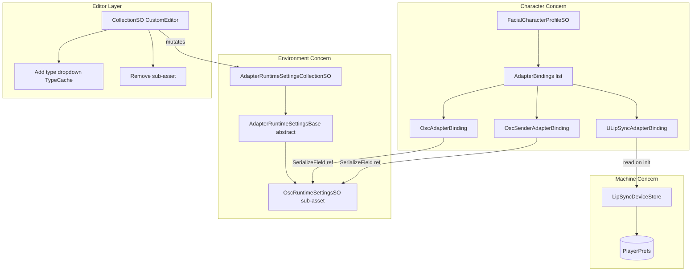
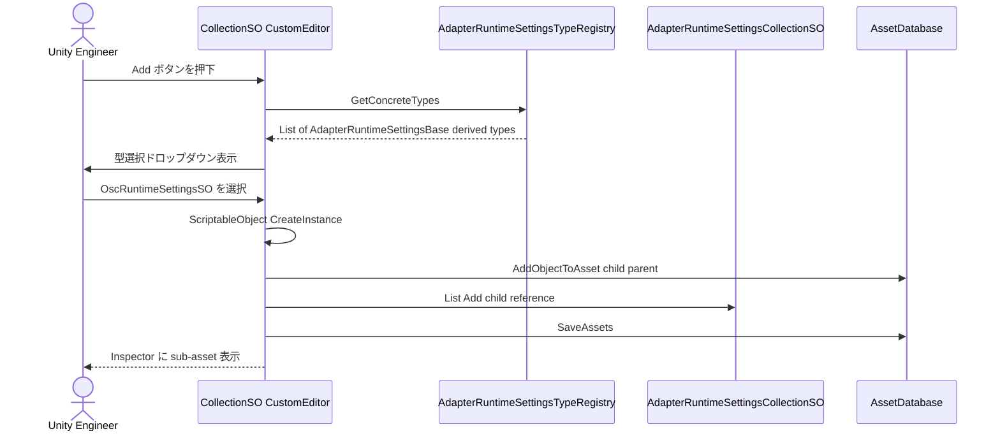
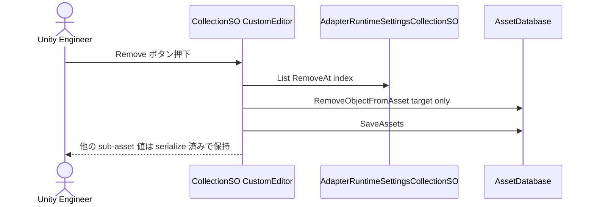
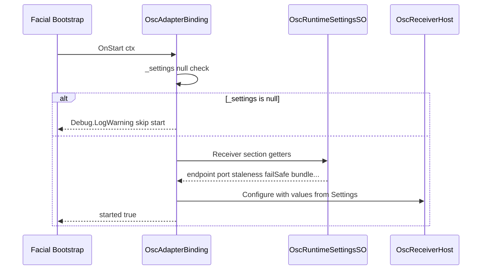
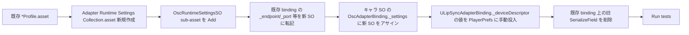

# Adapter Runtime Settings 技術設計書

## Overview

本機能は、現在 `FacialCharacterProfileSO` (キャラ SO) に埋め込まれている「環境/運用/マシン依存」設定を、適切な格納先に再配置するリファクタリングである。OSC ポート・IP・bundle 系設定・マイクデバイス名などの環境依存値が `[SerializeField]` としてキャラ SO に同居しているため、環境差分が git diff を生み、複数環境でのキャラ SO 再利用が阻害されている。

**Purpose**: 本機能は Unity エンジニア (パッケージ利用者) に対して、キャラ依存と環境/マシン依存を明確に分離した Adapter 設定構造を提供し、同一キャラ SO を環境/マシンを越えて git diff なしで再利用できるようにする。

**Users**: パッケージ利用者は本機能を、(a) `OscRuntimeSettingsSO` を環境ごとに用意して切り替える、(b) マシンごとに PlayerPrefs に格納された MicDevice 設定を自然に分離する、というワークフローで利用する。

**Impact**: 既存の `OscAdapterBinding._endpoint/_port/...`、`OscSenderAdapterBinding._endpoints/...`、`ULipSyncAdapterBinding._deviceDescriptor` を削除し、それらを「親 SO + Sub-asset SO 集約 (方式 3)」と PlayerPrefs に再配置する。preview 段階のため既存 Asset との後方互換は提供しない (要件 8.5)。

### Goals
- キャラ SO から環境/運用/マシン依存項目を完全に切り離す (要件 1)
- `AdapterRuntimeSettingsCollectionSO` 親 SO + `AdapterRuntimeSettingsBase` 派生 sub-asset の集約構造を確立する (要件 2)
- パラメータ消失防止保証 (対応レベル b: 追加/削除/型追加が安全) を満たす CustomEditor を提供する (要件 3, 6)
- マシン依存値 (マイクデバイス) を PlayerPrefs に切り出す (要件 4)
- 将来の型削除/リネーム対応 (対応レベル c) のための拡張点 (`_schemaVersion`/`ToJson`/`FromJson`) を仕込む (要件 5)
- EditMode/PlayMode 両方の TDD カバレッジを刷新する (要件 7)

### Non-Goals
- Adapter 種別の C# 型削除/リネーム時の自動マイグレーション (将来別 spec)
- `OscAdapterBinding` と `OscSenderAdapterBinding` の統合 (現行 2 Binding 構造維持)
- `enabled` フラグによる動作停止機構 (AdapterBindings リストからの除外で代替)
- ランタイムでの動的設定変更 UI
- 既存 SO Asset データとの後方互換 (preview 段階のため不要)

## Boundary Commitments

### This Spec Owns
- `AdapterRuntimeSettingsBase` (abstract `ScriptableObject`) と `AdapterRuntimeSettingsCollectionSO` の新規定義、配置先、およびそれらの sub-asset 永続化規約
- `OscRuntimeSettingsSO` (Receiver/Sender セクション統合) の新規定義およびフィールド・JSON 契約
- `OscAdapterBinding` / `OscSenderAdapterBinding` から環境/運用依存フィールドを削除し、`OscRuntimeSettingsSO` への `[SerializeField]` 参照へ差し替える改修
- `ULipSyncAdapterBinding` から `_deviceDescriptor` を削除し、PlayerPrefs ベースの `LipSyncDeviceStore` 経由に差し替える改修
- `AdapterRuntimeSettingsCollectionSO` 用 CustomEditor (UI Toolkit、sub-asset 追加/削除 UI)
- 既存テストの新構造への全面修正と、新 SO 用 EditMode/PlayMode テストの追加

### Out of Boundary
- 既存 `FacialCharacterProfileSO` Asset の自動マイグレーションスクリプト (preview のため手動再構築)
- `ArKitOscAdapterBinding` の環境依存項目分離 (現状の単純な `_endpoint/_port` を持つため必要なら本 spec で同時改修するが、要件には明記されないので「同等扱いで `OscRuntimeSettingsSO` を参照させる」拡張は本 spec の Optional Implementation Note に留め、必須事項としては扱わない)
- 動的マイグレーション処理本体 (本 spec は拡張点予約のみ)
- AdapterBindings リスト UI (キャラ SO 側の既存 UI に変更を加えない)

### Allowed Dependencies
- `Hidano.FacialControl.Domain` (新規 Base/Collection の名前空間ルート)
- `Hidano.FacialControl.Adapters` (Collection SO の実体配置先、`UnityEngine.ScriptableObject` 参照)
- `Hidano.FacialControl.Osc` (OscRuntimeSettingsSO 配置先)
- `Hidano.FacialControl.LipSync` (LipSyncDeviceStore 配置先)
- `UnityEditor.AssetDatabase` (Editor 側のみ)
- `UnityEngine.PlayerPrefs` (LipSyncDeviceStore のみ)
- 既存 `AdapterBindingBase`, `AdapterBuildContext`, `IInputSourceRegistry` 等の Domain 契約

### Revalidation Triggers
- `OscRuntimeSettingsSO` の Receiver/Sender セクション統合解消 (再分割する設計変更)
- `AdapterRuntimeSettingsBase` の継承構造変更 (例: 中間抽象クラスの追加)
- `LipSyncDeviceStore` のキー名規約変更
- `_schemaVersion` 既定値の変更や、`ToJson`/`FromJson` シグネチャ変更
- `FacialCharacterProfileSO` の AdapterBindings リスト構造変更

## Architecture

### Existing Architecture Analysis
- `FacialCharacterProfileSO` (Adapters 層) が `[SerializeReference] List<AdapterBindingBase> _adapterBindings` で binding ポリモフィズムを保持する構造
- `AdapterBindingBase` (Domain 層) は `Slug` + lifecycle hook (`OnStart`/`OnTick`/`OnLateTick`/`OnFixedTick`/`Dispose`) を提供。Unity 依存を持たない
- 具象 binding (`OscAdapterBinding`/`OscSenderAdapterBinding`/`ULipSyncAdapterBinding`) は `[Serializable]` + `[FacialAdapterBinding]` 属性で識別され、`PropertyDrawer` 経由で UI Toolkit Inspector が提供される
- 現行は環境依存値もキャラ SO 内に inline される設計のため、git diff/環境切替が課題

### Architecture Pattern & Boundary Map



**Architecture Integration**:
- 採用パターン: **Aggregate Settings Asset (親 SO + Sub-asset)** + **Per-machine PlayerPrefs Adapter**。要件 2 で合意済みの「方式 3」を直訳する形で実装する
- ドメイン境界: 「Character (キャラ依存)」「Environment (運用/プロジェクト共有)」「Machine (個人マシン)」の 3 関心事を別 Asset/別永続化機構で物理分離する
- 既存パターン継承: `AdapterBindingBase` の polymorphic lifecycle、`[SerializeReference]` による binding 直列化、UI Toolkit PropertyDrawer は維持
- 新規コンポーネント根拠: `AdapterRuntimeSettingsBase` は「Adapter 横断で共有可能な、対応レベル b/c の対象となる設定種別の基底」。`AdapterRuntimeSettingsCollectionSO` は「複数 SettingsSO を 1 Project Asset にまとめる集約点」。両者なしでは sub-asset 構造とパラメータ消失防止保証を統一規約として表現できない
- Steering 準拠: クリーンアーキテクチャ依存方向 (Domain ← Application ← Adapters)、Editor は UI Toolkit、JSON ファースト永続化 (`ToJson`/`FromJson` 拡張点)、エラーハンドリングは `Debug.LogWarning` のみを維持

### Technology Stack

| Layer | Choice / Version | Role in Feature | Notes |
|-------|------------------|-----------------|-------|
| Frontend / Editor | Unity 6000.3.2f1 / UI Toolkit | Collection SO Inspector、sub-asset 追加/削除 UI | IMGUI を新規 UI に使わない (steering 規約) |
| Backend / Runtime | C# 9 / Unity ScriptableObject | Settings SO の serialize、binding 参照解決 | `[SerializeField]` で参照を保持 |
| Data / Storage (project) | Unity AssetDatabase / sub-asset | `*.asset` ファイルに sub-asset を `AddObjectToAsset` で内包 | 親 1 ファイル = sub-asset ツリー |
| Data / Storage (machine) | UnityEngine.PlayerPrefs | マイクデバイス名/Disambiguator の永続化 | Windows レジストリ / Mac plist 等 OS 標準位置 |
| Data / Interchange | JsonUtility | `ToJson`/`FromJson` 拡張点 | コア JSON 経路と整合させるため `JsonUtility` ベース (steering の System.Text.Json 不使用方針) |

## File Structure Plan

### Directory Structure

```
Packages/com.hidano.facialcontrol/                     # Core パッケージ
└── Runtime/Adapters/RuntimeSettings/                  # 新規ディレクトリ
    ├── AdapterRuntimeSettingsBase.cs                  # abstract ScriptableObject (Adapters 層配置)
    └── AdapterRuntimeSettingsCollectionSO.cs          # 親 SO (CreateAssetMenu)

Packages/com.hidano.facialcontrol/Editor/
└── Inspector/RuntimeSettings/                         # 新規ディレクトリ
    ├── AdapterRuntimeSettingsCollectionEditor.cs      # CustomEditor (UI Toolkit)
    └── AdapterRuntimeSettingsTypeRegistry.cs          # TypeCache 経由の派生型探索 helper

Packages/com.hidano.facialcontrol.osc/
└── Runtime/Adapters/RuntimeSettings/                  # 新規ディレクトリ
    └── OscRuntimeSettingsSO.cs                        # AdapterRuntimeSettingsBase 派生 (Receiver/Sender 統合)

Packages/com.hidano.facialcontrol.lipsync/
└── Runtime/Adapters/Devices/
    └── LipSyncDeviceStore.cs                          # 新規: PlayerPrefs ラッパー (static class)

Packages/com.hidano.facialcontrol.osc/Tests/EditMode/Adapters/RuntimeSettings/
├── AdapterRuntimeSettingsCollectionSOTests.cs         # sub-asset 追加/削除 + パラメータ消失防止
├── OscRuntimeSettingsSOTests.cs                       # Serialize/Deserialize
└── OscRuntimeSettingsJsonRoundTripTests.cs            # ToJson/FromJson round-trip

Packages/com.hidano.facialcontrol.osc/Tests/PlayMode/Integration/
└── OscAdapterBindingSettingsReferenceTests.cs        # 新規: SO 参照経由で UDP 送受信が動くこと

Packages/com.hidano.facialcontrol.lipsync/Tests/EditMode/Adapters/Devices/
└── LipSyncDeviceStoreTests.cs                         # PlayerPrefs バックエンド差し替え方式テスト

Packages/com.hidano.facialcontrol.lipsync/Tests/PlayMode/Lifecycle/
└── ULipSyncAdapterBindingDeviceStoreTests.cs         # 既存 binding lifecycle テストを DeviceStore 経由に差し替え
```

### Modified Files
- `Packages/com.hidano.facialcontrol.osc/Runtime/Adapters/AdapterBindings/OscAdapterBinding.cs` — `_endpoint`/`_port`/`_stalenessSeconds`/`_failSafeMode`/`_bundleMode`/`_bundleAccumulationTimeoutMs` を削除し、`[SerializeField] private OscRuntimeSettingsSO _settings;` を追加。`OnStart` 時に `_settings.Receiver` セクションを読む
- `Packages/com.hidano.facialcontrol.osc/Runtime/Adapters/AdapterBindings/OscSenderAdapterBinding.cs` — `_endpoints`/`_heartbeatIntervalSeconds`/`_suppressLoopback` を削除し、`[SerializeField] private OscRuntimeSettingsSO _settings;` を追加。`OnStart` 時に `_settings.Sender` セクションを読む。`_blendShapeNames`/`_gazeExpressionIds` は据え置き
- `Packages/com.hidano.facialcontrol.osc/Editor/AdapterBindings/OscAdapterBindingDrawer.cs` — 環境依存フィールドの inline 編集 UI を削除し、`OscRuntimeSettingsSO` への ObjectField (`AssignableType=OscRuntimeSettingsSO`) を追加
- `Packages/com.hidano.facialcontrol.osc/Editor/AdapterBindings/OscSenderAdapterBindingDrawer.cs` — 同上
- `Packages/com.hidano.facialcontrol.lipsync/Runtime/Adapters/ULipSyncAdapterBinding.cs` — `[SerializeField] private DeviceDescriptor _deviceDescriptor;` を削除し、`OnStart` 内で `LipSyncDeviceStore.Load()` を呼ぶように変更。`Configure(DeviceDescriptor ...)` API は引き続き残し、テストからは直接 descriptor を流し込めるようにする
- `Packages/com.hidano.facialcontrol.lipsync/Editor/Inspector/ULipSyncAdapterBindingDrawer.cs` — `_deviceDescriptor` フィールド UI を削除。代わりに `LipSyncDeviceStore` を介して PlayerPrefs に保存する DeviceDescriptorPopup を結線 (PropertyDrawer ではなく Editor 専用 helper 経由)
- 既存テスト群 (35 ファイル中、対象キーワードを使う各ファイル) — 旧フィールド参照をすべて `OscRuntimeSettingsSO` または `LipSyncDeviceStore` の API 経由に書き換える

## System Flows

### Sub-asset 追加フロー (要件 6)



**Key Decisions**:
- 型探索は `TypeCache.GetTypesDerivedFrom<AdapterRuntimeSettingsBase>()` を Editor 専用 helper でラップ。Runtime 側に Editor 依存を漏らさない
- 同型 sub-asset の複数登録を許可するため (要件 6.6)、`_label` フィールドで識別する。重複時は `Debug.LogWarning` で通知し追加自体は許可する (要件 6.8)

### Sub-asset 削除フロー (要件 3.3, 6.4)



**Key Decisions**:
- `RemoveObjectFromAsset` は対象 sub-asset のみを切り離す API。他の sub-asset の serialize 済み値は影響を受けない (要件 3.3 を満たす唯一の標準 API)
- 削除時に外部 `AdapterBindings` から参照されている可能性があるため、削除前に Project 内の `AdapterBindingBase` 派生から検索する操作は本 spec ではスコープ外とし、参照欠落は `MissingReferenceException` でなく Unity 標準の serialized field 欠落 (null) として現れる。利用者は `OscAdapterBinding._settings` を再アサインする運用

### AdapterBinding 起動時の Settings 読込 (要件 2.5-2.7)



## Requirements Traceability

| Requirement | Summary | Components | Interfaces | Flows |
|-------------|---------|------------|------------|-------|
| 1.1 | キャラ SO は環境依存値を直接フィールドで持たない | FacialCharacterProfileSO (改修なし、新規追加もなし) | - | - |
| 1.2 | キャラ SO は列挙されたキャラ依存項目を保持し続ける | 既存 binding 群 (改修対象から該当フィールドを除外) | - | - |
| 1.3 | Collection が OscRuntimeSettingsSO sub-asset を保持 | AdapterRuntimeSettingsCollectionSO, OscRuntimeSettingsSO | Sub-asset 集約契約 | Sub-asset 追加フロー |
| 1.4 | LipSyncDeviceStore が PlayerPrefs キーで保存 | LipSyncDeviceStore | Static API | - |
| 1.5 | 同一キャラ SO を異なる環境で git diff 無しに再利用 | OscRuntimeSettingsSO (環境ごとに差替可) | SettingsSO 参照差し替え | - |
| 2.1 | Base は abstract ScriptableObject | AdapterRuntimeSettingsBase | - | - |
| 2.2 | Collection は List で sub-asset を束ねる | AdapterRuntimeSettingsCollectionSO | List sub-asset 参照 | - |
| 2.3 | Project ビューでフォールドツリー表示 | Unity 標準 sub-asset 機構 (AddObjectToAsset) | - | Sub-asset 追加フロー |
| 2.4 | OscRuntimeSettingsSO は Receiver/Sender 統合 | OscRuntimeSettingsSO | Receiver/Sender セクション getter | - |
| 2.5 | OscAdapterBinding は OscRuntimeSettingsSO 1 参照 | OscAdapterBinding | SerializeField OscRuntimeSettingsSO | AdapterBinding 起動 |
| 2.6 | OscSenderAdapterBinding も同様 | OscSenderAdapterBinding | SerializeField OscRuntimeSettingsSO | AdapterBinding 起動 |
| 2.7 | 同一 SO 参照時 Receiver/Sender 一貫 | OscRuntimeSettingsSO 単一 SO | - | - |
| 3.1 | Sub-asset 追加で既存値を保持 | CollectionEditor (AssetDatabase.AddObjectToAsset) | - | Sub-asset 追加フロー |
| 3.2 | 新規 C# 型追加で既存値消失なし | TypeRegistry + Unity script-serialization | - | - |
| 3.3 | 削除は対象 sub-asset のみ除去 | CollectionEditor (RemoveObjectFromAsset) | - | Sub-asset 削除フロー |
| 3.4 | 対応レベル b 満たす | (上記 3.1-3.3 の総和) | - | - |
| 3.5 | 対応レベル c はスコープ外 | (Non-Goals 明記) | - | - |
| 4.1 | ULipSync は _deviceDescriptor を持たない | ULipSyncAdapterBinding 改修 | - | - |
| 4.2 | LipSyncDeviceStore が PlayerPrefs ラッパー API 提供 | LipSyncDeviceStore | Load/Save 静的 API | - |
| 4.3 | binding 初期化で LipSyncDeviceStore 経由読出 | ULipSyncAdapterBinding | - | - |
| 4.4 | キー欠落時に既定値 (空 string/0) を返し例外を投げない | LipSyncDeviceStore.Load | - | - |
| 4.5 | UI で選択時に LipSyncDeviceStore 経由保存 | DeviceDescriptorPopup 経由 | LipSyncDeviceStore.Save | - |
| 4.6 | PlayerPrefs 以外の永続化機構を併用しない | LipSyncDeviceStore (PlayerPrefs のみ) | - | - |
| 5.1 | _schemaVersion フィールド、規定値 1 | AdapterRuntimeSettingsBase | SerializeField int | - |
| 5.2 | 仮想 ToJson/FromJson 公開 | AdapterRuntimeSettingsBase | virtual string ToJson / virtual void FromJson string | - |
| 5.3 | OscRuntimeSettingsSO が override | OscRuntimeSettingsSO | override ToJson/FromJson | - |
| 5.4 | Collection OnEnable にマイグレーション拡張点予約 | AdapterRuntimeSettingsCollectionSO.OnEnable | partial hook or commented seam | - |
| 5.5 | 実装はせず予約のみ | (本 spec 完了条件) | - | - |
| 5.6 | _schemaVersion でバージョン差分を判定できる | AdapterRuntimeSettingsBase.SchemaVersion property | - | - |
| 6.1 | CustomEditor 属性付与 | AdapterRuntimeSettingsCollectionEditor | CustomEditor typeof | - |
| 6.2 | Add ボタンで型一覧 UI 表示 | CollectionEditor + TypeRegistry | TypeCache 経由 | Sub-asset 追加フロー |
| 6.3 | Add 確定で CreateInstance/AddObjectToAsset/List 登録 | CollectionEditor | - | Sub-asset 追加フロー |
| 6.4 | Remove ボタンで RemoveObjectFromAsset + List 除去 + SaveAssets | CollectionEditor | - | Sub-asset 削除フロー |
| 6.5 | UI Toolkit で実装 | CollectionEditor | VisualElement | - |
| 6.6 | 同型 sub-asset 複数登録を許可 | CollectionEditor | - | - |
| 6.7 | _label フィールドで識別 | AdapterRuntimeSettingsBase | SerializeField string _label | - |
| 6.8 | 重複 _label で警告 (追加は許可) | CollectionEditor | Debug.LogWarning | - |
| 7.1 | EditMode: sub-asset 追加/削除でパラメータ消失なし検証 | AdapterRuntimeSettingsCollectionSOTests | - | - |
| 7.2 | EditMode: OscRuntimeSettingsSO serialize/deserialize 検証 | OscRuntimeSettingsSOTests | - | - |
| 7.3 | EditMode: ToJson/FromJson ラウンドトリップ全フィールド保持 | OscRuntimeSettingsJsonRoundTripTests | - | - |
| 7.4 | EditMode: LipSyncDeviceStore テストは実 PlayerPrefs 不使用 | LipSyncDeviceStoreTests + IPlayerPrefsBackend Fake | - | - |
| 7.5 | PlayMode: OscBinding が SettingsSO 経由で UDP 送受信 | OscAdapterBindingSettingsReferenceTests | - | - |
| 7.6 | PlayMode: ULipSync が DeviceStore 経由 DeviceName でマイク初期化 | ULipSyncAdapterBindingDeviceStoreTests | - | - |
| 7.7 | 旧フィールド参照を全テストから除去 | 既存テスト群の改修 | - | - |
| 7.8 | テスト命名規則準拠 | 全新規/改修テスト | - | - |
| 8.1-8.5 | スコープ外項目を明示 | (Non-Goals/Out of Boundary 節) | - | - |
| 8.6 | スコープ外踏み込み時は backlog/別 spec | (運用ルール、設計成果物外) | - | - |

## Components and Interfaces

| Component | Domain/Layer | Intent | Req Coverage | Key Dependencies (P0/P1) | Contracts |
|-----------|--------------|--------|--------------|--------------------------|-----------|
| AdapterRuntimeSettingsBase | Adapters (core) | sub-asset 共通基底、_label/_schemaVersion/ToJson/FromJson 拡張点を提供 | 2.1, 5.1, 5.2, 5.6, 6.7 | UnityEngine.ScriptableObject (P0) | Service, State |
| AdapterRuntimeSettingsCollectionSO | Adapters (core) | 親 SO、List<Base> + マイグレーション拡張点予約 | 1.3, 2.2, 2.3, 3.1-3.4, 5.4, 5.5 | UnityEngine.ScriptableObject (P0), AdapterRuntimeSettingsBase (P0) | Service, State |
| OscRuntimeSettingsSO | Adapters (osc) | Receiver/Sender セクション統合の具象 SettingsSO | 1.3, 2.4, 5.3, 7.2, 7.3 | AdapterRuntimeSettingsBase (P0), OscSenderEndpointConfig (P0), OscMappingEntry (P1) | Service, State |
| OscAdapterBinding (改修) | Adapters (osc) | Receiver セクションを SettingsSO 経由で参照 | 1.1, 2.5, 2.7, 7.5 | OscRuntimeSettingsSO (P0) | Service |
| OscSenderAdapterBinding (改修) | Adapters (osc) | Sender セクションを SettingsSO 経由で参照 | 1.1, 2.6, 2.7, 7.5 | OscRuntimeSettingsSO (P0) | Service |
| LipSyncDeviceStore | Adapters (lipsync) | PlayerPrefs ラッパー静的 API | 1.4, 4.1-4.6, 7.4 | UnityEngine.PlayerPrefs (P0), IPlayerPrefsBackend (P1) | Service |
| ULipSyncAdapterBinding (改修) | Adapters (lipsync) | DeviceStore 経由で DeviceDescriptor を取得 | 4.1, 4.3, 7.6 | LipSyncDeviceStore (P0) | Service |
| AdapterRuntimeSettingsCollectionEditor | Editor (core) | CustomEditor / sub-asset 追加削除 UI (UI Toolkit) | 6.1-6.8, 3.1-3.4 | AssetDatabase (P0), AdapterRuntimeSettingsTypeRegistry (P0) | Service |
| AdapterRuntimeSettingsTypeRegistry | Editor (core) | TypeCache で派生型を列挙 | 6.2 | UnityEditor.TypeCache (P0) | Service |

### Adapters (Core) Layer

#### AdapterRuntimeSettingsBase

| Field | Detail |
|-------|--------|
| Intent | Adapter 横断で共有可能な設定種別の sub-asset 共通基底 |
| Requirements | 2.1, 5.1, 5.2, 5.6, 6.7 |

**Responsibilities & Constraints**
- `[SerializeField] private string _label` を保持し、同型 sub-asset の識別子を提供する
- `[SerializeField] protected int _schemaVersion = 1` を保持し、サブクラスがバージョン判定可能にする
- `virtual string ToJson()` / `virtual void FromJson(string json)` を公開し、サブクラスでの override を可能にする (基底実装はサブクラス未対応時に `string.Empty` を返し `Debug.LogWarning` を出す no-op フォールバック)
- `abstract` クラスとして直接 `CreateInstance` できない。具象型は派生先で定義する
- Unity 6 のサブクラス serialization 規約に従い、`[CreateAssetMenu]` は付けない (sub-asset 専用)

**Dependencies**
- Inbound: `AdapterRuntimeSettingsCollectionSO` — sub-asset 集約のための List 要素型として参照 (P0)
- Outbound: なし
- External: `UnityEngine.ScriptableObject` — 派生継承 (P0)

**Contracts**: Service [x] / API [ ] / Event [ ] / Batch [ ] / State [x]

##### Service Interface

```csharp
public abstract class AdapterRuntimeSettingsBase : UnityEngine.ScriptableObject
{
    public string Label { get; }              // _label の getter
    public int SchemaVersion { get; }         // _schemaVersion の getter

    public virtual string ToJson();           // 既定実装: 空文字 + warning
    public virtual void FromJson(string json); // 既定実装: warning のみ
}
```
- Preconditions: 派生型が `[Serializable]` 由来 serialize 可能フィールドを定義していること
- Postconditions: `ToJson()` がサブクラスでの round-trip 用 JSON を返す (サブクラス義務)
- Invariants: `_schemaVersion` は派生型の `OnEnable` までに 1 以上が代入されている

**Implementation Notes**
- Integration: 派生型は `OnEnable` 時に `_schemaVersion == 0` (Unity 既定) を検出したら `_schemaVersion = 1` に正規化する (新規 sub-asset 生成直後の保護)
- Validation: `_label` の重複チェックは Editor 側で実施 (基底は値を素通し)
- Risks: `ToJson`/`FromJson` の既定実装が「サブクラス未対応時にユーザーに気付かれにくい」リスクがあるため、`Debug.LogWarning` で「override 必要」を明示する

#### AdapterRuntimeSettingsCollectionSO

| Field | Detail |
|-------|--------|
| Intent | 親 SO として複数 sub-asset を 1 ファイルにまとめ、binding が間接的に依存できる集約点を提供 |
| Requirements | 1.3, 2.2, 2.3, 3.1-3.4, 5.4, 5.5 |

**Responsibilities & Constraints**
- `[SerializeField] private List<AdapterRuntimeSettingsBase> _items = new()` を保持する (Unity ScriptableObject は polymorphic な ScriptableObject 参照を `[SerializeField]` のみで serialize 可能。`[SerializeReference]` は不要)
- `OnEnable()` でマイグレーション拡張点 (空のフックメソッド `protected virtual void MigrateOnLoad() { }` または明示コメントブロック) を予約する (要件 5.4)
- マイグレーション処理本体は実装しない (要件 5.5)
- `CreateAssetMenu` を付与し、Project ビューから 1 ファイル作成可能 (`menuName = "FacialControl/Adapter Runtime Settings Collection"`)

**Dependencies**
- Inbound: `OscAdapterBinding` / `OscSenderAdapterBinding` — 直接ではなく、それぞれが Collection 内の `OscRuntimeSettingsSO` sub-asset を `[SerializeField]` で参照 (P1)
- Outbound: `AdapterRuntimeSettingsBase` (P0)
- External: `UnityEngine.ScriptableObject` (P0)

**Contracts**: Service [x] / API [ ] / Event [ ] / Batch [ ] / State [x]

##### Service Interface

```csharp
[CreateAssetMenu(menuName = "FacialControl/Adapter Runtime Settings Collection")]
public sealed class AdapterRuntimeSettingsCollectionSO : UnityEngine.ScriptableObject
{
    public IReadOnlyList<AdapterRuntimeSettingsBase> Items { get; } // _items 露出 (read-only)

    public T TryFind<T>() where T : AdapterRuntimeSettingsBase;     // 同型のうち先頭
    public T TryFind<T>(string label) where T : AdapterRuntimeSettingsBase; // _label 一致

    protected virtual void OnEnable();        // マイグレーション拡張点 (本 spec では no-op)
}
```
- Preconditions: `_items` 内に null 要素が無い (Editor 操作で null を排除)
- Postconditions: `TryFind<T>` は無い場合 `null` を返す (例外は投げない)
- Invariants: List の各要素は親 Asset の sub-asset として `AssetDatabase` 上に存在する (Editor が保証)

**Implementation Notes**
- Integration: binding は `_settings` フィールドを Collection ではなく **具象 sub-asset (`OscRuntimeSettingsSO`)** に直接付ける (要件 2.5/2.6)。Collection は「Project ビューで 1 ファイルに見せる」役割であり、参照経路は具象 SO 経由のため、ランタイム探索コスト無し
- Validation: `OnEnable` 内で `_items` 中の null 要素を検知したら `Debug.LogWarning` で削除推奨を通知
- Risks: 親 Asset と sub-asset の親子関係が `AssetDatabase` 側でのみ管理されるため、ファイルシステム直接操作 (例: `.asset` ファイルを別フォルダにコピー) で sub-asset が孤児化する可能性。Editor README で注意喚起

### Adapters (OSC) Layer

#### OscRuntimeSettingsSO

| Field | Detail |
|-------|--------|
| Intent | OSC Receiver/Sender の環境/運用依存設定を 1 sub-asset に統合 |
| Requirements | 1.3, 2.4, 5.3, 7.2, 7.3 |

**Responsibilities & Constraints**
- Receiver セクション: `string ListenEndpoint`, `int ListenPort`, `float StalenessSeconds`, `FailSafeMode FailSafeMode`, `bool ConsistencyCheckWarnLog`, `BundleInterpretationMode BundleMode`, `float BundleAccumulationTimeoutMs`
- Sender セクション: `List<OscSenderEndpointConfig> Endpoints`, `float HeartbeatIntervalSeconds`, `bool SuppressLoopback`
- 両セクションは独立。`OscAdapterBinding` は Receiver のみ、`OscSenderAdapterBinding` は Sender のみを読む (要件 2.5/2.6)
- `ToJson` / `FromJson` を override し、Receiver/Sender 全フィールドをラウンドトリップする (要件 5.3, 7.3)

**Dependencies**
- Inbound: `OscAdapterBinding`, `OscSenderAdapterBinding` (P0)
- Outbound: `AdapterRuntimeSettingsBase` (P0), `OscSenderEndpointConfig` (P0), `FailSafeMode`/`BundleInterpretationMode` enums (P1)
- External: `UnityEngine.JsonUtility` (P0)

**Contracts**: Service [x] / API [ ] / Event [ ] / Batch [ ] / State [x]

##### Service Interface

```csharp
public sealed class OscRuntimeSettingsSO : AdapterRuntimeSettingsBase
{
    // Receiver section
    public string ListenEndpoint { get; }
    public int ListenPort { get; }
    public float StalenessSeconds { get; }
    public FailSafeMode FailSafeMode { get; }
    public bool ConsistencyCheckWarnLog { get; }
    public BundleInterpretationMode BundleMode { get; }
    public float BundleAccumulationTimeoutMs { get; }

    // Sender section
    public IReadOnlyList<OscSenderEndpointConfig> Endpoints { get; }
    public float HeartbeatIntervalSeconds { get; }
    public bool SuppressLoopback { get; }

    public override string ToJson();
    public override void FromJson(string json);
}
```
- Preconditions: 各フィールドが Unity Inspector または `FromJson` 経由で正規化済み (`OnAfterDeserialize` で defaults を適用)
- Postconditions: `ToJson()` の結果を `FromJson()` に渡すと全フィールド一致 (round-trip 性、要件 7.3)
- Invariants: `ListenPort` は 1..65535、`StalenessSeconds >= 0`、`BundleAccumulationTimeoutMs > 0`、`HeartbeatIntervalSeconds > 0`

**Implementation Notes**
- Integration: 内部表現は既存の `OscReceiverOptionsDto` / `OscSenderOptionsDto` を再利用しない (DTO は JSON Profile 経由の経路。SettingsSO は SO 経路で独立)。ただし JSON ラウンドトリップ実装には `OscReceiverOptionsDto.ToJson/FromJson` 相当の正規化ロジックを移植する
- Validation: `ISerializationCallbackReceiver.OnAfterDeserialize` で port 範囲・timeout 正値・enum 正規化を実施
- Risks: Receiver/Sender を統合したことで「Receiver だけ別 SO」運用ができない。要件 6.6 で同型複数 sub-asset を許容するため、利用者は Receiver 用 SO と Sender 用 SO を 2 つ作って binding 側で別 SO を参照させることで分離可能 (Sender セクションを空のままにする SO を作る、等)

#### OscAdapterBinding (改修)

| Field | Detail |
|-------|--------|
| Intent | Receiver セクションを SettingsSO 経由で参照する |
| Requirements | 1.1, 2.5, 2.7, 7.5 |

**Responsibilities & Constraints**
- 削除フィールド: `_endpoint`, `_port`, `_stalenessSeconds`, `_failSafeMode`, `_bundleMode`, `_bundleAccumulationTimeoutMs` (`_consistencyCheckWarnLog` も Receiver 系のため `OscRuntimeSettingsSO` 側に移管)
- 残存フィールド: `_mappings` (キャラ依存、要件 1.2)
- 追加フィールド: `[SerializeField] private OscRuntimeSettingsSO _settings`
- `OnStart` で `_settings == null` の場合 `Debug.LogWarning` を出し start をスキップする (fail-fast)
- 既存 `Configure(endpoint, port, mappings)` API は **後方互換のため残す**: `_settings` が未代入時はテストから直接値を流し込める診断モードとして機能

**Dependencies**
- Inbound: `FacialCharacterProfileSO._adapterBindings` (P0)
- Outbound: `OscRuntimeSettingsSO` (P0), `OscReceiverHost` (P0)
- External: `uOSC.Runtime` (P0)

**Contracts**: Service [x] / API [ ] / Event [ ] / Batch [ ] / State [x]

**Implementation Notes**
- Integration: PropertyDrawer は `_settings` への ObjectField を追加し、削除フィールドの UI を完全に取り除く
- Validation: `_settings.ListenPort` が 0 などの不正値の場合は `OscRuntimeSettingsSO` 側の `OnAfterDeserialize` で既定値に正規化される
- Risks: `_settings` 未代入のキャラ SO が dev で量産される懸念。Drawer に「未設定時は OSC Adapter は起動しない」HelpBox を出す

#### OscSenderAdapterBinding (改修)

| Field | Detail |
|-------|--------|
| Intent | Sender セクションを SettingsSO 経由で参照する |
| Requirements | 1.1, 2.6, 2.7, 7.5 |

**Responsibilities & Constraints**
- 削除フィールド: `_endpoints`, `_heartbeatIntervalSeconds`, `_suppressLoopback`
- 残存フィールド: `_blendShapeNames`, `_gazeExpressionIds`
- 追加フィールド: `[SerializeField] private OscRuntimeSettingsSO _settings`
- `Configure(endpoint, port, ...)` 系 API は残し、テストから直接 endpoint 設定を可能にする

**Contracts**: Service [x] / API [ ] / Event [ ] / Batch [ ] / State [x]

**Implementation Notes**
- Integration: `OnStart` 内の `EnsureEndpointList()` 経路を `_settings != null ? _settings.Endpoints : _legacyEndpoints` のフォールバックで二段化することは行わない (preview のため後方互換不要)。`_settings == null` は warning + skip
- Risks: `_settings` を `OscAdapterBinding` と共有することで Receiver/Sender を同期できる (要件 2.7)。Receiver/Sender 別 SO を持ちたい利用者向けには別 SO を Inspector で割り当てる運用を案内

### Adapters (LipSync) Layer

#### LipSyncDeviceStore

| Field | Detail |
|-------|--------|
| Intent | PlayerPrefs の get/set を 2 キーに集約する静的ラッパー |
| Requirements | 1.4, 4.1-4.6, 7.4 |

**Responsibilities & Constraints**
- キー: `Hidano.FacialControl.LipSync.MicDevice.Name` (string) / `Hidano.FacialControl.LipSync.MicDevice.Disambiguator` (int)
- 既定値: DeviceName=`""`, Disambiguator=`0`
- PlayerPrefs 以外の永続化機構を併用しない (要件 4.6)
- テスト時の実 PlayerPrefs 書き込み回避のため、`IPlayerPrefsBackend` interface + 内部 backend 差し替え機構を持つ (要件 7.4)

**Dependencies**
- Inbound: `ULipSyncAdapterBinding`, `DeviceDescriptorPopup` (Editor) (P0)
- Outbound: `IPlayerPrefsBackend` (P1)
- External: `UnityEngine.PlayerPrefs` (P0)

**Contracts**: Service [x] / API [ ] / Event [ ] / Batch [ ] / State [x]

##### Service Interface

```csharp
public static class LipSyncDeviceStore
{
    public const string KeyName = "Hidano.FacialControl.LipSync.MicDevice.Name";
    public const string KeyDisambiguator = "Hidano.FacialControl.LipSync.MicDevice.Disambiguator";

    public static DeviceDescriptor Load();        // 欠落キーは既定値返却 (要件 4.4)
    public static void Save(DeviceDescriptor descriptor);

    // テスト hook (internal + InternalsVisibleTo)
    internal static void SetBackend(IPlayerPrefsBackend backend);
    internal static void ResetBackend(); // default backend に戻す
}

internal interface IPlayerPrefsBackend
{
    string GetString(string key, string defaultValue);
    int GetInt(string key, int defaultValue);
    void SetString(string key, string value);
    void SetInt(string key, int value);
    void Save();
}
```
- Preconditions: なし (キー欠落でも例外を投げない)
- Postconditions: `Save` 後の `Load` は同値を返す (round-trip)。`Save` は内部で `PlayerPrefs.Save()` を呼ぶ
- Invariants: 静的 backend は scene 切替・assembly reload で `DefaultPlayerPrefsBackend` に戻る

**Implementation Notes**
- Integration: テストは `[SetUp]` で `SetBackend(new FakePlayerPrefsBackend())`、`[TearDown]` で `ResetBackend()` を呼ぶ
- Validation: `Save` 時に `DeviceName` が null の場合は空文字に正規化
- Risks: 静的 backend のため複数テストフィクスチャ間で漏れると干渉する。`[TearDown]` での確実な reset を test base class で強制する

#### ULipSyncAdapterBinding (改修)

| Field | Detail |
|-------|--------|
| Intent | DeviceDescriptor を SerializeField から LipSyncDeviceStore 読出に変更 |
| Requirements | 4.1, 4.3, 7.6 |

**Responsibilities & Constraints**
- 削除フィールド: `[SerializeField] private DeviceDescriptor _deviceDescriptor`
- 残存フィールド: `_analyzerProfile`, `_phonemeEntries`, `_targetMeshHint`, `_maxWeightScale` (要件 1.2)
- 追加フィールド: 無し (内部 `_runtimeDescriptor` (`[NonSerialized]`) は OnStart 時に `LipSyncDeviceStore.Load()` から取得)
- `Configure(DeviceDescriptor ...)` API は残す: テストや E2E で DeviceStore を経由せずに値を渡す診断パス

**Contracts**: Service [x] / API [ ] / Event [ ] / Batch [ ] / State [x]

**Implementation Notes**
- Integration: `OnStart` 冒頭で `_runtimeDescriptor = LipSyncDeviceStore.Load();` を呼ぶ。`Configure` で descriptor が渡された場合はそちらを優先 (テスト/手動配線時)
- Validation: 既存の `DeviceResolver.Resolve` が `DeviceKind.Unresolved` を返した場合は既存通り warning ログ + skip
- Risks: PlayerPrefs に値が無い (初回起動) 場合 `DeviceName = ""` で `DeviceResolver.Resolve` が失敗する。これは既存挙動と同じだが、初回ユーザーに分かりやすいよう Editor UI の DeviceDescriptorPopup で「未選択時の挙動」を HelpBox 表示する

### Editor Layer

#### AdapterRuntimeSettingsCollectionEditor

| Field | Detail |
|-------|--------|
| Intent | Collection SO の Inspector を UI Toolkit で実装し、sub-asset 追加/削除 UI を提供 |
| Requirements | 6.1-6.8, 3.1-3.4 |

**Responsibilities & Constraints**
- `[CustomEditor(typeof(AdapterRuntimeSettingsCollectionSO))]` を付与
- `CreateInspectorGUI()` 内で `VisualElement` ツリーを構築 (UI Toolkit、要件 6.5)
- Add ボタン: Click ハンドラで `AdapterRuntimeSettingsTypeRegistry.GetConcreteTypes()` を呼び、`AdvancedDropdown` or `GenericMenu` で型一覧を表示
- 確定時: `ScriptableObject.CreateInstance(type)` → `AssetDatabase.AddObjectToAsset(child, target)` → `serializedObject.FindProperty("_items").InsertArrayElementAtIndex(...)` → `serializedObject.ApplyModifiedProperties()` → `AssetDatabase.SaveAssets()`
- Remove ボタン: 各 sub-asset 行に配置。click 時に確認ダイアログ (`EditorUtility.DisplayDialog`) → `AssetDatabase.RemoveObjectFromAsset(child)` → List から除去 → `SaveAssets`
- _label 重複検出: 追加時に既存の同型 sub-asset で `_label` が一致するエントリがあれば `Debug.LogWarning` (要件 6.8)
- 同型複数登録は許可 (要件 6.6)

**Dependencies**
- Inbound: Unity Editor の Inspector 機構 (P0)
- Outbound: `AdapterRuntimeSettingsCollectionSO`, `AdapterRuntimeSettingsTypeRegistry`, `AssetDatabase` (P0)
- External: UI Toolkit (P0)

**Contracts**: Service [x] / API [ ] / Event [ ] / Batch [ ] / State [x]

**Implementation Notes**
- Integration: `EditorApplication.delayCall` で `SaveAssets` を 1 フレーム遅延させ、同フレーム中の重複呼び出しを回避
- Validation: `RemoveObjectFromAsset` の前に sub-asset が `_items` に実在するか確認
- Risks: `AssetDatabase` API は Editor のみで動作するため、Runtime asmdef に漏らさないよう `Editor/` 配下のみに配置

#### AdapterRuntimeSettingsTypeRegistry

| Field | Detail |
|-------|--------|
| Intent | `AdapterRuntimeSettingsBase` 派生型 (具象) を `TypeCache` 経由で列挙 |
| Requirements | 6.2 |

**Responsibilities & Constraints**
- `static IReadOnlyList<Type> GetConcreteTypes()` を提供
- `TypeCache.GetTypesDerivedFrom<AdapterRuntimeSettingsBase>().Where(t => !t.IsAbstract).OrderBy(displayName)` で取得
- displayName は `[CreateAssetMenu]` の menuName か、なければ型名から導出

**Contracts**: Service [x]

**Implementation Notes**
- Risks: TypeCache はドメイン再読込時にのみ再構築。新規 adapter package を追加した場合は Unity Editor の再コンパイル後に反映される (即時反映を期待しない)

## Data Models

### Domain Model

```mermaid
graph LR
    Collection[AdapterRuntimeSettingsCollectionSO]
    Base[AdapterRuntimeSettingsBase]
    Osc[OscRuntimeSettingsSO]
    Receiver[Receiver section]
    Sender[Sender section]
    Endpoint[OscSenderEndpointConfig]

    Collection -- contains list --> Base
    Base <|-- Osc
    Osc -- has --> Receiver
    Osc -- has --> Sender
    Sender -- list of --> Endpoint
```

- Aggregate root: `AdapterRuntimeSettingsCollectionSO` (sub-asset を所有)
- `AdapterRuntimeSettingsBase` は abstract value object 的に振る舞う (ScriptableObject だが Asset としての独立性は親に依存)
- `OscRuntimeSettingsSO` は 2 セクション (Receiver/Sender) を value object 的に保持。セクションは別 struct ではなく直接フィールドを並べる (Inspector 表示しやすさ優先)
- 不変条件: Collection 内に存在しない sub-asset は AdapterBinding から参照されない (Editor 操作で削除時に外部参照は null になる)

### Logical Data Model

**Asset レイアウト**:
```
MyEnvironment.asset                                   (AdapterRuntimeSettingsCollectionSO)
  ├─ [sub-asset] OscRuntimeSettingsSO ("dev-osc")
  │     ├─ _label = "dev-osc"
  │     ├─ _schemaVersion = 1
  │     ├─ Receiver: listenEndpoint, listenPort, stalenessSeconds, failSafeMode,
  │     │            consistencyCheckWarnLog, bundleMode, bundleAccumulationTimeoutMs
  │     └─ Sender:   endpoints[], heartbeatIntervalSeconds, suppressLoopback
  └─ [sub-asset] OscRuntimeSettingsSO ("prod-osc")  (要件 6.6: 同型複数 OK)
        └─ ...
```

**PlayerPrefs レイアウト**:
| キー | 型 | 既定値 | 用途 |
|------|----|--------|------|
| `Hidano.FacialControl.LipSync.MicDevice.Name` | string | `""` | マイクデバイス名 |
| `Hidano.FacialControl.LipSync.MicDevice.Disambiguator` | int | `0` | 同名デバイスの曖昧解消インデックス |

### Data Contracts & Integration

**JSON ラウンドトリップ契約** (`OscRuntimeSettingsSO.ToJson` / `FromJson`、要件 5.3, 7.3):

`JsonUtility.ToJson(this, prettyPrint=true)` を基本とする。フィールドは:
- `schemaVersion` (int)
- `label` (string)
- `listenEndpoint` / `listenPort` / `stalenessSeconds` / `failSafeMode` / `consistencyCheckWarnLog` / `bundleMode` / `bundleAccumulationTimeoutMs`
- `endpoints` (`OscSenderEndpointConfig[]`) / `heartbeatIntervalSeconds` / `suppressLoopback`

`FromJson(string)` は `JsonUtility.FromJsonOverwrite` でフィールドを上書きし、`OnAfterDeserialize` で defaults を適用する。enum (`FailSafeMode`/`BundleInterpretationMode`) は `int` ではなく文字列で書き出すため、既存 `OscReceiverOptionsDto.ToFailSafeModeString` 等の正規化処理を移植する。

**SO 経由参照契約**:
- `OscAdapterBinding._settings == null` のとき: warning + start skip
- `OscRuntimeSettingsSO` の sub-asset が外部 Asset として独立しないこと (Collection の sub-asset としてのみ存在): Editor が保証

## Error Handling

### Error Strategy
全エラーは Unity 標準ログ (`Debug.LogWarning` / `Debug.LogError`) で表現する (steering 規約)。例外を新規定義しない。

### Error Categories and Responses

**設定欠落 (warning)**:
- `OscAdapterBinding._settings == null`: `Debug.LogWarning("[OscAdapterBinding] OscRuntimeSettingsSO が未割当のため起動をスキップします。")` → `OnStart` 早期 return
- `OscSenderAdapterBinding._settings == null`: 同上
- `OscRuntimeSettingsSO.Endpoints.Count == 0`: 既存 OSC Sender 同様 warning + skip

**設定不正値 (auto-correct + info ログ)**:
- `ListenPort` が 0 や 範囲外: `OnAfterDeserialize` で既定値に補正 (warning 不要、UI 上で範囲チェック)
- `BundleAccumulationTimeoutMs <= 0`: 既定値 (5ms) に補正
- `HeartbeatIntervalSeconds <= 0`: 既定値 (5s) に補正

**Sub-asset 操作エラー (error)**:
- Add 時に `ScriptableObject.CreateInstance(type)` が null: `Debug.LogError` で型名と共に通知 (発生条件: 型が abstract、または ScriptableObject 派生でない)
- Remove 時に sub-asset が `_items` に無い: `Debug.LogWarning` で no-op

**PlayerPrefs アクセスエラー (warning)**:
- 既存挙動と同じく `PlayerPrefs` API 自体が例外を投げないため、`LipSyncDeviceStore.Load` は決して例外を投げない (要件 4.4)
- backend 差し替え後にテストで Fake が null を返す等は backend 側の責任 (`LipSyncDeviceStore` は値を素通し)

### Monitoring
- Editor 操作 (sub-asset 追加/削除) は `Undo.RecordObject` で undo スタックに積み、誤操作からのリカバリを可能にする
- 既存の `Debug.Log` 経路をそのまま使い、専用ロガーは追加しない

## Testing Strategy

### Unit Tests (EditMode)
- `AdapterRuntimeSettingsCollectionSOTests.Add_NewSubAsset_PreservesExistingValues` — 既存 sub-asset の `_label` と `_schemaVersion` を読み、追加後にも値が保持される (要件 3.1, 7.1)
- `AdapterRuntimeSettingsCollectionSOTests.Remove_TargetSubAsset_DoesNotAffectOthers` — 中央の 1 つを Remove して残りの値が変化しないこと (要件 3.3, 7.1)
- `OscRuntimeSettingsSOTests.Serialize_RoundTrip_AllFieldsPreserved` — `JsonUtility.ToJson` → `FromJson` で全フィールド一致 (要件 7.2)
- `OscRuntimeSettingsJsonRoundTripTests.ToJson_FromJson_EnumStringsNormalized` — `FailSafeMode`/`BundleInterpretationMode` の文字列正規化 (要件 5.3, 7.3)
- `LipSyncDeviceStoreTests.Load_KeyMissing_ReturnsDefault` — backend Fake にキー無しで Load 時 `DeviceName=""`, `Disambiguator=0` (要件 4.4, 7.4)
- `LipSyncDeviceStoreTests.Save_Load_RoundTrip_PreservesValues` — backend Fake に Save 後 Load で同値 (要件 4.2, 4.5)
- `AdapterRuntimeSettingsCollectionEditorTests.AddSameLabel_LogsWarning` — 重複 `_label` で warning が出ること (要件 6.8) — LogAssert 使用

### Integration Tests (PlayMode)
- `OscAdapterBindingSettingsReferenceTests.OnStart_WithSettingsSo_ReceivesUdpMessages` — 実 UDP 経路で binding が SettingsSO の port を読んで受信できる (要件 7.5)
- `OscSenderAdapterBindingSettingsReferenceTests.OnLateTick_WithSettingsSo_SendsUdpBundle` — Sender が SettingsSO の endpoints を読んで送信できる (要件 7.5)
- `ULipSyncAdapterBindingDeviceStoreTests.OnStart_LoadsDeviceFromStore_InitializesMicInput` — DeviceStore に保存した DeviceName で `uLipSyncMicrophone` が初期化されること (要件 7.6)
- `OscBindingsSharedSettingsTests.OnStart_BothBindings_ReadConsistentSettings` — Receiver/Sender 両方が同一 SO を参照したときの整合性 (要件 2.7)

### Editor Tests (EditMode、Editor asmdef)
- `AdapterRuntimeSettingsCollectionEditorTests.AddButton_CreatesSubAsset` — UI Toolkit イベントを発火し、`AssetDatabase` 上で sub-asset が生成される
- `AdapterRuntimeSettingsCollectionEditorTests.RemoveButton_RemovesSubAsset` — 同上、削除確認

### Migration / Regression
- 既存 35 ファイルの旧フィールド参照は新構造へ書き換える (要件 7.7)。書き換え時は SettingsSO を `ScriptableObject.CreateInstance<OscRuntimeSettingsSO>()` でテスト内で生成し、必要なフィールドを直接代入する (`Configure` API も活用)

### Performance
- 本リファクタリングは熱経路 (per-frame) のヒープ確保パターンを変えない。`OnStart` 時の SO アクセスは 1 回のみのため GC への影響は無視できる
- 既存の `OscReceiverGCAllocationTests` / `OscSenderGCAllocationTests` / `EndToEndGcAllocationTests` を再構成後の binding 経路に対しても継続実行する (要件 7.7)

## Optional Sections

### Migration Strategy

preview 段階のため既存 SO Asset との後方互換は提供しない (要件 8.5)。dev リポジトリ上に存在する `*Profile.asset` (Samples~ / Editor テスト用) は本 spec の実装フェーズで手動再構築する:



**Rollback trigger**: 実装中に PlayMode テストの大量失敗が発生したら、本 spec の master/main マージを止め、既存 binding 構造を維持した状態に巻き戻す (preview 段階のためコード保持は git ブランチで担保)。

### Future Migration Extension Points (要件 5)

- `AdapterRuntimeSettingsBase._schemaVersion` を起点に、将来 spec で:
  - `MigrateOnLoad()` を override → `_schemaVersion` 値で分岐 → `FromJson(legacyJson)` → `_schemaVersion = newVersion`
  - 旧型が消えた sub-asset は Editor 側で「unknown type placeholder」として表示し、JSON 経由で再生成可能にする
- 本 spec ではフックメソッドのみ用意し、本体は未実装 (要件 5.5)

## Supporting References

詳細な discovery 経緯、代替案比較、外部 API 調査ログは `research.md` を参照。
