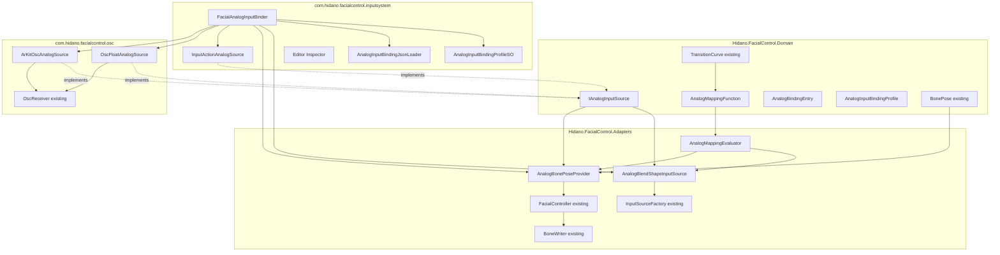
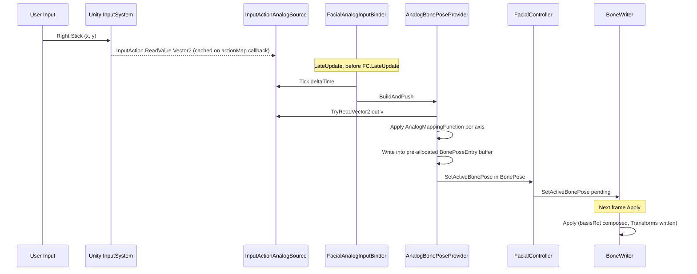
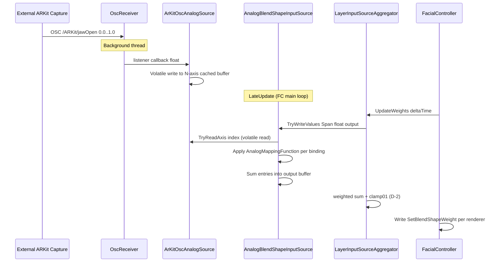
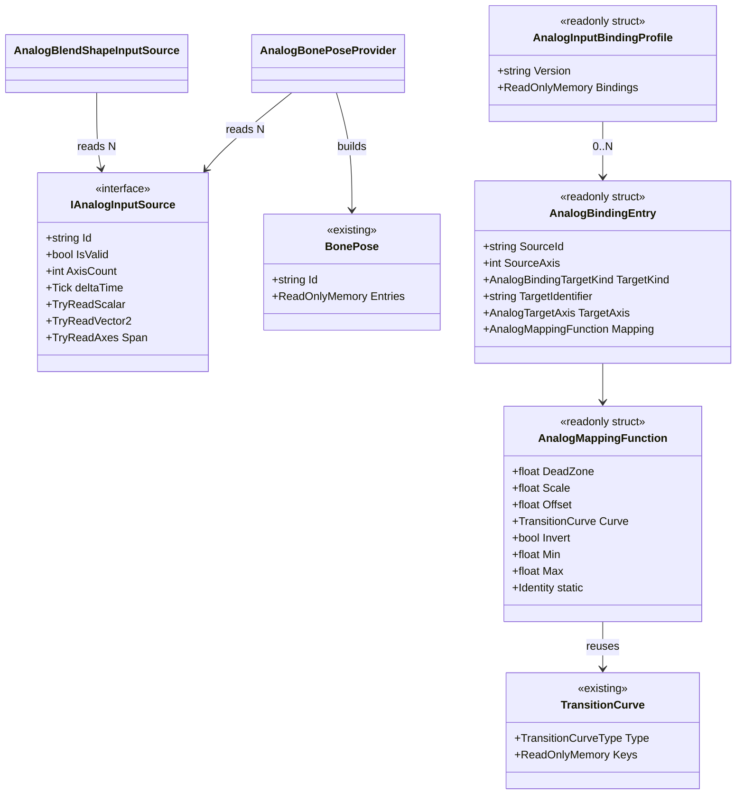

# Design Document — analog-input-binding

## Overview

**Purpose**: 連続値（アナログ）入力源（ゲームパッドのスティック軸、ARKit / PerfectSync の BlendShape 値、OSC の float パラメータ）を、(1) BlendShape 値 (`float[BlendShapeCount]`) と (2) `BonePose`（顔ボーンの相対 Euler）に同一のマッピング関数経由でリアルタイム駆動するサブシステムを提供する。本 spec は完了済 `bone-control` spec が公開した `IBonePoseProvider.SetActiveBonePose(in BonePose)` の最初の消費者であり、`layer-input-source-blending` の D-1 ハイブリッドモデルに「BlendShape 値提供型」として接続する。

**Users**: VTuber 配信者向けに ARKit `jawOpen` を直接 BlendShape へ接続したい Unity エンジニア、および右スティックで目線を動かすゲーム実装者。離散トリガー (`InputBindingProfileSO`) を**置換しない**ことを設計上の前提とする。

**Impact**: コア (`com.hidano.facialcontrol`) に Domain 抽象 (`IAnalogInputSource` / `AnalogMappingFunction` / `AnalogBindingEntry` / `AnalogInputBindingProfile`) と共通アダプタ (`AnalogBlendShapeInputSource` / `AnalogBonePoseProvider`) を追加し、`com.hidano.facialcontrol.inputsystem` に `InputAction` 系ソース・ScriptableObject・JSON ローダ・`FacialAnalogInputBinder` MonoBehaviour・Editor Inspector・サンプルを追加する。`com.hidano.facialcontrol.osc` には OSC float ソースとアドレス購読 API を追加する。**既存公開 API は破壊しない**（後述 Boundary Commitments）。

### Goals
- `IAnalogInputSource` を Domain 値型抽象として導入し、scalar / 2-axis / N-axis を 1 つの契約で表現する。
- マッピング関数（dead-zone / scale / offset / curve / inversion / clamp）を Domain 値型で宣言的に定義し、`TransitionCurve` / `CurveKeyFrame` を `Custom` カーブの実体として再利用する。
- BlendShape ターゲット側を `layer-input-source-blending` の BlendShape 値提供型として登録し、weighted-sum + clamp01 パイプラインに乗せる。
- BonePose ターゲット側を `IBonePoseProvider.SetActiveBonePose` 経由で `FacialController` に注入し、毎フレーム alloc=0 で動作させる。
- 永続化を `AnalogInputBindingProfileSO` + JSON で行い、preview.1 の Multi Source Blend Demo と並走するサンプル `AnalogBindingDemo` を提供する。

### Non-Goals
- 離散トリガー (`(ActionName, ExpressionId)`) による Expression 切替（既存 `input-binding-persistence` の責務）。
- 複数 BonePose Provider 間のブレンド（`bone-control` 設計で単一 active のみ、本 spec 外）。
- 視線追従の Vector3 ターゲット指定 / カメラ目線追従（preview.2 以降の別 spec）。
- フル GUI のマッピングカーブ編集 Editor（preview 段階は JSON 直編集 + 読取専用 Inspector で運用）。
- Timeline / AnimationClip からのアナログ値駆動。
- `bone-control` 公開 API のシグネチャ変更（後述 Boundary Commitments）。

## Boundary Commitments

### This Spec Owns
- Domain 抽象: `IAnalogInputSource` / `AnalogMappingFunction` / `AnalogMappingCurveType` / `AnalogBindingEntry` / `AnalogInputBindingProfile` / `AnalogBindingTargetKind` / `AnalogTargetAxis`。
- 共通アダプタ: `AnalogBlendShapeInputSource`（BlendShape 値提供型 IInputSource）、`AnalogBonePoseProvider`（BonePose 構築 + `IBonePoseProvider.SetActiveBonePose` 呼出）。
- 入力ソースアダプタ: `InputActionAnalogSource`（inputsystem）、`OscFloatAnalogSource` + `ArKitOscAnalogSource`（osc）。
- 永続化: `AnalogInputBindingProfileSO` ScriptableObject、`AnalogInputBindingJsonLoader`（JSON → Domain）、JSON DTO 群、Editor 拡張 Inspector（読取専用 + import/export + Humanoid 自動割当）。
- ランタイム: `FacialAnalogInputBinder` MonoBehaviour（`FacialController` と `AnalogInputBindingProfileSO` を OnEnable で結線、OnDisable で解除、ランタイム差替対応）。
- サンプル: `AnalogBindingDemo`（Samples~ canonical + Assets/Samples ミラー、JSON + SO + Scene + HUD）。
- JSON スキーマ予約識別子の追加: `analog-blendshape`、`analog-bonepose`（`InputSourceId.ReservedIds` への追記。**唯一の既存ファイル改変**）。

### Out of Boundary
- `bone-control` の公開 API シグネチャ変更（`IBonePoseProvider.SetActiveBonePose` / `IBonePoseSource.GetActiveBonePose` / `BonePose` / `BonePoseEntry`）。
- `layer-input-source-blending` の `LayerInputSourceAggregator` / `IInputSource` 契約変更。
- `input-binding-persistence` の `InputBindingProfileSO` / `FacialInputBinder` / `InputSystemAdapter` 改変（並走する別アセット・別 MonoBehaviour として独立）。
- `FacialControlDefaultActions.inputactions` の `Trigger1〜Trigger12` スロット転用（**保持**。アナログ用は新規 ActionMap 名 `Analog` に追加）。
- BonePose 多重 provider のブレンド合成、Vector3 ターゲット視線追従、Timeline 統合。
- フル GUI のマッピングカーブ編集（curve handle 操作の AnimationCurve エディタ統合）。

### Allowed Dependencies
- `bone-control`: `BonePose` / `BonePoseEntry`（Domain 読取）、`IBonePoseProvider.SetActiveBonePose(in BonePose)`（Adapters 書込口）、`HumanoidBoneAutoAssigner`（Editor 自動割当）。
- `layer-input-source-blending`: `IInputSource` 実装契約、`InputSourceType.ValueProvider`、`InputSourceId` 規約、`ValueProviderInputSourceBase` 基底（再利用）。
- `input-binding-persistence`: 参照しない。並走する別バインダー。
- 共通: `TransitionCurve` / `CurveKeyFrame` / `TransitionCalculator.Evaluate`（`Custom` カーブの Hermite 補間）、`InputSourceFactory.RegisterReserved<TOptions>` + `IFacialControllerExtension`（BlendShape 側登録）。

### Revalidation Triggers
- `BonePose` / `BonePoseEntry` の構造変更、`IBonePoseProvider.SetActiveBonePose` のシグネチャ変更 → 本 spec 全アダプタ要再検証。
- `IInputSource.TryWriteValues` の契約変更 → `AnalogBlendShapeInputSource` 要再検証。
- `InputSourceId` 規約 (`[a-zA-Z0-9_.-]{1,64}`) または予約 ID 集合の変更 → JSON スキーマ・Factory 登録要再検証。
- `TransitionCurve` の `Custom` カーブ評価セマンティクス変更 → マッピング関数要再検証。
- `OscReceiver` / `uOscServer` の購読 API 変更 → OSC analog source 要再検証。

## Architecture

### Existing Architecture Analysis

本 spec は既存システムへの**拡張**である。下記の既存契約に整列する:

- D-1 ハイブリッド入力モデル: 既存 `IInputSource` (`Domain/Interfaces/IInputSource.cs`) は Expression トリガー型と BlendShape 値提供型の両方を内包する契約。本 spec の BlendShape 側は `ValueProviderInputSourceBase` を継承して `TryWriteValues(Span<float>)` を実装する。
- BonePose 注入経路: 既存 `BoneWriter` (`Adapters/Bone/BoneWriter.cs:76-80`) は `SetActiveBonePose(in BonePose)` で次フレームセマンティクスを実装済み。本 spec の `AnalogBonePoseProvider` はこの呼出側に立つ。
- `IFacialControllerExtension` (`Adapters/Playable/IFacialControllerExtension.cs`): サブパッケージから `InputSourceFactory.RegisterReserved` 経由で入力源を後付け登録するためのフック。本 spec も同パターンで `analog-blendshape` を登録する。
- 既存 OSC 経路: `OscReceiver` (`com.hidano.facialcontrol.osc`) は `_addressToIndex` の固定マップで BlendShape index へルーティング。本 spec はこれに加えて任意アドレス購読 API を追加する（既存ルーティングは保持、加算的拡張のみ）。
- カーブ評価: `TransitionCalculator.Evaluate(in TransitionCurve, float t)` (`Domain/Services/TransitionCalculator.cs`) が Hermite 補間 + プリセット (Linear/EaseIn/EaseOut/EaseInOut/Custom) を提供。本 spec は `Custom` カーブをこの基盤の上で再利用する。

### Architecture Pattern & Boundary Map



**Architecture Integration**:
- 採用パターン: クリーンアーキテクチャ + ハイブリッド入力モデル拡張（D-1 準拠）。Domain 抽象 → Adapters 実装の片方向依存を asmdef で強制。
- 境界分担: 「BlendShape 駆動」は `layer-input-source-blending` パイプラインに合流、「BonePose 駆動」は `bone-control.IBonePoseProvider` 経由。両者は同一の `AnalogMappingFunction` と同一の入力ソースインスタンスを共有可能。
- 配置 (Hybrid): Domain/共通 Adapter はコアパッケージ、Engine 依存ソースは技術別サブパッケージ（inputsystem / osc）。preview.1 の ARKit は OSC `/ARKit/{name}` 経由で取り込む構造に統一。
- 保持される既存パターン: D-1 hybrid model、`InputSourceId` 規約、`TransitionCurve` Hermite 補間、`IFacialControllerExtension` 後付け登録、`OscDoubleBuffer` の Volatile/double-buffer ポリシー。
- 新規コンポーネントの理由: BlendShape 側と BonePose 側で**ターゲット形が異なる**ため共通アダプタは 2 系統必要。マッピング関数は両者共通（DRY）。
- Steering 整合: `tech.md` の毎フレーム alloc=0、Adapters 層への Engine 依存封じ込め、`structure.md` の asmdef 依存方向、`product.md` の D-1 hybrid model に整列。

### Technology Stack

| Layer | Choice / Version | Role in Feature | Notes |
|-------|------------------|-----------------|-------|
| Domain | C# 9 (Unity 6000.3.2f1 同梱 Roslyn) | Unity 非依存抽象（IAnalogInputSource、AnalogMappingFunction、AnalogBindingEntry、AnalogInputBindingProfile） | `Unity.Collections` のみ参照可。`UnityEngine.*` 不参照 |
| Adapters/Core | Hidano.FacialControl.Adapters | BlendShape 値提供型 IInputSource 実装、BonePose 構築・注入 | 既存 `ValueProviderInputSourceBase`、`InputSourceFactory`、`IFacialControllerExtension` を再利用 |
| Adapters/InputSystem | `com.unity.inputsystem` 1.17.0 | InputAction (Vector2/Axis/float) → IAnalogInputSource | キャッシュ型 ReadValue で alloc=0 |
| Adapters/OSC | uOsc + 既存 `OscReceiver` | OSC float 受信 → IAnalogInputSource、ARKit 52ch も同経路 | `OscReceiver` に `RegisterAnalogListener(string address, Action<float>)` API を**追加**（加算的拡張） |
| Persistence | `JsonUtility` ベース + ScriptableObject | AnalogInputBindingProfileSO + JSON | 既存 `InputSourceDto.optionsJson` の二段デシリアライズパターンを踏襲 |
| Editor | UI Toolkit | 読取専用 Inspector + JSON import/export + Humanoid 自動割当ボタン | IMGUI は使用しない |
| Tests | `com.unity.test-framework` 1.6.0 | EditMode (Domain / マッピング / JSON) + PlayMode (BoneWriter 経由 E2E、GC alloc) | 既存 `BlendShapeNonRegressionTests` パターンに整列 |

External dependency 詳細・選定根拠は `research.md` を参照。本 design.md は決定事項のみ要約する。

## File Structure Plan

### Directory Structure

```
Packages/com.hidano.facialcontrol/
├── Runtime/
│   ├── Domain/
│   │   ├── Interfaces/
│   │   │   └── IAnalogInputSource.cs                # 1.1, 1.2, 1.3, 1.4, 1.5, 1.6
│   │   ├── Models/
│   │   │   ├── AnalogMappingFunction.cs             # 2.1, 2.5, 2.7
│   │   │   ├── AnalogMappingCurveType.cs            # 2.2 (Linear/EaseIn/EaseOut/EaseInOut/Custom)
│   │   │   ├── AnalogBindingTargetKind.cs           # 6.2 (BlendShape | BonePose)
│   │   │   ├── AnalogTargetAxis.cs                  # 4.1, 6.2 (X | Y | Z)
│   │   │   ├── AnalogBindingEntry.cs                # 6.2
│   │   │   └── AnalogInputBindingProfile.cs         # 6.3, 6.7
│   │   ├── Models/InputSourceId.cs                  # MODIFIED: ReservedIds に "analog-blendshape" / "analog-bonepose" を追記
│   │   └── Services/
│   │       └── AnalogMappingEvaluator.cs            # 2.3, 2.4, 2.6 (静的サービス、TransitionCalculator を委譲)
│   └── Adapters/
│       ├── InputSources/
│       │   └── AnalogBlendShapeInputSource.cs       # 3.1〜3.8 (ValueProviderInputSourceBase 継承)
│       └── Bone/
│           └── AnalogBonePoseProvider.cs            # 4.1〜4.9 (IBonePoseProvider を消費、IDisposable)
│
Packages/com.hidano.facialcontrol.inputsystem/
├── Runtime/
│   ├── Adapters/InputSources/
│   │   └── InputActionAnalogSource.cs               # 5.1, 5.2 (Vector2/Axis/float、cached value)
│   ├── Adapters/ScriptableObject/
│   │   └── AnalogInputBindingProfileSO.cs           # 6.1, 6.6
│   ├── Adapters/Json/
│   │   ├── AnalogInputBindingJsonLoader.cs         # 6.3, 6.4, 6.5
│   │   └── Dto/
│   │       ├── AnalogInputBindingProfileDto.cs
│   │       ├── AnalogBindingEntryDto.cs
│   │       └── AnalogMappingDto.cs
│   ├── Adapters/Input/
│   │   └── FacialAnalogInputBinder.cs               # 7.1〜7.7 (MonoBehaviour、OnEnable/OnDisable)
│   └── Registration/
│       └── AnalogBlendShapeRegistration.cs          # 3.8, 9.4 (IFacialControllerExtension 実装)
├── Editor/Inspector/
│   └── AnalogInputBindingProfileSOEditor.cs         # 10.1〜10.6 (UI Toolkit)
└── Samples~/AnalogBindingDemo/                      # 11.1〜11.6
    ├── AnalogBindingDemo.unity
    ├── AnalogBindingDemoHUD.cs
    ├── AnalogBindingProfile.asset
    └── analog_binding_demo.json
│
Packages/com.hidano.facialcontrol.osc/
├── Runtime/Adapters/InputSources/
│   ├── OscFloatAnalogSource.cs                      # 5.3, 5.4 (1 OSC アドレス → 1 scalar source)
│   └── ArKitOscAnalogSource.cs                      # 5.5 (52ch N-axis、ARKit/{name} を内部購読)
└── Runtime/Adapters/OSC/
    └── OscReceiver.cs                               # MODIFIED: RegisterAnalogListener API を追加（加算的）

FacialControl/Assets/Samples/AnalogBindingDemo/      # dev ミラー（Samples~ と同期）
```

### Modified Files
- `Packages/com.hidano.facialcontrol/Runtime/Domain/Models/InputSourceId.cs` — `ReservedIds` 配列に `"analog-blendshape"` と `"analog-bonepose"` を追記する。既存予約 ID (`osc` / `lipsync` / `controller-expr` / `keyboard-expr` / `input`) は保持。**Gap analysis で許可された唯一の既存ファイル改変**。
- `Packages/com.hidano.facialcontrol.osc/Runtime/Adapters/OSC/OscReceiver.cs` — `RegisterAnalogListener(string address, Action<float> listener)` / `UnregisterAnalogListener(string address, Action<float> listener)` を**追加**する加算的拡張。既存の `_addressToIndex` ルーティングは変更しない。`HandleOscMessage` の末尾に listener 通知ループを 1 つ追加する。

> 既存の `bone-control` / `layer-input-source-blending` / `input-binding-persistence` の公開 API、および `FacialControlDefaultActions.inputactions` は**変更しない**。

## System Flows

### Flow 1: BonePose ターゲット駆動（右スティック → 目線）



主な決定: `FacialAnalogInputBinder.LateUpdate` は `[DefaultExecutionOrder]` で `FacialController` より**早い** order を持つ（既存 `FacialController` は order 未指定 = 0 のため、Binder = -50 を採用）。これにより `SetActiveBonePose` が `BoneWriter.Apply` 直前の同フレームで反映される。`BoneWriter` の next-frame セマンティクス（`Adapters/Bone/BoneWriter.cs:76-107` の pending swap）は既存通り保持される。

### Flow 2: BlendShape ターゲット駆動（ARKit jawOpen → mouthOpen）



主な決定: BlendShape 側は既存 D-1 パイプラインに完全合流するため `Aggregator` の clamp01 を**信頼**し、アダプタ層では二重 clamp しない（Req 3.3）。OSC 受信スレッドからメインスレッドへの値受け渡しは `Volatile.Read/Write` のフィールドペアで実装し、`OscDoubleBuffer` 並みの Volatile セマンティクスを単一 float ごとに適用する（D-7 整合）。

## Requirements Traceability

| Requirement | Summary | Components | Interfaces | Flows |
|-------------|---------|------------|------------|-------|
| 1.1 | スカラー / 2-axis / N-axis 共通契約 | IAnalogInputSource | TryReadScalar / TryReadVector2 / TryReadAxes | Flow 1, 2 |
| 1.2 | 識別子規約 `[a-zA-Z0-9_.-]{1,64}` | IAnalogInputSource | `Id` (string) | — |
| 1.3 | IsValid フラグ | IAnalogInputSource | `IsValid` | Flow 1, 2 |
| 1.4 | overlap-only 書込 | AnalogBlendShapeInputSource | TryWriteValues (Span<float>) | Flow 2 |
| 1.5 | Domain 層 Unity 非依存 | Domain/Interfaces/IAnalogInputSource | — | — |
| 1.6 | last-valid policy | OscFloatAnalogSource / InputActionAnalogSource | TryRead* | — |
| 2.1 | dead-zone / scale / offset / curve / inversion / min / max | AnalogMappingFunction | ctor 引数 | — |
| 2.2 | Curve types Linear/EaseIn/EaseOut/EaseInOut/Custom | AnalogMappingFunction + TransitionCurve（Custom 実体） | `Curve` フィールド | — |
| 2.3 | 適用順 (deadzone→scale→offset→curve→invert→clamp) | AnalogMappingEvaluator | Evaluate(in AnalogMappingFunction, float) | Flow 1, 2 |
| 2.4 | dead-zone 内は厳密ゼロ | AnalogMappingEvaluator | Evaluate | — |
| 2.5 | min>max は ArgumentException | AnalogMappingFunction | ctor | — |
| 2.6 | ホットパス alloc=0 | AnalogMappingEvaluator | Evaluate | Flow 1, 2 |
| 2.7 | デフォルトは恒等 | AnalogMappingFunction.Identity | static factory | — |
| 3.1 | D-1 BlendShape 値提供型として接続 | AnalogBlendShapeInputSource | IInputSource | Flow 2 |
| 3.2 | binding entry → BS index → mapping → write | AnalogBlendShapeInputSource | TryWriteValues | Flow 2 |
| 3.3 | 同一 BS の sum、二重 clamp なし | AnalogBlendShapeInputSource | TryWriteValues | Flow 2 |
| 3.4 | 名前で参照、init 時 index 解決 | AnalogBlendShapeInputSource | Initialize(IReadOnlyList<string>) | — |
| 3.5 | 未存在 BS は warn + skip | AnalogBlendShapeInputSource | Initialize | — |
| 3.6 | 単一 pre-alloc バッファ | AnalogBlendShapeInputSource | `_outputCache: float[]` | Flow 2 |
| 3.7 | passthrough N-axis 対応 | AnalogBlendShapeInputSource | passthroughMap: Dictionary<int, int> | Flow 2 |
| 3.8 | 予約 ID `analog-blendshape` | InputSourceId.ReservedIds (modified) | — | — |
| 4.1〜4.2 | binding entry → bone (X/Y/Z) → mapping | AnalogBonePoseProvider | BuildAndPush() | Flow 1 |
| 4.3 | bone は名前参照 | AnalogBonePoseProvider | bindings: AnalogBindingEntry[] | — |
| 4.4 | Humanoid 自動割当 | AnalogInputBindingProfileSOEditor | Editor button | — |
| 4.5 | per-frame で `SetActiveBonePose` 1 回 | AnalogBonePoseProvider | IBonePoseProvider | Flow 1 |
| 4.6 | 同一 (bone, axis) は sum | AnalogBonePoseProvider | BuildAndPush | — |
| 4.7 | pre-alloc BonePoseEntry buffer | AnalogBonePoseProvider | `_entryBuffer: BonePoseEntry[]` | Flow 1 |
| 4.8 | bindings 0 件 / 全無効 → 空 BonePose | AnalogBonePoseProvider | BuildAndPush | — |
| 4.9 | bone-control 公開 API 不変 | AnalogBonePoseProvider | (consumes IBonePoseProvider) | — |
| 5.1〜5.2 | InputAction Axis/Vector2/float | InputActionAnalogSource | IAnalogInputSource | Flow 1 |
| 5.3〜5.4 | OSC float source + staleness | OscFloatAnalogSource | IAnalogInputSource | — |
| 5.5 | ARKit 52ch N-axis | ArKitOscAnalogSource | IAnalogInputSource (axes=detected) | Flow 2 |
| 5.6 | 新規 source は Adapters 層のみ | (Domain interface 不変) | — | — |
| 5.7 | Adapters/Input or Adapters/InputSources 配置 | (File Structure Plan 参照) | — | — |
| 6.1〜6.7 | SO + JSON 永続化 | AnalogInputBindingProfileSO + AnalogInputBindingJsonLoader | Load(string json) → AnalogInputBindingProfile | — |
| 6.8 | 識別子規約整合 | InputSourceId | — | — |
| 7.1〜7.7 | ランタイム結線・差替 | FacialAnalogInputBinder | OnEnable / OnDisable / SetProfile | Flow 1, 2 |
| 8.1〜8.6 | GC=0 + double-buffered samples | (全アダプタ) | TryRead* / TryWriteValues | Flow 1, 2 |
| 9.1〜9.6 | 既存 spec API 非破壊 | (新規ファイル中心の設計、modified は 2 ファイルのみ) | — | — |
| 10.1〜10.6 | UI Toolkit Inspector | AnalogInputBindingProfileSOEditor | UI Toolkit | — |
| 11.1〜11.6 | サンプル同梱 | AnalogBindingDemo | (Samples~ + Assets/Samples) | — |

## Components and Interfaces

### Component Summary

| Component | Domain/Layer | Intent | Req Coverage | Key Dependencies (P0/P1) | Contracts |
|-----------|--------------|--------|--------------|--------------------------|-----------|
| IAnalogInputSource | Domain/Interfaces | アナログ入力源の共通契約 (scalar/2D/N-axis) | 1.1〜1.6 | — | Service |
| AnalogMappingFunction | Domain/Models | マッピング関数の宣言的値型 | 2.1, 2.2, 2.5, 2.7 | TransitionCurve (P0) | State |
| AnalogMappingEvaluator | Domain/Services | マッピング関数の static 評価 (alloc=0) | 2.3, 2.4, 2.6 | TransitionCalculator (P0) | Service |
| AnalogBindingEntry | Domain/Models | 1 ソース軸 → 1 ターゲットの宣言 | 6.2 | AnalogMappingFunction (P0) | State |
| AnalogInputBindingProfile | Domain/Models | バインディング集合の Domain ルート | 6.3, 6.7 | AnalogBindingEntry (P0) | State |
| AnalogBlendShapeInputSource | Adapters/InputSources (core) | BlendShape 値提供型 IInputSource として登録 | 3.1〜3.8 | ValueProviderInputSourceBase (P0), AnalogMappingEvaluator (P0) | Service |
| AnalogBonePoseProvider | Adapters/Bone (core) | BonePose を構築・注入 | 4.1〜4.9 | IBonePoseProvider (P0), AnalogMappingEvaluator (P0) | Service |
| InputActionAnalogSource | Adapters/InputSources (inputsystem) | InputAction → IAnalogInputSource | 5.1, 5.2 | UnityEngine.InputSystem (P0) | Service |
| OscFloatAnalogSource | Adapters/InputSources (osc) | OSC float → IAnalogInputSource (scalar) | 5.3, 5.4 | OscReceiver (P0) | Service |
| ArKitOscAnalogSource | Adapters/InputSources (osc) | ARKit 52ch → IAnalogInputSource (N-axis) | 5.5 | OscReceiver (P0) | Service |
| AnalogInputBindingProfileSO | Adapters/ScriptableObject (inputsystem) | SO 永続化 | 6.1, 6.6 | AnalogInputBindingJsonLoader (P0) | State |
| AnalogInputBindingJsonLoader | Adapters/Json (inputsystem) | JSON ↔ Domain | 6.3〜6.5 | JsonUtility (P0) | Service |
| FacialAnalogInputBinder | Adapters/Input (inputsystem) | OnEnable/OnDisable で結線 | 7.1〜7.7 | FacialController (P0), AnalogInputBindingProfileSO (P0) | Service, State |
| AnalogBlendShapeRegistration | Runtime/Registration (inputsystem) | IFacialControllerExtension で `analog-blendshape` を登録 | 3.8 | InputSourceFactory (P0) | Service |
| AnalogInputBindingProfileSOEditor | Editor/Inspector (inputsystem) | UI Toolkit 読取専用 + import/export + Humanoid 自動割当 | 10.1〜10.6 | HumanoidBoneAutoAssigner (P1) | — |

詳細ブロックは「新しい境界を持つ」コンポーネントのみに付ける（design-principles 4 準拠）。下記がそれに該当する。

### Domain

#### IAnalogInputSource

| Field | Detail |
|-------|--------|
| Intent | Unity 非依存のアナログ入力源契約。scalar / 2-axis / N-axis を 1 つのインターフェースに集約 |
| Requirements | 1.1, 1.2, 1.3, 1.4, 1.5, 1.6 |

**Responsibilities & Constraints**
- 入力源固有のフレッシュなサンプル値をキャッシュし、メインスレッドからの読取要求に同期して返す。
- スカラー / 2-axis / N-axis を**同じインスタンスから**選択的に読める（実装側は対応する変種のみ true を返す）。
- 値が無効・接続切れ・未初期化の場合は `IsValid == false` を返し、最後に有効だった値は変更しない（Req 1.6 last-valid policy）。
- Domain 配置のため `UnityEngine.*` 不参照（`Unity.Collections` のみ参照可）。

**Dependencies**
- Inbound: `AnalogBlendShapeInputSource` / `AnalogBonePoseProvider` — 値読取（P0）
- Outbound: なし
- External: なし（実装側で技術依存を引受）

**Contracts**: Service [x] / API [ ] / Event [ ] / Batch [ ] / State [ ]

##### Service Interface

```csharp
namespace Hidano.FacialControl.Domain.Interfaces
{
    /// <summary>
    /// アナログ入力源の Unity 非依存契約。scalar / 2-axis / N-axis のいずれかを返す。
    /// </summary>
    public interface IAnalogInputSource
    {
        /// <summary>入力源識別子（[a-zA-Z0-9_.-]{1,64} 規約）。</summary>
        string Id { get; }

        /// <summary>有効性フラグ。false の間 TryRead* は false を返してよい。</summary>
        bool IsValid { get; }

        /// <summary>このソースが提供する N-axis のチャンネル数（scalar=1, Vector2=2, ARKit=52 等）。</summary>
        int AxisCount { get; }

        /// <summary>1 フレーム分の時間進行。Tick 内でフレッシュなキャッシュへ更新する実装が一般的。</summary>
        /// <param name="deltaTime">前フレームからの経過秒数（>= 0）。</param>
        void Tick(float deltaTime);

        /// <summary>scalar 値の取得。AxisCount >= 1 のとき axis 0 の値を返す。</summary>
        bool TryReadScalar(out float value);

        /// <summary>2-axis 値の取得。AxisCount >= 2 のとき axis 0/1 を返す。</summary>
        bool TryReadVector2(out float x, out float y);

        /// <summary>
        /// N-axis 値の取得。<paramref name="output"/> の長さが AxisCount より小さい場合は overlap のみ書込み true。
        /// 長い場合は AxisCount まで書込み、残余は呼出側責務（Req 1.4）。
        /// </summary>
        bool TryReadAxes(Span<float> output);
    }
}
```

- Preconditions: `Tick` は毎フレーム 1 回メインスレッドから呼出。`output` は呼出側が確保。
- Postconditions: `IsValid == false` のとき `TryRead*` は false を返し `output` 不変。`IsValid == true` でも実装側のサポート外形（例: scalar 専用ソースに `TryReadAxes`）は false 返却を許容（Req 1.4 / 1.6）。
- Invariants: `Id` / `AxisCount` は構築後不変。

**Implementation Notes**
- Integration: `AnalogBlendShapeInputSource` が複数の `IAnalogInputSource` を辞書で保持し binding entry の sourceId/sourceAxis から値を引く。
- Validation: EditMode で Fake `IAnalogInputSource` を差し込み、binding entry 経由の出力を検証する。
- Risks: 実装側で per-frame `ReadValue<T>()` が alloc を起こす場合 → `Tick` でキャッシュ、`TryRead*` はキャッシュ参照のみ。

#### AnalogMappingFunction (Domain/Models)

| Field | Detail |
|-------|--------|
| Intent | dead-zone / scale / offset / curve / inversion / min / max を 1 つにまとめた Domain 値型 |
| Requirements | 2.1, 2.2, 2.5, 2.7 |

**Responsibilities & Constraints**
- 不変な readonly struct として宣言（GC=0、コピー安全）。
- `Curve` フィールドは `TransitionCurve`（既存型）を保持。`AnalogMappingCurveType` は `TransitionCurveType` の別名 enum（同値マッピング: Linear=Linear, EaseIn=EaseIn, ...）として **`TransitionCurveType` をそのまま採用**する。
- ctor で `min > max` の場合は `ArgumentException`（Req 2.5）。
- `Identity` static プロパティで dead-zone=0, scale=1, offset=0, curve=Linear, invert=false, min=0, max=1 を返す（Req 2.7）。

**Dependencies**
- Inbound: `AnalogBindingEntry`、`AnalogMappingEvaluator`（P0）
- Outbound: `TransitionCurve`（P0、再利用）
- External: なし

**Contracts**: State [x]

```csharp
namespace Hidano.FacialControl.Domain.Models
{
    public readonly struct AnalogMappingFunction
    {
        public float DeadZone { get; }
        public float Scale { get; }
        public float Offset { get; }
        public TransitionCurve Curve { get; } // 既存型を再利用 (R-1)
        public bool Invert { get; }
        public float Min { get; }
        public float Max { get; }

        public AnalogMappingFunction(
            float deadZone,
            float scale,
            float offset,
            in TransitionCurve curve,
            bool invert,
            float min,
            float max);

        public static AnalogMappingFunction Identity { get; }
    }
}
```

#### AnalogMappingEvaluator (Domain/Services)

| Field | Detail |
|-------|--------|
| Intent | マッピング関数を毎フレーム alloc=0 で評価する static サービス |
| Requirements | 2.3, 2.4, 2.6 |

**Responsibilities & Constraints**
- 評価順は厳密に `dead-zone → re-center → scale → offset → curve(via TransitionCalculator.Evaluate) → invert → clamp(min, max)`（Req 2.3）。
- `|x| < deadZone` のとき再センタ後 0 を返し、後続段は通過させる（Req 2.4）。`scale=0, offset=0` 構成では結果も 0 のまま。
- `TransitionCalculator.Evaluate(in TransitionCurve, float t)` を委譲で利用するため、Domain 層の Hermite 補間ロジックを二重実装しない。

**Dependencies**
- Inbound: `AnalogBlendShapeInputSource` / `AnalogBonePoseProvider`（P0）
- Outbound: `TransitionCalculator`（P0、再利用）
- External: なし

```csharp
namespace Hidano.FacialControl.Domain.Services
{
    public static class AnalogMappingEvaluator
    {
        /// <summary>マッピング関数を評価する（alloc=0）。</summary>
        public static float Evaluate(in AnalogMappingFunction mapping, float input);
    }
}
```

- Preconditions: `mapping` は ctor で検証済み (`min <= max`)。
- Postconditions: `Min <= return <= Max`。
- Invariants: マネージドヒープ確保なし（hot path）。

#### AnalogBindingEntry / AnalogInputBindingProfile (Domain/Models)

| Field | Detail |
|-------|--------|
| Intent | 1 ソース軸 → 1 ターゲットの宣言と、その集合 |
| Requirements | 6.2, 6.3, 6.7, 6.8 |

```csharp
namespace Hidano.FacialControl.Domain.Models
{
    public enum AnalogBindingTargetKind { BlendShape = 0, BonePose = 1 }
    public enum AnalogTargetAxis { X = 0, Y = 1, Z = 2 }

    public readonly struct AnalogBindingEntry
    {
        public string SourceId { get; }            // IAnalogInputSource.Id
        public int SourceAxis { get; }             // 0=scalar/X, 1=Y, 2=Z, ... (N-axis ではチャンネル番号)
        public AnalogBindingTargetKind TargetKind { get; }
        public string TargetIdentifier { get; }    // BlendShape 名 or bone 名
        public AnalogTargetAxis TargetAxis { get; } // BonePose のときのみ意味を持つ
        public AnalogMappingFunction Mapping { get; }
    }

    public readonly struct AnalogInputBindingProfile
    {
        public string Version { get; }                              // "1.0.0"
        public ReadOnlyMemory<AnalogBindingEntry> Bindings { get; }

        public AnalogInputBindingProfile(string version, AnalogBindingEntry[] bindings);
    }
}
```

不変・防御的コピーは既存 `BonePose` パターン（`Domain/Models/BonePose.cs:31-58`）に倣う。bindings 0 件は許容（Req 6.7）。

### Adapters/Core

#### AnalogBlendShapeInputSource

| Field | Detail |
|-------|--------|
| Intent | BlendShape 値提供型として `LayerInputSourceAggregator` パイプラインに合流する |
| Requirements | 3.1〜3.8 |

**Responsibilities & Constraints**
- `ValueProviderInputSourceBase` を継承し `Id="analog-blendshape"`, `Type=ValueProvider` を宣言。
- 初期化時に binding 配列と blendShapeNames を受け取り、bindings の `TargetIdentifier` を BS index に逆引きしてキャッシュする（Req 3.4）。未存在 BS は `Debug.LogWarning` + skip（Req 3.5）。
- 単一 `_outputCache: float[BlendShapeCount]` を保持し、毎フレーム `TryWriteValues` 内で同インスタンスを再利用（Req 3.6）。
- 同一 BS index の binding は post-mapping 値を sum、二重 clamp なし（Req 3.3、Aggregator 側 clamp01 を信頼）。
- N-axis ソースの passthrough mode を `Dictionary<int sourceAxis, int blendShapeIndex>` で表現（Req 3.7）。

**Dependencies**
- Inbound: `LayerInputSourceAggregator`（P0、`TryWriteValues` 呼出元）
- Outbound: `IAnalogInputSource`（複数、P0）、`AnalogMappingEvaluator`（P0）
- External: なし

**Contracts**: Service [x] / State [x]

```csharp
namespace Hidano.FacialControl.Adapters.InputSources
{
    public sealed class AnalogBlendShapeInputSource : ValueProviderInputSourceBase
    {
        public AnalogBlendShapeInputSource(
            InputSourceId id,                                    // "analog-blendshape" or sub-id
            int blendShapeCount,
            IReadOnlyList<string> blendShapeNames,
            IReadOnlyDictionary<string, IAnalogInputSource> sources,
            IReadOnlyList<AnalogBindingEntry> bindings);

        public override bool TryWriteValues(Span<float> output);
    }
}
```

**Implementation Notes**
- Integration: `IFacialControllerExtension.ConfigureFactory` 経由で `InputSourceFactory.RegisterReserved<AnalogBlendShapeOptionsDto>(InputSourceId.Parse("analog-blendshape"), ...)` で登録。`FacialAnalogInputBinder` がこの拡張をシーンに配置する。
- Validation: EditMode で Fake `IAnalogInputSource` を 2 軸 + 同一 BS ターゲット 2 件で sum を検証。Aggregator 単体テストで weighted-sum + clamp01 が後段で効くことを確認。
- Risks: passthrough map の per-frame foreach allocation → 配列ベース `(int srcAxis, int bsIdx)[]` で foreach 排除。

#### AnalogBonePoseProvider

| Field | Detail |
|-------|--------|
| Intent | binding を毎フレーム評価し `BonePose` を構築、`IBonePoseProvider.SetActiveBonePose` 経由で `FacialController` に注入する |
| Requirements | 4.1〜4.9 |

**Responsibilities & Constraints**
- 初期化時に binding 配列と sources を受け取り、unique な (boneName, axis) キーごとの**集約バケット**を構築する（Req 4.6 sum）。
- 単一 `_entryBuffer: BonePoseEntry[uniqueBonesCount]` を pre-alloc し、毎フレーム値だけ書換える（Req 4.7）。
- bindings 0 件 / 全ソース無効のとき空 `BonePose` を `SetActiveBonePose` に渡す（Req 4.8、`BoneWriter.Apply` は空エントリで no-op `Adapters/Bone/BoneWriter.cs:108-113`）。
- 毎フレーム 1 回だけ `SetActiveBonePose` を呼ぶ（Req 4.5）。
- BonePose は readonly struct のコピーで `in` 渡し（既存 `IBonePoseProvider.SetActiveBonePose(in BonePose)` の契約 `Adapters/Bone/IBonePoseProvider.cs:18`）。

**Dependencies**
- Inbound: `FacialAnalogInputBinder`（P0、毎フレーム呼出元）
- Outbound: `IAnalogInputSource`（複数、P0）、`AnalogMappingEvaluator`（P0）、`IBonePoseProvider`（P0、`FacialController`）
- External: なし

**Contracts**: Service [x] / State [x]

```csharp
namespace Hidano.FacialControl.Adapters.Bone
{
    public sealed class AnalogBonePoseProvider : IDisposable
    {
        public AnalogBonePoseProvider(
            IBonePoseProvider boneProvider,
            IReadOnlyDictionary<string, IAnalogInputSource> sources,
            IReadOnlyList<AnalogBindingEntry> bonePoseBindings);

        /// <summary>
        /// per-frame に呼ばれ、binding 評価 → BonePose 構築 → SetActiveBonePose を行う。
        /// </summary>
        public void BuildAndPush();

        public void Dispose();
    }
}
```

##### State Management
- 状態モデル: `_entryBuffer: BonePoseEntry[]`（pre-alloc, length=uniqueBonesCount）、`_lastPose: BonePose`（前フレーム値、空有効化判定）。
- 永続性 / 一貫性: ランタイム永続化なし。プロファイル差替時は dispose → 再構築。
- 並行性: メインスレッドのみ（preview.1）。`FacialController.SetActiveBonePose` の next-frame セマンティクスにより、本 push は次フレームで反映される。

**Implementation Notes**
- Integration: `FacialAnalogInputBinder.LateUpdate` (order=-50) で `BuildAndPush` を呼ぶ。`FacialController.LateUpdate` (order=0) 内の `_boneWriter.Apply()` (`Adapters/Playable/FacialController.cs:149`) で次フレーム反映。
- Validation: PlayMode で「右スティック→eye Y/X」を 1 フレーム回し、`Animator.transform` 配下の eye Transform.localRotation が期待値で更新されることを検証（既存 `BlendShapeNonRegressionTests` の構造に倣う）。
- Risks: BonePose ctor のデフェンシブコピー + O(N²) 重複検出が pre-alloc を無効化する → 詳細は research.md R-2 で議論。本 design の選定: 「ユニークな (boneName, axis) を **init 時に確定**して `_entryBuffer` を作成しておき、毎フレームは entries 配列の中身だけを書換えて `new BonePose(id, _entryBuffer)` を発行する」。BonePose ctor の防御コピーは 1 回 alloc を起こすため、`bone-control` 側に**追加**で `internal BonePose(string id, BonePoseEntry[] entries, bool skipValidation)` ctor を提案する（research.md R-2 Decision、既存 public ctor を保持する加算的変更で API 非破壊）。代替案（受け入れる alloc を測定後判断）も research.md に記録。

### Adapters/InputSystem

#### InputActionAnalogSource (com.hidano.facialcontrol.inputsystem)

| Field | Detail |
|-------|--------|
| Intent | `UnityEngine.InputSystem.InputAction` を IAnalogInputSource として公開 |
| Requirements | 5.1, 5.2, 8.1, 8.5 |

**Responsibilities & Constraints**
- ctor で `InputAction` と `ControlType`（Axis / Vector2 / float-compatible）を受け取り `AxisCount` を確定。
- `Tick(deltaTime)` 内で `_action.ReadValue<Vector2>()` または `ReadValue<float>()` を **1 回だけ呼び**、結果を `_cachedX/_cachedY` フィールドにキャッシュ。`TryRead*` はフィールド参照のみ。
- `_action.enabled == false` または `_action.controls.Count == 0`（unbound）のとき `IsValid == false`（Req 5.2）。
- per-frame で `ReadValue<Vector2>` が alloc を起こすか実装時に Profiler 検証（research.md R-5）。boxing が発生する場合は `Vector2Control` のキャストで回避。

```csharp
namespace Hidano.FacialControl.Adapters.InputSources
{
    public sealed class InputActionAnalogSource : IAnalogInputSource, IDisposable
    {
        public string Id { get; }
        public bool IsValid { get; private set; }
        public int AxisCount { get; }

        public InputActionAnalogSource(InputSourceId id, InputAction action, AnalogInputShape shape);

        public void Tick(float deltaTime);
        public bool TryReadScalar(out float value);
        public bool TryReadVector2(out float x, out float y);
        public bool TryReadAxes(Span<float> output);
        public void Dispose();
    }

    public enum AnalogInputShape { Scalar = 0, Vector2 = 1 } // N-axis は OSC/ARKit 専用
}
```

#### FacialAnalogInputBinder (com.hidano.facialcontrol.inputsystem)

| Field | Detail |
|-------|--------|
| Intent | OnEnable/OnDisable で `FacialController` と `AnalogInputBindingProfileSO` を結線・解除 |
| Requirements | 7.1〜7.7 |

**Responsibilities & Constraints**
- `[DefaultExecutionOrder(-50)]` を付与し `FacialController.LateUpdate` より早く動く（Flow 1 参照）。
- OnEnable: profile を JSON または SO から Domain に変換 → ソース実装をインスタンス化（`InputActionAnalogSource` / `OscFloatAnalogSource` / `ArKitOscAnalogSource` を sourceId に応じて生成）→ `AnalogBlendShapeInputSource` を `IFacialControllerExtension` 経由で登録 → `AnalogBonePoseProvider` を直接保持。
- OnDisable: 登録解除、`Dispose`、`InputAction` のディスエーブル、`OscReceiver.UnregisterAnalogListener` 呼出。
- ランタイム差替 API `SetProfile(AnalogInputBindingProfileSO)` は内部で OnDisable 等価 → OnEnable 等価を実行（Req 7.4 next-frame）。
- 離散トリガー側 `FacialInputBinder` (`com.hidano.facialcontrol.inputsystem/Runtime/Adapters/Input/FacialInputBinder.cs`) と**並走前提**。共有しないリソース（独自 Action Map "Analog"、独自 SO）。

**Dependencies**
- Inbound: Unity Editor / Scene（MonoBehaviour ライフサイクル）
- Outbound: `FacialController`（P0、`SetActiveBonePose`）、`InputSourceFactory` 経由 BlendShape 側（P0）、`OscReceiver`（P1、osc 経由のときのみ）
- External: `UnityEngine.InputSystem`（P0）

**Contracts**: Service [x] / State [x]

```csharp
namespace Hidano.FacialControl.Adapters.Input
{
    [DefaultExecutionOrder(-50)]
    [AddComponentMenu("FacialControl/Facial Analog Input Binder")]
    public sealed class FacialAnalogInputBinder : MonoBehaviour
    {
        [SerializeField] private FacialController _facialController;
        [SerializeField] private AnalogInputBindingProfileSO _profile;
        [SerializeField] private InputActionAsset _actionAsset; // Analog ActionMap を含む
        [SerializeField] private string _actionMapName = "Analog";

        private void OnEnable();
        private void OnDisable();
        private void LateUpdate();

        public void SetProfile(AnalogInputBindingProfileSO profile);
    }
}
```

### Adapters/OSC

#### OscFloatAnalogSource / ArKitOscAnalogSource (com.hidano.facialcontrol.osc)

`OscReceiver.RegisterAnalogListener(string address, Action<float> listener)` を経由して、任意 OSC アドレスを 1:1（scalar）または 1:N（ARKit 52ch をまとめる）で `IAnalogInputSource` として公開する。受信スレッドからの値は `Volatile.Write` で `_pendingValue` に書き、`Tick` で `Volatile.Read` してキャッシュへ転写することで lock-free を保つ（D-7 整合）。staleness 判定は `OscDoubleBuffer.WriteTick` (`com.hidano.facialcontrol.osc/Runtime/Adapters/OSC/OscDoubleBuffer.cs:32`) のパターンを単一値ペアに適用する。

```csharp
namespace Hidano.FacialControl.Adapters.InputSources
{
    public sealed class OscFloatAnalogSource : IAnalogInputSource, IDisposable
    {
        public OscFloatAnalogSource(InputSourceId id, OscReceiver receiver, string address, float stalenessSeconds);
        // ...
    }

    public sealed class ArKitOscAnalogSource : IAnalogInputSource, IDisposable
    {
        public ArKitOscAnalogSource(InputSourceId id, OscReceiver receiver, string[] arkitParameterNames, float stalenessSeconds);
        // 内部で 52 個の "/ARKit/{name}" を RegisterAnalogListener する
    }
}
```

`OscReceiver` への加算 API（`Adapters/OSC/OscReceiver.cs` modified）:

```csharp
public void RegisterAnalogListener(string address, Action<float> listener);
public void UnregisterAnalogListener(string address, Action<float> listener);
```

実装は `_addressToIndex` ルーティング**後**に `_analogListeners[address]?.Invoke(value)` を発火するだけ（既存ロジック非破壊）。

### Persistence (com.hidano.facialcontrol.inputsystem)

#### AnalogInputBindingJsonLoader

JSON スキーマは既存 `InputSourceDto.optionsJson` の二段デシリアライズを踏襲する（research.md R-6）。

```jsonc
{
  "version": "1.0.0",
  "bindings": [
    {
      "sourceId": "analog-bonepose.right_stick",
      "sourceAxis": 0,
      "targetKind": "bonepose",
      "targetIdentifier": "RightEye",
      "targetAxis": "Y",
      "mapping": {
        "deadZone": 0.1,
        "scale": 30.0,
        "offset": 0.0,
        "curveType": "Linear",
        "curveKeyFrames": [],
        "invert": false,
        "min": -45.0,
        "max": 45.0
      }
    },
    {
      "sourceId": "analog-blendshape.arkit_jaw",
      "sourceAxis": 0,
      "targetKind": "blendshape",
      "targetIdentifier": "Mouth_A",
      "targetAxis": "X",
      "mapping": { "deadZone": 0.0, "scale": 1.0, "offset": 0.0, "curveType": "Linear", "invert": false, "min": 0.0, "max": 1.0 }
    }
  ]
}
```

DTO は `[Serializable]` 付き `AnalogInputBindingProfileDto` / `AnalogBindingEntryDto` / `AnalogMappingDto` で定義。`JsonUtility.FromJson` でデシリアライズし、不正エントリは `Debug.LogWarning` + skip（Req 6.5）。version は preview 中は文字列保持のみで分岐なし、preview.2 以降にマイグレーションパスを設ける（Req 9.6）。

#### AnalogInputBindingProfileSO

```csharp
namespace Hidano.FacialControl.Adapters.ScriptableObject
{
    [CreateAssetMenu(menuName = "FacialControl/Analog Input Binding Profile")]
    public sealed class AnalogInputBindingProfileSO : UnityEngine.ScriptableObject
    {
        [SerializeField, TextArea(8, 50)] private string _jsonText;
        [SerializeField] private string _streamingAssetPath; // 任意

        public string JsonText { get => _jsonText; set => _jsonText = value; }
        public AnalogInputBindingProfile ToDomain();        // ランタイム JSON パース
        public void ImportJson(string path);                // Editor 用
        public void ExportJson(string path);                // Editor 用
    }
}
```

ランタイム JSON パースを SO 側に持たせるのは `tech.md` の「JSON ファースト + ランタイム JSON パース」方針に整列。Editor の import/export ボタンは Inspector 側 (`AnalogInputBindingProfileSOEditor`) から呼ぶ。

### Editor

#### AnalogInputBindingProfileSOEditor

UI Toolkit (UXML + C#) で実装。表示項目:
- 各 binding の `sourceId / targetKind / targetIdentifier / mapping summary (curveType, scale, offset)` を ListView で読取専用表示（Req 10.1）。
- `Import JSON...` / `Export JSON...` ボタン（Req 10.2）。
- Humanoid 自動割当ボタン（Req 4.4 / 10.3）: `bone-control.HumanoidBoneAutoAssigner` を呼び、eye / head / neck の bone 名を BonePose-target binding の `targetIdentifier` に書込む。Avatar が非 Humanoid のときは disable。

ランタイム UI なし、IMGUI 不使用（Req 10.4 / 10.5）。

## Data Models

### Domain Model



集約境界: `AnalogInputBindingProfile` がアグリゲートルート。`AnalogBindingEntry` は値オブジェクト（不変）。`IAnalogInputSource` 実装は Adapters 層のサービス。

不変条件:
- `AnalogMappingFunction.Min <= AnalogMappingFunction.Max`（ctor で強制）。
- `AnalogBindingEntry.SourceAxis >= 0`。
- `TargetKind == BonePose` のとき `TargetAxis ∈ {X, Y, Z}`、`TargetKind == BlendShape` のとき `TargetAxis` は無視される。

### Data Contracts & Integration

JSON ↔ Domain の変換は `AnalogInputBindingJsonLoader.Load(string json) → AnalogInputBindingProfile` / `Save(AnalogInputBindingProfile) → string`。`curveKeyFrames` は `CurveKeyFrame[]` の配列として serialize（既存 `TransitionCurve` の JSON 表現に整合）。preview 中は forward-evolvable（追加フィールド OK、破壊的変更は明示）。

## Error Handling

### Error Strategy
全エラーは Unity 標準ログ（`Debug.LogWarning` / `Debug.LogError`）のみ（`tech.md` Architectural Contracts）。例外はコンストラクタ引数バリデーションでのみ `ArgumentException` / `ArgumentOutOfRangeException` を投げ、ランタイムループでは投げない。

### Error Categories and Responses
- **設定エラー (init time)**: 未存在 BS 名 → warn + skip（Req 3.5）、未存在 bone 名 → warn + skip（既存 `BoneTransformResolver` の dedupe ログに合流）、未登録 sourceId → warn + skip。
- **ランタイムエラー (per frame)**: `IAnalogInputSource.IsValid==false` → 該当 binding 寄与をゼロ扱い（last-valid を維持、Req 1.3 / 1.6）。OSC staleness → `IsValid=false` を返す（Req 5.4）。
- **JSON 不正**: malformed entry は warn + skip + 残余ロード継続（Req 6.5）。version 未対応は preview 中はログのみで処理継続。

### Monitoring
preview.1 段階では Unity Editor の Console ログのみ。将来 Inspector への診断パネル追加（Req 8.1 を読取側で可視化）は preview.2 以降で検討。

## Testing Strategy

### Unit Tests (EditMode)
- `AnalogMappingFunctionTests`: ctor 検証 (min>max → ArgumentException), Identity デフォルト値, dead-zone 内ゼロ, 適用順 (deadzone→scale→offset→curve→invert→clamp)。
- `AnalogMappingEvaluatorTests`: TransitionCalculator 委譲確認、Custom カーブ Hermite 評価、alloc=0 (NoAlloc 属性 or `UnityEngine.Profiling.Profiler.GetMonoUsedSizeLong` 比較)。
- `AnalogBindingEntryTests` / `AnalogInputBindingProfileTests`: 不変条件、防御コピー、空 bindings 許容。
- `AnalogInputBindingJsonLoaderTests`: 正常 JSON / malformed entry skip / version 文字列保持 / 二段デシリアライズ（mapping object → AnalogMappingDto）。
- `AnalogBlendShapeInputSourceTests`: BS 名→index 解決、未存在 BS skip、同一 BS 2 binding sum、N-axis passthrough、`TryWriteValues` の overlap-only。

### Integration Tests (EditMode + PlayMode)
- EditMode: Fake `IAnalogInputSource` を `LayerInputSourceAggregator` に組込み、Aggregator 経由で BlendShape 出力が期待値になることを検証。
- PlayMode: `FacialAnalogInputBinder` を Scene 配置、`InputSystem.QueueDeltaStateEvent` で Vector2 を注入、`FacialController._boneWriter` 経由で対象 Transform.localRotation が期待 Euler に到達することを検証（既存 `Tests/PlayMode/Integration/FacialInputBinderTests.cs` の構造に倣う）。
- PlayMode: OSC 受信スレッドからメインスレッドへ値が伝搬し、`AnalogBlendShapeInputSource` 経由で BS が更新されることを既存 `OscIntegrationTests` のセットアップで検証。

### Performance / GC Tests (EditMode + PlayMode)
- `AnalogBindingNonRegressionTests` (新規): 既存 `BlendShapeNonRegressionTests` (`FacialControl/Tests/EditMode/.../BlendShapeNonRegressionTests.cs`) と同形で、毎フレーム `BuildAndPush` / `TryWriteValues` のヒープ確保ゼロを `Assert.That(...alloc, Is.EqualTo(0))` で検証（Req 8.5）。
- bindings=64 時の per-frame O(N) 計測（Req 8.3）。

### E2E (Sample Scene, PlayMode)
- Samples/AnalogBindingDemo シーンを起動し、右スティック Vector2 をシミュレート → eye Transform.localRotation が変化、ARKit OSC `/ARKit/jawOpen` を送信 → mouth-open BS が変化することを smoke レベルで確認（Req 11.5）。

## Security Considerations

本機能はネットワーク受信（OSC）を持つが、既存 `OscReceiver` のセキュリティ姿勢（VRChat 互換 = ローカルホスト前提、認証なし）に整列する。本 spec で新たな攻撃面は追加しない（OSC アドレス購読は既存 `OscReceiver` に閉じる）。`AnalogInputBindingProfileSO` JSON はローカルファイルのみ（StreamingAssets / アセット）、ネットワークから自動取得しない。

## Performance & Scalability

| 指標 | 目標 | 測定方法 |
|------|------|----------|
| 毎フレーム alloc | 0 byte | `Profiler.GetMonoUsedSizeLong` 差分 in EditMode test |
| binding 数 N での per-frame 時間 | O(N) | 100 binding で計測、quadratic 兆候があれば fail |
| 同時キャラクター数 | 10 体（既存目標） | 10 個の `FacialAnalogInputBinder` を並走させ Profiler で確認 |
| BonePose ctor の defensive copy alloc | 1 frame あたり 0（理想） | research.md R-2 の追加 ctor 採用後に `BonePoseEntry[]` を共有、defensive copy を skip |

詳細最適化（Jobs/Burst 差替）は preview.2 以降。preview.1 は通常 C# の範囲で目標達成（既存方針 `tech.md`）。

## Migration Strategy

本 spec は新規機能追加であり既存データの移行は不要。preview 中の JSON スキーマ破壊的変更は許容（Req 9.6）。preview.2 以降で `version` フィールドに基づくマイグレーションパスを別 spec で設計する。

## Supporting References

- `Adapters/Bone/BoneWriter.cs:76-107` — `SetActiveBonePose` の next-frame セマンティクスと Apply パイプライン。
- `Adapters/Bone/IBonePoseProvider.cs:18` — `void SetActiveBonePose(in BonePose pose)` の契約（in 渡し）。
- `Adapters/Playable/FacialController.cs:118-150` — `LateUpdate` 内の Aggregator → BS 書込 → BoneWriter.Apply の呼出順序。
- `Adapters/Playable/FacialController.cs:497-509` — `IBonePoseProvider.SetActiveBonePose` 公開実装。
- `Domain/Models/InputSourceId.cs:28-35` — 予約 ID 配列（modify 対象、`analog-blendshape` / `analog-bonepose` を追記）。
- `Domain/Models/BonePose.cs:31-58` — 既存 ctor の defensive copy + O(N²) duplicate check（research.md R-2 で議論する hot-path 課題の根拠）。
- `Domain/Services/TransitionCalculator.cs:20-44` — `Custom` カーブの Hermite 評価。本 spec が再利用する関数。
- `Domain/Services/ValueProviderInputSourceBase.cs` — `AnalogBlendShapeInputSource` の継承元、`Type=ValueProvider` 固定。
- `Adapters/InputSources/InputSourceFactory.cs:175-201` — `RegisterReserved<TOptions>` の API 形状。本 spec の `AnalogBlendShapeRegistration` が呼ぶ。
- `Adapters/Playable/IFacialControllerExtension.cs` — サブパッケージから入力源を後付け登録するフック。本 spec の `analog-blendshape` 登録もこれに乗る。
- `com.hidano.facialcontrol.osc/Runtime/Adapters/OSC/OscReceiver.cs:132-172` — `HandleOscMessage` 末尾に `_analogListeners` 通知を加算する modify 対象。
- `com.hidano.facialcontrol.inputsystem/Runtime/Adapters/Input/FacialInputBinder.cs` — 並走相手の MonoBehaviour、API 設計の参考実装。

## Open Questions / Risks

- **R-2**: BonePose ctor の defensive copy alloc。research.md で `internal BonePose(string id, BonePoseEntry[] entries, bool skipValidation)` ctor の追加を提案。既存 public ctor は保持されるため API 非破壊だが、`bone-control` 側の同意が必要。実装前に `bone-control` メンテナ（同 Hidano）と確認する。
- **R-5**: `InputAction.ReadValue<Vector2>` の per-frame alloc 有無は Profiler 計測でしか確定しない。実装初期に NoAlloc テストで検出 → 必要に応じて `InputControl<Vector2>.ReadValue()` 直叩きに切替える。
- **ExecutionOrder の干渉**: Binder = -50 を採用するが、ユーザー側のプロジェクトで `FacialController` に `[DefaultExecutionOrder]` を付ける運用が出た場合はドキュメント化する。preview.1 はこの順序前提で固定する。
