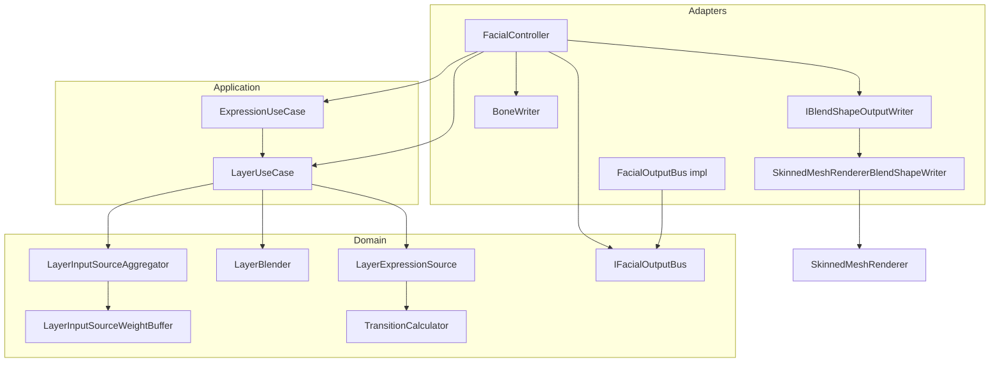
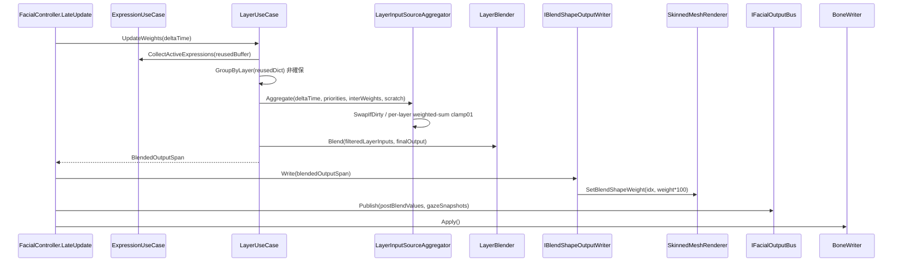
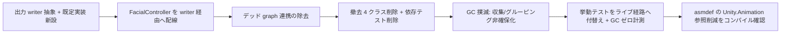

# 技術設計書 — blendshape-output-refactor

## Overview

**Purpose**: 本スペックは FacialControl コアパッケージ（`com.hidano.facialcontrol`）の BlendShape 出力経路から、出力に寄与していない**デッド状態の `PlayableGraph` 資産を撤去**し、managed 集約／ブレンド経路に残る**毎フレーム GC アロケーションを撲滅**し、現行の `SkinnedMeshRenderer.SetBlendShapeWeight` 直書きを**差し替え可能な出力ライター抽象の背後へ整理**する。

**Users**: パッケージ利用者（Unity エンジニア / VTuber 配信者）とメンテナ（Hidano）。利用者は配信・ゲーム実行中の GC スパイク解消という品質改善を、コード変更なしに享受する。メンテナはデッドコードの排除と、将来の Job/Burst 出力実装への差し替え点を得る。

**Impact**: 撤去 4 クラス（`FacialControlMixer` / `LayerPlayable` / `PlayableGraphBuilder` / `PropertyStreamHandleCache`）とそれらに依存する検証資産が消える。`FacialController` は `PlayableGraph` 構築・連携コードを失い、出力を `IBlendShapeOutputWriter` 経由に置き換える。`ExpressionUseCase` / `LayerUseCase` の毎フレ経路が非確保化される。出力実装そのもの（managed 直書き）と既存の全機能挙動は不変。`IAnimationJob` / `AnimationStream` による新出力経路と aggregate/blend の Burst 化は導入しない（将来送り）。

### Goals

- デッド `PlayableGraph` 資産（`FacialControlMixer` / `LayerPlayable` / `PlayableGraphBuilder` / `PropertyStreamHandleCache`）と依存検証資産を撤去する（Req 1, 8）。
- BlendShape 出力を Adapters 層の `IBlendShapeOutputWriter` 抽象の背後に置き、既定実装として現行 managed 直書きを提供する。将来 Job/Burst 実装を同抽象へ差し込める構造を保つ（Req 1, 7）。
- 定常運転の `LayerUseCase.UpdateWeights` 経路を毎フレーム GC アロケーションゼロにする（`GetActiveExpressions` の `List` / `GroupByLayer` の `Dictionary`・`List` を再利用バッファ化）（Req 2）。
- 既存挙動（マルチソース集約・レイヤー別ブレンド・`layerOverrideMask` 抑制・overlay suppress・lipsync 音素 overlay・ARKit/PerfectSync 自動生成・`LayerInputSourceWeightBuffer` の SwapIfDirty・`TransitionCurve` 評価・BoneWriter 経路）を一切回帰させない（Req 3, 4, 5, 6）。
- TDD を維持し、撤去で無検証化する遷移補間・ブレンド・GC ゼロをライブ経路の非回帰テストへ付替える（Req 8）。

### Non-Goals

- `IAnimationJob` / `AnimationStream` / `AnimationScriptPlayable` による新 BlendShape 出力経路の導入（将来送り）。
- aggregate / blend / 遷移計算の Burst 化（`Unity.Burst` / Job 移植 / `TransitionCurve` の Burst 内 LUT 評価）（将来送り）。
- BoneWriter のボーン直書きの `IAnimationJob` / `OnAnimatorIK` 化（backlog M-8、bone-control 側）。
- Timeline 統合本体（将来対応）。
- 「active 取得 2 系統分断」（系1 `ExpressionUseCase` / 系2 `ExpressionTriggerInputSource`）バグの是正そのもの（本スペックは抑制・overlay の非回帰のみ保証）。
- ライブ経路へのベース表情 seed 適用是非（`contribution-mask-and-base-expression` の領分。本スペックは現状挙動を温存）。
- 隣接デッドコード（runtime 未使用の `NativeArrayPool` / `AnimationClipCache`）の撤去（撤去対象外。現状維持）。

## Boundary Commitments

### This Spec Owns

- 撤去対象 4 クラス（`FacialControlMixer` / `LayerPlayable` / `PlayableGraphBuilder` / `PropertyStreamHandleCache`）の削除と、`FacialController` 内の `PlayableGraph` 連携コード（`_graphBuildResult` フィールド・`PlayableGraphBuilder.Build`/`Graph.Play`・`ApplyExpressionToPlayable`/`RemoveExpressionFromPlayable`・`ExpandBlendShapeValues`/`FindBlendShapeIndex`・`Cleanup` の graph 解放）の除去。
- BlendShape 出力ライター抽象 `IBlendShapeOutputWriter`（Adapters 層、新設）と既定実装 `SkinnedMeshRendererBlendShapeWriter`（現行 `BlendShapeTarget[][]` マッピングと `weight*100f` スケール変換・`SetBlendShapeWeight` 直書きを内包）。
- `FacialController.LateUpdate` の出力反映を writer 経由へ置換する配線。
- `ExpressionUseCase` のアクティブ表情収集の非確保版 API（`CollectActiveExpressions(List<Expression>)`）。
- `LayerUseCase.UpdateWeights` 内の `GroupByLayer` 非確保化（事前確保レイヤー名スロット辞書 + 再利用 `List`）とアクティブ表情収集の再利用バッファ化。
- 撤去依存テスト資産の削除と、ライブ経路への非回帰テスト付替え（Transition / EmotionLipSyncBlend / Performance / NativeArrayLeak / GCAllocation）。
- Adapters asmdef の `Unity.Animation` 参照削減可否の確定（撤去後コンパイル確認に基づく）。

### Out of Boundary

- 集約／ブレンド／遷移のアルゴリズム本体（`LayerInputSourceAggregator` / `LayerBlender` / `LayerExpressionSource.Tick` / `TransitionCalculator` / `LayerInputSourceWeightBuffer`）の振る舞い変更。**読まずに済む範囲で温存**し、GC 撲滅は呼出側（Application 層）の収集／グルーピングに限定する。
- 新出力経路（`IAnimationJob`/Burst）の実装。差し替え点（interface）のみ用意し、新実装は将来スペックで行う。
- ベース表情の bake パイプライン（Editor）とライブ適用方式（`ContributeMask`）。
- 「active 取得 2 系統分断」バグの修正。
- BoneWriter / OSC / Gaze / InputSystem アダプタの内部実装。

### Allowed Dependencies

- Upstream:
  - `Hidano.FacialControl.Domain`（`Expression` / `FacialProfile` / `LayerOverrideMask` / `Domain.Services.*` / `Domain.Interfaces.IInputSource` / `Domain.Adapters.IFacialOutputBus`）。
  - `Hidano.FacialControl.Application`（`ExpressionUseCase` / `LayerUseCase`）。
  - Engine: `SkinnedMeshRenderer`（writer 実装）・`Animator`（既存依存）・`Time`（既存依存）。
- 制約:
  - asmdef 依存方向（Adapters → Application → Domain）を破らない。Domain は `Unity.Collections` のみ Engine 系参照を許す既存契約を維持。
  - Engine 機能（`SkinnedMeshRenderer` 等）は Adapters 層に封じ込める。
  - `Unity.Animation` / `UnityEngine.Playables` / `UnityEngine.Animations` 参照は撤去で消す方向（残存有無は実装フェーズでコンパイル確認）。

### Revalidation Triggers

- `IBlendShapeOutputWriter` のメソッドシグネチャ（出力 Span の正規化規約・ターゲットマッピング受け渡し）が変わるとき → 将来の Job/Burst 実装と Fake テストが再検証要。
- `LayerUseCase` / `ExpressionUseCase` の公開 API シグネチャが変わるとき（本スペックは非破壊維持が前提）。
- 出力スケール規約（anim 0..100 ⇄ domain 0..1）の所在が writer 実装から移動するとき。
- asmdef 依存（特に `Unity.Animation` 参照削減）が変わるとき → 依存パッケージ（osc / inputsystem）と Tests asmdef の参照を再確認。

## Architecture

### Existing Architecture Analysis

現行の BlendShape 出力には**生きた経路**と**デッドな経路**が併存する。

- **生きた経路（温存対象）**: `FacialController.LateUpdate` →
  `LayerUseCase.UpdateWeights(deltaTime)`（系1 `ExpressionUseCase` の active 表情をレイヤー別に `LayerExpressionSource` へ供給 + 系2 `ExpressionTriggerInputSource` 群を `LayerInputSourceAggregator` で集約 → `LayerBlender.Blend` で優先度ブレンド → `_finalOutput`）→
  `BlendedOutputSpan`（zero-alloc Span）→ `FacialController` が `_blendShapeTargets[i]` に `weight*100f` で `SetBlendShapeWeight` 直書き → `PublishFacialOutput`（OutputBus）→ `BoneWriter.Apply`。
- **デッドな経路（撤去対象）**: `PlayableGraphBuilder.Build` が `FacialControlMixer`（root ScriptPlayable）と `LayerPlayable`（per-layer）を構築し `AnimationPlayableOutput` で Animator に接続。`FacialControlMixer.PrepareFrame`/`ComputeOutput` が `OutputWeights`（NativeArray）を計算するが ScriptPlayable は `AnimationStream` に書かず、出力 NativeArray は誰にも読まれない。`Activate/Deactivate` が `LayerPlayable` 状態を変えるが最終出力に寄与しない。`PropertyStreamHandleCache` はどこからも生成されない。

保たねばならない既存ドメイン境界:
- Domain（Unity 非依存契約）／ Application（ユースケース）／ Adapters（Engine 依存）の 3 層と asmdef 依存方向。
- 出力スケール二重規約（anim カーブ 0..100、domain/JSON/snapshot は正規化 0..1。変換点は writer の `weight*100f` に限局）。
- `LayerInputSourceWeightBuffer` の任意スレッド書込み + SwapIfDirty による安全な取り込み。

対処する技術的負債: デッド `PlayableGraph` 資産の撤去、`Application` 層の毎フレ `List`/`Dictionary` 確保の撲滅、出力直書きの抽象化。

### Architecture Pattern & Boundary Map



**Architecture Integration**:
- Selected pattern: 既存クリーンアーキテクチャ（Ports & Adapters）を維持。出力は新 Port `IBlendShapeOutputWriter`（Adapters 層）で抽象化。
- Domain/feature boundaries: 集約/ブレンド/遷移は Domain（不変）、ユースケース駆動と再利用バッファは Application、Engine 書込みは Adapters writer に封じる。
- Existing patterns preserved: `LayerInputSourceWeightBuffer` の double-buffer + SwapIfDirty、`LayerExpressionSource` の `ContributeMask` 駆動、`LayerBlender` の優先度ブレンド、OutputBus publish、BoneWriter Apply 順序。
- New components rationale: `IBlendShapeOutputWriter` は Req 1.2/1.4/7.1（差し替え点）を満たすために必要。`SkinnedMeshRendererBlendShapeWriter` は現行直書きを一実装として保持するために必要。
- Steering compliance: 依存方向（Adapters→Application→Domain）厳守、Engine 依存を Adapters に封じ込め、レンダーパイプライン/シェーダー/物理演算非依存、エラーは Unity 標準ログのみ、毎フレ GC ゼロ目標。

### Technology Stack

| Layer | Choice / Version | Role in Feature | Notes |
|-------|------------------|-----------------|-------|
| Backend / Services（Application） | C# (Unity 6000.3.2f1) | アクティブ表情収集 / レイヤーグルーピングの非確保化 | 既存 `ExpressionUseCase` / `LayerUseCase` を拡張 |
| Data / Storage（Domain） | `Unity.Collections`（`NativeArray`） | `LayerInputSourceWeightBuffer` の double-buffer（既存、変更なし） | 確保は構築時 1 回・破棄時解放 |
| Infrastructure / Runtime（Adapters） | UnityEngine（`SkinnedMeshRenderer` / `Animator` / `Time`） | 出力ライター実装、LateUpdate 配線 | `Unity.Animation` / `UnityEngine.Playables` 参照は撤去で削減 |

> 撤去により Adapters asmdef から `Unity.Animation` 参照を外せる見込み（research.md「Engine API 依存の局在性」）。最終確定は実装フェーズのコンパイル確認に委ねる。

## File Structure Plan

### Directory Structure

```
Runtime/
├── Adapters/
│   └── Playable/
│       ├── FacialController.cs                       # 改修: graph 連携除去、writer 経由出力へ
│       ├── IBlendShapeOutputWriter.cs                # 新設: 出力ライター抽象（Adapters）
│       ├── SkinnedMeshRendererBlendShapeWriter.cs    # 新設: 既定実装（managed 直書き）
│       ├── FacialControlMixer.cs                     # 撤去
│       ├── LayerPlayable.cs                          # 撤去
│       ├── PlayableGraphBuilder.cs                   # 撤去
│       ├── PropertyStreamHandleCache.cs              # 撤去
│       ├── AnimationClipCache.cs                     # 現状維持（撤去対象外）
│       └── NativeArrayPool.cs                        # 現状維持（撤去対象外）
├── Application/
│   └── UseCases/
│       ├── ExpressionUseCase.cs                      # 改修: 非確保収集 API 追加
│       └── LayerUseCase.cs                           # 改修: GroupByLayer 非確保化・収集バッファ再利用
└── Domain/                                           # 変更なし（集約/ブレンド/遷移は温存）
```

> `IBlendShapeOutputWriter.cs` と `SkinnedMeshRendererBlendShapeWriter.cs` は `Adapters/Playable/` 配下に置く（出力実体の現所在に合わせる）。`.meta` はランダム 32 桁 hex GUID で新規生成する。

### Modified Files

- `Runtime/Adapters/Playable/FacialController.cs` — `_graphBuildResult` フィールド・`PlayableGraphBuilder.Build`/`Graph.Play` 呼出・`ApplyExpressionToPlayable`/`RemoveExpressionFromPlayable`・`ExpandBlendShapeValues`/`FindBlendShapeIndex`・`Cleanup` の graph 解放・`using UnityEngine.Playables` を除去。`LateUpdate` の `SetBlendShapeWeight` 直書きを `_outputWriter.Write(output)` に置換。`Activate/Deactivate` は `_expressionUseCase` 操作のみ残す。`BlendShapeTarget` マッピング構築（`CollectBlendShapeNames`）は writer 初期化へ移譲。
- `Runtime/Application/UseCases/ExpressionUseCase.cs` — `CollectActiveExpressions(List<Expression> buffer)`（呼出側バッファに `Clear`→`Add`）を追加。`GetActiveExpressions()`（防御コピー返却）は外部/Editor 用に温存。
- `Runtime/Application/UseCases/LayerUseCase.cs` — `_activeBuffer`（再利用 List）と `_groupedByLayer`（プロファイルのレイヤー名で事前確保した `Dictionary<string,List<Expression>>` + 各 List 再利用）を導入。`UpdateWeights` 内の `GetActiveExpressions()`/`GroupByLayer()` を非確保版へ置換。プロファイル切替（`SetProfile`/`BuildAggregatorPipeline`）でバッファ再構築。

### Removed Files

- `Runtime/Adapters/Playable/FacialControlMixer.cs`（+ `.meta`）
- `Runtime/Adapters/Playable/LayerPlayable.cs`（+ `.meta`）
- `Runtime/Adapters/Playable/PlayableGraphBuilder.cs`（+ `.meta`）
- `Runtime/Adapters/Playable/PropertyStreamHandleCache.cs`（+ `.meta`）
- `Tests/PlayMode/Adapters/PlayableGraphBuilderTests.cs` / `LayerPlayableTests.cs`（+ `.meta`）
- `Tests/EditMode/Adapters/PropertyStreamHandleCacheTests.cs` / `Playable/FacialControlMixerBaseExpressionTests.cs`（+ `.meta`）

## System Flows

### 出力フレームフロー（撤去後）



撤去前との差分は (a) `PlayableGraph` 構築・`PrepareFrame` が消える、(b) `SetBlendShapeWeight` 直書きが `IBlendShapeOutputWriter.Write` 経由になる、(c) 収集／グルーピングが非確保版になる、の 3 点のみ。集約／ブレンド／遷移／OutputBus／BoneWriter の各ステップと結果値は不変。

## Requirements Traceability

| Requirement | Summary | Components | Interfaces | Flows |
|-------------|---------|------------|------------|-------|
| 1.1 | デッド `PlayableGraph` 資産の撤去 | FacialController（改修）, 撤去 4 クラス | — | — |
| 1.2 / 1.3 | 出力を差し替え可能 writer 抽象 + managed 既定実装 | IBlendShapeOutputWriter, SkinnedMeshRendererBlendShapeWriter | `IBlendShapeOutputWriter.Write` | 出力フレームフロー |
| 1.4 / 7.1 | 将来 Job/Burst 実装を同抽象へ差替え可能 | IBlendShapeOutputWriter | `IBlendShapeOutputWriter` | — |
| 1.5 | BoneWriter 経路の従来動作 | FacialController（Apply 順序温存） | — | 出力フレームフロー |
| 1.6 | ベース Clip サンプリング・最終出力を撤去前と同一 | FacialController, （ベース bake は Editor 側・不変） | — | — |
| 2.1 / 2.2 / 2.3 | 毎フレ GC ゼロ（脱 List/Dictionary） | ExpressionUseCase, LayerUseCase | `CollectActiveExpressions` | 出力フレームフロー |
| 2.4 / 2.5 | NativeArray は一度確保・破棄時解放 | LayerInputSourceWeightBuffer（既存）, FacialController.Cleanup | — | — |
| 2.6 | 同時 10 体の既存どおり成立 | FacialController（per-instance）, LayerUseCase | — | — |
| 3.1–3.4 | ハイブリッド入力・ランタイム重み書込みの非回帰 | LayerInputSourceAggregator, LayerInputSourceWeightBuffer（不変） | `SetInputSourceWeight` / `SwapIfDirty` | 出力フレームフロー |
| 4.1–4.4 | 抑制・overlay の非回帰 | LayerUseCase（layerOverrideMask 抑制・不変ロジック）, OverlayInputSource（不変） | — | — |
| 5.1–5.4 | ARKit/PerfectSync・プロファイル仕様の非回帰 | （自動生成・プロファイル変換は不変） | — | — |
| 6.1–6.4 | 遷移補間・TransitionCurve の非回帰 | LayerExpressionSource, TransitionCalculator（不変） | — | — |
| 7.2 / 7.3 / 7.4 | クリーンアーキ整合・Engine 封じ込め・標準ログ | IBlendShapeOutputWriter（Adapters）, asmdef | — | — |
| 8.1–8.4 | テスト整合・回帰検証・GC 計測 | 撤去 4 テスト, 付替えテスト群 | — | — |

## Components and Interfaces

| Component | Domain/Layer | Intent | Req Coverage | Key Dependencies (P0/P1) | Contracts |
|-----------|--------------|--------|--------------|--------------------------|-----------|
| IBlendShapeOutputWriter | Adapters | BlendShape 出力の差し替え可能な書込み契約 | 1.2, 1.4, 7.1, 7.2 | SkinnedMeshRenderer (P0) | Service |
| SkinnedMeshRendererBlendShapeWriter | Adapters | 現行 managed 直書きの既定実装 | 1.3, 1.6, 7.2, 7.3 | SkinnedMeshRenderer (P0) | Service |
| FacialController（改修） | Adapters | graph 撤去・writer 配線・出力オーケストレーション | 1.1, 1.5, 1.6, 2.5, 2.6 | LayerUseCase (P0), IBlendShapeOutputWriter (P0), BoneWriter (P1), IFacialOutputBus (P1) | Service, State |
| ExpressionUseCase（改修） | Application | アクティブ表情の非確保収集 API | 2.2 | FacialProfile (P0) | Service |
| LayerUseCase（改修） | Application | グルーピング非確保化・収集バッファ再利用 | 2.1, 2.2, 2.3, 4.1 | ExpressionUseCase (P0), LayerInputSourceAggregator (P0), LayerBlender (P0) | Service, State |

集約／ブレンド／遷移／重みバッファ（`LayerInputSourceAggregator` / `LayerBlender` / `LayerExpressionSource` / `TransitionCalculator` / `LayerInputSourceWeightBuffer`）は**振る舞い変更なし**のため詳細ブロックを省略する（非回帰の保証対象であり、本スペックは読まずに温存する）。

### Adapters 層

#### IBlendShapeOutputWriter（新設）

| Field | Detail |
|-------|--------|
| Intent | 正規化済み BlendShape 出力 Span を受け取り、出力先へ反映する差し替え可能な書込み契約 |
| Requirements | 1.2, 1.4, 7.1, 7.2 |

**Responsibilities & Constraints**
- 主責務: 出力ターゲットの初期化（BlendShape 名集合 → 出力先マッピング）と、毎フレームの出力反映。
- 境界: 「正規化 Span（0..1）→ 出力先反映」までを所有する。集約／ブレンド（Application/Domain）は契約の外。`weight*100f` スケール変換は実装内に内包し、スケール規約の単一所在とする。
- 不変条件: `Write` は毎フレーム呼ばれても新規ヒープ確保を行わない（Req 2.1 の経路に含まれる）。出力先が存在しない index は警告なしでスキップ（Req 5.2 と整合）。
- 寿命: `FacialController` の初期化（プロファイル/レンダラ確定時）に構築・破棄される。複数キャラクターは各 `FacialController` が自身の writer を所有する（Req 2.6）。

**Dependencies**
- Inbound: FacialController — 毎フレーム `Write` 呼出（P0）
- Outbound: SkinnedMeshRenderer（既定実装のみ）— BlendShape 反映先（P0）
- External: なし

**Contracts**: Service [x] / API [ ] / Event [ ] / Batch [ ] / State [ ]

##### Service Interface

```csharp
namespace Hidano.FacialControl.Adapters.Playable
{
    /// <summary>
    /// 正規化済み BlendShape 出力を出力先へ反映する差し替え可能な書込み契約。
    /// 既定実装は SkinnedMeshRenderer への managed 直書き。
    /// 将来 IAnimationJob/Burst ベースの実装を同契約へ差し込める（backlog M-8）。
    /// </summary>
    public interface IBlendShapeOutputWriter : System.IDisposable
    {
        /// <summary>出力対象の BlendShape 個数（出力 Span の想定長）。</summary>
        int BlendShapeCount { get; }

        /// <summary>
        /// 正規化済み（0..1）の出力をフレーム単位で出力先へ反映する。
        /// 渡された Span は呼出中のみ有効。実装は新規ヒープ確保を行わない。
        /// </summary>
        /// <param name="normalizedWeights">出力 index 順に並んだ 0..1 の重み。</param>
        void Write(System.ReadOnlySpan<float> normalizedWeights);
    }
}
```

- Preconditions: `normalizedWeights` は出力 index 順（`FacialController` が構築した BlendShape 名集合順）に並ぶ。
- Postconditions: 各出力 index に対応する全ターゲット（同名 BlendShape が複数 Renderer に存在する場合を含む）へ反映される。`normalizedWeights.Length` と `BlendShapeCount` の不一致は短い方に合わせて処理する。
- Invariants: 毎フレ呼出で GC ゼロ。スケール変換（0..1 → 0..100）は実装内に閉じる。

**Implementation Notes**
- Integration: `FacialController.LateUpdate` が `_outputWriter.Write(_layerUseCase.BlendedOutputSpan)` を呼ぶ。OutputBus publish は writer の後段で従来どおり正規化値を流す（`PublishFacialOutput`）。
- Validation: Fake 実装（テスト用）で `Write` に渡る Span を捕捉し、ライブ経路の出力等価を assert（Req 8.3）。
- Risks: writer 構築タイミング（プロファイル/レンダラ確定後）を誤ると出力欠落。初期化順序を `Initialize`/`InitializeWithProfile`/`LoadCharacter` の Renderer 解決後に固定する。

#### SkinnedMeshRendererBlendShapeWriter（新設）

| Field | Detail |
|-------|--------|
| Intent | 現行の `BlendShapeTarget[][]` マッピングと `SetBlendShapeWeight` 直書きを `IBlendShapeOutputWriter` の既定実装として保持 |
| Requirements | 1.3, 1.6, 7.2, 7.3 |

**Responsibilities & Constraints**
- 主責務: コンストラクト時に対象 `SkinnedMeshRenderer[]` と BlendShape 名集合から出力 index → `(Renderer, rendererBlendShapeIndex)[]` マッピングを構築（現行 `FacialController.CollectBlendShapeNames` のロジックを移譲）。`Write` で各 index に `weight*100f` を `SetBlendShapeWeight`。
- 境界: Engine 型（`SkinnedMeshRenderer`）への依存を本実装に封じ込める（Req 7.2）。レンダーパイプライン/シェーダー/物理演算非依存（Req 7.3）。
- 不変条件: マッピングは構築時 1 回・`Write` で再構築しない（Req 2.1）。同名 BlendShape の複数 Renderer 反映・2 バイト文字/特殊記号名の正しい扱い（Req 5.3）を現行どおり維持。
- 命名規則を固定しない（Req 5.3）：BlendShape 名は文字列一致で解決する。

**Dependencies**
- Inbound: FacialController（構築・Write・Dispose）（P0）
- Outbound: SkinnedMeshRenderer — `SetBlendShapeWeight`（P0）
- External: なし

**Contracts**: Service [x] / State [ ]

**Implementation Notes**
- Integration: 出力 index → BlendShape 名集合は `FacialController` が `ResolveSkinnedMeshRenderers()` 後に決定し、writer 構築時に Renderer 配列とともに渡す。現行 `CollectBlendShapeNames` の二重 BlendShape（同名複数 Renderer）処理を writer 側へ移す。
- Validation: 既存の出力結果（`weight*100f` の最終 BlendShape 重み）と等価であることを PlayMode 非回帰テストで確認（Req 1.6, 4.4, 6.4）。
- Risks: `weight*100f` 規約を writer 外に残すと二重スケール事故（MEMORY 既知）の再発。本実装に単一所在化する。

#### FacialController（改修）

| Field | Detail |
|-------|--------|
| Intent | `PlayableGraph` 連携を撤去し、出力を writer 経由に置換、既存オーケストレーションを温存 |
| Requirements | 1.1, 1.5, 1.6, 2.5, 2.6 |

**Responsibilities & Constraints**
- 撤去: `_graphBuildResult` フィールド、`PlayableGraphBuilder.Build`/`Graph.Play`、`ApplyExpressionToPlayable`/`RemoveExpressionFromPlayable`、`ExpandBlendShapeValues`/`FindBlendShapeIndex`、`Cleanup` の `_graphBuildResult.Dispose()`、`using UnityEngine.Playables`。
- 置換: `LateUpdate` の `SetBlendShapeWeight` 直書きループを `_outputWriter.Write(output)` へ。`BlendShapeTarget`/`CollectBlendShapeNames` のマッピング構築を writer 構築へ移譲（`_blendShapeNames` の決定は `FacialController` に残す）。
- 温存: `Activate/Deactivate` の `_expressionUseCase` 操作、`LayerUseCase` 駆動、OutputBus publish、`BoneWriter.Apply()` の LateUpdate 末尾順序、child LifetimeScope / WeightBuffer の Dispose 順序。
- 不変条件: 出力反映 → OutputBus publish → BoneWriter Apply の順序を維持（Req 1.5）。各キャラクターが自身の writer / LayerUseCase を所有（Req 2.6）。

**Dependencies**
- Outbound: LayerUseCase（P0）, IBlendShapeOutputWriter（P0）, ExpressionUseCase（P0）, BoneWriter（P1）, IFacialOutputBus（P1）

**Contracts**: Service [x] / State [x]

##### State Management
- State model: `_isInitialized` / `_currentProfile` / `_outputWriter` / `_layerUseCase` / `_expressionUseCase` / `_boneWriter`。
- Persistence & consistency: プロファイル切替（`Initialize`/`InitializeWithProfile`/`LoadCharacter`/`ReloadProfile`）で `Cleanup`→再構築。`Cleanup` は child scope → writer.Dispose → LayerUseCase.Dispose → BoneWriter.Dispose の順（graph.Dispose は除去）。
- Concurrency strategy: 重み書込みは `LayerInputSourceWeightBuffer` の SwapIfDirty に委譲（任意スレッド可、既存）。出力反映はメインスレッド LateUpdate。

**Implementation Notes**
- Integration: writer は `_blendShapeNames` 確定後に構築。`Cleanup` で `_outputWriter?.Dispose()` を追加（既定実装は no-op でも IDisposable 契約を満たす）。
- Validation: `Activate→1 フレーム→出力` の非回帰、プロファイル切替後の active 反映、10 体同時動作（Req 2.6）。
- Risks: graph 撤去で `Activate/Deactivate` の副作用（`LayerPlayable` 変更）が消えるが、ライブ active は系1/系2 が保持するため出力不変（research R1）。

### Application 層

#### ExpressionUseCase（改修）

| Field | Detail |
|-------|--------|
| Intent | 毎フレ `List` 確保を排した非確保アクティブ表情収集 API を追加 |
| Requirements | 2.2 |

**Responsibilities & Constraints**
- 追加: `void CollectActiveExpressions(List<Expression> buffer)` — `buffer.Clear()` 後、`_activeByLayer.Values` を走査して `buffer.Add`。新規確保なし。
- 温存: 既存 `GetActiveExpressions()`（防御コピー返却）は外部/Editor 用（毎フレ経路でない）に維持。`Activate`/`Deactivate`/`TryGetTopActiveExpression`/`SetProfile` は不変。

**Contracts**: Service [x]

##### Service Interface

```csharp
// ExpressionUseCase に追加
public void CollectActiveExpressions(System.Collections.Generic.List<Expression> buffer);
```
- Preconditions: `buffer` は呼出側が所有・再利用する非 null List。
- Postconditions: `buffer` には現在アクティブな全 Expression が `_activeByLayer` 走査順に格納される（既存 `GetActiveExpressions` と同一順序）。
- Invariants: メソッド内で新規ヒープ確保を行わない。

**Implementation Notes**
- Integration: `LayerUseCase.UpdateWeights` が自身の再利用バッファを渡して呼ぶ。
- Validation: `GetActiveExpressions()` と `CollectActiveExpressions(buffer)` の結果同値を EditMode で assert。

#### LayerUseCase（改修）

| Field | Detail |
|-------|--------|
| Intent | `UpdateWeights` 内のグルーピングとアクティブ収集を再利用バッファ化して毎フレ GC をゼロにする |
| Requirements | 2.1, 2.2, 2.3, 4.1 |

**Responsibilities & Constraints**
- 追加状態: `_activeBuffer`（再利用 `List<Expression>`）と `_groupedByLayer`（`Dictionary<string,List<Expression>>`、キーはプロファイルのレイヤー名で事前確保、値の各 `List` は再利用）。
- 置換: `UpdateWeights` 先頭の `_expressionUseCase.GetActiveExpressions()` を `CollectActiveExpressions(_activeBuffer)` に、`GroupByLayer(activeExpressions)` を非確保版（`_groupedByLayer` の各 List を `Clear` してから振り分け）に置換。
- 温存: layerOverrideMask 抑制（`_layer2ActiveBuffer` / `CollectActiveExpressionsFromAdditionalSources`）、`Aggregate`/`Blend` 呼出、`_finalOutput` の `Array.Clear`、フィルタロジック（`HasBeenActive`/`hasAdditional`/`suppressed`）は不変。
- 不変条件: プロファイルのレイヤー集合は構築時固定 → 辞書キーは `BuildAggregatorPipeline` で確定。プロファイル切替時に再構築。`GetEffectiveLayer` が宣言外レイヤー名を返した場合のフォールバック（既存 `GroupByLayer` は動的にキー追加）に対し、事前確保辞書では「未知キーは対応 List が無い」ため、宣言レイヤー名に正規化されることを前提とする（`GetEffectiveLayer` は profile.Layers の名前を返す契約）。

**Contracts**: Service [x] / State [x]

##### State Management
- State model: 既存の集約パイプライン状態 + `_activeBuffer` + `_groupedByLayer`。
- Persistence & consistency: `BuildAggregatorPipeline`（`SetProfile`/ctor から呼ばれる）で `_groupedByLayer` をレイヤー名キーで再構築、`_activeBuffer` を確保。
- Concurrency strategy: `UpdateWeights` はメインスレッド単一呼出（既存前提）。

**Implementation Notes**
- Integration: `GetEffectiveLayer` が返すレイヤー名が `_groupedByLayer` のキー集合に含まれることを前提とする。万一未知キーが来た場合は当該表情をスキップ（現状の動的辞書とは「未宣言レイヤーへの表情」の扱いが変わり得るが、`GetEffectiveLayer` の契約上は profile.Layers の名前のみ返るため実害なし。実装時に契約を再確認する）。
- Validation: GC ゼロ計測テスト（`UpdateWeights` を warmup 後 N フレーム、`ProfilerRecorder("GC.Alloc")==0`）。マルチソース集約・抑制・overlay・遷移の before/after 出力等価テスト（Req 2.x, 4.x, 6.4）。
- Risks: 事前確保辞書がプロファイル切替に追従しないと stale。`BuildAggregatorPipeline` で必ず再構築する（research R4）。

## Error Handling

### Error Strategy
本スペックはエラーハンドリングを Unity 標準ログ（`Debug.Log/Warning/Error`）の範囲に限定し、カスタム例外型を新設しない（Req 7.4）。撤去・抽象化に伴う新たなエラー分類は導入しない。

### Error Categories and Responses
- 出力先未解決（BlendShape 名がどの Renderer にも無い）: 既存どおり警告なしでスキップ（Req 5.2、ARKit/PerfectSync の未対応パラメータと同方針）。
- Renderer / Animator 未検出: 既存どおり `Debug.LogWarning` + 初期化スキップ。
- writer 未構築での `Write` 呼出: `FacialController.LateUpdate` のガード（`_isInitialized` / writer null）で no-op（既存ガード様式に合わせる）。
- 範囲外重み書込み: `LayerInputSourceWeightBuffer.SetWeight` の既存 silent clamp / 範囲外 warning を温存（Req 3.2）。

### Monitoring
- `LayerInputSourceAggregator` の空レイヤー per-session 1 回 warning / verbose log rate-limit は不変。
- GC ゼロは `ProfilerRecorder("GC.Alloc")` ベースの自動テストで観測（Req 8.4）。

## Testing Strategy

### Unit Tests（EditMode・同期/Fake）
- `ExpressionUseCase.CollectActiveExpressions` が `GetActiveExpressions` と同一順序・同一集合を返す。
- `LayerUseCase` の非確保 `GroupByLayer` が、置換前と同一のレイヤー別グルーピング結果を返す（プロファイルのレイヤー名キーで等価）。
- `SkinnedMeshRendererBlendShapeWriter` のマッピング構築（同名 BlendShape の複数 Renderer 集約、2 バイト文字/特殊記号名）が現行 `CollectBlendShapeNames` と等価（Renderer 反映は Fake/抽象越しに検証）。
- 撤去 4 テスト（`PlayableGraphBuilderTests` / `LayerPlayableTests` / `PropertyStreamHandleCacheTests` / `FacialControlMixerBaseExpressionTests`）の削除。

### Integration Tests（PlayMode・ライフサイクル/実反映）
- 遷移補間の非回帰: 旧 `TransitionIntegrationTests` をライブ経路（`LayerUseCase.UpdateWeights` → `LayerExpressionSource.Tick` → `BlendedOutputSpan`）へ付替え、LastWins 遷移・遷移割込（現在値から即時新遷移）・`TransitionCurve` 上書き・遷移時間 0..1 秒を assert（Req 6.1–6.4）。
- emotion+lipsync ブレンドの非回帰: 旧 `EmotionLipSyncBlendIntegrationTests` をライブ経路へ付替え、優先度ブレンド・LastWins/Blend・`ContributeMask` 維持を assert（Req 3.1, 4.x）。
- 抑制・overlay の非回帰: `layerOverrideMask` 抑制 / overlay suppress / lipsync 音素 overlay の最終 BlendShape 重みが変更前と同一（Req 4.4）。
- 出力経路の非回帰: `FacialController` 初期化 → `Activate` → 1 フレーム → `IBlendShapeOutputWriter`（Fake）に渡る Span が期待値（Req 1.6）。BoneWriter Apply 順序維持（Req 1.5）。

### Performance / Load（PlayMode）
- 毎フレ GC ゼロ: `LayerUseCase.UpdateWeights` を warmup 後 N フレーム回し `ProfilerRecorder("GC.Alloc") == 0`（Req 2.1, 8.4）。旧 `GCAllocationTests`（`LayerPlayable`/`NativeArrayPool` 計測）はライブ経路計測へ刷新。
- NativeArray リーク: `LayerUseCase.Dispose` / `FacialController` 破棄で `LayerInputSourceWeightBuffer` の NativeArray が解放されリークしない（旧 `NativeArrayLeakTests` の `BuildResult.Dispose` 検証を付替え）（Req 2.5）。
- 10 体同時動作: 旧 `MultiCharacterPerformanceTests`（`PlayableGraphBuilder.Build` 10 体）を `FacialController` × 10 の `UpdateWeights` ループへ付替え、全体が成立し GC ゼロを維持（Req 2.6）。

## Performance & Scalability

_steering の Performance Standards（毎フレ GC ゼロ目標 / `float` 基本 / 同時 10 体）に従う。本スペック固有の目標のみ記載。_

- **毎フレ GC アロケーションゼロ**: 定常運転の `UpdateWeights` 経路で 0 バイト（Req 2.1）。撲滅対象は `GetActiveExpressions` の `List` と `GroupByLayer` の `Dictionary`/`List` のみ。Domain サービスは既に GC ゼロ。
- **ネイティブ確保の単一化**: `LayerInputSourceWeightBuffer` の double-buffer のみが Persistent NativeArray を所有。構築時 1 回確保・破棄時解放（Req 2.4, 2.5）。撤去 graph が持っていた NativeArray は消滅。
- **スループット**: CPU スループットの最大化は本スペック対象外。managed アルゴリズムを不変に保ち、同時 10 体が既存どおり成立することのみ保証（Req 2.6）。将来 `IBlendShapeOutputWriter` の Job/Burst 実装で再評価する。

## Migration Strategy

破壊的なデータ移行は不要（preview 段階・既存 JSON プロファイル不変）。コード撤去とテスト付替えのみ。実装順序の指針:



- ロールバック契機: 付替えテストでライブ経路の出力等価が崩れた場合は、writer 配線 or 非確保化の該当ステップを差し戻す。
- 検証チェックポイント: 各ステップ後に EditMode/PlayMode を実行（Editor を閉じてからの batchmode、MEMORY の TestRunner ロック注意）。`SampleAssetsAreInSyncTests` 4 件赤は pre-existing（backlog M-28）であり本スペック FAIL とは無関係。

## Open Questions / Risks

- **OQ1**: 撤去後に Adapters asmdef から `Unity.Animation` 参照を実際に外せるか（テスト asmdef の `UnityEngine.Playables`/`Unity.Animation` 参照残存有無を含む）。→ 実装フェーズのコンパイル確認で確定（research R3）。設計判断には影響しない。
- **OQ2**: `LayerUseCase` の事前確保辞書で「`GetEffectiveLayer` が profile.Layers 外のレイヤー名を返す」エッジが現実に起きるか。→ 契約上は起きない想定。起きた場合の表情スキップ挙動が現状（動的辞書での暗黙追加）と差異を生むため、実装時に `GetEffectiveLayer` の契約を再確認し、必要なら正規化を入れる。
- **R（既知・非回帰のみ保証）**: 「active 取得 2 系統分断」バグ（系1/系2）。本スペックは抑制・overlay の非回帰のみ保証し、修正はスコープ外。
- **R（隣接デッドコード）**: runtime 未使用の `NativeArrayPool` / `AnimationClipCache` は撤去対象外として現状維持。将来の掃除は backlog 候補。
