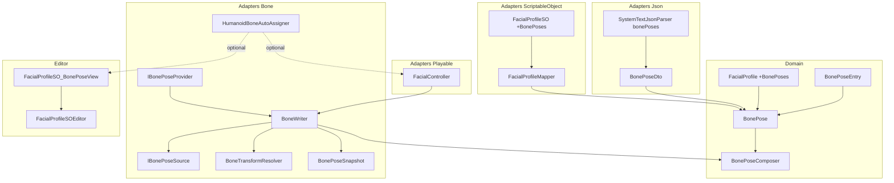
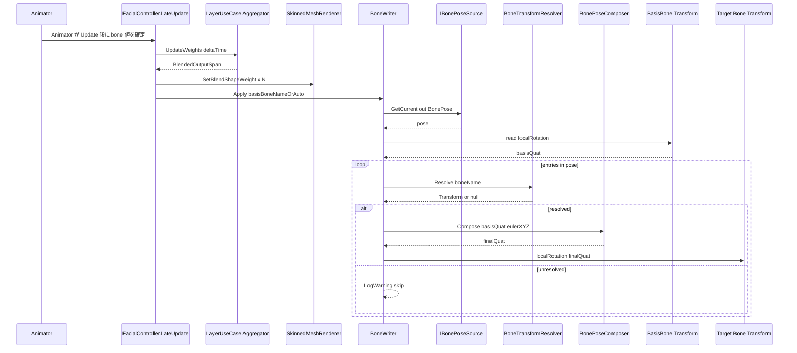
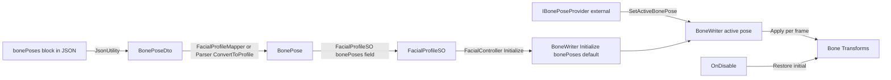

# Design Document: bone-control

## Overview

bone-control は、3D キャラクターの顔回り（眼球・頭・首）に対する **ボーン回転制御パイプライン** を、既存 BlendShape パイプラインから独立したサブシステムとして導入する。本 spec はリアルタイム表情制御ライブラリ FacialControl の preview.2 で予定される視線追従・カメラ目線、および後続 spec `analog-input-binding`（スティック入力でのボーン駆動）の前提インフラとなる。

**Purpose**: 顔ボーンの相対 Euler 回転オーバーライドを、Domain 値として表現・JSON で永続化・Adapters 層で書戻す一連のパイプラインを提供する。

**Users**: FacialControl をパッケージ利用する Unity エンジニア（VTuber 配信向けキャプチャ統合の開発者、ゲーム内表情制御の実装者）。

**Impact**: 既存 BlendShape ミキサ (`FacialControlMixer` / `LayerInputSourceAggregator`) には**手を入れず**、`FacialController.LateUpdate` 末尾に並走ステージを 1 つ追加する。BonePose を持たない既存 `FacialProfile` JSON / SO は無変更で動作し続ける。

### Goals
- BonePose を `Expression` から完全分離した第一級ドメインモデルとして導入する
- ボーン参照を **名前 (string) 一次** とし、Humanoid 自動アサインを Adapters 層のオプションヘルパーとして提供する
- Euler 解釈を **顔相対 (basis bone localRotation 起点)** に固定し、身体モーションが目線に漏れないことを保証する
- 毎フレームのヒープ確保ゼロを維持する（Req 6）
- 既存パイプラインに対して加算的（additive）であり、後方互換を破壊しない
- `analog-input-binding` spec が消費する `IBonePoseProvider` 拡張点を公開する

### Non-Goals
- スティック / アナログ入力 → BonePose 駆動（`analog-input-binding` spec の責務）
- Vector3 ターゲット指定の視線追従、カメラ目線の自動制御（preview.2 後半の別 spec）
- 物理ベースの首振り・揺れもの（MagicaCloth2 等）
- BonePose を `BonePoseSO` として独立した ScriptableObject に切り出すこと（preview.2 以降で検討、本 spec では `FacialProfileSO` 内包に固定）
- Burst / IAnimationJob 化（インターフェースは差し替え可能だが本 spec は通常 C#）

## Boundary Commitments

### This Spec Owns
- `BonePose` / `BonePoseEntry` の Domain モデル定義と不変条件
- 顔相対 Euler から Quaternion への合成数学（Domain 内自前実装、Unity 非依存）
- 名前ベースの Bone Transform 解決（Adapters/Bone）
- Humanoid 自動アサインヘルパー（Adapters/Bone、オプトイン）
- BonePose の毎フレーム書戻し（Adapters/Bone の `BoneWriter`）
- `IBonePoseProvider` 拡張点（外部から BonePose を注入する契約）
- BonePose の JSON 永続化スキーマ（`bonePoses` ブロック、optional）
- `FacialProfileSO` 上での BonePose Editor 編集 UI

### Out of Boundary
- BlendShape ミキシングパイプライン（`LayerInputSourceAggregator`、`LayerBlender`、`FacialControlMixer`）の改変
- `Expression` 構造への BonePose データ埋込み（**Req 1.4**: 参照のみ可、埋込は禁止）
- スティック入力からの BonePose 駆動アダプタ実装（`analog-input-binding` spec の責務）
- 独立 `BonePoseSO` の ScriptableObject 化
- 視線追従ターゲット指定 API
- BonePose の JSON ストリーミング / 部分更新（preview 段階は丸ごと replace）

### Allowed Dependencies
- 上流: `FacialController`（同一クラス内呼出のみ）、`FacialProfile`（読取専用）、`FacialProfileSO`（Editor 経由のシリアライズ）
- インフラ: `UnityEngine.Animator` / `UnityEngine.HumanBodyBones` / `UnityEngine.Transform` / `UnityEngine.Quaternion`（ただし Adapters/Bone 配下のみ）
- 既存 Adapters: `SystemTextJsonParser`（`bonePoses` ブロックの追加処理）、`FacialProfileMapper`（SO ⟷ Domain 変換）
- Domain は `Unity.Collections` のみ参照可（既存契約）

### Revalidation Triggers
- `BonePose` / `BonePoseEntry` の構造変更（フィールド追加・削除）
- `IBonePoseProvider` インターフェースシグネチャ変更
- `FacialController.LateUpdate` の per-frame 順序変更（特に BlendShape 書込と BoneWriter の前後関係）
- JSON `bonePoses` スキーマの破壊的変更（preview 中は許容、preview 終了後は要マイグレーション）
- Domain 層の Quaternion 数学合成順序変更（Z-X-Y → 他順序）

## Architecture

### Existing Architecture Analysis

現在の FacialControl の per-frame パイプラインは **BlendShape 専用** であり、`FacialController.LateUpdate` 内で `LayerInputSourceAggregator → SkinnedMeshRenderer.SetBlendShapeWeight` のみ実行している。Runtime 層には `Transform.localRotation` への書戻しコードは存在しない（`FacialController` が `RequireComponent(typeof(Animator))` を持つのみで bone 駆動には未使用）。

クリーンアーキテクチャ契約（Domain ← Application ← Adapters）と asmdef による依存方向は厳格に守られており、`Hidano.FacialControl.Domain` は `Unity.Collections` のみ参照可（`UnityEngine.Quaternion` 等は使用不可）。本 spec の Domain 層 `BonePoseComposer` は **Unity 非依存の Quaternion 数学を自前実装する**ことでこの契約に準拠する。

JSON パースは `JsonUtility` ベースで、自由形式オブジェクトを扱えないため `inputSources[].options` は `optionsJson` 文字列として 1 段退避している。BonePose は固定スキーマのため、この退避処理は不要で素直な DTO が書ける。

per-frame ゼロアロケーション規約は `LayerInputSourceAggregator` の事前確保 scratch / `LayerInputSourceWeightBuffer` のダブルバッファ + `SwapIfDirty` パターンで確立済み。BoneWriter は同等のパターンを採用するが、BonePose の更新頻度は典型的にフレーム単位以下のため、初期実装はシンプルなシングルスレッド + メインスレッド限定モデルで開始する（research §6 参照）。

### Architecture Pattern & Boundary Map

本 spec はクリーンアーキテクチャ層配置を踏襲する。BlendShape 系の `LayerInputSourceAggregator` パイプラインには接続せず、`FacialController.LateUpdate` 末尾に並走するもう 1 系統のステージとして組み込む。



**Architecture Integration**:
- 選択パターン: **Hybrid (gap-analysis Option C)**。Domain と Adapters/Bone は独立、ランタイム起動は `FacialController` 内包。
- 境界: BlendShape パイプライン（既存）と Bone パイプライン（新規）は **同一フレーム内に直列で並走**する。共有点は `FacialController.LateUpdate` のみ。
- 既存パターン保持: readonly struct + `ReadOnlyMemory<T>` + 防御的コピー / 名前ベース参照 / Adapters のみ Engine 参照 / `IFacialControllerExtension` 系の MonoBehaviour 拡張点。
- 新規必要性: BlendShape パイプラインの出力チャンネルが `float[]` であるのに対し、Bone は `Quaternion[]` で根本的に異質。同一 Aggregator に乗せるのは型的に整合しない。
- Steering 準拠: クリーンアーキテクチャ依存方向 / 毎フレームヒープ確保ゼロ / Unity 標準ログ / UI Toolkit / 名前空間 `Hidano.FacialControl.{Domain|Adapters|Editor}.*` を踏襲。

### Technology Stack

| Layer | Choice / Version | Role in Feature | Notes |
|-------|------------------|-----------------|-------|
| Domain (Unity 非依存) | C# / .NET Standard 2.1 + `Unity.Collections` のみ | BonePose / BonePoseEntry / BonePoseComposer | `UnityEngine.Quaternion` 不可。Z-X-Y Tait-Bryan 順を自前で実装（research §4） |
| Adapters/Bone | C# + `UnityEngine.Animator` / `Transform` / `HumanBodyBones` / `Quaternion` | BoneWriter / Resolver / AutoAssigner / IBonePoseProvider | 既存 `Hidano.FacialControl.Adapters.asmdef` に統合。新 asmdef は作らない |
| Adapters/Json | `JsonUtility`（既存方針） | BonePoseDto round-trip | `bonePoses` は **optional** ブロック。`inputSources` の必須化を真似ない |
| Adapters/ScriptableObject | UnityEngine.ScriptableObject | `FacialProfileSO` の `_bonePoses` Serializable フィールド追加 | round-trip は JSON 側で担保 |
| Editor | UI Toolkit (`FacialProfileSO_BonePoseView`) | BonePose 追加 / 削除 / 編集 / Humanoid 自動アサイン / JSON I/E | IMGUI 不可（既存方針） |

> 既存 `Hidano.FacialControl.Domain.asmdef` は `Unity.Collections` のみ参照可。Bone パイプラインで Quaternion 値型が必要だが、これは Adapters/Bone 層で Domain 値（顔相対 Euler）から Unity の `Quaternion` へ変換する。Domain 内では float 4 タプル相当の自前 `RotationQuat`-like value object を持つ。

## File Structure Plan

### Directory Structure
```
FacialControl/Packages/com.hidano.facialcontrol/
├── Runtime/
│   ├── Domain/
│   │   ├── Models/
│   │   │   ├── BonePose.cs                    # readonly struct, ReadOnlyMemory<BonePoseEntry>
│   │   │   └── BonePoseEntry.cs               # readonly struct (BoneName, EulerXYZ degrees)
│   │   └── Services/
│   │       └── BonePoseComposer.cs            # Euler→Quat (Z-X-Y) + basis composition の自前数学
│   └── Adapters/
│       ├── Bone/                              # 新規ディレクトリ。既存 Adapters asmdef 配下
│       │   ├── IBonePoseSource.cs             # BoneWriter が現在の BonePose を取得する契約
│       │   ├── IBonePoseProvider.cs           # 外部 (analog-input-binding 等) が BonePose を注入する契約
│       │   ├── BoneTransformResolver.cs       # boneName → Transform、キャッシュ込み
│       │   ├── HumanoidBoneAutoAssigner.cs    # HumanBodyBones → bone 名解決ヘルパー
│       │   ├── BoneWriter.cs                  # 毎フレーム適用本体
│       │   └── BonePoseSnapshot.cs            # zero-alloc 中間 buffer
│       └── Json/
│           └── Dto/
│               ├── BonePoseDto.cs             # JsonUtility 互換 DTO (List<BonePoseEntryDto>)
│               └── BonePoseEntryDto.cs        # boneName + (eulerX, eulerY, eulerZ) float
├── Editor/
│   └── Inspector/
│       └── FacialProfileSO_BonePoseView.cs    # InputSourcesView と並ぶサブビュー
├── Tests/
│   ├── EditMode/
│   │   ├── Domain/
│   │   │   ├── BonePoseTests.cs
│   │   │   └── BonePoseComposerTests.cs
│   │   └── Adapters/Json/
│   │       ├── SystemTextJsonParserBonePoseTests.cs
│   │       └── SystemTextJsonParserBonePoseBackwardCompatTests.cs
│   └── PlayMode/
│       ├── Adapters/Bone/
│       │   └── BoneWriterTests.cs             # 実 Transform 書込 + Animator 順序検証
│       └── Performance/
│           └── BoneWriterGCAllocationTests.cs
```

### Modified Files
- `Runtime/Domain/Models/FacialProfile.cs` — `ReadOnlyMemory<BonePose> BonePoses { get; }` を optional に追加（default 空配列）
- `Runtime/Adapters/Json/SystemTextJsonParser.cs` — `ProfileDto` に `bonePoses: List<BonePoseDto>` 追加、`ParseProfile` / `SerializeProfile` 双方向に通す
- `Runtime/Adapters/Json/JsonSchemaDefinition.cs` — `Profile.BonePoses = "bonePoses"` 定数 + `BonePose` / `BonePoseEntry` サブクラス追加
- `Runtime/Adapters/ScriptableObject/FacialProfileSO.cs` — `[SerializeField] private BonePoseSerializable[] _bonePoses` 追加、対応プロパティ
- `Runtime/Adapters/ScriptableObject/FacialProfileMapper.cs` — Domain BonePose ⟷ SO Serializable 双方向変換を追加
- `Runtime/Adapters/Playable/FacialController.cs` — `BoneWriter _boneWriter` 内部保持、`Initialize` で構築、`LateUpdate` 末尾で `_boneWriter.Apply(...)` 呼出、API メソッド `SetActiveBonePose` / `GetActiveBonePose` 公開、`OnDisable` で書込中の Transform を初期姿勢に戻す
- `Editor/Inspector/FacialProfileSOEditor.cs` — `_bonePoseView` フィールド追加、`CreateInspectorGUI` で組込

### 完全に触らない（Req 10 後方互換保証のため）
- `Runtime/Domain/Services/LayerInputSourceAggregator.cs`
- `Runtime/Domain/Services/LayerBlender.cs`
- `Runtime/Domain/Services/ExpressionTriggerInputSourceBase.cs`
- `Runtime/Domain/Services/ValueProviderInputSourceBase.cs`
- `Runtime/Domain/Models/Expression.cs`（**Req 1.4**: BonePose を embed しないため変更不要）
- `Runtime/Adapters/Playable/FacialControlMixer.cs`

## System Flows

### Per-frame Apply Sequence

`FacialController.LateUpdate` における新旧パイプラインの実行順序を示す。BlendShape 書込が完了した**後**で BoneWriter を起動することで、Animator → BlendShape → Bone の決定的順序を `LateUpdate` 内シーケンスのみで確定させる。



**主要決定**:
- BoneWriter は `FacialController.LateUpdate` の **末尾** から呼ばれる（独立 MonoBehaviour にしない）。`[DefaultExecutionOrder]` への依存を排除し、Unity の execution order 実装詳細にロックインしない。
- basis bone の `localRotation` 採取は entries ループの**前**に 1 回だけ。同一フレーム内で複数 bone に同じ basis を適用するため。
- 解決失敗（bone 名不在 / basis bone 不在）は `Debug.LogWarning` + skip。例外は投げない（Req 2.4, 4.6, 6 全体）。
- BonePose が空 / null の場合は basis 採取も skip し、いかなる Transform も書換えない（Req 5.4）。

### BonePose Lifecycle (JSON → SO → Domain → Apply)



**Key Decisions**:
- ロード時の初期 BonePose は `FacialProfile.BonePoses` の最初のエントリ（または empty）。Multi-pose 切替は `IBonePoseProvider` 実装者の責務。
- Provider の `SetActiveBonePose` は次フレームの apply から有効（**Req 11.2**）。即時反映ではない。
- `OnDisable` で BoneWriter は書込中だった bone の `localRotation` を初期化時に snapshot した値へ戻す（Req 5.4 / 10.1 / 10.3 の保証）。

## Requirements Traceability

| Requirement | Summary | Components | Interfaces | Flows |
|-------------|---------|------------|------------|-------|
| 1.1 | BonePose を独立第一級ドメインエンティティとして公開 | BonePose | (Domain value type) | BonePose Lifecycle |
| 1.2 | (boneName, relativeEulerXYZ) のエントリ集合 | BonePose, BonePoseEntry | — | — |
| 1.3 | Domain は `Transform` / `Animator` / `HumanBodyBones` 非参照 | BonePose, BonePoseComposer | — | — |
| 1.4 | Expression は BonePose を **参照のみ**（埋込禁止） | FacialProfile（BonePoses 配列）、Expression（無変更） | — | — |
| 1.5 | BonePose 未参照の既存プロファイルはマイグレーション不要 | FacialProfile, SystemTextJsonParser | — | BonePose Lifecycle |
| 1.6 | null/空 boneName のエントリは構築拒否 | BonePoseEntry コンストラクタ | — | — |
| 1.7 | 同一 BonePose 内の boneName 重複は構築拒否 | BonePose コンストラクタ | — | — |
| 2.1 | bone 参照は string 一次 | BoneTransformResolver, BonePoseEntry | — | Per-frame Apply |
| 2.2 | 多バイト・特殊記号 OK（命名規則固定なし） | BonePoseEntry, BoneTransformResolver | — | — |
| 2.3 | 非 Humanoid モデルでも名前で解決可能 | BoneTransformResolver | — | — |
| 2.4 | 不在 bone 名は Warning + skip | BoneTransformResolver, BoneWriter | — | Per-frame Apply |
| 2.5 | 命名規則を強制しない | BoneTransformResolver | — | — |
| 3.1 | Eye 自動アサイン（HumanBodyBones.LeftEye/RightEye） | HumanoidBoneAutoAssigner | — | — |
| 3.2 | Head 基準（Neck フォールバック設定可） | HumanoidBoneAutoAssigner | — | — |
| 3.3 | 自動アサインはオプトイン | HumanoidBoneAutoAssigner, BonePoseView | — | — |
| 3.4 | 非 Humanoid / 未マップは empty + Warning | HumanoidBoneAutoAssigner | — | — |
| 3.5 | Adapters/Bone 配下に配置（Domain 不可） | HumanoidBoneAutoAssigner | — | — |
| 4.1 | Euler degrees (X, Y, Z) を表面表現とする | BonePoseEntry | — | — |
| 4.2 | basis bone localRotation を起点とした顔相対解釈 | BonePoseComposer, BoneWriter | — | Per-frame Apply |
| 4.3 | world 軸解釈は禁止 | BonePoseComposer, BoneWriter | — | — |
| 4.4 | `basis.localRotation * Quat(eulerXYZ)` 合成 | BonePoseComposer | — | Per-frame Apply |
| 4.5 | body tilt が gaze に漏れない（顔相対の不変条件） | BonePoseComposer, BoneWriter | — | — |
| 4.6 | basis bone 解決失敗は Warning + skip | BoneWriter | — | Per-frame Apply |
| 5.1 | Adapters/Bone のみが Transform/Animator/HumanBodyBones に触れる | (asmdef 規約 + Adapters/Bone 配下のみ) | — | — |
| 5.2 | active BonePose の全 bone localRotation を毎フレーム書込 | BoneWriter | IBonePoseSource | Per-frame Apply |
| 5.3 | BlendShape ミキサと並走する独立ステージ | BoneWriter, FacialController | — | Per-frame Apply |
| 5.4 | active BonePose 不在時は Transform 不変 | BoneWriter | — | — |
| 5.5 | 決定的な適用順序（basis 解決 → entries） | BoneWriter | — | Per-frame Apply |
| 5.6 | set / override / read API を公開 | BoneWriter | IBonePoseProvider, IBonePoseSource | — |
| 6.1 | hot path でヒープ確保ゼロ | BoneWriter, BonePoseSnapshot | — | — |
| 6.2 | 中間 rotation buffer の事前確保・再利用 | BonePoseSnapshot | — | — |
| 6.3 | 同一 BonePose 継続中は再確保しない | BoneWriter | — | — |
| 6.4 | profiling test が alloc 検知時 fail | BoneWriterGCAllocationTests | — | — |
| 7.1 | bonePoses ブロック JSON スキーマ | BonePoseDto, JsonSchemaDefinition | — | BonePose Lifecycle |
| 7.2 | ランタイム JSON → Domain 変換 | SystemTextJsonParser, BonePoseDto | — | BonePose Lifecycle |
| 7.3 | bonePoses 欠落でも従来通り動作 | SystemTextJsonParser | — | BonePose Lifecycle |
| 7.4 | 不正エントリは Warning + skip + 続行 | SystemTextJsonParser | — | — |
| 7.5 | preview 中は additive で前進可能 | JsonSchemaDefinition | — | — |
| 8.1 | Domain BonePose → SO 変換 | FacialProfileMapper, FacialProfileSO | — | BonePose Lifecycle |
| 8.2 | SO → Domain BonePose 変換 | FacialProfileMapper | — | BonePose Lifecycle |
| 8.3 | ランタイムで JSON→SO 変換可能（Editor 専用 API 不要） | FacialProfileMapper | — | — |
| 8.4 | Editor 時は .asset 保存もサポート | FacialProfileSO（既存 CreateAssetMenu） | — | — |
| 8.5 | 名前 / Euler の round-trip 等価 | FacialProfileMapper, BonePoseDto | — | — |
| 9.1 | UI Toolkit の編集パネル | FacialProfileSO_BonePoseView | — | — |
| 9.2 | 名前 + XYZ Euler 入力 | FacialProfileSO_BonePoseView | — | — |
| 9.3 | Humanoid 自動アサインボタン | FacialProfileSO_BonePoseView, HumanoidBoneAutoAssigner | — | — |
| 9.4 | エントリ削除と永続化 | FacialProfileSO_BonePoseView, FacialProfileMapper | — | — |
| 9.5 | JSON Import / Export | FacialProfileSO_BonePoseView | — | — |
| 9.6 | ランタイム UI なし（Editor 限定） | (Editor asmdef 配下のみ) | — | — |
| 10.1 | BonePose 未参照プロファイルは Transform 不変 | BoneWriter | — | — |
| 10.2 | 旧 JSON はそのまま読込可 | SystemTextJsonParser, BackwardCompatTests | — | BonePose Lifecycle |
| 10.3 | 既存 BlendShape ミキサ出力に影響なし | (構造的に独立、共有変数なし) | — | Per-frame Apply |
| 10.4 | 破壊的変更時は migration path（preview 中は許容） | JsonSchemaDefinition | — | — |
| 11.1 | 現在 BonePose の set / get API | FacialController, BoneWriter | IBonePoseProvider, IBonePoseSource | — |
| 11.2 | set した値は次フレームから有効 | BoneWriter | IBonePoseProvider | Per-frame Apply |
| 11.3 | analog-input-binding が Domain 変更不要で消費可能 | (interface 安定性) | IBonePoseProvider | — |
| 11.4 | 入力源を仮定しない汎用 API | IBonePoseProvider | — | — |
| 11.5 | hot path で alloc しない | BoneWriter, IBonePoseProvider | — | — |

## Components and Interfaces

| Component | Domain/Layer | Intent | Req Coverage | Key Dependencies (P0/P1) | Contracts |
|-----------|--------------|--------|--------------|--------------------------|-----------|
| BonePose | Domain.Models | bone 名 + 顔相対 Euler の集合（不変・readonly struct） | 1.1, 1.2, 1.3, 1.7 | (none) | State |
| BonePoseEntry | Domain.Models | 単一 bone の名前 + (X, Y, Z) Euler degrees | 1.2, 1.6, 4.1 | (none) | State |
| BonePoseComposer | Domain.Services | basis quaternion × Euler→Quat 合成（Z-X-Y、Unity 非依存） | 4.2, 4.4, 4.5 | (none) | Service |
| FacialProfile (modified) | Domain.Models | optional `BonePoses` フィールドを保持 | 1.4, 1.5, 10.1 | (none) | State |
| BoneTransformResolver | Adapters.Bone | bone 名 → Transform 解決とキャッシュ | 2.1, 2.2, 2.3, 2.4, 2.5 | Animator (P0) | Service |
| HumanoidBoneAutoAssigner | Adapters.Bone | HumanBodyBones から bone 名取得（オプトイン） | 3.1, 3.2, 3.3, 3.4, 3.5 | Animator (P0) | Service |
| BoneWriter | Adapters.Bone | 毎フレーム BonePose を Transform.localRotation に書戻 | 5.x, 6.x, 11.x | BoneTransformResolver (P0), BonePoseComposer (P0), IBonePoseSource (P0) | Service, State |
| BonePoseSnapshot | Adapters.Bone | hot path で再利用する zero-alloc 中間 buffer | 6.1, 6.2, 6.3 | (none) | State |
| IBonePoseSource | Adapters.Bone | BoneWriter が「現在 active な BonePose」を取り出す契約 | 5.6, 11.1 | (none) | Service |
| IBonePoseProvider | Adapters.Bone | 外部から BonePose を注入する契約（analog-input-binding 用） | 11.x | (none) | Service |
| BonePoseDto / BonePoseEntryDto | Adapters.Json.Dto | JsonUtility 互換 round-trip 担体 | 7.1, 7.2, 7.5, 8.5 | JsonUtility (P0) | API |
| SystemTextJsonParser (modified) | Adapters.Json | `bonePoses` ブロックの双方向処理 | 7.x | BonePoseDto (P0) | API |
| FacialProfileSO (modified) | Adapters.ScriptableObject | `_bonePoses` Serializable フィールド | 8.1, 8.4 | (Unity SO) | State |
| FacialProfileMapper (modified) | Adapters.ScriptableObject | Domain ⟷ SO 双方向変換 | 8.1, 8.2, 8.5 | SystemTextJsonParser (P1) | Service |
| FacialController (modified) | Adapters.Playable | BoneWriter を内包し LateUpdate 末尾で Apply | 5.3, 11.x | BoneWriter (P0), Animator (P0) | Service |
| FacialProfileSO_BonePoseView | Editor.Inspector | UI Toolkit で BonePose を編集 | 9.x | FacialProfileMapper (P0), HumanoidBoneAutoAssigner (P1), BlendShapeNameProvider 相当 (P1) | State |

### Domain

#### BonePose

| Field | Detail |
|-------|--------|
| Intent | 顔ボーンに対する相対 Euler オーバーライドの集合（不変） |
| Requirements | 1.1, 1.2, 1.3, 1.7 |

**Responsibilities & Constraints**
- 0 個以上の `BonePoseEntry` を `ReadOnlyMemory<BonePoseEntry>` として保持
- コンストラクタで防御的コピーし、構築後は不変
- 同一 boneName の重複エントリは `ArgumentException`（Req 1.7）
- Domain 層配置のため `UnityEngine.*` 不参照

**Dependencies**
- Inbound: FacialProfile（読取） — P0
- Outbound: BonePoseEntry（保持） — P0
- External: なし

**Contracts**: State [x]

##### State Management
- 値型（readonly struct）。`ReadOnlyMemory<BonePoseEntry>` で内部配列を防御的コピー
- 識別性: `BonePoseId`（GUID 文字列、空可）。preview.1 では `FacialProfile.BonePoses` の配列インデックスがデフォルトの参照キー、Id は将来 `Expression.bonePoseRef` 用に予約
- 並行性: 不変のためスレッド安全

**Implementation Notes**
- Integration: `FacialProfile.BonePoses` に `ReadOnlyMemory<BonePose>` として埋まる
- Validation: ctor で boneName null/empty チェック → 例外、重複 → 例外
- Risks: 配列コピー（O(n)）がプロファイル構築時に発生するが、毎フレーム経路ではない

#### BonePoseEntry

| Field | Detail |
|-------|--------|
| Intent | 単一 bone の (boneName, eulerX, eulerY, eulerZ) を保持 |
| Requirements | 1.2, 1.6, 4.1 |

**Responsibilities & Constraints**
- `BoneName`: string、null/whitespace は `ArgumentException`（Req 1.6）
- `EulerX` / `EulerY` / `EulerZ`: float（degrees）
- 値型（readonly struct）

**Contracts**: State [x]

##### State Management
- 不変。`Equals` は名前 + 値で比較（テスト用）

#### BonePoseComposer

| Field | Detail |
|-------|--------|
| Intent | basis bone のローカル回転と相対 Euler から最終ローカル回転を合成 |
| Requirements | 4.2, 4.4, 4.5 |

**Responsibilities & Constraints**
- `basis (qx, qy, qz, qw) × Euler(degX, degY, degZ)` → 最終 quaternion (qx, qy, qz, qw) を計算
- Unity 互換の **Z-X-Y Tait-Bryan 順**（Unity の `Quaternion.Euler(x, y, z)` と数学的等価）
- Domain 層配置のため `UnityEngine.Quaternion` 不参照。float 4 タプルで自前実装
- pure function、副作用なし、ヒープ確保なし

**Dependencies**
- Inbound: BoneWriter — P0
- Outbound: なし
- External: なし

**Contracts**: Service [x]

##### Service Interface
```csharp
namespace Hidano.FacialControl.Domain.Services
{
    /// <summary>
    /// basis bone の localRotation と顔相対 Euler から最終 localRotation を合成する。
    /// Unity の Quaternion.Euler(x, y, z) と数学的等価な Z-X-Y Tait-Bryan 順を採用する。
    /// Domain 層配置のため UnityEngine.Quaternion を使わず float 4 タプルで実装する。
    /// </summary>
    public static class BonePoseComposer
    {
        /// <summary>
        /// (basisX, basisY, basisZ, basisW) × Euler(eulerXDeg, eulerYDeg, eulerZDeg) を合成する。
        /// </summary>
        public static void Compose(
            float basisX, float basisY, float basisZ, float basisW,
            float eulerXDeg, float eulerYDeg, float eulerZDeg,
            out float outX, out float outY, out float outZ, out float outW);

        /// <summary>
        /// Euler degrees → quaternion (Z-X-Y order)。
        /// </summary>
        public static void EulerToQuaternion(
            float eulerXDeg, float eulerYDeg, float eulerZDeg,
            out float qx, out float qy, out float qz, out float qw);
    }
}
```
- Preconditions: なし（NaN / Inf は呼出側責務）
- Postconditions: 返却 quaternion は単位 quaternion（呼出順序により浮動小数誤差は許容）
- Invariants: pure / 同一入力に対して同一出力

**Implementation Notes**
- Integration: BoneWriter から hot path で呼出（毎フレーム × エントリ数）
- Validation: 単体テストで Unity の `Quaternion.Euler(x, y, z)` との一致を Adapters 側で検証（Domain は Unity 非依存だが、PlayMode テストで突合）
- Risks: gimbal lock を避けるための回転順序選択は research §4 で固定

### Adapters / Bone

#### BoneTransformResolver

| Field | Detail |
|-------|--------|
| Intent | 名前 → `Transform` を解決し、結果をキャッシュ |
| Requirements | 2.1, 2.2, 2.3, 2.4, 2.5 |

**Responsibilities & Constraints**
- ルート Transform から再帰探索で名前一致を 1 件返す
- 同名複数の場合は最初の発見を採用（preview.1 のシンプル契約）
- 結果を `Dictionary<string, Transform>` でキャッシュ。`Initialize` 時に一括解決し、ホットパスでは辞書参照のみ
- 解決失敗時は Warning + null 返却（throw しない、Req 2.4）
- 命名規則を強制しない（multi-byte / 特殊記号 OK、Req 2.2 / 2.5）

**Dependencies**
- Inbound: BoneWriter — P0
- Outbound: なし
- External: `UnityEngine.Transform`（P0）

**Contracts**: Service [x]

##### Service Interface
```csharp
namespace Hidano.FacialControl.Adapters.Bone
{
    public sealed class BoneTransformResolver
    {
        public BoneTransformResolver(Transform root);

        /// <summary>名前から Transform を返す。未解決は null + Warning。</summary>
        public Transform Resolve(string boneName);

        /// <summary>事前解決でキャッシュをウォームアップ。</summary>
        public void Prime(IReadOnlyList<string> boneNames);
    }
}
```

**Implementation Notes**
- Integration: BoneWriter コンストラクタで `Prime(profile.BonePoses 全 entries の bone 名)` を呼ぶ
- Validation: 不在名 → Warning 1 回（同名連続警告は dedupe）
- Risks: ヒエラルキー変更時のキャッシュ無効化は preview.1 では非対応。再 Initialize で対応

#### HumanoidBoneAutoAssigner

| Field | Detail |
|-------|--------|
| Intent | Humanoid Animator から `HumanBodyBones.{LeftEye, RightEye, Head, Neck}` の bone 名を取得 |
| Requirements | 3.1, 3.2, 3.3, 3.4, 3.5 |

**Responsibilities & Constraints**
- `Animator.GetBoneTransform(HumanBodyBones)` を呼び、得られた Transform から `name` を返す
- Animator が非 Humanoid または該当スロット未マップ → empty + Warning（throw しない、Req 3.4）
- ranking: Head 優先 → Neck フォールバック（Req 3.2、`useNeckFallback` パラメータでオプトイン）
- オプトイン（Editor のボタン押下 / ランタイム明示呼出のみ、Req 3.3）

**Dependencies**
- Inbound: FacialProfileSO_BonePoseView（Editor、P0）、FacialController（runtime、P1：オプション）
- External: `UnityEngine.Animator`、`UnityEngine.HumanBodyBones`（P0）

**Contracts**: Service [x]

##### Service Interface
```csharp
namespace Hidano.FacialControl.Adapters.Bone
{
    public static class HumanoidBoneAutoAssigner
    {
        public readonly struct EyeBoneNames
        {
            public string LeftEye { get; }
            public string RightEye { get; }
        }

        /// <summary>Humanoid Avatar から目ボーン名を取得。非 Humanoid は (null, null) + Warning。</summary>
        public static EyeBoneNames ResolveEyeBoneNames(Animator animator);

        /// <summary>Head の bone 名を取得。useNeckFallback=true で Head 不在時に Neck を返す。</summary>
        public static string ResolveBasisBoneName(Animator animator, bool useNeckFallback = true);
    }
}
```

#### BoneWriter

| Field | Detail |
|-------|--------|
| Intent | active な BonePose を毎フレーム basis 相対で Transform.localRotation に書戻す |
| Requirements | 5.1, 5.2, 5.3, 5.4, 5.5, 5.6, 6.1, 6.2, 6.3, 11.1, 11.2, 11.4, 11.5 |

**Responsibilities & Constraints**
- `Apply(string basisBoneName)` を `FacialController.LateUpdate` 末尾から呼ばれる
- active BonePose が null / 空なら何も書かない（Req 5.4）
- basis 解決失敗時は Warning + skip（Req 4.6）
- 解決済み Transform を `BonePoseSnapshot` の事前確保配列で参照、毎フレーム new しない（Req 6）
- `SetActiveBonePose(in BonePose)` で外部から差替（Req 11.1）。差替は次フレームから有効（Req 11.2、内部で `_pendingPose` に保持し、`Apply` 開始時に `_activePose` へ swap）
- preview.1 はメインスレッド限定。スレッド安全契約は持たない（research §6）
- `OnDisable` 相当呼出で書込中の bone の `localRotation` を Initialize 時 snapshot に戻す（Req 5.4 / 10.3 の保証強化）

**Dependencies**
- Inbound: FacialController — P0
- Outbound: BoneTransformResolver (P0)、BonePoseComposer (P0)、IBonePoseSource (P0)、IBonePoseProvider (P0)
- External: `UnityEngine.Transform`、`UnityEngine.Quaternion`（P0）

**Contracts**: Service [x], State [x]

##### Service Interface
```csharp
namespace Hidano.FacialControl.Adapters.Bone
{
    public sealed class BoneWriter : IBonePoseSource, IBonePoseProvider
    {
        public BoneWriter(BoneTransformResolver resolver, Animator animator);

        public void Initialize(in BonePose initialPose);

        /// <summary>preview.1 contract: メインスレッドからのみ呼出可。</summary>
        public void SetActiveBonePose(in BonePose pose);

        public BonePose GetActiveBonePose();

        /// <summary>FacialController.LateUpdate 末尾から呼ばれる。</summary>
        public void Apply(string basisBoneName);

        /// <summary>OnDisable で初期姿勢に戻す。</summary>
        public void RestoreInitialRotations();

        public void Dispose();
    }
}
```
- Preconditions: `Initialize` の前に `Apply` を呼ぶと no-op + Warning
- Postconditions: `Apply` 後、`active.Entries` の各 boneName に対し、解決可能な Transform に最終 localRotation が書込まれている
- Invariants: hot path（`Apply`、`SetActiveBonePose`、`GetActiveBonePose`）でヒープ確保ゼロ（Req 6.1, 11.5）

**Implementation Notes**
- Integration: `FacialController.Initialize` で `new BoneWriter(resolver, _animator)` し `Initialize(profile.BonePoses[0] or empty)`、`LateUpdate` 末尾で `_boneWriter.Apply(basisBoneName)`
- Validation: PlayMode テストで Animator がボーンを書いた後の値に対して BoneWriter が乗ることを実 Animator で確認
- Risks:
  - 同 GameObject 上の他コンポーネントが LateUpdate で同じボーンを書く場合（LookAt constraint, MagicaCloth2 等）の競合は preview.1 ではユーザー責任。ドキュメントに明記
  - basis bone が複数の BonePoseEntry の親階層にある必要がある場合のドキュメント

#### BonePoseSnapshot

| Field | Detail |
|-------|--------|
| Intent | hot path で再利用する事前確保中間 buffer |
| Requirements | 6.1, 6.2, 6.3 |

**Responsibilities & Constraints**
- 解決済み `Transform` 配列、`(qx, qy, qz, qw)` 中間 quaternion 配列を保持
- BonePose 切替時に容量不足なら拡張（`List<T>.Capacity` 風）、縮小はしない
- 容量再利用で同一 BonePose が継続している間は再確保しない（Req 6.3）

**Contracts**: State [x]

#### IBonePoseSource

| Field | Detail |
|-------|--------|
| Intent | BoneWriter が「現在 active な BonePose」を取り出す内部契約 |
| Requirements | 5.6, 11.1 |

**Contracts**: Service [x]

##### Service Interface
```csharp
namespace Hidano.FacialControl.Adapters.Bone
{
    public interface IBonePoseSource
    {
        BonePose GetActiveBonePose();
    }
}
```

#### IBonePoseProvider

| Field | Detail |
|-------|--------|
| Intent | 外部（analog-input-binding 等）が active BonePose を注入する契約 |
| Requirements | 11.1, 11.2, 11.3, 11.4, 11.5 |

**Contracts**: Service [x]

##### Service Interface
```csharp
namespace Hidano.FacialControl.Adapters.Bone
{
    public interface IBonePoseProvider
    {
        /// <summary>preview.1 contract: メインスレッド限定、hot path で alloc しない。</summary>
        void SetActiveBonePose(in BonePose pose);
    }
}
```
- Preconditions: BoneWriter が初期化済
- Postconditions: 次フレームの `Apply` から新 pose が有効（Req 11.2）
- Invariants: alloc しない（`in` 渡し、struct 内部配列は ReadOnlyMemory）

### Adapters / Json

#### BonePoseDto / BonePoseEntryDto

| Field | Detail |
|-------|--------|
| Intent | JsonUtility 互換の round-trip 担体 |
| Requirements | 7.1, 7.2, 7.5, 8.5 |

**Contracts**: API [x]

##### API Contract

`bonePoses` ブロックの JSON 表現（`schemaVersion` ルート直下に optional）:

```json
{
  "schemaVersion": "1.0",
  "bonePoses": [
    {
      "id": "default-gaze",
      "entries": [
        { "boneName": "LeftEye",  "eulerXYZ": { "x": 0.0, "y": 0.0, "z": 0.0 } },
        { "boneName": "RightEye", "eulerXYZ": { "x": 0.0, "y": 0.0, "z": 0.0 } }
      ]
    }
  ],
  "layers": [ ... ]
}
```

| Field | Type | Required | Notes |
|-------|------|----------|-------|
| `id` | string | optional | preview.1 では BonePose の論理名。空でも可 |
| `entries[]` | array | required (空配列可) | エントリ列 |
| `entries[].boneName` | string | required | 名前ベース参照 |
| `entries[].eulerXYZ.x/y/z` | float (degrees) | required | 顔相対 Euler |

**バリデーションと欠落時動作**
- `bonePoses` 自体の欠落 / null → 空配列扱い（Req 7.3 / 10.2）
- `boneName` null/空 → Warning + skip（Req 7.4）
- `eulerXYZ` 不在または欠損 → Warning + skip
- `inputSources` の D-5 のような必須化は **適用しない**（Req 1.5 / 7.3 の保証）

#### SystemTextJsonParser (modified)

| Field | Detail |
|-------|--------|
| Intent | 既存 ProfileDto に `bonePoses` を追加し、双方向に通す |
| Requirements | 7.x, 10.2 |

**Implementation Notes**
- `ProfileDto` に `public List<BonePoseDto> bonePoses;` を追加
- `ConvertToProfile` で BonePoseDto[] → BonePose[] 変換 + Domain ctor のバリデーションを通過させる
- `Serialize`（preview 後半で実装する場合）は逆方向に DTO 化
- `bonePoses` 欠落時は `Array.Empty<BonePose>()` を `FacialProfile` ctor に渡す（Req 1.5 / 7.3）

### Adapters / ScriptableObject

#### FacialProfileSO (modified)

| Field | Detail |
|-------|--------|
| Intent | `_bonePoses` Serializable 配列を追加し、SO ↔ JSON round-trip の Editor 経路を提供 |
| Requirements | 8.1, 8.4 |

```csharp
[Serializable]
public sealed class BonePoseSerializable
{
    public string id;
    public BonePoseEntrySerializable[] entries;
}

[Serializable]
public sealed class BonePoseEntrySerializable
{
    public string boneName;
    public Vector3 eulerXYZ; // x, y, z degrees
}
```

`FacialProfileSO` に `[SerializeField] private BonePoseSerializable[] _bonePoses;` と対応プロパティを追加。

**Contracts**: State [x]

#### FacialProfileMapper (modified)

| Field | Detail |
|-------|--------|
| Intent | Domain BonePose ⟷ SO Serializable 双方向変換 |
| Requirements | 8.1, 8.2, 8.5 |

**Implementation Notes**
- `ToProfile` 経路: SO → JSON 経由で Domain（既存パスに `bonePoses` の通過追加）
- 直接変換（Editor で SO 編集後の Domain 化）は `BonePoseSerializable[] → BonePose[]` を提供
- round-trip テスト: Domain → JSON → Domain の名前/値同値、Domain → SO → Domain の名前/値同値

### Adapters / Playable

#### FacialController (modified)

| Field | Detail |
|-------|--------|
| Intent | BoneWriter を内部保持し、LateUpdate 末尾で Apply を呼び、API メソッドを公開 |
| Requirements | 5.3, 11.1 |

**Implementation Notes**
- `Initialize` 末尾で `_boneWriter = new BoneWriter(resolver, _animator); _boneWriter.Initialize(profile.BonePoses 0 番 or empty)`
- `LateUpdate` 末尾で `_boneWriter?.Apply(basisBoneName)`（basisBoneName は SO 設定 / 自動アサイン結果から決定。未設定時は `"Head"` をデフォルト）
- 公開 API: `SetActiveBonePose(in BonePose pose)` と `BonePose GetActiveBonePose()` を追加（`IBonePoseProvider` / `IBonePoseSource` の delegating wrapper）
- `OnDisable` で `_boneWriter?.RestoreInitialRotations(); _boneWriter?.Dispose();`

**Contracts**: Service [x]

### Editor

#### FacialProfileSO_BonePoseView

| Field | Detail |
|-------|--------|
| Intent | UI Toolkit で BonePose の追加 / 削除 / 編集 / Humanoid 自動アサイン / JSON Import-Export を提供 |
| Requirements | 9.1, 9.2, 9.3, 9.4, 9.5, 9.6 |

**Responsibilities & Constraints**
- `Foldout` + `ListView` で BonePose 一覧を表示（`FacialProfileSO_InputSourcesView` と同型）
- 各エントリ行: `boneName` ドロップダウン + `Vector3Field`（X, Y, Z 度数）+ 削除ボタン
- `boneName` 候補は `BlendShapeNameProvider` 相当の **`BoneNameProvider`（新規）** から: 参照モデル配下の全 SkinnedMeshRenderer / Animator から bone 名を収集（research §7）
- 「Humanoid 自動アサイン」ボタン: `HumanoidBoneAutoAssigner.ResolveEyeBoneNames` で eye bone 名を取得して 2 エントリ追加
- JSON Import / Export ボタン: `EditorUtility.OpenFilePanel` / `SaveFilePanel` 経由で `SystemTextJsonParser` を呼ぶ
- ランタイム UI なし（Editor asmdef 配下のみ、Req 9.6）

**Dependencies**
- Inbound: FacialProfileSOEditor（P0）
- Outbound: FacialProfileMapper (P0)、HumanoidBoneAutoAssigner (P1)、SystemTextJsonParser (P1)
- External: UI Toolkit (`UnityEngine.UIElements`、`UnityEditor.UIElements`)

**Contracts**: State [x]

**Implementation Notes**
- Integration: `FacialProfileSOEditor.CreateInspectorGUI` 内で `_bonePoseView = new FacialProfileSO_BonePoseView(target); root.Add(_bonePoseView.RootElement);`
- Validation: 削除 / 追加 / Euler 編集後は `EditorUtility.SetDirty(target)` + JSON 上書き保存（既存 InputSourcesView の Undo パターンに準拠）
- Risks: 大量エントリ時の repaint コストは preview.1 段階では非ボトルネック

## Data Models

### Domain Model

```mermaid
classDiagram
    class FacialProfile {
        +SchemaVersion: string
        +Layers: ReadOnlyMemory~LayerDefinition~
        +Expressions: ReadOnlyMemory~Expression~
        +RendererPaths: ReadOnlyMemory~string~
        +LayerInputSources: ReadOnlyMemory~InputSourceDeclaration~
        +BonePoses: ReadOnlyMemory~BonePose~
    }
    class BonePose {
        +Id: string
        +Entries: ReadOnlyMemory~BonePoseEntry~
    }
    class BonePoseEntry {
        +BoneName: string
        +EulerX: float
        +EulerY: float
        +EulerZ: float
    }
    class Expression {
        +Id: string
        +BlendShapeValues: ReadOnlyMemory~BlendShapeMapping~
        +LayerSlots: ReadOnlyMemory~LayerSlot~
    }
    FacialProfile "1" o-- "*" BonePose
    FacialProfile "1" o-- "*" Expression
    BonePose "1" o-- "*" BonePoseEntry
    Expression -.does not embed.-> BonePose
```

**主要不変条件**
- BonePose は不変・readonly struct。一度構築されたら値が変わらない（防御的コピー）
- BonePoseEntry の `BoneName` は null/空白を許容しない（Req 1.6）
- 同一 BonePose 内で同名 bone の重複は禁止（Req 1.7）
- Expression は BonePose を **値として埋め込まない**（Req 1.4）。preview.1 では `Expression.bonePoseRef` を導入せず、analog-input-binding は `IBonePoseProvider` 経由で直接駆動する（research §3）

### Logical Data Model

`FacialProfile` 内における BonePose の保持方法:
- 配列インデックスで識別（preview.1）。`FacialProfile.BonePoses[0]` を初期 BonePose として `BoneWriter.Initialize` に渡す
- 複数 BonePose 切替の API は `IBonePoseProvider.SetActiveBonePose(in BonePose)` のみ。プロファイル内 BonePose 集合の管理（プリセット切替 UX）は preview.2 以降のスコープ

### Data Contracts & Integration

**JSON Schema (preview.1)**:
- ルート: `bonePoses`（**optional**、欠落時は空配列扱い）
- 各 BonePose: `id`（optional string）、`entries`（required array、空可）
- 各 entry: `boneName`（required string）、`eulerXYZ.x/y/z`（required float、degrees）

**Backward Compatibility (Req 7.3, 10.2)**:
- 旧 JSON（`bonePoses` 不在）→ `FacialProfile.BonePoses = Array.Empty<BonePose>()` で構築。Parser の **必須化バリデーションを bonePoses には掛けない**（`inputSources` の D-5 を踏襲しない）
- SO 既存アセット（`_bonePoses` フィールド未設定）→ Unity の SerializedProperty デフォルトで空配列が割り当てられ Domain も空

**Schema Versioning**:
- preview 中は `1.0` のまま additive 進化（Req 7.5、CLAUDE.md「破壊的変更を許容」と整合）
- preview 終了後の破壊的変更には migration path を別途用意（Req 10.4）

## Error Handling

### Error Strategy

すべてのエラー経路は **Unity 標準ログ + skip / no-op** で統一する（CLAUDE.md / steering の方針）。例外は Domain ctor のバリデーション（不正引数）でのみ throw する。

### Error Categories and Responses

| カテゴリ | シナリオ | 応答 |
|---------|---------|------|
| User 入力 (Editor) | Inspector で空 boneName を入力 | UI 側で確定不可（Vector3Field の bone 名空はリスト追加ボタン無効化） |
| Domain ctor | BonePoseEntry の boneName が null/空白 | `ArgumentException`（Req 1.6） |
| Domain ctor | BonePose 内 boneName 重複 | `ArgumentException`（Req 1.7） |
| Parse 時 | JSON の boneName 不在 | Warning + そのエントリを skip、続行（Req 7.4） |
| Parse 時 | bonePoses ブロック自体が欠落 | 空扱い、警告なし（Req 7.3） |
| Runtime 解決 | bone 名が rig に存在しない | Warning（dedupe 推奨）+ そのエントリを skip（Req 2.4） |
| Runtime 解決 | basis bone が解決できない | Warning + フレーム全体の bone 適用を skip（Req 4.6） |
| Runtime 解決 | Animator が Humanoid でないのに HumanoidBoneAutoAssigner を呼んだ | Warning + empty 返却（Req 3.4） |
| Lifecycle | BoneWriter 未初期化で Apply | Warning + no-op |

### Monitoring
- Editor 側 Inspector に「BonePose 解決ステータス」セクションを置くかは preview.2 で評価。preview.1 は `Debug.LogWarning` のみ
- PlayMode テストで GC alloc 検知（`BoneWriterGCAllocationTests`、Req 6.4）

## Testing Strategy

### Unit Tests (EditMode、3-5 件)
1. `BonePoseTests.Construct_WithDuplicateBoneName_ThrowsArgumentException` — Req 1.7
2. `BonePoseEntryTests.Construct_WithNullOrEmptyBoneName_ThrowsArgumentException` — Req 1.6
3. `BonePoseComposerTests.Compose_FaceRelative_MatchesUnityQuaternionEuler` — Req 4.4（Adapters PlayMode 側で Unity との突合）
4. `SystemTextJsonParserBonePoseTests.ParseProfile_WithBonePoses_PopulatesDomainBonePoses` — Req 7.1, 7.2
5. `SystemTextJsonParserBonePoseBackwardCompatTests.ParseProfile_WithoutBonePoses_ReturnsEmptyAndSucceeds` — Req 7.3, 10.2

### Integration Tests (EditMode + PlayMode、3-5 件)
1. `FacialProfileMapperBonePoseTests.RoundTrip_DomainToSoToDomain_PreservesEulerAndNames` — Req 8.1, 8.2, 8.5
2. `BoneWriterTests.Apply_AfterAnimatorWritesBones_ResultIsBasisRelative` — Req 4.5, 5.2（PlayMode、実 Animator 必要）
3. `BoneWriterTests.Apply_WhenNoActivePose_DoesNotModifyTransforms` — Req 5.4, 10.1（PlayMode）
4. `BoneWriterTests.SetActiveBonePose_AppliesFromNextFrame` — Req 11.2（PlayMode、フレーム同期必要）

### Performance Tests (PlayMode、3-4 件)
1. `BoneWriterGCAllocationTests.Apply_WithSamePoseAcrossFrames_AllocatesZeroBytes` — Req 6.1, 6.3
2. `BoneWriterGCAllocationTests.SetActiveBonePose_AllocatesZeroBytes` — Req 11.5
3. `BoneWriterGCAllocationTests.Apply_WithMultipleEntries_AllocatesZeroBytes` — Req 6.1
4. `BoneWriterPerformanceTests.Apply_WithTenCharactersAndFiveBones_FitsBudget` — 同時 10 体 × 5 bone

## Performance & Scalability
- ゼロアロケーション目標（Req 6.1）: PlayMode テストで `Assert.That(() => writer.Apply(...), Is.Not.AllocatingGCMemory())` 相当を担保
- 同時 10 体以上のキャラクター制御を想定（steering）。BoneWriter は per-Character なので線形にスケール。1 体あたり典型 5 bone（左右目、頭、首 +α）× 10 体 = 50 bone/frame で十分余裕
- Burst / IAnimationJob への差替えは preview.2 以降のスコープ。インターフェース（`IBonePoseSource`、`IBonePoseProvider`）は安定させ、実装差替が可能な状態に保つ

## Migration Strategy

**No-op (preview.1)**: 既存ユーザーが存在しないため migration は不要。

- 既存 JSON 旧スキーマは `bonePoses` フィールドが optional のため自動的に「BonePose なし」として読込まれる（Req 7.3, 10.2）
- 既存 `FacialProfileSO` アセットは Unity のシリアライザが `_bonePoses` を空配列で初期化する
- 既存 PlayMode テスト / EditMode テストは BoneWriter 経路を未使用のため影響なし（Req 10.3）

将来的な破壊的スキーマ変更（preview 終了後）は project-wide migration policy に従う（Req 10.4）。
