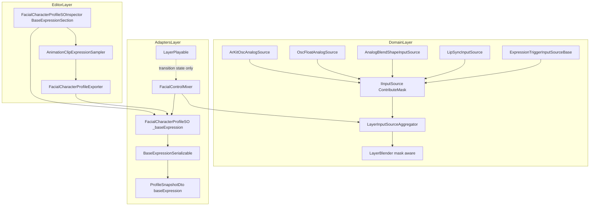
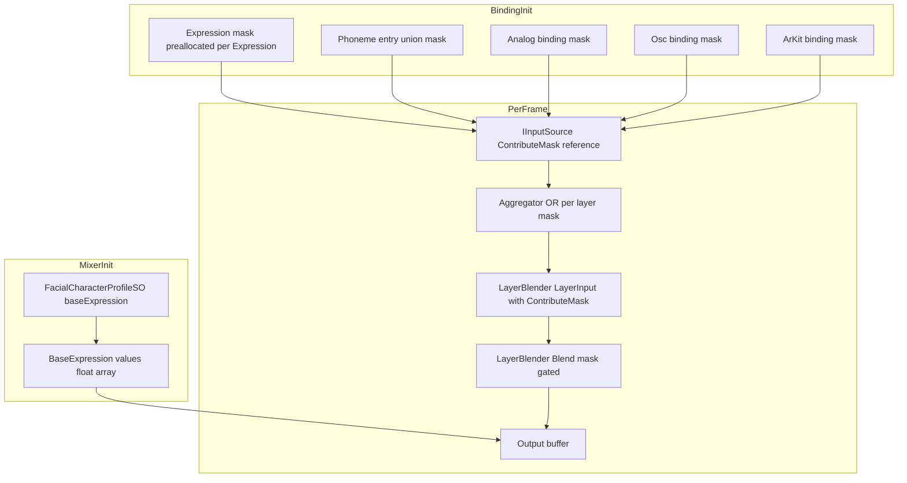
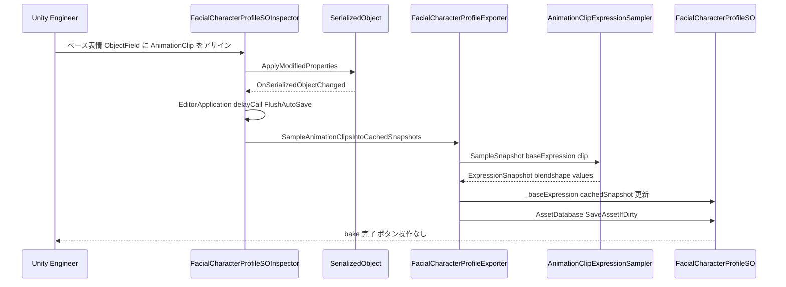
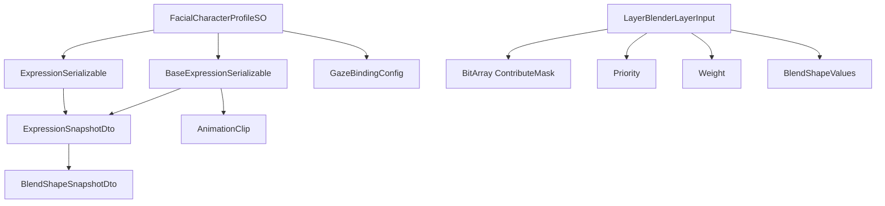
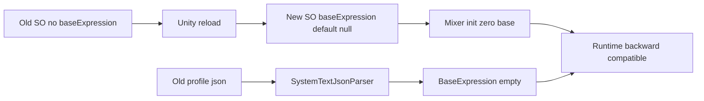

# Design Document — contribution-mask-and-base-expression

## Overview

**Purpose**: 本 spec は FacialControl のレイヤー合成パイプラインを「BlendShape 単位の contribution mask 駆動」に再定義し、`FacialCharacterProfileSO` の root にベース表情 (Base Expression) を導入する。これにより `LayerBlender.Blend` の per-index lerp が高優先度レイヤー (例: lipsync) 適用時に「contribute しない index を 0 補間で消す」現状の問題を解消し、emotion + lipsync の自然な合成と、衣装・キャラ固有の固定表情ベースを実現する。

**Users**: FacialControl ライブラリ実装者 (Hidano) と Unity エンジニア (利用者) の双方が対象。利用者は Inspector 上で `_baseExpression` に AnimationClip をアサインするだけで「contribute されない index に固定値を残す」挙動を得られる (bake は透過)。

**Impact**: `IInputSource` インターフェースに mask 取得 API が追加される (preview 段階の breaking change)。`LayerBlender.LayerInput` 構造体に `BitArray ContributeMask` フィールドが追加され、`LayerBlender.Blend` のコアループが mask 解釈ロジックに変わる。`FacialControlMixer.ComputeOutput` の出力初期化が `Array.Clear` からベース表情コピーに変更される。

### Goals

- `IInputSource` 実装 5 種すべてに contribute mask API を実装し、Domain 層 Unity 非依存契約を維持する (R1)。
- `LayerBlender.Blend` を mask 駆動に置換し、「mask 全立て + base 全 0 = 旧 lerp 挙動」 の後方互換契約を担保する (R3)。
- `FacialCharacterProfileSO` ルートに `_baseExpression` フィールドを追加、Inspector / JSON / Mixer 経路の 3 点で透過的に扱う (R4, R5, R8, R9)。
- Editor 自動保存パイプライン (`OnSerializedObjectChanged → delayCall FlushAutoSave`) で Base Expression の snapshot を bake する (bake ボタンを露出させない、R7)。
- 毎フレームのヒープ確保ゼロ契約 (Req 1.7, 2.4, 3.6, 5.4) を維持する。

### Non-Goals

- アナログ入力 Weight 値による Expression Lerp 駆動 (S-7)。
- AdapterBinding Slug ドロップダウン UI (S-8)。
- Phase 3.4 `ExpressionResolver` + `layerOverrideMask` の解釈 (別 spec)。
- 衣装毎に複数 `BaseExpressionVariant` を持つ拡張 (preview.2 以降)。
- 「強制ピン (上位 layer から上書きされない BlendShape)」 概念 (将来検討)。
- 既存 profile.json の migration ツール (既存ユーザーゼロのため不要)。

## Boundary Commitments

### This Spec Owns

- `IInputSource.ContributeMask` プロパティ (新設) と 5 実装 (`ExpressionTriggerInputSourceBase` / `LipSyncInputSource` / `AnalogBlendShapeInputSource` / `OscFloatAnalogSource` / `ArKitOscAnalogSource`) の mask 構築ロジック。
- `LayerBlender.LayerInput.ContributeMask` フィールドと `LayerBlender.Blend` の mask 解釈ロジック。
- `LayerInputSourceAggregator` 内の per-layer mask 集約 (OR) バッファと、`AggregateAndBlend` 経路への mask 注入。
- `FacialCharacterProfileSO._baseExpression` フィールドと公開プロパティ。
- `BaseExpressionSerializable` (新設、`AnimationClip` + `cachedSnapshot` のみ持つ slim 型)。
- `FacialControlMixer.ComputeOutput` のベース表情初期化経路 (Array.Clear → BaseExpression コピー)。
- `AnimationClipExpressionSampler` の BlendShape 名 → index 集合解決ヘルパー (Editor 専用)。
- `FacialCharacterProfileExporter` の Base Expression bake パス。
- `FacialCharacterProfileSOInspector` の `BuildBaseExpressionSection` (Layers と GazeConfigs の間)。
- `ProfileSnapshotDto.baseExpression` フィールドと JSON parse / serialize 経路。

### Out of Boundary

- Phase 3.4 `ExpressionResolver` の `layerOverrideMask` 解釈ロジック (別 spec)。
- アナログ入力 Weight による Expression Lerp 駆動 (S-7、別 spec)。
- AdapterBinding Slug ドロップダウン UI 追加 (S-8、別 spec)。
- 衣装毎の複数 `BaseExpressionVariant` (preview.2 以降)。
- 「強制ピン」 (Expression が上書きできない BlendShape index) 仕様。
- 既存 `profile.json` の migration ツール / バージョン番号 bump。

### Allowed Dependencies

- Upstream:
  - `Hidano.FacialControl.Domain.Models` (`ExpressionSnapshot`, `BlendShapeSnapshot`, `InputSourceType` 等)。
  - `Hidano.FacialControl.Domain.Interfaces.IInputSource` (拡張対象)。
  - `Hidano.FacialControl.Domain.Services.LayerBlender` / `LayerInputSourceAggregator` / `LayerInputSourceRegistry` (拡張対象)。
  - `Hidano.FacialControl.Adapters.Playable.FacialControlMixer` / `LayerPlayable` / `LayerBehaviour` (拡張対象)。
  - `Hidano.FacialControl.Editor.Sampling.AnimationClipExpressionSampler` (再利用)。
- Shared:
  - `System.Collections.BitArray` (Domain 層が `UnityEngine` 非依存契約を維持しつつ使用可)。
  - `JsonUtility` (steering tech.md で指定された唯一の JSON シリアライザ)。
- Constraints:
  - Domain 層は `UnityEngine` 型を import しない (`BitArray` は `mscorlib`)。
  - `LayerBlender.Blend` のシグネチャ変更は許容するが、 `LayerInput` 構造体 + 新 mask フィールドの追加に留める。

### Revalidation Triggers

以下の変更は本 spec を再検証し、依存先 (Phase 3.4 ExpressionResolver、preview.2 BaseExpressionVariant 等) の整合性を再評価する。

- `IInputSource.ContributeMask` の戻り値型 (`BitArray` → 別形式) の変更。
- `LayerBlender.LayerInput` のフィールド構成変更 (mask 追加位置、型)。
- `_baseExpression` の SO ルート構造変更 (例: 複数バリアント化への発展)。
- `profile.json` の `baseExpression` schema 変更。
- mask 伝搬経路の変更 (例: PlayableGraph 経由化)。

## Architecture

### Existing Architecture Analysis

- **クリーンアーキテクチャ**: Domain (Unity 非依存) ← Application ← Adapters (Unity 依存) の依存方向を asmdef で強制。本 spec は Domain (`IInputSource`, `LayerBlender`, `LayerInputSourceAggregator`) と Adapters (`FacialControlMixer`, `FacialCharacterProfileSO`, `*InputSource`) の双方を拡張する。
- **2 段パイプライン (D-1 ハイブリッド入力モデル)**: intra-layer は `LayerInputSourceAggregator` が weighted-sum + clamp01、inter-layer は `LayerBlender.Blend` が priority + weight ブレンド。本 spec は両段に mask を流す: 前段は OR 集約、後段は mask 解釈での選択上書き。
- **既存 buffer 設計の親和性**: `LayerInputSourceAggregator` は既に `_perLayerOutput`, `_layerInputScratch`, `_snapshotBuffer` 等を構築時 1 回のみ確保しており、`BitArray[] _perLayerMask` の追加が同一パターンで完全に整合する。
- **PlayableGraph とのギャップ**: `LayerPlayable.OutputWeights` は `NativeArray<float>` で、managed `BitArray` を NativeArray 化できない。本 spec では PlayableGraph 経由を諦め、`FacialControlMixer` が `LayerInputSourceAggregator` を直接保持し `AggregateAndBlend` を呼ぶ経路 (推奨経路 A) を採用する (詳細は research.md)。

### Architecture Pattern & Boundary Map



**Architecture Integration**:

- **Selected pattern**: 既存クリーンアーキテクチャ拡張。Domain 層に契約 (mask API)、Adapters 層に経路実装、Editor 層に bake/Inspector を配置。
- **Domain/feature boundaries**:
  - Domain: 「mask とは何か」「どう OR 集約 / 解釈するか」 のロジック。
  - Adapters: 「PlayableGraph と aggregator をどう繋ぐか」「ベース表情をどう Mixer に渡すか」 のランタイム配線。
  - Editor: 「AnimationClip からどう mask を抽出し snapshot に焼くか」 の bake 経路と Inspector 表示。
- **Existing patterns preserved**:
  - `_perLayerOutput[]` パターン → `_perLayerMask[]` に同型拡張。
  - `cachedSnapshot` (ExpressionSerializable) パターン → `BaseExpressionSerializable.cachedSnapshot` に流用。
  - `BuildGazeConfigsSection` (Inspector) パターン → `BuildBaseExpressionSection` に流用。
- **New components rationale**:
  - `BaseExpressionSerializable`: Expression メタデータ (id, name, layer, kind 等) を持たない slim 型。Inspector 上で「単一 AnimationClip + bake 結果」を表現する最小単位。
  - `BaseExpressionSnapshotDto` (任意): `ExpressionSnapshotDto` と JSON 構造を共有可能なら新型不要 (research.md で確定)。
- **Steering compliance**:
  - レンダーパイプライン非依存 / シェーダー非依存 / 物理演算非依存契約を維持。
  - Editor は UI Toolkit (IMGUI 不使用)。
  - JSON は `JsonUtility` ベース (System.Text.Json は引き続き内部利用)。
  - 毎フレームのヒープ確保ゼロ契約 (BitArray は preallocated、参照切替のみ)。

### Technology Stack

| Layer | Choice / Version | Role in Feature | Notes |
|-------|------------------|-----------------|-------|
| Frontend / CLI | UI Toolkit (Unity 6 同梱) | Inspector の `BuildBaseExpressionSection` (ObjectField + HelpBox) | IMGUI 不使用、 既存 `BuildGazeConfigsSection` と同一パターン |
| Backend / Services | C# (Unity 6 / Roslyn) + System.Collections.BitArray | mask データ構造、Domain 層ロジック | BitArray は mscorlib、UnityEngine 非依存契約を維持 |
| Data / Storage | ScriptableObject + JSON (`JsonUtility`) | `_baseExpression` 永続化、profile.json `baseExpression` フィールド | 既存 `ExpressionSerializable.cachedSnapshot` パターン流用 |
| Messaging / Events | Unity PlayableGraph (NativeArray<float> のみ) | Mixer は aggregator 直接保持に経路再配線 (mask は PlayableGraph に乗せない) | research.md Decision: 経路 A 採用 |
| Infrastructure / Runtime | Unity 6000.3.2f1 (Unity 6) | Editor 自動保存パイプライン (`OnSerializedObjectChanged → delayCall FlushAutoSave`) | bake はユーザーに不可視 (D-2) |

研究の詳細は `research.md` を参照。

## File Structure Plan

### Directory Structure

```
FacialControl/Packages/com.hidano.facialcontrol/
├── Runtime/
│   ├── Domain/
│   │   ├── Interfaces/
│   │   │   └── IInputSource.cs                       (modified: ContributeMask 追加)
│   │   └── Services/
│   │       ├── LayerBlender.cs                       (modified: LayerInput 構造体 + mask 解釈)
│   │       ├── LayerInputSourceAggregator.cs         (modified: _perLayerMask + OR 集約)
│   │       ├── ExpressionTriggerInputSourceBase.cs   (modified: per-Expression mask + transition union)
│   │       └── ValueProviderInputSourceBase.cs       (modified: mask field)
│   └── Adapters/
│       ├── InputSources/
│       │   ├── AnalogBlendShapeInputSource.cs        (modified: binding 初期化時に mask 構築)
│       │   └── LipSyncInputSource.cs                 (modified: provider から mask 取得)
│       ├── ScriptableObject/
│       │   ├── FacialCharacterProfileSO.cs           (modified: _baseExpression field)
│       │   └── Serializable/
│       │       └── BaseExpressionSerializable.cs     (NEW: AnimationClip + cachedSnapshot)
│       ├── Playable/
│       │   ├── FacialControlMixer.cs                 (modified: aggregator 直接保持 + base 初期化)
│       │   └── LayerPlayable.cs                      (modified: 最小、 transition state のみ運ぶ)
│       └── Json/
│           ├── Dto/
│           │   └── ProfileSnapshotDto.cs             (modified: baseExpression field)
│           └── SystemTextJsonParser.cs               (modified: parse / serialize 経路)
├── Editor/
│   ├── Inspector/
│   │   └── FacialCharacterProfileSOInspector.cs      (modified: BuildBaseExpressionSection)
│   ├── Sampling/
│   │   └── AnimationClipExpressionSampler.cs         (modified: BlendShape 名 → index 集合 helper)
│   └── AutoExport/
│       └── FacialCharacterProfileExporter.cs         (modified: BaseExpression bake パス)
└── Tests/
    ├── EditMode/
    │   ├── Domain/
    │   │   ├── LayerBlenderTests.cs                  (NEW: 旧テスト不在)
    │   │   ├── LayerBlenderMaskTests.cs              (NEW: mask 駆動契約)
    │   │   └── LayerInputSourceAggregatorMaskTests.cs (NEW: OR 集約)
    │   ├── Adapters/
    │   │   ├── InputSources/
    │   │   │   └── AnalogBlendShapeInputSourceMaskTests.cs (NEW)
    │   │   ├── ScriptableObject/
    │   │   │   └── FacialCharacterProfileSO_BaseExpressionTests.cs (NEW)
    │   │   └── Playable/
    │   │       └── FacialControlMixerBaseExpressionTests.cs (NEW)
    │   └── Editor/
    │       └── Sampling/
    │           └── AnimationClipExpressionSamplerContributeMaskTests.cs (NEW)
    └── PlayMode/
        └── Integration/
            └── EmotionLipSyncBlendIntegrationTests.cs (NEW: R10.7)

FacialControl/Packages/com.hidano.facialcontrol.lipsync/
└── Runtime/Adapters/
    └── ULipSyncProvider.cs                           (modified: phoneme entry union mask 公開)

FacialControl/Packages/com.hidano.facialcontrol.osc/
└── Runtime/Adapters/InputSources/
    ├── OscFloatAnalogSource.cs                       (modified: binding 初期化時に mask 構築)
    └── ArKitOscAnalogSource.cs                       (modified: 同上)

FacialControl/Packages/com.hidano.facialcontrol.inputsystem/
├── Runtime/Adapters/
│   ├── InputSources/
│   │   └── ExpressionTriggerInputSource.cs           (modified: 実質 base 委譲)
│   └── AdapterBindings/
│       └── InputSystemAdapterBinding.cs              (modified: AnalogInputSourceWrapper 内部に mask)
└── Runtime/Application/UseCases/
    └── LayerUseCase.cs                               (modified: 内部 LayerExpressionSource に mask)
```

### Modified Files (主な拡張理由)

- `Runtime/Domain/Interfaces/IInputSource.cs` — `BitArray ContributeMask { get; }` を追加 (breaking、preview 許容)。
- `Runtime/Domain/Services/LayerBlender.cs` — `LayerInput` に `BitArray ContributeMask` 追加、`Blend` 内ループで mask 立つ index のみ lerp。
- `Runtime/Domain/Services/LayerInputSourceAggregator.cs` — `BitArray[] _perLayerMask` 追加、`AggregateInternal` 内で source mask の OR を `_perLayerMask[l]` に書込み、`LayerInput` に詰込み。
- `Runtime/Adapters/Playable/FacialControlMixer.cs` — `LayerInputSourceAggregator` を直接保持。`ComputeOutput` で `Array.Clear` を `_baseExpressionValues` コピーに置換、`AggregateAndBlend` を呼出。
- `Runtime/Adapters/ScriptableObject/FacialCharacterProfileSO.cs` — `[SerializeField] _baseExpression` 追加 (BaseExpressionSerializable)、`BaseExpression` 公開プロパティ追加。
- `Editor/Inspector/FacialCharacterProfileSOInspector.cs` — `BuildBaseExpressionSection` を Layers と GazeConfigs の間に挿入。

### New Files (新規責務)

- `Runtime/Adapters/ScriptableObject/Serializable/BaseExpressionSerializable.cs` — `AnimationClip` 参照 + `ExpressionSnapshotDto cachedSnapshot` を持つ slim 型。Expression メタ (id/name/layer/kind/transitionDuration) は持たない。
- `Tests/EditMode/Domain/LayerBlenderTests.cs` — 旧 lerp 挙動の後方互換契約 (mask 全立て + base 全 0)。
- `Tests/EditMode/Domain/LayerBlenderMaskTests.cs` — mask 部分立て / transition union (D-7)。
- `Tests/EditMode/Domain/LayerInputSourceAggregatorMaskTests.cs` — 複数 source の OR 集約。
- `Tests/EditMode/Adapters/InputSources/AnalogBlendShapeInputSourceMaskTests.cs` — binding → mask 整合 (D-9)。
- `Tests/EditMode/Adapters/ScriptableObject/FacialCharacterProfileSO_BaseExpressionTests.cs` — `_baseExpression` round-trip。
- `Tests/EditMode/Adapters/Playable/FacialControlMixerBaseExpressionTests.cs` — Mixer 初期化 (base ∅ → 全 0、 base ≠ ∅ → コピー)。
- `Tests/EditMode/Editor/Sampling/AnimationClipExpressionSamplerContributeMaskTests.cs` — curve binding → BlendShape index 集合。
- `Tests/PlayMode/Integration/EmotionLipSyncBlendIntegrationTests.cs` — emotion + lipsync 統合シナリオ (R10.7)、Playable 必要。

## System Flows

### 1) Per-frame mask flow (推奨経路 A)



**Key decisions** (重要な分岐のみ、ステップ列挙は避ける):

- **Mixer 経路**: PlayableGraph 経由ではなく `FacialControlMixer` が `LayerInputSourceAggregator` を直接保持。`LayerPlayable` は transition state 進行のみ担う (research.md Decision 1)。
- **mask 静的確定**: binding 初期化時に各 Expression / phoneme entry / binding 単位で mask を preallocate。runtime は参照切替のみで BitArray の中身を書き換えない (D-6)。
- **Transition union**: ExpressionTrigger 遷移中は `_unionMask = A.Or(B)` を 1 つだけ preallocate して使い回す (D-7)。
- **base 初期化順序**: Mixer は `output ← _baseExpressionValues` のコピーで初期化し、その後 `LayerBlender.Blend` が mask 立つ index のみを上書き。mask が立たない index は base 値が残る。

### 2) Editor 自動保存時の Base Expression bake



**Key decisions**:

- **bake は不可視**: ユーザーは ObjectField で AnimationClip をアサインするのみ。`bake` / `rebake` ボタンは存在しない (D-2 / R7.6)。
- **同一トランザクション**: Expression 群と BaseExpression は同じ `delayCall FlushAutoSave` 内で順次 sample される (Inspector 競合回避)。
- **null clip フォールバック**: `_baseExpression.AnimationClip == null` の場合、Exporter は `cachedSnapshot.blendShapes` を空リストに置換 (= 全 0 base、空 mask)。

## Requirements Traceability

| Requirement | Summary | Components | Interfaces | Flows |
|-------------|---------|------------|------------|-------|
| 1.1 | IInputSource に mask getter | `IInputSource` | `IInputSource.ContributeMask` | Per-frame mask flow |
| 1.2 | ExpressionTrigger active 参照切替 | `ExpressionTriggerInputSourceBase` | `IInputSource.ContributeMask` | Per-frame mask flow |
| 1.3 | ExpressionTrigger transition union | `ExpressionTriggerInputSourceBase` | (内部 `_unionMask`) | Per-frame mask flow |
| 1.4 | LipSync phoneme entry mask | `LipSyncInputSource`, `ULipSyncProvider` | `IInputSource.ContributeMask` | Per-frame mask flow |
| 1.5 | Analog binding mask | `AnalogBlendShapeInputSource` | `IInputSource.ContributeMask` | Per-frame mask flow |
| 1.6 | OSC / ARKit binding mask | `OscFloatAnalogSource`, `ArKitOscAnalogSource` | `IInputSource.ContributeMask` | Per-frame mask flow |
| 1.7 | mask preallocated 0-alloc | 全 IInputSource 実装 | (構築時 1 回確保) | — |
| 1.8 | Domain 非 Unity | `IInputSource` | `BitArray` (mscorlib) | — |
| 2.1 | Aggregator OR 集約 | `LayerInputSourceAggregator` | `_perLayerMask` | Per-frame mask flow |
| 2.2 | 多 source 同 index OR | `LayerInputSourceAggregator` | 同上 | — |
| 2.3 | 全 source 非 contribute → false | `LayerInputSourceAggregator` | 同上 | — |
| 2.4 | mask 集約 0-alloc | `LayerInputSourceAggregator` | (構築時 1 回確保) | — |
| 2.5 | layer source 0 本 → 全 false | `LayerInputSourceAggregator` | 同上 | — |
| 3.1 | LayerInput に mask field | `LayerBlender.LayerInput` | `LayerInput.ContributeMask` | Per-frame mask flow |
| 3.2 | mask true → lerp 上書き | `LayerBlender.Blend` | 同上 | — |
| 3.3 | mask false → 出力不変 | `LayerBlender.Blend` | 同上 | — |
| 3.4 | 後方互換 (全立て + base 全 0) | `LayerBlender.Blend` | 同上 | — |
| 3.5 | Domain 非 Unity | `LayerBlender` | `BitArray` (mscorlib) | — |
| 3.6 | Blend 0-alloc | `LayerBlender.Blend` | (stackalloc / preallocated) | — |
| 4.1 | SO root に `_baseExpression` | `FacialCharacterProfileSO`, `BaseExpressionSerializable` | `FacialCharacterProfileSO.BaseExpression` | — |
| 4.2 | AnimationClip → weight 配列保持 | `BaseExpressionSerializable` | `cachedSnapshot` | bake flow |
| 4.3 | clip null → 全 0 扱い | `FacialCharacterProfileSO`, `FacialControlMixer` | `BaseExpression.IsEmpty` | Mixer init |
| 4.4 | snapshot を SO に永続化 | `BaseExpressionSerializable.cachedSnapshot` | `ExpressionSnapshotDto` | bake flow |
| 4.5 | Sampler 経由で bake | `FacialCharacterProfileExporter`, `AnimationClipExpressionSampler` | (Editor 内部) | bake flow |
| 5.1 | Mixer base コピー初期化 | `FacialControlMixer.ComputeOutput` | `_baseExpressionValues[]` | Per-frame mask flow |
| 5.2 | clip null → 全 0 初期化 | `FacialControlMixer.ComputeOutput` | 同上 | Per-frame mask flow |
| 5.3 | 全 layer 非 contribute → base 残存 | `FacialControlMixer` + `LayerBlender` | mask + base 値 | Per-frame mask flow |
| 5.4 | Mixer 0-alloc | `FacialControlMixer` | (構築時 1 回確保) | — |
| 6.1 | Sampler BlendShape 名集合 API | `AnimationClipExpressionSampler` | `TryResolveContributeIndices` | bake flow |
| 6.2 | 漏れなく集合化 | 同上 | 同上 | — |
| 6.3 | 非 BlendShape curve は無視 | 同上 | 同上 | — |
| 6.4 | 2 バイト/特殊記号対応 | 同上 | 同上 | — |
| 6.5 | Editor 専用 | 同上 | 同上 | — |
| 7.1 | 自動保存パイプラインに乗せる | `FacialCharacterProfileSOInspector`, `FacialCharacterProfileExporter` | `delayCall FlushAutoSave` | bake flow |
| 7.2 | Expression snapshot 保存 | `FacialCharacterProfileExporter` | (既存) | bake flow |
| 7.3 | BaseExpression snapshot 保存 | `FacialCharacterProfileExporter` | `_baseExpression.cachedSnapshot` | bake flow |
| 7.4 | clip null → 透過再生成 | 同上 | 同上 | bake flow |
| 7.5 | Sampler 経由 | 同上 | 同上 | bake flow |
| 7.6 | bake ボタン非露出 | `FacialCharacterProfileSOInspector` | `BuildBaseExpressionSection` | bake flow |
| 8.1 | Inspector セクション位置 | `FacialCharacterProfileSOInspector` | `BuildBaseExpressionSection` | — |
| 8.2 | ObjectField 配置 | 同上 | 同上 | — |
| 8.3 | clip 未設定 → HelpBox | 同上 | 同上 | — |
| 8.4 | bake ボタン非露出 | 同上 | 同上 | — |
| 8.5 | UI Toolkit 実装 | 同上 | 同上 | — |
| 9.1 | profile.json `baseExpression` schema | `ProfileSnapshotDto`, `SystemTextJsonParser` | (JSON フィールド) | — |
| 9.2 | 読込時に SO に反映 | `FacialCharacterProfileConverter` | (DTO → SO) | — |
| 9.3 | 欠如時 forward compat | 同上 | 同上 | — |
| 9.4 | JsonUtility ベース | `SystemTextJsonParser`, DTO | `JsonUtility` | — |
| 9.5 | clip path JSON 不載 | `BaseExpressionSerializable`, DTO | (cachedSnapshot のみ) | — |
| 9.6 | migration ツール無し | (該当なし) | — | — |
| 10.1〜10.10 | テスト | (Tests 配下、全 NEW) | — | — |

## Components and Interfaces

### Component Summary

| Component | Domain/Layer | Intent | Req Coverage | Key Dependencies (P0/P1) | Contracts |
|-----------|--------------|--------|--------------|--------------------------|-----------|
| `IInputSource` | Domain | source ごとの contribute mask 契約を提供 | 1.1, 1.7, 1.8 | `BitArray` (P0) | Service |
| `ExpressionTriggerInputSourceBase` | Domain | active Expression の mask 参照切替 + transition union | 1.1, 1.2, 1.3, 1.7 | `IInputSource` (P0), `ExpressionSnapshot` (P1) | Service |
| `LipSyncInputSource` | Adapters | phoneme entry 集合の union mask を返す | 1.4, 1.7, 1.8 | `ULipSyncProvider` (P0) | Service |
| `AnalogBlendShapeInputSource` | Adapters | binding map の BlendShape index 集合を mask として返す | 1.5, 1.7, 1.8 | `IInputSource` (P0) | Service |
| `OscFloatAnalogSource` / `ArKitOscAnalogSource` | Adapters (osc) | binding 初期化時に mask 構築 | 1.6, 1.7, 1.8 | `AnalogBlendShapeInputSource` (P0) | Service |
| `LayerInputSourceAggregator` | Domain | source mask を OR 集約し `LayerInput` に詰込む | 2.1〜2.5 | `IInputSource` (P0), `LayerBlender.LayerInput` (P0) | Service, State |
| `LayerBlender` | Domain | mask 立つ index のみ lerp で上書き | 3.1〜3.6 | `LayerBlender.LayerInput` (P0) | Service |
| `BaseExpressionSerializable` | Adapters | `AnimationClip` + `cachedSnapshot` を持つ slim 型 | 4.1, 4.2, 4.4, 4.5 | `ExpressionSnapshotDto` (P0) | State |
| `FacialCharacterProfileSO` | Adapters | `_baseExpression` field と公開プロパティ | 4.1, 4.3 | `BaseExpressionSerializable` (P0) | State |
| `FacialControlMixer` | Adapters | base 値で初期化 + aggregator 経由で mask 駆動 blend | 5.1〜5.4 | `LayerInputSourceAggregator` (P0), `FacialCharacterProfileSO` (P0) | Service, State |
| `AnimationClipExpressionSampler` | Editor | curve binding → BlendShape index 集合 helper | 6.1〜6.5 | `AnimationClip` (P0), `Mesh` (P1) | Service |
| `FacialCharacterProfileExporter` | Editor | base/expression snapshot bake | 7.1〜7.5 | `AnimationClipExpressionSampler` (P0) | Service |
| `FacialCharacterProfileSOInspector` | Editor | `BuildBaseExpressionSection` UI | 8.1〜8.5 | UI Toolkit (P0) | UI |
| `ProfileSnapshotDto` / `SystemTextJsonParser` | Adapters | `baseExpression` JSON フィールド | 9.1〜9.6 | `JsonUtility` (P0) | State, API |

### Domain Layer

#### IInputSource

| Field | Detail |
|-------|--------|
| Intent | 各入力源の contribute する BlendShape index 集合を取得する mask 契約を Domain 層に提供 |
| Requirements | 1.1, 1.7, 1.8 |

**Responsibilities & Constraints**

- 既存 `Tick` / `TryWriteValues` / `BlendShapeCount` / `Id` / `Type` に加え、`ContributeMask { get; }` を追加。
- 戻り値の `BitArray` は preallocated インスタンスへの参照。実装は呼出側に渡した参照の中身を runtime 中に変更しない (D-6)。
- `BitArray.Length == BlendShapeCount` を実装が保証する (Domain 契約として明示)。
- `UnityEngine` 型を mask API に持ち込まない。

**Dependencies**

- Inbound: `LayerInputSourceAggregator` — mask を OR 集約 (P0)
- Outbound: なし
- External: `System.Collections.BitArray` — Domain 層で唯一許可される .NET 型 (P0)

**Contracts**: Service [x]

##### Service Interface

```csharp
public interface IInputSource
{
    // 既存契約
    string Id { get; }
    InputSourceType Type { get; }
    int BlendShapeCount { get; }
    void Tick(float deltaTime);
    bool TryWriteValues(Span<float> output);

    // 新規契約 (R1.1)
    // 当該 source が contribute する BlendShape index 集合 (=true で contribute)。
    // - Length == BlendShapeCount を保証する。
    // - 返却参照は preallocated。runtime 中に内容を変更しない (D-6)。
    // - source が無効 (TryWriteValues=false) でも mask は構造上の集合を返す (有効性とは独立)。
    System.Collections.BitArray ContributeMask { get; }
}
```

- **Preconditions**: `BlendShapeCount` が確定済 (binding 初期化完了後)。
- **Postconditions**: `ContributeMask.Length == BlendShapeCount`。
- **Invariants**: 同一 source 参照では `ContributeMask` の `Length` は不変。中身の参照対象 (BitArray インスタンス) は ExpressionTrigger のように切替が許される (D-6 / D-7)。

**Implementation Notes**

- Integration: 既存 5 実装 + 全 test fake (18 ファイル+) が更新対象。fake は「全立て BitArray」 を返却すれば旧 lerp 互換挙動を維持する。
- Validation: Domain 契約テスト (`IInputSourceContractTests`) に `ContributeMask.Length == BlendShapeCount` を追加。
- Risks: breaking change だが preview 段階で許容済 (spec 制約)。

#### ExpressionTriggerInputSourceBase

| Field | Detail |
|-------|--------|
| Intent | Expression 切替時の mask 参照切替と transition 中 union mask の管理 |
| Requirements | 1.1, 1.2, 1.3, 1.7 |

**Responsibilities & Constraints**

- 各 Expression 構築時に「この Expression が contribute する BlendShape index 集合」 を `BitArray` として preallocate (Expression 数 × BlendShapeCount のメモリコスト、profile lifetime で 1 回)。
- runtime 中は active Expression に応じて `_currentMaskRef` を切替。
- transition (A → B) 中は preallocated `_unionMask` に `_unionMask.SetAll(false); _unionMask.Or(maskA); _unionMask.Or(maskB);` を行い、`ContributeMask` に `_unionMask` を返す。transition 完了後は `maskB` を直接返す (D-7)。
- BitArray の中身書き換えは `_unionMask` のみ (transition state 切替時のみ)。Expression 個別 mask は読み取り専用扱い。

**Dependencies**

- Inbound: `IInputSource` (P0)
- Outbound: `ExpressionSnapshot` (P1) — bake 済みの BlendShape 値を保持

**Contracts**: Service [x], State [x]

**Implementation Notes**

- Integration: 既存 `_snapshotValues` / `_targetValues` のダブルバッファと同じ寿命管理。BitArray 3 本 (current, target, union) を preallocate。
- Validation: `LayerBlenderMaskTests` で transition 中 union 挙動を検証 (R10.9)。
- Risks: Expression 数が多い (上限 512) 場合のメモリコストは 512 × ceil(BlendShapeCount/8) bytes 程度で許容範囲。

#### LayerInputSourceAggregator (extension)

| Field | Detail |
|-------|--------|
| Intent | per-layer 加重和 + mask の OR 集約を 1 ループで実行 |
| Requirements | 2.1〜2.5 |

**Responsibilities & Constraints**

- 構築時に `BitArray[] _perLayerMask` (長さ `LayerCount`) を確保、各要素は `new BitArray(blendShapeCount)`。
- `AggregateInternal` 内で各 layer ループ開始時に `_perLayerMask[l].SetAll(false)`、各 source ループ内で `_perLayerMask[l].Or(source.ContributeMask)` (TryWriteValues が false でも mask は OR 対象とするか、有効な source のみ OR にするかは下記 Decision)。
- `LayerBlender.LayerInput` 詰込み時に `_perLayerMask[l]` を 4 番目フィールドに渡す。
- valid 判定との関係: source が `TryWriteValues=false` を返した場合でも、当該 source の mask は OR 集約対象**外** (= invalid なら寄与ゼロ、 mask も寄与なし)。理由: invalid 時は scratch 全 0 で加算スキップされるため、 mask だけ立てると「値はゼロだが contribute する」という矛盾が発生する。

**Dependencies**

- Inbound: `FacialControlMixer` (P0)
- Outbound: `IInputSource.ContributeMask` (P0), `LayerBlender.LayerInput` (P0)

**Contracts**: Service [x], State [x]

##### Service Interface (差分)

```csharp
public sealed class LayerInputSourceAggregator
{
    // 既存
    public void AggregateAndBlend(
        float deltaTime,
        ReadOnlySpan<int> priorities,
        ReadOnlySpan<float> layerWeights,
        Span<float> finalOutput);

    // 既存 Aggregate との内部ロジック差分:
    // - 構築時に BitArray[] _perLayerMask を確保
    // - layer ループ毎に _perLayerMask[l].SetAll(false)
    // - source ループ内 (sourceIsValid==true 時のみ) _perLayerMask[l].Or(source.ContributeMask)
    // - LayerInput 構築時に _perLayerMask[l] を渡す
}
```

**Implementation Notes**

- Integration: 既存 `_perLayerOutput` / `_layerInputScratch` パターンを完全に踏襲。0-alloc 契約は preallocated BitArray と `BitArray.SetAll(false)` / `BitArray.Or` (in-place) で維持。
- Validation: `LayerInputSourceAggregatorMaskTests` で 「複数 source が同 index → OR で true」「全 source 非 contribute → false」「invalid source の mask は OR されない」 を検証。
- Risks: 既存 `LayerInputSourceAggregatorTests` が fake source の mask を「全立て」 で返すように更新されると、 旧 lerp 挙動と等価になり既存 expectation を変えずに済む (gap-analysis 8 節)。

#### LayerBlender (extension)

| Field | Detail |
|-------|--------|
| Intent | mask 立つ index のみ lerp で上書きし、mask 立たない index は出力不変 |
| Requirements | 3.1〜3.6 |

**Responsibilities & Constraints**

- `LayerInput` 構造体に `BitArray ContributeMask` フィールドを追加。
- `Blend` 内ループで `mask.Get(i) == true` の index のみ `output[i] = Clamp01(output[i] + (values[i] - output[i]) * weight)` を適用。
- `mask == null` の場合は「全立て」 と等価扱いとする (デフォルトフォールバック、 後方互換のため)。
- 0-alloc 契約は維持 (stackalloc + 既存パターン)。

**Dependencies**

- Inbound: `LayerInputSourceAggregator` (P0), `FacialControlMixer` (P0)
- Outbound: `BitArray` (mscorlib)

**Contracts**: Service [x]

##### Service Interface (差分)

```csharp
public static class LayerBlender
{
    public readonly struct LayerInput
    {
        public int Priority { get; }
        public float Weight { get; }
        public ReadOnlyMemory<float> BlendShapeValues { get; }
        public System.Collections.BitArray ContributeMask { get; } // 新規

        public LayerInput(
            int priority,
            float weight,
            float[] blendShapeValues,
            System.Collections.BitArray contributeMask = null);
    }

    public static void Blend(ReadOnlySpan<LayerInput> layers, Span<float> output);
}
```

- **Preconditions**: 
  - 各 `layers[i].ContributeMask == null` または `layers[i].ContributeMask.Length >= layers[i].BlendShapeValues.Length`。
  - `output.Length > 0`。
- **Postconditions**:
  - mask が `null` または index `i` で true の場合: 旧式 lerp が適用される。
  - mask が index `i` で false の場合: `output[i]` は呼出前の値 (= base initialization 値 + 下位 layer 結果) のまま。
- **Invariants**: 出力は `[0, 1]` にクランプされる。

**Implementation Notes**

- Integration: 旧コード `for k=0..len { output[i] = lerp(...); }` のループ内に `if (mask == null || mask.Get(i)) { ... }` を追加するだけ。最低優先度 layer 初期化ループも同条件に従わせる。
- Validation: `LayerBlenderTests` (新設) で「mask 全立て + base 全 0 → 旧出力と一致」「mask 部分立て → 立たない index 不変」「mask null → 旧挙動」 を検証 (R10.1, R10.2, R3.4)。
- Risks: 最低優先度 layer 初期化ループは特殊ケース。「mask 立たない index も `output[i] = 0` で初期化」 とすると base が消えるため、 ここでも mask 分岐が必要。具体的には Blender 単独テストでは output が前段で base に初期化されている前提を要求する。

### Adapters Layer

#### LipSyncInputSource & ULipSyncProvider

| Field | Detail |
|-------|--------|
| Intent | phoneme entry 集合に含まれる BlendShape index の union を mask として公開 |
| Requirements | 1.4, 1.7, 1.8 |

**Responsibilities & Constraints**

- `ULipSyncProvider` 構築時 (binding 初期化フェーズ) に、 全 phoneme entry の `PhonemeSnapshot.Weights[i] != 0` の index 集合を OR して 1 つの `BitArray` として保持。
- `LipSyncInputSource.ContributeMask` は provider が保持する union mask 参照を返す (構築後不変)。
- runtime 中は active phoneme が変わっても mask は不変 (D-6: phoneme entry の集合自体が binding なので mask は静的)。

**Dependencies**

- Inbound: `LayerInputSourceAggregator` (P0)
- Outbound: `ULipSyncProvider` (P0), `PhonemeSnapshot` (P1)

**Implementation Notes**

- Integration: `ULipSyncProvider` に `BitArray ContributeMask` プロパティを追加し、 `LipSyncInputSource` は構築時に provider から参照を受け取り保持。
- Validation: 既存 `ULipSyncProviderTests` を拡張、 「phoneme entry の BlendShape index がすべて含まれる」 を検証。
- Risks: 構築時の OR コストは preview phase で許容 (1 回のみ)。

#### AnalogBlendShapeInputSource / OscFloatAnalogSource / ArKitOscAnalogSource

| Field | Detail |
|-------|--------|
| Intent | binding 初期化時に bind 済 BlendShape index 集合を mask として確定 |
| Requirements | 1.5, 1.6, 1.7, 1.8 |

**Responsibilities & Constraints**

- D-9 解釈: 実際の `IInputSource` 実装は `AnalogBlendShapeInputSource`。OSC / ARKit 系の `OscFloatAnalogSource` / `ArKitOscAnalogSource` は `IAnalogInputSource` 実装で、`AnalogBlendShapeInputSource` がそれらをラップする。**mask は `AnalogBlendShapeInputSource` 側で binding map から構築する** (gap-analysis Decision、 research.md Decision 3 で明文化)。
- OSC / ARKit ソースが新規追加されても、 `AnalogBlendShapeInputSource` の binding map の更新で mask が自動的に追従する。
- binding 初期化時に `BitArray(BlendShapeCount)` を preallocate、 binding 対象 BlendShape index に true を立てる。

**Dependencies**

- Inbound: `LayerInputSourceAggregator` (P0)
- Outbound: `IAnalogInputSource` (P1) — OSC / ARKit から値を受信

**Implementation Notes**

- Integration: 既存 `AnalogBlendShapeInputSource` の binding map (BlendShape index 配列) を mask 構築の唯一の source of truth とする。
- Validation: `AnalogBlendShapeInputSourceMaskTests` で 「binding 集合と mask の index 集合が一致」 を検証。
- Risks: D-9 の文言「OSC / ARKit も `IInputSource` 実装」 は実コード階層と齟齬があるため、 設計と実装の不整合リスクを回避するため research.md / 本 design で「mask は AnalogBlendShapeInputSource で完結」 を明文化済 (R1.6 の Acceptance Criteria を AnalogBlendShapeInputSource 経由で実装することと等価)。

#### BaseExpressionSerializable

| Field | Detail |
|-------|--------|
| Intent | `AnimationClip` 参照と bake 済 snapshot を持つ slim 型 (Expression メタは持たない) |
| Requirements | 4.1, 4.2, 4.4, 4.5 |

**Responsibilities & Constraints**

- フィールド: `AnimationClip animationClip`, `ExpressionSnapshotDto cachedSnapshot`。
- Expression メタ (id, name, layer, kind, transitionDuration) は**持たない** (D-4)。
- `cachedSnapshot.blendShapes` が空または null の場合「empty」 と判定 (= 全 0 base、 空 mask)。

**Dependencies**

- Inbound: `FacialCharacterProfileSO` (P0), `FacialCharacterProfileSOInspector` (P0), `FacialCharacterProfileExporter` (P0)
- Outbound: `AnimationClip` (P1), `ExpressionSnapshotDto` (P0)

**Contracts**: State [x]

**Implementation Notes**

- Integration: 既存 `ExpressionSerializable.cachedSnapshot` パターン流用。
- Validation: `FacialCharacterProfileSO_BaseExpressionTests` で round-trip 検証 (clip null / 設定後)。
- Risks: なし (slim 型、実装単純)。

#### FacialCharacterProfileSO (extension)

| Field | Detail |
|-------|--------|
| Intent | `_baseExpression` フィールドと公開プロパティを SO ルートに持つ |
| Requirements | 4.1, 4.3 |

**Responsibilities & Constraints**

- `[SerializeField] BaseExpressionSerializable _baseExpression`。
- `public BaseExpressionSerializable BaseExpression => _baseExpression`。
- null セーフ getter (`_baseExpression ?? new BaseExpressionSerializable()`) を提供。

**Dependencies**

- Inbound: `FacialControlMixer` (P0), Inspector (P0), Exporter (P0), JSON parser (P0)
- Outbound: `BaseExpressionSerializable` (P0)

**Contracts**: State [x]

**Implementation Notes**

- Integration: GazeConfigs と同パターンで宣言。
- Validation: round-trip テスト (Inspector 設定 → SO 永続化 → 再ロードで保持)。
- Risks: なし (Unity SerializedObject の forward compat が効く)。

#### FacialControlMixer (extension)

| Field | Detail |
|-------|--------|
| Intent | aggregator を直接保持 + base 値で `_outputBuffer` を初期化 + AggregateAndBlend 呼出 |
| Requirements | 5.1〜5.4 |

**Responsibilities & Constraints**

- 構築時に `LayerInputSourceAggregator` を保持 (現状 `LayerPlayable` 経由で値受け取りしていた経路を再配線)。
- 構築時に `_baseExpressionValues = new float[blendShapeCount]` を確保し、 `FacialCharacterProfileSO.BaseExpression.cachedSnapshot.blendShapes` から値をコピー (clip null なら全 0)。
- `ComputeOutput` 開始時に `Array.Copy(_baseExpressionValues, _outputBuffer, blendShapeCount)` で base 値で初期化 (現状 `Array.Clear` 置換)。
- `AggregateAndBlend(deltaTime, priorities, weights, _outputBuffer)` を呼出。出力は base + mask 駆動 lerp の合成結果。
- 結果を `_outputWeights` (`NativeArray<float>`) にコピー。

**Dependencies**

- Inbound: `LayerPlayable` (P1) — transition state のみ進行依頼
- Outbound: `LayerInputSourceAggregator` (P0), `FacialCharacterProfileSO` (P0)

**Contracts**: Service [x], State [x]

**Implementation Notes**

- Integration: `LayerPlayable.OutputWeights` (NativeArray<float>) は `BitArray` を運べないため経路を切替。`LayerPlayable` は transition の進行と Expression のスタック管理のみに簡素化。
- Validation: `FacialControlMixerBaseExpressionTests` で 「clip null → 全 0 init」「clip 設定 → base 値 init + 上位 layer mask false index で base 残存」 を検証 (R10.4, R10.5)。
- Risks: BlendShape 数の動的変更時、 Mixer は `_baseExpressionValues` を再確保する必要あり (preview ではプロファイル lifetime 不変契約のため対象外)。

### Editor Layer

#### AnimationClipExpressionSampler (extension)

| Field | Detail |
|-------|--------|
| Intent | AnimationClip の curve binding を BlendShape 名 + index 集合に解決するヘルパー |
| Requirements | 6.1〜6.5 |

**Responsibilities & Constraints**

- 既存 `SampleSummary` が `IReadOnlyList<string> BlendShapeNames` を返している。新規 helper:
  - `bool TryResolveContributeIndices(AnimationClip clip, IReadOnlyList<string> blendShapeNames, BitArray output)` — `output` に curve binding に含まれる BlendShape index を立てる。
  - 戻り値: clip が null または BlendShape curve を持たないとき false (output は全 false のまま)。
- BlendShape 命名規則 (2 バイト文字 / 特殊記号) を固定しない (steering tech.md)。
- Editor 専用 (`Editor/Sampling/` 配下、 `includePlatforms: ["Editor"]` の asmdef)。

**Dependencies**

- Inbound: `FacialCharacterProfileExporter` (P0), `Inspector` (P1)
- Outbound: `AnimationClip` (P1), `Mesh` (P1)

**Contracts**: Service [x]

**Implementation Notes**

- Integration: 既存 `SampleSummary` のロジックに「BlendShape 名 → index 解決」 を追加。
- Validation: `AnimationClipExpressionSamplerContributeMaskTests` で「複数 curve」「BlendShape 以外の curve のみ」「2 バイト文字 / 特殊記号」 を検証 (R10.6)。
- Risks: BlendShape 名と Mesh の `GetBlendShapeIndex` の対応は現状 sampler 内で解決済 → 流用可能。

#### FacialCharacterProfileExporter (extension)

| Field | Detail |
|-------|--------|
| Intent | Expression と BaseExpression の snapshot を delayCall パイプライン内で bake する |
| Requirements | 7.1〜7.5 |

**Responsibilities & Constraints**

- 既存 `SampleAnimationClipsIntoCachedSnapshots` に BaseExpression パスを追加。
- `_baseExpression.animationClip` が null の場合、 `_baseExpression.cachedSnapshot.blendShapes` を空リストに置換。
- Expression 群と BaseExpression は同じ delayCall 内で順次 sample (Inspector 競合回避)。

**Dependencies**

- Inbound: `Inspector` (P0)
- Outbound: `AnimationClipExpressionSampler` (P0), `FacialCharacterProfileSO` (P0)

**Contracts**: Service [x]

**Implementation Notes**

- Integration: 既存 Expression bake パスに helper を 1 関数追加。
- Validation: bake flow テストで「clip 変更 → cachedSnapshot 即時更新」「clip null → snapshot 空化」 を検証。
- Risks: 既存 `FlushAutoSave` の延長線にあるため Inspector 競合は既存 mechanism で吸収可能。

#### FacialCharacterProfileSOInspector (extension)

| Field | Detail |
|-------|--------|
| Intent | Layers と GazeConfigs の間に「ベース表情」 セクションを表示 |
| Requirements | 8.1〜8.5 |

**Responsibilities & Constraints**

- セクション順序: Reference Model → Save Status → **Layers** → **Base Expression** → **GazeConfigs** → AdapterBindings → Debug。
- UI 内容: Foldout Header + ObjectField (`AnimationClip _baseExpression.animationClip`) + (clip 未設定時) HelpBox。
- `bake` / `rebake` ボタンは**置かない** (D-2 / R7.6, R8.4)。
- UI Toolkit 実装、 IMGUI 不使用。

**Dependencies**

- Inbound: ユーザー
- Outbound: `FacialCharacterProfileSO` (P0)

**Contracts**: UI

**Implementation Notes**

- Integration: 既存 `BuildGazeConfigsSection` と同パターン (`MakeSectionFoldout` + property bind)。
- Validation: Inspector テストで 「セクション順序」「ObjectField 存在」「clip 未設定時 HelpBox 表示」 を検証。
- Risks: bake プレビュー UI (任意、 R8.3 補足) は initial scope では省略。 後続 PR で追加可能 (research.md Decision 7)。

### JSON Layer

#### ProfileSnapshotDto / SystemTextJsonParser (extension)

| Field | Detail |
|-------|--------|
| Intent | profile.json に `baseExpression` フィールドを通常 Expression と同形式で読み書き |
| Requirements | 9.1〜9.6 |

**Responsibilities & Constraints**

- DTO: `ExpressionSnapshotDto baseExpression` を `ProfileSnapshotDto` に追加。
- AnimationClip パスは JSON に含めない (D-3 / R9.5)。`baseExpression.blendShapes` のみ。
- 欠如時は forward compat で「空」扱い (R9.3)。

**Dependencies**

- Inbound: `FacialCharacterProfileConverter` (P0)
- Outbound: `BaseExpressionSerializable` (P0), `ExpressionSnapshotDto` (P0)

**Contracts**: API [x], State [x]

##### Data Contracts

```json
{
  "baseExpression": {
    "blendShapes": [
      { "name": "BlendShape Name", "value": 0.0 }
    ]
  }
}
```

- 欠如時: `baseExpression: null` または field 不在 → `BaseExpressionSerializable.cachedSnapshot.blendShapes = empty list`。
- forward compat: 旧 JSON (preview.0) には `baseExpression` がないが、 deserializer が null 許容。

**Implementation Notes**

- Integration: `JsonUtility` ベース。`SystemTextJsonParser` 経路は存在するが、 steering tech.md 準拠のため `JsonUtility` をプライマリパスに据える (既存実装の統一性)。
- Validation: round-trip テスト「JSON → SO → JSON で `baseExpression` 同一」「`baseExpression` 欠如 → 空 SO」。
- Risks: 既存 `SystemTextJsonParser` と `JsonUtility` の混在は別 spec の整理対象。本 spec では追加 field のみ扱う。

## Data Models

### Domain Model



- **集約境界**: `FacialCharacterProfileSO` がベース表情 + Expression 群 + Gaze + AdapterBindings の集約ルート。
- **不変条件**:
  - `BaseExpressionSerializable.cachedSnapshot.blendShapes.Count == 0` → 全 0 base 扱い (`IsEmpty == true`)。
  - `IInputSource.ContributeMask.Length == BlendShapeCount`。
  - `LayerInput.ContributeMask` は `null` (= 全立て扱い) または `Length >= BlendShapeValues.Length`。

### Logical Data Model

| Entity | Fields | Notes |
|--------|--------|-------|
| `BaseExpressionSerializable` | `AnimationClip animationClip`, `ExpressionSnapshotDto cachedSnapshot` | Expression メタ非搭載 |
| `LayerBlender.LayerInput` | `int Priority`, `float Weight`, `ReadOnlyMemory<float> BlendShapeValues`, `BitArray ContributeMask` | mask は `null` 許容 (旧挙動互換) |
| `IInputSource.ContributeMask` | `BitArray (Length == BlendShapeCount)` | preallocated |
| `_perLayerMask[]` (Aggregator) | `BitArray[]` (長さ `LayerCount`) | 各要素 `Length == BlendShapeCount` |

### Data Contracts & Integration

**profile.json schema 差分**:

```json
{
  "name": "...",
  "expressions": [ ... ],
  "baseExpression": {
    "blendShapes": [
      { "name": "目を閉じる", "value": 0.5 }
    ]
  }
}
```

- 欠如許容 (forward compat)。
- AnimationClip パス非搭載 (Domain 非 Unity 契約 + ビルド後差し替え可能性のため、 D-3)。

## Error Handling

### Error Strategy

| シナリオ | 検出箇所 | 対応 |
|---------|---------|------|
| `_baseExpression.animationClip == null` | Mixer 構築時 / Exporter | `_baseExpressionValues` を全 0 で初期化 (= 旧 `Array.Clear` 互換)。warning なし (R7.4) |
| AnimationClip に BlendShape curve 0 個 | Sampler `TryResolveContributeIndices` | 戻り値 false、output BitArray 全 false。warning なし (R6.3) |
| `IInputSource.ContributeMask.Length != BlendShapeCount` | Aggregator `Or` 呼出時 | `BitArray.Or` が ArgumentException を throw。Domain 契約違反として実装テストで防ぐ (`IInputSourceContractTests` で検証) |
| profile.json `baseExpression` 欠如 | `SystemTextJsonParser` | 空 `BaseExpressionSerializable` を生成 (R9.3)。warning なし |
| `_perLayerMask` の BlendShapeCount 変更 | Aggregator 構築時のみ | profile lifetime 中 BlendShapeCount 不変契約。runtime 変更は preview スコープ外。実装は ArgumentException で fail-fast |
| `ExpressionTrigger` の transition 中に union mask 用 BitArray が null | `ExpressionTriggerInputSourceBase` 構築時 | 構築時 preallocate 必須。null は実装バグなので `InvalidOperationException` で fail-fast |

### Error Categories and Responses

- **User Errors**: 不正な JSON は `JsonUtility` が標準例外 (`ArgumentException` 等) を throw。Inspector では HelpBox で案内 (R8.3)。
- **System Errors**: BlendShapeCount mismatch / preallocate 漏れは `Debug.LogError` で記録し fail-fast。
- **Business Logic Errors**: なし (mask 駆動は決定論的)。

### Monitoring

- 既存 `LayerInputSourceAggregator.WarnEmptyLayerOnce` (per-layer per-session 1 回) を流用。mask 全 false の layer は当該 warning 対象に含まれる (= 全 source が contribute しないなら層自体が空)。
- 新規 warning は追加しない (steering tech.md: Unity 標準ログのみ)。

## Testing Strategy

### Unit Tests (EditMode)

1. `LayerBlenderTests` (新設): mask 全立て + base 全 0 → 旧 lerp 出力と一致 (R10.1)。
2. `LayerBlenderMaskTests`: mask 部分立て → contribute false index は output 不変 (R10.2)、 transition union (R10.9)、 mask null → 旧挙動。
3. `LayerInputSourceAggregatorMaskTests`: 多 source 同 index → OR true、 全 source 非 contribute → false、 invalid source の mask は OR されない (R10.3)。
4. `AnimationClipExpressionSamplerContributeMaskTests`: 複数 BlendShape curve → 全部含む、 BlendShape 以外のみ → 空、 2 バイト文字 / 特殊記号 OK (R10.6)。
5. `AnalogBlendShapeInputSourceMaskTests`: binding 集合 → mask index 集合一致 (R10.10)。
6. `FacialControlMixerBaseExpressionTests`: clip null → 全 0 init、 clip 設定 → base 値 init (R10.4, R10.5)。
7. `FacialCharacterProfileSO_BaseExpressionTests`: SO round-trip (clip 設定 / null)。

### Integration Tests (PlayMode)

1. `EmotionLipSyncBlendIntegrationTests` (新設): emotion (priority=0) + lipsync (priority=1) → 「目・眉は emotion、 口は lipsync で上書き、 contribute なし index は base のまま」 を検証 (R10.7)。Playable + AnimatorBinding が必要なため PlayMode 配置。

### Performance / Allocation Tests

1. 既存 `MultiCharacterAggregatorPerformanceTests` / `SetWeightZeroAllocationTests` を fake source で「全立て BitArray 返却」 で動かして、 0-alloc 契約を引き続き満たすことを確認 (新規テスト追加なし、 既存テストの retrofit)。

### 配置基準

- EditMode: モック / Fake のみで同期実行 (R10.1〜R10.6, R10.10)。
- PlayMode: Playable / Animator / 実 transition 補間が必要 (R10.7、emotion + lipsync 統合)。

## Optional Sections

### Performance & Scalability

| 指標 | 基準 | 担保方法 |
|------|------|---------|
| 毎フレームヒープ確保 | ゼロ目標 (steering Performance Standards) | BitArray は preallocated、 `SetAll` / `Or` は in-place、 transition union 用 BitArray も 1 本のみ追加 |
| BitArray サイズ | BlendShapeCount × 1 bit (例 100 BS → 13 bytes/source × source 数) | profile lifetime で 1 回確保、 増減なし |
| Mixer 経路再配線 | 既存 `LayerPlayable.OutputWeights` 経由を Mixer-direct-aggregator 経由に変更 | research.md Decision 1 で評価済 (NativeArray<float> 経由を諦めるトレードオフを許容) |
| 同時 10 体以上 | 各体の BlendShapeCount × Expression 数の BitArray を独立確保 | profile per character、 lifecycle 一致 |

### Migration Strategy

migration ツール不要 (preview phase、 既存ユーザーゼロ、 R9.6)。SO の `_baseExpression` フィールドは Unity SerializedObject の forward compat により旧 SO アセットを破壊せず読み込める。 profile.json の `baseExpression` 欠如時は空扱いで forward compat (R9.3)。



## Supporting References

- `research.md` — Mask 伝搬経路 / BaseExpressionSnapshot 流用判断 / D-9 解釈の詳細評価。
- `gap-analysis.md` — 影響ファイル一覧と既存資産再利用ポイントの詳細。
- `requirements.md` — Acceptance Criteria 完全版と Dig 決定 (D-1 〜 D-9)。
