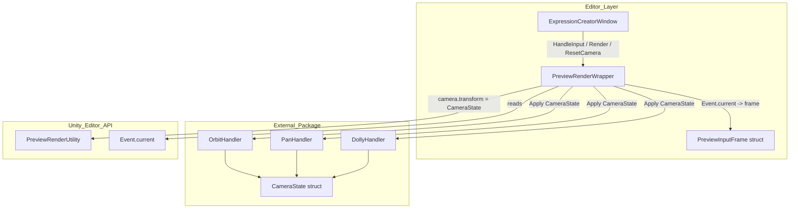
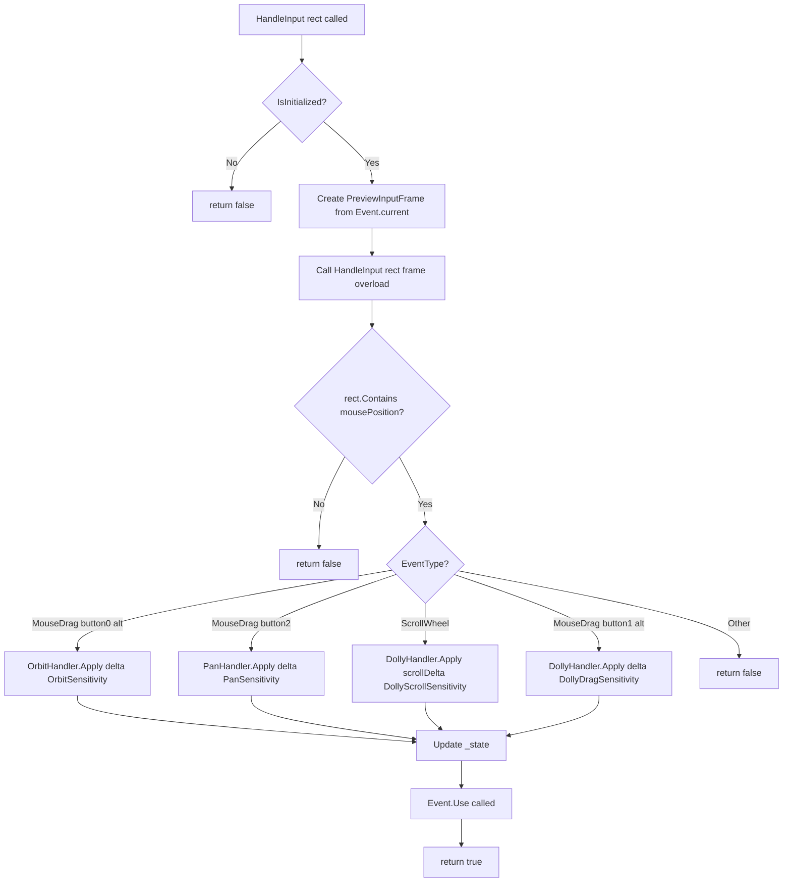
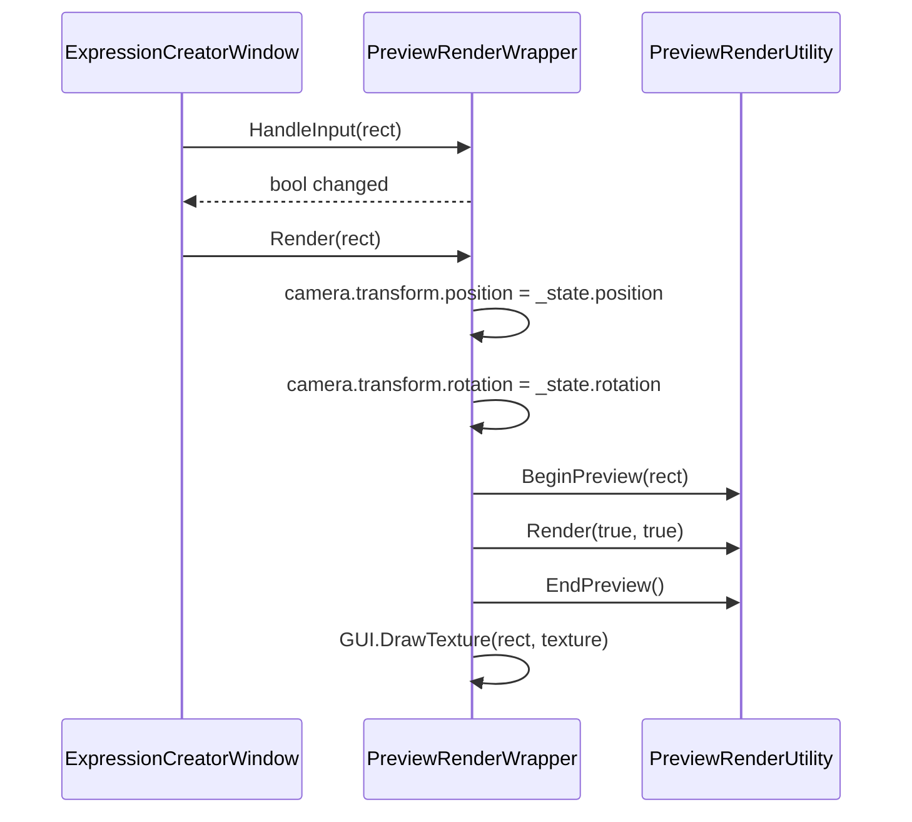

# Design Document: expression-preview-camera

## Overview

本フィーチャーは、`ExpressionCreatorWindow` のプレビューカメラ制御を、`PreviewRenderWrapper` 内の自前 Orbit/Zoom 実装から、npm 公開パッケージ `com.hidano.scene-view-style-camera-controller@1.0.0` が提供する `CameraState` / Handler 群へ完全置換する。

現状の実装はパン（平行移動）に非対応であり、Orbit のみ対応の不完全な UX となっている。本フィーチャーでは Orbit・Pan・Dolly の三操作を IMGUI `Event.current` 経由で Handler に橋渡しする薄いレイヤーとして `PreviewInputFrame` 構造体を新設し、テスト可能な設計を提供する。あわせて `ExpressionCreatorWindow` のプレビュー領域直下にカメラリセットボタンを追加し、ワンクリックで初期視点に戻る手段を提供する。

既存の `HandleInput(Rect)` / `Render(Rect)` / `IsInitialized` / `Setup()` / `Cleanup()` / `Dispose()` / `CalculateBounds()` のシグネチャを維持することで、`ExpressionCreatorWindow` の他機能（BlendShape スライダー・AnimationClip 保存等）へのリグレッションを防止する。

### Goals

- Orbit・Pan・Dolly の三操作をパッケージ提供 Handler に委譲し、Scene ビュー準拠の操作感を実現する
- `PreviewInputFrame` 構造体経由で Handler 結線を EditMode テストから検証可能にする
- カメラリセットボタンをプレビュー領域直下に追加し、初期視点への即時復帰を可能にする
- 既存 public API シグネチャを完全維持し、`ExpressionCreatorWindow` へのリグレッションをゼロにする

### Non-Goals

- LookAround（右ドラッグ見回し）・FlyThrough（WASDQE 移動）・FoV 操作の統合
- `ExpressionCreatorWindow` のリセットボタン追加以外の UI 再配置
- Runtime 層への変更
- サンプルシーン

---

## Boundary Commitments

### This Spec Owns

- `manifest.json` への `com.hidano.scene-view-style-camera-controller@1.0.0` 依存追加
- `PreviewRenderWrapper.cs` の全面書き換え（`_rotation`/`_zoom` 廃止・`CameraState` への一本化）
- `PreviewInputFrame.cs` の新設（`Event.current` → struct への変換ゲート）
- `ExpressionCreatorWindow.cs` へのカメラリセットボタン追加
- `Hidano.FacialControl.Editor.asmdef` への `SceneViewStyleCameraController` 参照追加
- `PreviewRenderWrapperTests.cs` の新設（EditMode）

### Out of Boundary

- `SceneViewStyleCameraController` パッケージ本体のコード・API 定義（変更不可）
- `ExpressionCreatorWindow` のプレビュー以外の UI ロジック（BlendShape スライダー・保存フロー等）
- Runtime 層（Domain / Application / Adapters）への変更
- `Hidano.FacialControl.Tests.EditMode.asmdef` の `SceneViewStyleCameraController` 参照追加（テスト asmdef は `Hidano.FacialControl.Editor` を参照するため推移的に解決される）

### Allowed Dependencies

- `com.hidano.scene-view-style-camera-controller@1.0.0`（npmjs ScopedRegistry 経由）
- `com.unity.inputsystem@1.17.0`（既存。パッケージの依存と競合しない）
- `UnityEditor.PreviewRenderUtility`（既存利用継続）
- `UnityEngine.Event`（IMGUI。Editor 専用）

### Revalidation Triggers

- `SceneViewStyleCameraController` パッケージのバージョン更新（Handler シグネチャ変更の可能性）
- `com.unity.inputsystem` のバージョン変更（パッケージ互換性の再確認が必要）
- `PreviewRenderWrapper` の public API シグネチャ変更（`ExpressionCreatorWindow` の修正が必要）
- `Hidano.FacialControl.Editor.asmdef` の `references` 変更（テスト asmdef への推移的影響を確認）

---

## Architecture

### Existing Architecture Analysis

現状の `PreviewRenderWrapper` はカメラ状態を `_rotation: Vector2`（ヨー/ピッチ角度）・`_zoom: float`・`_isDragging: bool`・`_lastMousePos: Vector2` の 4 フィールドで独自管理し、`Render()` 内で毎回 `Quaternion.Euler` からカメラ位置を再計算している。パン操作は未実装。Handler 呼び出しは `HandleInput(Rect)` に直接 `Event.current` を読み取るため、IMGUI コンテキスト外からのテストが不可能な構造になっている。

`ExpressionCreatorWindow` は `_previewWrapper.HandleInput(rect)` → `_previewWrapper.Render(rect)` の順序でコールしており、`HandleInput` の戻り値（`bool`）で再描画判断を行っている。この呼び出し規約は本フィーチャー後も維持される。

### Architecture Pattern & Boundary Map



- **選択パターン**: アダプタ（Adapter）パターン。`PreviewRenderWrapper` が IMGUI イベントと外部 Handler の間の変換レイヤーとして機能する
- **既存パターン維持**: Editor 層の `IDisposable` ラッパーパターン、クリーンアーキテクチャのレイヤー分離（Runtime 層は無変更）
- **新規コンポーネント**: `PreviewInputFrame`（IMGUI 依存の封印とテスト可能性の確保）
- **Steering 準拠**: `Editor/` 層の変更のみ。Domain / Application / Adapters は無変更

### Technology Stack

| レイヤー | 選択 / バージョン | 本フィーチャーにおける役割 | 備考 |
|---------|------------------|--------------------------|------|
| Editor UI | Unity IMGUI + UI Toolkit | プレビュー描画・カメラリセットボタン | 既存パターン継続 |
| カメラ制御 | `com.hidano.scene-view-style-camera-controller@1.0.0` | Orbit / Pan / Dolly Handler 提供 | npmjs ScopedRegistry |
| カメラ状態 | `SceneViewStyleCameraController.CameraState` struct | 位置・姿勢・ピボット情報の一元管理 | 値型（コピーセマンティクス） |
| レンダリング | `UnityEditor.PreviewRenderUtility` | プレビューテクスチャ生成 | 既存継続 |
| 入力 | `UnityEngine.Event`（IMGUI） | マウスイベント取得 | Editor 専用 |

---

## File Structure Plan

### Directory Structure

```
FacialControl/Packages/
├── manifest.json                                          # [改修] com.hidano.scene-view-style-camera-controller@1.0.0 追加
└── com.hidano.facialcontrol/
    ├── Editor/
    │   ├── Hidano.FacialControl.Editor.asmdef             # [改修] SceneViewStyleCameraController 参照追加
    │   ├── Common/
    │   │   ├── PreviewRenderWrapper.cs                    # [改修] CameraState ベースに全面書き換え
    │   │   └── PreviewInputFrame.cs                       # [新設] IMGUI イベントを表す値型構造体
    │   └── Tools/
    │       └── ExpressionCreatorWindow.cs                 # [改修] カメラリセットボタン追加
    └── Tests/
        └── EditMode/
            └── Editor/
                └── PreviewRenderWrapperTests.cs           # [新設] Handler 結線の EditMode テスト
```

### Modified Files

- `FacialControl/Packages/manifest.json` — `dependencies` に `com.hidano.scene-view-style-camera-controller: 1.0.0` を追加（`scopedRegistries` の `com.hidano` エントリは既存のため変更なし）
- `FacialControl/Packages/com.hidano.facialcontrol/Editor/Hidano.FacialControl.Editor.asmdef` — `references` 配列に `"SceneViewStyleCameraController"` を追加
- `FacialControl/Packages/com.hidano.facialcontrol/Editor/Common/PreviewRenderWrapper.cs` — 自前カメラ状態フィールドを廃止し `CameraState` + Handler 群ベースに全面書き換え
- `FacialControl/Packages/com.hidano.facialcontrol/Editor/Tools/ExpressionCreatorWindow.cs` — `_previewContainer` 直下にカメラリセットボタンを追加、`OnCameraReset()` ハンドラを追加

---

## System Flows

### HandleInput 入力ルーティング



### Render フロー



---

## Requirements Traceability

| 要件 | 概要 | コンポーネント | インターフェース | フロー |
|-----|------|--------------|--------------|------|
| 1.1 | manifest.json に依存追加 | manifest.json | — | — |
| 1.2 | scopedRegistries 既存エントリ確認 | manifest.json | — | — |
| 1.3 | UPM 自動解決 | manifest.json | — | — |
| 1.4 | InputSystem バージョン競合なし | manifest.json | — | — |
| 2.1 | 旧フィールド廃止 | PreviewRenderWrapper | State | — |
| 2.2 | CameraState 一元管理 | PreviewRenderWrapper | State | — |
| 2.3 | 初期 CameraState 算出 | PreviewRenderWrapper | `Setup()` | — |
| 2.4 | Render 時の transform 書き戻し | PreviewRenderWrapper | `Render()` | Render フロー |
| 2.5 | 公開 API シグネチャ維持 | PreviewRenderWrapper | Service | — |
| 2.6 | 旧感度定数廃止 | PreviewRenderWrapper | — | — |
| 3.1 | Alt+左ドラッグ → Orbit | PreviewRenderWrapper | `HandleInput()` | HandleInput ルーティング |
| 3.2 | 中ドラッグ → Pan | PreviewRenderWrapper | `HandleInput()` | HandleInput ルーティング |
| 3.3 | ScrollWheel → Dolly | PreviewRenderWrapper | `HandleInput()` | HandleInput ルーティング |
| 3.4 | Alt+右ドラッグ → Dolly | PreviewRenderWrapper | `HandleInput()` | HandleInput ルーティング |
| 3.5 | 状態変化時に true 返却 | PreviewRenderWrapper | `HandleInput()` | HandleInput ルーティング |
| 3.6 | rect 外は false 返却 | PreviewRenderWrapper | `HandleInput()` | HandleInput ルーティング |
| 3.7 | Event.Use() 呼び出し | PreviewRenderWrapper | `HandleInput()` | HandleInput ルーティング |
| 3.8 | MonoBehaviour 非参照 | PreviewRenderWrapper | — | — |
| 4.1 | カメラリセットボタン配置 | ExpressionCreatorWindow | UI | — |
| 4.2 | リセット時 CameraState 復元 | PreviewRenderWrapper | `ResetCamera()` | — |
| 4.3 | リセット時再描画 | ExpressionCreatorWindow | `MarkDirtyRepaint()` | — |
| 4.4 | ResetCamera() 公開 API | PreviewRenderWrapper | `ResetCamera()` | — |
| 4.5 | 既存リセットボタンとの区別 | ExpressionCreatorWindow | UI | — |
| 5.1 | BlendShape スライダー動作保証 | ExpressionCreatorWindow | — | — |
| 5.2 | 保存フロー非影響 | ExpressionCreatorWindow | — | — |
| 5.3 | モデル変更時 Setup 再呼び出し | ExpressionCreatorWindow | `Setup()` | — |
| 5.4 | OnDisable 時 Dispose 呼び出し | ExpressionCreatorWindow | `Dispose()` | — |
| 5.5 | HandleInput → Render 順序維持 | ExpressionCreatorWindow | — | Render フロー |
| 5.6 | null 安全 | PreviewRenderWrapper | — | — |
| 6.1 | PreviewInputFrame 設計・オーバーロード | PreviewInputFrame / PreviewRenderWrapper | `HandleInput(Rect, PreviewInputFrame)` | — |
| 6.2 | OrbitHandler 結線検証可能 | PreviewRenderWrapperTests | — | — |
| 6.3 | PanHandler 結線検証可能 | PreviewRenderWrapperTests | — | — |
| 6.4 | DollyHandler 結線検証可能 | PreviewRenderWrapperTests | — | — |
| 6.5 | ResetCamera 検証可能 | PreviewRenderWrapperTests | — | — |
| 6.6 | テスト配置パス | PreviewRenderWrapperTests | — | — |

---

## Components and Interfaces

### コンポーネント概要

| コンポーネント | ドメイン / レイヤー | 意図 | 要件カバレッジ | 主要依存 | コントラクト |
|-------------|-----------------|-----|-------------|---------|------------|
| `PreviewRenderWrapper` | Editor / Common | カメラ状態管理・Handler 委譲・レンダリング橋渡し | 2.x, 3.x, 4.2, 4.4, 5.6 | CameraState, OrbitHandler, PanHandler, DollyHandler (P0) | Service, State |
| `PreviewInputFrame` | Editor / Common | IMGUI `Event.current` を Handler 引数へ変換する値型ゲート | 6.1 | UnityEngine.Event (P0) | State |
| `ExpressionCreatorWindow` | Editor / Tools | カメラリセットボタン追加・`PreviewRenderWrapper` 呼び出し | 4.1, 4.3, 4.5, 5.x | PreviewRenderWrapper (P0) | Service |
| `manifest.json` | インフラ | パッケージ依存宣言 | 1.x | npmjs ScopedRegistry (P0) | — |
| `PreviewRenderWrapperTests` | Tests / EditMode | Handler 結線・初期化・リセットの自動検証 | 6.x | PreviewRenderWrapper, PreviewInputFrame (P0) | — |

---

### Editor / Common

#### PreviewRenderWrapper

| フィールド | 詳細 |
|----------|------|
| Intent | カメラ状態を `CameraState` で一元管理し、IMGUI イベントを Handler に委譲してレンダリングする |
| Requirements | 2.1, 2.2, 2.3, 2.4, 2.5, 2.6, 3.1〜3.8, 4.2, 4.4, 5.6 |

**Responsibilities & Constraints**

- `CameraState` を唯一の内部カメラ状態として保持する（`_rotation: Vector2`・`_zoom: float`・`_isDragging: bool`・`_lastMousePos: Vector2` は保持しない）
- `Setup(GameObject)` 呼び出し時に `CalculateBounds()` を使って初期 `CameraState` を算出し、`_initialState` として保存する
- `HandleInput(Rect)` は `Event.current` を `PreviewInputFrame` に変換して `HandleInput(Rect, PreviewInputFrame)` に委譲する（IMGUI 外テスト対応）
- `HandleInput(Rect, PreviewInputFrame)` は Handler のみ呼び出す（`MonoBehaviour` / InputSystem のインスタンス不使用）
- `Render(Rect)` は `CameraState.position` / `CameraState.rotation` を `camera.transform` に書き戻してからレンダリングする
- `ResetCamera()` は `_initialState` を `_state` に復元し、呼び出し元が `MarkDirtyRepaint` を行う前提とする
- `_previewRenderUtility == null` または `_previewInstance == null` の場合、`HandleInput` は `false` を返し `Render` は早期リターンする

**Dependencies**

- Outbound: `SceneViewStyleCameraController.CameraState` — カメラ状態の値型 (P0)
- Outbound: `Handlers.OrbitHandler.Apply` — Orbit 計算 (P0)
- Outbound: `Handlers.PanHandler.Apply` — Pan 計算 (P0)
- Outbound: `Handlers.DollyHandler.Apply` — Dolly 計算 (P0)
- Outbound: `UnityEditor.PreviewRenderUtility` — レンダリング (P0)
- Inbound: `ExpressionCreatorWindow` — `HandleInput` / `Render` / `ResetCamera` / `Setup` / `Cleanup` / `Dispose` 呼び出し (P0)
- Inbound: `PreviewRenderWrapperTests` — `HandleInput(Rect, PreviewInputFrame)` 直接呼び出し (P1)

**Contracts**: Service [x] / State [x]

##### Service Interface

```csharp
namespace Hidano.FacialControl.Editor.Common
{
    public class PreviewRenderWrapper : IDisposable
    {
        // --- 維持される定数 ---
        public const float DefaultFov = 30f;
        public const float DefaultNearClip = 0.01f;
        public const float DefaultFarClip = 100f;
        public const float DefaultLightIntensity = 1.2f;
        public static readonly Quaternion DefaultLightRotation;
        public static readonly Color DefaultBackgroundColor;

        // --- 廃止される定数（削除対象） ---
        // public const float RotationSensitivity  // → 廃止
        // public const float ZoomSensitivity       // → 廃止
        // public const float ZoomMin               // → 廃止
        // public const float ZoomMax               // → 廃止
        // public const float PitchLimit            // → 廃止

        // --- 新設内部感度定数（Handler に渡す値）---
        // private const float OrbitSensitivity = 0.3f;
        // private const float PanSensitivity = 0.001f;
        // private const float DollyScrollSensitivity = 1.0f;
        // private const float DollyDragSensitivity = 0.05f;
        // private const float MinPivotDistance = 0.1f;

        // --- 維持される公開プロパティ ---
        public bool IsInitialized { get; }
        public GameObject PreviewInstance { get; }

        // --- 廃止される公開プロパティ（削除対象）---
        // public Vector2 Rotation    // → 廃止
        // public float Zoom          // → 廃止

        // --- 維持される公開メソッド ---
        public void Setup(GameObject sourceObject);
        public void Cleanup();
        public void Render(Rect rect);
        public bool HandleInput(Rect rect);                              // Event.current → PreviewInputFrame 変換し委譲
        public void Dispose();
        public static Bounds CalculateBounds(GameObject go);

        // --- 新設公開メソッド ---
        public bool HandleInput(Rect rect, PreviewInputFrame frame);     // テスト用オーバーロード
        public void ResetCamera();                                       // _state を _initialState に復元
    }
}
```

- **事前条件**: `HandleInput(Rect, PreviewInputFrame)` は `IsInitialized == false` の場合でも呼び出し可能（`false` を返す）
- **事後条件**: `HandleInput` が `true` を返した場合、`_state` は呼び出し前と異なる値になっている
- **不変条件**: `ResetCamera()` 後の `_state` は `Setup()` 直後の `_initialState` と等値である

##### State Management

- **状態モデル**: `_state: SceneViewStyleCameraController.CameraState`（`position`, `rotation`, `pivotPoint`, `pivotDistance` を持つ値型 struct）
- **初期値算出**:
  ```
  bounds = CalculateBounds(previewInstance)
  _initialState.pivotPoint    = bounds.center
  _initialState.pivotDistance = bounds.extents.magnitude * 2f
  _initialState.rotation      = Quaternion.identity
  _initialState.position      = pivotPoint - rotation * Vector3.forward * pivotDistance
  ```
- **永続化**: メモリ内のみ。`Setup()` で上書き、`Dispose()` で破棄
- **並行戦略**: Unity Editor はシングルスレッド IMGUI ループ内で動作するため競合なし

**Implementation Notes**

- `Rotation` プロパティ・`Zoom` プロパティは `ExpressionCreatorWindow` から参照されていないことを確認済み（grep: `\.Rotation` / `\.Zoom` の使用箇所なし）。削除時のリグレッションリスクは低い
- `RotationSensitivity`・`ZoomSensitivity`・`ZoomMin`・`ZoomMax`・`PitchLimit` 定数についても外部参照なし。削除対象として確定
- Handler の `Apply` は pure function（副作用なし）のため、`_state = Handler.Apply(_state, ...)` のパターンで GC アロケーションなく状態更新可能
- `Event.current.Use()` は Handler が処理した場合のみ呼び出し、未処理イベントは他 IMGUI 要素に伝播させる

---

#### PreviewInputFrame

| フィールド | 詳細 |
|----------|------|
| Intent | IMGUI `Event.current` への依存を封印し、EditMode テストから Handler 結線を検証可能にする値型 |
| Requirements | 6.1 |

**Responsibilities & Constraints**

- `UnityEngine.Event` への参照を持たない純粋な値型（`struct`）として定義する
- フィールドはすべて `public readonly` とし、コンストラクタで初期化する
- `Event.current` からの変換は `PreviewRenderWrapper.HandleInput(Rect)` 内でのみ行い、`PreviewInputFrame` 自体は変換ロジックを持たない

**Dependencies**

- Outbound: なし（値型の純粋データコンテナ）
- Inbound: `PreviewRenderWrapper` — `Event.current` から生成 (P0)
- Inbound: `PreviewRenderWrapperTests` — テスト用に直接コンストラクト (P1)

**Contracts**: State [x]

##### State Management

```csharp
namespace Hidano.FacialControl.Editor.Common
{
    /// <summary>
    /// IMGUI Event.current を Handler 引数へ変換する値型ゲート。
    /// UnityEngine.Event 依存を PreviewRenderWrapper 内部に封印し、
    /// EditMode テストから Handler 結線を直接検証可能にする。
    /// </summary>
    public readonly struct PreviewInputFrame
    {
        /// <summary>EventType に対応する入力種別</summary>
        public readonly EventType EventType;

        /// <summary>押下されたマウスボタン番号（0=左, 1=右, 2=中）</summary>
        public readonly int Button;

        /// <summary>マウス座標（スクリーン空間）</summary>
        public readonly Vector2 MousePosition;

        /// <summary>1フレームのマウス移動量</summary>
        public readonly Vector2 Delta;

        /// <summary>スクロールホイール量（y: 正=手前, 負=奥）</summary>
        public readonly Vector2 ScrollDelta;

        /// <summary>Alt キーが押下中か</summary>
        public readonly bool Alt;

        public PreviewInputFrame(
            EventType eventType,
            int button,
            Vector2 mousePosition,
            Vector2 delta,
            Vector2 scrollDelta,
            bool alt)
        {
            EventType     = eventType;
            Button        = button;
            MousePosition = mousePosition;
            Delta         = delta;
            ScrollDelta   = scrollDelta;
            Alt           = alt;
        }
    }
}
```

**Event.current → PreviewInputFrame 変換規則**

| `Event.current` フィールド | `PreviewInputFrame` フィールド | 備考 |
|--------------------------|-------------------------------|------|
| `evt.type` | `EventType` | `EventType.MouseDrag` / `EventType.ScrollWheel` |
| `evt.button` | `Button` | 0=左, 1=右, 2=中 |
| `evt.mousePosition` | `MousePosition` | GUI 空間座標 |
| `evt.delta` | `Delta` | MouseDrag 時のフレーム移動量 |
| `evt.delta` | `ScrollDelta` | ScrollWheel 時にスクロール量として使用 |
| `evt.alt` | `Alt` | Alt modifier |

---

### Editor / Tools

#### ExpressionCreatorWindow（カメラリセットボタン追加分）

| フィールド | 詳細 |
|----------|------|
| Intent | プレビュー領域直下にカメラリセットボタンを追加し、`PreviewRenderWrapper.ResetCamera()` を呼び出す |
| Requirements | 4.1, 4.3, 4.5, 5.1〜5.6 |

**Responsibilities & Constraints**

- `_previewContainer`（`IMGUIContainer`）の直後、既存の「全スライダーリセット」ボタンの前にカメラリセットボタンを配置する
- カメラリセットボタンのクリック時に `_previewWrapper.ResetCamera()` を呼び出し、続けて `_previewContainer.MarkDirtyRepaint()` を呼び出す
- 既存の `OnResetBlendShapes()` / 「全スライダーリセット」ボタンには変更を加えない
- `_previewWrapper.IsInitialized` が `false` の場合でも `ResetCamera()` 呼び出しは安全（null 安全保証は `PreviewRenderWrapper` 側）

**UI レイアウト変更差分**

```
leftPanel
├── modelField（ObjectField）
├── _previewContainer（IMGUIContainer）    ← 既存
├── [新設] cameraResetButton（Button）     ← "カメラリセット" ボタン
└── resetButton（Button）                  ← 既存「全スライダーリセット」
```

**Contracts**: Service [x]

##### Service Interface

```csharp
// ExpressionCreatorWindow への追加メソッド（private）
private void OnCameraReset()
{
    _previewWrapper?.ResetCamera();
    _previewContainer?.MarkDirtyRepaint();
}
```

**Implementation Notes**

- `cameraResetButton` には `FacialControlStyles.ActionButton` CSS クラスを適用し、既存「全スライダーリセット」ボタンと同スタイルにする（視覚的区別はラベル文字列で行う）
- `OnPreviewGUI()` 内の `_previewWrapper.HandleInput(rect)` が `true` を返した場合の `Repaint()` 呼び出しはリセット後にも正しく機能する（`ResetCamera()` は `_state` を変更するのみで UI トリガーは行わない設計のため、`OnCameraReset()` 内で `MarkDirtyRepaint` が必要）

---

### インフラ

#### manifest.json 変更

```json
// 追加対象エントリ（既存 scopedRegistries は変更なし）
"dependencies": {
    "com.hidano.scene-view-style-camera-controller": "1.0.0",
    ...
}
```

`scopedRegistries` の `com.hidano` スコープエントリは既存のため追加不要。`com.unity.inputsystem@1.17.0` は既存宣言済みであり、`com.hidano.scene-view-style-camera-controller@1.0.0` が依存する InputSystem バージョンと競合しないことを前提とする。

#### Hidano.FacialControl.Editor.asmdef 変更

```json
// 変更前
"references": [
    "Hidano.FacialControl.Domain",
    "Hidano.FacialControl.Application",
    "Hidano.FacialControl.Adapters",
    "Unity.InputSystem"
]

// 変更後
"references": [
    "Hidano.FacialControl.Domain",
    "Hidano.FacialControl.Application",
    "Hidano.FacialControl.Adapters",
    "Unity.InputSystem",
    "SceneViewStyleCameraController"
]
```

`autoReferenced: true` は変更しない。テスト asmdef（`Hidano.FacialControl.Tests.EditMode`）は `Hidano.FacialControl.Editor` を参照しているため、`SceneViewStyleCameraController` への参照は推移的に解決される。テスト asmdef への直接追加は不要。

---

## Data Models

### Domain Model

`CameraState` は `com.hidano.scene-view-style-camera-controller` パッケージが提供する値型 struct で、本フィーチャーのドメインオブジェクトとして利用する。FacialControl ドメインモデルへの変更はなし。

```
CameraState (struct - 外部パッケージ定義)
├── position: Vector3        // カメラワールド座標
├── rotation: Quaternion     // カメラ姿勢
├── pivotPoint: Vector3      // 注視点
└── pivotDistance: float     // カメラ〜注視点の距離
```

`_initialState: CameraState` と `_state: CameraState` の 2 つのフィールドを `PreviewRenderWrapper` が保持する。`_initialState` は `Setup()` 時に算出・固定され、`ResetCamera()` 呼び出しで `_state` に複写される。

---

## Error Handling

### Error Strategy

Unity Editor のエラーハンドリング標準（`Debug.Log/Warning/Error`）に従う。例外ではなく早期リターンで安全を確保する。

### Error Categories and Responses

| エラー種別 | 条件 | 対応 |
|----------|------|------|
| 未初期化呼び出し | `_previewRenderUtility == null` または `_previewInstance == null` | `HandleInput` は `false` 返却、`Render` は早期リターン（例外なし）|
| null targetObject | `Setup(null)` | 早期リターン（既存動作継続） |
| パッケージ未解決 | `SceneViewStyleCameraController` が存在しない | コンパイルエラーとして検出（Unity Editor 起動時）|
| Handler 戻り値 | `CameraState` が想定外の値（NaN 等） | Handler 自体が防御的に処理（パッケージ責務） |

---

## Testing Strategy

### EditMode テスト（`PreviewRenderWrapperTests.cs`）

配置: `FacialControl/Packages/com.hidano.facialcontrol/Tests/EditMode/Editor/PreviewRenderWrapperTests.cs`
クラス名: `PreviewRenderWrapperTests`
asmdef: `Hidano.FacialControl.Tests.EditMode`（`Hidano.FacialControl.Editor` を参照済みのため追加不要）

**検証項目**

| テストメソッド | 検証内容 | 対応要件 |
|-------------|---------|---------|
| `HandleInput_AltLeftDrag_OrbitApplied` | Alt+左ドラッグ frame を渡すと CameraState が変化する | 6.2, 3.1 |
| `HandleInput_MiddleDrag_PanApplied` | 中ドラッグ frame を渡すと CameraState が変化する | 6.3, 3.2 |
| `HandleInput_ScrollWheel_DollyApplied` | ScrollWheel frame を渡すと CameraState が変化する | 6.4, 3.3 |
| `HandleInput_AltRightDrag_DollyApplied` | Alt+右ドラッグ frame を渡すと CameraState が変化する | 6.4, 3.4 |
| `HandleInput_OutsideRect_ReturnsFalse` | rect 外の mousePosition では false を返す | 3.6 |
| `HandleInput_InsideRect_Changed_ReturnsTrue` | Handler が CameraState を変化させた場合に true を返す | 3.5 |
| `ResetCamera_RestoresInitialState` | ResetCamera() 後の _state が Setup 直後と等値 | 6.5, 4.2 |

**テスト設計の制約**

- `PreviewRenderWrapper.Setup()` は `UnityEngine.Object.Instantiate` を呼ぶため EditMode テストで直接呼び出せない。Handler 結線テストは `HandleInput(Rect, PreviewInputFrame)` を `Setup` なしで呼び出すことで `IsInitialized == false` ガードをすり抜けないよう、テスト用の `CameraState` 初期化パスを `PreviewRenderWrapper` に設けることを検討する
  - **採用方針**: `PreviewRenderWrapper` に `internal` コンストラクタを設け、テスト用に初期 `CameraState` を直接注入できるようにする。または、`HandleInput(Rect, PreviewInputFrame)` のガードを `_previewRenderUtility` の null チェックのみとし、`_state` の初期化は `new CameraState()` デフォルト値を許容する設計とする
  - 詳細は `research.md` の「テスト設計トレードオフ」を参照
- `CalculateBounds` は `static` メソッドのため `GameObject` なしでは呼び出せない。初期 CameraState の `ResetCamera` テストは、wrapper の内部フィールドを直接比較するのではなく、2 回の HandleInput 後に ResetCamera を呼んで「状態が巻き戻る」ことで検証する

### リグレッションテスト方針

- 既存の `ProfileCreationTests`・`ProfileEditSaveTests` 等は変更対象外。本フィーチャーで影響を受けない
- `ExpressionCreatorWindow` の BlendShape スライダー・保存フローは `PreviewRenderWrapper` の public API シグネチャが維持されることで保護される
- 手動確認: Unity Editor 上で ExpressionCreatorWindow を開き、モデル選択→BlendShape 操作→Expression 保存が正常動作することを確認する（自動化対象外）

---

## Performance & Scalability

- Handler の `Apply` メソッドは純粋関数（`CameraState` struct を値渡し・値返却）のため、毎フレームのヒープアロケーションなし（プロジェクト GC ポリシー準拠）
- `PreviewInputFrame` は `readonly struct` のため、コピーコストは `Event.current` の各フィールド読み取りと同等
- Editor ツールのため、Runtime の性能要件（毎フレームゼロアロケーション）より厳格でなくてよいが、方針として struct ベース設計を維持する

---

## Supporting References

### 削除対象シンボル一覧

`PreviewRenderWrapper.cs` から削除されるシンボル（リグレッション調査済み：外部参照なし）：

| シンボル | 種別 | 廃止理由 |
|---------|------|---------|
| `RotationSensitivity` | `public const float` | Handler 感度パラメータで代替 |
| `ZoomSensitivity` | `public const float` | Handler 感度パラメータで代替 |
| `ZoomMin` | `public const float` | Handler の `minPivotDistance` で代替 |
| `ZoomMax` | `public const float` | Handler 側で管理不要（`pivotDistance` の最大は指定しない） |
| `PitchLimit` | `public const float` | Handler が内部で処理 |
| `Rotation` | `public Vector2` プロパティ | `CameraState` に統合 |
| `Zoom` | `public float` プロパティ | `CameraState.pivotDistance` に統合 |
| `_rotation` | `private Vector2` | `_state` に統合 |
| `_zoom` | `private float` | `_state.pivotDistance` に統合 |
| `_isDragging` | `private bool` | Handler API では不要 |
| `_lastMousePos` | `private Vector2` | `PreviewInputFrame.Delta` で代替 |
