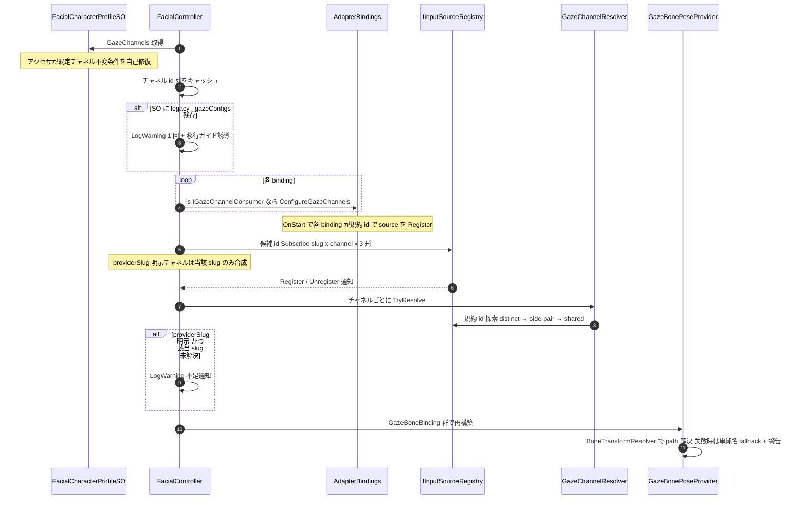
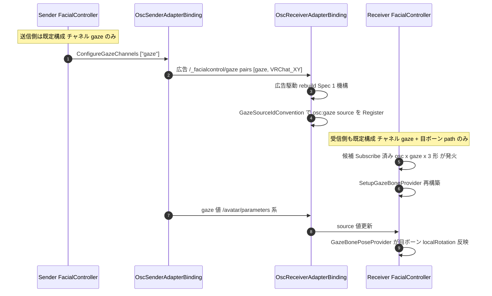
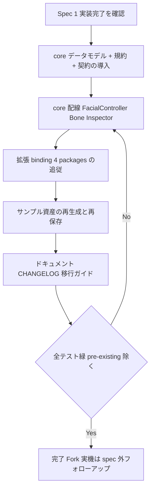

# Technical Design Document — gaze-channel-redesign

## Overview

**Purpose**: gaze（目線）の識別を規約定数 `"gaze"` 1 本の既定チャネルに再設計し、isGaze ダミー Expression + `_gazeConfigs` の二重管理を廃止して `FacialCharacterProfileSO` 直下の「Gaze セクション」（チャネルリスト）へ統合する。id 合成・パースを Domain の `GazeSourceIdConvention` に一元化し、各 binding は `IGazeSourceProvider` で gaze source を宣言、ユーザーは目線タブの入力ソースドロップダウンだけで手法（コントローラ / iFacialMocap / OSC 受信 / Timeline）を切り替えられる。目ボーンは参照モデル割当時に自動解決し、path はフルパス（Animator 起点）で保存する。

**Users**: キャラクター Profile を設定する Unity エンジニア（目線タブ 1 か所で完結）、OSC 送受信を構成するエンジニア（送受信とも id 手入力ゼロ）、コア/拡張パッケージの保守担当（型付き注入契約・id 規約の単一実装点）。

**Impact**: preview 段階の破壊的変更（S2-4）。SO / JSON スキーマ・Inspector・全アダプタ（OSC / InputSystem / iFacialMocap / Timeline / rec）・サンプル・ドキュメントに波及する。Spec 1（osc-gaze-auto-mapping）の実装完了を前提とし、その広告プロトコルは無変更で使用する（広告に載る id が規約定数 `"gaze"` になるのみ）。

### Goals

- **G1**: Gaze セクション（既定チャネル id `"gaze"` 固定 + 上級者向け追加系統）のデータモデル確立と isGaze / `_gazeConfigs` の廃止（Req 1, 2, 9）
- **G2**: `GazeSourceIdConvention` による id 合成・パースの一元化と `.left`/`.right` リテラル散在の根絶（Req 3, 10）
- **G3**: `IGazeSourceProvider` 宣言 + 入力ソースドロップダウンによる手法切替と、型付き注入契約 `IGazeChannelConsumer` への置換（Req 4, 8）
- **G4**: Inspector の目線タブ 1 か所完結・孤児ライフサイクル撤去・目ボーン自動解決の自動実行 + フルパス化（Req 5, 6, 7）
- **G5**: OSC 受信ゼロ設定の成立（Spec 1 D-1 案 (c) の完結）とサンプル・ドキュメント・移行ガイドの追従（Req 11, 12, 13）

### Non-Goals

- multi-source gaze blending（M-13）/ カメラ目線 procedural ソースの実装（M-5。受け口の用意まで）/ Vector3 ターゲット / VRM（Req 14）
- BlendShape gaze の runtime 配線（M-29。D-2 により look* 系スキーマごと削除し、将来 spec で新データモデルごと再設計）
- `/_facialcontrol/gaze` 広告プロトコルの変更（Req 11.1 / S1-3）
- 旧データの自動マイグレータ（D-3: 手動再設定 + 警告誘導）
- M-28（`SampleAssetsAreInSyncTests` の pre-existing 赤）の解消（Req 12.6: FAIL 判定から除外）

## Design Decisions（requirements.md Open Questions の確定）

requirements.md 末尾の未決事項 3 件を以下のとおり確定する。代替案比較の詳細は `research.md` の Design Decisions 1〜3 参照。

| # | 論点 | 決定 | 主根拠 |
|---|------|------|--------|
| 1 | リフレクション Configure 注入の置換方式（Req 8.1） | **型付きインターフェース化を採用**。Domain/Adapters に `IGazeChannelConsumer`（`ConfigureGazeChannels(IReadOnlyList<string> channelIds)`）を新設し、`FacialController` は `is` キャストで注入。`FindGazeConfigureMethod` / `TryReadConfigureArgument` 一式は削除。置換対象は `InputSystemAdapterBinding` + Spec 1 の `OscReceiverAdapterBinding.Configure` に加え、`OscSenderAdapterBinding`（`CharacterSO.GazeConfigs` 直読みフォールバックの置換 = Req 11.6(b) の解）も実装する | 全 binding の実消費は「チャネル id 列」のみで、Unity 非依存の Domain 契約として定義できる（`IAdapterBindingDeclaredInputs` と同格配置、asmdef 依存方向は拡張 → core の既存方向のまま）。データ型が変わる本 spec が型付き化の唯一の好機。旧契約シグネチャは `GazeBindingConfig` 型削除によりコンパイル不能となり無警告沈黙が構造的に消える |
| 2 | eye レイヤーとの概念整理（Req 1.4 / 13.5） | **gaze はレイヤー外の独立チャネルのまま維持し、これを正式仕様として文書化する**。「目レイヤー = まばたき等の BlendShape 表情（レイヤー合成に参加）」「Gaze = ボーン駆動の独立チャネル（Gaze セクションで構成、レイヤー合成に不参加）」と用語を分離し、docs/requirements.md の「目レイヤー = まばたき・目線操作」記述・mental-model・technical-spec §12/§17 を更新 | レイヤー統合は M-13 / M-29 前提の別 spec 案件。現行アーキテクチャ（`GazeBonePoseProvider` の Transform 直駆動）の文書化が最小コストで混乱を解消する |
| 3 | Gaze セクションの JSON スキーマ（Req 2.3） | **ルートキー `"gaze"`（オブジェクト、内部に `channels[]`）、フィールドは camelCase（JsonUtility フィールド名そのまま）、schemaVersion は `"1.0"` 維持**。旧スキーマ検出は raw JSON の `"gaze_configs"` キー文字列走査で警告 + 読み捨て。`PreprocessGazeConfigsKey` / `PostprocessGazeConfigsKey` は削除 | パーサは schemaVersion strict 一致で全体拒否するため bump は D-3（部分読み込み）と矛盾。camelCase は v2 スキーマ他キーの流儀で preprocessing 不要。gaze-config-promotion の "1.0" 統一前例に整合 |

補助決定（requirements 明記外の設計判断。詳細は research.md Decisions 4〜9）:

- **`_gazeExpressionIds` 系 API（sender）は廃止**（Req 11.6(a)）: serialized フィールド・`GazeExpressionIds` / `ConfigureGazeExpressionIds`・options JSON `gazeExpressionIds` キーを削除し、供給源を `IGazeChannelConsumer` 注入に一本化。`OscOutputDemo/OscSenderOptions.json` を追従。
- **SO 経路の旧スキーマ検出**（AC 2.7）: 検出専用マーカー型 `LegacyGazeConfigEntry`（`expressionId` のみ）の非公開リスト `_legacyGazeConfigs`（`[FormerlySerializedAs("_gazeConfigs")]` 付与）で旧 YAML を初回ロード時に受け取り、Inspector HelpBox + `FacialController` rebuild 時警告の 2 点で D-3 の明示警告を実現。再保存で旧キー `_gazeConfigs` 行はアセットから消え（AC 12.5 成立）、新キー `_legacyGazeConfigs: []` の空行が残るのは仕様とする。
- **ボーン path 起点**（Req 7.3）: 「参照モデル内 Animator の Transform」起点で保存（ランタイム root `_animator.transform` と定義一致）。Animator 不在時のみ参照モデル root + 注意ログ。`BoneTransformResolver` に「path 解決失敗 → 末尾セグメント単純名フォールバック + 警告」を追加し、起点不一致構成でも現行同等へ縮退。
- **`GazeSnapshot.ExpressionId` → `ChannelId` リネーム**（Breaking。CHANGELOG 記録）。
- **look* 系の型ごと削除**（D-2）: `GazeBlendShapeSampleEntry` / Editor `GazeClipBlendShapeSampler` / 関連テストを削除（実装冒頭に参照ゼロの grep 検証を置く）。
- **「自動」解決は現行 3 段フォールバック + slug Ordinal 維持**（D-4）: `GazeChannelResolver` がアルゴリズムを引き継ぎ、`providerSlug` 明示時は当該 slug の合成 id のみ探索。
- **`TimelineValueChannelConfig.isGaze` は存続**（Req 10.1）: Timeline 独自のチャネル種別フラグとして維持（channel id 判定への置換はしない — `sub` は Timeline binding のローカル名前空間であり、profile のチャネル集合と独立に成立させる必要がある）。`takeoverSourceId` の合成・検証を `GazeSourceIdConvention` 経由へ。

## Boundary Commitments

### This Spec Owns

- **Gaze セクションのデータモデル**: `GazeChannel`（Serializable）、SO の `_gazeChannels` リスト + 既定チャネル不変条件（存在・id 固定・削除不可）の自己修復、`IFacialCharacterProfile.GazeChannels` 契約
- **JSON スキーマの gaze 表現**: ルートキー `gaze` / `GazeSectionDto` / `GazeChannelDto`、Converter / Exporter / `SystemTextJsonParser` の追従、旧 `gaze_configs[]` 検出警告
- **id 規約**: `GazeSourceIdConvention`（`Compose` / `TryParse` / 規約定数 `"gaze"` / チャネル id validation）と `GazeSide`（Domain へ移設）。`.left`/`.right` 文字列の唯一の定義点
- **binding 契約**: `IGazeSourceProvider` + `GazeSourceDeclaration`（宣言）、`IGazeChannelConsumer`（注入）の Domain 契約と、OSC 送受信 / InputSystem / iFacialMocap / Timeline での実装
- **core の gaze 配線**: `FacialController` の型付き注入・チャネル起点の GazeSnapshot 生成・候補 Subscribe・`SetupGazeBoneProvider`、`GazeChannelResolver`（旧 `GazeBindingConfigResolver` の後継）、`GazeBonePoseProvider` のチャネル追従、`BoneTransformResolver` の単純名フォールバック
- **Inspector**: 目線タブの全面再設計（1 か所完結・チャネルリスト UI・入力ソースドロップダウン・上級設定露出・参照モデル割当時の自動解決自動実行・legacy 検出 HelpBox）、旧導線 / 孤児削除 / isGaze validation の撤去
- **旧スキーマの警告設計**: JSON / SO 両経路の検出点・文言・移行ガイド誘導
- **サンプル 3 系統 + iFM demo + lipsync 2 アセットの追従**、**ドキュメント**（migration-guide L232-273 置換 / mental-model / quickstart / technical-spec §12・§17 / docs/requirements.md の目レイヤー表記 / CHANGELOG）

### Out of Boundary

- `/_facialcontrol/gaze` 広告プロトコル（アドレス・flat pairs payload・chunk 分割規約）の仕様・実装 — Spec 1 の成果を無変更で使用。受信側 gaze 動的登録経路（広告 accumulate / dirty / rebuild / immutable-swap）は id 合成箇所の置換のみ
- BlendShape 合成系（LayerUseCase / Aggregator / heartbeat auto-mapping）の一切
- `GazeInputReader`（Spec 1 新設）の読取挙動 — 無改修で使用
- `IInputSourceRegistry` の契約変更（Subscribe / Register / Replace / Unregister は既存契約のまま）
- Timeline の gaze takeover 実行機構（`FacialTimelineReceiver` の乗っ取りロジック）— id の合成・検証・分類の追従のみ
- M-28 の解消、uOsc 等プロトコル基盤、Fork（jp.co.unvgi.*）への publish・実機検証（spec 外の運用フロー）

### Allowed Dependencies

- **Domain（core）**: `InputSourceId` / `AdapterSlug`（id validation・合成キー規約）、`IInputSourceRegistry`、`GazeSnapshot`、`IAdapterBindingDeclaredInputs`（配置前例）
- **Adapters（core）**: `BoneTransformResolver` / `GazeBonePoseProvider` / `GazeInputReader`（Spec 1）/ `FacialController`
- **拡張 → core の一方向依存**（asmdef）: osc / inputsystem / ifacialmocap / timeline / rec は core の Domain・Adapters を参照できる。core は拡張を知らない。新契約（`IGazeSourceProvider` / `IGazeChannelConsumer` / `GazeSourceIdConvention`）はすべて core 側に置き、この方向を維持する
- **Spec 1 成果物**: `GazeAdvertisementResolver` / 受信側 rebuild 機構 / `OscGazeE2ETests` のテストパターン（決定論方式 = `HandleOscMessage` 直接呼び出し）

### Revalidation Triggers

- `GazeSourceIdConvention` の合成形（`{slug}:{channelId}[.left/.right]`）の変更 → OSC 広告・rec 記録・Timeline takeover の id 互換に波及するため全 binding + rec/timeline の再検証
- `IGazeChannelConsumer` / `IGazeSourceProvider` の契約形変更 → 実装 4+1 binding と Inspector 列挙ロジックの再検証
- Gaze セクション JSON キー / DTO 形状の変更 → Exporter / Converter / Parser のラウンドトリップテストと移行ガイド記載の再検証
- 既定チャネル不変条件（常在・id 固定）の緩和 → Inspector validation・自己修復・OSC ゼロ設定 E2E の前提が崩れるため Req 11 系の再検証
- Spec 1 実装がこの design 記載のシンボル名と異なる形で完了した場合 → File Structure Plan / Components の該当箇所を追従レビュー

## Architecture

### Existing Architecture Analysis

**解消する構造**（research.md「接点インベントリ」に実測記録）:

- gaze identity がユーザー任意 `expressionId` の 4 箇所以上 Ordinal 突合（isGaze Expression / GazeConfig / binding 設定 / registry id、OSC ではマシン間）→ 規約定数 `"gaze"` の既定チャネルに一本化
- isGaze ダミー Expression（実行時の役割は id 発行のみ）と `_gazeConfigs` の二重管理、それを守る孤児削除 3 トリガ・隠し dropdown・isGaze Toggle validation → データモデル統合により構造ごと消滅
- binding ごとに 4 通り併存する gaze 登録の流儀（OSC 規約準拠 / InputSystem エイリアス後付け / iFM ハードコード / Timeline 連番）→ `GazeSourceIdConvention` + `IGazeSourceProvider` で一貫化
- リフレクション注入（`FindGazeConfigureMethod` + 引数読み戻し）→ 型付き `IGazeChannelConsumer`
- `AutoAssignGazeBonesFromReferenceModel` の単純名保存（同名ボーン衝突 = 旧 backlog S-1）→ Animator 起点フルパス

**保持するパターン**:

- クリーンアーキテクチャ / asmdef 依存方向（Domain ← Application ← Adapters、拡張 → core）。新契約はすべて core に置く
- 目ボーン適用の責務集約（`FacialController.SetupGazeBoneProvider` → `GazeBonePoseProvider` の localRotation 直駆動。binding は入力源登録まで）
- Spec 1 の広告駆動 rebuild 機構・`GazeInputReader`・候補 id 全合成 Subscribe（データ源をチャネルに置換して流用）
- 3 段フォールバック解決 + slug Ordinal 優先 + Warning（D-4）
- Unity 標準ログのみ・毎フレーム GC ゼロ目標・UI Toolkit

### Architecture Pattern & Boundary Map

```mermaid
graph TB
    subgraph Core_Domain
        Convention[GazeSourceIdConvention]
        SideEnum[GazeSide]
        ProviderIF[IGazeSourceProvider]
        ConsumerIF[IGazeChannelConsumer]
        Snapshot[GazeSnapshot ChannelId]
    end

    subgraph Core_Adapters
        ProfileSO[FacialCharacterProfileSO GazeChannels]
        Channel[GazeChannel]
        Resolver[GazeChannelResolver]
        FC[FacialController]
        BoneProvider[GazeBonePoseProvider]
        BoneResolver[BoneTransformResolver fallback]
        Parser[SystemTextJsonParser gaze section]
    end

    subgraph Core_Editor
        Inspector[FacialCharacterProfileSOInspector gaze tab]
    end

    subgraph Extensions
        OscS[OscSenderAdapterBinding]
        OscR[OscReceiverAdapterBinding]
        IS[InputSystemAdapterBinding]
        IFM[IFacialMocapReceiverAdapterBinding]
        TL[TimelineAdapterBinding]
        Rec[RecToTimelineExporter]
    end

    ProfileSO --> Channel
    FC --> ProfileSO
    FC -- typed inject channel ids --> ConsumerIF
    OscS -.implements.-> ConsumerIF
    OscR -.implements.-> ConsumerIF
    IS -.implements.-> ConsumerIF
    OscR -.implements.-> ProviderIF
    IS -.implements.-> ProviderIF
    IFM -.implements.-> ProviderIF
    TL -.implements.-> ProviderIF
    Inspector -- enumerate providers --> ProviderIF
    Inspector --> ProfileSO
    FC --> Resolver
    Resolver --> Convention
    OscS --> Convention
    OscR --> Convention
    IS --> Convention
    IFM --> Convention
    TL --> Convention
    Rec --> Convention
    FC --> BoneProvider
    BoneProvider --> BoneResolver
    FC --> Snapshot
    Parser --> ProfileSO
```



**Architecture Integration**:

- **Selected pattern**: 「規約定数 + 宣言インターフェース」。id の真実源は Profile の Gaze セクション（チャネル定義）、合成規約は Domain の `GazeSourceIdConvention` の 1 点、binding の能力は `IGazeSourceProvider` の静的宣言で表現する。`IAdapterBindingDeclaredInputs` → `SourcePortEnumerator` の既存前例（Domain 契約 + Editor 列挙）を gaze 特化で踏襲する。
- **New components rationale**: `GazeSourceIdConvention` は Req 3 の唯一の実装点（`.left`/`.right` 文字列は本クラス内定数のみ）。`GazeChannelResolver` は実績ある解決アルゴリズムの入れ物をチャネルへ差し替える後継。`IGazeChannelConsumer` はリフレクション注入の型付き置換（Design Decision 1）。
- **Steering compliance**: Domain は Unity 非依存を維持（新 Domain 型はすべて純 C#）。core は拡張パッケージを知らない。エラーは `Debug.LogWarning/Error` のみ。毎フレーム GC ゼロ目標は rebuild 時のみの確保で維持。

### Technology Stack

| Layer | Choice / Version | Role in Feature | Notes |
|-------|------------------|-----------------|-------|
| Data / Storage | Unity Serialization + JsonUtility ベース `SystemTextJsonParser`（既存） | Gaze セクションの SO / JSON 永続化（schemaVersion "1.0" 維持） | 新規依存なし。preprocessing（snake/camel 置換）は削除方向 |
| Backend / Services | C# 9（Unity 6 Roslyn）、Domain + Adapters 層 | id 規約 / 宣言・注入契約 / 解決アルゴリズム | 追加依存なし |
| Messaging / Events | uOSC + `/_facialcontrol/gaze`（Spec 1 成果） | 広告 id にチャネル id を載せる（プロトコル無変更） | payload 形式・chunk 規約は Out of Boundary |
| Editor | UI Toolkit（既存 Inspector 拡張） | 目線タブ再設計・provider ドロップダウン・自動解決 | IMGUI 新規使用なし |

## File Structure Plan

### Directory Structure（新規ファイル）

```
FacialControl/Packages/com.hidano.facialcontrol/
└── Runtime/
    ├── Domain/
    │   ├── Models/
    │   │   ├── GazeSourceIdConvention.cs   # 新規: id 合成/パース/規約定数/チャネル id validation (Req 3)
    │   │   └── GazeSide.cs                 # 新規: Shared/Left/Right (Spec 1 の Adapters 版 enum を Domain へ移設)
    │   └── Adapters/
    │       ├── IGazeSourceProvider.cs      # 新規: gaze source 宣言契約 + GazeSourceDeclaration (Req 4)
    │       └── IGazeChannelConsumer.cs     # 新規: チャネル id 注入契約 (Req 8)
    └── Adapters/
        ├── ScriptableObject/
        │   ├── GazeChannel.cs              # 新規: チャネル定義 Serializable (Req 1)
        │   ├── GazeChannelResolver.cs      # 新規: 3 段フォールバック解決の後継 + providerSlug 制限 (Req 4)
        │   └── Serializable/LegacyGazeConfigEntry.cs  # 新規: SO 旧スキーマ検出専用マーカー (AC 2.7)
        └── Json/Dto/
            ├── GazeSectionDto.cs           # 新規: ルートキー gaze (Req 2.3)
            └── GazeChannelDto.cs           # 新規: チャネル DTO
```

### Modified Files

**core（com.hidano.facialcontrol）**:

- `Runtime/Adapters/ScriptableObject/FacialCharacterProfileSO.cs` — `_gazeConfigs`（`GazeBindingConfig`）を削除し `List<GazeChannel> _gazeChannels` + 検出専用 `List<LegacyGazeConfigEntry> _legacyGazeConfigs`（`[FormerlySerializedAs("_gazeConfigs")]` + HideInInspector）に置換。`GazeChannels` アクセサで既定チャネル不変条件を自己修復。`HasLegacyGazeConfigs` 内部公開
- `Runtime/Domain/Adapters/IFacialOutputObserver.cs` — XML doc の `GazeSnapshot.ExpressionId` 参照を `ChannelId` へ追従（Design Decision 3 のリネームに伴うドキュメント整合）
- `Runtime/Adapters/ScriptableObject/IFacialCharacterProfile.cs` — `GazeConfigs` → `GazeChannels`（`IReadOnlyList<GazeChannel>`）
- `Runtime/Adapters/ScriptableObject/Serializable/ExpressionSerializable.cs` — `isGaze` フィールド削除（Req 2.1）
- `Runtime/Adapters/Json/Dto/ProfileSnapshotDto.cs` — `gazeConfigs` 削除、`GazeSectionDto gaze` 追加
- `Runtime/Adapters/Json/SystemTextJsonParser.cs` — gaze セクションの parse/normalize、旧 `"gaze_configs"` キー検出警告、Pre/PostprocessGazeConfigsKey 削除（Req 2.6, 2.7）
- `Runtime/Adapters/Json/FacialCharacterProfileConverter.cs` / `FacialCharacterProfileExporter.cs` — Gaze セクションの変換・出力・ラウンドトリップ（Req 2.4, 2.5）※実ファイル名はシンボルで特定
- `Runtime/Adapters/Playable/FacialController.cs` — 型付き注入 / チャネル起点の snapshot / 候補 Subscribe / `SetupGazeBoneProvider` / legacy 警告（Req 8, 11.6, 2.7）
- `Runtime/Adapters/Bone/GazeBonePoseProvider.cs`（+ `GazeBoneBinding`） — `GazeBindingConfig` → `GazeChannel` 追従（挙動互換）
- `Runtime/Adapters/Bone/BoneTransformResolver.cs` — path 解決失敗時の末尾セグメント単純名フォールバック + 警告（Req 7.3）
- `Runtime/Domain/Models/GazeSnapshot.cs` — `ExpressionId` → `ChannelId` リネーム（Breaking）
- `Editor/Inspector/FacialCharacterProfileSOInspector.cs` — 目線タブ全面再設計 + 旧導線撤去（Req 5, 6, 7）
- `Documentation~/migration-guide.md`（L232-273 置換） / `CHANGELOG.md`

**削除（core）**: `GazeBindingConfig.cs` / `GazeBindingConfigResolver.cs`（`ResolvedGazeInputSources` は `GazeChannelResolver.cs` へ移設） / `GazeBlendShapeSampleEntry.cs` / `Runtime/Adapters/Json/Dto/GazeBindingConfigDto.cs` / Editor の `GazeClipBlendShapeSampler`（参照ゼロを grep 検証してから削除。D-2）

**osc（com.hidano.facialcontrol.osc）**:

- `OscSenderAdapterBinding.cs` — `IGazeChannelConsumer` 実装。`_gazeExpressionIds` / `GazeExpressionIds` / `ConfigureGazeExpressionIds` / `ResolveGazeExpressionIds`（CharacterSO 直読み）と options JSON `gazeExpressionIds` キーを削除。広告ペア・GazeSnapshot フィルタの id 源を注入チャネル id に一本化（Req 11.2, 11.6）
- `OscReceiverAdapterBinding.cs` — Spec 1 の `Configure(IReadOnlyList<GazeBindingConfig>)` を `IGazeChannelConsumer` へ置換。gaze 登録・突合警告の id 合成を `GazeSourceIdConvention` 経由に（`.left`/`.right` 連結の置換）。`IGazeSourceProvider` 実装（手動 entry 由来 + 広告駆動ワイルドカード宣言）（Req 3.3, 4.2, 11.3, 11.4）
- `GazeAdvertisementResolver.cs` — 内部の id 合成箇所を `GazeSourceIdConvention` へ委譲（改修はこれに限定。Req 11.4）
- `Samples~/OscOutputDemo/`（Profile / `OscSenderOptions.json` / README）、`Samples~/OscReceiverDemo/`（Profile / README） / `CHANGELOG.md`

**inputsystem（com.hidano.facialcontrol.inputsystem）**:

- `InputSystemAdapterBinding.cs` — `Configure` の末尾 gaze 引数を削除し `IGazeChannelConsumer` 実装へ。`BuildAnalogSources` の Gaze 分岐を「エイリアス後付け二重登録」から「規約 id での一貫登録」へ置換（`$"{expressionId}.left"` 補間の削除）。`IGazeSourceProvider` 実装。`GetDeclaredInputSourceIds` に gaze 規約 id を追加（Req 3.3, 4.7）
- `Editor/AdapterBindings/InputSystemAdapterBindingDrawer.cs` — bindingMode=Gaze のとき expression ドロップダウン（`CollectExpressionIds`）を Profile の `GazeChannels` id 列挙へ切替（Req 4.7 / 6.1。`InputSystemAdapterBindingDrawerTests` 追従）
- `ExpressionBindingEntry`（bindingMode=Gaze） — `expressionId` の意味を「チャネル id 参照」へ変更（フィールド名は維持、Tooltip / ドキュメント更新。serialized データの破壊的変更として移行ガイドに記載）
- `Samples~/MultiSourceBlendDemo/`（Profile / JSON / README） / `CHANGELOG.md`

**ifacialmocap（com.hidano.facialcontrol.ifacialmocap）**:

- `IFacialMocapReceiverAdapterBinding.cs` — `GazeLeftSub` / `GazeRightSub` 定数を `GazeSourceIdConvention.ComposeSub(DefaultChannelId, side)` 経由へ置換（合成結果は現行と同一文字列 = 挙動互換）。`IGazeSourceProvider` 実装（既定チャネル・左右ペア宣言）。`_gazeInvertYaw` / `_gazeInvertPitch` は binding 側設定として存続（Req 3.3, 4.6）
- `Samples~/IFacialMocapReceiverDemo/`（README L25 / L41-42 の旧手順置換 + Profile アセット再保存で旧キー `_gazeConfigs` 行を除去 — `FormerlySerializedAs` 方式のため新キー `_legacyGazeConfigs: []` の空行が残るのは仕様） / `CHANGELOG.md`

**timeline（com.hidano.facialcontrol.timeline）**:

- `TimelineAdapterBinding.cs` — `IGazeSourceProvider` 実装（isGaze チャネル config の宣言）。`takeoverSourceId` の検証を `GazeSourceIdConvention.TryParse` 経由に（Req 10.1, 10.4）
- `Editor/RecToTimelineExporter.cs` — `CollectGazeSourceIds` を「GazeConfigs 明示値 Ordinal 収集」から「profile の Gaze セクション（チャネル id 集合 + distinct 明示値）× `GazeSourceIdConvention.TryParse` による分類」へ置換（Req 10.2, 10.3）
- `CHANGELOG.md`

**lipsync**: `Samples~/MicLipSyncDemo` / `AnimationClipLipSyncDemo` の Profile アセット再保存（stale キー除去のみ。Req 12.5）

**docs / リポジトリ**: `docs/mental-model.md` / `docs/requirements.md`（目レイヤー表記） / `docs/technical-spec.md` §12・§17 / quickstart 系（README 含む）

**テスト**: core / osc / inputsystem / ifacialmocap / timeline の既存 gaze 関連テスト 15+ ファイルの追従 + 新規（Testing Strategy 参照）

## System Flows

### Rebuild 時の注入・解決・目ボーン接続



**Key Decisions**:
- 注入（`ConfigureGazeChannels`）は child scope build / OnStart より前に実行する（現行 `ConfigureAdapterBindingsWithGazeConfigs` と同じ位置）。binding は OnStart 時点で注入済みチャネル id を参照できる。
- 候補 Subscribe は Spec 1 の全合成方式を踏襲（slug 一覧 × チャネル × Shared/Left/Right）。`useDistinctLeftRight` チャネルは明示 id を直接 Subscribe。
- GazeSnapshot 生成（`BuildGazeSnapshotSpan`）はチャネル単位で `GazeSnapshot(channel.id, x, y)` を構築（id = チャネル id）。

### OSC 送受信ゼロ設定 E2E（Req 11.5）



**Key Decisions**:
- 送受信双方の Gaze セクションが既定で `"gaze"` チャネルを持つため、広告 id と受信側チャネル id は**設定なしで恒常一致**する。Spec 1 の突合警告（不一致 id）は既定構成では発火しない。
- 受信側に残る手動設定は目ボーン path（+ 参照モデル自動解決）のみ。mapping 手入力・id 一致作業はゼロ（Spec 1 D-1 案 (c) の完結）。
- 送信側は gaze 入力が未解決でも広告は送出する（チャネル定義が存在する限り）。値が流れなければ受信側は staleness フェイルセーフに委ねる（Spec 1 Decision 4 の既存挙動）。

## Requirements Traceability

| Requirement | Summary | Components | Interfaces / Flows |
|-------------|---------|------------|--------------------|
| 1.1 | ルート直下の Gaze セクション + 既定チャネル `"gaze"` | FacialCharacterProfileSO, GazeChannel | `GazeChannels` アクセサ + 自己修復 |
| 1.2 | チャネルが目ボーン path・軸・可動角・入力ソース選択を保持 | GazeChannel | Data Models |
| 1.3 | リスト 1 本・先頭既定固定・追加系統は自由 id + validation | FacialCharacterProfileSO, Inspector, GazeSourceIdConvention | `IsValidChannelId` + 重複禁止 |
| 1.4 | 目ボーン経路維持・レイヤー合成不参加 | FacialController, GazeBonePoseProvider | Design Decision 2（レイヤー外を正式仕様化） |
| 1.5 | 既定チャネルのみなら id 入力・編集を要求しない | Inspector | 既定チャネル行は id 非編集表示 |
| 2.1 | `ExpressionSerializable.isGaze` 廃止（Timeline の isGaze は対象外） | ExpressionSerializable | フィールド削除。`TimelineValueChannelConfig.isGaze` 存続（補助決定） |
| 2.2 | SO の旧 `_gazeConfigs` リスト廃止 | FacialCharacterProfileSO | `GazeChannel` リストへ置換（検出専用マーカーは AC 2.7 が許容） |
| 2.3 | JSON に Gaze セクション表現 / 旧キー・isGaze なし | ProfileSnapshotDto, GazeSectionDto | Design Decision（Open Question 3）: ルートキー `gaze` |
| 2.4 | Converter が新スキーマ → SO 変換 | FacialCharacterProfileConverter | Gaze セクション変換 + 不変条件正規化 |
| 2.5 | Exporter 出力 → Converter 読み戻しの値等価 | FacialCharacterProfileExporter | ラウンドトリップテスト（EditMode） |
| 2.6 | Parser が新スキーマをパース | SystemTextJsonParser | `GazeSectionDto` 直マップ（preprocessing 不要） |
| 2.7 | 旧スキーマは警告 + gaze 読み捨て + 他は通常読込 | SystemTextJsonParser, FacialCharacterProfileSO, Inspector, FacialController | JSON: raw `"gaze_configs"` 走査 / SO: LegacyGazeConfigEntry 検出（Decision 5） |
| 3.1 | `GazeSourceIdConvention`（Compose / TryParse）新設・唯一の実装点 | GazeSourceIdConvention | Service Interface 参照 |
| 3.2 | 規約定数 `"gaze"` の単一定義 | GazeSourceIdConvention | `DefaultChannelId` |
| 3.3 | `.left`/`.right` リテラル 4 箇所の置換 | GazeChannelResolver, IFM/IS/OscR 各 binding | 定数は Convention 内のみ |
| 3.4 | Spec 1 `ComposeSourceId` 系の統合 | GazeSourceIdConvention, GazeAdvertisementResolver | Adapters 側 helper 削除・委譲 |
| 3.5 | Compose → TryParse ラウンドトリップ | GazeSourceIdConvention | EditMode テストで固定 |
| 3.6 | 非準拠文字列は例外なし false | GazeSourceIdConvention | TryParse 契約 |
| 3.7 | Unity 非依存・asmdef 依存方向維持 | GazeSourceIdConvention | Domain/Models 配置 |
| 4.1 | 宣言インターフェースの定義 | IGazeSourceProvider | 正式名確定: `IGazeSourceProvider`（Domain/Adapters） |
| 4.2 | 4 binding が実装・宣言 | OscR/IS/IFM/TL 各 binding | Components 各節 |
| 4.3 | Inspector が割当済み binding の宣言を列挙 | Inspector | `SourcePortEnumerator` 前例踏襲 |
| 4.4 | 既定「自動」= 規約解決 + slug Ordinal + Warning | GazeChannelResolver | D-4（アルゴリズム維持） |
| 4.5 | 明示選択時は当該 provider のみ | GazeChannelResolver, GazeChannel.providerSlug | slug 制限探索 |
| 4.6 | iFM のハードコード吸収・使用感維持 | IFacialMocapReceiverAdapterBinding | ComposeSub 合成結果が現行文字列と一致 |
| 4.7 | InputSystem のエイリアス二重登録の置換 | InputSystemAdapterBinding | 規約 id での一貫登録 |
| 4.8 | procedural ソースの拡張点 | IGazeSourceProvider | provider 追加のみで選択肢に載る（実装は out of scope） |
| 4.9 | provider 不在時の警告 | FacialController, GazeChannelResolver | 明示 slug 未解決 / 自動全滅時の LogWarning |
| 5.1 | 孤児削除 3 トリガの撤去 | Inspector | `GazeConfigDeletionTrigger` 一式削除 |
| 5.2 | 隠し dropdown デッドパス削除 | Inspector | L1189-1212 相当の撤去 |
| 5.3 | isGaze Toggle 連動 validation 削除 | Inspector | 表情行 Toggle / 連動処理の撤去 |
| 5.4 | 旧構造参照ゼロでコンパイル可能 | Inspector, 全 Editor コード | `_rootGazeConfigsProperty` 系全撤去 |
| 6.1 | 目線タブ 1 か所完結 | Inspector | チャネルリスト + ボーン + 入力ソース + 上級 |
| 6.2 | distinct / sourceIdLeft/Right の UI 露出 | Inspector | 上級 foldout |
| 6.3 | 追加系統の追加・編集・削除 UI + 既定チャネル保護 | Inspector | D-1 の UI/validation 担保 |
| 6.4 | 既定構成では上級設定を前面に出さない | Inspector | 既定表示 = ボーン + 入力ソースのみ |
| 6.5 | SerializedObject / Undo パイプライン | Inspector | 既存パイプラインを踏襲 |
| 7.1 | 参照モデル割当で自動解決を自動実行 | Inspector | 参照モデル変更検知 → AutoAssign 実行 |
| 7.2 | 手動編集済み非空 path を上書きしない | Inspector | 空フィールドのみ補完 |
| 7.3 | フルパス保存 + 起点定義 + 不一致時の扱い | Inspector, BoneTransformResolver | Animator 起点 + 単純名 fallback（Decision 6） |
| 7.4 | 解決不能時の UI 明示 + 手掛かり | Inspector | HelpBox + 手動設定案内 |
| 7.5 | 明示的な再解決操作 | Inspector | チャネル別 + 一括の再解決ボタン |
| 8.1 | 注入方式の確定 | FacialController, IGazeChannelConsumer | Design Decision（Open Question 1）: 型付き化採用 |
| 8.2 | 置換対象に IS + OscR の Configure を含む | InputSystemAdapterBinding, OscReceiverAdapterBinding | + OscSender も実装（11.6(b) 兼） |
| 8.3 | 新データモデルの配布 | IGazeChannelConsumer | チャネル id 列の注入（要件の「チャネル定義の配布」を id-only に絞る意図的な設計判断 — 全 4 消費者の実消費が id 列で足り、bone 情報は core の `SetupGazeBoneProvider` に閉じることを実測確認済み） |
| 8.4 | 受け取れない構成の警告 | FacialController | 旧契約型の削除で構造的に排除 + 4.9 警告 |
| 9.1 | look*Clip / look*Samples を新スキーマに含めない | GazeChannel, GazeChannelDto | D-2（型ごと削除） |
| 9.2 | look* の UI / validation 撤去 | Inspector | ObjectField・validation 削除 |
| 9.3 | JSON/Converter/Exporter/Parser から排除 + 2.5 維持 | GazeSectionDto ほか | ラウンドトリップテストで担保 |
| 10.1 | Timeline の isGaze / takeoverSourceId の新規約整合 | TimelineAdapterBinding | isGaze 存続 + takeover 検証を Convention 経由（補助決定） |
| 10.2 | RecToTimelineExporter の TryParse ベース分類 | RecToTimelineExporter | チャネル id 集合 × TryParse |
| 10.3 | 新規約 rec 記録の正分類・書き出し | RecToTimelineExporter | PlayMode/EditMode テスト |
| 10.4 | 診断連番 id の流儀整合 | TimelineAdapterBinding | provider 宣言 + sub 検証 |
| 11.1 | 広告プロトコル無変更 | （制約） | Out of Boundary 明記 |
| 11.2 | 送信既定構成で広告 id `"gaze"` | OscSenderAdapterBinding | 注入チャネル id → 広告ペア |
| 11.3 | 受信既定構成で手動突合なしに目ボーン反映 | OscReceiverAdapterBinding, FacialController | E2E フロー図 |
| 11.4 | 動的登録経路は id 合成集約に改修限定 | GazeAdvertisementResolver, OscReceiverAdapterBinding | Convention 委譲のみ |
| 11.5 | ゼロ設定 E2E テスト | OscGazeE2ETests | Testing Strategy |
| 11.6 | 送信 id 供給 2 経路の新モデル追従 | OscSenderAdapterBinding | (a) `_gazeExpressionIds` 廃止（Decision 4） (b) 直読み → Consumer 注入 |
| 12.1 | 3 サンプルの新スキーマ更新 | Samples | Profile + profile.json |
| 12.2 | サンプル起動で警告・エラーなし + gaze 動作 | Samples | PlayMode / 手動確認 |
| 12.3 | README の新手順反映 | Samples README | Gaze セクション + 入力ソース選択 |
| 12.4 | サンプルは既定チャネル + 入力ソース選択のみ | Samples | 上級設定不使用 |
| 12.5 | iFM demo README / stale アセット + lipsync 2 件再保存 | IFM/lipsync Samples | 旧手順置換 + 再保存 |
| 12.6 | M-28 交差の明記・不取り込み | （tasks 制約） | pre-existing 赤として除外 |
| 13.1 | 手動再設定方針 + Fork 実機明示 | migration-guide | D-3 |
| 13.2 | CHANGELOG に Breaking 記録 | CHANGELOG（core + 変更拡張） | isGaze 廃止 / セクション統合 / スキーマ / API 変更 |
| 13.3 | migration-guide L232-273 の陳腐化解消 | migration-guide | 新スキーマ移行手順へ置換 |
| 13.4 | mental-model / quickstart 反映 | docs | 新 gaze 手順 |
| 13.5 | gaze と eye レイヤーの関係明文化 | docs/requirements.md, mental-model | Design Decision 2 |
| 13.6 | technical-spec §12/§17 の S2-3 再解釈 | docs/technical-spec.md | Expression テンプレート → 入力ソース切替 |
| 14.1-14.6 | スコープ外の固定 | （制約） | Non-Goals / backlog 起票ルール |

## Components and Interfaces

| Component | Domain/Layer | Intent | Req Coverage | Key Dependencies (P0/P1) | Contracts |
|-----------|--------------|--------|--------------|--------------------------|-----------|
| GazeSourceIdConvention | Core Domain/Models (新規) | id 合成/パース/規約定数/チャネル id validation の唯一の実装点 | 3.1-3.7, 1.3 | InputSourceId 規約 (P1) | Service |
| IGazeSourceProvider | Core Domain/Adapters (新規) | binding の gaze source 静的宣言 | 4.1, 4.2, 4.8 | — | Service |
| IGazeChannelConsumer | Core Domain/Adapters (新規) | チャネル id の型付き注入契約 | 8.1-8.4 | — | Service |
| GazeChannel / GazeSectionDto | Core Adapters (新規) | チャネル定義の SO / JSON 表現 | 1.1-1.3, 2.3, 9.1 | — | State |
| FacialCharacterProfileSO | Core Adapters (改修) | Gaze セクション保持 + 不変条件自己修復 + legacy 検出 | 1.1, 1.3, 2.2, 2.7 | GazeChannel (P0) | State |
| SystemTextJsonParser / Converter / Exporter | Core Adapters (改修) | 新スキーマの parse / 変換 / 出力 / 旧キー警告 | 2.3-2.7, 9.3 | GazeSectionDto (P0) | Service |
| GazeChannelResolver | Core Adapters (新規) | チャネル → 入力源解決（3 段 + slug Ordinal + provider 制限） | 4.4, 4.5, 4.9 | GazeSourceIdConvention (P0), IInputSourceRegistry (P0) | Service |
| FacialController | Core Adapters (改修) | 型付き注入 / snapshot / 候補 Subscribe / bone provider / legacy 警告 | 8.*, 11.6, 4.9, 2.7 | IGazeChannelConsumer (P0), GazeChannelResolver (P0) | Service |
| BoneTransformResolver / GazeBonePoseProvider | Core Adapters (改修) | フルパス解決 + fallback / チャネル追従 | 7.3, 1.4 | — | Service |
| FacialCharacterProfileSOInspector | Core Editor (改修) | 目線タブ再設計・旧導線撤去・自動解決自動実行 | 5.*, 6.*, 7.*, 9.2, 4.3 | IGazeSourceProvider (P0), UI Toolkit (P0) | State |
| OscSenderAdapterBinding | osc (改修) | 広告 id / snapshot 送出のチャネル追従・旧 API 廃止 | 11.2, 11.6 | IGazeChannelConsumer (P0) | Service, State |
| OscReceiverAdapterBinding | osc (改修) | Consumer/Provider 実装・id 合成集約 | 3.3, 4.2, 11.3, 11.4 | GazeSourceIdConvention (P0) | Service, Event |
| InputSystemAdapterBinding | inputsystem (改修) | 一貫登録・Consumer/Provider 実装 | 3.3, 4.7 | GazeSourceIdConvention (P0) | Service, State |
| IFacialMocapReceiverAdapterBinding | ifacialmocap (改修) | ハードコード吸収・Provider 実装 | 3.3, 4.6 | GazeSourceIdConvention (P0) | Service |
| TimelineAdapterBinding / RecToTimelineExporter | timeline (改修) | takeover 検証 / gaze 分類の新規約化 | 10.1-10.4 | GazeSourceIdConvention (P0) | Service |
| Samples / docs | Samples~, docs/, Documentation~ | サンプル・ドキュメント・移行ガイド追従 | 12.*, 13.* | — | — |

### Core Domain

#### GazeSourceIdConvention（新規）

| Field | Detail |
|-------|--------|
| Intent | gaze source id（`{slug}:{channelId}[.left/.right]`）の合成・パース・規約定数・チャネル id validation の唯一の実装点 |
| Requirements | 3.1-3.7, 1.3 |

**Responsibilities & Constraints**
- `.left` / `.right` の文字列定数は本クラス内にのみ存在する（Req 3.3 の担保。他ファイルへの直書きはレビューで違反とする）。
- Unity 非依存の static クラス。`Runtime/Domain/Models/` に配置し、Domain asmdef（Unity.Collections のみ参照）でコンパイル可能（Req 3.7）。
- `TryParse` は**形状分解のみ**を行う（`{slug}:{sub}` + side suffix の切り出し）。「gaze かどうか」の分類は呼び出し側がチャネル id 集合との membership で判定する（既定チャネルは `DefaultChannelId` 定数一致で判定可能）。この責務分離を XML doc に明記する。

**Dependencies**
- Inbound: GazeChannelResolver / 全 binding / RecToTimelineExporter / GazeAdvertisementResolver / FacialController / Inspector（P0）
- Outbound: なし（`InputSourceId` の文字集合規約を validation 仕様として参照するのみ）

**Contracts**: Service [x]

##### Service Interface
```csharp
namespace Hidano.FacialControl.Domain.Models
{
    public enum GazeSide
    {
        Shared,
        Left,
        Right
    }

    /// <summary>
    /// gaze source id の合成・パースの唯一の実装点。
    /// 形式: Shared "{slug}:{channelId}" / Left "{slug}:{channelId}.left" / Right "{slug}:{channelId}.right"。
    /// </summary>
    public static class GazeSourceIdConvention
    {
        /// <summary>既定 gaze チャネルの規約定数 id。</summary>
        public const string DefaultChannelId = "gaze";

        /// <summary>合成 id "{slug}:{channelId}[.left/.right]" を返す。slug / channelId が不正なら null。</summary>
        public static string Compose(string slug, string channelId, GazeSide side);

        /// <summary>sub 部のみ合成する ("{channelId}[.left/.right]")。Register(slug, sub, source) 用。</summary>
        public static string ComposeSub(string channelId, GazeSide side);

        /// <summary>
        /// 合成 id を slug / channelId / side に形状分解する。規約非準拠は例外を送出せず false。
        /// gaze チャネルかどうかの分類は呼び出し側が channelId の集合照合で行う。
        /// </summary>
        public static bool TryParse(string sourceId, out string slug, out string channelId, out GazeSide side);

        /// <summary>sub 部のみを channelId / side に分解する。</summary>
        public static bool TryParseSub(string sub, out string channelId, out GazeSide side);

        /// <summary>
        /// チャネル id として妥当か検証する。
        /// 条件: InputSourceId 文字集合（英数 _ . -、64 文字以内）かつ ':' を含まず、
        /// ".left" / ".right" で終端しない（side suffix との曖昧性排除）。
        /// </summary>
        public static bool IsValidChannelId(string channelId);
    }
}
```
- Preconditions: なし（null / 空文字は false / null 返却で処理し例外を出さない）。
- Postconditions: `Compose(slug, id, side)` の結果を `TryParse` に与えると slug / id / side が元の値どおり復元される（ラウンドトリップ保証。Req 3.5）。
- Invariants: `ComposeSub(DefaultChannelId, Left)` は `"gaze.left"`（iFM の現行ハードコードと文字列一致 = Req 4.6 の互換基盤）。GC: 合成は文字列連結 1 回、TryParse はアロケーションなし（Span/IndexOf ベース）を実装要件とする。

**Implementation Notes**
- Integration: Spec 1 の `GazeBindingConfigResolver.ComposeSourceId` / `ComposeSourceSub` / Adapters 版 `GazeSide` を本クラスへ統合し、Adapters 側は削除（Req 3.4）。
- Validation: EditMode でラウンドトリップ / 非準拠入力（空・`:` 過多・suffix のみ・`"my.left"` チャネル名）/ `IsValidChannelId` 境界を固定。
- Risks: チャネル id に `.` を許すため suffix 曖昧性がある → `IsValidChannelId` の終端禁止則で入口（Inspector / Converter）を塞ぐ。

#### IGazeSourceProvider / IGazeChannelConsumer（新規）

| Field | Detail |
|-------|--------|
| Intent | binding の gaze source 静的宣言（Inspector 列挙用）と、チャネル id の型付き注入契約 |
| Requirements | 4.1, 4.2, 4.8, 8.1-8.4 |

**Responsibilities & Constraints**
- `IAdapterBindingDeclaredInputs` と同じ `Runtime/Domain/Adapters/` 配置・純 C#。Editor（Inspector）とランタイム（FacialController）の両方から `is` キャストで利用する。
- 宣言は**静的**（serialized 設定から導出可能な範囲）。OSC 受信の広告駆動のような実行時にしか確定しないソースは「ワイルドカード宣言」（`ChannelId = null`）で表現する。

**Contracts**: Service [x]

##### Service Interface
```csharp
namespace Hidano.FacialControl.Domain.Adapters
{
    /// <summary>binding が提供可能な gaze source の静的宣言。</summary>
    public readonly struct GazeSourceDeclaration
    {
        /// <summary>対象チャネル id。null / 空 = 任意チャネルに提供可能（広告駆動等のワイルドカード）。</summary>
        public string ChannelId { get; }

        /// <summary>true = .left/.right ペアで登録する。false = 共有 1 本。</summary>
        public bool ProvidesLeftRightPair { get; }

        public GazeSourceDeclaration(string channelId, bool providesLeftRightPair);
    }

    /// <summary>gaze source を提供する binding の宣言契約。Inspector の入力ソースドロップダウンが列挙する。</summary>
    public interface IGazeSourceProvider
    {
        IEnumerable<GazeSourceDeclaration> GetGazeSourceDeclarations();
    }

    /// <summary>Profile の Gaze セクションからチャネル id 列の注入を受ける契約（旧リフレクション Configure 注入の置換）。</summary>
    public interface IGazeChannelConsumer
    {
        /// <summary>rebuild ごとに呼ばれる。channelIds は先頭が既定チャネル "gaze" の不変条件済みリスト。</summary>
        void ConfigureGazeChannels(IReadOnlyList<string> channelIds);
    }
}
```
- Preconditions: `ConfigureGazeChannels` は OnStart 前に呼ばれる（FacialController の rebuild 順序が保証）。null は渡されない（空リストはあり得ない — 不変条件により最低 1 件）。
- Postconditions: binding は次の rebuild まで注入リストを保持してよい（参照は immutable 扱い。変更は再注入で通知）。
- Invariants: 宣言列挙は GC 最小（yield / キャッシュ配列可）。宣言はランタイム状態に依存しない。

**Implementation Notes**
- Integration: 各 binding の実装内容は Extensions 節参照。Inspector の列挙は `_adapterBindings`（SerializeReference）を直接走査（`SourcePortEnumerator` と同型）。
- Validation: binding ごとの宣言テスト（EditMode）+ Inspector 列挙ロジックのテスト。
- Risks: 旧リフレクション契約の第三者 binding は `GazeBindingConfig` 型削除によりコンパイル不能となるため無警告沈黙は発生しない（Req 8.4）。移行ガイドに interface 実装手順を記載する。

### Core Adapters

#### GazeChannel / FacialCharacterProfileSO（データモデル、新規/改修）

| Field | Detail |
|-------|--------|
| Intent | Gaze セクション（チャネルリスト）の SO 表現と既定チャネル不変条件の担保 |
| Requirements | 1.1-1.5, 2.2, 2.7, 9.1 |

**Responsibilities & Constraints**
- `GazeChannel`（`[Serializable]`）が保持するもの: `id` / `providerSlug`（空 = 自動）/ `useDistinctLeftRight` + `sourceIdLeft` / `sourceIdRight`（上級）/ 左右の `eyeBonePath`（Animator 起点フルパス）・`initialRotation`・`yawAxisLocal`・`pitchAxisLocal` / 可動角 4 値（`lookUpAngle` / `lookDownAngle` / `outerYawAngle` / `innerYawAngle`）。**look*Clip / look*Samples は持たない**（D-2）。
- SO は `List<GazeChannel> _gazeChannels` を保持し、公開アクセサ `GazeChannels` が不変条件を自己修復する: (1) リストが null / 空なら既定チャネル 1 件を生成、(2) 先頭要素の `id` が `"gaze"` 以外なら `"gaze"` へ矯正（外部 YAML 編集への防御）。修復は Ordinal 比較・確保最小で行う。
- 検出専用 `[SerializeField, HideInInspector, FormerlySerializedAs("_gazeConfigs")] List<LegacyGazeConfigEntry> _legacyGazeConfigs`（Design Decision 5）。旧 YAML の `_gazeConfigs` キーを初回ロードで受け取り、再保存で旧キー行が消える。`HasLegacyGazeConfigs` / `LegacyGazeConfigCount` を Inspector / FacialController へ公開。
- `IFacialCharacterProfile.GazeConfigs` → `GazeChannels` へ置換（旧プロパティは残さない）。

**Contracts**: State [x]

##### State Management
- State model: SO シリアライズ（Unity YAML）。追加チャネルの `id` は保存時に `GazeSourceIdConvention.IsValidChannelId` + リスト内 Ordinal 重複禁止を Inspector validation で担保。ランタイム読込（JSON 経由）は Converter が同じ検証で不正チャネルを警告 + 読み捨てる。
- Persistence & consistency: 既定チャネルの不変条件は「アクセサ自己修復（ランタイム）+ Inspector OnEnable 修復（編集時）+ Converter 正規化（JSON 読込時）」の 3 点で担保。
- Concurrency strategy: メインスレッドのみ（既存 SO と同じ）。

**Implementation Notes**
- Integration: `ExpressionSerializable.isGaze` の削除により、旧 SO の isGaze ダミー Expression は「clip 未設定の通常表情」として残る（Unity が旧フィールドを黙って捨てる）。追加実装はせず、移行ガイドで削除手順を案内（research.md Risks）。
- Validation: 「空リスト自己修復」「先頭 id 矯正」「legacy 検出」の EditMode テスト。
- Risks: 自己修復はアクセサ内の遅延実行のため、シリアライズ済みアセットへの書き戻しは Inspector 経由のみ（ランタイムでは in-memory 修復に留める）。

#### SystemTextJsonParser / Converter / Exporter（改修）

| Field | Detail |
|-------|--------|
| Intent | Gaze セクションの JSON 入出力と旧スキーマ検出警告 |
| Requirements | 2.3-2.7, 9.3 |

**Responsibilities & Constraints**
- 新スキーマ: ルートキー `gaze`（`GazeSectionDto`）→ `channels[]`（`GazeChannelDto`）。フィールド名は camelCase（JsonUtility フィールド名そのまま、preprocessing なし）。schemaVersion は `"1.0"` 維持（Design Decision / Open Question 3）。
- 旧キー検出: parse 経路の入口で raw JSON に `"gaze_configs"` キー文字列が含まれる場合、1 回だけ `Debug.LogWarning`（「旧 gaze スキーマを検出。自動変換は行われません。Documentation~/migration-guide.md の再設定手順を参照」）を出し、以降は通常 parse（DTO にフィールドが無いため JsonUtility が自然に読み捨てる。Req 2.7）。
- Converter: `GazeSectionDto` → `List<GazeChannel>` 変換時に不変条件を正規化（既定チャネル欠落は補完 + 警告、`IsValidChannelId` 違反・重複 id のチャネルは警告 + 読み捨て）。
- Exporter: SO の `GazeChannels` → `gaze.channels[]` を新スキーマのみで出力。`PostprocessGazeConfigsKey` 削除。Exporter 出力 → Converter 読み戻しの値等価（Req 2.5）。

**Contracts**: Service [x]

**Implementation Notes**
- Integration: `ParseProfileSnapshotV2` の既存 null 補完箇所（`dto.gazeConfigs` 初期化 L114-115）を `dto.gaze` の補完に置換。
- Validation: 新スキーマ parse / ラウンドトリップ / 旧キー警告 / 不正チャネル読み捨ての EditMode テスト。
- Risks: raw 文字列走査は Expression 名等に `"gaze_configs"` が含まれる誤検出があり得るが、キー形（`"gaze_configs"` + 後続 `:`）まで見る実装とし、誤検出しても警告 1 回のみで実害はない。

#### GazeChannelResolver（新規、旧 GazeBindingConfigResolver 後継）

| Field | Detail |
|-------|--------|
| Intent | チャネル定義から gaze 入力源を解決する（3 段フォールバック + slug Ordinal + provider 制限） |
| Requirements | 4.4, 4.5, 4.9 |

**Contracts**: Service [x]

##### Service Interface
```csharp
namespace Hidano.FacialControl.Adapters.ScriptableObject
{
    public static class GazeChannelResolver
    {
        /// <summary>
        /// channel の入力源を解決する。
        /// - useDistinctLeftRight=true: sourceIdLeft / sourceIdRight を直接解決（現行アルゴリズム維持）
        /// - providerSlug 指定時: 当該 slug の合成 id（side-pair → shared）のみ探索
        /// - 自動: registry 登録 id 全体から side-pair → shared の順に探索。複数 slug 競合は
        ///   Ordinal 辞書順最小を採用し Debug.LogWarning（D-4）
        /// </summary>
        public static bool TryResolve(
            GazeChannel channel,
            IInputSourceRegistry registry,
            out ResolvedGazeInputSources resolved);
    }
}
```
- Invariants: 解決アルゴリズム（distinct → side-pair → shared、Ordinal 優先 + Warning）は旧 `GazeBindingConfigResolver` と同一挙動（既存テストを `GazeChannel` 入力へ書き換えて緑維持）。id 合成は `GazeSourceIdConvention` のみ使用。
- Postconditions: `providerSlug` 指定かつ当該 slug で未解決の場合は false + 呼び出し側（FacialController）が「provider '{slug}' の gaze source が見つからない」警告を 1 回出す（Req 4.9）。

#### FacialController（改修）

| Field | Detail |
|-------|--------|
| Intent | 型付き注入・チャネル起点の snapshot / Subscribe / bone provider・legacy 警告 |
| Requirements | 8.1-8.4, 11.6, 4.9, 2.7, 1.4 |

**Responsibilities & Constraints**
- rebuild 時: `_characterSO.GazeChannels`（不変条件済み）を取得し、チャネル id 列 `_gazeChannelIds` をキャッシュ → 各 binding へ `binding is IGazeChannelConsumer` で `ConfigureGazeChannels(_gazeChannelIds)`。`FindGazeConfigureMethod` / `TryReadConfigureArgument` / `ToPascalCase` / `IsGazeConfigListType` は削除。
- `_characterSO.HasLegacyGazeConfigs` が true なら 1 回だけ `Debug.LogWarning`（移行ガイド誘導。Req 2.7 の SO 経路ランタイム警告）。
- `BuildGazeSnapshotSpan`: チャネルごとに `GazeChannelResolver.TryResolve` + `GazeInputReader`（Spec 1、無改修）で `GazeSnapshot(channel.id, x, y)` を構築。バッファ運用は現行維持（GC ゼロ）。
- `SubscribeGazeInputSources`: distinct チャネルは明示 id を直接 Subscribe。それ以外は「binding slug 一覧 ×（providerSlug 指定チャネルは当該 slug のみ）× Shared/Left/Right」を `GazeSourceIdConvention.Compose` で全合成して Subscribe（Spec 1 の候補全合成方式の踏襲）。
- `SetupGazeBoneProvider`: bone path を持つチャネルのみ `GazeBoneBinding(channel, ...)` を構築（現行ロジックのチャネル追従）。

**Contracts**: Service [x]（公開シグネチャの変更は `CharacterSO` 由来の gaze 型置換に伴うもののみ）

**Implementation Notes**
- Integration: 注入 → scope build → OnStart の順序は現行維持。Subscribe ハンドラ（`SetupGazeBoneProvider` 再実行のみ・registry 再入なし）も現行維持。
- Validation: 型付き注入の呼び出し検証（Fake binding）、providerSlug 制限の Subscribe 集合検証、legacy 警告 1 回性。
- Risks: 旧 `_gazeConfigs` 前提の既存テスト群の書き換え面積が大きい → tasks でテスト追従を独立タスク化。

#### BoneTransformResolver / GazeBonePoseProvider / Inspector の目ボーン自動解決（改修）

**BoneTransformResolver**（summary-only）: `Resolve` の path 分岐（`IsRelativePath`）で `root.Find(path)` が null の場合、末尾セグメント（最後の `/` 以降）で単純名解決へフォールバックし、「path '{path}' を解決できず単純名 '{leaf}' で解決しました。目線タブの再解決で path を更新してください」の警告を 1 回出す（Req 7.3。dedupe は既存機構流用）。完全失敗時は既存の警告 + null。

**GazeBonePoseProvider / GazeBoneBinding**（summary-only）: 入力型を `GazeChannel` へ置換。回転適用ロジック・`GazeInputReader` 委譲（Spec 1）は無改修。

**Inspector の自動解決**:
- 参照モデル property の変更（null → 非 null / 別モデル）を Inspector の変更検知で捕捉し、`AutoAssignGazeBonesFromReferenceModel` を**自動実行**する（現行の `*` マーク表示は廃止。Req 7.1）。
- 自動実行は**空の bone path フィールドのみ**補完する（手動編集済み非空 path は保持。Req 7.2）。明示的な再解決ボタン（チャネル別 / 一括）は上書き確認のうえ全フィールドを再解決する（Req 7.5）。
- path 生成: 参照モデルから `GetComponentInChildren<Animator>` を探し、その Transform を起点に階層パス（`/` 区切り）を構築して保存。Animator 不在時は参照モデル root 起点 + 注意ログ（Design Decision 6）。Humanoid ボーン（`HumanBodyBones.LeftEye/RightEye`）→ 名前ヒューリスティックの 2 段解決は現行維持。
- 解決不能時は HelpBox で明示し、手動設定の手掛かり（Humanoid マッピング / 命名規則 / path 直接入力）を案内する（Req 7.4）。

### Core Editor

#### FacialCharacterProfileSOInspector（改修）

| Field | Detail |
|-------|--------|
| Intent | 目線タブ 1 か所完結の再設計と旧 identity モデル導線の全撤去 |
| Requirements | 5.1-5.4, 6.1-6.5, 7.1-7.5, 9.2, 4.3, 2.7, 1.5 |

**Responsibilities & Constraints**
- **目線タブの構成**（上から順）:
  1. legacy 検出 HelpBox（`HasLegacyGazeConfigs` 時のみ。移行ガイド誘導 + 「旧データをクリア」ボタンで stale `_gazeConfigs` を除去して再保存）
  2. 参照モデルフィールド（変更で自動解決を自動実行）
  3. チャネルリスト: 先頭 = 既定チャネル（ラベル「既定チャネル (gaze)」、id 非編集・削除ボタン非表示。Req 1.5 / 6.3）、追加チャネル（id TextField + `IsValidChannelId` / 重複 validation、削除ボタンあり）、「チャネルを追加」ボタン（上級者向けとして折りたたみ内に配置）
  4. チャネルごとの本体: 入力ソースドロップダウン（「自動」+ 割当済み binding のうち `IGazeSourceProvider` 実装の宣言を列挙。表示は binding displayName + slug、選択値は `providerSlug` へ保存。ワイルドカード宣言 provider は全チャネルの選択肢に載る。Req 4.3）、目ボーン（左右 path + 再解決ボタン）、可動角 4 値
  5. 「上級設定」foldout: `useDistinctLeftRight` / `sourceIdLeft` / `sourceIdRight` / 初期回転・軸ベクトル（Req 6.2, 6.4）
- **撤去**: `GazeConfigDeletionTrigger` 3 トリガ一式 / 隠し dropdown デッドパス / isGaze Toggle 行 UI と連動 validation / GazeConfig 生成 3 導線 / gaze 候補列挙 / `_rootGazeConfigsProperty` 系全域 / look* ObjectField・validation（Req 5.1-5.4, 9.2）。表情ライブラリタブから gaze 関連 UI を完全に除去する。
- すべての編集は既存の `SerializedObject` / `Undo` パイプライン（`ApplyModifiedProperties`）経由（Req 6.5）。OnEnable で既定チャネル不変条件を SerializedProperty 上で修復。

**Contracts**: State [x]

**Implementation Notes**
- Integration: provider 列挙は SO の `_adapterBindings`（SerializeReference）走査。`SourcePortEnumerator` の列挙パターンを踏襲し、Inspector 専用の軽量 helper（例: `GazeProviderEnumerator`）を Editor 側に切り出して EditMode テスト可能にする。
- Validation: 既定チャネル保護（削除・id 編集不可）/ 追加 id validation / 重複禁止 / 自動解決の非上書き / legacy HelpBox 表示条件を EditMode テストで固定（UIToolkit の panel 未接続制約に留意し、ロジックは helper へ抽出してテストする）。
- Risks: Inspector は本 spec 最大の変更面積。タブ単位で旧コードを段階削除し、`disposed SerializedObject` 系の既知の落とし穴（プロジェクトメモリ）を踏まないよう detach 時のガードを維持する。

### Extensions（osc / inputsystem / ifacialmocap / timeline / rec）

#### OscSenderAdapterBinding（改修）

| Field | Detail |
|-------|--------|
| Intent | 広告 id / GazeSnapshot 送出のチャネル追従と旧 id 供給 API の廃止 |
| Requirements | 11.2, 11.6 |

**Responsibilities & Constraints**
- `IGazeChannelConsumer` 実装: 注入チャネル id 列を保持し、OnStart の広告ペア構築（Spec 1 の `GazeAdvertisementPairs`）と gaze mapping 構築（`AppendGazeMappings`）の id 源とする。
- 削除: `_gazeExpressionIds`（serialized）/ `GazeExpressionIds` / `ConfigureGazeExpressionIds` / options JSON `gazeExpressionIds` / `ResolveGazeExpressionIds` の `CharacterSO.GazeConfigs` 直読み（Design Decision 4）。
- 注入が無い場合（FacialController 外で単体使用）: チャネル集合を空として gaze 送出・広告なし + 1 回の `Debug.LogWarning`（無警告沈黙の禁止。Req 8.4 相当の送信側ケア）。

**Contracts**: Service [x] / State [x]（options JSON スキーマから `gazeExpressionIds` キーを削除 — Breaking、CHANGELOG / README 記載）

#### OscReceiverAdapterBinding（改修）

| Field | Detail |
|-------|--------|
| Intent | Spec 1 の gaze 動的登録経路の id 合成集約と型付き注入への置換 |
| Requirements | 3.3, 4.2, 11.3, 11.4 |

**Responsibilities & Constraints**
- `Configure(IReadOnlyList<GazeBindingConfig>)`（Spec 1）→ `IGazeChannelConsumer.ConfigureGazeChannels` へ置換。突合警告（Spec 1 Req 4.2 由来）は「広告 id が注入チャネル id 集合に無い」場合の 1 回警告に読み替え（既定構成では恒常一致のため発火しない）。**未注入時（FacialController 外での単体使用）は突合警告をスキップ**する（注入集合が空 = 突合先が無いだけであり、全広告 id への誤警告を防ぐ。Sender 側の「未注入で警告 1 回」とは役割が異なる非対称として明記）。
- gaze source 登録（手動 entry / 広告駆動とも）の id 合成を `GazeSourceIdConvention.ComposeSub` へ置換（`.left`/`.right` 連結の根絶。Req 3.3）。`GazeAdvertisementResolver` 内の合成箇所も同様（改修はこれに限定。Req 11.4）。
- `IGazeSourceProvider` 実装: 手動 gaze entry（`expressionId` = チャネル id 参照へ読み替え）ごとの宣言 + ワイルドカード宣言 1 件（広告駆動: `ChannelId = null`）。
- 広告 accumulate / dirty / rebuild / immutable-swap / staleness の機構は無改修（Out of Boundary）。

**Contracts**: Service [x] / Event [x]（広告受信は Spec 1 契約のまま）

#### InputSystemAdapterBinding（改修）

| Field | Detail |
|-------|--------|
| Intent | エイリアス二重登録の一貫化と宣言・注入契約の実装 |
| Requirements | 3.3, 4.7 |

**Responsibilities & Constraints**
- `BuildAnalogSources` の Gaze 分岐: 「実体 `{slug}:{actionName}` Register + 規約 id エイリアス Register」を廃し、gaze entry の source は**規約 id（`ComposeSub(channelId, side)`）で直接 Register** する一貫登録へ（Req 4.7）。`$"{expressionId}.left"` 等の文字列補間を削除（Req 3.3）。
- `ExpressionBindingEntry`（bindingMode=Gaze）の `expressionId` はチャネル id 参照として再解釈（Tooltip 更新。serialized 資産の意味変更 = Breaking として移行ガイド記載）。`actionName` / `actionNameLeft/Right` / `useDistinctLeftRight` は binding 側設定として存続。
- `Configure(...)` の末尾 gaze 引数と `_injectedGazeConfigs` / `HasInjectedGazeConfig` を削除し、`IGazeChannelConsumer` 実装へ（gaze entry のチャネル id が注入集合に無い場合は警告 1 回）。
- `IGazeSourceProvider` 実装: Gaze entry ごとに `(channelId, pair: useDistinctLeftRight)` を宣言。`GetDeclaredInputSourceIds` にも gaze 規約 id を追加（ルーティングエディタのソースポート可視化）。
- **Drawer 追従（必須）**: `InputSystemAdapterBindingDrawer` の expression ドロップダウン（`CollectExpressionIds` — Profile の `Expressions` 列挙）は、bindingMode=Gaze のとき **Profile の `GazeChannels` の id 列挙に切り替える**（表示ラベルの Expression 名変換もやめてチャネル id を直接表示）。isGaze ダミー Expression 廃止後、これが無いと Gaze entry のチャネル id を UI で選択できず主要導線が壊れる。`InputSystemAdapterBindingDrawerTests` も追従。
- 移行注意: 実体 `{slug}:{actionName}` Register の廃止により、distinct 上級構成で `sourceIdLeft/Right` に actionName 由来 id を書いていた既存資産は解決不能になる — 移行ガイドの記載項目に含める。

**Contracts**: Service [x] / State [x]

#### IFacialMocapReceiverAdapterBinding（改修、summary-only）

- `GazeLeftSub` / `GazeRightSub` 定数を廃し、`GazeSourceIdConvention.ComposeSub(DefaultChannelId, Left/Right)` で登録（合成結果 `"gaze.left"` / `"gaze.right"` は現行と同一 = 追加設定なしで既定チャネルに接続される使用感を維持。Req 4.6）。
- `IGazeSourceProvider` 実装: `(DefaultChannelId, pair: true)` 1 件を宣言。`_gazeInvertYaw` / `_gazeInvertPitch` / EnableGaze 系設定は binding に残る。

#### TimelineAdapterBinding / RecToTimelineExporter（改修、summary-only）

- `TimelineValueChannelConfig.isGaze` は Timeline 独自フラグとして存続（補助決定）。isGaze=true の channel config について `IGazeSourceProvider` で `(sub をチャネル id として宣言, pair: false)` を返す（sub が `IsValidChannelId` を満たさない場合は宣言から除外 + Editor validation で警告。Req 10.4 の診断連番 id はこの validation で規約整合させる）。診断連番 `gaze-0` のままでは入力ソースドロップダウンに実質載らない（チャネル id 集合と不一致）ため、サンプル / ドキュメントでは **sub = `"gaze"`（既定チャネル id）を推奨**として明記する。
- `takeoverSourceId` の合成・検証を `GazeSourceIdConvention.TryParse` 経由に（Drawer / validation で非準拠 id を警告。Req 10.1）。
- `RecToTimelineExporter.CollectGazeSourceIds`: profile の Gaze セクションから「チャネル id 集合 + distinct 明示 id」を取り、rec 記録の source id を `TryParse` で形状分解 → channelId がチャネル id 集合に含まれるもの（+ 明示 id の Ordinal 一致）を gaze として分類する（規約合成 id を分類できない現行の穴の解消。Req 10.2, 10.3）。

## Data Models

### Domain Model

- **集約**: `FacialCharacterProfileSO`（プロファイル集約ルート）が Gaze セクション（`GazeChannel` リスト）を所有する。チャネルはプロファイル外から参照されない（binding へはチャネル **id のみ**が注入され、bone 情報は core の `SetupGazeBoneProvider` だけが消費する — No Hidden Shared Ownership）。
- **不変条件**: (1) チャネルリストは常に 1 件以上、(2) 先頭チャネルの id は `"gaze"` 固定、(3) チャネル id はリスト内 Ordinal 一意かつ `IsValidChannelId` を満たす、(4) 既定チャネルは削除・id 編集不可（UI / validation / 自己修復の 3 点担保）。
- **値オブジェクト**: `GazeSourceIdConvention` が合成 id の形式を規定（`{slug}:{channelId}[.left/.right]`）。`GazeSnapshot(ChannelId, x, y)` は出力バス（OSC 送信・rec）向けの値スナップショット。

### Physical Data Model（JSON スキーマ）

profile.json（schemaVersion "1.0" のまま、ルートキー追加・削除）:

```json
{
    "schemaVersion": "1.0",
    "layers": [ ... ],
    "expressions": [ ... ],
    "rendererPaths": [ ... ],
    "gaze": {
        "channels": [
            {
                "id": "gaze",
                "providerSlug": "",
                "useDistinctLeftRight": false,
                "sourceIdLeft": "",
                "sourceIdRight": "",
                "leftEyeBonePath": "Armature/Hips/Spine/Head/LeftEye",
                "leftEyeInitialRotation": { "x": 0, "y": 0, "z": 0 },
                "leftEyeYawAxisLocal": { "x": 0, "y": 1, "z": 0 },
                "leftEyePitchAxisLocal": { "x": 1, "y": 0, "z": 0 },
                "rightEyeBonePath": "Armature/Hips/Spine/Head/RightEye",
                "rightEyeInitialRotation": { "x": 0, "y": 0, "z": 0 },
                "rightEyeYawAxisLocal": { "x": 0, "y": 1, "z": 0 },
                "rightEyePitchAxisLocal": { "x": 1, "y": 0, "z": 0 },
                "lookUpAngle": 15.0,
                "lookDownAngle": 9.0,
                "outerYawAngle": 15.0,
                "innerYawAngle": 18.0
            }
        ]
    }
}
```

- 旧 `gaze_configs[]` と `expressions[].isGaze` は含まない（後者はもともと JSON v2 に存在しない）。`gaze` キー欠落時は Converter が既定チャネル 1 件を補完する（警告なし — 新規作成 JSON の最小形を許容）。
- look*Clip / look*Samples 系フィールドは存在しない（Req 9.3）。

### Data Contracts & Integration

- **OSC 広告**（Spec 1 契約、無変更）: `/_facialcontrol/gaze` の flat pairs `[id, format, ...]` に載る id がチャネル id（既定 `"gaze"`）になる。フォーマット・chunk 規約は不変（Req 11.1）。
- **registry id**: `{slug}:{channelId}` / `{slug}:{channelId}.left` / `.right`（`GazeSourceIdConvention` が唯一の合成点）。既定チャネルの iFM 登録 id は現行と同一文字列（互換）。
- **options JSON（OSC sender）**: `gazeExpressionIds` キーを削除（Breaking。README / migration-guide 記載）。
- **旧スキーマ互換マトリクス**:

| 入力 | 挙動 |
|------|------|
| 旧 JSON（`gaze_configs[]` あり） | 警告 1 回 + gaze 部分読み捨て + 他は通常読み込み（D-3） |
| 旧 SO YAML（`_gazeConfigs` / `isGaze` あり） | `_gazeConfigs` はマーカー型で検出 → Inspector HelpBox + rebuild 警告。`isGaze` は無検出で消滅（ダミー Expression は通常表情として残存 → 移行ガイドで削除案内） |
| 新 JSON / SO | 通常動作。`gaze` キー欠落は既定チャネル補完 |

## Error Handling

### Error Strategy

- **fail safe（警告 + 継続）**: 旧スキーマ検出（JSON / SO）、明示 provider 不在、自動解決の複数 slug 競合、チャネル id validation 違反（JSON 読込時）、path 解決失敗の単純名フォールバック、注入なしの sender 単体使用 — いずれも `Debug.LogWarning` 1 回 + 動作継続。
- **silent（仕様どおり無言）**: `gaze` キー欠落の既定補完、既定チャネルのみ構成での id 非表示、`TryParse` の false 返却。
- **fail fast**: なし（本 spec の追加経路から例外を外へ漏らさない。`GazeSourceIdConvention` は throw しない契約）。

### Error Categories and Responses

| カテゴリ | シナリオ | レスポンス | Req |
|----------|----------|------------|-----|
| User Error | 旧 JSON `gaze_configs[]` 入力 | 警告 1 回（移行ガイド誘導）+ gaze 読み捨て + 他は通常読込 | 2.7 |
| User Error | 旧 SO `_gazeConfigs` 残存 | Inspector HelpBox + クリアボタン / rebuild 時警告 1 回 | 2.7, 13.1 |
| User Error | 追加チャネル id が規約違反 / 重複 | Inspector: 保存拒否 + inline 警告。JSON: 警告 + 当該チャネル読み捨て | 1.3 |
| User Error | 明示 provider の binding 不在 / 宣言なし | `Debug.LogWarning`（不足 provider 名 + 対処の手掛かり）。gaze は当該チャネルのみ無効 | 4.9 |
| User Error | 目ボーン自動解決不能 | HelpBox で明示 + 手動設定案内 | 7.4 |
| System | bone path が現在の階層と不一致 | 単純名フォールバック + 警告（再解決ボタンへ誘導）。完全失敗は警告 + 当該ボーンのみ無効 | 7.3 |
| System | 複数 binding が同一チャネルを提供（自動） | Ordinal 最小 slug 採用 + 警告（現行維持） | 4.4 |
| Business | 既定チャネルの削除・id 改変（外部編集） | 自己修復（アクセサ / Inspector / Converter）で不変条件を回復 | 1.3 |

### Monitoring

- 警告はすべて `[FacialControl]` プレフィックス + 対処の手掛かり（移行ガイド / 再解決ボタン / provider 名）を含める。1 回性は既存の warned フラグ / dedupe 機構を踏襲。
- rebuild 時の診断ログ（Spec 1 の gaze routes published 形式）は無改修で温存。

## Migration Strategy



- **移行方針**: 手動再設定（D-3 / S2-4）。自動マイグレータなし。migration-guide の L232-273（存在しない `InputSystemGazeBinding` / `_gazeInputBindings` 参照）を削除し、「旧 isGaze Expression + GazeConfigs → Gaze セクション」の再設定手順（SO / JSON 両経路、isGaze ダミー Expression の削除手順、InputSystem gaze entry の expressionId → チャネル id 読み替え、options JSON キー削除を含む）へ置換。Fork 実機（`D:\Unvgi\Repositries\UnvgiFacialVerification`）の Profile が対象であることを明示（Req 13.1, 13.3）。
- **ロールバック**: 破壊的変更は 1 ブランチ内で段階コミットし、レイヤー単位（B→C→D）で常にコンパイル可能な状態を維持する。旧型削除（`GazeBindingConfig` 等）は依存側の置換完了後に行う。
- **検証チェックポイント**: 各段階で EditMode 緑 → D 完了時に PlayMode E2E（11.5）→ E 完了時にサンプル起動確認（Req 12.2）。

## Testing Strategy

配置は実行時要件で決定（プロジェクト規約）。pre-existing 赤（`SampleAssetsAreInSyncTests` 4 件 = M-28、`TenIndependentBindings_OneSwap` フレーキー）は FAIL 判定から除外し tasks に明記する（Req 12.6）。

### Unit Tests（EditMode）

- **GazeSourceIdConventionTests**（新規）: Compose/TryParse ラウンドトリップ（Shared / Left / Right × 既定・追加チャネル）、非準拠入力の false（例外なし）、`IsValidChannelId` 境界（`.left` 終端 / `:` 混入 / 64 文字 / 空）、`ComposeSub("gaze", Left) == "gaze.left"` の互換固定。
- **GazeChannel / FacialCharacterProfileSO テスト**: 自己修復（空リスト / 先頭 id 改変）、legacy 検出（`_gazeConfigs` YAML 読込 → `HasLegacyGazeConfigs`）、`ExpressionSerializable` に isGaze が無いことのコンパイル/シリアライズ確認。
- **Parser / Converter / Exporter テスト**: 新スキーマ parse、Exporter → Converter ラウンドトリップ値等価（Req 2.5）、旧 `gaze_configs` キー警告 + 部分読込、`gaze` キー欠落の既定補完、不正チャネル読み捨て警告、look* フィールド非出力。
- **GazeChannelResolverTests**: 旧 `GazeBindingConfigResolverTests` の移植（3 段フォールバック / Ordinal 競合警告の緑維持）+ `providerSlug` 制限（該当 slug のみ / 未解決 false）。
- **FacialController テスト**: `IGazeChannelConsumer` 注入の呼び出し検証（Fake binding）、候補 Subscribe 集合（slug × channel × 3 形 / providerSlug 制限 / distinct 直接）、legacy 警告 1 回、`GazeSnapshot.ChannelId` の値。
- **binding 宣言テスト（各パッケージ）**: iFM（既定チャネル pair 宣言 + 登録 id 互換）、InputSystem（一貫登録 = エイリアス廃止 / 宣言 / DeclaredInputs への gaze id 追加 / チャネル id 不一致警告）、OscSender（注入 id → 広告ペア / 旧 API 不在）、OscReceiver（Convention 経由合成 / ワイルドカード宣言）、Timeline（sub validation / takeover 検証 / RecToTimelineExporter の TryParse 分類 — 規約合成 id・distinct 明示・非 gaze sub の 3 系）。
- **Inspector helper テスト**: provider 列挙（GazeProviderEnumerator）、既定チャネル保護 validation、追加 id validation / 重複、自動解決の非上書きロジック、path 生成の Animator 起点。

### Integration Tests（PlayMode）

- **OscGazeE2ETests（拡張。Spec 1 の決定論方式 = `HandleOscMessage` 直接呼び出し + UDP loopback を踏襲）**:
  - `DefaultChannel_SenderReceiverZeroIdConfig_BoneReflected`（Req 11.5 の中核）: 送信側既定 Gaze セクション → 広告 id `"gaze"` → 受信側ゼロ id 設定（既定チャネル + 目ボーン path のみ）→ 目ボーン localRotation 反映まで assert
  - `AdditionalChannel_UserNamedId_AdvertisedAndRouted`: 追加チャネル id が広告 → 受信側同名チャネルで解決
  - `LegacyReceiverConfig_None_WarnsNothing`: 既定構成で突合警告が出ないこと
- **iFM 統合**: 既定チャネルでの追加設定なし接続（登録 id `ifm:gaze.left/.right` 互換 → `SetupGazeBoneProvider` 到達。Req 4.6）
- **InputSystem 統合**: Gaze entry（チャネル id 参照）→ 規約 id 登録 → 目ボーン反映、distinct 構成の左右独立
- **サンプル整合**: 3 サンプル Profile / JSON の新スキーマ読込がスキーマ警告ゼロで成立（Req 12.2。M-28 の 4 件は除外）
- **既存退行禁止**: Spec 1 の広告駆動 E2E 群 / gaze takeover（Timeline）/ rec 書き出しの既存テストを新データモデルで緑維持

### Performance Tests（PlayMode）

- **GazeSnapshot / 解決経路の毎フレーム GC ゼロ維持**: チャネル構成済み状態で `BuildGazeSnapshotSpan` + bone 適用 100 フレーム 0 byte（既存 GC テストの新モデル追従）
- **自己修復の非再入**: `GazeChannels` アクセサ連続呼び出しで修復済みリストの再確保がないこと

## Performance & Scalability

- **毎フレーム経路**: gaze 読取・snapshot 構築・bone 適用は現行機構の型置換のみで、確保ゼロ運用を維持。id 合成（`Compose`）は rebuild / Subscribe 構築時のみ実行し、フレームループでは実行しない。
- **rebuild コスト**: チャネル数は既定 1・上級でも数件想定。候補 Subscribe は slug 数 × チャネル数 × 3 で有界（Spec 1 と同水準）。
- **Inspector**: provider 列挙・validation は UI イベント時のみ。チャネルリストは `ListView` 相当の遅延バインドで大規模化に備える必要はない（数件想定）。

## Supporting References

- 置換インベントリの実測記録・各 Design Decision の代替案比較: `research.md`
- Spec 1 の広告プロトコル仕様・受信 rebuild 機構・E2E テストパターン: `.kiro/specs/osc-gaze-auto-mapping/design.md`
- 旧 backlog S-1（単純名保存問題）は本 spec の Req 7.3 で解消（現 backlog にブロックは無くクローズ操作不要）
