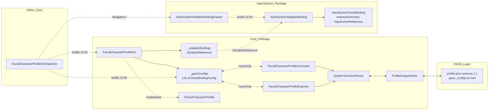
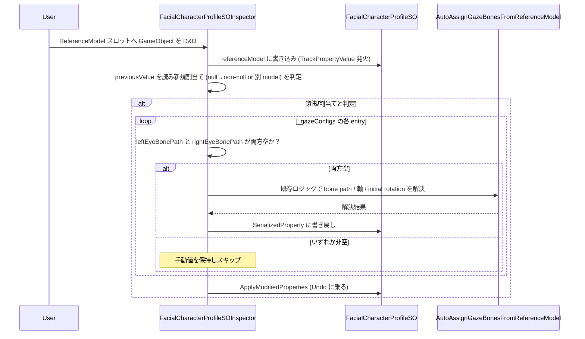
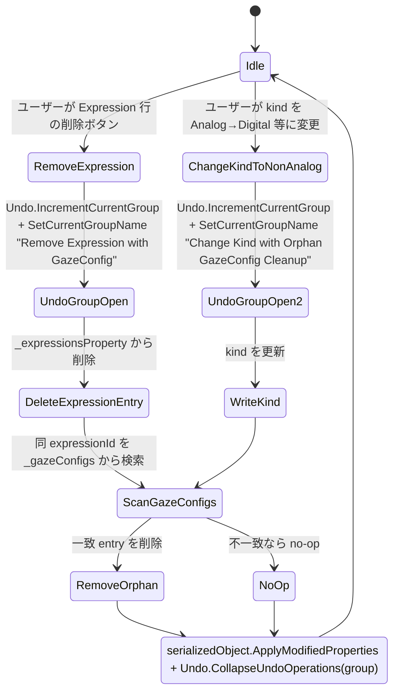
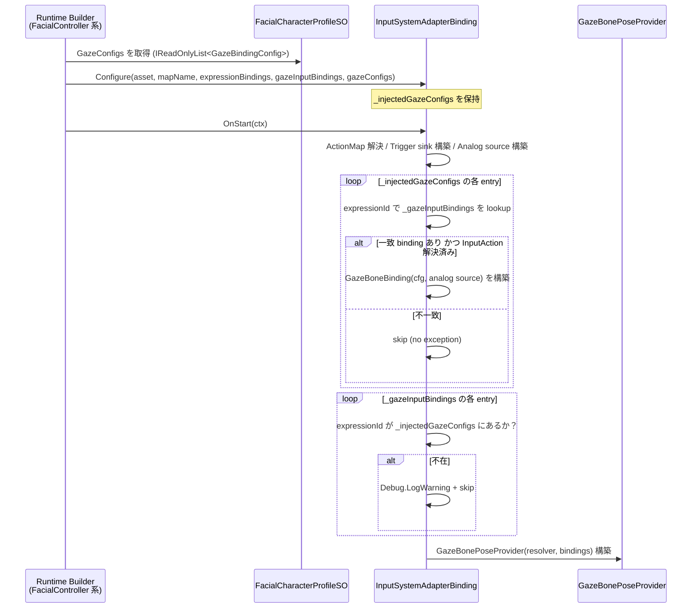
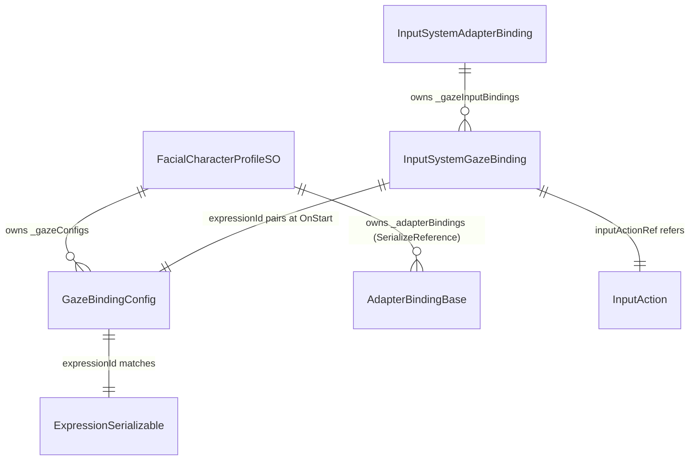
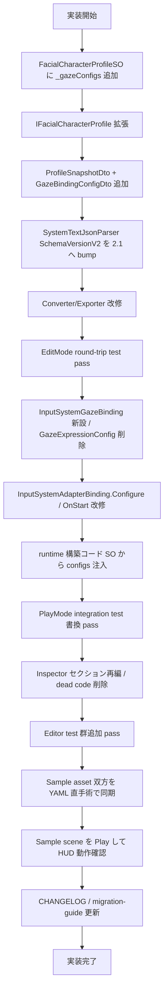

# Technical Design: gaze-config-promotion

## Overview

**Purpose**: 目線（gaze）のキャラ固有設定（左右目ボーンパス・可動範囲・LookXxx Clip）を、入力源（InputSystem / OSC / ARKit）から分離し `FacialCharacterProfileSO` ルートに昇格させる。`InputSystemAdapterBinding` は「どの InputAction でその gaze を駆動するか」だけを保持する薄い結線レイヤに縮退する。

**Users**: Unity エンジニア（本ライブラリ利用者・本リポジトリ開発者）。Inspector で gaze config を opt-in 編集し、JSON にもキャラ固有設定として明示的に表現できる状態が得られる。

**Impact**: SO ルートデータモデル変更 / `profile.json` の `schemaVersion` を `"2.0"` → `"2.1"` に bump（破壊変更、preview 段階のため migration コードは書かない） / `InputSystemAdapterBinding` の API 縮小 / `FacialCharacterProfileSOInspector` のセクション再編とデッドコード削除。Sample asset 2 系統（`Assets/Samples/` と `Samples~/`）を同時手術する。

### Goals

- `FacialCharacterProfileSO` ルート直下に `_gazeConfigs: List<GazeBindingConfig>` を新設し、`IFacialCharacterProfile` から read-only 公開する。
- `InputSystemAdapterBinding` から bone path / look-clip 情報を撤去し、`_gazeInputBindings: List<InputSystemGazeBinding>`（`expressionId` + `InputActionReference`）のみに縮退する。
- `profile.json` の `gaze_configs[]` を root へ移動し、JSON ⇄ SO ラウンドトリップを成立させる。
- Inspector セクション順を「Save Status / 参照モデル / Layers and Expressions / GazeConfigs / Adapter Bindings / Debug」に再編し、GazeConfigs セクションを opt-in UX で提供する。
- Sample asset（dev / UPM 同期）と既存テスト群を新スキーマへ移植する。

### Non-Goals

- `ExpressionKind` に `Vector2` kind を新設しない（Req 12.1）。
- OSC / ARKit native での gaze provider 実装（`IBonePoseSource` 拡張面のみ温存、Req 12.2）。
- BlendShape-only gaze の挙動変更（schema 再配置のみ、Req 12.3）。
- 自動まばたき / 視線追従ターゲット指定（preview.2 以降の別 spec、Req 12.4）。
- bone path の相対化（backlog S-1、Req 12.5）。
- 旧スキーマ JSON の自動 migration コード（Req 2.6）。

## Boundary Commitments

### This Spec Owns

- `FacialCharacterProfileSO._gazeConfigs` field の追加と `IFacialCharacterProfile` 経由での read-only 公開。
- `InputSystemAdapterBinding._gazeConfigs` の撤去と `_gazeInputBindings` 新設、関連 runtime 経路（`OnStart` での pairing / warn / skip）の改修。
- `GazeExpressionConfig` 派生型の削除と新規 `InputSystemGazeBinding`（`expressionId` + `InputActionReference`）の導入。
- `profile.json` の `schemaVersion` `"2.1"` 化と `gaze_configs[]` の root 配置（DTO / Converter / Exporter / Parser 改修）。
- `FacialCharacterProfileSOInspector` のセクション再編、新 `BuildGazeConfigsSection` 実装、孤児削除と参照モデル自動補完、Expression 行 ID 表示撤去 + Debug セクションへの ID マッピング集約、旧 hook (`BuildEyeLookFields` / `BuildGazeClipField` / `OnBuildAnalogExpressionInputSourceFields` / `_gazeConfigsProperty` 等) の削除。
- Sample asset（`Assets/Samples/` と `Samples~/` 双方の `MultiSourceBlendDemoCharacter.asset` と `profile.json`）の新スキーマ手術。
- 既存 EditMode / PlayMode テストの新構造への書き換えと、新規テスト（ラウンドトリップ / Inspector 行為）の追加。
- `CHANGELOG.md` と `Documentation~/migration-guide.md` への破壊変更記録。

### Out of Boundary

- Domain 層（`AdapterBindingBase` / `AdapterBuildContext`）への field 追加・signature 変更は行わない。SO → binding の gaze configs 受け渡しは runtime 構築コード（FacialController 系）の側で行う。
- OSC / ARKit native gaze の実装。インターフェース `IBonePoseSource` の拡張面のみ温存し、駆動本体は別 spec。
- BlendShape-only gaze の runtime 挙動変更。
- 旧 `profile.json`（v2.0）の自動 migration / 互換読み込み。

### Allowed Dependencies

- Core: `FacialCharacterProfileSO`, `GazeBindingConfig`, `IFacialCharacterProfile`, `FacialCharacterProfileConverter`, `FacialCharacterProfileExporter`, `SystemTextJsonParser`, `ProfileSnapshotDto`。
- InputSystem 拡張: `InputSystemAdapterBinding`, `InputSystemAdapterBindingDrawer`, `MultiSourceBlendDemo` Sample 一式。
- Domain: `AdapterBindingBase` / `AdapterBuildContext` を **改変なし** で利用。
- Editor 共通基盤: UI Toolkit、`Undo` API、UnityEditor.SerializedObject。

### Revalidation Triggers

- `AdapterBindingBase.OnStart` signature の今後の変更。
- `IFacialCharacterProfile` interface の追加メソッド要望。
- `profile.json` の更なる schemaVersion bump。
- `GazeBindingConfig` の field 追加（特に runtime に影響する bone 計算系）。
- `InputSystemAdapterBinding` 以外の binding（OSC / ARKit）が gaze 経路を実装し始めたタイミング。

## Architecture

### Existing Architecture Analysis

- 現状: `FacialCharacterProfileSO`（Adapters/ScriptableObject 層）が `[SerializeReference] List<AdapterBindingBase> _adapterBindings` を持ち、`InputSystemAdapterBinding`（InputSystem 層）配下に `_gazeConfigs: List<GazeExpressionConfig>` が格納されている。`GazeExpressionConfig : GazeBindingConfig` は bone path / look-clip + `InputActionReference` を継承構造で混載している。
- 問題: キャラ固有データ（bone path / 可動範囲 / look-clip）と入力源（`InputActionReference`）が同一クラスに混在し、入力源を増やすと派生クラスの増殖が起きる。Inspector も「Expression 行内に Eye/Look フィールドを混入」させる構造で、Analog kind 切り替えで暗黙的に GazeConfig が生成される問題があった。
- 改修方針: SO ルートに `_gazeConfigs` を昇格させ、`InputSystemAdapterBinding` は `expressionId` + `InputActionReference` のみを持つ薄い結線（`InputSystemGazeBinding`）に縮退する。継承構造はフラット化（派生型 `GazeExpressionConfig` 削除）。

### Architecture Pattern & Boundary Map



**Architecture Integration**:

- Selected pattern: 既存のクリーンアーキテクチャ（Domain → Application → Adapters → Editor）を維持。本 spec は Adapters / Editor 層の局所的なデータ移動 + UI 再構成。
- Domain/feature boundaries: gaze の「キャラ固有データ」は SO ルートの責務、「入力源結線」は InputSystem 層の binding 責務。OSC / ARKit native は将来 binding を新設するだけで SO ルート `_gazeConfigs` を再利用できる。
- Existing patterns preserved: `[SerializeReference]` polymorphic adapter binding、UI Toolkit Inspector、JSON ファースト永続化、TDD（Red-Green-Refactor）、自動保存（profile.json）。
- New components rationale:
  - `InputSystemGazeBinding`: `_gazeInputBindings` 配列の要素となる薄い `[Serializable]` クラス。`expressionId` + `InputActionReference` のみ。
  - `BuildGazeConfigsSection`: Inspector の新セクション（Req 4 / 5 / 6 / 7）。
- Steering compliance: `AdapterBindingBase` / `AdapterBuildContext`（Domain 層）は無改修。Editor は UI Toolkit 維持。エラーハンドリングは Unity 標準 `Debug.LogWarning` のみ。

### Technology Stack

| Layer | Choice / Version | Role in Feature | Notes |
|-------|------------------|-----------------|-------|
| Frontend / CLI | UI Toolkit (Unity 6) | Inspector セクション再編、GazeConfigs UX | IMGUI 不使用、`PropertyField` / `ListView` / `Foldout` / `DropdownField` / `Button` で組む |
| Backend / Services | C# (Unity 6 同梱 Roslyn) | SO / binding / Converter / Exporter | 既存 asmdef 階層を維持 |
| Data / Storage | JSON（`JsonUtility` ベース）| `profile.json` schema v2.1 | `SystemTextJsonParser.SchemaVersionV2 = "2.1"` に bump、strict 検証 |
| Messaging / Events | Unity SerializedObject / `TrackPropertyValue` | 参照モデル変更検知、自動補完 | UI Toolkit binding 標準 |
| Infrastructure / Runtime | Unity 6000.3.2f1 + InputSystem 1.17.0 | runtime gaze 結線（既存） | `_gazeBoneProvider` の構築入力が `_gazeConfigs` から SO ルート参照に変わるのみ |

詳細トレードオフは `research.md` の Architecture Pattern Evaluation 参照。

## File Structure Plan

### Directory Structure（変更箇所のみ列挙）

```
FacialControl/
├── Packages/
│   ├── com.hidano.facialcontrol/
│   │   ├── Runtime/
│   │   │   └── Adapters/
│   │   │       ├── ScriptableObject/
│   │   │       │   ├── FacialCharacterProfileSO.cs            # _gazeConfigs 追加
│   │   │       │   ├── GazeBindingConfig.cs                   # 既存利用、変更なし
│   │   │       │   └── Serializable/
│   │   │       │       ├── IFacialCharacterProfile.cs         # GazeConfigs read-only accessor 追加
│   │   │       │       └── FacialCharacterProfileConverter.cs # gaze_configs 変換追加
│   │   │       └── Json/
│   │   │           ├── SystemTextJsonParser.cs                # SchemaVersionV2 を "2.1" に bump
│   │   │           └── Dto/
│   │   │               ├── ProfileSnapshotDto.cs              # gazeConfigs フィールド追加
│   │   │               └── GazeBindingConfigDto.cs            # 新規（DTO）
│   │   ├── Editor/
│   │   │   ├── AutoExport/
│   │   │   │   └── FacialCharacterProfileExporter.cs          # gazeConfigs 出力追加
│   │   │   └── Inspector/
│   │   │       └── FacialCharacterProfileSOInspector.cs       # セクション再編 / 新規 BuildGazeConfigsSection / dead code 削除
│   │   ├── Documentation~/migration-guide.md                  # 新スキーマ hand-edit 手順を追記
│   │   └── CHANGELOG.md                                       # Breaking change エントリ追加
│   │
│   └── com.hidano.facialcontrol.inputsystem/
│       ├── Runtime/Adapters/
│       │   ├── AdapterBindings/InputSystemAdapterBinding.cs   # _gazeConfigs 撤去 / _gazeInputBindings 追加 / Configure 拡張 / OnStart 改修
│       │   └── ScriptableObject/
│       │       ├── GazeExpressionConfig.cs                    # 削除
│       │       └── InputSystemGazeBinding.cs                  # 新規 ([Serializable] expressionId + InputActionReference)
│       ├── Editor/
│       │   └── AdapterBindings/InputSystemAdapterBindingDrawer.cs # _gazeConfigs UI 削除 / _gazeInputBindings UI 追加
│       └── Samples~/MultiSourceBlendDemo/
│           ├── MultiSourceBlendDemoCharacter.asset            # 新スキーマ YAML 手術
│           └── StreamingAssets/.../profile.json               # gaze_configs[] root 配置 + schemaVersion "2.1"
│
├── Assets/Samples/FacialControl InputSystem/0.1.0-preview.2/Multi Source Blend Demo/
│   ├── MultiSourceBlendDemoCharacter.asset                    # 新スキーマ YAML 手術（Samples~ と同期）
│   └── StreamingAssets/.../profile.json                       # 同上、JSON 同期
│
└── Tests/（パッケージ内 Tests/ 配下）
    ├── EditMode（com.hidano.facialcontrol）
    │   ├── FacialCharacterProfileSO_GazeConfigsRoundTripTests.cs    # 新規
    │   ├── FacialCharacterProfileConverter_GazeConfigsTests.cs       # 新規
    │   ├── FacialCharacterProfileExporter_GazeConfigsTests.cs        # 新規
    │   └── Editor/Inspector/FacialCharacterProfileSOInspector_GazeConfigsTests.cs  # 新規（opt-in UX / 孤児削除 / 自動補完 / 一括再解決）
    └── PlayMode（com.hidano.facialcontrol.inputsystem）
        └── Integration/InputSystemAdapterBindingIntegrationTests.cs  # OnStart_GazePath_* を新構造で書き換え
```

### Modified Files

- `FacialCharacterProfileSO.cs` — `[SerializeField] List<GazeBindingConfig> _gazeConfigs = new()` 追加 + `public IReadOnlyList<GazeBindingConfig> GazeConfigs => _gazeConfigs;`。
- `IFacialCharacterProfile.cs` — `IReadOnlyList<GazeBindingConfig> GazeConfigs { get; }` を追加。
- `InputSystemAdapterBinding.cs` — `_gazeConfigs` 撤去、`_gazeInputBindings: List<InputSystemGazeBinding>` 追加、`[NonSerialized] IReadOnlyList<GazeBindingConfig> _injectedGazeConfigs` 追加、`Configure` 引数変更、`OnStart` 内で SO 由来 gaze configs と `_gazeInputBindings` を expressionId で pairing。
- `InputSystemAdapterBindingDrawer.cs` — `_gazeConfigs` 描画削除、`_gazeInputBindings` の薄い UI 追加（`expressionId` プルダウン + `InputActionReference`）。
- `FacialCharacterProfileSOInspector.cs` — `CreateInspectorGUI` のセクション build 順を変更、`BuildGazeConfigsSection` 新設、`_gazeConfigsProperty` / `BuildEyeLookFields` / `BuildGazeClipField` / `OnBuildAnalogExpressionInputSourceFields` / `AppendGazeConfigForExpression` / `RemoveGazeConfigByExpressionId` / `FindGazeConfigIndexByExpressionId` / `HasGazeConfigForExpression` / `ExpressionRowGazeXxx` 名前定数を削除（または gaze 用途は新セクションでのみ参照）。`AutoAssignGazeBonesFromReferenceModel` ロジックは新セクションで再利用。
- `FacialCharacterProfileConverter.cs` — `ToFacialProfile` シグネチャに `gazeConfigs` を追加（または別 helper メソッド）。SO → Domain 変換は本 spec ではコア Domain 改変なし、JSON ↔ SO 変換のみ拡張。
- `FacialCharacterProfileExporter.cs` — `BuildProfileSnapshotDto` で `_gazeConfigs` を `gazeConfigs` DTO list に詰める。
- `SystemTextJsonParser.cs` — `SchemaVersionV2 = "2.1"`、`ProfileSnapshotDto` の `gazeConfigs` を読み書き、strict 検証。
- `ProfileSnapshotDto.cs` — `public List<GazeBindingConfigDto> gazeConfigs;` 追加。
- 各 Sample asset / profile.json — 新スキーマへ手術（Samples~ と Assets/Samples 双方）。
- `CHANGELOG.md` / `migration-guide.md` — 破壊変更記録。

## System Flows

### Flow 1: 初回 reference model 割当て時の自動補完



Key Decisions:
- 「両方空」のときのみ補完（手動値温存、Req 6.1 / 6.2）。
- 単行ボタン「参照モデルから自動設定」と「全 GazeConfig を再解決」ボタンは無条件で上書き（Req 6.3 / 6.5）。

### Flow 2: 孤児 GazeConfig の自動削除（Expression 削除と Analog→Digital 変換）



Key Decisions:
- Undo group で 1 ユーザー操作 = 1 Undo step（Req 7.3）。
- 自動削除トリガーは (a) ユーザー明示削除 / (b) Expression 削除 / (c) Analog→Digital 変換 のみ（Req 7.4）。

### Flow 3: runtime OnStart の gaze pairing



Key Decisions:
- SO → binding 注入は runtime 構築コードの責務（Domain 純度維持、`research.md` Decision 3）。
- 不一致は warn + skip（Req 1.6 / 10.3 / 10.4）、例外は投げない。
- gaze 関連 field は binding 自身に持たず必ず SO ルート由来（Req 10.5）。

## Requirements Traceability

| Requirement | Summary | Components | Interfaces | Flows |
|-------------|---------|------------|------------|-------|
| 1.1 | SO ルート `_gazeConfigs` field 公開 | FacialCharacterProfileSO | `[SerializeField] List<GazeBindingConfig>` | — |
| 1.2 | `IFacialCharacterProfile` から read-only 公開 | IFacialCharacterProfile / FacialCharacterProfileSO | `IReadOnlyList<GazeBindingConfig> GazeConfigs { get; }` | — |
| 1.3 | binding から `_gazeConfigs` 撤去 | InputSystemAdapterBinding | フィールド削除 | — |
| 1.4 | binding に `_gazeInputBindings` 新設 | InputSystemAdapterBinding / InputSystemGazeBinding | `[SerializeField] List<InputSystemGazeBinding>` | — |
| 1.5 | OnStart で SO 由来 configs と pairing | InputSystemAdapterBinding | `OnStart(in AdapterBuildContext)` | Flow 3 |
| 1.6 | 不一致 binding は warn + skip | InputSystemAdapterBinding | `Debug.LogWarning` | Flow 3 |
| 1.7 | core `GazeBindingConfig` を再利用 | GazeBindingConfig | （変更なし） | — |
| 1.8 | `GazeExpressionConfig` 派生型を削除 | （削除） | — | — |
| 2.1 | `gaze_configs[]` を JSON root に移動 | ProfileSnapshotDto / GazeBindingConfigDto | `public List<GazeBindingConfigDto> gazeConfigs` | — |
| 2.2 | schemaVersion bump | SystemTextJsonParser | `SchemaVersionV2 = "2.1"` | — |
| 2.3 | Converter で root → SO ルート | FacialCharacterProfileConverter | 変換ロジック追加 | — |
| 2.4 | Exporter で SO ルート → root | FacialCharacterProfileExporter | `BuildProfileSnapshotDto` 改修 | — |
| 2.5 | ラウンドトリップ value-equal | FacialCharacterProfileConverter / Exporter / Tests | EditMode test | — |
| 2.6 | 自動 migration コード禁止 | （実装方針） | — | — |
| 2.7 | CHANGELOG 記録 | CHANGELOG.md | — | — |
| 2.8 | migration-guide 記述 | Documentation~/migration-guide.md | — | — |
| 3.1 | Sample asset YAML 手術 | MultiSourceBlendDemoCharacter.asset (×2) | YAML 直手術 | — |
| 3.2 | Sample profile.json 更新 | profile.json (×2) | schemaVersion "2.1" + gaze_configs[] | — |
| 3.3 | Samples~ と Assets/Samples 同期 | （二重管理ファイル） | — | — |
| 3.4 | scene Play で warn なし | Sample scene / HUD | — | （手動目視） |
| 3.5 | demo binding に `_gazeInputBindings` を持つ | MultiSourceBlendDemoCharacter.asset | YAML 直手術 | — |
| 4.1 | Inspector セクション順再編 | FacialCharacterProfileSOInspector | `CreateInspectorGUI` 改修 | — |
| 4.2 | 各セクションを foldout / labeled container | FacialCharacterProfileSOInspector | `MakeSectionFoldout` 利用 | — |
| 4.3 | Save Status Bar は最上段固定 | FacialCharacterProfileSOInspector | （既存維持） | — |
| 4.4 | Adapter Bindings は GazeConfigs の後 | FacialCharacterProfileSOInspector | build 順制御 | — |
| 5.1 | `+ GazeConfig を追加` ドロップダウン | FacialCharacterProfileSOInspector | `BuildGazeConfigsSection` | — |
| 5.2 | 選択時に `_gazeConfigs` へ append | FacialCharacterProfileSOInspector | `AppendNewGazeConfig(expressionId)` | — |
| 5.3 | 候補 0 件は disabled | FacialCharacterProfileSOInspector | UI 状態制御 | — |
| 5.4 | Analog 化に伴う自動生成しない | FacialCharacterProfileSOInspector | （旧 hook 削除） | — |
| 5.5 | 行内に最低限の編集 UI | FacialCharacterProfileSOInspector | `BuildGazeConfigRow` | — |
| 5.6 | 行の remove ボタン | FacialCharacterProfileSOInspector | `RemoveGazeConfigAt(int)` | — |
| 5.7 | Expression 行に GazeConfig 編集を持たない | FacialCharacterProfileSOInspector | （旧 `BuildEyeLookFields` 削除） | — |
| 6.1 | refModel 割当てで両方空のみ補完 | FacialCharacterProfileSOInspector | `TrackPropertyValue` callback | Flow 1 |
| 6.2 | 非空値の上書き禁止 | FacialCharacterProfileSOInspector | 条件分岐 | Flow 1 |
| 6.3 | 行ボタンは上書き再解決 | FacialCharacterProfileSOInspector | `OnRowReassignClicked` | — |
| 6.4 | 一括再解決ボタン | FacialCharacterProfileSOInspector | `BuildBulkReassignButton` | — |
| 6.5 | 一括ボタンで全件上書き | FacialCharacterProfileSOInspector | `OnBulkReassignClicked` | — |
| 6.6 | refModel 未割当てなら disabled | FacialCharacterProfileSOInspector | UI 状態制御 | — |
| 6.7 | 既存 helper 再利用 | FacialCharacterProfileSOInspector | `AutoAssignGazeBonesFromReferenceModel` | — |
| 7.1 | Expression 削除で同 id GazeConfig 削除 | FacialCharacterProfileSOInspector | `RemoveExpression(int)` 拡張 | Flow 2 |
| 7.2 | Analog→非 Analog で同 id GazeConfig 削除 | FacialCharacterProfileSOInspector | kind 変更コールバック | Flow 2 |
| 7.3 | 同 SerializedObject/Undo パイプライン | FacialCharacterProfileSOInspector | `Undo.IncrementCurrentGroup` / `CollapseUndoOperations` | Flow 2 |
| 7.4 | 削除トリガーは 3 種に限定 | FacialCharacterProfileSOInspector | （実装方針） | Flow 2 |
| 8.1 | Expression 行の id 表示削除 | FacialCharacterProfileSOInspector | `ExpressionRowIdLabelName` 削除 | — |
| 8.2 | Debug セクションに ID マッピング | FacialCharacterProfileSOInspector | `BuildDebugSection` 拡張 | — |
| 8.3 | 追加で次回 repaint に反映 | FacialCharacterProfileSOInspector | `TrackSerializedObjectValue` | — |
| 8.4 | 編集で次回 repaint に反映 | FacialCharacterProfileSOInspector | 同上 | — |
| 9.1 | `_gazeConfigsProperty` 削除 | FacialCharacterProfileSOInspector | （field 削除） | — |
| 9.2 | 旧 helper メソッド群削除 | FacialCharacterProfileSOInspector | （メソッド削除） | — |
| 9.3 | Eye/Look 関連 hook 削除 | FacialCharacterProfileSOInspector | （メソッド削除） | — |
| 9.4 | 同等動作は新名で再実装 | FacialCharacterProfileSOInspector | `AppendNewGazeConfig` 等 | — |
| 9.5 | 標準 asmdef でコンパイル | （asmdef） | — | — |
| 10.1 | OnStart で expressionId pairing | InputSystemAdapterBinding | `OnStart` | Flow 3 |
| 10.2 | 一致時に provider を構築 | InputSystemAdapterBinding | `BuildGazeProvider` | Flow 3 |
| 10.3 | binding 不在の config は skip | InputSystemAdapterBinding | 条件分岐 | Flow 3 |
| 10.4 | config 不在の binding は warn + skip | InputSystemAdapterBinding | `Debug.LogWarning` | Flow 3 |
| 10.5 | binding 自身に gaze field を持たない | InputSystemAdapterBinding | （field 撤去） | — |
| 10.6 | `IBonePoseSource` 契約の温存 | （既存型） | — | — |
| 11.1 | EditMode ラウンドトリップ test | FacialCharacterProfileSO_GazeConfigsRoundTripTests | EditMode test | — |
| 11.2 | Converter test | FacialCharacterProfileConverter_GazeConfigsTests | EditMode test | — |
| 11.3 | Exporter test | FacialCharacterProfileExporter_GazeConfigsTests | EditMode test | — |
| 11.4 | Inspector test 群 | FacialCharacterProfileSOInspector_GazeConfigsTests | EditMode test | — |
| 11.5 | PlayMode integration test 書き換え | InputSystemAdapterBindingIntegrationTests | PlayMode test | — |
| 11.6 | 旧構造参照テストの削除/更新 | （該当テスト） | — | — |
| 11.7 | TDD Red→Green→Refactor | （実装方針） | — | — |
| 12.1〜12.6 | スコープ外事項 | （実装方針） | — | — |

## Components and Interfaces

### Summary

| Component | Domain/Layer | Intent | Req Coverage | Key Dependencies (P0/P1) | Contracts |
|-----------|--------------|--------|--------------|--------------------------|-----------|
| FacialCharacterProfileSO | Adapters/SO | キャラ固有データの SO ルート保持。`_gazeConfigs` を新設。 | 1.1, 1.2, 1.7 | GazeBindingConfig (P0), IFacialCharacterProfile (P0) | State |
| IFacialCharacterProfile | Adapters/SO | gaze 公開のため `GazeConfigs` accessor を追加 | 1.2 | GazeBindingConfig (P0) | Service |
| GazeBindingConfig | Adapters/SO | bone path / 範囲 / look-clip / sample データの値クラス（既存、無変更） | 1.7 | UnityEngine.AnimationClip (P0) | State |
| InputSystemGazeBinding | InputSystem/Adapters | `expressionId` + `InputActionReference` の薄い結線（新規） | 1.4, 1.8 | UnityEngine.InputSystem.InputActionReference (P0) | State |
| InputSystemAdapterBinding | InputSystem/Adapters | OnStart 内で SO 由来 configs と `_gazeInputBindings` を pairing | 1.3, 1.5, 1.6, 10.1〜10.6 | InputSystemGazeBinding (P0), GazeBindingConfig (P0), AdapterBuildContext (P0) | Service |
| FacialCharacterProfileConverter | Adapters/SO/Serializable | JSON root `gaze_configs[]` → SO `_gazeConfigs` | 2.3, 2.5 | ProfileSnapshotDto (P0), GazeBindingConfig (P0) | Service |
| FacialCharacterProfileExporter | Editor/AutoExport | SO `_gazeConfigs` → JSON root `gaze_configs[]` | 2.4, 2.5 | ProfileSnapshotDto (P0), GazeBindingConfig (P0) | Service |
| SystemTextJsonParser | Adapters/Json | schemaVersion `"2.1"` を strict 検証 | 2.1, 2.2 | ProfileSnapshotDto (P0) | Service |
| ProfileSnapshotDto | Adapters/Json/Dto | `gazeConfigs` field 追加 | 2.1 | GazeBindingConfigDto (P0) | State |
| GazeBindingConfigDto | Adapters/Json/Dto | JSON ↔ SO 値の中間 DTO（新規） | 2.1, 2.3, 2.4 | （JsonUtility 互換 plain class） | State |
| FacialCharacterProfileSOInspector | Editor/Inspector | UI セクション再編 / 新 GazeConfigs セクション / dead code 削除 / Debug ID マッピング | 4.1〜4.4, 5.1〜5.7, 6.1〜6.7, 7.1〜7.4, 8.1〜8.4, 9.1〜9.5 | UnityEditor + UI Toolkit (P0), Undo API (P0), AutoAssignGazeBonesFromReferenceModel (P0) | Service / State |
| InputSystemAdapterBindingDrawer | InputSystem/Editor | binding 行内 UI から `_gazeConfigs` 描画削除、`_gazeInputBindings` 軽量 UI 追加 | 1.4, 1.8 | UI Toolkit (P0) | Service |

### Adapters / ScriptableObject 層

#### FacialCharacterProfileSO

| Field | Detail |
|-------|--------|
| Intent | キャラ固有データ（layers / expressions / rendererPaths / adapterBindings + 新 gazeConfigs）を SO ルートで保持 |
| Requirements | 1.1, 1.2, 1.7 |

**Responsibilities & Constraints**

- 既存 `[SerializeReference] _adapterBindings` 構造に副作用を出さず、平坦 `[SerializeField]` で `_gazeConfigs` を追加する。
- `IFacialCharacterProfile.GazeConfigs` から read-only 公開する。
- runtime の build context は本 SO を所有する FacialController が読み取り、binding に注入する。

**Dependencies**

- Outbound: `GazeBindingConfig` (Adapters/SO) — 値クラス参照（P0）
- Inbound: `IFacialCharacterProfile` interface 実装（P0）、Inspector / Converter / Exporter から read（P0）

**Contracts**: State [x]

##### State Management

- 新規 field: `[SerializeField] protected List<GazeBindingConfig> _gazeConfigs = new();`
- 公開アクセサ: `public IReadOnlyList<GazeBindingConfig> GazeConfigs => _gazeConfigs;`
- mutate は Editor のみ（Inspector / Importer 経由）。runtime は read のみ。

**Implementation Notes**

- Integration: `BuildFallbackProfile` は本 spec で挙動変更なし（Domain `FacialProfile` には gaze は載せない、Req 12.3）。
- Validation: 空リスト許容。`expressionId` 未設定 entry は runtime でも warn + skip 経路に乗る。
- Risks: 既存 SO アセットを Unity に再シリアライズさせる必要がある（Sample asset 手術 + EditorUtility.SetDirty 経由）。

#### IFacialCharacterProfile（accessor 追加）

```csharp
public interface IFacialCharacterProfile
{
    string CharacterAssetName { get; }
    FacialProfile BuildFallbackProfile();

    // 追加
    IReadOnlyList<GazeBindingConfig> GazeConfigs { get; }
}
```

- Preconditions: 実装側で空 list を null 化しない（`new List<GazeBindingConfig>()` を初期値）。
- Postconditions: 戻り値は read-only。

#### GazeBindingConfig（既存・変更なし）

- 既存 fields（`expressionId`, `leftEyeBonePath`, `rightEyeBonePath`, 範囲, lookXxxClip, lookXxxSamples 等）をそのまま再利用。
- 派生型 `GazeExpressionConfig` は削除（Req 1.8）。本クラスは `[Serializable]` 値クラスとして JSON ↔ SO で共通使用。

### InputSystem 層

#### InputSystemGazeBinding（新規）

| Field | Detail |
|-------|--------|
| Intent | 「どの InputAction でどの gaze (expressionId) を駆動するか」のみを保持する薄い結線 |
| Requirements | 1.4, 1.8 |

```csharp
[Serializable]
public sealed class InputSystemGazeBinding
{
    [Tooltip("対応する SO ルート _gazeConfigs の expressionId と一致する必要がある。")]
    public string expressionId;

    [Tooltip("Vector2 入力 (joystick 等) を提供する InputAction 参照。expectedControlType=Vector2 を推奨。")]
    public InputActionReference inputActionRef;
}
```

**Responsibilities & Constraints**

- 値クラスのみ。bone path / 可動範囲 / look-clip 等は持たない。
- `expressionId` で SO ルート `_gazeConfigs` のエントリと結びつく。

#### InputSystemAdapterBinding

| Field | Detail |
|-------|--------|
| Intent | InputSystem 経由の Trigger / Analog / Gaze 結線。本 spec で gaze 関連 field を縮退 |
| Requirements | 1.3, 1.4, 1.5, 1.6, 10.1〜10.6 |

**Responsibilities & Constraints**

- `_gazeConfigs` を撤去（Req 1.3）。
- 新 fields:
  - `[SerializeField] List<InputSystemGazeBinding> _gazeInputBindings = new();`
  - `[NonSerialized] IReadOnlyList<GazeBindingConfig> _injectedGazeConfigs;`（runtime 注入用、シリアライズ対象外）
- `Configure(InputActionAsset asset, string actionMapName, IReadOnlyList<ExpressionBindingEntry> expressionBindings, IReadOnlyList<InputSystemGazeBinding> gazeInputBindings, IReadOnlyList<GazeBindingConfig> injectedGazeConfigs)` のシグネチャに変更。
- `OnStart(in AdapterBuildContext ctx)` は Domain の signature を保ったまま、内部で `_injectedGazeConfigs` と `_gazeInputBindings` を expressionId で pairing して `GazeBoneBinding` 群を構築（Flow 3）。
- gaze 関連 field を binding 自身に持たない（Req 10.5）。

**Dependencies**

- Inbound: runtime builder（FacialController 系）からの Configure 呼び出し（P0）。Inspector / drawer 経由のシリアライズ（P0）。
- Outbound: `GazeBoneBinding` / `GazeBonePoseProvider`（既存）（P0）。`InputActionReference`（External / P0）。

**Contracts**: Service [x] / State [x]

##### Service Interface（要点）

```csharp
public sealed class InputSystemAdapterBinding : AdapterBindingBase
{
    public void Configure(
        InputActionAsset asset,
        string actionMapName,
        IReadOnlyList<ExpressionBindingEntry> expressionBindings,
        IReadOnlyList<InputSystemGazeBinding> gazeInputBindings = null,
        IReadOnlyList<GazeBindingConfig> injectedGazeConfigs = null);

    public override void OnStart(in AdapterBuildContext ctx);
    public override void OnLateTick(float deltaTime);
    public override void Dispose();
}
```

- Preconditions:
  - `Configure` の `injectedGazeConfigs` は runtime（FacialController）が SO から取得して渡す。Editor の dev/test では明示注入。
  - `OnStart` 時に `_injectedGazeConfigs` が null なら gaze 経路を skip（既存 `_gazeConfigs == null` ガードと同様）。
- Postconditions:
  - 一致 binding が見つかれば `_gazeBoneProvider` 構築（Req 10.2）。
  - 不一致 binding は `Debug.LogWarning` で warn + skip（Req 10.4）。
  - 不一致 config は silent skip（Req 10.3）。
- Invariants: `_isStarted == true` 後は `_gazeInputBindings` を mutate しない。

**Implementation Notes**

- Integration: runtime builder（FacialController 系）が SO から `_gazeConfigs` を取得し `Configure` で binding に注入する 1 行を追加する。
- Validation: PlayMode integration test で expressionId 一致 / 不一致 / 空 list の 3 ケースを確認。
- Risks: runtime builder 側の漏れで gaze が動かなくなる可能性。テストで E2E ガード。

#### InputSystemAdapterBindingDrawer

- `_gazeConfigs` の inline UI 描画を削除し、代わりに `_gazeInputBindings` の薄い UI（`expressionId` + `inputActionRef`）を ListView で描画する。
- `expressionId` ドロップダウンは SO ルートの `_gazeConfigs` 由来 candidate を提示するか、freetext 入力にするかは UX 判断ポイント。最低限は freetext + tooltip で `_gazeConfigs.expressionId` と一致させる旨を案内する（Inspector ダイレクト編集の頻度が低いため）。
- Slug / InputActionAsset / ActionMapName / ExpressionBindings の既存 UI は変更なし。

### Editor / Inspector

#### FacialCharacterProfileSOInspector

| Field | Detail |
|-------|--------|
| Intent | UI Toolkit Inspector のセクション再編、新 GazeConfigs セクション、孤児削除、Debug ID マッピング |
| Requirements | 4.1〜4.4, 5.1〜5.7, 6.1〜6.7, 7.1〜7.4, 8.1〜8.4, 9.1〜9.5 |

**Responsibilities & Constraints**

- セクション build 順を以下に変更（Req 4.1）:
  1. Save Status Bar（最上段固定、Req 4.3）
  2. Reference Model
  3. Layers and Expressions
  4. **GazeConfigs（新）**
  5. Adapter Bindings
  6. Debug
- 新規メソッド `BuildGazeConfigsSection(VisualElement root)` を追加（Req 5.1〜5.7, 6.4, 6.5）。
- 既存 dead code を削除（Req 9.1〜9.4）:
  - `_gazeConfigsProperty` field
  - `AppendGazeConfigForExpression` / `RemoveGazeConfigByExpressionId` / `FindGazeConfigIndexByExpressionId` / `HasGazeConfigForExpression`
  - `BuildEyeLookFields` / `BuildGazeClipField`
  - `OnBuildAnalogExpressionInputSourceFields` 仮想 hook（呼び出し元と override 双方を削除）
  - `ExpressionRowGazeXxx` 名前定数（Expression 行で使われていたもの）
  - `ExpressionRowIdLabelName` を Expression 行の表示から除く（Req 8.1）
- 新規実装の名称（Req 9.4 に従い旧名再利用しない）:
  - `AppendNewGazeConfig(string expressionId)`
  - `RemoveGazeConfigAt(int index)`
  - `RemoveGazeConfigsByExpressionId(string expressionId)`（孤児削除専用、Req 7.1 / 7.2）
  - `BuildGazeConfigsSection(VisualElement root)` / `BuildGazeConfigRow(int index)` / `BuildBulkReassignButton(VisualElement root)` / `BuildAddGazeConfigDropdown(VisualElement root)`
  - `RebuildExpressionIdMapping()`（Debug セクション）
- `_referenceModelProperty.TrackPropertyValue` で参照モデル変更を検出し、新規割当て遷移時に `OnReferenceModelAutoFill()` を呼び出す（Req 6.1, Flow 1）。
- 孤児削除は Undo group で集約（Req 7.3, Flow 2）:
  ```csharp
  Undo.IncrementCurrentGroup();
  Undo.SetCurrentGroupName("Remove Expression with GazeConfig");
  int group = Undo.GetCurrentGroup();
  // ... mutate ...
  serializedObject.ApplyModifiedProperties();
  Undo.CollapseUndoOperations(group);
  ```
- Debug セクションには「Expression ID マッピング」一覧を追加（Req 8.2〜8.4）。各行は `name / expressionId / kind / layer` の 4 列。`TrackSerializedObjectValue` 側で Expression 配列が変化したら repaint。

**Dependencies**

- Inbound: Unity Editor が `[CustomEditor(typeof(FacialCharacterProfileSO), editorForChildClasses: true)]` 経由で本 Inspector を起動（P0）。
- Outbound: `AutoAssignGazeBonesFromReferenceModel`（既存ヘルパー、再利用 / Req 6.7、P0）, `Undo` API（P0）, `serializedObject.ApplyModifiedProperties`（P0）。

**Contracts**: Service [x] / State [x]

##### State Management

- `_gazeConfigsProperty`（旧）の代わりに `_rootGazeConfigsProperty = serializedObject.FindProperty("_gazeConfigs")` を解決。
- `_lastReferenceModel: GameObject` を `[NonSerialized]` で保持し、TrackPropertyValue callback で previousValue 比較。

**Implementation Notes**

- Integration: 既存の自動保存（`OnSerializedObjectChanged` → delayCall → `FlushAutoExport`）はそのまま動作。`_gazeConfigs` 変更も自動保存に乗る。
- Validation:
  - opt-in dropdown 候補は「kind=Analog かつ `_gazeConfigs.expressionId` に未存在」で動的生成（Req 5.1）。0 件なら disabled（Req 5.3）。
  - 単行ボタン / 一括ボタンは `_referenceModel` 未割当て時に disabled（Req 6.6）。
- Risks: Inspector の rebuild と TrackPropertyValue の重複発火に注意。既存 `RebuildLayersUI` 方式を参考に局所的に rebuild する。

### JSON / DTO 層

#### ProfileSnapshotDto（拡張）

```csharp
[System.Serializable]
public sealed class ProfileSnapshotDto
{
    public string schemaVersion;                       // "2.1"
    public List<LayerDefinitionDto> layers;
    public List<ExpressionDto> expressions;
    public List<string> rendererPaths;
    public List<GazeBindingConfigDto> gazeConfigs;     // 追加
}
```

- schemaVersion `"2.1"` を strict 検証（`SystemTextJsonParser`）。
- `gazeConfigs` は空 / null 許容。

#### GazeBindingConfigDto（新規）

`GazeBindingConfig` を JsonUtility 互換 DTO 化。フィールド名は SO の値クラスと 1:1 対応。`AnimationClip` は AssetReference 化が困難なため、JSON 表現では「現状の `_gazeConfigs` の clip ↔ SO の `lookXxxClip` の整合は AssetDatabase 経由で SO 側 source-of-truth とする」運用に倣い、**JSON では look-clip 参照名（path / GUID）は出力せず、`lookXxxSamples` 配列のみ永続化**する。

> 設計判断: 既存 `FacialCharacterProfileExporter` も AnimationClip を直接 JSON に書かず、SO 側の `_gazeConfigs[i].lookXxxClip` への AssetReference は SO YAML に残す形を踏襲する。`lookXxxSamples` は Editor 時にベイクされた `GazeBlendShapeSampleEntry` を JSON にも書き出すが、これは preview 段階で動作不要なため optional（最小実装では SO YAML のみで十分）。本 spec では `lookXxxSamples` は JSON 出力対象外とし、SO YAML のみで保持する。

```csharp
[System.Serializable]
public sealed class GazeBindingConfigDto
{
    public string expressionId;

    public string leftEyeBonePath;
    public Vector3 leftEyeInitialRotation;
    public Vector3 leftEyeYawAxisLocal;
    public Vector3 leftEyePitchAxisLocal;

    public string rightEyeBonePath;
    public Vector3 rightEyeInitialRotation;
    public Vector3 rightEyeYawAxisLocal;
    public Vector3 rightEyePitchAxisLocal;

    public float lookUpAngle;
    public float lookDownAngle;
    public float outerYawAngle;
    public float innerYawAngle;

    // AnimationClip / lookXxxSamples は SO YAML 側 source-of-truth、JSON 出力対象外（preview 範囲）
}
```

#### SystemTextJsonParser（変更点）

- `public const string SchemaVersionV2 = "2.1";`（旧 `"2.0"` を上書き）
- `ParseProfileSnapshotV2` の strict 検証は `SchemaVersionV2` 参照を維持（自動的に `"2.1"` 要求になる）。
- DTO の `gazeConfigs` 読み書きは JsonUtility 経由で自動。空時は空 list を返す。

#### FacialCharacterProfileConverter（変更点）

- 既存 `ToFacialProfile` は Domain `FacialProfile` 構築のため、本 spec では gaze は **Domain には載せない**（Req 12.3 に従い runtime BlendShape-only gaze の挙動変更を避ける）。
- 新規メソッド: `public static List<GazeBindingConfig> ToSORootGazeConfigs(IReadOnlyList<GazeBindingConfigDto> dtoList)` を追加。SO ルート `_gazeConfigs` への JSON → SO 反映用。
- もしくは `FacialCharacterProfileSO` の Importer 系（StreamingAssets 読み込み）でこのメソッドを呼び出して SO field を埋める。

#### FacialCharacterProfileExporter（変更点）

- `BuildProfileSnapshotDto(so)` 内で `dto.gazeConfigs = ConvertGazeConfigsToDto(so.GazeConfigs)` を追加。
- 新規 helper `ConvertGazeConfigsToDto(IReadOnlyList<GazeBindingConfig>) → List<GazeBindingConfigDto>`。

## Data Models

### Domain Model

本 spec では Domain `FacialProfile` を変更しない（Req 12.3）。gaze は Adapters 層の SO + JSON 側でのみ表現する。

### Logical Data Model



- 1 つの `expressionId` に対し SO ルートでは最大 1 つの `GazeBindingConfig`（opt-in dropdown が重複候補を除外、Req 5.1）。
- 1 つの `expressionId` に対し `_gazeInputBindings` は重複可能（複数 InputAction が同じ gaze を駆動するケース）。runtime は最初に一致したものを採用する形でも可だが、`Configure` 時 / `OnStart` 時に同一 expressionId が複数 binding にあれば warn ログを出すべき（実装時の Notes）。

### Data Contracts & Integration

#### profile.json schema v2.1（root に `gaze_configs[]`）

```json
{
  "schemaVersion": "2.1",
  "layers": [ ... ],
  "expressions": [ ... ],
  "rendererPaths": [ ... ],
  "gazeConfigs": [
    {
      "expressionId": "eye_look",
      "leftEyeBonePath": "LeftEye",
      "leftEyeInitialRotation": {"x": 0, "y": 0, "z": 0},
      "leftEyeYawAxisLocal": {"x": 0, "y": 1, "z": 0},
      "leftEyePitchAxisLocal": {"x": 1, "y": 0, "z": 0},
      "rightEyeBonePath": "RightEye",
      "rightEyeInitialRotation": {"x": 0, "y": 0, "z": 0},
      "rightEyeYawAxisLocal": {"x": 0, "y": 1, "z": 0},
      "rightEyePitchAxisLocal": {"x": 1, "y": 0, "z": 0},
      "lookUpAngle": 15.0,
      "lookDownAngle": 9.0,
      "outerYawAngle": 15.0,
      "innerYawAngle": 18.0
    }
  ]
}
```

> 設計上の注記: JSON フィールド名は SO の field 名と 1:1 にし、JsonUtility 互換性を保つ。`lookXxxClip` / `lookXxxSamples` は本 spec の preview 範囲では JSON 永続化対象外（SO YAML 側のみ source-of-truth）。

#### Migration ノート（hand-edit 例）

旧 v2.0 → 新 v2.1 への hand-edit 例（preview 段階のため自動 migration コードは書かない、Req 2.6）:

旧 (v2.0):
```json
{ "schemaVersion": "2.0", "layers": [...], "expressions": [...], "rendererPaths": [...] }
```
旧 SO YAML（binding 内部）:
```yaml
_adapterBindings:
- rid: ...
  data:
    _gazeConfigs:
    - expressionId: eye_look
      leftEyeBonePath: ""
      ...
      inputAction: {fileID: ...}
```

新 (v2.1):
1. `schemaVersion` を `"2.1"` に書き換え。
2. JSON に `gazeConfigs: [...]` を root に追加（旧 SO YAML の binding 内部 `_gazeConfigs` の値を `inputAction` を除いて移植）。
3. SO YAML の binding 内部 `_gazeConfigs` を削除し、代わりに以下を追加:
   ```yaml
   _gazeInputBindings:
   - expressionId: eye_look
     inputActionRef: {fileID: ...}  # 旧 inputAction を移植
   ```
4. SO YAML root に `_gazeConfigs:` を追加し旧 binding 内部の値を移植（`inputAction` 除く）。

migration-guide には上記を例示する。

#### API Data Transfer

- runtime build path: `FacialController` 系が SO の `GazeConfigs` を取得し、`InputSystemAdapterBinding.Configure(... gazeInputBindings, injectedGazeConfigs)` で binding に注入。
- 双方向: SO YAML / profile.json は Editor / runtime 双方向で同期（自動保存経路）。

## Error Handling

### Error Strategy

| Trigger | Action | Rationale |
|---------|--------|-----------|
| 旧 v2.0 JSON を読もうとする（schemaVersion mismatch） | `NotSupportedException` を投げ、`FacialCharacterProfileSO.LoadProfile` の既存 catch で fallback profile を返す | preview 段階で破壊変更を許容。runtime crash させない |
| `_gazeInputBindings.expressionId` が SO `_gazeConfigs` に不在 | `Debug.LogWarning` + skip | Req 1.6 / 10.4。fail-safe |
| SO `_gazeConfigs[i]` が `_gazeInputBindings` に不在 | silent skip（warn なし） | Req 10.3。SO 単独編集ケース（後で binding を追加する）を許容 |
| `_referenceModel` 未割当てで自動補完ボタン押下 | UI 側で disabled（Req 6.6） | UX 上の誤操作防止 |
| Inspector の opt-in dropdown 候補 0 件 | UI 側で disabled + ラベル表示（Req 5.3） | 同上 |
| Sample 二重管理 drift | （CI gate なし、レビュー時の diff 確認） | 手動運用、preview.2 以降で自動化検討 |

### Error Categories and Responses

- **System / 旧 schema 拒否**: `NotSupportedException` → `LoadProfile` で catch → fallback profile（既存挙動踏襲）。
- **runtime / 不一致 binding**: `Debug.LogWarning` のみ。例外を投げない（Req 1.6 / 10.3 / 10.4）。
- **Editor / 不正操作**: UI 側で disabled / 候補 0 ハンドリング。

### Monitoring

- Unity 標準 `Debug.Log/Warning/Error` のみ（steering 規約）。
- Sample scene の HUD 動作を手動目視で確認（Req 3.4）。

## Testing Strategy

### EditMode Tests（com.hidano.facialcontrol）

1. **`FacialCharacterProfileSO_GazeConfigsRoundTripTests`（新規）** — SO → JSON → SO のラウンドトリップで `_gazeConfigs` が value-equal（Req 11.1）。
2. **`FacialCharacterProfileConverter_GazeConfigsTests`（新規）** — `gaze_configs[]` を root に持つ DTO から SO `_gazeConfigs` を構築できる（Req 11.2）。
3. **`FacialCharacterProfileExporter_GazeConfigsTests`（新規）** — SO `_gazeConfigs` を `gaze_configs[]` root に出力できる（Req 11.3）。
4. **`FacialCharacterProfileSOInspector_GazeConfigsTests`（新規）** — UI Toolkit ベース Editor test で以下を検証（Req 11.4）:
   - opt-in dropdown 経由の追加で `_gazeConfigs` に entry が追加される
   - 行内 remove ボタンで該当 entry 削除
   - Expression 削除に伴う孤児 GazeConfig 削除（同 expressionId）
   - kind Analog→Digital 変換に伴う孤児削除
   - 単行「参照モデルから自動設定」ボタンが手動値も含めて上書き再解決する
   - 一括「全 GazeConfig を再解決」ボタンが全 entry を上書きする
   - reference model 新規割当て時に「両方空」の entry のみ自動補完される（手動値は保持）
   - 旧 dead 名定数（`ExpressionRowGazeLeftBonePathName` 等）が Expression 行の query で見つからない
   - Expression 行に id 表示（`expression-row-id-label`）が存在しない
   - Debug セクションに ID マッピング一覧が表示され、Expression 追加 / 削除 / kind 変更で次回 repaint に反映される
   - 孤児削除後の `Undo.PerformUndo()` で Expression と GazeConfig の両方が 1 ステップで巻き戻る

### PlayMode Tests（com.hidano.facialcontrol.inputsystem）

5. **`InputSystemAdapterBindingIntegrationTests.OnStart_GazePath_*`（書き換え）** — 既存 `OnStart_GazePath_RegistersGazeBoneProviderForGazeConfig` 等を新構造で書き換え（Req 11.5）。新たな検証ポイント:
   - SO 由来 `injectedGazeConfigs` を `Configure` で注入し、`_gazeInputBindings` と pairing できる場合 `HasGazeProvider == true`
   - `_gazeInputBindings` の `expressionId` が `_injectedGazeConfigs` に不在の場合、warn ログが出て該当 binding は skip（例外なし）
   - `_injectedGazeConfigs[i].expressionId` が `_gazeInputBindings` に不在の場合、silent skip（warn なし）

### 削除 / 更新対象テスト（Req 11.6）

- 旧 `_gazeConfigs: List<GazeExpressionConfig>` を直接参照していたテストは新構造へ書き換え。
- `GazeExpressionConfig` 型自体を参照しているテストはすべて削除 or 書き換え（型自体が消えるため）。

### TDD ワークフロー

- 各新規テストは Red → Green → Refactor の順で実装（Req 11.7）。
- tasks.md でも Red / Green / Refactor をタスク粒度で分解する。

## Optional Sections

### Migration Strategy



- Phase 1 (Core SO + JSON 層): `FacialCharacterProfileSO` / `IFacialCharacterProfile` / DTO / Parser / Converter / Exporter。EditMode round-trip test で gate。
- Phase 2 (InputSystem binding): `InputSystemGazeBinding` 新設、`InputSystemAdapterBinding` 改修、PlayMode integration test で gate。
- Phase 3 (Editor Inspector): セクション再編、`BuildGazeConfigsSection` 実装、dead code 削除、Editor test で gate。
- Phase 4 (Samples + Docs): Sample 二重管理同期、HUD 目視確認、CHANGELOG / migration-guide 更新。
- Rollback trigger: いずれかの Phase で gate test が落ちた場合、その Phase を yank して再設計。

### Performance & Scalability

- 本 spec の変更はデータレイアウトとシリアライズ経路の局所改修であり、毎フレーム処理経路（`OnLateTick` / `_gazeBoneProvider.Apply`）には影響しない。
- 既存の「毎フレームのヒープ確保ゼロ目標」は維持される。
- Editor 経路は EditorWindow / Inspector のみで、runtime allocation には影響なし。

### Security Considerations

- 本 spec は外部 I/O / 認証を扱わない。ローカルファイル（StreamingAssets / SO YAML）のみ。
- ユーザー提供 JSON のパースは既存 strict 検証に乗る（Req 2.2）。
