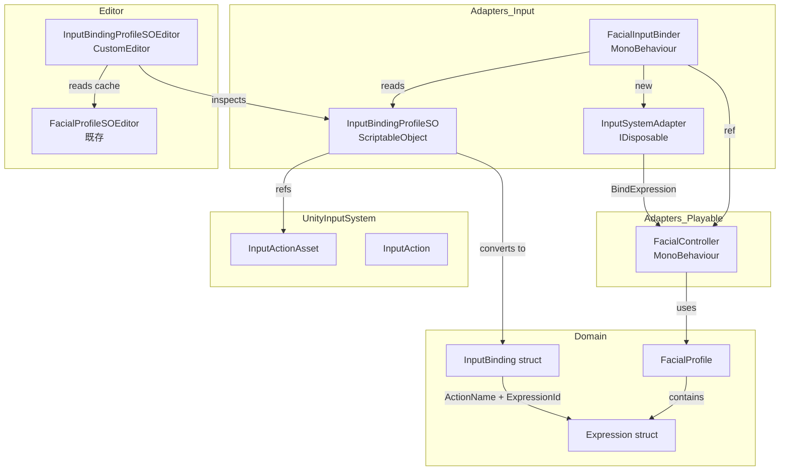
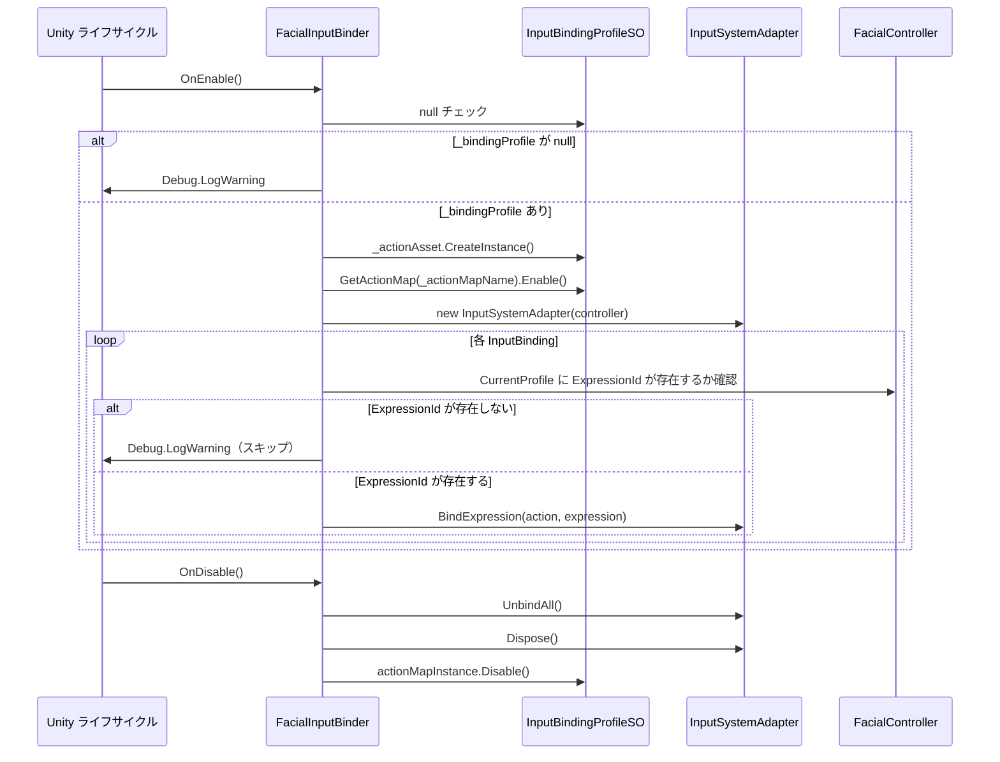
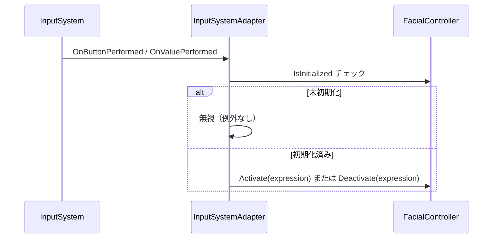
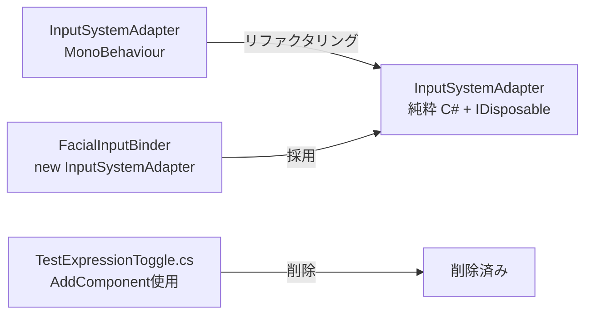

# 設計ドキュメント

## Overview

本機能は、InputAction と Expression の紐付け（キーコンフィグ）を `InputBindingProfileSO` ScriptableObject として Unity プロジェクト内に永続化し、Inspector の GUI から設定できる仕組みを提供する。あわせて `InputSystemAdapter` を MonoBehaviour から純粋 C# クラス（`IDisposable`）へリファクタリングし、`FacialInputBinder` MonoBehaviour がプロファイルを読み込んでアダプターを管理する構成へ移行する。

対象ユーザーは Unity エンジニアであり、「コードを一切書かずに表情切り替えのキーコンフィグを設定・保存する」ワークフローを Inspector のみで完結できることが価値の核心である。さらに、デバッグ用コード直書きの `TestExpressionToggle.cs` を廃止し、独立したサンプルプロファイル一式（`sample_profile.json` / `SampleFacialProfileSO.asset` / `SampleInputBinding.asset`）へ置き換えることで、preview.1 リリースとしての実用性を確保する。

既存の `InputSystemAdapter.BindExpression` / `UnbindExpression` / `UnbindAll` API シグネチャは維持される。`FacialControlDefaultActions.inputactions` の `Trigger1〜Trigger12` 汎用スロット方式も変更しない。破壊的変更は `InputSystemAdapter` の基底クラス変更（MonoBehaviour → 純粋 C# クラス）のみであり、CHANGELOG.md に明記する。

### Goals

- InputAction と Expression の紐付けを ScriptableObject Asset として保存・管理できる
- `InputBindingProfileSO` の Inspector から GUI でキーコンフィグを設定できる（Action / Expression ドロップダウン）
- `FacialInputBinder` を GameObject にアタッチするだけでキーコンフィグが動作する
- `InputSystemAdapter` を MonoBehaviour から純粋 C# クラスへ変換し、ライフサイクル管理を `IDisposable` に統一する
- `TestExpressionToggle.cs` を削除し、独立したサンプル一式に移行する
- quickstart.md にキーコンフィグ設定手順を追加する

### Non-Goals

- ランタイム Rebinding UI の提供
- InputActions Asset の自動生成・変更
- 音声解析・リップシンク機能
- VRM / タイムライン統合
- `InputBindingProfileSO` の JSON エクスポート/インポート

---

## Boundary Commitments

### This Spec Owns

- `InputBinding` ドメインモデル（`Runtime/Domain/Models/InputBinding.cs`）の定義と契約
- `InputBindingProfileSO` ScriptableObject の定義と `IReadOnlyList<InputBinding>` 返却インターフェース
- `FacialInputBinder` MonoBehaviour の定義とライフサイクル管理
- `InputBindingProfileSOEditor` の Inspector UI 実装（UI Toolkit）
- `InputSystemAdapter` の MonoBehaviour → 純粋 C# クラス変換と `IDisposable` 契約
- サンプルアセット一式（`sample_profile.json`、`SampleFacialProfileSO.asset`、`SampleInputBinding.asset`）
- `TestExpressionToggle.cs` の削除
- ドキュメント更新（quickstart.md、README.md、CHANGELOG.md）

### Out of Boundary

- `FacialControlDefaultActions.inputactions` の内容変更
- `FacialController` の初期化フローへの変更
- ランタイム Rebinding UI
- `FacialProfileSO` 本体の変更（`_cachedProfile` を参照するが変更しない）
- OSC 通信・リップシンク

### Allowed Dependencies

- `Hidano.FacialControl.Domain`（`Expression`、`FacialProfile`）
- `Hidano.FacialControl.Adapters`（`FacialController`、`FacialProfileSO`）
- `UnityEngine.InputSystem`（`InputActionAsset`、`InputAction`、`InputActionMap`）
- `UnityEditor`（Editor 層のみ。`InputBindingProfileSOEditor` など）
- `FacialProfileSO._cachedProfile`（Editor がキャッシュとして参照する。変更は行わない）

### Revalidation Triggers

- `Expression` 構造体のフィールド変更（`Id`、`Name` の型・命名変更）
- `FacialProfile` の Expression 取得 API 変更
- `FacialController.IsInitialized` / `Activate` / `Deactivate` シグネチャ変更
- `InputSystemAdapter.BindExpression` シグネチャ変更

---

## Architecture

### Existing Architecture Analysis

現状の `InputSystemAdapter` は `MonoBehaviour` として実装されており、`AddComponent<InputSystemAdapter>()` で生成される（`TestExpressionToggle.cs` 参照）。本設計ではこれを純粋 C# クラスへ変換し、`FacialInputBinder` が `new InputSystemAdapter(facialController)` で生成・保持する。

`FacialProfileSO` は `_cachedProfile`（`FacialProfile?` 型）を `FacialProfileSOEditor` が保持しており、`InputBindingProfileSOEditor` はこのキャッシュを再利用して Expression 名リストを構築する（選択肢 2-B）。`FacialProfileSO` 本体には変更を加えない。

クリーンアーキテクチャの依存方向（Domain → Application → Adapters → Editor）は維持する。`InputBinding` は Unity 非依存の Domain モデルとして定義し、`InputBindingProfileSO` が Adapters 層でシリアライズ表現を担う。

### Architecture Pattern & Boundary Map



**主要な設計決定**:
- `InputSystemAdapter` は MonoBehaviour を廃止し、`IDisposable` による明示的なリソース管理へ移行する（選択肢 1-C）
- `FacialInputBinder` が `InputSystemAdapter` のライフサイクルオーナーとなる（`OnEnable` で new、`OnDisable` で Dispose）
- `InputBindingProfileSOEditor` は `FacialProfileSO` の参照を Editor 専用フィールドとして保持し、SO 本体には保存しない（選択肢 2-B）
- サンプルは `NewFacialProfile.asset` から独立した最小構成とする（選択肢 3-B）

### Technology Stack

| レイヤー | 選択 | 役割 |
|---------|------|------|
| Domain | C# readonly struct（Unity 非依存） | `InputBinding` 値型の定義 |
| Adapters / ScriptableObject | `UnityEngine.ScriptableObject` | `InputBindingProfileSO` の永続化 |
| Adapters / Input | `UnityEngine.InputSystem` 1.17.0 | `InputAction`、`InputActionAsset`、`InputActionMap` |
| Editor / Inspector | `UnityEditor.UIElements`（UI Toolkit） | `InputBindingProfileSOEditor` |
| サンプル | JSON + ScriptableObject Asset | `sample_profile.json`、`SampleFacialProfileSO.asset`、`SampleInputBinding.asset` |

---

## File Structure Plan

### Directory Structure

```
Runtime/
├── Domain/
│   └── Models/
│       └── InputBinding.cs                          # 新規: Domain 値型
├── Adapters/
│   ├── Input/
│   │   ├── InputSystemAdapter.cs                    # 変更: MonoBehaviour → 純粋 C# + IDisposable
│   │   ├── FacialInputBinder.cs                     # 新規: MonoBehaviour ブリッジ
│   │   └── FacialControlDefaultActions.inputactions # 変更なし
│   └── ScriptableObject/
│       └── InputBindingProfileSO.cs                 # 新規: ScriptableObject
Editor/
└── Inspector/
    └── InputBindingProfileSOEditor.cs               # 新規: UI Toolkit カスタム Inspector

Assets/
├── Samples/
│   ├── TestExpressionToggle.cs                      # 削除
│   ├── TestExpressionToggle.cs.meta                 # 削除
│   ├── SampleFacialProfileSO.asset                  # 新規
│   └── SampleInputBinding.asset                     # 新規
└── StreamingAssets/
    └── FacialControl/
        └── sample_profile.json                      # 新規

Documentation~/
└── quickstart.md                                    # 変更: キーコンフィグ設定手順追加

Packages/com.hidano.facialcontrol/
├── README.md                                        # 変更: 主要機能一覧に追記
└── CHANGELOG.md                                     # 変更: preview.1 エントリ更新

Tests/
├── EditMode/
│   ├── Domain/
│   │   └── InputBindingTests.cs                     # 新規
│   └── Adapters/
│       └── InputBindingProfileSOTests.cs            # 新規
└── PlayMode/
    └── Integration/
        └── FacialInputBinderTests.cs                # 新規
```

### Modified Files

- `Runtime/Adapters/Input/InputSystemAdapter.cs` — MonoBehaviour 基底を除去し `IDisposable` を実装。`[SerializeField]` を削除し、コンストラクタまたは public プロパティで `FacialController` を受け取る。`OnDisable()` を `Dispose()` に置き換える
- `Assets/Samples/SampleScene.unity` — `TestExpressionToggle` を削除、`FacialInputBinder` を追加、`SampleFacialProfileSO` と `SampleInputBinding.asset` を割り当て

---

## System Flows

### FacialInputBinder 起動フロー



### InputAction トリガーフロー



---

## Requirements Traceability

| 要件 | 概要 | コンポーネント | インターフェース | フロー |
|------|------|---------------|----------------|--------|
| 1.1 | InputBinding struct の提供 | `InputBinding` | Service Interface | - |
| 1.2 | null/空文字コンストラクタ例外 | `InputBinding` | Service Interface | - |
| 1.3 | IEquatable の実装 | `InputBinding` | Service Interface | - |
| 1.4 | Unity 非依存のイミュータブル値型 | `InputBinding` | - | - |
| 2.1 | CreateAssetMenu 付与 | `InputBindingProfileSO` | - | - |
| 2.2 | InputActionAsset 参照フィールド | `InputBindingProfileSO` | State | - |
| 2.3 | ActionMap 名フィールド（デフォルト "Expression"） | `InputBindingProfileSO` | State | - |
| 2.4 | バインディングペアリストのシリアライズ | `InputBindingProfileSO` | State | - |
| 2.5 | IReadOnlyList<InputBinding> 返却 | `InputBindingProfileSO` | Service Interface | - |
| 2.6 | actionAsset null 時に空リスト返却 | `InputBindingProfileSO` | Service Interface | - |
| 3.1 | AddComponentMenu 付与 | `FacialInputBinder` | - | - |
| 3.2 | FacialController / InputBindingProfileSO フィールド公開 | `FacialInputBinder` | - | - |
| 3.3 | OnEnable でバインディング登録 | `FacialInputBinder` | Service Interface | 起動フロー |
| 3.4 | ExpressionId 不存在時の警告ログとスキップ | `FacialInputBinder` | - | 起動フロー |
| 3.5 | bindingProfile null 時の警告ログ（例外なし） | `FacialInputBinder` | - | 起動フロー |
| 3.6 | OnDisable で UnbindAll + ActionMap 無効化 | `FacialInputBinder` | Service Interface | 起動フロー |
| 3.7 | FacialController 未初期化時の安全無視 | `InputSystemAdapter` | Service Interface | トリガーフロー |
| 4.1 | UI Toolkit 実装 | `InputBindingProfileSOEditor` | - | - |
| 4.2 | InputActionAsset ObjectField | `InputBindingProfileSOEditor` | - | - |
| 4.3 | 参照用 FacialProfileSO ObjectField（Editor 専用） | `InputBindingProfileSOEditor` | - | - |
| 4.4 | ActionMap ドロップダウン自動列挙 | `InputBindingProfileSOEditor` | - | - |
| 4.5 | Action ドロップダウン自動列挙 | `InputBindingProfileSOEditor` | - | - |
| 4.6 | Expression ドロップダウン自動列挙（ExpressionId で保存） | `InputBindingProfileSOEditor` | - | - |
| 4.7 | 追加/削除ボタン | `InputBindingProfileSOEditor` | - | - |
| 4.8 | ActionAsset/ActionMap 変更時の一覧再構築 | `InputBindingProfileSOEditor` | - | - |
| 5.1 | TestExpressionToggle.cs 削除 | Assets/Samples | - | - |
| 5.2 | sample_profile.json の新設 | Assets/StreamingAssets | - | - |
| 5.3 | SampleFacialProfileSO.asset の新設 | Assets/Samples | - | - |
| 5.4 | SampleInputBinding.asset の新設 | Assets/Samples | - | - |
| 5.5 | キー `1` でまばたきトグル動作 | SampleScene | - | - |
| 5.6 | FacialInputBinder の配置と割り当て | SampleScene | - | - |
| 5.7 | NewFacialProfile.asset からの独立 | Assets/Samples | - | - |
| 6.1 | quickstart.md にキーコンフィグセクション追加 | Documentation | - | - |
| 6.2 | README.md 主要機能一覧に追記 | Documentation | - | - |
| 6.3 | CHANGELOG.md の preview.1 エントリ更新 | Documentation | - | - |
| 7.1 | MonoBehaviour 基底の廃止 | `InputSystemAdapter` | - | - |
| 7.2 | 既存 public API シグネチャの維持 | `InputSystemAdapter` | Service Interface | - |
| 7.3 | FacialController をコンストラクタ/プロパティで受け取る | `InputSystemAdapter` | Service Interface | - |
| 7.4 | IDisposable 実装（Dispose で UnbindAll） | `InputSystemAdapter` | Service Interface | - |
| 7.5 | InputSystemAdapterTests の Green 維持 | Tests | - | - |
| 7.6 | 破壊的変更の CHANGELOG 明記 | Documentation | - | - |

---

## Components and Interfaces

### コンポーネント一覧

| コンポーネント | レイヤー | 目的 | 要件カバレッジ | 主要依存 | 契約 |
|--------------|---------|------|-------------|---------|------|
| `InputBinding` | Domain | ActionName と ExpressionId のイミュータブル値型 | 1.1〜1.4 | なし | Service |
| `InputBindingProfileSO` | Adapters/ScriptableObject | バインディング設定の永続化と Domain 変換 | 2.1〜2.6 | `InputBinding`、`InputActionAsset` | Service、State |
| `InputSystemAdapter` | Adapters/Input | InputAction → FacialController 連携（IDisposable） | 7.1〜7.6、3.7 | `FacialController`、`InputAction` | Service |
| `FacialInputBinder` | Adapters/Input | プロファイル読み込みとバインディング自動登録 | 3.1〜3.6 | `InputBindingProfileSO`、`InputSystemAdapter`、`FacialController` | Service |
| `InputBindingProfileSOEditor` | Editor/Inspector | Inspector GUI（UI Toolkit） | 4.1〜4.8 | `InputBindingProfileSO`、`FacialProfileSO` | - |
| サンプルアセット一式 | Assets/Samples | preview.1 実用サンプル | 5.1〜5.7 | `FacialInputBinder`、`InputBindingProfileSO`、`FacialProfileSO` | - |
| ドキュメント更新 | Documentation | クイックスタート・README・CHANGELOG | 6.1〜6.3 | - | - |

---

### Domain 層

#### InputBinding

| フィールド | 詳細 |
|----------|------|
| Intent | InputAction 名と Expression ID の紐付けを表す Unity 非依存のイミュータブル値型 |
| Requirements | 1.1, 1.2, 1.3, 1.4 |

**Responsibilities & Constraints**
- `ActionName`（string）と `ExpressionId`（string）の 2 フィールドのみを持つ `readonly struct`
- コンストラクタで null/空文字を検証し、違反時は `ArgumentException` をスロー
- `IEquatable<InputBinding>` を実装し、値ベースの等価性を提供する
- `UnityEngine` 名前空間の参照を一切含まない

**Dependencies**
- Inbound: `InputBindingProfileSO` — Domain 変換（P0）
- Inbound: `FacialInputBinder` — ExpressionId 解決（P0）

**Contracts**: Service [x]

##### Service Interface

```csharp
namespace Hidano.FacialControl.Domain.Models
{
    public readonly struct InputBinding : IEquatable<InputBinding>
    {
        public string ActionName { get; }
        public string ExpressionId { get; }

        /// <summary>
        /// コンストラクタ。actionName または expressionId が null/空文字の場合は ArgumentException をスロー。
        /// </summary>
        public InputBinding(string actionName, string expressionId);

        public bool Equals(InputBinding other);
        public override bool Equals(object obj);
        public override int GetHashCode();
        public static bool operator ==(InputBinding left, InputBinding right);
        public static bool operator !=(InputBinding left, InputBinding right);
    }
}
```

- 事前条件: `actionName` および `expressionId` が非 null かつ非空文字列
- 事後条件: `ActionName == actionName`、`ExpressionId == expressionId`
- 不変条件: フィールドは構築後に変更されない

---

### Adapters/ScriptableObject 層

#### InputBindingProfileSO

| フィールド | 詳細 |
|----------|------|
| Intent | バインディング設定を ScriptableObject として永続化し、Domain モデルに変換して提供する |
| Requirements | 2.1, 2.2, 2.3, 2.4, 2.5, 2.6 |

**Responsibilities & Constraints**
- `[CreateAssetMenu(menuName = "FacialControl/Input Binding Profile")]` を付与する
- `_actionAsset`（`InputActionAsset`）、`_actionMapName`（`string`、デフォルト `"Expression"`）、`_bindings`（`List<InputBindingEntry>`）をシリアライズフィールドとして保持する
- `InputBindingEntry` は `[Serializable]` なネストクラスとし、`actionName`（string）と `expressionId`（string）フィールドを持つ（Unity のシリアライズ制約上 struct ではなく class）
- `Bindings` プロパティは `_bindings` を `IReadOnlyList<InputBinding>` に変換して返す。`_actionAsset` が null の場合は空リストを返す
- SO 本体はシリアライズのみを担い、InputAction の Enable/Disable は行わない

**Dependencies**
- Outbound: `InputBinding`（Domain）— シリアライズデータの Domain 変換（P0）
- External: `UnityEngine.InputSystem.InputActionAsset` — バインディング元の Asset 参照（P0）

**Contracts**: Service [x] / State [x]

##### Service Interface

```csharp
namespace Hidano.FacialControl.Adapters.ScriptableObject
{
    [CreateAssetMenu(menuName = "FacialControl/Input Binding Profile")]
    public class InputBindingProfileSO : UnityEngine.ScriptableObject
    {
        // Inspector 公開フィールド
        // [SerializeField] InputActionAsset _actionAsset;
        // [SerializeField] string _actionMapName = "Expression";
        // [SerializeField] List<InputBindingEntry> _bindings;

        public InputActionAsset ActionAsset { get; }
        public string ActionMapName { get; }

        /// <summary>
        /// シリアライズデータを Domain モデルに変換して返す。
        /// ActionAsset が null の場合は空リストを返す。
        /// </summary>
        public IReadOnlyList<InputBinding> Bindings { get; }

        [Serializable]
        public class InputBindingEntry
        {
            public string actionName;
            public string expressionId;
        }
    }
}
```

##### State Management

- シリアライズデータは Unity の AssetDatabase で永続化される
- `Bindings` プロパティへのアクセス時に毎回 `_bindings` から変換する（毎フレーム呼び出しは想定しない）
- `_actionAsset` が null の場合のガードを `Bindings` ゲッター内で行う

**Implementation Notes**
- `InputBindingEntry` は `struct` ではなく `class` を使用する（Unity が `[SerializeField] List<T>` を正しくシリアライズするための制約）
- `Bindings` の変換コストは軽微だが、`FacialInputBinder.OnEnable` の呼び出し時のみ評価されるため問題ない
- リスク: `actionName` または `expressionId` に空文字が保存されている場合、`InputBinding` コンストラクタが `ArgumentException` をスロー。`Bindings` ゲッターでは空エントリをスキップする防御処理を設ける

---

### Adapters/Input 層

#### InputSystemAdapter（リファクタリング）

| フィールド | 詳細 |
|----------|------|
| Intent | InputAction のイベントを受けて FacialController の表情制御を行う純粋 C# アダプター |
| Requirements | 7.1, 7.2, 7.3, 7.4, 7.5, 7.6, 3.7 |

**Responsibilities & Constraints**
- `MonoBehaviour` 派生を廃止し、`IDisposable` を実装する
- `[AddComponentMenu]` 属性を削除する
- `BindExpression(InputAction, Expression)`、`UnbindExpression(InputAction)`、`UnbindAll()` の public API シグネチャは変更しない
- `FacialController` の参照はコンストラクタ引数または public プロパティで受け取る（`[SerializeField]` 廃止）
- `Dispose()` で `UnbindAll()` を呼び出してリソースを解放する
- `FacialController` が未初期化（`IsInitialized == false`）の場合、InputAction コールバックを安全に無視する（既存動作を維持）

**Dependencies**
- Outbound: `FacialController` — `Activate` / `Deactivate`（P0）
- External: `UnityEngine.InputSystem.InputAction` — コールバック登録（P0）

**Contracts**: Service [x]

##### Service Interface

```csharp
namespace Hidano.FacialControl.Adapters.Input
{
    public class InputSystemAdapter : IDisposable
    {
        /// <summary>
        /// コンストラクタ。FacialController の参照を受け取る。
        /// </summary>
        public InputSystemAdapter(FacialController facialController);

        /// <summary>制御対象の FacialController</summary>
        public FacialController FacialController { get; set; }

        /// <summary>
        /// InputAction と Expression のバインディングを登録する。
        /// Button 型: 押下でトグル。Value 型: アナログ強度でアクティブ制御。
        /// </summary>
        public void BindExpression(InputAction action, Expression expression);

        /// <summary>指定 InputAction のバインディングを解除する。</summary>
        public void UnbindExpression(InputAction action);

        /// <summary>全バインディングを解除する。</summary>
        public void UnbindAll();

        /// <summary>UnbindAll を呼び出してリソースを解放する。</summary>
        public void Dispose();
    }
}
```

- 事前条件: `BindExpression` 呼び出し時、`action` は非 null
- 事後条件: `Dispose()` 後は全コールバックが解除される
- 不変条件: `_bindings` の整合性はコールバック登録と同期して維持する

**Implementation Notes**
- 破壊的変更: `AddComponent<InputSystemAdapter>()` を使用していた既存コードはコンパイルエラーとなる。CHANGELOG.md に `Breaking Change` として記載する
- 既存の `InputSystemAdapterTests`（PlayMode）は `new InputSystemAdapter(controller)` に合わせてテストコードを更新し、Green を維持する

---

#### FacialInputBinder

| フィールド | 詳細 |
|----------|------|
| Intent | InputBindingProfileSO を読み込み、InputSystemAdapter 経由でバインディングを自動登録する MonoBehaviour ブリッジ |
| Requirements | 3.1, 3.2, 3.3, 3.4, 3.5, 3.6 |

**Responsibilities & Constraints**
- `[AddComponentMenu("FacialControl/Facial Input Binder")]` を付与する
- Inspector に `_facialController`（`FacialController`）と `_bindingProfile`（`InputBindingProfileSO`）を公開する
- `OnEnable` で `InputSystemAdapter` インスタンスを `new` で生成し、プロファイルの全バインディングを登録する
- `_bindingProfile._actionAsset` を `InputActionAsset.CreateInstance()` でインスタンス化し、対象 ActionMap を `Enable()` した後にバインディングを処理する
- `ExpressionId` が `FacialController.CurrentProfile` に存在しない場合は `Debug.LogWarning` を出力してそのエントリのみスキップする
- `_bindingProfile` が null の場合は `Debug.LogWarning` を出力して終了する（例外なし）
- `OnDisable` で `_adapter.UnbindAll()`、`_adapter.Dispose()`、ActionMap の `Disable()` を呼び出す
- `InputSystemAdapter` インスタンスの生成・破棄の責任を単独で持つ

**Dependencies**
- Inbound: Unity MonoBehaviour ライフサイクル（`OnEnable` / `OnDisable`）
- Outbound: `InputBindingProfileSO` — バインディングリスト取得（P0）
- Outbound: `InputSystemAdapter` — バインディング登録（P0）
- Outbound: `FacialController` — ExpressionId 解決、`Activate`/`Deactivate` 委譲（P0）

**Contracts**: Service [x]

##### Service Interface

```csharp
namespace Hidano.FacialControl.Adapters.Input
{
    [AddComponentMenu("FacialControl/Facial Input Binder")]
    public class FacialInputBinder : MonoBehaviour
    {
        // [SerializeField] FacialController _facialController;
        // [SerializeField] InputBindingProfileSO _bindingProfile;

        private void OnEnable();
        private void OnDisable();
    }
}
```

**Implementation Notes**
- `FacialController.CurrentProfile` から ExpressionId を検索するため、`FacialProfile.TryGetExpression(string id, out Expression expression)` のような API が必要になる。`FacialProfile` に当該メソッドが存在しない場合は `FacialInputBinder` 内で `CurrentProfile.Value` の Expression リストを走査する
- `InputActionAsset.CreateInstance()` で生成した ActionMap インスタンスは `_bindingProfile._actionAsset` とは別物であり、`OnDisable` で確実に破棄（または `Disable`）する必要がある
- リスク: `FacialController` が `OnEnable` 時点で未初期化の場合、バインディング登録後に InputAction がトリガーされても `InputSystemAdapter` が安全に無視する

---

### Editor 層

#### InputBindingProfileSOEditor

| フィールド | 詳細 |
|----------|------|
| Intent | InputBindingProfileSO の Inspector をカスタマイズし、Action と Expression をドロップダウンで選択できる GUI を提供する |
| Requirements | 4.1, 4.2, 4.3, 4.4, 4.5, 4.6, 4.7, 4.8 |

**Responsibilities & Constraints**
- `[CustomEditor(typeof(InputBindingProfileSO))]` を付与し、UI Toolkit で実装する
- `InputActionAsset` 参照 ObjectField を提供する（`_actionAsset` フィールドにバインド）
- 参照用 `FacialProfileSO` は Editor 専用一時フィールドとして保持し、SO 本体には保存しない
- `FacialProfileSO` が設定された場合、`_cachedProfile`（`FacialProfile?`）が利用可能であればそれを再利用して Expression 名リストを構築する。キャッシュが null の場合は手動リフレッシュボタンを表示する
- `InputActionAsset` が設定されると ActionMap ドロップダウンを自動列挙する（`InputActionAsset.actionMaps`）
- ActionMap が選択されると、そのマップ内の `InputAction` 名を各バインディング行の Action ドロップダウンに列挙する
- バインディング行ごとに「削除」ボタン、一覧末尾に「追加」ボタンを提供する
- `InputActionAsset` または ActionMap が変更された場合、一覧を再構築する
- `FacialControlStyles`（Editor/Common）の共通スタイルを利用する

**Dependencies**
- Outbound: `InputBindingProfileSO` — シリアライズフィールドの読み書き（P0）
- Outbound: `FacialProfileSO._cachedProfile` — Expression 名リスト取得（P1）
- External: `UnityEditor.UIElements`、`UnityEngine.UIElements` — UI Toolkit（P0）
- External: `UnityEngine.InputSystem.InputActionAsset` — ActionMap / Action 名列挙（P0）

**Contracts**: （Editor のみ、ランタイム契約なし）

**Implementation Notes**
- `_cachedProfile` は `FacialProfileSOEditor` のプライベートフィールドであるため、直接参照不可。`FacialProfileSO` オブジェクトに対して `UnityEditor.Editor.CreateEditor(facialProfileSO)` を経由するか、`FacialProfileSO` に `CachedProfile` プロパティを追加して公開する方針のいずれかを実装時に選択する。本設計では `FacialProfileSO` に `#if UNITY_EDITOR` ガード付き `CachedProfile` プロパティを追加する方針を採用する
- Expression ドロップダウンに表示する値は Expression の `Name`（表示用）で、保存は `Id`（ExpressionId）を使用する
- リスク: `FacialProfileSO` に JSON がロードされていない場合（`_cachedProfile == null`）、Expression ドロップダウンが空になる。手動リフレッシュボタンで対処する

---

## Data Models

### Domain Model

```
InputBinding (Value Object)
├── ActionName : string  [non-null, non-empty]
└── ExpressionId : string  [non-null, non-empty]
```

`InputBinding` は集約ルートを持たないスタンドアロンの値オブジェクト。`IEquatable<InputBinding>` による値等価性で同一性を判定する。

### Logical Data Model

**InputBindingProfileSO のシリアライズ構造**

```
InputBindingProfileSO
├── _actionAsset : InputActionAsset (Unity Object 参照)
├── _actionMapName : string (デフォルト "Expression")
└── _bindings : List<InputBindingEntry>
    └── InputBindingEntry [Serializable class]
        ├── actionName : string   (InputAction.name と一致)
        └── expressionId : string (Expression.Id と一致)
```

`InputBindingEntry` は Unity の ScriptableObject シリアライズ機構で `_bindings` フィールドに保存される。Asset ファイル形式は YAML（Unity デフォルト）。

**サンプルアセットの構成**

```
sample_profile.json
├── schemaVersion : "1.0.0"
└── expressions[]
    └── { id: "固定GUID", name: "まばたき", layer: "eye",
          blendShapeValues: [{ name: "まばたき", value: 1.0 }] }

SampleFacialProfileSO.asset
└── _jsonFilePath : "FacialControl/sample_profile.json"

SampleInputBinding.asset
├── _actionAsset : FacialControlDefaultActions (ref)
├── _actionMapName : "Expression"
└── _bindings : [{ actionName: "Trigger1", expressionId: "固定GUID" }]
```

---

## Error Handling

### Error Strategy

Unity 標準ログ（`Debug.LogWarning` / `Debug.LogError`）のみを使用する。例外はドメインバリデーション（`InputBinding` コンストラクタ）に限定し、ランタイム動作ではグレースフルデグラデーションを優先する。

### Error Categories and Responses

| エラー種別 | 発生箇所 | 対処 |
|----------|---------|------|
| `ActionName` / `ExpressionId` が null/空文字 | `InputBinding` コンストラクタ | `ArgumentException` をスロー |
| `_bindingProfile` が null | `FacialInputBinder.OnEnable` | `Debug.LogWarning`、登録スキップ |
| ExpressionId が FacialController のプロファイルに不在 | `FacialInputBinder.OnEnable` | `Debug.LogWarning`、該当エントリのみスキップ |
| `FacialController` 未初期化時に InputAction トリガー | `InputSystemAdapter` コールバック | 安全に無視（既存動作） |
| `InputBindingEntry` に空文字が保存されている | `InputBindingProfileSO.Bindings` | 空エントリをスキップして残りを返す |
| `InputActionAsset` が null | `InputBindingProfileSO.Bindings` | 空リストを返す |

---

## Testing Strategy

### EditMode テスト

**対象ファイル**: `Tests/EditMode/Domain/InputBindingTests.cs`

- `InputBinding` — 正常なコンストラクタ引数で正しいフィールド値を返す
- `InputBinding` — `ActionName` が null/空文字の場合に `ArgumentException` をスロー
- `InputBinding` — `ExpressionId` が null/空文字の場合に `ArgumentException` をスロー
- `InputBinding` — 等値の 2 インスタンスが `Equals` で等しいと判定される
- `InputBinding` — 異なる値の 2 インスタンスが `Equals` で等しくないと判定される

**対象ファイル**: `Tests/EditMode/Adapters/InputBindingProfileSOTests.cs`

- `InputBindingProfileSO` — `_actionAsset` が null の場合、`Bindings` は空リストを返す
- `InputBindingProfileSO` — `_bindings` が空の場合、`Bindings` は空リストを返す
- `InputBindingProfileSO` — 有効な `_bindings` がある場合、`Bindings` は対応する `IReadOnlyList<InputBinding>` を返す
- `InputBindingProfileSO` — 空文字の `actionName` を持つエントリがある場合、そのエントリをスキップする

### PlayMode テスト

**対象ファイル**: `Tests/PlayMode/Integration/FacialInputBinderTests.cs`

- `FacialInputBinder` — `OnEnable` でバインディングが登録され、InputAction の `Press()` により `FacialController.Activate` が呼び出される
- `FacialInputBinder` — `OnDisable` で全バインディングが解除され、InputAction トリガーが `FacialController` に届かない
- `FacialInputBinder` — `_bindingProfile` が null のとき `LogWarning` が出力され例外が発生しない
- `FacialInputBinder` — ExpressionId が不在のとき `LogWarning` が出力され残りのバインディングは登録される
- `InputSystemAdapter` — `new InputSystemAdapter(controller)` で生成し、`BindExpression` / `UnbindAll` / `Dispose` が正常動作する（リグレッション: P23-T04）

### リグレッションテスト

- 既存 `InputSystemAdapterTests`（PlayMode）を新しいコンストラクタ形式に更新し、全テスト Green を維持する（7.5）

---

## Migration Strategy

### InputSystemAdapter の破壊的変更への対処

1. `InputSystemAdapter` を MonoBehaviour から純粋 C# クラスへ変換する
2. `AddComponent<InputSystemAdapter>()` を使用していた `TestExpressionToggle.cs` を削除する（5.1）
3. `CHANGELOG.md` に `### Breaking Changes` セクションを設け、`InputSystemAdapter` が MonoBehaviour でなくなった旨と移行方法（`new InputSystemAdapter(facialController)` の使用）を記載する（7.6）
4. 既存の `InputSystemAdapterTests` を更新し、Green を維持する（7.5）



---

## Supporting References

### FacialControlDefaultActions.inputactions の構成

- ActionMap: `"Expression"`
- Trigger1〜Trigger10: `Button` 型（キーボード `1〜0`、ゲームパッド各ボタン）
- Trigger11〜Trigger12: `Value` 型（ゲームパッド左右トリガー）
- デフォルトバインディング: キーボード `1` キー → `Trigger1`

`SampleInputBinding.asset` は `Trigger1`（`<Keyboard>/1`）をまばたき Expression ID にバインドする。ユーザーが別のキーを使いたい場合は `FacialControlDefaultActions.inputactions` を複製してキーバインドを変更する（quickstart.md で説明）。
