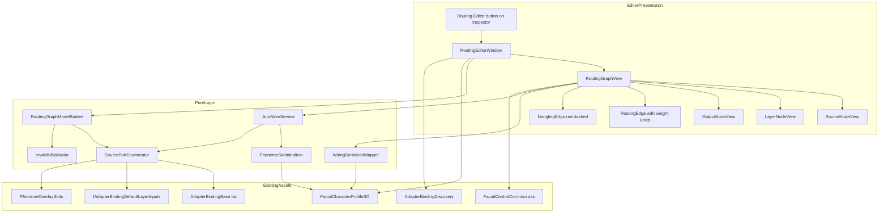
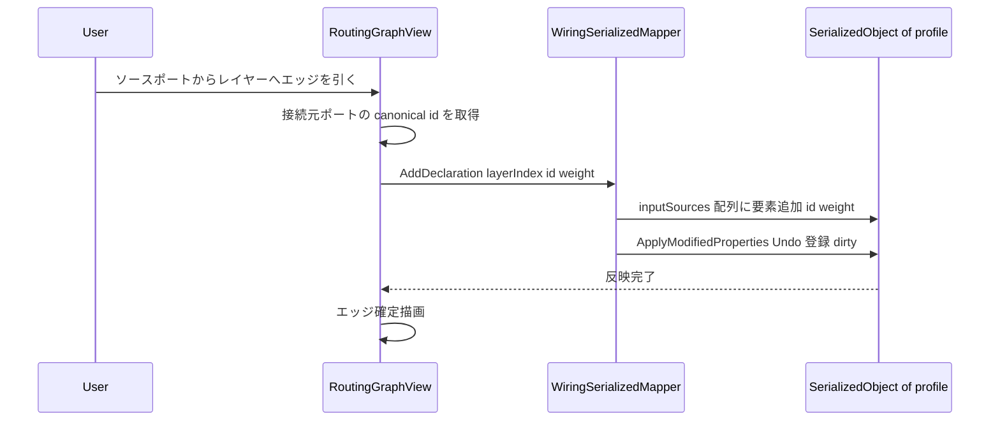
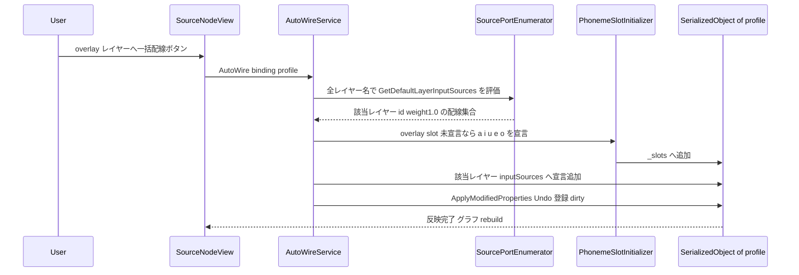
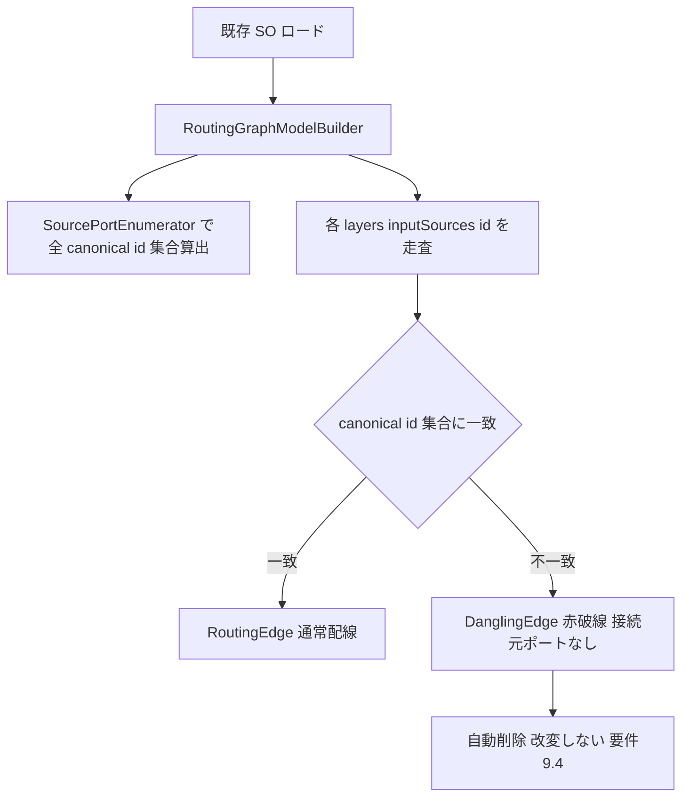

# Technical Design Document

## Overview

本機能は、`FacialCharacterProfileSO` のレイヤー入力源配線（`_layers[].inputSources[].id`）を、人間が文字列 slug を直書きする運用から、ノードグラフ（パッチベイ）による配線 UI へ置き換える Editor 拡張である。Unity エンジニアは `FacialCharacterProfileSO` から専用ウィンドウを開き、ソースノードのラベル付きポート（「あ」等）とレイヤーノードを線でつなぐだけで配線でき、canonical id（例 `lipsync-overlay:a`）を一度も入力しない。エッジが id を運ぶため、binding slug 形（`ulipsync:a`）と overlay 登録 prefix 形（`lipsync-overlay:a`）の取り違えに代表される slug 不一致が、UI 操作のレベルで物理的に発生不能になる。

本機能は既存 SO の「別ビュー」であり、保存先は `FacialCharacterProfileSO`（`_layers` / `_slots` / `_defaultOverlays`）のまま、JSON エクスポート経路は無改修で通す。対象は `com.hidano.facialcontrol` の Editor アセンブリ（`Hidano.FacialControl.Editor` 名前空間）に配置する汎用機能とし、uLipSync は一例として扱う。

### Goals
- `FacialCharacterProfileSO` の入力源配線を、id 文字列を手入力しないノードグラフ UI で編集可能にする。
- id 列挙・配線↔SO 変換・無効 id 検証を GraphView 非依存の純粋ロジックに分離し、EditMode テスト可能にする（slug 不一致の単一真実源化）。
- 既存 SO の永続化経路・JSON エクスポートを無改修で通す。
- 成功基準: 全要件（1〜10）が純粋ロジック + 薄い GraphView 描画層で充足され、id 列挙ロジックが Inspector と新ウィンドウで単一実装に統合される。

### Non-Goals
- 無効 id のワンクリック自動修復ボタン（別途検討。要件 9.3）。
- ランタイム UI（Editor 専用。ランタイム UI は提供しない方針）。
- 既存 `FacialCharacterProfileSOInspector` の置き換え・撤去（併存。ただし id 列挙ヘルパは共用へリファクタ）。
- JSON エクスポート/インポート経路自体の改修。
- 同時編集の競合解決（後勝ち受容。preview の破壊的変更許容方針）。

## Boundary Commitments

### This Spec Owns
- `FacialCharacterProfileSO` を編集対象とする専用ルーティングエディタウィンドウ（GraphView ベース）の生成・ライフサイクル・再描画。
- ソースノード / レイヤーノード / 出力ノードの 3 種ノードと source→layer エッジによる配線編集の UI 操作。
- canonical id をポートが内部保持し画面ラベルのみ表示する配線モデル（描画層）。
- id 列挙・配線↔SO 変換・無効 id 検証の純粋ロジック（GraphView 非依存）。本機能が定義・安定化する新規 Editor 内部契約。
- overlay レイヤーへの一括自動配線（slot 同時宣言を含む）。
- 既存プロファイルロード時の無効 id 検出と赤い破線の宙ぶらりんエッジ描画。

### Out of Boundary
- ランタイムの入力源解決・registry populate（`IInputSourceRegistry` は runtime 専用、Editor では参照しない）。
- `FacialCharacterProfileSO` 以外の新規永続化先。
- JSON エクスポート/インポートの変換ロジック。
- binding 実装そのもの（`ULipSyncAdapterBinding` 等）の挙動変更。
- 無効 id の自動修復・自動削除。

### Allowed Dependencies
- 既存型: `InputSourceId` / `FacialProfile` / `InputSourceDeclaration`（Domain）/ `FacialCharacterProfileSO` / `LayerDefinitionSerializable` / `InputSourceDeclarationSerializable` / `OverlaySlotBindingSerializable`（Adapters）/ `IAdapterBindingDefaultLayer` / `IAdapterBindingDefaultLayerInputs` / `AdapterBindingBase` / `PhonemeOverlaySlots`（Domain.Adapters / Domain.Models）。**契約変更禁止**（要件 10.5）。
- 既存 Editor 資産: `AdapterBindingDiscovery` / `FacialControlCommon.uss`（`FacialControlStyles`）/ 抽出対象 `AdapterBindingsListView.ResolveDefaultInputSources` 相当・`AddMissingPhonemeSlots` 相当。
- `UnityEditor.Experimental.GraphView`（using のみ、asmdef 追加参照不要）。
- 制約: Domain → Application → Adapters → Editor の依存方向を厳守。Editor 専用機能をランタイムへ混入させない。

### Revalidation Triggers
- `IAdapterBindingDefaultLayerInputs` / `IAdapterBindingDefaultLayer` / `AdapterBindingBase.Slug` の契約変更（ソースポート列挙が破綻）。
- `LayerDefinitionSerializable` / `InputSourceDeclarationSerializable` / `FacialCharacterProfileSO` のフィールド名・構造変更（配線↔SO 変換が破綻）。
- `PhonemeOverlaySlots.ReservedNames` の予約名変更（一括配線・slot 宣言に影響）。
- `UnityEditor.Experimental.GraphView` の API 変更（描画薄層のみ影響、純粋ロジックは不変）。
- `AdapterBindingsListView` / Inspector の id 列挙ロジック変更（共用ヘルパとの整合再確認）。

## Architecture

### Existing Architecture Analysis

本機能は既存 clean architecture（Domain ← Application ← Adapters ← Editor）の **Editor 層内部**で完結する拡張である。

- **保持すべきパターン**: SerializedObject 経由の編集（Undo・dirty マーキングを Unity 標準で得る）、`FacialControlStyles`（`FacialControlCommon.uss`）による UI Toolkit スタイル統一、`AdapterBindingDiscovery` による binding 列挙。
- **尊重すべき境界**: registry は runtime 専用（Editor では空）。ソースポート列挙は binding 宣言から静的算出する（research.md Decision 参照）。
- **解消する技術的負債**: id 列挙ロジックが `AdapterBindingsListView`（Inspector）に閉じており、新ウィンドウで二重化すると slug 不一致再発の温床になる。これを GraphView 非依存の純粋ヘルパへ抽出し単一真実源化する。
- **維持する統合点**: `FacialCharacterProfileSO._layers/_slots/_defaultOverlays` への書き込み経路と JSON エクスポート経路を無改修で通す。

### Architecture Pattern & Boundary Map

選定パターン: **純粋ロジック層 + GraphView 薄描画層の分離**（research.md「Architecture Pattern Evaluation」採用案）。GraphView（experimental）への依存を描画層に封じ込め、id 列挙・配線↔SO 変換・検証を GraphView 非依存の純粋クラス群に置く。



**Architecture Integration**:
- Selected pattern: 純粋ロジック層 + GraphView 薄描画層（experimental API 隔離 + TDD 容易性。要件 10.1/10.2）。
- Domain/feature boundaries: id 列挙・配線↔SO 変換・検証は GraphView 型を一切参照しない純粋クラス。GraphView 型（`Node`/`Port`/`Edge`/`GraphView`/`MiniMap`）は描画層のみが参照。
- Existing patterns preserved: SerializedObject 経由編集・`FacialControlStyles`・`AdapterBindingDiscovery`・既存 SO 永続化経路。
- New components rationale: 純粋ロジック群は要件 10 を満たすための分離。描画群は GraphView ノード/エッジを既存 SerializedObject へ橋渡しするため。
- Steering compliance: Editor は UI Toolkit ベース、`Hidano.FacialControl.Editor` 名前空間、Editor 専用（`includePlatforms: ["Editor"]` 既存 asmdef）、エラーは Unity 標準ログのみ。

### Technology Stack

| Layer | Choice / Version | Role in Feature | Notes |
|-------|------------------|-----------------|-------|
| Frontend / Editor UI | UI Toolkit + UnityEditor.Experimental.GraphView (Unity 6000.3) | ノード/エッジ/ズーム/ミニマップ描画、ウィンドウ | experimental。描画薄層に封じ込め（research.md）。asmdef 追加参照不要 |
| Editor Logic (pure) | C# (Unity 6 同梱 Roslyn) | id 列挙・配線↔SO 変換・無効 id 検証・一括配線・slot 初期化 | GraphView 非依存。EditMode テスト対象 |
| Data / Storage | 既存 `FacialCharacterProfileSO`（`_layers/_slots/_defaultOverlays`） | 配線の唯一の永続化先 | 無改修。新規保存先を導入しない（要件 7.2） |
| Persistence integration | Unity `SerializedObject` / `Undo` | 編集反映・Undo 登録・dirty マーク | 標準経路。Inspector と整合 |
| Styling | 既存 `FacialControlCommon.uss`（`FacialControlStyles`） | グラフ・ノード・エッジのスタイル | 既存と整合（要件 2.3） |

## File Structure Plan

### Directory Structure
```
Packages/com.hidano.facialcontrol/Editor/
├── Windows/Routing/                         # 本機能のルート
│   ├── RoutingEditorWindow.cs               # EditorWindow。SO 参照保持・起動制御・外部変更検知・rebuild
│   ├── Graph/                               # GraphView 薄描画層（experimental 依存をここに封じ込め）
│   │   ├── RoutingGraphView.cs              # GraphView 派生。ノード/エッジ配置・接続/切断コールバック
│   │   ├── SourceNodeView.cs               # ソースノード描画（読み取り専用ポート + 一括配線ボタン）
│   │   ├── LayerNodeView.cs                # レイヤーノード描画（属性編集フィールド）
│   │   ├── OutputNodeView.cs               # 合成出力ノード描画（読み取り専用）
│   │   ├── RoutingEdge.cs                  # weight ノブ付きエッジ（Edge 派生）
│   │   └── DanglingEdge.cs                 # 無効 id 用の赤破線・宙ぶらりんエッジ（Edge 派生、読み取り専用）
│   └── Logic/                               # GraphView 非依存の純粋ロジック（EditMode テスト対象）
│       ├── SourcePortEnumerator.cs         # binding + 全レイヤー名 → ソースポート id 群を静的算出
│       ├── RoutingGraphModel.cs            # ノード/ポート/エッジの GraphView 非依存モデル（DTO）
│       ├── RoutingGraphModelBuilder.cs     # SO → RoutingGraphModel（無効 id 検出を含む）
│       ├── WiringSerializedMapper.cs       # 配線操作 → SerializedObject 編集コマンド
│       ├── InvalidIdValidator.cs           # _layers[].inputSources[].id のうちポート未一致を無効 id 判定
│       ├── PhonemeSlotInitializer.cs       # a/i/u/e/o slot 宣言（AddMissingPhonemeSlots を抽出）
│       └── AutoWireService.cs              # 一括自動配線（全レイヤー名評価 + slot 初期化統合）
```

### Modified Files
- `Editor/Inspector/AdapterBindings/AdapterBindingsListView.cs` — `ResolveDefaultInputSources` のロジックを `SourcePortEnumerator` へ移設し、本クラスは新ヘルパを呼ぶ薄いラッパへ置換（id 列挙の単一真実源化）。振る舞いは不変。
- `Editor/Inspector/FacialCharacterProfileSOInspector.cs` — (1)「ルーティングを編集」ボタンを追加し `RoutingEditorWindow` を起動（要件 1.1）。(2) `AddMissingPhonemeSlots` のロジックを `PhonemeSlotInitializer` へ移設し呼ぶ薄いラッパへ置換。振る舞いは不変。

> 既存 2 ファイルへの変更は「振る舞い不変のリファクタ + 起動ボタン追加」に限定。抽出前に既存挙動を固定する EditMode テストを先行作成し回帰を防ぐ（research.md Decision、実装アプローチ A + C）。

## System Flows

### 配線追加フロー（要件 5.2 / 7.4）

配線時に id 文字列をユーザーへ入力させず、ポートが保持する canonical id のみをエッジに運ばせる（要件 5.6）。weight ドラッグは「ドラッグ開始で 1 Undo 記録 → 中間は Undo なし逐次反映 → 確定」で 1 ドラッグ = 1 Undo に collapse（research.md Decision C）。

### 一括自動配線フロー（要件 8）


### 無効 id 可視化フロー（要件 9）


## Requirements Traceability

| Requirement | Summary | Components | Interfaces | Flows |
|-------------|---------|------------|------------|-------|
| 1.1 | ボタンから専用ウィンドウ起動 | FacialCharacterProfileSOInspector(mod), RoutingEditorWindow | `RoutingEditorWindow.Open` | — |
| 1.2 | 対象 SO 参照保持 | RoutingEditorWindow | `RoutingEditorWindow` | — |
| 1.3 | Inspector 併存維持 | RoutingEditorWindow | SerializedObject 共有 | 外部変更検知 rebuild |
| 1.4 | null/破棄時はログ警告で開かない | RoutingEditorWindow | `RoutingEditorWindow.Open` | — |
| 1.5 | 同一 SO は既存ウィンドウを前面化 | RoutingEditorWindow | `RoutingEditorWindow.Open` | — |
| 2.1 | 左右フロー配置 | RoutingGraphView | — | — |
| 2.2 | GraphView 基盤（ノード/エッジ/ズーム/ミニマップ） | RoutingGraphView | GraphView API | — |
| 2.3 | UI Toolkit + 既存 uss 整合 | RoutingGraphView | FacialControlStyles | — |
| 2.4 | ズーム/パン保持 | RoutingGraphView | GraphView API | — |
| 3.1 | binding 公開 id からソースノード生成 | RoutingGraphModelBuilder, SourcePortEnumerator, SourceNodeView | `SourcePortEnumerator.Enumerate` | — |
| 3.2 | canonical id 内部保持・ラベルのみ表示 | SourceNodeView | `RoutingGraphModel` | — |
| 3.3 | ホバーで実 id を tooltip | SourceNodeView | — | — |
| 3.4 | ソースノード読み取り専用 | SourceNodeView | — | — |
| 3.5 | uLipSync は a/i/u/e/o 5 ポート | SourcePortEnumerator | `SourcePortEnumerator.Enumerate` | — |
| 3.6 | binding 追加でソースノード自動出現 | RoutingEditorWindow | 外部変更検知 | rebuild |
| 4.1 | レイヤーノード生成 | RoutingGraphModelBuilder, LayerNodeView | — | — |
| 4.2 | name/priority/exclusionMode/layerOverrideMask 編集 | LayerNodeView | — | — |
| 4.3 | 属性変更を _layers へ反映 | LayerNodeView, WiringSerializedMapper | `WiringSerializedMapper.SetLayerAttribute` | — |
| 5.1 | エッジ ↔ inputSources の {id,weight} | RoutingEdge, WiringSerializedMapper | `RoutingGraphModel` | — |
| 5.2 | 配線で Declaration 追加（canonical id 使用） | RoutingGraphView, WiringSerializedMapper | `WiringSerializedMapper.AddDeclaration` | 配線追加 |
| 5.3 | 切断で要素削除 | RoutingGraphView, WiringSerializedMapper | `WiringSerializedMapper.RemoveDeclaration` | — |
| 5.4 | weight ノブ（ドラッグ/数値） | RoutingEdge | — | — |
| 5.5 | weight 操作で Declaration.weight 更新 | RoutingEdge, WiringSerializedMapper | `WiringSerializedMapper.SetWeight` | 配線追加 |
| 5.6 | id をユーザー入力させずポートが運ぶ | SourceNodeView, RoutingGraphView | — | 配線追加 |
| 6.1 | priority/layerOverrideMask 合成順序の出力ノード | OutputNodeView, RoutingGraphModelBuilder | — | — |
| 6.2 | 出力ノード読み取り専用 | OutputNodeView | — | — |
| 6.3 | priority/mask 変更で再描画 | OutputNodeView, RoutingEditorWindow | rebuild | — |
| 7.1 | 変更を _layers/_slots/_defaultOverlays へ反映 | WiringSerializedMapper, PhonemeSlotInitializer | mapper API | — |
| 7.2 | 新規保存先を導入しない | WiringSerializedMapper | — | — |
| 7.3 | JSON エクスポート無改修 | （無改修。SO 経路維持） | — | — |
| 7.4 | Undo 登録 + dirty マーク | WiringSerializedMapper | SerializedObject/Undo | 配線追加 |
| 8.1 | ヘッダに一括配線ボタン | SourceNodeView | — | — |
| 8.2 | 全レイヤー名評価で weight1.0 一括配線 | AutoWireService, SourcePortEnumerator | `AutoWireService.AutoWire` | 一括自動配線 |
| 8.3 | slot 未宣言なら a/i/u/e/o 同時宣言 | AutoWireService, PhonemeSlotInitializer | `PhonemeSlotInitializer.EnsureReservedSlots` | 一括自動配線 |
| 8.4 | 既存 slot 初期化と統合・単一操作 | AutoWireService, PhonemeSlotInitializer | `AutoWireService.AutoWire` | 一括自動配線 |
| 9.1 | 未一致 id を無効 id として検出 | InvalidIdValidator | `InvalidIdValidator.Validate` | 無効 id 可視化 |
| 9.2 | 無効 id を赤破線の宙ぶらりんエッジ描画 | DanglingEdge, RoutingGraphView | — | 無効 id 可視化 |
| 9.3 | 自動修復ボタンを提供しない | DanglingEdge | — | — |
| 9.4 | 無効 id を自動削除・改変しない | InvalidIdValidator, RoutingGraphModelBuilder | — | 無効 id 可視化 |
| 10.1 | 純粋ロジックを GraphView 描画から分離 | Logic/* 全体 | 各純粋 API | — |
| 10.2 | 純粋ロジックを EditMode テスト可能に | Logic/* 全体 | 各純粋 API | — |
| 10.3 | 特定 binding 非依存の汎用設計 | SourcePortEnumerator, AutoWireService | `IAdapterBindingDefaultLayerInputs` | — |
| 10.4 | Editor アセンブリ配置 | （全コンポーネント Editor 配置） | — | — |
| 10.5 | 既存型契約を変更せず利用 | 全コンポーネント | 既存型参照のみ | — |

## Components and Interfaces

| Component | Domain/Layer | Intent | Req Coverage | Key Dependencies (P0/P1) | Contracts |
|-----------|--------------|--------|--------------|--------------------------|-----------|
| RoutingEditorWindow | Editor/Window | ウィンドウ起動・SO 参照保持・外部変更検知・rebuild | 1.1–1.5, 3.6, 6.3 | RoutingGraphView (P0), FacialCharacterProfileSO (P0) | State |
| RoutingGraphView | Editor/Graph(薄層) | ノード/エッジ配置・接続/切断/ズーム・rebuild 描画 | 2.1–2.4, 5.2–5.6, 9.2 | RoutingGraphModelBuilder (P0), WiringSerializedMapper (P0) | — |
| SourceNodeView | Editor/Graph(薄層) | ソースノード描画・読み取り専用ポート・一括配線ボタン | 3.2–3.5, 5.6, 8.1 | RoutingGraphModel (P0), AutoWireService (P0) | — |
| LayerNodeView | Editor/Graph(薄層) | レイヤー属性編集フィールド描画 | 4.1–4.3 | WiringSerializedMapper (P0) | — |
| OutputNodeView | Editor/Graph(薄層) | 合成順序の読み取り専用描画 | 6.1–6.3 | RoutingGraphModel (P0) | — |
| RoutingEdge | Editor/Graph(薄層) | weight ノブ付きエッジ | 5.1, 5.4, 5.5 | WiringSerializedMapper (P0) | — |
| DanglingEdge | Editor/Graph(薄層) | 無効 id の赤破線・読み取り専用エッジ | 9.2, 9.3 | — | — |
| SourcePortEnumerator | Editor/Logic(純粋) | binding + 全レイヤー名 → ソースポート id 群を静的算出 | 3.1, 3.5, 8.2, 10.1–10.3 | IAdapterBindingDefaultLayerInputs (P0), PhonemeOverlaySlots (P1) | Service |
| RoutingGraphModelBuilder | Editor/Logic(純粋) | SO → RoutingGraphModel（無効 id 検出含む） | 3.1, 4.1, 6.1, 9.1, 9.4, 10.1 | SourcePortEnumerator (P0), InvalidIdValidator (P0) | Service |
| WiringSerializedMapper | Editor/Logic(純粋) | 配線/属性/weight 操作 → SerializedObject 編集 + Undo | 4.3, 5.2, 5.3, 5.5, 7.1, 7.2, 7.4 | SerializedObject (P0) | Service |
| InvalidIdValidator | Editor/Logic(純粋) | ポート未一致 id を無効 id 判定 | 9.1, 9.4, 10.1 | SourcePortEnumerator (P0) | Service |
| PhonemeSlotInitializer | Editor/Logic(純粋) | a/i/u/e/o slot 宣言（AddMissingPhonemeSlots 抽出） | 7.1, 8.3, 8.4 | PhonemeOverlaySlots (P1) | Service |
| AutoWireService | Editor/Logic(純粋) | 一括自動配線 + slot 初期化統合 | 8.2–8.4, 10.3 | SourcePortEnumerator (P0), PhonemeSlotInitializer (P0), WiringSerializedMapper (P0) | Service |

> 描画層（RoutingGraphView / *NodeView / *Edge）は新規境界を持たない Presentation で、GraphView 型を既存 SerializedObject へ橋渡しするのみのため summary 行 + Implementation Note とする。新規境界を導入する純粋ロジック群を full block で詳述する。

### Editor / Logic（純粋ロジック層）

#### SourcePortEnumerator

| Field | Detail |
|-------|--------|
| Intent | binding と全レイヤー名から、各 binding が公開する canonical id（ポート）を静的・決定的に列挙する |
| Requirements | 3.1, 3.5, 8.2, 10.1, 10.2, 10.3 |

**Responsibilities & Constraints**
- 入力: `IReadOnlyList<AdapterBindingBase> bindings`、`IReadOnlyList<string> allLayerNames`。出力: binding ごとのポート集合（canonical id + 表示ラベル）。
- canonical id 供給源 3 経路を distinct 集約: (1) `IAdapterBindingDefaultLayerInputs.GetDefaultLayerInputSources(layerName)` を全レイヤー名で評価、(2) legacy `IAdapterBindingDefaultLayer.DefaultLayerInputSourceId`、(3) overlay slot 由来 id（`PhonemeOverlaySlots.ReservedNames` を用いる binding の場合）。
- **registry を参照しない**（Editor では空。research.md Decision）。決定的: 同一入力 → 同一出力（rebuild 冪等性の基礎）。
- 表示ラベルは id 末尾の slot/phoneme から導出（例 `lipsync-overlay:a` → 「あ」）。ラベル導出に失敗した場合は id をそのままラベルとする（汎用性のため特定 binding 命名に依存しない）。
- `AdapterBindingsListView.ResolveDefaultInputSources` の既存ロジックを本クラスへ移設し、Inspector も本クラスを共用する（単一真実源）。

**Dependencies**
- Outbound: `IAdapterBindingDefaultLayerInputs` / `IAdapterBindingDefaultLayer` — canonical id 取得（P0）
- Outbound: `PhonemeOverlaySlots` — 予約 slot 名（P1）
- Inbound: RoutingGraphModelBuilder, AutoWireService, InvalidIdValidator, AdapterBindingsListView(mod)

**Contracts**: Service [x]

##### Service Interface
```csharp
namespace Hidano.FacialControl.Editor.Windows.Routing.Logic
{
    public readonly struct SourcePort
    {
        public string CanonicalId { get; }   // 例: "lipsync-overlay:a"。エッジが運ぶ実 id
        public string Label { get; }         // 例: "あ"。画面表示用
        public float DefaultWeight { get; }  // 既定 weight（一括配線で使用、通常 1.0）
    }

    public readonly struct SourceNodeDescriptor
    {
        public AdapterBindingBase Binding { get; }
        public string DisplayName { get; }                 // AdapterBindingDiscovery 由来 or Slug
        public IReadOnlyList<SourcePort> Ports { get; }
    }

    public interface ISourcePortEnumerator
    {
        // 全 binding を全レイヤー名で評価し、各 binding のソースノード記述を返す
        IReadOnlyList<SourceNodeDescriptor> Enumerate(
            IReadOnlyList<AdapterBindingBase> bindings,
            IReadOnlyList<string> allLayerNames);
    }
}
```
- Preconditions: `bindings` / `allLayerNames` は null 不可（空は許容）。
- Postconditions: 各 binding に対しポート id は distinct。同一入力で結果は決定的。
- Invariants: registry を参照しない。binding 契約を変更しない。

#### WiringSerializedMapper

| Field | Detail |
|-------|--------|
| Intent | 配線・属性・weight の編集操作を編集対象 SO の SerializedObject へ反映し、Undo 登録・dirty マークを行う |
| Requirements | 4.3, 5.2, 5.3, 5.5, 7.1, 7.2, 7.4 |

**Responsibilities & Constraints**
- 編集対象は `FacialCharacterProfileSO` の `SerializedObject` のみ（新規保存先を導入しない。要件 7.2）。
- 配線追加 = 対象 layer の `inputSources` 配列へ `{id, weight}` 要素追加。切断 = 該当要素削除。weight 設定 = 該当要素の `weight` 更新。属性設定 = `name`/`priority`/`exclusionMode`/`layerOverrideMask` 更新。
- すべて `SerializedProperty` 経由で行い、`ApplyModifiedProperties`（Undo 自動登録）でコミット。weight ドラッグの連続更新はドラッグ境界で Undo を 1 段に collapse する API を分離（`BeginContinuous`/`SetWeightContinuous`/`EndContinuous`）。
- `optionsJson` は本機能で編集対象外（既存値を温存）。無効 id 要素は触らない（要件 9.4）。

**Dependencies**
- Outbound: Unity `SerializedObject` / `SerializedProperty` / `Undo` / `EditorUtility.SetDirty`（P0）
- Inbound: RoutingGraphView, LayerNodeView, RoutingEdge, AutoWireService

**Contracts**: Service [x] / State [x]

##### Service Interface
```csharp
namespace Hidano.FacialControl.Editor.Windows.Routing.Logic
{
    public interface IWiringSerializedMapper
    {
        // source→layer 配線追加。canonical id と weight を inputSources へ追加
        void AddDeclaration(SerializedObject so, int layerIndex, string canonicalId, float weight);
        // 配線切断。canonical id 一致要素を削除
        void RemoveDeclaration(SerializedObject so, int layerIndex, string canonicalId);
        // weight 単発更新（離散 Undo 1 段）
        void SetWeight(SerializedObject so, int layerIndex, string canonicalId, float weight);
        // レイヤー属性更新（name/priority/exclusionMode/layerOverrideMask）
        void SetLayerAttribute(SerializedObject so, int layerIndex, LayerAttributeEdit edit);

        // weight 連続ドラッグ（Undo 1 段に collapse）
        void BeginContinuousWeight(SerializedObject so, int layerIndex, string canonicalId);
        void SetWeightContinuous(SerializedObject so, int layerIndex, string canonicalId, float weight);
        void EndContinuousWeight();
    }
}
```
- Preconditions: `so` は対象 `FacialCharacterProfileSO` の SerializedObject。`layerIndex` は範囲内。`canonicalId` は非空。
- Postconditions: 変更は Undo 履歴に登録され、対象アセットが dirty。`_layers` 以外の保存先を変更しない。
- Invariants: 無効 id 要素を自動削除・改変しない。JSON エクスポート経路を破壊しない。

##### State Management
- State model: `FacialCharacterProfileSO._layers[].inputSources[]` が唯一の状態。マッパーは状態を保持しない（ステートレス）。連続ドラッグの途中状態のみ `Begin/End` 間で内部保持。
- Persistence & consistency: `ApplyModifiedProperties` でコミット。Inspector との整合は SerializedObject の共有 + `Update()` で担保。
- Concurrency strategy: 同時編集は後勝ち（スコープ外。research.md Decision D）。

#### RoutingGraphModelBuilder

| Field | Detail |
|-------|--------|
| Intent | 編集対象 SO から GraphView 非依存のグラフモデル（ノード/ポート/エッジ/無効エッジ）を冪等に構築する |
| Requirements | 3.1, 4.1, 6.1, 9.1, 9.4, 10.1 |

**Responsibilities & Constraints**
- 出力 `RoutingGraphModel`: ソースノード群（`SourceNodeDescriptor`）、レイヤーノード群（name/priority/exclusionMode/layerOverrideMask + 配線リスト）、出力ノード（priority/mask による合成順序）、通常エッジ（layerIndex × canonicalId × weight）、無効エッジ（無効 id × layerIndex）。
- 無効 id 判定は `InvalidIdValidator` へ委譲。無効 id は無効エッジとしてモデルに含めるのみで、SO を改変しない（要件 9.4）。
- 冪等: 同一 SO 状態 → 同一モデル（rebuild の基礎。research.md Decision D）。GraphView 型を一切参照しない。

**Dependencies**
- Outbound: `SourcePortEnumerator`（P0）、`InvalidIdValidator`（P0）
- Inbound: RoutingGraphView, RoutingEditorWindow

**Contracts**: Service [x]

##### Service Interface
```csharp
namespace Hidano.FacialControl.Editor.Windows.Routing.Logic
{
    public sealed class RoutingGraphModel
    {
        public IReadOnlyList<SourceNodeDescriptor> SourceNodes { get; }
        public IReadOnlyList<LayerNodeData> LayerNodes { get; }
        public OutputNodeData OutputNode { get; }
        public IReadOnlyList<WiringEdgeData> Edges { get; }          // 通常配線
        public IReadOnlyList<DanglingEdgeData> InvalidEdges { get; } // 無効 id
    }

    public interface IRoutingGraphModelBuilder
    {
        RoutingGraphModel Build(FacialCharacterProfileSO profile);
    }
}
```
- Preconditions: `profile` は非 null・非破棄。
- Postconditions: 全 `_layers[].inputSources[].id` が通常エッジか無効エッジのいずれかに分類される（取りこぼしなし）。
- Invariants: SO を read-only に扱う（改変しない）。決定的。

#### InvalidIdValidator

| Field | Detail |
|-------|--------|
| Intent | `_layers[].inputSources[].id` のうちどのソースポートの canonical id にも一致しないものを無効 id と判定する |
| Requirements | 9.1, 9.4, 10.1 |

**Responsibilities & Constraints**
- 入力: 配線済み id 群 + ソースポート canonical id 集合（`SourcePortEnumerator` 由来）。出力: 無効 id（layerIndex + id）のリスト。
- 検出のみ。削除・改変・修復を行わない（要件 9.3/9.4）。決定的・GraphView 非依存。

**Dependencies**
- Outbound: `SourcePortEnumerator`（canonical id 集合の供給源、P0）
- Inbound: RoutingGraphModelBuilder

**Contracts**: Service [x]

##### Service Interface
```csharp
namespace Hidano.FacialControl.Editor.Windows.Routing.Logic
{
    public readonly struct InvalidDeclarationRef
    {
        public int LayerIndex { get; }
        public int DeclarationIndex { get; }
        public string Id { get; }
    }

    public interface IInvalidIdValidator
    {
        IReadOnlyList<InvalidDeclarationRef> Validate(
            FacialCharacterProfileSO profile,
            ISet<string> validCanonicalIds);
    }
}
```
- Preconditions: `profile` 非 null。`validCanonicalIds` は `SourcePortEnumerator` で算出した全 binding のポート id 集合。
- Postconditions: 戻り値の各 id は `validCanonicalIds` に含まれない。SO を改変しない。
- Invariants: 自動修復・削除を行わない。

#### PhonemeSlotInitializer / AutoWireService

| Field | Detail |
|-------|--------|
| Intent | a/i/u/e/o の overlay slot 宣言（Initializer）と、それを統合した overlay レイヤーへの一括自動配線（AutoWireService） |
| Requirements | 7.1, 8.2, 8.3, 8.4, 10.3 |

**Responsibilities & Constraints**
- `PhonemeSlotInitializer`: `_slots` に `PhonemeOverlaySlots.ReservedNames`（a/i/u/e/o）の未宣言分を追加。既存 `AddMissingPhonemeSlots` のロジックを移設（振る舞い不変）。Inspector も共用。
- `AutoWireService`: 対象 binding の `GetDefaultLayerInputSources` を全レイヤー名で評価し、該当レイヤーへ weight 1.0 のエッジを `WiringSerializedMapper` 経由で一括追加。overlay slot 未宣言なら `PhonemeSlotInitializer` で同時宣言（要件 8.3/8.4）。一連を単一 Undo グループにまとめる。
- 特定 binding 非依存: `IAdapterBindingDefaultLayerInputs` を介して汎用に扱う（要件 10.3）。uLipSync は一例。

**Dependencies**
- Outbound: `SourcePortEnumerator`（P0）、`PhonemeSlotInitializer`（P0）、`WiringSerializedMapper`（P0）、`PhonemeOverlaySlots`（P1）
- Inbound: SourceNodeView（一括配線ボタン）

**Contracts**: Service [x]

##### Service Interface
```csharp
namespace Hidano.FacialControl.Editor.Windows.Routing.Logic
{
    public interface IPhonemeSlotInitializer
    {
        // _slots に a/i/u/e/o の未宣言分を追加。追加があれば true
        bool EnsureReservedSlots(SerializedObject so);
    }

    public interface IAutoWireService
    {
        // 対象 binding を全レイヤー名で評価し一括配線 + slot 宣言（単一 Undo）
        void AutoWire(SerializedObject so, AdapterBindingBase binding, IReadOnlyList<string> allLayerNames);
    }
}
```
- Preconditions: `so` は対象 SO の SerializedObject。`binding` は `IAdapterBindingDefaultLayerInputs` 実装を期待（未実装なら no-op）。
- Postconditions: 既存配線と重複しない範囲で weight 1.0 のエッジを追加。slot 宣言と配線が単一 Undo で完了。
- Invariants: 既存配線・無効 id を破壊しない。

### Editor / Graph（GraphView 薄描画層）

#### RoutingEditorWindow（State 詳述）

| Field | Detail |
|-------|--------|
| Intent | EditorWindow。編集対象 SO 参照保持・起動制御・外部変更検知・rebuild |
| Requirements | 1.1–1.5, 3.6, 6.3 |

**Responsibilities & Constraints**
- 起動: 対象 SO が null/破棄なら `Debug.LogWarning` で開かない（要件 1.4）。同一 SO の既存ウィンドウがあれば `Focus()` で前面化し重複生成しない（要件 1.5）。
- 状態: 編集対象 `FacialCharacterProfileSO` 参照と `SerializedObject` を保持（要件 1.2）。
- 外部変更検知: `Undo.undoRedoPerformed` 購読 + SerializedObject の変更ポーリング（`schedule.Execute` / `TrackSerializedObjectValue`）で Inspector 編集・binding 追加（要件 3.6）・priority/mask 変更（要件 6.3）を検知し、`RoutingGraphModelBuilder.Build` → グラフ rebuild。rebuild は冪等。

**Contracts**: State [x]

##### State Management
- State model: ウィンドウは編集対象 SO 参照 + 現在の `RoutingGraphModel` を保持。SO が唯一の真実源、モデルは派生キャッシュ。
- Persistence & consistency: 書き込みは常に `WiringSerializedMapper` 経由。外部変更検知で `Update()` → rebuild。
- Concurrency strategy: Inspector 併存は SerializedObject 共有 + rebuild。競合は後勝ち。

**Implementation Notes**（描画層 RoutingGraphView / *NodeView / *Edge 共通）
- Integration: GraphView 型（`GraphView`/`Node`/`Port`/`Edge`/`MiniMap`）の参照は本層に限定。`graphViewChanged` コールバックで接続/切断を捕捉し `WiringSerializedMapper` へ委譲。ノード/ポート/エッジは `RoutingGraphModel` から生成。`FacialControlStyles`（`FacialControlCommon.uss`）を適用（要件 2.3）。
- 配置: ソースノード左・レイヤーノード中央・出力ノード右（要件 2.1）。ソースノード/出力ノードは `capabilities` から編集系を外し読み取り専用化（要件 3.4/6.2）。
- ポート: `SourcePort.Label` を表示し、`SourcePort.CanonicalId` をポートの `userData`/tooltip に保持（要件 3.2/3.3/5.6）。id はユーザー入力させない。
- `RoutingEdge`: 中点に weight ノブ（ドラッグ Manipulator + `FloatField`）を子 VisualElement として配置（research.md A）。`Begin/SetWeightContinuous/EndContinuousWeight` を呼ぶ。
- `DanglingEdge`: `output = null` で接続元ポートなしの赤破線エッジ（research.md A）。読み取り専用・修復ボタンなし（要件 9.2/9.3）。
- Validation: 接続可否はソースポート→レイヤー入力ポート方向のみ許可（`GetCompatiblePorts`）。
- Risks: experimental GraphView API 変更 → 本層のみ修正で吸収（純粋ロジック・テストは不変）。

## Data Models

本機能は新規永続データを導入しない。既存 `FacialCharacterProfileSO` の以下が唯一の永続状態。

| 既存フィールド | 型 | 本機能での役割 |
|----------------|-----|----------------|
| `_layers[]` | `List<LayerDefinitionSerializable>` | レイヤーノード（name/priority/exclusionMode/layerOverrideMask）＋配線（`inputSources[]`） |
| `_layers[].inputSources[]` | `List<InputSourceDeclarationSerializable>`（id/weight/optionsJson） | source→layer エッジ。id=canonical id、weight=ノブ値。optionsJson は温存 |
| `_slots[]` | `List<string>` | 一括配線時の a/i/u/e/o slot 宣言先 |
| `_defaultOverlays[]` | `List<OverlaySlotBindingSerializable>` | overlay slot 構成（読み取り・slot 宣言整合） |
| `_adapterBindings[]` | `List<AdapterBindingBase>`（SerializeReference） | ソースノードの供給源 |

> 注意: SO は Domain の `FacialProfile.LayerInputSources` 構造とは異なり、各レイヤーの `inputSources` 配下に保持する（gap 分析確定事項）。本機能は SO 投影（Serializable）に対してのみ操作する。

### 派生（非永続）モデル
`RoutingGraphModel`（`RoutingGraphModelBuilder` が SO から構築する派生キャッシュ）: `SourceNodeDescriptor` / `LayerNodeData` / `OutputNodeData` / `WiringEdgeData` / `DanglingEdgeData`。GraphView 非依存の純粋 DTO で、SO から冪等に再構築可能（永続化しない）。

## Error Handling

### Error Strategy
エラーは Unity 標準ログのみ（`Debug.LogWarning` / `Debug.LogError`。steering 準拠）。カスタム例外型は作らない。

### Error Categories and Responses
- **起動時 null/破棄 SO**（要件 1.4）: `Debug.LogWarning` でガイドし、ウィンドウを開かない。
- **無効 id 検出**（要件 9）: エラーではなく可視化（赤破線）。ログは出さず、自動削除しない。
- **binding が `IAdapterBindingDefaultLayerInputs` 未実装**: 一括配線は no-op（legacy 単一 id 経路へフォールバック）。
- **同時編集競合**: 後勝ちで受容。外部変更検知 rebuild で追従。

### Monitoring
SerializedObject 編集は Undo 履歴に残るため操作追跡可能。重大な不整合（取りこぼし）はモデル構築時の取りこぼしなし不変条件で防ぐ。

## Testing Strategy

配置基準は実行時要件で決定（steering）。本機能の純粋ロジックは PlayMode 機能不要のため **EditMode** に配置（要件 10.2）。

### Unit Tests（EditMode、純粋ロジック）
- `SourcePortEnumerator_ULipSyncBinding_ReturnsFivePhonemePorts`（要件 3.5）: uLipSync binding + overlay レイヤー名で a/i/u/e/o の 5 ポート canonical id を返す。
- `SourcePortEnumerator_NoLayerMatch_StillEnumeratesFromAllLayerNames`（要件 3.1/B）: 全レイヤー名集約でレイヤー名非依存にポートが得られる。
- `WiringSerializedMapper_AddDeclaration_AppendsCanonicalIdWithWeight`（要件 5.2/7.1）: 配線追加で `inputSources` に id/weight が追加され Undo・dirty が立つ。
- `WiringSerializedMapper_RemoveDeclaration_DeletesMatchingElement`（要件 5.3）。
- `InvalidIdValidator_LegacySlugId_DetectedAsInvalid`（要件 9.1）: `ulipsync:a` が無効 id として検出され、SO は不変（要件 9.4）。
- `AutoWireService_OverlayLayer_WiresWeightOneAndDeclaresSlots`（要件 8.2/8.3/8.4）: 一括配線で weight 1.0 配線 + a/i/u/e/o slot 宣言が単一 Undo で完了。
- `RoutingGraphModelBuilder_Build_IsIdempotent`（research.md D）: 同一 SO から同一モデル（rebuild 冪等性）。

### Integration Tests（EditMode、リファクタ保護）
- `AdapterBindingsListView_ResolveDefaultInputSources_AfterExtraction_SameResult`（実装アプローチ A）: 抽出前後で Inspector の default input source 解決結果が一致。
- `PhonemeSlotInitializer_AddMissingSlots_AfterExtraction_SameResult`: 抽出前後で slot 初期化結果が一致。
- `RoutingGraphModelBuilder_AllDeclarations_ClassifiedAsNormalOrInvalid`（要件 9）: 全 `inputSources` が通常/無効エッジのいずれかに取りこぼしなく分類。

### UI/Window Tests（最小）
- `RoutingEditorWindow_OpenWithNullProfile_LogsWarningAndDoesNotOpen`（要件 1.4）。
- `RoutingEditorWindow_OpenSameProfileTwice_FocusesExisting`（要件 1.5）。

> GraphView 描画自体（ノード/エッジの視覚）は薄層に保ち自動テスト対象外。検証は純粋ロジックと、SerializedObject 反映の EditMode テストで担保する。

## Supporting References
- 研究記録・代替案・トレードオフの詳細は `research.md` 参照（GraphView experimental 評価、weight ノブ/宙ぶらりんエッジ実現方式、全ポート静的列挙、Undo グルーピング、Inspector 併存同期）。
- 既存契約: `IAdapterBindingDefaultLayerInputs.cs` / `IAdapterBindingDefaultLayer.cs` / `AdapterBindingBase.cs` / `AdapterBindingsListView.cs:231-255` / `ULipSyncAdapterBinding.cs:126-138` / `FacialCharacterProfileSO.cs` / `LayerDefinitionSerializable.cs` / `InputSourceDeclarationSerializable.cs` / `PhonemeOverlaySlots.cs`。
