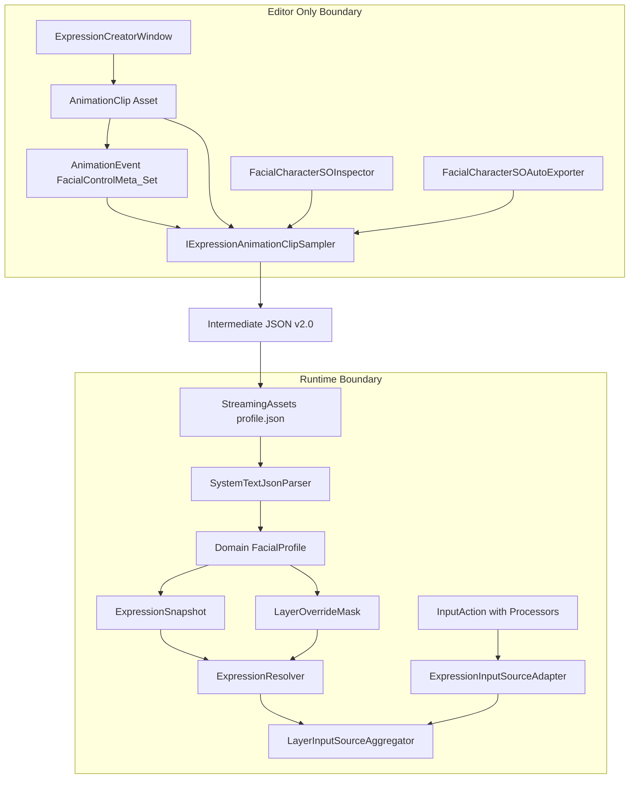
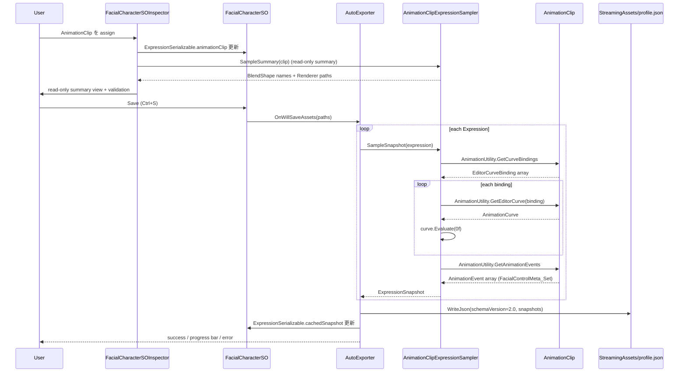
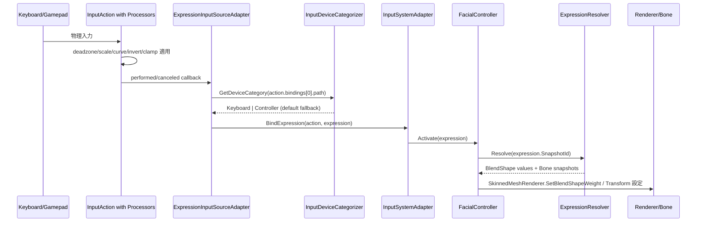
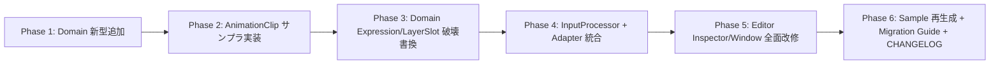
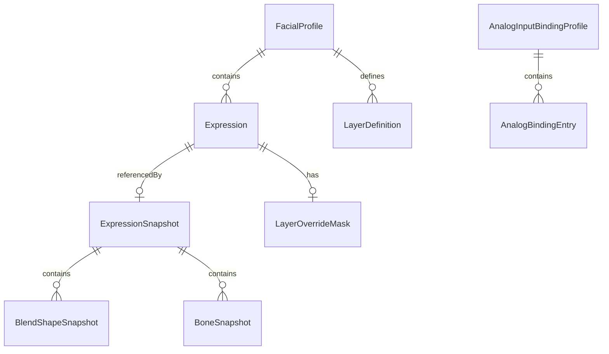

# Design Document: inspector-and-data-model-redesign

## Overview

本仕様は、`com.hidano.facialcontrol`（コア）+ `com.hidano.facialcontrol.inputsystem`（InputSystem 連携）の 2 パッケージにまたがる Inspector UX 改善とコアデータモデル簡素化のための **破壊的改修** である。Source of Truth を「Inspector で手入力された複数の独立フィールド」から「**1 個の AnimationClip**」へ切り替え、TransitionDuration / TransitionCurve / BlendShapeValues / RendererPath / BonePose を全て AnimationClip から派生させる。InputSystem 側でも AnalogMappingFunction を InputAction Processor に置換し、Keyboard / Controller の二系統 InputSource を 1 個の `ExpressionInputSourceAdapter` に統合する。

**Purpose**: Unity エンジニアが Inspector 上で表情・入力バインディング設定を行う際の冗長さ・誤入力リスク・概念重複を排除する。

**Users**: FacialControl パッケージを組み込む Unity エンジニア（VTuber 配信向けキャラクター制御 / GUI エディタでの AnimationClip 作成 / ゲーム内表情制御）。

**Impact**: preview 段階の schema を破壊し、`schemaVersion: "2.0"` で再定義。Runtime は引き続き JSON ベースで動作（JSON ファースト原則維持）するが、Editor 保存時に AnimationClip → 中間 JSON snapshot へサンプリングする経路を新設する。

### Goals

- **G1**: Expression データモデルを AnimationClip 参照ベースに刷新し、TransitionDuration / TransitionCurve / BlendShapeValues / RendererPath / BonePose を AnimationClip から自動派生（Req 1, 2, 4, 5）
- **G2**: LayerSlot を `[Flags]` ビットフラグに簡素化し、layer ごとの BlendShape array を撤去（Req 3）
- **G3**: AnalogMappingFunction を InputAction Processor 6 種に置換し、`AnalogBindingEntry` を `InputActionReference + targetIdentifier + targetAxis` のみに縮退（Req 6）
- **G4**: Keyboard / Controller を `ExpressionInputSourceAdapter` 1 個に統合し、device class から自動推定（Req 7, 8）
- **G5**: Editor 保存時に AnimationClip → 中間 JSON snapshot v2.0 をサンプリング、Runtime は JSON のみ参照（Req 9）
- **G6**: Domain は Unity 非依存・Editor は UI Toolkit のみ・Runtime は 0-alloc を全て維持（Req 11, 13）

### Non-Goals

- Runtime JSON フォーマットの根本刷新（snapshot 形式の追加のみ、JSON ファースト原則は維持）
- 旧 schema を読み込む後方互換シリアライザ（preview のため不要）
- VRM / VR / モバイル / Timeline 統合（将来マイルストーン）
- 自動移行 Editor menu command（Req 10.5 に従い preview 段階では不提供、Migration Guide のみ）

## Boundary Commitments

### This Spec Owns

- **Domain Models の置換**: `Expression`, `LayerSlot`, `FacialProfile` の field set 全置換と `LayerOverrideMask` / `ExpressionSnapshot` / `BlendShapeSnapshot` / `BoneSnapshot` の新設。
- **Adapters Json / Serializable / Converter**: 中間 JSON schema v2.0 の DTO / Serializable / 変換ロジックの全面再構成。
- **Adapters InputSources**: `KeyboardExpressionInputSource` / `ControllerExpressionInputSource` の撤去と `ExpressionInputSourceAdapter` への統合。
- **InputSystem Processors**: deadzone / scale / offset / curve / invert / clamp の 6 種カスタム InputProcessor 新設。
- **Editor Inspector / Window / AutoExporter**: BonePose / RendererPath / Category UI の撤去、AnimationClip ObjectField + Layer Mask field + read-only summary view の新設、AnimationClip サンプラの実装。
- **Migration Guide & CHANGELOG**: `Documentation~/MIGRATION-v0.x-to-v1.0.md` の新規作成と Breaking Change 表記。

### Out of Boundary

- OSC（`com.hidano.facialcontrol.osc`）アダプタの InputProcessor 経路への移植（OSC は本仕様の影響を受けない、別 spec で扱う）
- Lipsync 経路（`LipSyncInputSource` / `lipsync` 予約 id）
- Sample アセット内のモデル（HatsuneMiku 等）の差し替え
- VRM / ARKit / PerfectSync の追加対応（既存サポート範囲を維持）
- Timeline 統合（将来）

### Allowed Dependencies

- Upstream: `com.unity.inputsystem` 1.17.0（custom processor + InputActionReference）, `Unity.Animation` (Editor only via `AnimationUtility`), `Unity.UIElements` (UI Toolkit)
- Shared: `Hidano.FacialControl.Domain`, `Hidano.FacialControl.Application` の既存 UseCase / Interfaces（API 互換維持）
- 制約: Domain は `Unity.Collections` のみ Engine 依存可、`UnityEngine.AnimationClip` は禁止

### Revalidation Triggers

| 変更 | 影響先 |
|------|--------|
| 中間 JSON schema v2.0 の field 追加・削除 | Runtime resolver, AutoExporter, Migration Guide |
| `LayerOverrideMask` のビット幅変更（int → ulong など） | Domain, Adapters Serializable, Inspector MaskField |
| `ExpressionInputSourceAdapter` の InputAction 受信契約変更 | Sample アセット（`*.inputactions`）, Migration Guide |
| InputProcessor のパラメータ追加（preset 増加など） | InputAction Asset の processors 文字列, Migration Guide |
| AnimationEvent functionName 予約名（`FacialControlMeta_Set`）変更 | AutoExporter, ExpressionCreatorWindow, AnimationClip 既存資産 |

## Architecture

### Existing Architecture Analysis

- **クリーンアーキテクチャの asmdef 階層**: `Domain → Application → Adapters → Editor`。Domain は `Unity.Collections` のみ参照可。
- **既存 Source of Truth**: Inspector の手入力 → `FacialCharacterProfileSO` → `BuildFallbackProfile()` → Domain `FacialProfile`。あるいは StreamingAssets `profile.json` → JSON parser → `FacialProfile`。
- **ハイブリッド入力モデル D-1**: `ExpressionTrigger`（バイナリのスタックベース）+ `ValueProvider`（直接値書き込み）を `LayerInputSourceAggregator` が weighted-sum + clamp01。本仕様はこの D-1 経路を維持する。
- **既存技術的負債**: `Expression.cs` が `BlendShapeValues + LayerSlots + TransitionCurve + TransitionDuration` を全部抱えており、Inspector で AnimationClip と二重編集状態が発生。`AnalogMappingFunction` は Domain と Adapters の両方に存在し、Inspector で `min/max/scale/offset/...` の 7 個前後の field を手入力させており UX 上の負担が大きい。

### Architecture Pattern & Boundary Map



**Architecture Integration**:

- **Selected pattern**: 既存のクリーンアーキテクチャ + Hybrid Implementation Approach（Option C）。Domain `Expression` / `LayerSlot` / `FacialProfile` は file 名維持で中身置換、`ExpressionSnapshot` / `LayerOverrideMask` 等は新規追加。
- **Domain/feature boundaries**: AnimationClip は **Editor / Adapters 境界の上にしか存在しない**。Domain は中間 JSON 由来の snapshot のみ参照する（Req 13.1）。
- **Existing patterns preserved**: D-1 ハイブリッド入力モデル / 3 レイヤー既定（emotion / lipsync / eye）/ JSON ファースト永続化 / `Activate(Expression)` の Application API / `InputSourceFactory.RegisterReserved` 経由の入力源拡張 / 0-alloc Tick 経路（`InputActionAnalogSource`）。
- **New components rationale**:
  - `ExpressionSnapshot`: AnimationClip サンプリング結果（時刻 0 の BlendShape + Bone + transition meta）の Domain 側受け皿。Domain が AnimationClip を直接参照しないための間接層。
  - `LayerOverrideMask`: layer name 配列を bit に圧縮した Domain 値型。Inspector の MaskField と 1:1 対応。
  - `IExpressionAnimationClipSampler`: AnimationClip → ExpressionSnapshot の Editor 専用サンプラ interface。Runtime asmdef からは見えない。
  - `ExpressionInputSourceAdapter`: Keyboard / Controller を統合した MonoBehaviour。`InputAction.bindings[0].path` を解析して device class を自動推定（Req 7.2）。
  - `AnalogDeadZoneProcessor` 他 5 種: Unity InputSystem 標準パターンに従う stateless `InputProcessor<float>` 実装。
- **Steering compliance**: Domain Unity 非依存（Req 13.1, 13.4）、Editor は UI Toolkit のみ（Req 13.5）、毎フレームヒープ確保ゼロ（Req 11）、TDD Red-Green-Refactor（Req 12）。

### Technology Stack

| Layer | Choice / Version | Role in Feature | Notes |
|-------|------------------|-----------------|-------|
| Frontend / CLI | UI Toolkit (`UnityEngine.UIElements`) | Inspector / ExpressionCreatorWindow の全 UI | IMGUI 新規追加禁止（Req 13.5）|
| Backend / Services | C# / Unity 6000.3.2f1 | Domain / Application / Adapters / Editor | 4 スペース、改行時中括弧、`PascalCase` |
| Data / Storage | JSON (UTF-8, JsonUtility 互換) + ScriptableObject | StreamingAssets `profile.json` v2.0 + `FacialCharacterSO` Inspector cache | 中間 JSON は AutoExporter が SO 保存時に書き出す |
| Messaging / Events | `com.unity.inputsystem` 1.17.0 InputAction + custom InputProcessor | アナログ入力の deadzone / scale / offset / curve / invert / clamp | `InputSystem.RegisterProcessor` を Runtime / Editor 双方の `[InitializeOnLoad]` / `[RuntimeInitializeOnLoadMethod]` で実行 |
| Infrastructure / Runtime | `Unity.Animation` (Editor only via `UnityEditor.AnimationUtility`) | AnimationClip → snapshot サンプリング | Runtime asmdef からは不可視（`includePlatforms: ["Editor"]`） |

詳細な評価は `research.md` の Architecture Pattern Evaluation / Design Decisions を参照。

## File Structure Plan

### Directory Structure

```
FacialControl/Packages/
├── com.hidano.facialcontrol/                       # コア
│   ├── Runtime/Domain/Models/
│   │   ├── Expression.cs                           # 改修: field set 全置換
│   │   ├── LayerSlot.cs                            # 改修: ビットフラグ縮退
│   │   ├── LayerOverrideMask.cs                    # 新規: [Flags] enum int
│   │   ├── ExpressionSnapshot.cs                   # 新規: 時刻0 snapshot 値型
│   │   ├── BlendShapeSnapshot.cs                   # 新規: rendererPath+name+value triple
│   │   ├── BoneSnapshot.cs                         # 新規: bonePath+pos/rot/scale
│   │   ├── FacialProfile.cs                        # 改修: BonePoses 配列撤去
│   │   ├── BonePose.cs                             # 撤去 (Domain 値型としては保持されない)
│   │   ├── BonePoseEntry.cs                        # 撤去
│   │   ├── AnalogBindingEntry.cs                   # 改修: Mapping field 撤去
│   │   └── AnalogMappingFunction.cs                # 撤去
│   ├── Runtime/Domain/Services/
│   │   ├── BonePoseComposer.cs                     # 保持
│   │   ├── TransitionCalculator.cs                 # 改修: preset 4 種のみ評価
│   │   ├── ExpressionResolver.cs                   # 新規: snapshot を BlendShape/Bone 値に展開
│   │   └── AnalogMappingEvaluator.cs               # 撤去
│   ├── Runtime/Adapters/Json/
│   │   ├── SystemTextJsonParser.cs                 # 改修: schema v2.0 専用
│   │   └── Dto/
│   │       ├── ExpressionDto.cs                    # 改修: snapshot field
│   │       ├── ExpressionSnapshotDto.cs            # 新規
│   │       ├── BlendShapeSnapshotDto.cs            # 新規
│   │       ├── BoneSnapshotDto.cs                  # 新規
│   │       ├── BonePoseDto.cs                      # 撤去
│   │       └── BonePoseEntryDto.cs                 # 撤去
│   ├── Runtime/Adapters/ScriptableObject/
│   │   ├── FacialCharacterProfileSO.cs             # 改修: BonePoses/RendererPath SerializeField 撤去
│   │   └── Serializable/
│   │       ├── ExpressionSerializable.cs           # 改修: animationClip + cachedSnapshot
│   │       ├── LayerSlotSerializable.cs            # 改修: LayerOverrideMask flags のみ
│   │       ├── ExpressionSnapshotSerializable.cs   # 新規
│   │       ├── FacialCharacterProfileConverter.cs  # 改修: snapshot 展開ロジック
│   │       ├── BonePoseSerializable.cs             # 撤去
│   │       ├── BonePoseEntrySerializable.cs        # 撤去
│   │       ├── AnalogBindingEntrySerializable.cs   # 改修: mapping 撤去
│   │       └── AnalogMappingFunctionSerializable.cs # 撤去
│   └── Editor/
│       ├── Sampling/
│       │   ├── IExpressionAnimationClipSampler.cs  # 新規 interface
│       │   └── AnimationClipExpressionSampler.cs   # 新規 実装
│       ├── Inspector/
│       │   └── FacialControllerEditor.cs           # 小修正: BonePose カウント表示削除
│       └── Tools/
│           └── ExpressionCreatorWindow.cs          # 改修: AnimationClip ベイク経路
└── com.hidano.facialcontrol.inputsystem/           # InputSystem 連携
    ├── Runtime/Adapters/
    │   ├── InputSources/
    │   │   ├── ExpressionInputSourceAdapter.cs     # 新規: 統合 MonoBehaviour
    │   │   ├── KeyboardExpressionInputSource.cs    # 撤去
    │   │   ├── ControllerExpressionInputSource.cs  # 撤去
    │   │   └── InputActionAnalogSource.cs          # 保持
    │   ├── Input/
    │   │   ├── InputSystemAdapter.cs               # 改修: device 推定追加
    │   │   ├── InputDeviceCategorizer.cs           # 新規: bindings[0].path → DeviceCategory
    │   │   └── FacialCharacterInputExtension.cs    # 改修: BindCategory 二重ループ統合
    │   ├── Processors/
    │   │   ├── AnalogDeadZoneProcessor.cs          # 新規 stateless
    │   │   ├── AnalogScaleProcessor.cs             # 新規
    │   │   ├── AnalogOffsetProcessor.cs            # 新規
    │   │   ├── AnalogCurveProcessor.cs             # 新規 preset 4 種
    │   │   ├── AnalogInvertProcessor.cs            # 新規
    │   │   ├── AnalogClampProcessor.cs             # 新規
    │   │   └── AnalogProcessorRegistration.cs      # 新規 [InitializeOnLoad]/[RuntimeInitializeOnLoad]
    │   └── ScriptableObject/
    │       ├── FacialCharacterSO.cs                # 改修: GetExpressionBindings(category) 撤去
    │       ├── ExpressionBindingEntry.cs           # 改修: category field 撤去
    │       └── InputSourceCategory.cs              # 撤去候補（cross-package 参照確認後）
    ├── Editor/
    │   ├── Inspector/
    │   │   └── FacialCharacterSOInspector.cs       # 大改修: BonePose/RendererPath/Category 撤去 + LayerMaskField + ClipObjectField
    │   └── AutoExport/
    │       └── FacialCharacterSOAutoExporter.cs    # 改修: サンプラ呼出経路
    ├── Documentation~/
    │   └── MIGRATION-v0.x-to-v1.0.md               # 新規
    └── Samples~/                                   # Phase 6 で再生成
        ├── MultiSourceBlendDemo/                   # AnimationClip 4 種 + profile.json v2.0
        └── AnalogBindingDemo/                      # *.inputactions に processors 埋め込み
```

### Modified Files

主要な変更ファイルは上記ディレクトリツリー内のコメントを参照。Tests も対応する `Tests/EditMode/` / `Tests/PlayMode/` 配下で書き換え（30+ ファイル）。

## System Flows

### Flow 1: Editor 保存時 AnimationClip → 中間 JSON サンプリング



**Key decisions**:
- 200ms 超で `EditorUtility.DisplayProgressBar` を発火（Req 9.5）。try/finally で `ClearProgressBar` を保証。
- 1 Expression のサンプリング失敗で SO 全体の save を abort（`OnWillSaveAssets` の paths から該当 SO を除外、Req 9.6）。

### Flow 2: Runtime 入力 → 表情遷移



**Key decisions**:
- Tick 経路（毎フレーム実行）は `InputActionAnalogSource.Tick` の既存 0-alloc 設計を維持。
- Categorizer は **`bindings[0].path` の prefix** で `<Keyboard>`, `<Gamepad>`, `<XRController>`, `<Joystick>` を判別。未認識は Controller fallback + `Debug.LogWarning`（Req 7.5）。

### Flow 3: 6-Phase Implementation Migration



各 Phase で TDD Red-Green-Refactor を完結させる。Phase 詳細は Migration Strategy セクション参照。

## Requirements Traceability

| Requirement | Summary | Components | Interfaces | Flows |
|-------------|---------|------------|------------|-------|
| 1.1 | Expression: AnimationClip 参照 + GUID Id + 派生 Name + Layer ドロップダウン | ExpressionSerializable, FacialCharacterSOInspector, Expression | `ExpressionSerializable.animationClip`, `Expression.SnapshotId` | Flow 1 |
| 1.2 | AnimationClip 名から Name 自動派生 | FacialCharacterSOInspector | (UI bind) | Flow 1 |
| 1.3 | 新規 Expression 作成時 GUID 自動生成 | FacialCharacterSOInspector | `System.Guid.NewGuid()` | Flow 1 |
| 1.4 | Layer フィールドはドロップダウン | FacialCharacterSOInspector | UI Toolkit DropdownField | Flow 1 |
| 1.5 | Expression は派生 5 値（TransitionDuration / Curve / BlendShape / RendererPath / BonePose）の独立 SerializeField を持たない | Expression, ExpressionSerializable | (field 撤去) | Flow 1 |
| 1.6 | AnimationClip null で validation error + save 阻止 | FacialCharacterSOInspector | HelpBox + disabled Save | Flow 1 |
| 1.7 | 重複 Id で validation error + save 阻止 | FacialCharacterSOInspector | HelpBox + disabled Save | Flow 1 |
| 2.1 | BlendShape 値抽出 (curve sampling) | AnimationClipExpressionSampler | `IExpressionAnimationClipSampler.SampleSnapshot` | Flow 1 |
| 2.2 | Bone pose 抽出 (Transform curve sampling) | AnimationClipExpressionSampler | 同上 | Flow 1 |
| 2.3 | Renderer path 抽出 (binding.path) | AnimationClipExpressionSampler | 同上 | Flow 1 |
| 2.4 | TransitionDuration metadata 適用 | AnimationClipExpressionSampler | `AnimationUtility.GetAnimationEvents` 経由 | Flow 1 |
| 2.5 | metadata 不在時 0.25 秒 fallback | AnimationClipExpressionSampler | (実装内 default) | Flow 1 |
| 2.6 | TransitionCurve metadata 適用、不在時 Linear fallback | AnimationClipExpressionSampler | 同上 | Flow 1 |
| 2.7 | unsupported binding を warning + skip | AnimationClipExpressionSampler | `Debug.LogWarning` | Flow 1 |
| 3.1 | LayerSlot は flags enumeration | LayerOverrideMask | `[Flags] enum LayerOverrideMask : int` | - |
| 3.2 | 複数 flag は atomic に override | ExpressionResolver | `Resolve(snapshot, mask)` | Flow 2 |
| 3.3 | Inspector multi-select flags UI | FacialCharacterSOInspector | UI Toolkit MaskField | - |
| 3.4 | priority/blend mode 等の余計 field なし | LayerOverrideMask | (構造制約) | - |
| 3.5 | zero flags で validation error | FacialCharacterSOInspector | HelpBox | - |
| 4.1 | RendererPath 手入力欄なし | FacialCharacterSOInspector | (撤去) | Flow 1 |
| 4.2 | RendererPath は AnimationClip binding path から派生 | AnimationClipExpressionSampler | 同上 | Flow 1 |
| 4.3 | read-only summary view 表示 | FacialCharacterSOInspector | UI Toolkit ListView readonly | Flow 1 |
| 4.4 | binding 不在時 informational hint | FacialCharacterSOInspector | HelpBox info | Flow 1 |
| 4.5 | AnimationClip 変更時 auto-refresh | FacialCharacterSOInspector | UI bind callback | Flow 1 |
| 5.1-5.4 | BonePose 独立フィールド撤去 + AnimationClip 統合 + 移行 | Expression, FacialProfile, AnimationClipExpressionSampler, MIGRATION-v0.x-to-v1.0.md | (field 撤去) + sampler | Flow 1 |
| 6.1 | InputProcessor 6 種実装 | AnalogDeadZone/Scale/Offset/Curve/Invert/Clamp Processor | `InputProcessor<float>` 派生 | Flow 2 |
| 6.2 | AnalogBindingEntry = ref + id + axis のみ | AnalogBindingEntry, AnalogBindingEntrySerializable | `inputActionRef + targetIdentifier + targetAxis` | Flow 2 |
| 6.3 | embedded AnalogMappingFunction 撤去 | AnalogBindingEntry, AnalogMappingFunction | (型撤去) | - |
| 6.4 | post-processor 値をそのまま採用 | InputActionAnalogSource | `InputControl<float>.ReadValue()` | Flow 2 |
| 6.5 | Migration Guide で AnalogMappingFunction → processors 文字列対応表 | MIGRATION-v0.x-to-v1.0.md | (Markdown) | - |
| 6.6 | unsupported processor combo を warning + raw value | ExpressionInputSourceAdapter | `Debug.LogWarning` | Flow 2 |
| 7.1 | Category field 撤去 | ExpressionBindingEntry | (field 撤去) | - |
| 7.2 | bindings[0].path から device 推定 | InputDeviceCategorizer | `Categorize(string path)` | Flow 2 |
| 7.3-7.5 | Keyboard/Controller/未認識の分類規則 | InputDeviceCategorizer | 同上 | Flow 2 |
| 8.1 | ExpressionInputSourceAdapter 1 個提供 | ExpressionInputSourceAdapter | `MonoBehaviour` | Flow 2 |
| 8.2 | Keyboard/Controller InputSource 撤去 | (file 削除) | - | - |
| 8.3 | adapter は両方を transparent に処理 | ExpressionInputSourceAdapter | (内部 dispatch) | Flow 2 |
| 8.4 | InputAction events を Trigger/ValueProvider sink へ route | ExpressionInputSourceAdapter | (内部 dispatch) | Flow 2 |
| 8.5 | Migration Guide で component 差し替え手順 | MIGRATION-v0.x-to-v1.0.md | - | - |
| 9.1-9.7 | Editor 保存時サンプリング + JSON v2.0 + 進捗 + abort + version-tag | AutoExporter, AnimationClipExpressionSampler, ExpressionDto | `OnWillSaveAssets`, schema v2.0 | Flow 1 |
| 10.1-10.6 | 旧 schema 拒否 + Migration Guide + CHANGELOG breaking | SystemTextJsonParser, MIGRATION-v0.x-to-v1.0.md, CHANGELOG.md | `schemaVersion == "2.0"` strict | - |
| 11.1-11.5 | Runtime 0-alloc / sampling editor only / preallocate / perf test | ExpressionResolver, ExpressionInputSourceAdapter, AnimationClipExpressionSampler | (実装制約 + perf tests) | Flow 2 |
| 12.1-12.7 | TDD + EditMode/PlayMode 配置 + naming | (全コンポーネント) | (テスト) | - |
| 13.1-13.5 | Domain Unity 非依存 + Editor asmdef + InputSystem 隔離 + UI Toolkit | (asmdef + 全コンポーネント) | (asmdef 制約) | - |

## Components and Interfaces

### Summary

| Component | Domain/Layer | Intent | Req Coverage | Key Dependencies (P0/P1) | Contracts |
|-----------|--------------|--------|--------------|--------------------------|-----------|
| `Expression` | Domain.Models | snapshot id + name + layer + override mask の純粋値型 | 1.1, 1.5, 5.1 | - | State |
| `LayerOverrideMask` | Domain.Models | `[Flags] int` の Override 対象レイヤー集合 | 3.1, 3.4 | - | State |
| `ExpressionSnapshot` | Domain.Models | 時刻 0 の BlendShape + Bone snapshot + transition meta | 1.5, 2.1, 2.2, 9.2 | - | State |
| `BlendShapeSnapshot` | Domain.Models | rendererPath + name + value の triple | 2.1, 2.3, 9.2 | - | State |
| `BoneSnapshot` | Domain.Models | bonePath + position + eulerXYZ + scale | 2.2, 9.2 | - | State |
| `AnalogBindingEntry` | Domain.Models | sourceId + sourceAxis + targetKind + targetId + targetAxis（mapping 撤去） | 6.2, 6.3 | - | State |
| `FacialProfile` | Domain.Models | 改修: BonePoses 撤去 + 既存 API 維持 | 5.1, 5.3 | - | State |
| `ExpressionResolver` | Domain.Services | snapshot を BlendShape/Bone 値に展開、LayerOverrideMask 対応 | 3.2, 9.3, 11.1 | FacialProfile (P0) | Service |
| `IExpressionAnimationClipSampler` | Editor (`com.hidano.facialcontrol`) | AnimationClip → ExpressionSnapshot サンプラ | 2.1-2.7, 9.1-9.6 | UnityEditor.AnimationUtility (P0) | Service |
| `AnimationClipExpressionSampler` | Editor 実装 | `IExpressionAnimationClipSampler` の唯一の実装 | 同上 | 同上 | Service |
| `ExpressionSerializable` | Adapters.ScriptableObject.Serializable | Inspector 用 SerializeField: id, name, layer, animationClip, layerOverrideMask, cachedSnapshot | 1.1, 1.5, 9.1 | UnityEngine.AnimationClip (P0) | State |
| `ExpressionDto` | Adapters.Json.Dto | JSON v2.0 用 DTO: id, name, layer, layerOverrideMaskNames, snapshot | 9.1, 9.2, 9.7 | (JsonUtility 互換) | State |
| `ExpressionSnapshotDto` | Adapters.Json.Dto | snapshot 直接表現 | 9.2 | - | State |
| `FacialCharacterSOInspector` | Editor (`com.hidano.facialcontrol.inputsystem`) | UI Toolkit Inspector: AnimationClip ObjectField + Layer DropdownField + LayerOverrideMask MaskField + read-only summary + validation | 1.1-1.7, 3.3, 3.5, 4.1, 4.3-4.5 | UIElements (P0), AnimationClipExpressionSampler (P0) | UI |
| `ExpressionCreatorWindow` | Editor (`com.hidano.facialcontrol`) | BlendShape スライダープレビュー + AnimationClip 双方向ベイク | 2.1, 2.2 | UnityEditor (P0) | UI |
| `FacialCharacterSOAutoExporter` | Editor (`com.hidano.facialcontrol.inputsystem`) | OnWillSaveAssets で sampler 呼出 + JSON v2.0 出力 + progress bar + abort | 9.1-9.6 | AnimationClipExpressionSampler (P0), AssetModificationProcessor (P0) | Batch |
| `ExpressionInputSourceAdapter` | Adapters.InputSources (`com.hidano.facialcontrol.inputsystem`) | Keyboard/Controller 統合 MonoBehaviour | 7.2-7.5, 8.1, 8.3, 8.4, 11.3 | UnityEngine.InputSystem (P0), InputDeviceCategorizer (P0) | Service |
| `InputDeviceCategorizer` | Adapters.Input | `bindings[0].path` → DeviceCategory 推定 | 7.2-7.5 | - | Service |
| `AnalogDeadZoneProcessor` 他 5 種 | Adapters.Processors | `InputProcessor<float>` 派生 6 種 | 6.1 | UnityEngine.InputSystem.InputProcessor (P0) | Service |
| `AnalogProcessorRegistration` | Adapters.Processors | `[InitializeOnLoad]` + `[RuntimeInitializeOnLoadMethod]` で 6 processors を登録 | 6.1 | UnityEngine.InputSystem (P0) | Service |
| `FacialCharacterSO` | Adapters.ScriptableObject (`com.hidano.facialcontrol.inputsystem`) | `GetExpressionBindings(category)` シグネチャ縮退 | 7.1, 8.1 | (既存) | State |
| `ExpressionBindingEntry` | Adapters.ScriptableObject (`com.hidano.facialcontrol.inputsystem`) | `category` field 撤去 | 7.1 | - | State |

### Domain

#### `Expression`

| Field | Detail |
|-------|--------|
| Intent | 表情エントリの最小限のデータ（id / name / layer / layer override mask / snapshot id）を保持する不変値型 |
| Requirements | 1.1, 1.5, 3.1, 5.1 |

**Responsibilities & Constraints**
- AnimationClip 由来の派生プロパティ（TransitionDuration / Curve / BlendShapeValues / RendererPath / BonePose）を **field として持たない**（Req 1.5）
- TransitionDuration / TransitionCurve / BlendShape values / Bone values は **`ExpressionSnapshot`** が保持し、`Expression` は `SnapshotId` で参照する
- 不変性（`readonly struct`）と即値コピーセマンティクス維持
- Domain Unity 非依存（Req 13.1）

##### State Management
```csharp
namespace Hidano.FacialControl.Domain.Models
{
    public readonly struct Expression
    {
        public string Id { get; }
        public string Name { get; }
        public string Layer { get; }
        public LayerOverrideMask OverrideMask { get; }
        public string SnapshotId { get; }      // ExpressionSnapshot を引き当てるキー（通常 Id と同値）

        public Expression(string id, string name, string layer, LayerOverrideMask overrideMask, string snapshotId);
    }
}
```

- **Preconditions**: id/name/layer/snapshotId は非空白
- **Postconditions**: 全 field が初期化済み、`OverrideMask` は zero でも許容（validation は Adapters/Editor 側で行う、Req 3.5）
- **Invariants**: 全 field 不変

**Implementation Notes**
- 既存 `BlendShapeValues / LayerSlots` への参照は外部全箇所で破壊変更（Phase 3）
- `ToString()` overrideは debug 用に Id + Name を返す

#### `LayerOverrideMask`

| Field | Detail |
|-------|--------|
| Intent | Expression がアクティブ時に Override 対象とする layer 集合をビットフラグで表現 |
| Requirements | 3.1, 3.4 |

**Responsibilities & Constraints**
- `[Flags] enum : int` を採用、bit 数 32（preview〜1.0 release で十分、`research.md` Topic 9）
- Domain は **bit position と layer 名の対応を関知しない**（Adapters 側で `LayerOverrideMaskBinding` 等のヘルパーが対応表を持つ）
- JSON 永続化は **layer 名配列**として行う（bit 位置の脆弱性を回避）

```csharp
namespace Hidano.FacialControl.Domain.Models
{
    [System.Flags]
    public enum LayerOverrideMask : int
    {
        None     = 0,
        Bit0     = 1 << 0,
        Bit1     = 1 << 1,
        // ... Bit31
    }
}
```

#### `ExpressionSnapshot`, `BlendShapeSnapshot`, `BoneSnapshot`

| Field | Detail |
|-------|--------|
| Intent | AnimationClip サンプリング結果の Domain 表現（時刻 0 の BlendShape values + Bone snapshots + transition meta） |
| Requirements | 1.5, 2.1, 2.2, 9.2 |

```csharp
namespace Hidano.FacialControl.Domain.Models
{
    public readonly struct ExpressionSnapshot
    {
        public string Id { get; }
        public float TransitionDuration { get; }              // Req 2.4, 2.5
        public TransitionCurvePreset TransitionCurve { get; } // Linear / EaseIn / EaseOut / EaseInOut (Req 2.6)
        public ReadOnlyMemory<BlendShapeSnapshot> BlendShapes { get; }
        public ReadOnlyMemory<BoneSnapshot> Bones { get; }
        public ReadOnlyMemory<string> RendererPaths { get; }  // Req 2.3, 4.2

        public ExpressionSnapshot(string id, float transitionDuration, TransitionCurvePreset transitionCurve,
            BlendShapeSnapshot[] blendShapes, BoneSnapshot[] bones, string[] rendererPaths);
    }

    public readonly struct BlendShapeSnapshot
    {
        public string RendererPath { get; }
        public string Name { get; }
        public float Value { get; }    // 時刻 0 における AnimationCurve.Evaluate(0f)
    }

    public readonly struct BoneSnapshot
    {
        public string BonePath { get; }
        public float PositionX { get; } public float PositionY { get; } public float PositionZ { get; }
        public float EulerX { get; }    public float EulerY { get; }    public float EulerZ { get; }
        public float ScaleX { get; }    public float ScaleY { get; }    public float ScaleZ { get; }
    }
}
```

**Implementation Notes**
- 防御的コピーを行い不変性保証（Domain 既存パターン）
- 0-alloc 維持: `ReadOnlyMemory<T>` で参照のみ保持

#### `ExpressionResolver`

| Field | Detail |
|-------|--------|
| Intent | `Expression` + `ExpressionSnapshot` + `LayerOverrideMask` から最終的な BlendShape / Bone 値を解決し、Aggregator が消費できる形で返す |
| Requirements | 3.2, 9.3, 11.1, 11.4 |

##### Service Interface
```csharp
namespace Hidano.FacialControl.Domain.Services
{
    public sealed class ExpressionResolver
    {
        public ExpressionResolver(FacialProfile profile, IReadOnlyDictionary<string, ExpressionSnapshot> snapshots);
        public bool TryResolve(string snapshotId, Span<float> blendShapeOutput, Span<BoneSnapshot> boneOutput);
    }
}
```

- **Preconditions**: 構築時 snapshots が preallocated 済（Req 11.4）。`blendShapeOutput.Length` は `profile.BlendShapeNames.Length` に等しい
- **Postconditions**: 戻り値 true で `blendShapeOutput` / `boneOutput` が更新される。0-alloc（`Dictionary<string, ExpressionSnapshot>` のみ事前確保）
- **Invariants**: snapshots は構築後 read-only

**Implementation Notes**
- Application 層 `ExpressionUseCase.Activate(Expression)` の signature は維持（既存テスト互換）
- LayerOverrideMask の解釈は呼出側 (`LayerInputSourceAggregator`) で行う

### Editor

#### `IExpressionAnimationClipSampler` / `AnimationClipExpressionSampler`

| Field | Detail |
|-------|--------|
| Intent | AnimationClip → ExpressionSnapshot サンプラ。Editor 専用、Runtime asmdef からは不可視 |
| Requirements | 2.1-2.7, 9.1-9.6, 13.2 |

##### Service Interface
```csharp
namespace Hidano.FacialControl.Editor.Sampling
{
    public interface IExpressionAnimationClipSampler
    {
        ExpressionSnapshot SampleSnapshot(string snapshotId, AnimationClip clip);
        ClipSummary SampleSummary(AnimationClip clip);  // Inspector 表示用 read-only summary
    }

    public readonly struct ClipSummary
    {
        public IReadOnlyList<string> RendererPaths { get; }
        public IReadOnlyList<string> BlendShapeNames { get; }
        public float TransitionDuration { get; }              // Req 2.4
        public TransitionCurvePreset TransitionCurve { get; }
    }
}
```

- **Preconditions**: `clip != null`
- **Postconditions**: 失敗時 `Debug.LogError` + 例外 throw（呼出側 AutoExporter が catch して save abort）
- **Invariants**: stateless（同一 clip に対して常に同一結果）

**Implementation Notes**
- 内部で `AnimationUtility.GetCurveBindings` で binding 列挙、`AnimationUtility.GetEditorCurve(clip, binding).Evaluate(0f)` で時刻 0 値取得
- `AnimationUtility.GetAnimationEvents(clip)` で `functionName == "FacialControlMeta_Set"` を抽出、`stringParameter` でキー判別、`floatParameter` で値取得
- BlendShape binding: `binding.propertyName.StartsWith("blendShape.")`
- Transform binding: `propertyName == "m_LocalPosition.x"` 等で判別
- unsupported binding は `Debug.LogWarning` + skip（Req 2.7）
- AnimationEvent metadata 不在時 fallback: TransitionDuration=0.25, TransitionCurve=Linear（Req 2.5, 2.6）

#### `FacialCharacterSOInspector`

| Field | Detail |
|-------|--------|
| Intent | UI Toolkit ベースの Inspector。AnimationClip ObjectField + Layer DropdownField + LayerOverrideMask MaskField + read-only summary + validation を提供 |
| Requirements | 1.1-1.7, 3.3, 3.5, 4.1, 4.3-4.5, 13.5 |

**Responsibilities & Constraints**
- 旧 BonePose / RendererPath 手入力 UI を物理削除（Req 4.1, 5.1）
- ExpressionBindingEntry の `category` UI を物理削除（Req 7.1）
- AnimationClip 変更時 `IExpressionAnimationClipSampler.SampleSummary` を呼び read-only summary を refresh（Req 4.5）
- validation エラー（null clip / 重複 Id / zero LayerOverrideMask）時は `HelpBox` 表示 + Save ボタン disabled（Req 1.6, 1.7, 3.5）
- Layer DropdownField のソースは `FacialCharacterProfileSO.Layers` 名リスト
- LayerOverrideMask MaskField のラベルも同じく `FacialCharacterProfileSO.Layers` から動的に bind

**Dependencies**
- Inbound: AssetMenu (CreateAssetMenu) より生成された `FacialCharacterSO` を参照（P0）
- Outbound: `IExpressionAnimationClipSampler` 経由で AnimationClip サンプリング（P0）
- External: UI Toolkit, UnityEditor（P0）

**Contracts**: UI

**Implementation Notes**
- UXML/USS は `Editor/Inspector/FacialCharacterSOInspector.uxml` に分離（既存パターン踏襲）
- Save ボタン disable は `_saveButton.SetEnabled(isValid)` で制御
- 重複 Id 検出は List 全走査（O(N²) だが N は最大 512 で許容）

#### `ExpressionCreatorWindow`

| Field | Detail |
|-------|--------|
| Intent | BlendShape スライダーで AnimationClip にベイクする / 既存 AnimationClip を逆ロードする編集ウィンドウ |
| Requirements | 2.1, 2.2, 13.5 |

**Implementation Notes**
- 既存の PreviewRenderWrapper / BlendShapeNameProvider / BoneNameProvider を再利用
- 出力先を「Domain Expression として保存」から「AnimationClip にベイク（`AnimationUtility.SetEditorCurve` + `AnimationUtility.SetAnimationEvents`）」へ変更
- 逆ロード時は `IExpressionAnimationClipSampler.SampleSummary` で初期スライダー値を復元

#### `FacialCharacterSOAutoExporter`

| Field | Detail |
|-------|--------|
| Intent | SO 保存時に AnimationClip サンプラを呼び StreamingAssets `profile.json` (v2.0) を書き出す |
| Requirements | 9.1, 9.5, 9.6 |

##### Batch / Job Contract
- **Trigger**: `AssetModificationProcessor.OnWillSaveAssets(string[] paths)`
- **Input / validation**: paths 配列。FacialCharacterSO 由来 .asset のみ対象、それ以外は素通し
- **Output / destination**: `Application.streamingAssetsPath/FacialControl/{soName}/profile.json` (UTF-8, schema v2.0)
- **Idempotency & recovery**: try/finally で `EditorUtility.ClearProgressBar()` 保証。例外発生 SO は paths から除外して save abort（Req 9.6）

**Implementation Notes**
- 200ms 経過判定: `Stopwatch` で毎 Expression サンプリング毎に確認、超過後に `DisplayProgressBar` を発火
- AnimationClip サンプリング失敗時は `Debug.LogError` + paths 除外（save abort）

### InputSystem Adapters

#### `ExpressionInputSourceAdapter`

| Field | Detail |
|-------|--------|
| Intent | Keyboard / Controller 統合の MonoBehaviour。`InputAction` callback を `ExpressionTrigger` / `ValueProvider` sink へ route。device class を自動推定 |
| Requirements | 7.2-7.5, 8.1, 8.3, 8.4, 11.3 |

##### Service Interface（疑似コード）
```csharp
namespace Hidano.FacialControl.Adapters.InputSources
{
    [DisallowMultipleComponent]
    public sealed class ExpressionInputSourceAdapter : MonoBehaviour
    {
        [SerializeField] private FacialCharacterSO _characterSO;
        // 内部: keyboard 用 / controller 用の独立した ExpressionTriggerInputSourceBase インスタンスを保持
        private void OnEnable()  { SubscribeBindings(); }
        private void OnDisable() { UnsubscribeBindings(); }
    }
}
```

**Responsibilities & Constraints**
- 1 GameObject に 1 個 attach（`[DisallowMultipleComponent]`）
- 内部に `keyboardSource: ExpressionTriggerInputSourceBase` / `controllerSource: ExpressionTriggerInputSourceBase` の 2 インスタンスを保持し、独立した Expression スタックを維持（D-12 既存挙動）
- 各 InputAction の `bindings[0].path` を `InputDeviceCategorizer` で分類して dispatch
- per-frame の `performed` callback は 0-alloc（`InputAction.CallbackContext` は struct で boxing なし、内部の Dictionary lookup は preallocated）（Req 11.3）
- 未認識 device は Controller 側に dispatch + `Debug.LogWarning` 1 回（Req 7.5）
- unsupported processor combo 検知時は raw value で続行 + `Debug.LogWarning`（Req 6.6）

**Dependencies**
- Inbound: Scene 上の `FacialController` MonoBehaviour（P0）
- Outbound: `InputDeviceCategorizer`（P0）, `InputSystemAdapter`（P0）, `FacialController.Activate/Deactivate`（P0）
- External: `UnityEngine.InputSystem`（P0）

**Contracts**: Service, Event（InputAction.performed/canceled）

**Implementation Notes**
- 既存 `KeyboardExpressionInputSource` / `ControllerExpressionInputSource` は内部で `ExpressionTriggerInputSourceBase` を継承していたが、本 adapter は **継承せず保有する**（コンポジション）。`Category` プロパティは外部公開しない（自動推定のため不要）
- `FacialCharacterInputExtension.BindCategory` の二重ループは本 adapter が吸収するため呼出側は単一ループ化

#### `InputDeviceCategorizer`

| Field | Detail |
|-------|--------|
| Intent | `InputAction.bindings[0].path` から DeviceCategory を推定 |
| Requirements | 7.2-7.5 |

##### Service Interface
```csharp
namespace Hidano.FacialControl.Adapters.Input
{
    public enum DeviceCategory { Keyboard, Controller }

    public static class InputDeviceCategorizer
    {
        public static DeviceCategory Categorize(string bindingPath, out bool wasFallback);
    }
}
```

**Implementation Notes**
- prefix で判別: `<Keyboard>` → Keyboard、`<Gamepad>` / `<Joystick>` / `<XRController>` / `<Pen>` / `<Touchscreen>` → Controller（Touch は便宜上 Controller 扱い）
- 未認識 prefix は `wasFallback=true` で Controller を返す（Req 7.5）。呼出側が warning ログを 1 回だけ出す
- 0-alloc: 文字列の StartsWith は `stringComparison: Ordinal` で alloc なし

#### `AnalogDeadZoneProcessor`, `AnalogScaleProcessor`, `AnalogOffsetProcessor`, `AnalogCurveProcessor`, `AnalogInvertProcessor`, `AnalogClampProcessor`

| Field | Detail |
|-------|--------|
| Intent | Unity InputSystem 標準パターンに従う stateless `InputProcessor<float>` 派生 6 種 |
| Requirements | 6.1, 6.4 |

##### Service Interface（代表例）
```csharp
namespace Hidano.FacialControl.Adapters.Processors
{
    public sealed class AnalogDeadZoneProcessor : InputProcessor<float>
    {
        public float min = 0f;
        public float max = 1f;

        public override float Process(float value, InputControl control)
        {
            float abs = Mathf.Abs(value);
            if (abs <= min) return 0f;
            float normalized = (abs - min) / Mathf.Max(0.0001f, max - min);
            return Mathf.Sign(value) * Mathf.Clamp01(normalized);
        }
    }

    public sealed class AnalogCurveProcessor : InputProcessor<float>
    {
        public int preset = 0; // 0=Linear, 1=EaseIn, 2=EaseOut, 3=EaseInOut

        public override float Process(float value, InputControl control)
        {
            return preset switch
            {
                1 => value * value,                 // EaseIn
                2 => 1f - (1f - value) * (1f - value), // EaseOut
                3 => /* EaseInOut */ ...,
                _ => value,                         // Linear
            };
        }
    }
}
```

**Responsibilities & Constraints**
- **stateless**（`research.md` Topic 3）。インスタンス間で共有可能な状態を持たない
- 全 processor は public な float field のみを serialize（AnimationCurve や string は不可）
- `AnalogProcessorRegistration` で `[InitializeOnLoad]` + `[RuntimeInitializeOnLoadMethod(RuntimeInitializeLoadType.BeforeSceneLoad)]` で 6 個一括登録

**Implementation Notes**
- preset は数値 enum と等価（int 直接保存）
- 順序付けは InputAction Asset 側の processor チェーン文字列で制御（例: `"deadZone(min=0.1),scale(factor=2),curve(preset=1),clamp(min=0,max=1)"`）

### Adapters Json / Serializable

#### `ExpressionDto` / `ExpressionSnapshotDto` / `BlendShapeSnapshotDto` / `BoneSnapshotDto`

詳細スキーマは Data Models セクション参照。

#### `ExpressionSerializable`

```csharp
namespace Hidano.FacialControl.Adapters.ScriptableObject.Serializable
{
    [Serializable]
    public sealed class ExpressionSerializable
    {
        public string id;
        public string name;
        public string layer;
        public AnimationClip animationClip;
        public List<string> layerOverrideMask = new List<string>(); // layer 名配列で永続化
        public ExpressionSnapshotSerializable cachedSnapshot;       // Editor サンプリング結果のキャッシュ
    }
}
```

**Implementation Notes**
- `cachedSnapshot` は Inspector が AnimationClip サンプリング結果を SO 内に保持し、Runtime 経路（StreamingAssets JSON 不在時）で `BuildFallbackProfile` から参照される
- 旧 `transitionDuration / transitionCurve / blendShapeValues / layerSlots` は撤去

#### `AnalogBindingEntry` (Domain) / `AnalogBindingEntrySerializable` (Adapters)

```csharp
// Domain 側
public readonly struct AnalogBindingEntry
{
    public string SourceId { get; }
    public int SourceAxis { get; }
    public AnalogBindingTargetKind TargetKind { get; }
    public string TargetIdentifier { get; }
    public AnalogTargetAxis TargetAxis { get; }
    // Mapping field 撤去
}

// Adapters Serializable 側
[Serializable]
public sealed class AnalogBindingEntrySerializable
{
    public InputActionReference inputActionRef;
    public AnalogBindingTargetKind targetKind;
    public string targetIdentifier;
    public AnalogTargetAxis targetAxis;
    // mapping field 撤去
}
```

## Data Models

### Domain Model



**Aggregates and invariants**:
- `FacialProfile`: 集約ルート。`SchemaVersion = "2.0"`, `Layers`, `Expressions`, `RendererPaths`（read-only summary 用）, `LayerInputSources`（既存）。`BonePoses` は撤去（Req 5.1）
- `Expression`: 値型。`Id` 一意、`Layer` は `FacialProfile.Layers` 内に存在必須、`OverrideMask` は zero でも許容（validation は外側）
- `ExpressionSnapshot`: 値型。`Id == Expression.SnapshotId` で 1:1 対応
- `LayerOverrideMask`: 値型 enum、bit position は **`FacialProfile.Layers` のインデックス順**で対応するが、永続化時は **layer 名配列**で表現
- `AnalogBindingEntry`: 値型。`Mapping` field 撤去後は構造的に純粋な「source → target 写像」のみ

### Logical Data Model: 中間 JSON Schema v2.0

```json
{
  "schemaVersion": "2.0",
  "layers": [
    { "name": "emotion", "priority": 0, "exclusionMode": "LastWins", "inputSources": [...] },
    { "name": "lipsync", "priority": 1, "exclusionMode": "Blend",    "inputSources": [...] },
    { "name": "eye",     "priority": 2, "exclusionMode": "LastWins", "inputSources": [...] }
  ],
  "expressions": [
    {
      "id": "550e8400-e29b-41d4-a716-446655440000",
      "name": "Smile",
      "layer": "emotion",
      "layerOverrideMask": ["emotion", "eye"],
      "snapshot": {
        "transitionDuration": 0.25,
        "transitionCurvePreset": "Linear",
        "blendShapes": [
          { "rendererPath": "Body", "name": "Smile",   "value": 1.0 },
          { "rendererPath": "Body", "name": "EyeShut", "value": 0.5 }
        ],
        "bones": [
          {
            "bonePath": "Armature/Head",
            "position": [0.0, 0.0, 0.0],
            "rotationEuler": [0.0, 5.0, 0.0],
            "scale": [1.0, 1.0, 1.0]
          }
        ],
        "rendererPaths": ["Body"]
      }
    }
  ],
  "rendererPaths": ["Body"]
}
```

**Consistency & Integrity**:
- `expressions[].layer` は `layers[].name` のいずれかと一致必須
- `expressions[].layerOverrideMask[]` の各文字列は `layers[].name` のいずれかと一致必須（不一致は Adapters 層で warning + skip）
- `expressions[].snapshot.rendererPaths[]` の各文字列はトップレベル `rendererPaths[]` の subset
- `schemaVersion != "2.0"` のロードは parser が `Debug.LogError` + 例外で拒否（Req 10.1）

### Physical Data Model: ScriptableObject Inspector State

`FacialCharacterSO` (`com.hidano.facialcontrol.inputsystem`) の SerializeField:
- `_schemaVersion: string` ← `"2.0"` で初期化
- `_layers: List<LayerDefinitionSerializable>` ← 既存
- `_expressions: List<ExpressionSerializable>` ← 改修（field 全置換）
- `_rendererPaths: List<string>` ← Inspector では read-only summary、AutoExporter が AnimationClip サンプラから自動算出して update
- `_inputActionAsset: InputActionAsset` ← 既存
- `_actionMapName: string` ← 既存
- `_expressionBindings: List<ExpressionBindingEntry>` ← 改修（category field 撤去）
- `_analogBindings: List<AnalogBindingEntrySerializable>` ← 改修（mapping field 撤去）
- `_referenceModel: GameObject` (`UNITY_EDITOR` only) ← 既存

**撤去**: `_bonePoses: List<BonePoseSerializable>`

### Data Contracts & Integration

**API Data Transfer (StreamingAssets JSON v2.0)**:
- 上記 JSON 例の通り
- `JsonUtility` 互換のため、配列は `List<T>` 風 / 全 field public + `[Serializable]` クラスで表現
- Serialization format: UTF-8 JSON

**AnimationClip メタデータ Contract (clip events)**:
- `AnimationEvent.functionName == "FacialControlMeta_Set"` 予約
- `stringParameter` で key 識別（`"transitionDuration"` / `"transitionCurvePreset"`）
- `floatParameter` で値運搬（preset enum 整数も float として）
- `time` は 0 固定
- 1 AnimationClip 内に同名 key の AnimationEvent が複数あれば最初の 1 個のみ採用、警告 1 回

**Cross-Service Data Management**:
- `com.hidano.facialcontrol.osc` パッケージは本仕様のスコープ外。Domain `AnalogBindingEntry`（mapping 撤去後）を共有するため、OSC 側で別途 mapping 相当の処理を再実装する将来作業が発生する（別 spec）

## Error Handling

### Error Strategy

エラーは Unity 標準ログ（`Debug.Log/Warning/Error`）のみで報告。カスタム例外型は標準例外を超えて作らない（steering契約）。

### Error Categories and Responses

| Category | Trigger | Response |
|----------|---------|----------|
| **User Errors (Inspector validation)** | AnimationClip null / 重複 Id / zero LayerOverrideMask / Layer 未定義参照 | `HelpBox` Error 表示 + Save ボタン disabled（Req 1.6, 1.7, 3.5） |
| **Sampling Errors** | AnimationClip サンプリング中に NullReference / Asset 削除 / unsupported binding | `Debug.LogWarning`（unsupported binding skip / Req 2.7）または `Debug.LogError` + 例外 throw（致命的）。AutoExporter が catch して当該 SO の save を abort（Req 9.6） |
| **Schema Errors** | 旧 schema (`schemaVersion != "2.0"`) ロード | `SystemTextJsonParser` が `Debug.LogError` + `InvalidOperationException` throw、`LoadProfile()` の catch 経路で `BuildFallbackProfile()` に降格（Req 10.1） |
| **Input Categorization Errors** | 未認識 device prefix | `Debug.LogWarning` 1 回（プレフィックスごとに 1 回）+ Controller fallback（Req 7.5） |
| **Processor Combination Errors** | InputAction Asset の processors 文字列で未登録 processor 名検出 | `ExpressionInputSourceAdapter` が `Debug.LogWarning` + raw value（Req 6.6） |
| **System Errors** | StreamingAssets I/O 失敗 | 既存挙動踏襲: `Debug.LogWarning` + `BuildFallbackProfile()` に降格 |

### Monitoring

- ログレベル指針: User Error は Warning、サンプリング致命傷は Error、その他は Warning
- ログメッセージ prefix: `[FacialControl]` を付与、対象 SO 名を含める

## Testing Strategy

### Unit Tests (EditMode)

1. **`ExpressionTests`**: snapshot id / layer / mask の値型不変性
2. **`LayerOverrideMaskTests`**: bit 演算、layer 名配列との往復変換
3. **`ExpressionSnapshotTests`**: defensive copy, ReadOnlyMemory 不変性
4. **`AnimationClipExpressionSamplerTests`** (Req 12.4): モックのテンポラリ AnimationClip + GetCurveBindings に対して期待 snapshot を返す
5. **`SystemTextJsonParserV2Tests`**: schema v2.0 round-trip, schema v1.0 拒否
6. **`FacialCharacterProfileConverterTests`**: SO Serializable → Domain 変換、null/空配列の境界
7. **`AnalogBindingEntryTests`**: mapping field 不在の構造制約

### Integration Tests (PlayMode)

1. **`ExpressionInputSourceAdapterTests`** (Req 12.5): InputTestUtils で keyboard / gamepad device を simulate し、対応する Expression がアクティブ化される
2. **`InputDeviceCategorizerPlayModeTests`**: 実 InputDevice 上での bindings[0].path 解析
3. **`TransitionInterpolationTests`**: LayerOverrideMask 経由の複数レイヤー atomic override（Req 3.2）
4. **`AnalogProcessorChainTests`**: deadzone → scale → curve → clamp の連結評価が期待値を返す

### Performance Tests (PlayMode/Performance)

1. **`ExpressionResolverAllocationTests`** (Req 11.5): 100 frames で `GC.GetTotalMemory` delta が 0
2. **`ExpressionInputSourceAdapterAllocationTests`** (Req 11.5, 12.7): InputAction.performed 100 回で 0-alloc
3. **`AnalogProcessorAllocationTests`**: 6 種 processor 連結で per-Process 0-alloc

### Test Placement Rules（既存 steering 踏襲）

| 配置先 | 基準 | 本仕様での代表例 |
|--------|------|------------------|
| EditMode | モック・Fake のみ、同期実行 | AnimationClip サンプラ、JSON parser、Domain ロジック |
| PlayMode | InputSystem 実 device、MonoBehaviour ライフサイクル、frame 同期 | ExpressionInputSourceAdapter、performance |

## Security Considerations

本仕様の影響範囲では external network / auth / 個人情報を扱わないため、追加の security control は不要。既存契約（`Debug.Log` のみ・no telemetry）を維持。

## Performance & Scalability

| 指標 | 目標 | 検証方法 |
|------|------|----------|
| Runtime per-frame heap allocation | 0 byte（steady state） | `ExpressionResolverAllocationTests` / `ExpressionInputSourceAdapterAllocationTests` |
| AnimationClip サンプリング遅延 | 1 Expression あたり < 50ms（典型 ~10 BlendShapes） | EditMode benchmark |
| Inspector 描画 | 50 Expression entries で 60fps | 手動確認 |
| 同時キャラクター | 10 体の `FacialController` で全体 < 1ms / frame | `MultiCharacterPerformanceTests`（既存） |

具体的な計測は steering の Performance Standards 準拠。

## Migration Strategy

### 6-Phase Implementation Plan

```mermaid
graph TB
    subgraph Phase1[Phase 1: Domain 新型追加]
        P1A[ExpressionSnapshot 新規]
        P1B[LayerOverrideMask 新規]
        P1C[BlendShapeSnapshot/BoneSnapshot 新規]
        P1Test[Domain Tests Red→Green]
    end

    subgraph Phase2[Phase 2: AnimationClip サンプラ実装]
        P2A[IExpressionAnimationClipSampler]
        P2B[AnimationClipExpressionSampler]
        P2Test[EditMode Tests Red→Green]
    end

    subgraph Phase3[Phase 3: Domain Expression/LayerSlot 破壊書換]
        P3A[Expression 中身置換]
        P3B[LayerSlot ビットフラグ縮退]
        P3C[FacialProfile.BonePoses 撤去]
        P3D[BonePose/AnalogMappingFunction 撤去]
        P3Test[Tests 大量書換]
    end

    subgraph Phase4[Phase 4: InputProcessor + Adapter 統合]
        P4A[6 種 InputProcessor]
        P4B[ExpressionInputSourceAdapter]
        P4C[InputDeviceCategorizer]
        P4D[Keyboard/Controller InputSource 撤去]
        P4Test[PlayMode Tests Red→Green]
    end

    subgraph Phase5[Phase 5: Editor Inspector/Window 全面改修]
        P5A[FacialCharacterSOInspector 改修]
        P5B[ExpressionCreatorWindow 改修]
        P5C[FacialCharacterSOAutoExporter 改修]
    end

    subgraph Phase6[Phase 6: Sample 再生成 + Migration Guide + CHANGELOG]
        P6A[MultiSourceBlendDemo 再生成]
        P6B[AnalogBindingDemo 再生成]
        P6C[MIGRATION-v0.x-to-v1.0.md]
        P6D[CHANGELOG.md Breaking Change]
    end

    Phase1 --> Phase2
    Phase2 --> Phase3
    Phase3 --> Phase4
    Phase4 --> Phase5
    Phase5 --> Phase6
```



### Phase-by-Phase Test Strategy

| Phase | Red Tests | Green Criteria |
|-------|-----------|----------------|
| 1 | `ExpressionSnapshotTests`, `LayerOverrideMaskTests`, `BlendShapeSnapshotTests`, `BoneSnapshotTests` | 各値型のコンストラクタ + 不変性が緑、既存 Domain は無傷 |
| 2 | `AnimationClipExpressionSamplerTests` | テンポラリ AnimationClip → 期待 snapshot を返す。AnimationEvent 経由の duration / curve も読める |
| 3 | 既存 30+ Tests を一斉書換（`ExpressionTests`, `LayerSlotTests`, `BonePoseTests` 削除, `FacialProfileBonePosesBackwardCompatTests` 削除等） | 旧 field を参照しない。CI 全 green |
| 4 | `InputDeviceCategorizerPlayModeTests`, `ExpressionInputSourceAdapterTests`, `AnalogProcessorChainTests` | InputTestUtils 経由で keyboard / gamepad 両方 dispatch。0-alloc 確認 |
| 5 | UI Toolkit の Inspector smoke test（手動 + `FacialCharacterSOInspectorTests`） | validation エラー表示 + save 阻止 + read-only summary refresh |
| 6 | Sample アセットを Unity から開いて Scene 結線が崩れないこと、UPM Import で同等動作 | 動作確認のみ（自動テストなし） |

### Sample 再生成手順 (Phase 6)

1. `Samples~/MultiSourceBlendDemo/`: AnimationClip 4 種（Smile / Anger / Surprise / Lipsync_A）を新規生成、AnimationEvent でメタデータ詰め、`MultiSourceBlendDemoCharacter.asset` を新 schema で再構成、`profile.json` を v2.0 で書き出し
2. `Samples~/AnalogBindingDemo/`: `*.inputactions` ファイルに deadzone/scale/clamp processor を埋め込み、`AnalogBindingDemoCharacter.asset` を mapping field 不在で再構成
3. `Assets/Samples/FacialControl InputSystem/0.1.0-preview.1/` 配下にも対応する asset を **手動 copy で同期**（CLAUDE.md 二重管理ルール）
4. preview バージョンを `0.1.0-preview.2` 等に bump

### Migration Guide 構造（`Documentation~/MIGRATION-v0.x-to-v1.0.md`）

```
# Migration Guide v0.x → v1.0

## 1. Schema 差分一覧表
## 2. Step-by-Step 手順
   2.1 Backup 既存 SO / JSON
   2.2 LayerSlot.blendShapeValues[] → AnimationClip 結合
   2.3 FacialProfile.BonePoses[] → AnimationClip Transform curves
   2.4 AnalogMappingFunction → InputAction processors 文字列対応表
   2.5 ExpressionBindingEntry.category → 削除
   2.6 KeyboardExpressionInputSource / ControllerExpressionInputSource → ExpressionInputSourceAdapter 差し替え
## 3. AnimationClip メタデータ運搬規約（FacialControlMeta_Set 予約名）
## 4. 既知の制限
## 5. 自動移行 menu の不在に関する説明
```

### Rollback Triggers

- Phase 3 完了後に CI が long red のまま 2 日経過 → Phase 1〜2 までを別 PR として merge し Phase 3 を独立 PR で進める
- Phase 6 で UPM 経由ユーザー側に sample 動作不良が判明 → 該当 Phase の commit を revert + hotfix release

## Open Questions

| ID | 質問 | 影響範囲 | 解決時期 |
|----|------|---------|---------|
| OQ1 | `InputSourceCategory` enum を完全撤去するか、`com.hidano.facialcontrol.osc` で再利用するか確認 | InputSystem 連携 + OSC 連携 | Phase 4 着手前に grep で参照箇所を再確認 |
| OQ2 | LayerOverrideMask の bit-name 対応表の責務を Adapters と Editor のどちらに置くか（Domain は関知しない） | Adapters helper 設計 | Phase 1 実装中に確定 |
| OQ3 | AnalogCurveProcessor の preset 4 種で実用上不足が出た場合の path（複数 processor 直列か独自拡張か） | Migration Guide / 1.0 release 後の feedback | preview ユーザーフィードバック待ち |
| OQ4 | ExpressionCreatorWindow の AnimationClip ベイク UI で「TransitionDuration / Curve preset」を編集する UI 配置（既存スライダーペイン下部か別 foldout か） | UX | Phase 5 実装中に確定 |
| OQ5 | AnimationClip サンプリング 0-alloc 制約（Editor only なので緩和可能だが、頻繁 save 時のレスポンスに影響）の緩和度合い | Editor UX | Phase 2 実装中に benchmark で確定 |
| OQ6 | `LayerInputSources` の既存 round-trip 互換性が schema v2.0 でどう movein するか（既存 v1.0 では layers[i].inputSources を `FacialProfile.LayerInputSources` で再現） | Json schema | Phase 2 着手前に確定 |

## Supporting References

- 詳細な discovery findings, design alternatives 評価, decision rationale は `research.md` 参照
- gap-analysis findings は `gap-analysis.md` 参照
- 関連 Unity API ドキュメント:
  - [AnimationUtility.GetCurveBindings](https://docs.unity3d.com/ScriptReference/AnimationUtility.GetCurveBindings.html)
  - [AnimationUtility.GetEditorCurve](https://docs.unity3d.com/ScriptReference/AnimationUtility.GetEditorCurve.html)
  - [AnimationEvent](https://docs.unity3d.com/ScriptReference/AnimationEvent.html)
  - [InputProcessor (Input System 1.12)](https://docs.unity3d.com/Packages/com.unity.inputsystem@1.12/api/UnityEngine.InputSystem.InputProcessor.html)
  - [Input System Processors Manual (1.11)](https://docs.unity3d.com/Packages/com.unity.inputsystem@1.11/manual/Processors.html)
