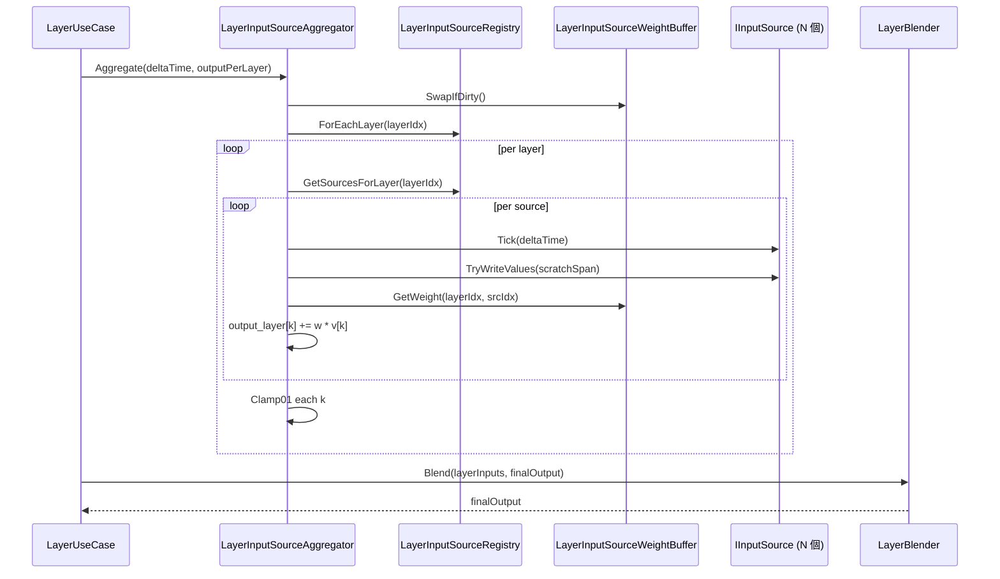
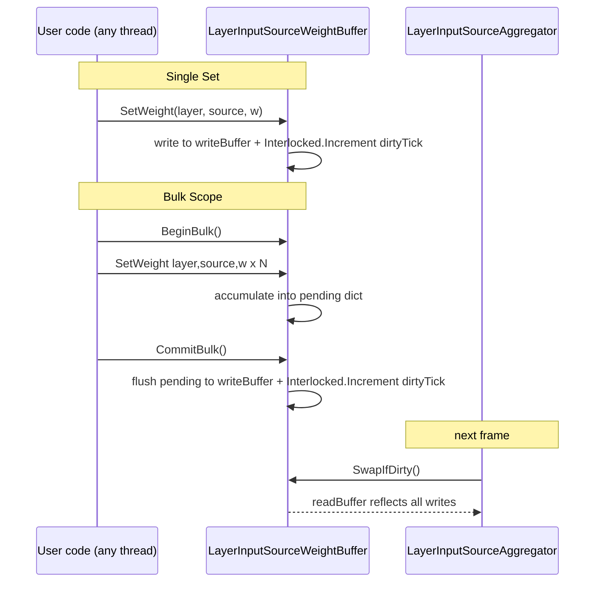
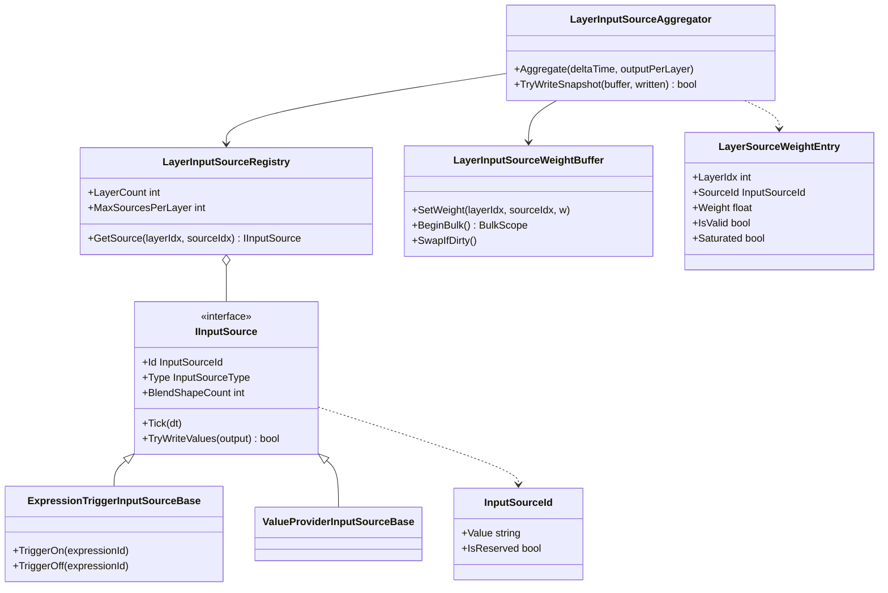
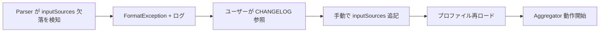

# Design Document — layer-input-source-blending

## Overview

**Purpose**: 同一レイヤー内で **複数の入力源** を重み付き合成できるようにし、コントローラ / フェイシャルキャプチャ / リップシンクを自在に併用・切替できる表情制御基盤を Unity エンジニアに提供する。

**Users**: VTuber 配信システム / Unity ゲーム表情制御を構築する Unity エンジニア。彼らは JSON プロファイルでレイヤーごとに `inputSources` を宣言し、シーン中のゲームプレイ状況に応じてランタイム API で入力源ウェイトを切り替える。

**Impact**: 既存 `LayerBlender` の公開 API を非破壊のまま、内部に **Domain 層の新サービス `LayerInputSourceAggregator`** と **Adapters 層の具体入力源アダプタ群** を挿入する。これにより「レイヤー毎に単一の BlendShape 配列」だった入力モデルが「レイヤー毎に複数ソースの加重和」へ拡張される。JSON スキーマに **必須フィールド `inputSources`** が追加される（preview 段階の破壊的変更、D-5）。

### Goals
- D-1 ハイブリッドモデル（Expression トリガー型 / BlendShape 値提供型）を単一の `IInputSource` 契約で表現する。
- D-2 加重和 + 最終クランプによるレイヤー内合成を GC フリーで実装する（Req 6.1）。
- D-3 既存 `LayerBlender.Blend` 呼出し契約を維持したまま 2 段パイプラインを構築する。
- D-7 ランタイムウェイト変更を OscDoubleBuffer パターン踏襲で lock-free に実装する。
- D-14 Expression スタック + Transition バッファをプロファイルロード時に一括確保し、per-frame 0-alloc を保証する。
- EditMode テスト（fake アダプタ）・PlayMode Performance テスト（GC ゼロ検証）で全要件を被覆する。

### Non-Goals
- BlendShape 単位のルーティング（1 つの BlendShape だけを特定の入力源に割当てる機能）— Req Boundary で out of scope。
- 新規入力源プラグイン API（Web カメラトラッキング等の追加センサー）— 既存抽象範囲で扱う。
- Editor で入力源ウェイトを編集する GUI — Inspector は読取専用のみ（D-11, Req 8.6）。
- Timeline / AnimationClip からのウェイト自動操作 — 将来の別 spec。
- 既存プロファイル（`inputSources` 未宣言）の自動マイグレーションスクリプト — preview 破壊的変更許容（D-5, Req 7.4）。

## Boundary Commitments

### This Spec Owns
- **`IInputSource` 契約とその 2 系統実装**（Expression トリガー型 / BlendShape 値提供型）。
- **`LayerInputSourceAggregator`**: per-layer `float[]` を加重和で合成する Domain サービス。
- **`LayerInputSourceWeightBuffer`**: 入力源ウェイトのダブルバッファ（D-7）。
- **`LayerInputSourceRegistry`**: レイヤー × ソース ID → `IInputSource` の対応表と、Expression スタック・Transition バッファのプール（D-14）。
- **JSON スキーマ拡張**: `layers[].inputSources` フィールドの parse / serialize / validation（D-5, D-6, D-15）。
- **予約 ID 一式**: `osc`, `lipsync`, `controller-expr`, `keyboard-expr`, `input`（D-6）。
- **4 つの具体アダプタ**: `ControllerExpressionInputSource`, `KeyboardExpressionInputSource`, `OscInputSource`, `LipSyncInputSource`（Req 5）。
- **診断スナップショット API**: `TryWriteSnapshot` / `GetSnapshot`（Req 8.1, D-9）。
- **Inspector 読取専用ビュー**（Req 8.6, D-11）— Editor 層の小さな追加。

### Out of Boundary
- 既存 `LayerBlender.Blend` / `LayerBlender.ApplyLayerSlotOverrides` の **シグネチャ改変**（Req 7.1 で明示的に禁止）。
- 既存 `FacialController` / `LayerUseCase` の外部 API の破壊的改変（内部実装は Aggregator に委譲する形で差し替えるが、呼出し側からは同じ）。
- OSC / InputSystem / uLipSync 自体の拡張。
- AnimationClip / Timeline 経由の表情駆動。
- ScriptableObject 編集 UI で inputSources を編集する Inspector 拡張（D-11）。

### Allowed Dependencies
- Domain 層 `IInputSource` → 既存 `TransitionCalculator` / `ExclusionResolver` / `Expression` / `LayerSlot`（純関数として呼出し）。
- Adapters 層 `ControllerExpressionInputSource` / `KeyboardExpressionInputSource` → 既存 `InputSystemAdapter` / `InputBindingProfileSO`（カテゴリ拡張は本 spec 範囲）。
- Adapters 層 `OscInputSource` → 既存 `OscDoubleBuffer` / `OscReceiver`（`WriteTick` カウンタ 1 個を追加する軽微改修のみ）。
- Adapters 層 `LipSyncInputSource` → 既存 `ILipSyncProvider`（無改修）。
- Application 層 `LayerUseCase`（無破壊で内部差し替え）。

### Revalidation Triggers
- `IInputSource` の契約変更（追加メソッド・戻り値型変更）。
- 予約 ID 一覧の変更（`osc` / `lipsync` / `controller-expr` / `keyboard-expr` / `input` の追加や削除）。
- JSON スキーマの後方非互換な変更（schemaVersion bump が伴う）。
- ダブルバッファスレッドポリシーの変更（Req 4.4 の契約変更）。
- `LayerBlender` 公開 API のシグネチャ変更（本 spec は維持を約束している）。

## Architecture

### Existing Architecture Analysis

本機能はクリーンアーキテクチャ 4 層（Domain / Application / Adapters / Presentation）に従う既存コードベースを拡張する。

- **Domain 層**: `LayerBlender` / `TransitionCalculator` / `ExclusionResolver` / `FacialProfile` / `Expression` は Unity 非依存・静的関数中心・Span 使用で GC フリーの実装パターン。本 spec は **このレイヤーに `LayerInputSourceAggregator` と `IInputSource` 抽象を追加** する（既存パターン踏襲）。
- **Application 層**: `LayerUseCase` が per-layer Transition 状態を管理している。本 spec では `LayerUseCase` の内部実装を Aggregator 呼出しに段階的に差し替える（API 非破壊、Req 7.1）。
- **Adapters 層**: `OscDoubleBuffer`（ダブルバッファパターン）、`InputSystemAdapter`（`InputAction` → Expression）、`SystemTextJsonParser`（`JsonUtility` + DTO）の既存パターンをそのまま 4 つの新アダプタに踏襲する。
- **GC フリー慣習**: 全ホットパスは `Span` / `ReadOnlySpan` / `NativeArray` を使い、per-frame に `new` を避ける。本 spec の `Aggregate()` も同規約に準拠。

### Architecture Pattern & Boundary Map

**Architecture Integration**:
- **Selected pattern**: Clean Architecture + Hybrid Strategy (D-1)。`IInputSource` を単一の strategy 型とし、その 2 つの抽象クラス（`ExpressionTriggerInputSourceBase`, `ValueProviderInputSourceBase`）で内部挙動を分岐。
- **Domain/feature boundaries**:
  - Domain が所有: `IInputSource`, `LayerInputSourceAggregator`, `LayerInputSourceWeightBuffer`, `LayerInputSourceRegistry`, `LayerSourceWeightEntry`, `InputSourceId`, `ExpressionTriggerInputSourceBase`, `ValueProviderInputSourceBase`。
  - Adapters が所有: 具体アダプタ 4 種 + JSON DTO + Inspector View。
  - Application が所有: `LayerUseCase` の内部ロジック差し替え。
- **Existing patterns preserved**:
  - `stackalloc int[N]` による小規模配列の GC 回避（`LayerBlender` 踏襲）。
  - `Interlocked.Exchange` による double buffer swap（`OscDoubleBuffer` 踏襲）。
  - `ReadOnlyMemory<float>` による防御的コピーなし参照（`LayerInput` 踏襲）。
  - `static` 純関数ブレンダ + 状態持ち `UseCase` の役割分離。
- **New components rationale**:
  - `LayerInputSourceAggregator` — D-3 の 2 段パイプライン intra-layer 段を担う唯一の責務。
  - `IInputSource` — D-1 の Hybrid 契約を表現する抽象（ILipSyncProvider と同じ Domain 配置）。
  - `LayerInputSourceWeightBuffer` — D-7 のダブルバッファを切り出して単体テスト容易性を上げる（`OscDoubleBuffer` の兄弟）。
  - `LayerInputSourceRegistry` — D-14 のプール管理を凝集し、Aggregator は登録情報のみ引く。
- **Steering compliance**:
  - `CLAUDE.md` のレイヤー別 namespace（`Hidano.FacialControl.{Domain,Application,Adapters}.*`）に準拠。
  - 4 スペースインデント、C# `public/private` 明示、`_camelCase` プライベート、`I` プレフィックス維持。
  - TDD（EditMode 単体 → PlayMode Performance）。
  - 毎フレーム 0-alloc、OSC スレッドセーフ、最適化は Jobs/Burst に差替え可能な interface 保持。

```mermaid
graph TB
    subgraph Presentation
        Inspector[FacialProfileSO Inspector read-only view]
    end

    subgraph Application
        LayerUseCase[LayerUseCase]
    end

    subgraph Domain
        Aggregator[LayerInputSourceAggregator]
        Registry[LayerInputSourceRegistry]
        WeightBuffer[LayerInputSourceWeightBuffer]
        IInputSource[IInputSource]
        ExprBase[ExpressionTriggerInputSourceBase]
        ValueBase[ValueProviderInputSourceBase]
        LayerBlender[LayerBlender existing]
        Transition[TransitionCalculator existing]
        Exclusion[ExclusionResolver existing]
    end

    subgraph Adapters
        ControllerSrc[ControllerExpressionInputSource]
        KeyboardSrc[KeyboardExpressionInputSource]
        OscSrc[OscInputSource]
        LipSyncSrc[LipSyncInputSource]
        JsonParser[SystemTextJsonParser extension]
        ProfileSO[FacialProfileSO]
        InputAdapter[InputSystemAdapter existing]
        OscBuffer[OscDoubleBuffer existing]
        LipSyncProvider[ILipSyncProvider existing]
    end

    Inspector --> Registry
    LayerUseCase --> Aggregator
    Aggregator --> Registry
    Aggregator --> WeightBuffer
    Aggregator --> LayerBlender
    Registry --> IInputSource
    ExprBase --> IInputSource
    ValueBase --> IInputSource
    ExprBase --> Transition
    ExprBase --> Exclusion
    ControllerSrc --> ExprBase
    KeyboardSrc --> ExprBase
    OscSrc --> ValueBase
    LipSyncSrc --> ValueBase
    ControllerSrc --> InputAdapter
    KeyboardSrc --> InputAdapter
    OscSrc --> OscBuffer
    LipSyncSrc --> LipSyncProvider
    JsonParser --> ProfileSO
    JsonParser --> Registry
```



**Dependency Direction**: `Presentation → Application → Domain ← Adapters`。Adapters は Domain に依存するが Application / Presentation には依存しない。Domain は Unity API に依存しない（`ILipSyncProvider` と同じ原則）。

### Technology Stack

| Layer | Choice / Version | Role in Feature | Notes |
|-------|------------------|-----------------|-------|
| Frontend / CLI | UI Toolkit (Unity 6000.3.2f1) | Inspector 読取専用ビュー（`FacialProfileSO` 拡張） | 既存 Editor 実装パターン踏襲。編集 UI は out of scope |
| Backend / Services | C# / .NET Standard 2.1 (Unity 6) | Domain `LayerInputSourceAggregator` / Adapters アダプタ群 | `Span<T>` / `ReadOnlySpan<T>` / `stackalloc` を活用し GC ゼロ |
| Data / Storage | JSON (UnityEngine.JsonUtility) | `layers[].inputSources` の parse / serialize | 既存 `SystemTextJsonParser` + DTO 拡張。外部依存追加なし |
| Messaging / Events | UDP (`uOsc`) / InputSystem 1.17.0 / `ILipSyncProvider` | 3 種の入力源トリガー経路 | `OscDoubleBuffer` の `WriteTick` カウンタ 1 個のみ追加 |
| Infrastructure / Runtime | Unity `NativeArray<float>` (Allocator.Persistent) | ウェイトバッファとソース出力バッファ | `Interlocked.Exchange` でダブルバッファ swap |

深堀り（`JsonUtility` の options 扱い制限、Pool 寿命設計など）は `research.md` を参照。

## File Structure Plan

### Directory Structure

```
FacialControl/Packages/com.hidano.facialcontrol/
├── Runtime/
│   ├── Domain/
│   │   ├── Interfaces/
│   │   │   └── IInputSource.cs                       # 新規: IInputSource 契約 + SnapshotResult
│   │   ├── Models/
│   │   │   ├── InputSourceId.cs                      # 新規: 識別子 value-object（規約検証含む）
│   │   │   ├── LayerSourceWeightEntry.cs             # 新規: 診断 API 戻り値 DTO
│   │   │   └── InputSourceType.cs                    # 新規: enum (ExpressionTrigger, ValueProvider)
│   │   └── Services/
│   │       ├── LayerInputSourceAggregator.cs         # 新規: 2 段パイプライン intra-layer 段
│   │       ├── LayerInputSourceRegistry.cs           # 新規: 登録 + プール管理 (D-14)
│   │       ├── LayerInputSourceWeightBuffer.cs       # 新規: ダブルバッファ (D-7)
│   │       ├── ExpressionTriggerInputSourceBase.cs   # 新規: Expression トリガー型抽象基底
│   │       └── ValueProviderInputSourceBase.cs       # 新規: BlendShape 値提供型抽象基底
│   ├── Application/
│   │   └── UseCases/
│   │       └── LayerUseCase.cs                       # 変更: 内部で Aggregator に委譲
│   └── Adapters/
│       ├── InputSources/
│       │   ├── ControllerExpressionInputSource.cs    # 新規: 予約 id "controller-expr"
│       │   ├── KeyboardExpressionInputSource.cs      # 新規: 予約 id "keyboard-expr"
│       │   ├── OscInputSource.cs                     # 新規: 予約 id "osc" + staleness
│       │   ├── LipSyncInputSource.cs                 # 新規: 予約 id "lipsync"
│       │   └── InputSourceFactory.cs                 # 新規: id → アダプタ インスタンス化
│       ├── Json/
│       │   ├── SystemTextJsonParser.cs               # 変更: inputSources の parse
│       │   ├── JsonSchemaDefinition.cs               # 変更: "inputSources" 定数追加
│       │   └── Dto/
│       │       ├── InputSourceDto.cs                 # 新規: JSON DTO
│       │       ├── OscOptionsDto.cs                  # 新規: osc 固有 options
│       │       └── ExpressionTriggerOptionsDto.cs    # 新規: *-expr 固有 options (stackDepth)
│       ├── OSC/
│       │   └── OscDoubleBuffer.cs                    # 変更: WriteTick カウンタを追加
│       └── ScriptableObject/
│           └── InputBindingProfileSO.cs              # 変更: InputSourceCategory フィールド追加
└── Editor/
    └── Inspectors/
        └── FacialProfileSO_InputSourcesView.cs       # 新規: 読取専用 snapshot 表示
```

### Modified Files

- `Runtime/Adapters/OSC/OscDoubleBuffer.cs` — `Interlocked.Increment` で `uint WriteTick` を更新する `Write` 改修（staleness 判定のため）。
- `Runtime/Adapters/Json/SystemTextJsonParser.cs` — `layers[].inputSources` を `InputSourceDto[]` へ DTO 経由でパース。欠落は FormatException、重複 id は警告ログ + 最後を採用。
- `Runtime/Adapters/Json/JsonSchemaDefinition.cs` — `Profile.Layer.InputSources = "inputSources"` と `InputSource.{Id, Weight, Options}` 定数追加。
- `Runtime/Adapters/ScriptableObject/InputBindingProfileSO.cs` — enum `InputSourceCategory { Controller, Keyboard }` フィールドを 1 個追加（serialized、デフォルト Controller、MigrateIfNeeded で既存 Asset を Controller 扱いに）。
- `Runtime/Application/UseCases/LayerUseCase.cs` — `UpdateWeights` / `GetBlendedOutput` を `LayerInputSourceAggregator` 呼び出しに差し替え。既存公開メソッドシグネチャは維持（Req 7.1）。

## System Flows

### Per-Frame Aggregation Flow



- **Key decisions**:
  - `SwapIfDirty()` は frame 先頭で 1 回だけ、書込ティック（`Interlocked` カウンタ）が進んでいれば swap。進んでいなければ no-op（不要な ClearBuffer を避ける）。
  - `Tick(deltaTime)` は Expression トリガー型のみ実質的な work（TransitionCalculator 更新）。値提供型は空実装。
  - `TryWriteValues` は GC フリー。アダプタが自身の BlendShape 値を `Span<float>` に書込む。

### Runtime Weight Update Flow



- **Single Set**: 直接 `writeBuffer` に書込、`dirtyTick` を増加。
- **Bulk Scope**: `BeginBulk()` で（プール化された）dict を取得、`CommitBulk()` で writeBuffer に一括反映。同フレーム内で Single Set と混在する場合、Single Set が先行しても Bulk Commit が後から writeBuffer を上書きする可能性あり（D-7 仕様）。
- **Swap タイミング**: `Aggregate()` 入口で `SwapIfDirty`。Swap 後の `writeBuffer` は旧 `readBuffer` 内容をそのまま引き継ぐ（zero-clear しない。D-7 の last-writer-wins のため、書込がない source は既存値継続）。これは `OscDoubleBuffer` の zero-clear 挙動と **意図的に異なる**（OSC は毎フレーム届くが、ここは希少更新）。

## Requirements Traceability

| Requirement | Summary | Components | Interfaces | Flows |
|-------------|---------|------------|------------|-------|
| 1.1 | 共通契約 `float[BlendShapeCount]` の抽象 | `IInputSource` | `IInputSource.TryWriteValues` | Per-Frame Aggregation |
| 1.2 | レイヤーあたり可変数の入力源 | `LayerInputSourceRegistry` | `Registry.GetSourcesForLayer` | Per-Frame Aggregation |
| 1.3 | 長さ不一致時は overlap のみ処理 | `LayerInputSourceAggregator` | `Aggregator.Aggregate` 内部ループ | Per-Frame Aggregation |
| 1.4 | 無効ソースは寄与ゼロ | `IInputSource` | `SnapshotResult.IsValid` | Per-Frame Aggregation |
| 1.5 | Domain 層 Unity 非依存 | `IInputSource`, `LayerInputSourceAggregator` | — | — |
| 1.6 | Expression トリガー型は独立スタック + Transition | `ExpressionTriggerInputSourceBase` | 内部 Expression スタック + TransitionCalculator 呼出し | Per-Frame Aggregation |
| 1.7 | 識別子規約と予約 ID | `InputSourceId` | `InputSourceId.TryParse` | — |
| 1.8 | カテゴリ排他はソース内部のみ | `ExpressionTriggerInputSourceBase` | `ExclusionResolver` 呼出し | — |
| 2.1 | レイヤー毎の weight map | `LayerInputSourceWeightBuffer` | `WeightBuffer.GetWeight/SetWeight` | Runtime Weight Update |
| 2.2 | 加重和 + 最終クランプ | `LayerInputSourceAggregator` | `Aggregator.Aggregate` | Per-Frame Aggregation |
| 2.3 | Σw > 1 でもクランプのみ | `LayerInputSourceAggregator` | — | Per-Frame Aggregation |
| 2.4 | 空レイヤーは警告 + ゼロ | `LayerInputSourceAggregator` | 内部診断 | — |
| 2.5 | weight 範囲外は silent clamp | `LayerInputSourceWeightBuffer` | `WeightBuffer.SetWeight` | — |
| 2.6 | inter-layer の維持 | `LayerInputSourceAggregator`, `LayerBlender` | 既存 `LayerBlender.Blend` | Per-Frame Aggregation |
| 2.7 | layer weight と source weight の独立性 | `LayerInputSourceAggregator` | 既存 `LayerInput.Weight` | Per-Frame Aggregation |
| 3.1 | `inputSources` 必須 + `{id,weight,options}` | `SystemTextJsonParser`, `InputSourceDto` | `ParseProfile` | — |
| 3.2 | 欠落/空はエラー | `SystemTextJsonParser` | `ParseProfile` | — |
| 3.3 | 未知 id は警告スキップ | `SystemTextJsonParser`, `InputSourceFactory` | `Factory.TryCreate` | — |
| 3.4 | 重複 id は last-wins + 警告 | `SystemTextJsonParser` | `ParseProfile` 内ループ | — |
| 3.5 | 順序保持 round-trip | `SystemTextJsonParser` | `SerializeProfile` | — |
| 3.6 | preview 破壊的変更方針 | — (ドキュメント) | — | — |
| 3.7 | options pass-through | `InputSourceFactory` | `Factory.TryCreate` | — |
| 4.1 | 単体 Set は O(1) or O(sourcesPerLayer) | `LayerInputSourceWeightBuffer` | `WeightBuffer.SetWeight` | Runtime Weight Update |
| 4.2 | 次評価から反映 | `LayerInputSourceWeightBuffer` | `WeightBuffer.SwapIfDirty` | Runtime Weight Update |
| 4.3 | 存在しないキーは警告 | `LayerInputSourceRegistry` | `Registry.Resolve` | — |
| 4.4 | スレッドセーフ + last-writer-wins | `LayerInputSourceWeightBuffer` | `WeightBuffer` | Runtime Weight Update |
| 4.5 | バルク API が atomic | `LayerInputSourceWeightBuffer` | `WeightBuffer.BeginBulk/CommitBulk` | Runtime Weight Update |
| 5.1 | controller-expr / keyboard-expr 独立 | `ControllerExpressionInputSource`, `KeyboardExpressionInputSource` | `ExpressionTriggerInputSourceBase.Trigger` | Per-Frame Aggregation |
| 5.2 | osc アダプタ | `OscInputSource` | `ValueProviderInputSourceBase.TryWriteValues` | Per-Frame Aggregation |
| 5.3 | lipsync アダプタ | `LipSyncInputSource` | `ILipSyncProvider.GetLipSyncValues` | Per-Frame Aggregation |
| 5.4 | osc 無受信は last valid | `OscInputSource` | `IsValid` 判定 | Per-Frame Aggregation |
| 5.5 | osc staleness | `OscInputSource` | `OscDoubleBuffer.WriteTick` 監視 | Per-Frame Aggregation |
| 5.6 | lipsync 無音 | `LipSyncInputSource` | `IsValid` 判定 | Per-Frame Aggregation |
| 5.7 | options による設定 | 全アダプタ + `InputSourceFactory` | ctor 引数 | — |
| 6.1 | per-frame GC ゼロ | `Aggregator`, `WeightBuffer`, `Registry` | Span ベース内部 | — |
| 6.2 | 事前確保プール | `LayerInputSourceRegistry` | `Registry.Initialize` | — |
| 6.3 | O(N*M) 計算量 | `LayerInputSourceAggregator` | — | — |
| 6.4 | 既存 LayerBlender GC-free 維持 | `LayerBlender` (不変) | — | — |
| 6.5 | 10 体同時対応 | `LayerInputSourceRegistry` | — | — |
| 7.1 | LayerBlender API 非破壊 | `LayerBlender` (不変) | — | — |
| 7.2 | weight=1 単独ソースは exact | `LayerInputSourceAggregator` | — | — |
| 7.3 | legacy 暗黙フォールバック禁止 | `SystemTextJsonParser` | `ParseProfile` | — |
| 7.4 | preview 移行方針 | — (ドキュメント) | — | — |
| 8.1 | 診断 API 2 種 | `LayerInputSourceAggregator` | `TryWriteSnapshot` / `GetSnapshot` | — |
| 8.2 | EditMode でテスト可能 | `IInputSource` | Fake 実装可能 | — |
| 8.3 | 変更が snapshot に反映 | `LayerInputSourceWeightBuffer` + Aggregator | Snapshot API | Runtime Weight Update |
| 8.4 | JSON round-trip stable | `SystemTextJsonParser` | `SerializeProfile` | — |
| 8.5 | verbose log rate-limit | `LayerInputSourceAggregator` | 内部診断（per-layer per-second） | — |
| 8.6 | Inspector 読取専用表示 | `FacialProfileSO_InputSourcesView` | `Aggregator.GetSnapshot` | — |

## Components and Interfaces

### Component Summary

| Component | Domain/Layer | Intent | Req Coverage | Key Dependencies (P0/P1) | Contracts |
|-----------|--------------|--------|--------------|--------------------------|-----------|
| `IInputSource` | Domain | 入力源の共通契約 | 1.1, 1.4 | — | Service |
| `InputSourceId` | Domain | 識別子の検証付き value-object | 1.7 | — | State |
| `ExpressionTriggerInputSourceBase` | Domain | Expression トリガー型の共通基底 | 1.6, 1.8 | `TransitionCalculator` (P0), `ExclusionResolver` (P0) | Service |
| `ValueProviderInputSourceBase` | Domain | 値提供型の共通基底 | 1.1, 1.4 | — | Service |
| `LayerInputSourceAggregator` | Domain | per-layer 加重和集約 | 2.2, 2.3, 2.4, 2.6, 6.3, 8.1, 8.5 | `Registry` (P0), `WeightBuffer` (P0), `LayerBlender` (P0) | Service |
| `LayerInputSourceRegistry` | Domain | 登録管理 + プール | 1.2, 4.3, 6.2, 6.5 | `IInputSource` (P0) | Service, State |
| `LayerInputSourceWeightBuffer` | Domain | ウェイトのダブルバッファ | 2.1, 2.5, 4.1, 4.2, 4.4, 4.5, 8.3 | `NativeArray<float>` (P0) | Service, State |
| `ControllerExpressionInputSource` | Adapters | 予約 id `controller-expr` | 5.1, 5.7 | `InputSystemAdapter` (P0), `InputBindingProfileSO` (P0) | Service |
| `KeyboardExpressionInputSource` | Adapters | 予約 id `keyboard-expr` | 5.1, 5.7 | 同上 | Service |
| `OscInputSource` | Adapters | 予約 id `osc` + staleness | 5.2, 5.4, 5.5, 5.7 | `OscDoubleBuffer` (P0) | Service |
| `LipSyncInputSource` | Adapters | 予約 id `lipsync` | 5.3, 5.6, 5.7 | `ILipSyncProvider` (P0) | Service |
| `InputSourceFactory` | Adapters | id → アダプタ生成ディスパッチ | 3.1, 3.3, 3.7, 5.7 | 全具体アダプタ (P0) | Service |
| `SystemTextJsonParser` (extension) | Adapters | `inputSources` parse/serialize | 3.1〜3.7, 7.3, 8.4 | `JsonUtility` (P1) | API |
| `LayerUseCase` (refactor) | Application | Aggregator 委譲への差し替え | 2.6, 6.4, 7.1 | `LayerInputSourceAggregator` (P0) | Service |
| `FacialProfileSO_InputSourcesView` | Editor | 読取専用 snapshot 表示 | 8.6 | `LayerInputSourceAggregator.GetSnapshot` (P1) | State |

### Domain

#### `IInputSource`

| Field | Detail |
|-------|--------|
| Intent | 入力源の共通契約。Expression トリガー型 / 値提供型のいずれも満たす |
| Requirements | 1.1, 1.4 |

**Responsibilities & Constraints**
- 固定長バッファに自身の BlendShape 値を書込む。自身の有効性を申告する。
- **Unity API 非依存**（Domain 層配置、Req 1.5）。具体アダプタが Unity 依存を閉じ込める。
- アダプタ毎のスレッド到達性: `Tick` / `TryWriteValues` はメインスレッドから呼ばれる前提。外部スレッドからのデータ受信は内部でダブルバッファ化する責務を具体アダプタが負う。

**Dependencies**
- Inbound: `LayerInputSourceAggregator` — 毎フレーム `Tick` + `TryWriteValues` 呼出し（P0）。
- Outbound: なし（自己完結）。

**Contracts**: Service [x]

##### Service Interface

```csharp
namespace Hidano.FacialControl.Domain.Interfaces
{
    public interface IInputSource
    {
        InputSourceId Id { get; }
        InputSourceType Type { get; }
        int BlendShapeCount { get; }

        // 1 フレーム分の時間進行。Expression トリガー型のみ実質的仕事を持つ。
        void Tick(float deltaTime);

        // 自身の値を出力バッファに書き込む。
        // output.Length == BlendShapeCount を前提。長さ不足時は overlap のみ書込。
        // 戻り値: 有効なら true、無効/未接続なら false（AggregatorはIsValid=falseを寄与0として扱う）。
        bool TryWriteValues(Span<float> output);
    }
}
```

- **Preconditions**: `output.Length > 0`。`Tick` は毎フレーム 1 回（メインスレッド）。
- **Postconditions**: `TryWriteValues` 戻り値 false の場合 `output` は変更されない。true の場合 overlap 範囲のみ値が書込まれる（残余は呼出側が事前にゼロクリア）。
- **Invariants**: `Id` と `Type` は生涯不変。`BlendShapeCount` はプロファイル有効期間中不変。

**Implementation Notes**
- Integration: `LayerInputSourceAggregator` は各ソースに 1 本の `float[BlendShapeCount]` scratch バッファを `Registry` から借りる（D-14 プール）。
- Validation: 具体アダプタは `TryWriteValues` を呼ばれる時点で `deltaTime >= 0` を前提にしない（`Tick` に任せる）。
- Risks: 実装者が per-call `new float[]` を書くと GC 発生 → 基底クラスで scratch 参照を隠蔽し、派生は Span のみ受け取る形にする。

#### `ExpressionTriggerInputSourceBase` (abstract)

| Field | Detail |
|-------|--------|
| Intent | Expression トリガー型アダプタの共通基底。内部 Expression スタック + TransitionCalculator を統合 |
| Requirements | 1.6, 1.8 |

**Responsibilities & Constraints**
- 自身専用の **Expression スタック**（有効な Expression の LIFO リスト）を保持。
- 自身専用の **TransitionCalculator 状態**（SnapshotValues / TargetValues / CurrentValues / ElapsedTime / Duration / Curve）を保持。
- `TriggerOn(expressionId)` / `TriggerOff(expressionId)` をパブリック API として提供。外部（`InputSystemAdapter` 派生など）から呼ばれる。
- **カテゴリ排他（LastWins / Blend）は内部のみ適用**（Req 1.8, D-12）。他ソースとの相互作用には関与しない。

**Dependencies**
- Inbound: 具体派生（`ControllerExpressionInputSource` など）(P0)。
- Outbound: `TransitionCalculator.ComputeBlendWeight` (P0), `ExclusionResolver.ResolveLastWins/ResolveBlend` (P0)。
- External: なし（Domain 層のみ）。

**Contracts**: Service [x], State [x]

##### Service Interface

```csharp
namespace Hidano.FacialControl.Domain.Services
{
    public abstract class ExpressionTriggerInputSourceBase : IInputSource
    {
        public InputSourceId Id { get; }
        public InputSourceType Type => InputSourceType.ExpressionTrigger;
        public int BlendShapeCount { get; }

        protected ExpressionTriggerInputSourceBase(
            InputSourceId id,
            int blendShapeCount,
            int maxStackDepth,              // D-14 既定 8 / options.maxStackDepth で上書き
            ExclusionMode exclusionMode,    // レイヤー設定から派生
            IReadOnlyList<string> blendShapeNames,  // 名前→インデックス辞書のためのリスト
            FacialProfile profile);

        public void TriggerOn(string expressionId);   // push (最古 drop は深度超過時)
        public void TriggerOff(string expressionId);  // remove
        public void Tick(float deltaTime);
        public bool TryWriteValues(Span<float> output);
    }
}
```

- **Preconditions**: `maxStackDepth >= 1`。`profile` は ctor 時点で有効。
- **Postconditions**: `TryWriteValues` は内部 `CurrentValues` を `output` にコピー。空スタック時は false を返す。
- **Invariants**: `Id` と `Type` と `BlendShapeCount` は不変。スタック深度 ≤ `maxStackDepth`。

##### State Management
- **State model**: 内部に `LayerTransitionState` 相当の構造（`float[] Snapshot / Target / Current` + `ElapsedTime / Duration / Curve / IsComplete` + `List<string> ActiveExpressionIds`）。
- **Persistence & consistency**: 永続化しない（プロセス内状態）。プロファイル切替時 `Registry` が Dispose → 再初期化する。
- **Concurrency strategy**: `TriggerOn/Off` は InputSystem コールバック（通常メインスレッド）。`Tick` はメインスレッドのみ。外部スレッドからの Trigger は非対応（必要なら将来拡張で Interlocked キューを追加）。

**Implementation Notes**
- Integration: `LayerUseCase` 内部の既存 Expression 変更検出ロジックを、このクラス内の `TriggerOn/Off` 呼出しに置き換える（責務移譲）。
- Validation: スタック深度超過時は最古を pop + `Debug.LogWarning`（per-instance per-session 1 回のみ、レート制限）。
- Risks: `ExclusionMode` がレイヤー毎に異なるため、同一レイヤーに属する 2 つの Expression トリガー型アダプタは同一 ExclusionMode を共有する必要がある → `Registry` が初期化時に `LayerDefinition` を引き回して各アダプタに注入。

#### `ValueProviderInputSourceBase` (abstract)

| Field | Detail |
|-------|--------|
| Intent | BlendShape 値をそのまま提供する型の共通基底（Expression パイプライン持たない） |
| Requirements | 1.1, 1.4 |

**Responsibilities & Constraints**
- `Tick` は空実装（時間進行に内部状態を持たない）。
- `TryWriteValues` の中で外部データソース（OSC バッファ / ILipSyncProvider 等）から値を取得し書込む。
- 有効性判定（`_cachedIsValid`）を派生で実装。

##### Service Interface

```csharp
namespace Hidano.FacialControl.Domain.Services
{
    public abstract class ValueProviderInputSourceBase : IInputSource
    {
        public InputSourceId Id { get; }
        public InputSourceType Type => InputSourceType.ValueProvider;
        public int BlendShapeCount { get; }

        protected ValueProviderInputSourceBase(InputSourceId id, int blendShapeCount);

        public void Tick(float deltaTime) { /* no-op */ }
        public abstract bool TryWriteValues(Span<float> output);
    }
}
```

#### `LayerInputSourceAggregator`

| Field | Detail |
|-------|--------|
| Intent | レイヤー毎に複数 source の加重和を計算し、既存 `LayerBlender.Blend` へ渡す 2 段パイプラインの前段 |
| Requirements | 2.2, 2.3, 2.4, 2.6, 6.3, 8.1, 8.5 |

**Responsibilities & Constraints**
- 毎フレーム: `WeightBuffer.SwapIfDirty` → 各 layer/source で `Tick` + `TryWriteValues` → 加重和 + clamp → per-layer `float[]` 埋める。
- 結果を `LayerInput[]` にラップし `LayerBlender.Blend` を呼ぶ（D-3）。
- 診断: `TryWriteSnapshot(Span<LayerSourceWeightEntry>, out int written)`、`GetSnapshot() : IReadOnlyList<LayerSourceWeightEntry>`（Editor 用、GC 許容）。
- 診断ログ: per-layer per-second rate-limited verbose log（Req 8.5）。

##### Service Interface

```csharp
namespace Hidano.FacialControl.Domain.Services
{
    public sealed class LayerInputSourceAggregator
    {
        public LayerInputSourceAggregator(
            LayerInputSourceRegistry registry,
            LayerInputSourceWeightBuffer weightBuffer,
            int blendShapeCount);

        // 毎フレーム 1 回。outputPerLayer は registry.LayerCount 本の float[]。
        public void Aggregate(float deltaTime, Span<LayerBlender.LayerInput> outputPerLayer);

        public bool TryWriteSnapshot(Span<LayerSourceWeightEntry> buffer, out int written);
        public IReadOnlyList<LayerSourceWeightEntry> GetSnapshot();
        public void SetVerboseLogging(bool enabled);
    }
}
```

- **Preconditions**: `outputPerLayer.Length == registry.LayerCount`。各要素の `BlendShapeValues` は `registry` のプール参照。
- **Postconditions**: 各 layer について `output[k] = clamp01(Σ wᵢ · values_i[k])`（Req 2.2）。Σw > 1 でもクランプのみ（Req 2.3）。空 layer は 0 + 警告ログ 1 回（Req 2.4）。
- **Invariants**: per-frame GC 0 alloc（verbose log 無効時）。計算量 O(layers × sources × blendShapes)（Req 6.3）。

**Implementation Notes**
- Integration: `LayerUseCase.GetBlendedOutput` 内部で Aggregator → LayerBlender の経路に差し替え（既存 API 維持 Req 7.1）。
- Validation: `outputPerLayer` の `BlendShapeValues.Length == blendShapeCount` を ctor で確認し、以後チェック省略（ホットパス高速化）。
- Risks: 診断 snapshot の呼出しが多発するとキャッシュ破壊 → snapshot 内部は pre-allocated 配列に書込み、`TryWriteSnapshot` は `Span<LayerSourceWeightEntry>` にコピーのみ。

#### `LayerInputSourceRegistry`

| Field | Detail |
|-------|--------|
| Intent | レイヤー × ソース ID の対応表 + Expression スタック・Transition バッファの事前確保プール管理 |
| Requirements | 1.2, 4.3, 6.2, 6.5 |

**Contracts**: Service [x], State [x]

##### Service Interface

```csharp
namespace Hidano.FacialControl.Domain.Services
{
    public sealed class LayerInputSourceRegistry : IDisposable
    {
        public int LayerCount { get; }
        public int MaxSourcesPerLayer { get; }
        public int BlendShapeCount { get; }

        // プロファイルロード時に 1 回。ソース実体は Factory が作成しここに登録する。
        public LayerInputSourceRegistry(
            FacialProfile profile,
            int blendShapeCount,
            IReadOnlyList<(int layerIdx, int sourceIdx, IInputSource source)> bindings);

        public int GetSourceCountForLayer(int layerIdx);
        public IInputSource GetSource(int layerIdx, int sourceIdx);

        // ランタイム追加/削除（低頻度、D-10）。アロケーションを許容。
        public bool TryAddSource(int layerIdx, IInputSource source);
        public bool TryRemoveSource(int layerIdx, InputSourceId id);

        // 登録時に割り当てられた scratch バッファ参照。Aggregator が借りる。
        public Memory<float> GetScratchBuffer(int layerIdx, int sourceIdx);

        public void Dispose(); // NativeArray 解放
    }
}
```

**Implementation Notes**
- Pool 戦略（D-14）:
  - **Scratch バッファ**: `float[layerCount * maxSourcesPerLayer * blendShapeCount]` を 1 本確保し、`Memory<float>` slice で各 (layer, source) に配る。
  - **Expression スタック + Transition バッファ**: Expression トリガー型ソース毎に、ctor 内で `float[Snapshot/Target/Current × blendShapeCount]` と `List<string>[maxStackDepth]` を確保済み。
- 10 体同時対応（Req 6.5）: `LayerInputSourceRegistry` はキャラクター単位で 1 インスタンス。合計メモリは O(charCount × sourcesPerChar × blendShapeCount)。
- Dispose: `NativeArray` を使う場合は忘れず解放（`OscDoubleBuffer.Dispose` 準拠）。

#### `LayerInputSourceWeightBuffer`

| Field | Detail |
|-------|--------|
| Intent | 入力源ウェイトのダブルバッファ。ランタイム Set をスレッドセーフに受け、次の `Aggregate()` で観測可能にする |
| Requirements | 2.1, 2.5, 4.1, 4.2, 4.4, 4.5, 8.3 |

**Contracts**: Service [x], State [x]

##### Service Interface

```csharp
namespace Hidano.FacialControl.Domain.Services
{
    public sealed class LayerInputSourceWeightBuffer : IDisposable
    {
        public int LayerCount { get; }
        public int MaxSourcesPerLayer { get; }

        public LayerInputSourceWeightBuffer(int layerCount, int maxSourcesPerLayer);

        // 任意スレッドから呼出可能。値は 0〜1 に silent clamp（Req 2.5）。
        public void SetWeight(int layerIdx, int sourceIdx, float weight);

        // Bulk スコープ: BeginBulk でプール dict を取得、CommitBulk で一括 flush。
        public BulkScope BeginBulk();

        // Aggregator が frame 先頭で呼ぶ。書込がなければ no-op。
        public void SwapIfDirty();

        public float GetWeight(int layerIdx, int sourceIdx);  // 読み取りは readBuffer から

        public void Dispose();

        public readonly struct BulkScope : IDisposable
        {
            public void SetWeight(int layerIdx, int sourceIdx, float weight);
            public void Dispose(); // == CommitBulk
        }
    }
}
```

- **Preconditions**: `0 <= layerIdx < LayerCount`、`0 <= sourceIdx < MaxSourcesPerLayer`。範囲外は警告ログ + no-op（Req 4.3）。
- **Postconditions**: `SetWeight` 後、次の `SwapIfDirty` 以降の `GetWeight` が新値を返す（Req 4.2, 4.4）。
- **Invariants**: 同 (layer, source) への同フレーム複数書込は last-writer-wins（Req 4.4, D-7）。バルクスコープ内は atomic flush（Req 4.5）。GC フリー（Bulk 用 dict はプール）。

##### State Management
- **State model**: 2 本の `NativeArray<float>(layerCount * maxSourcesPerLayer, Allocator.Persistent)` (`_bufferA`, `_bufferB`) + `int _writeIndex` + `uint _dirtyTick`。
- **Persistence & consistency**: OscDoubleBuffer 同等パターン。`Interlocked.Exchange(ref _writeIndex, ...)` で swap。
- **Concurrency strategy**: Volatile read/write（既存 `OscDoubleBuffer` と同じ方針）。lock-free MPMC 強整合性は要求しない（D-7）。

### Adapters

#### `ControllerExpressionInputSource` / `KeyboardExpressionInputSource`

| Field | Detail |
|-------|--------|
| Intent | InputSystem 経由のトリガーを自身の Expression スタックへ流す（2 つとも `ExpressionTriggerInputSourceBase` 継承） |
| Requirements | 5.1, 5.7 |

**Dependencies**
- Inbound: `InputSourceFactory` (P0)。
- Outbound: `ExpressionTriggerInputSourceBase` (P0)。
- External: `InputSystemAdapter` (P0), `InputBindingProfileSO` (P0, カテゴリフィールド追加済み)。

**Implementation Notes**
- Integration: `InputBindingProfileSO.InputSourceCategory` ∈ { Controller, Keyboard } で 1 つの SO を 2 アダプタに振り分ける。`FacialInputBinder` はカテゴリ別に `BindExpression` の呼出し先を 2 インスタンスの `ExpressionTriggerInputSourceBase.TriggerOn/Off` に差し替え。
- Validation: 同一 `InputAction` を両カテゴリが購読すると両アダプタ同時トリガー → D-12 の意図どおり両 BlendShape が加算される。
- Risks: `InputBindingProfileSO` の破壊的変更 → preview ポリシー（FR-001）で許容。既存 Asset は Migration スクリプト不要（カテゴリ未設定 = Controller として再シリアライズ）。

#### `OscInputSource`

| Field | Detail |
|-------|--------|
| Intent | `OscDoubleBuffer` のリード側を BlendShape 値配列として露出、staleness オプトイン対応 |
| Requirements | 5.2, 5.4, 5.5, 5.7 |

**Dependencies**
- Inbound: `InputSourceFactory` (P0)。
- Outbound: `ValueProviderInputSourceBase` (P0)。
- External: `OscDoubleBuffer` (P0, `WriteTick` カウンタ追加), `OscReceiver` (P0)。

**Implementation Notes**
- Integration: ctor で `OscDoubleBuffer` + `options.staleness_seconds` を受ける。
- Validation: `TryWriteValues`: `if staleness > 0 && currentTime - lastWriteTime > staleness → return false`。lastWriteTime は前フレームからの `WriteTick` 差分で更新。
- Risks: `Time.unscaledTimeAsDouble` は Unity 依存 → `ValueProviderInputSourceBase` にはこれを渡さず、`OscInputSource` 自身が参照する形に閉じる（Adapter 層内）。

##### State Management
- `double _lastDataTime`、`uint _lastObservedTick`。毎 `TryWriteValues` で `Volatile.Read(ref buffer.WriteTick)` と比較。

#### `LipSyncInputSource`

| Field | Detail |
|-------|--------|
| Intent | `ILipSyncProvider` 出力を BlendShape 値配列として露出 |
| Requirements | 5.3, 5.6, 5.7 |

**Implementation Notes**
- Integration: `ctor(ILipSyncProvider provider, InputSourceId id, ...)`。
- Validation: `TryWriteValues`: provider から `Span` に書込後、合計が ~0（無音）なら `IsValid = false` を返す（Req 5.6）。閾値は実装定数 1e-4。
- Risks: provider が毎フレーム `new float[]` を返す実装だと GC 発生 → `ILipSyncProvider` 既存の `GetLipSyncValues(Span<float>)` 契約を遵守している前提。

#### `InputSourceFactory`

| Field | Detail |
|-------|--------|
| Intent | id → 具体アダプタのインスタンス化ディスパッチ（`id` が予約 ID ならビルトインアダプタ、`x-` ならサードパーティ） |
| Requirements | 3.1, 3.3, 3.7, 5.7 |

##### Service Interface

```csharp
namespace Hidano.FacialControl.Adapters.InputSources
{
    public interface IInputSourceFactory
    {
        // 未登録 id は null を返す（呼出側は警告ログ + skip）。
        IInputSource TryCreate(InputSourceId id, Dictionary<string, string> options, int blendShapeCount, FacialProfile profile);
        bool IsRegistered(InputSourceId id);
    }

    public sealed class InputSourceFactory : IInputSourceFactory
    {
        public InputSourceFactory(
            OscDoubleBuffer oscBuffer,            // osc 用
            ILipSyncProvider lipSyncProvider,     // lipsync 用
            InputBindingProfileSO controllerBindings,  // controller-expr 用
            InputBindingProfileSO keyboardBindings);   // keyboard-expr 用

        public void RegisterExtension(InputSourceId id, Func<...> creator);  // x-* 拡張
    }
}
```

**Implementation Notes**
- Integration: `SystemTextJsonParser` が parse した `InputSourceDto[]` を foreach して `Factory.TryCreate` を呼ぶ。
- Validation: `options` は `Dictionary<string,string>` で pass-through（JsonUtility 制約下では `options` は固定 DTO 経由、Factory 内で id 別にパース）。
- Risks: 未登録 id は warning + skip のみ。**profile 自体の load は続行**（Req 3.3）。

### Application

#### `LayerUseCase` (refactor)

| Field | Detail |
|-------|--------|
| Intent | 既存 `UpdateWeights` / `GetBlendedOutput` の外部 API を維持したまま、内部実装を Aggregator 委譲に差し替え |
| Requirements | 2.6, 6.4, 7.1 |

**Implementation Notes**
- Integration: `UpdateWeights(deltaTime)` は `Aggregator.Aggregate(deltaTime, ...)` を呼ぶだけの薄いラッパーに。`GetBlendedOutput()` は内部 `float[]` output を防御的コピーで返す既存パターンを維持（Req 6.4 の GC-free は `ReadOnlySpan` オーバーロードで提供し、既存呼出しは無破壊）。
- Validation: 旧 `_layerTransitions` の辞書は撤去。Aggregator 内部管理に移譲。
- Risks: 既存テスト（`LayerUseCaseTests`）が `_layerTransitions` の内部挙動に依存していないかレビュー必要。

### Editor

#### `FacialProfileSO_InputSourcesView`

| Field | Detail |
|-------|--------|
| Intent | `FacialProfileSO` Inspector に「現在の入力源ウェイトマップ」の読取専用ビューを追加。編集は不可 |
| Requirements | 8.6 |

**Implementation Notes**
- Integration: UI Toolkit で `ListView` を出し、`Aggregator.GetSnapshot()` を Editor 用に呼ぶ（GC 許容、Play Mode のみ有効表示）。
- Validation: Play Mode 外では「プレビューを開始するとここに表示されます」のプレースホルダ。
- Risks: Aggregator インスタンスの取得経路（`FacialController` 等のシーン解決）→ `FacialProfileSO.LinkedController` のような弱参照を持たせるのは別 spec。preview では現在アクティブな `FacialController` を `FindObjectOfType` で探す簡易実装。

## Data Models

### Domain Model



**Invariants**:
- `InputSourceId.Value` は `[a-zA-Z0-9_.-]{1,64}` を満たす（生成時に検証、D-6 Req 1.7）。
- `LayerInputSourceRegistry.MaxSourcesPerLayer` は初期化後不変（ランタイム追加は既存スロット再利用または再確保）。
- `LayerSourceWeightEntry.Weight` は常に 0〜1（Buffer 側で silent clamp）。

### Logical Data Model — JSON Schema Extension

#### Profile JSON（変更箇所のみ抜粋）

```json
{
    "schemaVersion": "1.0",
    "layers": [
        {
            "name": "emotion",
            "priority": 0,
            "exclusionMode": "lastWins",
            "inputSources": [
                { "id": "controller-expr", "weight": 0.5 },
                { "id": "osc", "weight": 0.5, "options": { "staleness_seconds": 1.0 } }
            ]
        },
        {
            "name": "lipsync",
            "priority": 1,
            "exclusionMode": "blend",
            "inputSources": [
                { "id": "lipsync", "weight": 1.0 }
            ]
        },
        {
            "name": "eye",
            "priority": 2,
            "exclusionMode": "lastWins",
            "inputSources": [
                { "id": "keyboard-expr", "weight": 1.0, "options": { "maxStackDepth": 4 } }
            ]
        }
    ],
    "expressions": [ /* 既存 */ ]
}
```

**Rules**:
- `inputSources` **必須フィールド**（Req 3.1, 3.2, D-5）。未宣言 = parse エラー。
- 各要素 `{ id, weight?, options? }`。`weight` 既定 1.0（Req 3.1）。
- `id` は `[a-zA-Z0-9_.-]{1,64}`（Req 1.7）。未知 id は warning + skip（Req 3.3）。
- 重複 id は last-wins + warning（Req 3.4）。
- 宣言順は round-trip で保持（Req 3.5）。
- `options` の pass-through（Req 3.7）。id 別 DTO（例: `OscOptionsDto`, `ExpressionTriggerOptionsDto`）。

### Data Contracts & Integration

**API Data Transfer**（内部 DTO）
- `InputSourceDto { string id; float weight; object options; }` — JsonUtility 制約回避のため `options` は id 別 DTO（`OscOptionsDto { float stalenessSeconds; }`, `ExpressionTriggerOptionsDto { int maxStackDepth; }`）。
- `LayerSourceWeightEntry (value-struct) { int LayerIdx; InputSourceId SourceId; float Weight; bool IsValid; bool Saturated; }` — 診断 API のスナップショット要素。

**Round-trip invariant**（Req 8.4）:
- `JsonUtility.ToJson(JsonUtility.FromJson(src))` が同等プロファイルについて同一文字列を返す。順序保持・default 値の省略はテストで assert。

## Error Handling

### Error Strategy
| エラー種別 | 対応 |
|-----------|------|
| `inputSources` 欠落 / 空配列 | `FormatException` スロー（Req 3.2）、レイヤー出力ゼロ |
| 不正 `id` (regex 違反) | `Debug.LogWarning` + skip（Req 3.3, 1.7） |
| 未登録 `id`（Factory が null 返却） | `Debug.LogWarning` + skip（Req 3.3） |
| 重複 `id` | `Debug.LogWarning` + last 採用（Req 3.4） |
| ランタイム存在しない (layer, source) への Set | `Debug.LogWarning` + no-op（Req 4.3） |
| 入力源 `IsValid = false`（OSC staleness 超過、LipSync 無音） | 寄与ゼロで静かに継続（Req 1.4, 5.5, 5.6） |
| Expression スタック深度超過 | 最古 drop + 1 回のみ warning（instance scope） |
| 空レイヤー（全 source が IsValid=false） | 層 output ゼロ + warning 1 回（session scope, Req 2.4） |

### Error Categories and Responses
- **User Errors (Profile JSON)**: 欠落 / 不正 id → パース失敗ログ + ロード中断（`FormatException`）。
- **System Errors (Runtime)**: 不正 (layer, source) Set → silent clamp + warning。処理継続。
- **Business Logic Errors**: なし（既存 `LayerBlender` の clamp 規約に統合）。

### Monitoring
- **verbose logging**: `Aggregator.SetVerboseLogging(true)` で per-layer per-second rate-limited log（Req 8.5）。
- **Snapshot API**: 診断 UI / テストから観測可能（Req 8.1, 8.3）。
- **Saturated フラグ**: 加重和 > 1 のレイヤーで true（D-2 残存リスク対策）。

## Testing Strategy

### Unit Tests (EditMode, Req 8.2)
1. `LayerInputSourceAggregator` の加重和 + clamp — 3 source × 2 layer × 固定値 で `output[k]` を手計算と比較（Req 2.2, 2.3）。
2. `LayerInputSourceWeightBuffer` のダブルバッファ swap — `SetWeight` 後 `GetWeight`（swap 前）は旧値、`SwapIfDirty` 後は新値。Bulk scope の atomic flush（Req 4.4, 4.5）。
3. `ExpressionTriggerInputSourceBase` の独立 Transition — Controller/Keyboard fake 2 インスタンスで smile / angry を同時 ON 時、両 BlendShape が加算され LayerBlender 前の値が加算されていること（Req 1.6, D-12）。
4. `SystemTextJsonParser` の `inputSources` parse — 必須違反が `FormatException`、重複 id が last-wins + warning、未知 id が warning + skip（Req 3.1〜3.4, 7.3）。
5. `InputSourceId.TryParse` — 予約 ID / `x-` プレフィックス / regex 違反 / `legacy` が拒否されることを網羅（Req 1.7）。

### Integration Tests (EditMode Fakes, Req 8.2)
1. Fake `OscInputSource` + Fake `ControllerExpressionInputSource` が同一レイヤーで 50% + 50% 加重合成、結果を LayerBlender へ通して inter-layer blend と合わせた全パイプラインを end-to-end 検証（Req 2.6, 3 ユースケース）。
2. `LayerUseCase` 既存 API（`UpdateWeights` / `GetBlendedOutput` / `SetLayerWeight`）が refactor 後も同等の出力を返す（Req 7.1 契約維持）。
3. Profile ロード → Registry 初期化 → Aggregator 駆動 → Snapshot API 取得の流れが GC フリー（`Assert.That(() => ..., Is.Not.AllocatingGCMemory())`）で完走（Req 6.1, 8.3）。

### PlayMode Performance Tests
1. per-frame `SetWeight` を 1000 回 / frame × 60 frame で GC ゼロ（Profiler.GetTotalAllocatedMemoryLong 差分）（Req 6.1, D-10）。
2. 10 体同時（character × 3 layer × 4 source × 200 BlendShape）で 60 FPS 維持（Req 6.5, D-14）。
3. OSC staleness タイムアウト（1.0s 超過で `IsValid=false`）が実時間で発火（Req 5.5）。
4. BulkScope と Single Set の混在が 1 frame 後に期待通り observable（Req 4.5, D-7）。

## Performance & Scalability

- **Target**: per-frame 0-alloc（verbose log 無効時）、10 体同時 60 FPS 維持、per-frame Set の O(1)。
- **Allocations**:
  - 初期化時のみ: Registry scratch buffer（`float[layerCount × maxSourcesPerLayer × blendShapeCount]`）、Weight buffer（`NativeArray<float> × 2`）、per-expr-trigger-source Transition buffer（`float[3 × blendShapeCount]`）、Expression stack（`string[maxStackDepth]`）。
  - ランタイム低頻度: ソース追加/削除時のみ（D-10 で許容）。
- **Hot path**: `Aggregate()` → `SwapIfDirty` → foreach layer foreach source `Tick` + `TryWriteValues` → 加重和 → `LayerBlender.Blend`。すべて Span / NativeArray 操作。
- **Scalability**: `char × layers × sources × blendShapes` の積で計算時間スケール。Job 化が必要になった場合、`IInputSource.TryWriteValues` と加重和ループを `IJobParallelFor` に差し替える拡張余地あり（CLAUDE.md 非機能要件「Jobs/Burst 差し替え可能」）。

## Migration Strategy

既存プロファイル（`inputSources` 未宣言）は preview 段階の破壊的変更（Req 3.6, 7.4, `docs/requirements.md` FR-001）として扱う。**自動マイグレーションスクリプトは提供しない**。



**推奨移行テンプレート**（Controller + OSC の典型的ハイブリッド）:
```json
"inputSources": [
    { "id": "controller-expr", "weight": 1.0 },
    { "id": "osc", "weight": 0.0 }
]
```
（初期はコントローラ 100%、シーン切替で OSC に swap する運用を想定）

**Rollback**: preview 版の限定配布範囲のため rollback は不要。配布前にサンプルプロファイル 3 種をリポジトリ同梱（emotion / lipsync / eye の既定構成）。

## Supporting References

- 既存 `LayerBlender` / `OscDoubleBuffer` / `TransitionCalculator` / `ExclusionResolver` / `SystemTextJsonParser` のコード参照と再利用方針: `research.md` Research Log セクション。
- 残存リスクと UX ガードの議論: `research.md` Design Decisions（Σw>1 飽和の可視化、controller+keyboard 同時トリガー、バルク API スコープ、Expression スタック深度）。
- 詳細な代替案比較（A/B/C 3 パターン）: `research.md` Architecture Pattern Evaluation。
