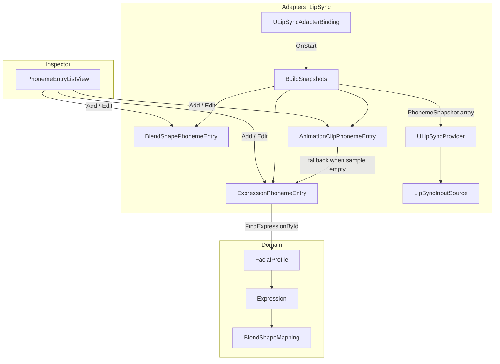
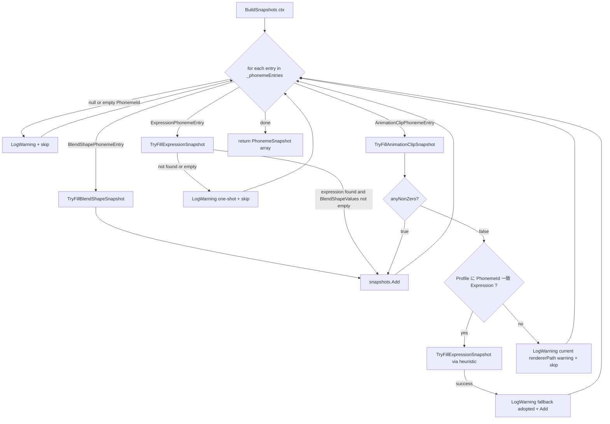
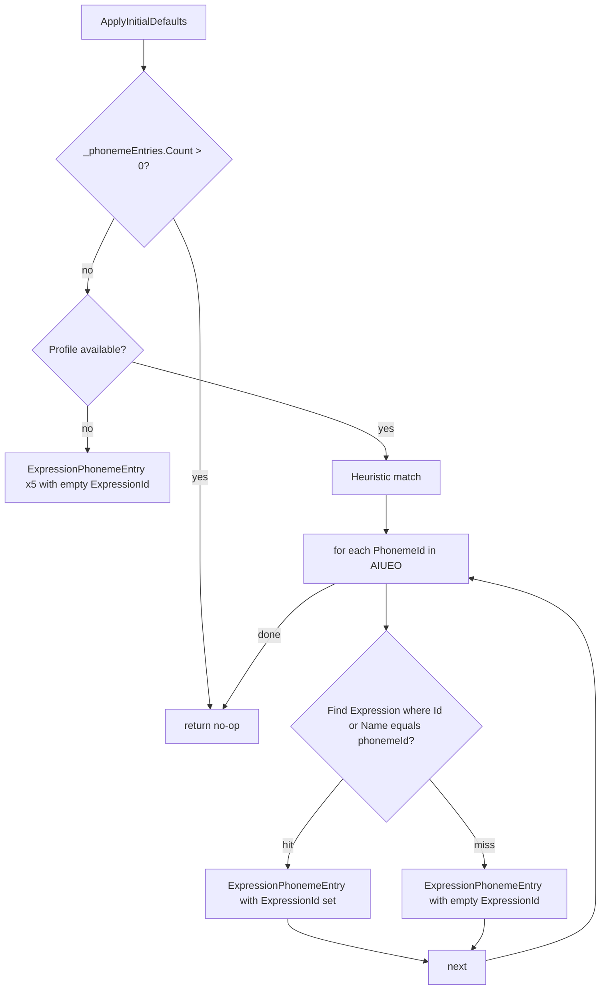
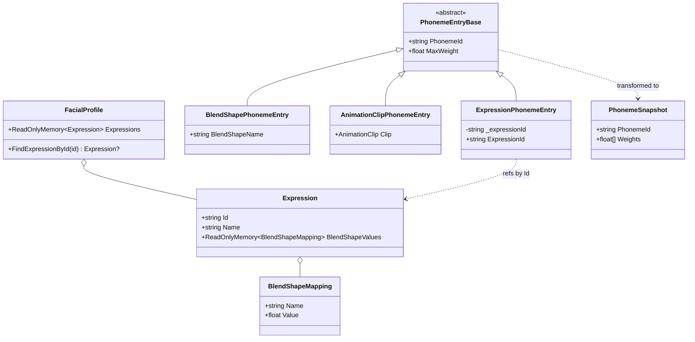
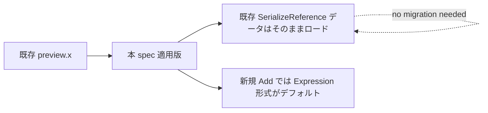

# Technical Design Document

## Overview

**Purpose**: `com.hidano.facialcontrol.lipsync` の uLipSync アダプタにおいて「Inspector デフォルトの AnimationClip 形式音素エントリが動かない」根本問題を、`FacialProfile` 既存 `Expression` を音素として直接参照する `ExpressionPhonemeEntry` の新設と、`AnimationClipPhonemeEntry` の sample 失敗時 fallback により解決する。

**Users**: 本パッケージを組み込む Unity エンジニア（VTuber 配信用フェイシャルキャプチャ連動 / ゲーム内表情制御）。Inspector で uLipSync binding を追加した直後、または FacialProfile の AIUEO 表情を作成済みの状態で「特別な設定なしに口が動く」体験を提供する。

**Impact**: 既存の `ULipSyncAdapterBinding.BuildSnapshots` / `ApplyInitialDefaults` / `PhonemeEntryListView` の責務を拡張する。Inspector のデフォルト追加型を `AnimationClipPhonemeEntry` から `ExpressionPhonemeEntry` へ変更する破壊的変更を含む（preview 段階のため UX 優先で許容）。既存 `BlendShapePhonemeEntry` / `AnimationClipPhonemeEntry` のシリアライズ済みデータは loss なくロード可能で、`BlendShapePhonemeEntry` の挙動 regression は無い。

### Goals
- `PhonemeEntryBase` 派生として `ExpressionPhonemeEntry` を新設し、`FacialProfile.FindExpressionById` 経由で `Expression.BlendShapeValues` を `PhonemeSnapshot` に変換する経路を確立する。
- `AnimationClipPhonemeEntry` の sample 結果が全 0 のとき、同一 `PhonemeId` を持つ `Expression` が profile にあれば `ExpressionPhonemeEntry` 同等経路で fallback を提供する。
- Inspector の `PhonemeEntryListView` に「Expression 形式」を追加し、デフォルト追加型を `ExpressionPhonemeEntry` に切り替える。
- `tech.md` の毎フレームヒープ確保ゼロ契約を維持する（`BuildSnapshots` は OnStart 1 回だけ呼ばれる、hot path に新規アロケーションを追加しない）。

### Non-Goals
- uLipSync 本体 (`uLipSync.uLipSync` / `uLipSync.Profile`) の改修。
- 音声解析アルゴリズム自体の改善。
- `AnimationUtility.GetCurveBindings`（Editor only）を用いた AnimationClip の rendererPath 事前検証 / runtime 補正（候補 (b)、将来課題として `docs/backlog.md` S-9 に残置）。
- リップシンク用 AnimationClip の Editor 作成支援ツール。
- Bones / テクスチャ切り替え / UV アニメーション系の音素表現（BlendShape スナップショットのみが対象）。
- リップシンク以外のアダプタ（OSC / InputSystem 等）への `PhonemeEntryBase` 派生追加。

## Boundary Commitments

### This Spec Owns
- `Hidano.FacialControl.LipSync.Adapters.PhonemeEntries.ExpressionPhonemeEntry` 型と、その `[SerializeReference]` 経由のシリアライズ契約。
- `ULipSyncAdapterBinding.BuildSnapshots` における 3 種 PhonemeEntry（BlendShape / AnimationClip / Expression）の分岐ロジックと、AnimationClip sample 失敗時の fallback 経路。
- `ULipSyncAdapterBinding.ApplyInitialDefaults` が生成するデフォルトエントリの型。
- `PhonemeEntryListView` の `EntryKind` 列挙と Add メニュー構成、Expression 形式行 UI（DropdownField + HelpBox）。
- 警告ログのフォーマット契約（`[ULipSyncAdapterBinding]` 接頭辞 + one-shot 抑制）。

### Out of Boundary
- `FacialProfile` / `Expression` / `ExpressionSnapshot` / `BlendShapeMapping` の型変更。本 spec はこれらを read-only で参照するのみ。
- `AdapterBuildContext` のフィールド追加（既存の `Profile` フィールドを参照するだけで足りる）。
- `ULipSyncProvider` / `LipSyncInputSource` の API 変更（`PhonemeSnapshot[]` を入力として受け取る既存契約をそのまま使用）。
- `FacialProfileSO` Inspector / JSON シリアライズパスへの追加変更。
- uLipSync 本体および `uLipSync.Profile` の中身。

### Allowed Dependencies
- `Hidano.FacialControl.LipSync.Adapters` → `Hidano.FacialControl.Domain.Models`（`FacialProfile`, `Expression`, `BlendShapeMapping`）。既存の依存方向（Adapters → Domain）を逸脱しない。
- `AdapterBuildContext.Profile` への read アクセス。
- `OverlayInputSource` で確立済みの `nameToIndex` → `weights[]` 変換パターンを参考にする（コードを共有はしないが、設計思想を踏襲）。

### Revalidation Triggers
- `FacialProfile.FindExpressionById` のシグネチャ変更（戻り値型 `Expression?` の変更を含む）。
- `Expression.BlendShapeValues` の意味論変更（特に `BlendShapeMapping.Value` の正規化レンジが 0〜1 から外れる場合）。
- `AdapterBuildContext.Profile` フィールドの削除 / 型変更。
- `PhonemeEntryBase.PhonemeId` / `MaxWeight` のフィールド名・型変更（既存シリアライズ互換を破る）。
- `[SerializeReference]` で永続化された `_phonemeEntries` のクラス FQN 変更（type rename はマイグレーション必須）。

## Architecture

### Existing Architecture Analysis

- `ULipSyncAdapterBinding.OnStart` は `AdapterBuildContext` を受け取り、`BuildSnapshots(ctx)` を 1 回だけ呼んで `PhonemeSnapshot[]` を構築、`ULipSyncProvider` に固定長配列で渡す（毎フレーム再構築しない）。
- 既存の `BuildSnapshots` は `_phonemeEntries` を線形走査し、`is BlendShapePhonemeEntry` / `is AnimationClipPhonemeEntry` で分岐する。
- AnimationClip 経路は `entry.Clip.SampleAnimation(ctx.HostGameObject, entry.Clip.length)` で SkinnedMeshRenderer の BlendShape weight を一時的に書き換え、`renderer.GetBlendShapeWeight(meshIndex)` で採取後、`RestoreBlendShapeWeights` で復元する重い経路。`SampleAnimation` は AnimationClip の rendererPath が `HostGameObject` 配下の Transform 構造と一致しないと weight を書き込まないため、一致しない場合は全 0 が返り「動かない」状態になる。
- `AdapterBuildContext.Profile` は既に `FacialProfile` を公開しており、`Expression` 列挙と `FindExpressionById` が利用可能。
- `OverlayInputSource` は `profile.Expressions.Span` を走査し、各 Expression の overlay snapshot を `(indices[], values[], BitArray mask)` 形式に事前変換して保持する。本 spec の `ExpressionPhonemeEntry` 解決経路はこの「事前変換 → 固定長 weights[]」パターンに準拠する。

### Architecture Pattern & Boundary Map



**Architecture Integration**:
- 選定パターン: 既存クリーンアーキテクチャ（Adapters → Domain）を維持。新規型 `ExpressionPhonemeEntry` は Adapters 層に閉じる。Domain 型 (`Expression`, `BlendShapeMapping`) は read-only 参照のみ。
- ドメイン境界: 「音素 → BlendShape 重み配列の変換」は LipSync Adapters の責務。Domain の `Expression` は表情の不変表現を提供するだけで、リップシンク固有の知識を持たない。
- 保持される既存パターン: `[SerializeReference]` polymorphic list、`PhonemeSnapshot` の固定長 `float[]` 表現、`BuildSnapshots` の OnStart 1 回呼び出し契約、`SkinnedMeshRenderer` 階層への直接介入。
- 新規コンポーネント追加理由: `ExpressionPhonemeEntry` は AnimationClip rendererPath 不整合の影響を一切受けないため、ユーザーが「Inspector で表情を選ぶだけで動く」体験を実現する最短経路。
- ステアリング遵守: `tech.md` の依存方向（Adapters → Application → Domain）、毎フレーム GC ゼロ目標、`Debug.Log/Warning/Error` のみのエラー運用に準拠。

### Technology Stack

| Layer | Choice / Version | Role in Feature | Notes |
|-------|------------------|-----------------|-------|
| Runtime (Adapter) | C# / .NET Standard 2.1（Unity 6000.3.x） | `ExpressionPhonemeEntry` / `BuildSnapshots` 分岐 / fallback ロジック | 既存 `com.hidano.facialcontrol.lipsync` asmdef 内に追加 |
| Editor (UI Toolkit) | UnityEditor.UIElements | `PhonemeEntryListView` の DropdownField + HelpBox 拡張 | 既存 `Editor/Inspector` asmdef を変更 |
| External | `uLipSync` (uLipSync.uLipSync / Profile / uLipSyncMicrophone / uLipSyncAsioInput) | 音素検出（変更なし） | 本 spec は uLipSync の呼び出し方を変更しない |
| Domain (read-only) | `Hidano.FacialControl.Domain.Models` (`FacialProfile`, `Expression`, `BlendShapeMapping`) | Expression 参照解決 | 既存 API のみ使用、改変なし |

## File Structure Plan

### Directory Structure

```
FacialControl/Packages/com.hidano.facialcontrol.lipsync/
├── Runtime/
│   └── Adapters/
│       ├── ULipSyncAdapterBinding.cs            # 改修: BuildSnapshots / ApplyInitialDefaults
│       └── PhonemeEntries/
│           ├── PhonemeEntryBase.cs              # 変更なし
│           ├── BlendShapePhonemeEntry.cs        # 変更なし
│           ├── AnimationClipPhonemeEntry.cs     # 変更なし
│           ├── ExpressionPhonemeEntry.cs        # 新規: ExpressionId 参照型
│           └── PhonemeSnapshot.cs               # 変更なし
├── Editor/
│   └── Inspector/
│       └── PhonemeEntryListView.cs              # 改修: EntryKind.Expression 追加 / Add メニュー / Expression 行 UI
├── Tests/
│   └── EditMode/
│       ├── Adapters/
│       │   ├── PhonemeEntryTests.cs             # 追加ケース: ExpressionPhonemeEntry シリアライズ
│       │   ├── PhonemeSnapshotBuilderTests.cs   # 追加ケース: ExpressionPhonemeEntry / fallback
│       │   └── ULipSyncAdapterBindingTests.cs   # 追加ケース: BuildSnapshots Expression 経路
│       ├── Editor/
│       │   └── PhonemeEntryListViewTests.cs     # 追加ケース: Expression 形式 Add / Switch
│       └── Performance/
│           └── ULipSyncProviderAllocationTests.cs # 追加ケース: Expression snapshot ゼロ GC
└── Documentation~/
    └── PhonemeEntry形式ガイド.md                # 新規: 3 形式の使い分け（要件 11）
```

### Modified Files
- `Runtime/Adapters/ULipSyncAdapterBinding.cs` — `BuildSnapshots` に `ExpressionPhonemeEntry` 分岐、`TryFillAnimationClipSnapshot` 失敗時の fallback、`ApplyInitialDefaults` のデフォルト型変更、one-shot 警告抑制 HashSet 追加。
- `Runtime/Adapters/PhonemeEntries/ExpressionPhonemeEntry.cs` — 新設。
- `Editor/Inspector/PhonemeEntryListView.cs` — `EntryKind.Expression` 追加、Add メニュー項目「Expression 形式」、Expression 行用 `BuildExpressionFields`、HelpBox、`CreateEntry` 拡張。
- `Documentation~/PhonemeEntry形式ガイド.md` — 3 種の使い分けガイド、Migration Notes。
- `docs/backlog.md` の S-9 — 完了反映 + 候補 (b) を「将来課題」として残置。

## System Flows

### BuildSnapshots における 3 種 Entry の処理フロー



**Key Decisions**:
- 全エントリ処理後に `snapshots.ToArray()` を 1 回だけアロケートする（OnStart 1 回限定）。
- `ExpressionPhonemeEntry` は AnimationClip sampling を一切経由しないため `SkinnedMeshRenderer` 階層への書き戻し / 復元コスト（`SaveBlendShapeWeights` / `RestoreBlendShapeWeights`）も不要。
- `AnimationClipPhonemeEntry` fallback はあくまで補助で、警告ログで「`ExpressionPhonemeEntry` への移行」を案内する（要件 9.3）。

### ApplyInitialDefaults のエントリ生成フロー



**Key Decisions**:
- `ApplyInitialDefaults` は Inspector 経由でしか呼ばれない（`IAdapterBindingInitialDefaults`）ため、profile 解決経路は Inspector context での `FacialProfile` 取得。現状の `ApplyInitialDefaults()` には profile 参照引数がないため、本 spec では `IAdapterBindingInitialDefaults` の拡張ではなく、まず「ExpressionPhonemeEntry を空 ExpressionId で 5 件生成」のみとし、後続 Inspector 表示時に自動 link を試みる方針。自動 link はオプション機能。
- 自動 link の実装トリガーは「Inspector で binding を最初に描画した瞬間」または「ユーザーが Add メニューから Expression 形式を選んだ瞬間に最近マッチ表情を proposed default として表示」のいずれか。詳細は実装フェーズで確定（Open Question）。

## Requirements Traceability

| Requirement | Summary | Components | Interfaces | Flows |
|-------------|---------|------------|------------|-------|
| 1.1 | 採用方針: ExpressionPhonemeEntry 新設 | ExpressionPhonemeEntry / BuildSnapshots | - | BuildSnapshots フロー |
| 1.2 | 採用方針: AnimationClip fallback | BuildSnapshots / TryFillAnimationClipSnapshot | - | BuildSnapshots フロー fallback 枝 |
| 1.3 | 候補 (b) スコープ外 | - | - | (Non-Goals 参照) |
| 1.4 | 代替案採用時の再承認 | - | - | (spec governance) |
| 2.1 | ExpressionPhonemeEntry 型追加 | ExpressionPhonemeEntry | (型定義) | - |
| 2.2 | ExpressionId シリアライズ | ExpressionPhonemeEntry | `_expressionId` `[SerializeField]` | - |
| 2.3 | BuildSnapshots での解決 | ULipSyncAdapterBinding | `TryFillExpressionSnapshot` | BuildSnapshots フロー |
| 2.4 | SampleAnimation を呼ばない | ULipSyncAdapterBinding | `TryFillExpressionSnapshot` | - |
| 2.5 | 未解決時 LogWarning + skip | ULipSyncAdapterBinding | `LogExpressionResolutionWarning` | BuildSnapshots フロー warn 枝 |
| 2.6 | MaxWeight スケール適用 | ULipSyncAdapterBinding | `NormalizeWeight` 再利用 | - |
| 3.1 | EntryKind.Expression 追加 | PhonemeEntryListView | `EntryKind` enum | - |
| 3.2 | Add メニュー Expression 形式 | PhonemeEntryListView | `OpenAddMenu` / `CreateEntry` | - |
| 3.3 | 形式切替時の共通フィールド保持 | PhonemeEntryListView | `SetEntryKind` / `CopyCommonFields` | - |
| 3.4 | Expression 選択 UI | PhonemeEntryListView | `AddExpressionFields` | - |
| 3.5 | 未割り当て HelpBox 表示 | PhonemeEntryListView | `ApplyExpressionWarningVisibility` | - |
| 3.6 | 割り当て後 HelpBox 非表示 | PhonemeEntryListView | `ApplyExpressionWarningVisibility` | - |
| 4.1 | デフォルト型を Expression に変更 | ULipSyncAdapterBinding | `ApplyInitialDefaults` | ApplyInitialDefaults フロー |
| 4.2 | AIUEO 自動 link | ULipSyncAdapterBinding | `ApplyInitialDefaults` | ApplyInitialDefaults フロー |
| 4.3 | 自動 link 不可時の空生成 | ULipSyncAdapterBinding | `ApplyInitialDefaults` | ApplyInitialDefaults フロー |
| 4.4 | 既存呼び出しガード維持 | ULipSyncAdapterBinding | `ApplyInitialDefaults` | - |
| 5.1 | AnimationClipPhonemeEntry 既存経路維持 | ULipSyncAdapterBinding | `TryFillAnimationClipSnapshot` | BuildSnapshots フロー |
| 5.2 | sample 全 0 時の PhonemeId 一致検査 | ULipSyncAdapterBinding | `TryFindExpressionByPhonemeIdHeuristic` | BuildSnapshots フロー fallback 枝 |
| 5.3 | fallback 採用 + LogWarning | ULipSyncAdapterBinding | `TryFillAnimationClipSnapshot` (内部 fallback) | BuildSnapshots フロー fallback 枝 |
| 5.4 | fallback 不可時の既存警告維持 | ULipSyncAdapterBinding | `TryFillAnimationClipSnapshot` | - |
| 5.5 | BlendShape 経路 regression なし | ULipSyncAdapterBinding | `TryFillBlendShapeSnapshot` | - |
| 6.1 | AdapterBuildContext.Profile 利用 | ULipSyncAdapterBinding | `BuildSnapshots(in ctx)` | - |
| 6.2 | コンテキスト拡張不要 | (Out of Boundary) | - | - |
| 6.3 | nameToIndex パターン踏襲 | ULipSyncAdapterBinding | `BuildNameToIndex` | - |
| 6.4 | asmdef 依存方向維持 | (Architecture) | - | - |
| 7.1 | Hot path GC ゼロ維持 | ULipSyncProvider | (変更なし) | - |
| 7.2 | snapshot 構築 OnStart のみ | ULipSyncAdapterBinding | `BuildSnapshots` | - |
| 7.3 | 一時バッファ OnStart 内閉じ込め | ULipSyncAdapterBinding | local Dictionary 解放 | - |
| 7.4 | 性能テスト追加 | (Tests) | `ULipSyncProviderAllocationTests` | - |
| 8.1 | BlendShape 互換 | (regression test) | - | - |
| 8.2 | AnimationClip 互換 | (regression test) | - | - |
| 8.3 | PhonemeEntryBase フィールド互換 | (型維持) | - | - |
| 8.4 | SerializeReference ロード互換 | (型 FQN 維持) | - | - |
| 8.5 | 破壊的変更を Migration Notes に記載 | (Migration Notes) | - | - |
| 9.1 | 接頭辞 [ULipSyncAdapterBinding] | ULipSyncAdapterBinding | log helpers | - |
| 9.2 | Expression 未解決 ログ内容 | ULipSyncAdapterBinding | `LogExpressionResolutionWarning` | - |
| 9.3 | fallback 採用ログ内容 | ULipSyncAdapterBinding | `LogAnimationClipFallbackWarning` | - |
| 9.4 | LogWarning レベル使用 | ULipSyncAdapterBinding | `Debug.LogWarning` | - |
| 9.5 | one-shot 抑制 | ULipSyncAdapterBinding | `_loggedWarnings` HashSet | - |
| 10.1〜10.6 | テスト要件 | (Testing Strategy) | - | - |
| 11.1〜11.4 | ドキュメント更新 | Documentation~ | - | - |

## Components and Interfaces

| Component | Domain/Layer | Intent | Req Coverage | Key Dependencies (P0/P1) | Contracts |
|-----------|--------------|--------|--------------|--------------------------|-----------|
| `ExpressionPhonemeEntry` | Adapters / PhonemeEntries | `FacialProfile.Expression` を音素として参照する `PhonemeEntryBase` 派生 | 2.1, 2.2, 2.6, 8.3, 8.4 | `PhonemeEntryBase` (P0) | State (serialized) |
| `ULipSyncAdapterBinding` (拡張) | Adapters | `BuildSnapshots` / `ApplyInitialDefaults` の責務拡張、fallback 経路と one-shot 警告 | 1.1, 1.2, 2.3, 2.4, 2.5, 2.6, 4.1, 4.2, 4.3, 4.4, 5.1, 5.2, 5.3, 5.4, 5.5, 6.1, 6.3, 7.2, 7.3, 9.1, 9.2, 9.3, 9.4, 9.5 | `AdapterBuildContext` (P0), `FacialProfile` (P0), `Expression` (P0), `ULipSyncProvider` (P0) | Service |
| `PhonemeEntryListView` (拡張) | Editor / Inspector | Expression 形式の Add / 編集 / 警告表示 | 3.1, 3.2, 3.3, 3.4, 3.5, 3.6 | `SerializedProperty` (P0), `FacialProfile` 列挙取得 (P1) | State (UI) |

### Adapters / PhonemeEntries

#### ExpressionPhonemeEntry

| Field | Detail |
|-------|--------|
| Intent | `FacialProfile` の既存 `Expression` を音素として参照する `PhonemeEntryBase` 派生 |
| Requirements | 2.1, 2.2, 2.6, 8.3, 8.4 |

**Responsibilities & Constraints**
- 基底 `PhonemeEntryBase` のフィールド (`PhonemeId`, `MaxWeight`) を保持しつつ、参照先 `Expression` を `ExpressionId`（GUID 相当の `Expression.Id`）で表現する。
- 不変ではない（Unity Inspector で編集される `[SerializeField]` を持つ）が、ロジックは持たず POCO に近い形でデータ表現のみを担う。
- `ExpressionId` が空文字 / `Expression` が見つからない場合は binding 側で `LogWarning` + skip する（責務は binding 側）。

**Dependencies**
- Inbound: `ULipSyncAdapterBinding.BuildSnapshots` — Expression 参照解決の入力 (P0)
- Inbound: `PhonemeEntryListView` — Inspector 経由のシリアライズ (P0)
- Outbound: なし（POCO）

**Contracts**: Service [ ] / API [ ] / Event [ ] / Batch [ ] / State [x]

##### State Management
- 永続化フィールド: `PhonemeId` (基底, `string`), `MaxWeight` (基底, `float`), `_expressionId` (`[SerializeField] private string`).
- `[SerializeReference]` 経由で `ULipSyncAdapterBinding._phonemeEntries` に格納される。
- 一意性: `(PhonemeId, ExpressionId)` の組合せが意味的なキー。binding 内で同一 `PhonemeId` の重複は最初の一件のみを採用（既存 `BuildSnapshots` の挙動と整合）。
- アクセサ: 既存 `PhonemeEntryBase` と同じく public フィールド形式は不採用（Unity の `[SerializeReference]` 互換のため `public string PhonemeId; public float MaxWeight;` の既存パターンに合わせ、`ExpressionId` は `public string ExpressionId { get; set; }` ではなく `[SerializeField] private string _expressionId;` + `public string ExpressionId => _expressionId;` の getter 公開を選択する（テスト時の設定は `SerializedProperty` 経由で行う）。

**Implementation Notes**
- 統合: `PhonemeEntryListView` の `CreateEntry(EntryKind.Expression)` で `new ExpressionPhonemeEntry()` を `managedReferenceValue` に設定。`PhonemeIdFieldName` / `MaxWeightFieldName` の `nameof` 解決は基底フィールドのため変更不要。`ExpressionIdFieldName` は `nameof(ExpressionPhonemeEntry.ExpressionId)` を採用するか、プライベートバッキングフィールド名 (`"_expressionId"`) のリテラルを採用するか実装で確定。
- 検証: シリアライズ round-trip（書き → AssetDatabase.SaveAssets → 再ロード → 値一致）を EditMode テストで検証する（要件 10.1）。
- リスク: 既存ユーザーが `[SerializeReference]` で保存済みの `AnimationClipPhonemeEntry` / `BlendShapePhonemeEntry` データを破壊しないこと。クラス FQN (`Hidano.FacialControl.LipSync.Adapters.PhonemeEntries.ExpressionPhonemeEntry`) は新規であり既存 FQN を変更しないため衝突なし。

### Adapters / LipSync

#### ULipSyncAdapterBinding （拡張）

| Field | Detail |
|-------|--------|
| Intent | 3 種 PhonemeEntry の snapshot 化、AnimationClip fallback、デフォルト型変更、警告 one-shot 抑制 |
| Requirements | 1.1, 1.2, 2.3, 2.4, 2.5, 2.6, 4.1, 4.2, 4.3, 4.4, 5.1, 5.2, 5.3, 5.4, 5.5, 6.1, 6.3, 7.2, 7.3, 9.1, 9.2, 9.3, 9.4, 9.5 |

**Responsibilities & Constraints**
- `BuildSnapshots(in AdapterBuildContext ctx)` 内で entry の動的型に応じて分岐し、`PhonemeSnapshot[]` を構築する。
- `AnimationClipPhonemeEntry` の sample 結果が全 0 の場合に `ExpressionPhonemeEntry` 等価経路で fallback を試みる。
- `ApplyInitialDefaults` は AIUEO 5 音素分の `ExpressionPhonemeEntry` を生成し、可能なら `ExpressionId` を自動 link する。
- 警告ログは one-shot 抑制（同一 binding 内の同一原因に対し OnStart ごとに最大 1 回）。
- 既存 `BlendShapePhonemeEntry` 処理経路は触らない（regression 防止）。

**Dependencies**
- Inbound: `FacialControllerLifetimeScope` / `AdapterBindingHost` — `OnStart(in ctx)` 呼び出し (P0)
- Outbound: `AdapterBuildContext.Profile` (P0), `Profile.FindExpressionById` (P0), `ULipSyncProvider` (P0), `IInputSourceRegistry` (P0)
- External: `uLipSync.uLipSync` / `uLipSync.Profile` (P0, 既存)

**Contracts**: Service [x] / API [ ] / Event [ ] / Batch [ ] / State [x]

##### Service Interface

```csharp
// 既存 (拡張): private 内部ヘルパー
private PhonemeSnapshot[] BuildSnapshots(in AdapterBuildContext ctx);

// 新規 private:
private bool TryFillExpressionSnapshot(
    ExpressionPhonemeEntry entry,
    in AdapterBuildContext ctx,
    IReadOnlyDictionary<string, int> nameToIndex,
    float[] weights);

private bool TryFillExpressionSnapshotById(
    string phonemeId,
    string expressionId,
    float maxWeight,
    in AdapterBuildContext ctx,
    IReadOnlyDictionary<string, int> nameToIndex,
    float[] weights);

private bool TryFindExpressionByPhonemeIdHeuristic(
    in AdapterBuildContext ctx,
    string phonemeId,
    out Expression expression);

private Dictionary<string, int> BuildNameToIndex(IReadOnlyList<string> blendShapeNames);

private void LogExpressionResolutionWarning(
    string phonemeId, string expressionId, ExpressionWarningCause cause);

private void LogAnimationClipFallbackWarning(
    string phonemeId, string animationClipName);

// 既存変更:
public void ApplyInitialDefaults();  // 中身を ExpressionPhonemeEntry x5 生成へ
```

- Preconditions:
  - `BuildSnapshots`: `ctx.Profile` が default でない、`ctx.HostGameObject` が非 null、`_phonemeEntries.Count > 0`。
  - `TryFillExpressionSnapshot`: `entry.ExpressionId` は空文字許容（空ならログ + skip）。`weights.Length == ctx.BlendShapeNames.Count`。
- Postconditions:
  - 戻り値 `true`: `weights` に対象 BlendShape の正規化値が書き込まれ、最低 1 つは非 0。snapshot を Add 可能。
  - 戻り値 `false`: `weights` の状態は未定義（呼び出し側で破棄）、警告ログ済み。
- Invariants:
  - hot path（OnStart 後の毎フレーム経路）に新規アロケーションを追加しない。
  - 同一 OnStart 呼び出し内で同一警告原因について `Debug.LogWarning` を最大 1 回しか呼ばない。

##### State Management
- `_phonemeEntries`: 既存 `[SerializeReference] List<PhonemeEntryBase>`。型追加のみ。
- `_loggedWarnings`: `[NonSerialized] HashSet<string>` を新設。one-shot 抑制キーは `$"{cause}:{phonemeId}:{expressionId ?? "<empty>"}"` 形式。OnStart 毎にクリア。
- `_runtimeFallbackUsed`: `[NonSerialized] bool` 任意。観測用にテストで参照可能にする（実装で確定）。
- スレッド: OnStart は Unity メインスレッド前提。

**Implementation Notes**
- 統合: `BuildSnapshots` 内で `nameToIndex` を 1 回構築し、3 経路で共有する。AnimationClip fallback は `TryFillAnimationClipSnapshot` 内で `anyNonZero == false` 検出時に `TryFindExpressionByPhonemeIdHeuristic` を呼び、見つかれば `TryFillExpressionSnapshotById` に委譲する（戻り値で fallback 採用判定）。
- 検証: `BuildSnapshots` の各経路を単体テスト（モック profile / モック SkinnedMeshRenderer）、AnimationClip fallback の 2 ケース（同名 Expression あり / なし）を網羅。one-shot 抑制は同一 OnStart で 2 回連続で同じ警告を投げ、Debug.LogWarning が 1 回だけ呼ばれることを `LogAssert.Expect` で検証。
- リスク: `Profile.FindExpressionById` は `string id` 完全一致のため、ユーザーが Expression 名（"あ"）と GUID `ExpressionId` を取り違えると解決失敗する。Inspector の Expression 形式行で DropdownField を表示し「Name (Id)」形式で表示することでユーザーミスを抑制する（要件 3.4）。
- リスク: heuristic match は `PhonemeId` (`A`/`I`/`U`/`E`/`O`) が `Expression.Id` または `Expression.Name` と完全一致する場合のみ採用。日本語表情名（"あ"）はマッチしない設計とし、明示割り当てを推奨する。

### Editor / Inspector

#### PhonemeEntryListView （拡張）

| Field | Detail |
|-------|--------|
| Intent | `EntryKind.Expression` を追加し、Add メニュー・形式切替・参照 Expression 選択 UI・未割り当て警告を提供する |
| Requirements | 3.1, 3.2, 3.3, 3.4, 3.5, 3.6 |

**Responsibilities & Constraints**
- `EntryKind` enum に `Expression` を追加。`EntryTypeChoices` / `OpenAddMenu` / `CreateEntry` / `ResolveEntryKind` / `ToLabel` / `TryParseKind` を拡張。
- 行 UI を `BlendShape` / `AnimationClip` / `Expression` で分岐。Expression 行は DropdownField（profile.Expressions から enumerate）と HelpBox（未割り当て警告）を含む。
- `SetEntryKind` での切替時、`PhonemeId` / `MaxWeight` を保持して型のみ差し替える既存挙動を踏襲する。
- profile への参照は SerializedObject の上流（FacialProfileSO もしくは binding のホスト ScriptableObject）から取得する。実装で `IExpressionEnumerator` 相当の抽象を介すか、`SerializedProperty` の親をたどるかは実装フェーズで確定（Open Question）。

**Dependencies**
- Inbound: Drawer / Inspector — `new PhonemeEntryListView(listProperty)` (P0)
- Outbound: `SerializedProperty` (P0), `ExpressionPhonemeEntry` (P0), `FacialProfile.Expressions` (P1, 表示用)

**Contracts**: Service [ ] / API [ ] / Event [ ] / Batch [ ] / State [x] (UI)

**Implementation Notes**
- 統合:
  - `EntryTypeChoices` に `ExpressionLabel = "Expression 形式"` を追加。
  - `CreateEntry(EntryKind kind)` の switch 拡張：`EntryKind.Expression => new ExpressionPhonemeEntry()`。
  - `BindRow` の分岐に `kind == EntryKind.Expression` 枝を追加し、`AddExpressionFields(row, entryProperty)` を呼ぶ。
  - `AddExpressionFields` は `_expressionId` を `SerializedProperty.FindPropertyRelative("_expressionId")` で取得し、DropdownField の choices に「Name (Id)」一覧を表示。選択時は `evt.newValue` から Id を逆引きして string に書き込む。
  - HelpBox は `ApplyExpressionWarningVisibility(warning, expressionIdValue)` で空文字なら `Flex` / 非空なら `None`。
- 検証: `PhonemeEntryListViewTests` に Expression 形式の Add / Switch / 警告表示の 3 ケースを追加（要件 10.4）。
- リスク: profile への参照取得経路が SerializedObject の構造に依存するため、binding が FacialProfileSO 配下にネストされていないコンテキスト（例: コードからの直接生成）では Expression 一覧が空になる。その場合は単純な TextField fallback として `ExpressionId` 文字列を直接編集可能にする（UI degrade）。

## Data Models

### Domain Model

本 spec で扱うデータは以下の Domain 値オブジェクト（既存、本 spec で変更なし）と Adapter 層の永続化エントリ（新規）。



**Invariants**:
- `ExpressionPhonemeEntry.ExpressionId` は空文字または `FacialProfile.Expressions` 内のいずれかの `Expression.Id` と完全一致する必要がある。整合性チェックは binding 側 (`BuildSnapshots`) で行い、不整合は LogWarning + skip。
- `PhonemeSnapshot.Weights.Length == AdapterBuildContext.BlendShapeNames.Count`（既存契約、変更なし）。
- `BlendShapeMapping.Value` は `[0, 1]` 範囲（既存契約）。`MaxWeight` は `[0, 100]` 範囲（基底既存契約）。最終 `weights[index] = Clamp01(mapping.Value * (MaxWeight / 100) * _maxWeightScale)`。

### Data Contracts & Integration

**シリアライズ契約 (`[SerializeReference]`)**:
- `ExpressionPhonemeEntry` は `System.Serializable` 属性付きで `Hidano.FacialControl.LipSync.Adapters.PhonemeEntries` 名前空間に配置。
- フィールド: 基底 `PhonemeId` / `MaxWeight` + 派生 `_expressionId` (`[SerializeField] private string`)。
- 既存の `AnimationClipPhonemeEntry` / `BlendShapePhonemeEntry` の `managedReferenceFullTypename` は不変、新型追加のみ。
- Inspector 上で形式切替（`SetEntryKind`）すると `managedReferenceValue` が差し替わり、未対応フィールド（例: `Clip` / `BlendShapeName`）は読み捨てられる。

## Error Handling

### Error Strategy

ライブラリ全体方針（`tech.md`）に従い `Debug.Log/Warning/Error` のみで通知。本 spec が追加する分類:

| 状態 | レベル | キー（one-shot 識別） | メッセージ要点 |
|------|--------|----------------------|----------------|
| `ExpressionPhonemeEntry.ExpressionId` が空 | Warning | `expr-empty:{PhonemeId}` | 「Expression 未割り当て。Inspector で割り当ててください」 |
| `ExpressionId` 指定があるが profile に該当 Expression なし | Warning | `expr-not-found:{PhonemeId}:{ExpressionId}` | 「ExpressionId='X' が profile に存在しません」 |
| 該当 Expression の `BlendShapeValues` が空 | Warning | `expr-empty-bs:{PhonemeId}:{ExpressionId}` | 「Expression 'X' の BlendShape 値が空です」 |
| `AnimationClipPhonemeEntry` sample 全 0 + fallback 成功 | Warning | `clip-fallback:{PhonemeId}` | 「AnimationClip sample が全 0 でした。PhonemeId 一致 Expression に fallback。より確実な ExpressionPhonemeEntry の使用を推奨」 |
| `AnimationClipPhonemeEntry` sample 全 0 + fallback 不可 | Warning | `clip-empty:{PhonemeId}` | 既存メッセージ維持（rendererPath 不一致疑い） |

### Error Categories and Responses
- **User Errors (ユーザー設定起因)**: 未割り当て / 不一致 → Inspector HelpBox + LogWarning で原因と対処を案内。
- **System Errors**: profile が default の場合 → binding 自体が起動しないため事前ガード。
- **Business Logic Errors**: 同一 `PhonemeId` 重複 → 既存挙動（最初の 1 件採用）を維持、追加処理なし。

### Monitoring
- `[ULipSyncAdapterBinding]` 接頭辞でログを統一し、Unity Console / log file から grep 可能にする。
- one-shot 抑制により毎フレームスパムを防ぐ。

## Testing Strategy

### Unit Tests (EditMode)
- `PhonemeEntryTests.ExpressionPhonemeEntry_SerializedPropertyRoundTrip_PreservesCommonAndExpressionId` — シリアライズ round-trip と FQN 確認（要件 10.1, 8.4）。
- `PhonemeSnapshotBuilderTests.BuildSnapshots_WithExpressionPhonemeEntry_ResolvesFromProfile` — モック profile に "A" 表情を仕込み、`ExpressionPhonemeEntry` から正しい `PhonemeSnapshot.Weights` が得られることを確認（要件 10.2, 2.3, 2.4, 2.6）。
- `PhonemeSnapshotBuilderTests.BuildSnapshots_WithExpressionPhonemeEntry_MissingExpression_LogsWarningAndSkips` — 未解決ケース（要件 10.2, 2.5, 9.2）。
- `PhonemeSnapshotBuilderTests.BuildSnapshots_AnimationClipFallback_WhenSampleAllZeroAndPhonemeMatchExpression` — fallback 成功ケース（要件 10.3, 5.2, 5.3, 9.3）。
- `PhonemeSnapshotBuilderTests.BuildSnapshots_AnimationClipFallback_WhenSampleAllZeroAndNoMatch_PreservesExistingWarning` — fallback 不可ケース（要件 10.3, 5.4）。

### Integration Tests (EditMode)
- `ULipSyncAdapterBindingTests.ApplyInitialDefaults_OnEmpty_GeneratesFiveExpressionEntries` — デフォルト型変更検証（要件 4.1, 4.3）。
- `ULipSyncAdapterBindingTests.ApplyInitialDefaults_OnNonEmpty_DoesNothing` — 既存ガード維持（要件 4.4, 5.5）。
- `PhonemeEntryListViewTests.AddEntry_Expression_InsertsExpressionPhonemeEntry` — UI Add（要件 10.4, 3.2）。
- `PhonemeEntryListViewTests.SetEntryKind_FromBlendShapeToExpression_PreservesCommonFields` — 形式切替 + 共通フィールド保持（要件 3.3）。
- `PhonemeEntryListViewTests.BindRow_ExpressionWithoutId_ShowsWarningHelpBox` — HelpBox 表示（要件 3.5, 3.6）。

### Performance/Allocation
- `ULipSyncProviderAllocationTests.Update_WithExpressionPhonemeEntrySnapshots_ZeroGCPerFrame` — `ExpressionPhonemeEntry` ベースで構築した snapshot を流したときの hot path GC ゼロ（要件 7.1, 7.4, 10.6）。
- 既存 `EndToEndGcAllocationTests` への ExpressionPhonemeEntry ケース追加（要件 10.6）。

### Regression
- 既存全テストが green を維持すること（要件 10.5）。CI（GitHub Actions + Windows セルフホストランナー）で確認。

## Migration Strategy

### 破壊的変更点（要件 8.5）

| 変更点 | 影響 | 対応 |
|--------|------|------|
| Inspector デフォルト追加型が `AnimationClipPhonemeEntry` → `ExpressionPhonemeEntry` に変更 | 新規 binding を Inspector で追加した直後の UI 表示が変わる。既存保存済み binding のシリアライズデータには影響なし | `Documentation~/PhonemeEntry形式ガイド.md` に Migration Notes を記載 |
| `ApplyInitialDefaults` が生成する `PhonemeEntryBase` インスタンスの実型が変更 | このメソッドを直接呼んで挙動を検証していた既存テストが影響を受ける | テスト側を新挙動に合わせて更新 |



- Rollback Trigger: 性能 regression（hot path GC が観測される）、既存 SerializeReference データが loss する事象が発見された場合。
- Validation Checkpoint: 既存 `Multi Source Blend Demo` サンプルが本変更後も動作することを確認（手動）。

## Open Questions / Risks
- **Q1**: `ApplyInitialDefaults` から `FacialProfile` への参照経路。現状 `IAdapterBindingInitialDefaults.ApplyInitialDefaults()` は引数なし。自動 link 実装には profile 参照が必要。実装フェーズで以下のいずれかを採用：
  - (a) `IAdapterBindingInitialDefaults` を `ApplyInitialDefaults(FacialProfile profile)` に拡張（既存実装 binding にも影響）。
  - (b) `ApplyInitialDefaults()` では空 ExpressionId 5 件を生成するだけにとどめ、Inspector の最初の描画タイミングで `PhonemeEntryListView` 側が auto-link 提案する。
  - (c) Inspector 側に「AIUEO 表情を自動 link」ボタンを追加し、明示操作で行う。
- **Q2**: `PhonemeEntryListView` から profile への参照取得経路。SerializedObject の親をたどる方法と、外部から `IExpressionEnumerator` を inject する方法のどちらを採用するか。実装フェーズで `FacialProfileSO` Inspector からの呼び出し経路を確認の上確定。
- **Risk**: heuristic match（`PhonemeId == Expression.Id` または `== Expression.Name`）が日本語表情名（"あ"/"い"/"う"/"え"/"お"）と一致しないため、英字 ID で命名された AIUEO 表情のみが自動 link 対象になる。日本語命名のユーザーには Inspector での明示割り当てを文書で案内する。

## Supporting References

- 既存実装: `Packages/com.hidano.facialcontrol.lipsync/Runtime/Adapters/ULipSyncAdapterBinding.cs`
- 既存実装: `Packages/com.hidano.facialcontrol.lipsync/Editor/Inspector/PhonemeEntryListView.cs`
- 設計パターン参考: `Packages/com.hidano.facialcontrol/Runtime/Adapters/InputSources/OverlayInputSource.cs`（nameToIndex / ResolvedSnapshot パターン）
- Domain 参照: `Packages/com.hidano.facialcontrol/Runtime/Domain/Models/Expression.cs`, `FacialProfile.cs`, `BlendShapeMapping.cs`
- 要件: `.kiro/specs/lipsync-animationclip-rework/requirements.md`
- ステアリング: `.kiro/steering/tech.md`（性能契約 / 依存方向）, `.kiro/steering/structure.md`（asmdef）
