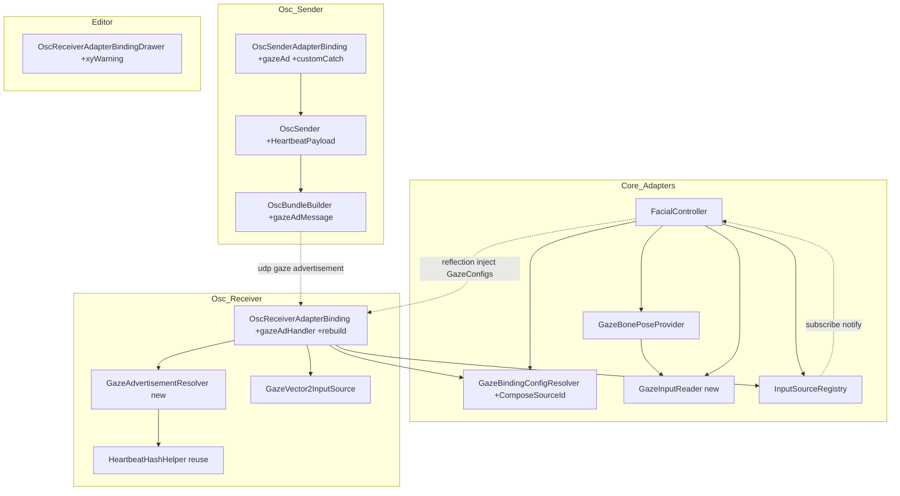
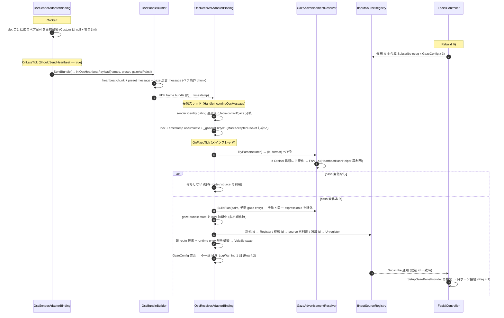
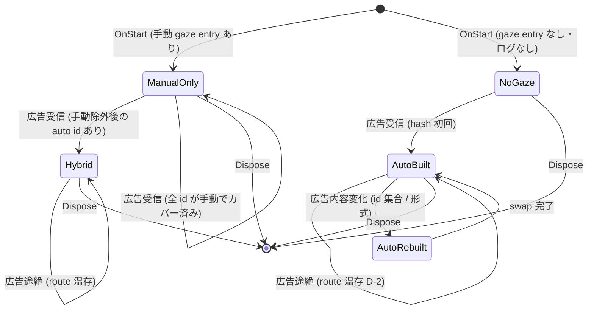

# Technical Design Document — osc-gaze-auto-mapping

## Overview

**Purpose**: OSC 送信側が専用アドレス `/_facialcontrol/gaze` で gaze の id（expressionId 文字列）と形式（`VRChat_XY` / `ARKit_8BS`）を広告し、受信側が gaze route / `GazeVector2InputSource` を広告駆動で自動生成・再構築する。受信側の gaze `OscMappingEntry` 手入力（送受信マシン間の expressionId Ordinal 突合）を不要にし、実機の未解決不具合「OSC 受信端末で gaze だけ動かない」を根治する。あわせて gaze 経路の潜在バグ 4 件（Custom preset 未捕捉例外 / 後発登録レース / `Gaze_VRChat_XY`+`leftRightIndependent` の見かけ倒し / 読取ロジック重複)を回収する。

**Users**: OSC 送受信を構成する Unity エンジニア（受信側は gaze mapping 手入力ゼロで疎通）、既存手動 mapping 資産の利用者（上書きオプションとして存続）、コア保守担当（読取ロジック単一化）。

**Impact**: `osc-receiver-auto-mapping` で確立した heartbeat auto-mapping アーキテクチャ（受信スレッド accumulate + dirty flag → `OnFixedTick` で FNV-1a 変化検出 → 再構築）を gaze に拡張する。heartbeat（`/_facialcontrol/blendshape_names`）/ preset（`/_facialcontrol/preset`）経路は一切変更しない。

### Goals

- **G1**: 送信側が heartbeat と同周期で `/_facialcontrol/gaze` 広告を送出し、受信側が gaze route / source を自動生成・再構築する（Req 1, 2, 11）
- **G2**: 手動 gaze mapping は上書き用オプションとして完全互換で存続する（Req 3）
- **G3**: 広告 id と受信側 GazeConfig の不一致を無警告沈黙させない（Req 4、D-1: 突合の自動解決はしない）
- **G4**: 潜在バグ 4 件の回収（Req 5-8）と GC ゼロ運用の維持（Req 9）
- **G5**: サンプル・ドキュメントの追従と backlog（M-25 重複 / S-21）の整理（Req 10, 2.9）

### Non-Goals

- identity モデルの変更（規約 id `"gaze"` 化、isGaze ダミー Expression 廃止）→ Spec 2（gaze-channel-redesign）
- 受信側 GazeConfig の自動生成・自動補完（D-1 で案 (c) 確定。目ボーン反映には GazeConfig の expressionId 手動一致が引き続き必要）→ Spec 2
- BlendShape gaze の runtime 配線（backlog M-29）/ multi-source gaze blending（M-13）/ uOsc 差し替え（M-16）
- Inspector の Manual/Auto 出自 badge UI（M-26。本 spec は診断ログまで）
- Fork（jp.co.unvgi.*）への反映・publish・実機検証（D-3。spec 外の運用フロー）
- per-route staleness の導入（Decision 4 で見送り。実害確認時に backlog 化）

## Design Decisions（requirements.md Open Questions の確定）

requirements.md 末尾の未決事項 4 件を以下のとおり確定する。詳細な代替案比較は `research.md` の Design Decisions 参照。

| # | 論点 | 決定 | 主根拠 |
|---|------|------|--------|
| 1 | 広告 payload 形式 | `/_facialcontrol/gaze` 1 message に string 引数 flat pairs `[id0, format0, id1, format1, ...]`。format は `"VRChat_XY"` / `"ARKit_8BS"` の 2 値。左右独立フラグは載せない。MTU 超過時はペア境界で chunk 分割し同一 bundle timestamp で accumulate（heartbeat と同機構） | preset message 前例と同型で受信 parse が最小。典型 1〜2 ペアは常に 1 message。ARKit_8BS は形式自体が左右を運び、VRChat_XY は独立フラグを載せても実現不能。載せないことで Spec 2 までプロトコル安定（S1-3） |
| 2 | `Gaze_VRChat_XY` + `leftRightIndependent` の扱い（Req 7.3） | **警告に留める**（Inspector HelpBox + runtime `Debug.LogWarning` 1 回）。組み合わせ禁止（skip / validation エラー）にはしない | 禁止すると現在動作中の既存アセット（左右同値でも `.left`/`.right` 登録で side-pair 解決が成立する構成）が沈黙し Req 3.4 と衝突。挙動は定義済み（左右同値配布）で害は誤解のみ |
| 3 | 先読み Subscribe の実現方式（Req 6.2） | **候補 id 全合成方式**: `FacialController` が binding slug 一覧 × GazeConfigs から `{slug}:{expressionId}` / `.left` / `.right` を全合成して `IInputSourceRegistry.Subscribe` する。registry への全登録イベント API 追加（Domain 契約変更）はしない | `Subscribe` は未登録 id にも張れる既存契約で足りる。候補集合は有界（slug 数 × config 数 × 3）。Domain 契約変更は全実装 + Fake へ波及し、Spec 2 の `"gaze"` 定数化で不要になる過剰投資 |
| 4 | per-route staleness の要否（Req 2.8 注記） | **導入しない**。binding 単位共有 staleness を維持し、「BlendShape 継続 + gaze のみ途絶」は最終値保持となる制限を README / mental-model に明記 | 発生条件（送信側が生きたまま gaze だけ停止）は送信側 gaze 構成のランタイム消失に限られ、D-2 の route 温存方針と整合。per-route 時刻管理は受信スレッド hot path への書き込み追加で Req 9.2 に逆行 |

補助決定（requirements 明記外の設計判断）:

- **Req 4.2 警告の配置**: `OscReceiverAdapterBinding` に置く。受信側 GazeConfigs は `FacialController.FindGazeConfigureMethod` の既存リフレクション注入契約（末尾引数 `IReadOnlyList<GazeBindingConfig>` の `Configure`）で受け取る（core 変更ゼロ）。注入が無い場合は空集合として扱い警告を出す（無警告沈黙の禁止）。
- **`OscSender.SendBundle` の拡張方式**: 既存 6 overload への 9 引数 overload 追加は行わず、`OscHeartbeatPayload` readonly struct を導入して 1 本の overload に集約する。既存 overload は無改修で温存。
- **読取共通化の挙動選択（Req 8）**: FacialController 側挙動（null チェック + clamp 内包）に寄せる。scalar → x=v, y=0 は両実装で一致しており争点なし。`GazeBonePoseProvider` の「y のみ駆動」誤解コメントは実装に一致する記述へ修正。
- **広告駆動 route の再構築ポリシー**: 広告の内容変化（AC 2.4）では最新広告集合に合わせて auto route を追加・削除する（削除 id の source は `Unregister`）。広告の完全途絶（AC 2.8, D-2）では一切破棄しない。手動 route は OnStart 以降不変。

## Boundary Commitments

### This Spec Owns

- **`/_facialcontrol/gaze` 広告プロトコル**: アドレス定数・payload 形式（flat pairs）・chunk 分割規約・後方互換規約（旧 receiver は未知アドレスとして無視）
- **送信側広告経路**: `SendSlot` への広告ペア事前構築、`OscHeartbeatPayload` struct、`OscBundleBuilder` の広告 message 追加、Custom preset の広告除外 + 警告
- **送信側 gaze 例外処理**: `AppendGazeMappings` の `NotSupportedException` catch（警告 + 当該 endpoint の gaze のみ skip、binding 起動継続）
- **受信側広告駆動 gaze lifecycle**: 広告 accumulate / dirty / `OnFixedTick` 再構築、`GazeAdvertisementResolver`（新規 helper）、gaze bundle state の lazy 初期化、route 辞書の immutable-swap、手動優先の共存規則、auto source の Register / 再利用 / Unregister
- **GazeConfig 突合警告**: receiver への `Configure(IReadOnlyList<GazeBindingConfig>)` 追加と不一致 id の 1 度警告（Req 4.2）
- **診断ログの整理**: 「gaze mapping が未設定…」ログの削除（Req 2.9）と S-21 赤 4 件の解消確認、manual/auto 出自の診断ログ
- **core の gaze 読取共通化**: `GazeInputReader`（新規 static helper）と両呼び出し元の置換
- **core の先読み Subscribe**: `FacialController.SubscribeGazeInputSources` の候補 id 全合成化、`GazeBindingConfigResolver` への id 合成 helper 追加（Spec 2 の `GazeSourceIdConvention` への集約先として局所化）
- **Inspector 警告**: `OscReceiverAdapterBindingDrawer` の `Gaze_VRChat_XY` + `leftRightIndependent` 警告表示
- **サンプル / ドキュメント**: `OscReceiverDemoProfile.asset` の gaze 手入力削除、両 README 更新、`docs/backlog.md` の M-25 番号重複解消 + クローズ + S-21 追従、`docs/mental-model.md` 更新
- **テスト**: `OscGazeE2ETests` 拡張（UDP loopback + 決定論ハンドラ直接呼び出し）、後発登録・広告途絶温存・手動共存・GC の各検証

### Out of Boundary

- heartbeat / preset アドレスの仕様・実装（`/_facialcontrol/blendshape_names`, `/_facialcontrol/preset` は一切変更しない）
- BlendShape auto mapping 経路（`RuntimeMappingResolver` / `OscInputSource` / `OscDoubleBuffer`）の改変
- `IInputSourceRegistry` の契約変更（Subscribe / Register / Replace / Unregister は既存契約のまま使用）
- `OscMappingEntry` / `OscRuntimeSettingsSO` のシリアライズスキーマ変更
- GazeConfig（目ボーン設定）の生成・編集 UX、identity モデル刷新（→ Spec 2）
- `GazeBindingConfigResolver` の解決アルゴリズム変更（id 合成 helper の追加のみ。3 段フォールバック・slug Ordinal 優先は不変）

### Allowed Dependencies

- **Upstream（core: com.hidano.facialcontrol）**:
  - `IInputSourceRegistry`（Subscribe / Register(slug, sub) / Replace(slug, sub) / Unregister(slug, sub) — 既存契約のみ）
  - `GazeBindingConfig` / `GazeBindingConfigResolver`（osc → core 参照は既存。合成 helper を追加）
  - `FacialController` のリフレクション注入契約（末尾引数 `IReadOnlyList<GazeBindingConfig>` の `Configure`）
- **Sibling（osc パッケージ内）**: `OscBundleBuilder` / `OscSender` / `OscReceiver`（`HandleOscMessage` public、テスト直接呼び出し可）/ `HeartbeatHashHelper`（FNV-1a 再利用）/ `PerfectSyncEyeLook` / `OscAddressFormatter`
- **External**: uOSC（既存依存、追加なし）
- **依存方向制約**: 広告駆動ロジックは Adapters 層（osc パッケージ）に閉じる。Domain 層への変更はゼロ。core 変更は `GazeInputReader` 新設・`FacialController` の Subscribe 拡張・`GazeBindingConfigResolver` の helper 追加・`GazeBonePoseProvider` の読取置換の 4 点のみ。

### Revalidation Triggers

- `/_facialcontrol/gaze` payload 形式（pairs / format 識別子）の変更 → Spec 2（gaze-channel-redesign）へ通知（S1-3: Spec 2 は id が `"gaze"` 定数になるだけでプロトコル無変更が前提）
- gaze source id 合成規約（`{slug}:{expressionId}[.left/.right]`）の変更 → Spec 2 の `GazeSourceIdConvention` 設計へ通知
- `FindGazeConfigureMethod` のリフレクション契約変更（Spec 2 で型付きインターフェース化予定）→ 本 spec で追加する receiver の `Configure` を置換対象リストに含める
- `HeartbeatHashHelper` のハッシュ仕様変更 → 広告変化検出の正規化順序（id Ordinal 昇順 interleave）の再確認

## Architecture

### Existing Architecture Analysis

**保持するパターン**（osc-receiver-auto-mapping design 準拠）:
- AdapterBinding lifecycle: `OnStart` → `OnFixedTick` / `OnLateTick` → `Dispose`
- 受信スレッド hot path は「lock + scratch accumulate + dirty flag」のみ。再構築はメインスレッド `OnFixedTick`
- FNV-1a 32-bit（`HeartbeatHashHelper`）による内容変化検出。変化時のみ再構築
- helper 切り出し（`RuntimeMappingResolver` / `AddressPresetEstimator` 前例）で binding 肥大を防ぎ EditMode 単体テストを可能にする
- 広告 message は sender identity gating（`IsAcceptedSenderMessage`）配下で dispatch し、`MarkAcceptedPacket` は呼ばない（heartbeat / preset と同格の metadata 扱い。staleness を metadata で延命させない）

**解消する技術的負債 / 制約**:
- gaze route の `OnStart` 固定（`HasGazeMappings(_mappings)` が SerializeField のみ参照）→ 広告駆動の動的再構築へ
- `StartReceiverPhase` の「gaze mapping が未設定…」`Debug.Log`（前提虚偽化）→ 削除。S-21 の pre-existing 赤 4 件が解消
- `AppendGazeMappings` の未捕捉 `NotSupportedException`（Custom preset で binding 全停止）→ BlendShape 側と同じ catch + skip へ
- gaze 読取ロジックの二重実装 → `GazeInputReader` へ集約
- `.left` / `.right` の文字列連結が receiver / resolver に散在 → `GazeBindingConfigResolver` の合成 helper へ局所化（Spec 2 準備）

**新規に必要となる並行性制御**: `_gazeRoutes`（Dictionary）は受信スレッド `TryHandleGazeMessage` から参照される。動的再構築では新しい辞書・runtime entry 群を完全構築してから参照を Volatile swap する（既存辞書の in-place 変更は禁止）。gaze bundle state（`_gazeBundleSync` ほか）の lazy 初期化は swap より前に完了させる。

### Architecture Pattern & Boundary Map



**Architecture Integration**:
- **Selected pattern**: 既存 Clean Architecture を維持し、Adapters 内で `GazeAdvertisementResolver` を小粒度 helper として追加（research.md Option C）。core への追加は `GazeInputReader` と `GazeBindingConfigResolver` の合成 helper のみで、いずれも Unity 依存最小の static クラス。
- **New components rationale**: `GazeAdvertisementResolver` は「広告 parse + 正規化ハッシュ + route plan 計算（手動除外込み）」を純粋関数群として切り出し、1830 行の binding を肥大させず EditMode で単体テスト可能にする。`GazeInputReader` は Req 8 の単一実装点。
- **Steering compliance**: Domain 非依存契約の維持（Domain 変更ゼロ）、`Debug.Log/Warning/Error` のみのログ、毎フレーム GC ゼロ目標（再構築時のみ確保）、asmdef 依存方向（osc → core の一方向）を維持。

### Technology Stack

| Layer | Choice / Version | Role in Feature | Notes |
|-------|------------------|-----------------|-------|
| Messaging / Events | uOSC（既存）+ `/_facialcontrol/gaze` 新設アドレス | gaze id / 形式の周期広告（heartbeat 同乗） | heartbeat / preset アドレスは無改修 |
| Backend / Services | C# 9（Unity 6 Roslyn）、Adapters 層 | 広告 parse / route 再構築 / 読取共通化 | 追加依存なし |
| Data / Storage | 既存 SerializeField 温存 + `[NonSerialized]` runtime 状態 | 広告由来 route / source は非シリアライズ（Req 3.4） | スキーマ破壊変更なし |
| Editor | UI Toolkit（既存 Drawer 拡張） | `Gaze_VRChat_XY` + `leftRightIndependent` 警告 | 既存 `MappingWarningName` HelpBox 機構を拡張 |

## File Structure Plan

### Directory Structure

```
FacialControl/Packages/com.hidano.facialcontrol/
└── Runtime/Adapters/
    ├── InputSources/
    │   └── GazeInputReader.cs                    # 新規: gaze 読取の単一実装 (Req 8)
    ├── ScriptableObject/
    │   └── GazeBindingConfigResolver.cs          # 改修: source id 合成 helper 追加 (Spec 2 準備)
    ├── Bone/
    │   └── GazeBonePoseProvider.cs               # 改修: TryReadInputXY → GazeInputReader 委譲
    └── Playable/
        └── FacialController.cs                   # 改修: 候補 id 先読み Subscribe (Req 6)、TryReadGazeInput → GazeInputReader

FacialControl/Packages/com.hidano.facialcontrol.osc/
├── Runtime/Adapters/
│   ├── AdapterBindings/
│   │   ├── OscSenderAdapterBinding.cs            # 改修: 広告ペア構築 / Custom catch + 広告除外警告 (Req 1, 5, 9.5)
│   │   └── OscReceiverAdapterBinding.cs          # 改修: 広告 handler / 再構築配線 / GazeConfigs 注入 / ログ削除 (Req 2, 3, 4, 7.2)
│   └── OSC/
│       ├── OscSender.cs                          # 改修: OscHeartbeatPayload struct + SendBundle overload 1 本
│       ├── OscBundleBuilder.cs                   # 改修: 広告 message 追加 (ペア境界 chunk 分割)
│       └── GazeAdvertisementResolver.cs          # 新規: 広告 parse / 正規化ハッシュ / route plan (Req 2, 3.2, 9.1)
├── Editor/AdapterBindings/
│   └── OscReceiverAdapterBindingDrawer.cs        # 改修: VRChat_XY + leftRightIndependent 警告 (Req 7.1)
├── Samples~/
│   ├── OscReceiverDemo/
│   │   ├── OscReceiverDemoProfile.asset          # 改修: Gaze_VRChat_XY 手入力 1 件削除 (Req 10.1)
│   │   └── README.md                             # 改修: gaze 自動マッピング説明 + 旧ログ文言追従 (Req 10.2)
│   └── OscOutputDemo/
│       └── README.md                             # 改修: /_facialcontrol/gaze 広告説明 (Req 10.2)
└── Tests/
    ├── EditMode/Adapters/OSC/
    │   ├── GazeAdvertisementResolverTests.cs     # 新規: parse / hash / plan / 手動除外
    │   └── OscBundleBuilderTests.cs              # 改修: 広告 message / ペア境界 chunk 検証追加
    ├── EditMode/Adapters/AdapterBindings/
    │   └── OscSenderAdapterBindingTests.cs       # 改修: Custom catch / 広告除外警告
    └── PlayMode/Integration/
        ├── OscGazeE2ETests.cs                    # 拡張: 手入力ゼロ E2E / 後発登録 / 途絶温存 / 手動共存 (Req 11)
        ├── OscReceiverAdapterBindingAutoMappingIntegrationTests.cs  # 改修: S-21 ログ削除の緑化確認
        ├── OscHeartbeatConsistencyTests.cs       # 確認: S-21 赤 1 件の緑化
        └── OscReceiverGCAllocationTests.cs       # 確認: S-21 赤 1 件の緑化 + 広告経路 GC 検証追加

FacialControl/Packages/com.hidano.facialcontrol/
└── Tests/EditMode/Adapters/
    ├── InputSources/GazeInputReaderTests.cs      # 新規: 読取共通化の挙動固定 (Req 8.3)
    └── Playable/ (FacialController gaze 購読テスト)  # 改修/新規: 後発登録の決定論テスト (Req 6.3)

docs/
├── backlog.md                                    # 改修: M-25 重複解消 + gaze M-25 クローズ + S-21 クローズ (Req 10.3, 10.4, 2.9)
└── mental-model.md                               # 改修: gaze 受信の広告駆動化を反映 (Req 10.5)
```

### Modified Files（要点のみ、詳細は Components 参照）

- `OscSenderAdapterBinding.cs` — OnStart で slot ごとに広告ペア配列 `string[] GazeAdvertisementPairs` を事前構築（VRChat → `"VRChat_XY"` / ARKit → `"ARKit_8BS"`、Custom → null + 警告 1 回）。heartbeat 分岐を `OscHeartbeatPayload` 経路へ移行。`AppendGazeMappings` に catch 追加。
- `OscReceiverAdapterBinding.cs` — `GazeAdvertisementAddress` 定数（`PresetAddress` と同じ箇所で定義）、広告 handler（accumulate + dirty）、`ProcessPendingGazeAdvertisement`（OnFixedTick）、`RebuildGazeRoutes`（immutable-swap）、`Configure(IReadOnlyList<GazeBindingConfig>)`、Req 2.9 ログ削除、Req 7.2 警告。
- `FacialController.cs` — binding slug 一覧の保持、`SubscribeGazeInputSources` の候補 id 全合成 Subscribe、`TryReadGazeInput` の `GazeInputReader` 委譲。
- `GazeBindingConfigResolver.cs` — `ComposeSourceId(slug, expressionId, GazeSide)` 追加（`.left`/`.right` 定数の唯一の合成点にする）。
- `GazeBonePoseProvider.cs` — `TryReadInputXY` を `GazeInputReader.TryReadXY` に置換、caller 側 clamp 削除、誤解コメント修正。

## System Flows

### 広告送出 → 受信 → 再構築（正常系）



**Key Decisions（図に表れない補足）**:
- 広告 message は heartbeat と同一 frame bundle・同一 timestamp で届くため、chunk accumulate の完了判定は heartbeat と同じ「新 timestamp で reset」方式。広告と heartbeat の処理順は互いに独立（共有状態なし）。
- `IsAcceptedSenderMessage` の後段に分岐を置くことで zombie sender の広告は無視される。`MarkAcceptedPacket` を呼ばないため、広告だけが届き続けても staleness フェイルセーフは延命されない。
- 未知 format のペアは plan から除外し 1 度だけ警告（Req 2.6）。ペア数が奇数（不正 payload）の場合は末尾の孤立要素を無視する。
- 広告が一切届かなくなっても再構築はトリガされない（dirty が立たない）ため、生成済み route / source は自然に温存される（AC 2.8, D-2 — 追加コード不要で成立）。

### Gaze route の状態遷移



**シナリオ補足**:
- **NoGaze**: 広告未受信かつ手動 entry 無しでは route / source を一切生成せず、`Debug.LogError` も出さない（AC 2.7）。Req 2.9 のログ削除によりこの状態は無言になる。
- **Hybrid**: 手動 entry の route / source は再構築の対象外（参照ごと新辞書に引き継ぐ）。auto 部分のみ差し替える（AC 3.2）。
- **値のフェイルセーフ**: 全状態で既存の `PublishGazeForCurrentLifecycleState`（binding 共有 staleness + RevertToBase / HoldLastValue）に委ねる（AC 2.8, Decision 4）。

## Requirements Traceability

| Requirement | Summary | Components | Interfaces / Flows |
|-------------|---------|------------|--------------------|
| 1.1 | heartbeat 同周期で広告送出 | OscSenderAdapterBinding, OscSender, OscBundleBuilder | `OnLateTick` heartbeat 分岐 → `SendBundle(in OscHeartbeatPayload)` |
| 1.2 | payload に id + 形式識別子（文字列） | OscBundleBuilder, GazeAdvertisementResolver | flat pairs schema（Data Models） |
| 1.3 | 形式は endpoint preset から確定 | OscSenderAdapterBinding | `SendSlot.Preset` → `ToGazeFormatName` |
| 1.4 | 複数 gaze id を全件広告 | OscSenderAdapterBinding | OnStart のペア配列構築（`ResolveGazeExpressionIds` 全件） |
| 1.5 | gaze 構成ゼロなら広告なし | OscSenderAdapterBinding | ペア配列空 → payload.GazeAdvertisementPairs = null |
| 1.6 | 旧 receiver は未知アドレスとして無害 | （旧実装の性質確認） | 未知 address は mapping 不一致で無言破棄（テストで確認） |
| 2.1 | 広告から route 動的生成（VRChat_XY / ARKit_8BS） | OscReceiverAdapterBinding, GazeAdvertisementResolver | `RebuildGazeRoutes` / 広告フロー図 |
| 2.2 | `GazeVector2InputSource` を規約 id で登録 | OscReceiverAdapterBinding, GazeBindingConfigResolver | `ComposeSourceId` + `Register(slug, sub, source)` |
| 2.3 | OnStart 固定の解消 | OscReceiverAdapterBinding | 広告 handler + lazy init（`InitializeGazeBundleState`） |
| 2.4 | 内容変化で再構築 | GazeAdvertisementResolver | 正規化 FNV-1a 差分 → rebuild |
| 2.5 | 同一内容は再生成しない | GazeAdvertisementResolver | hash 一致 → no-op、継続 id は source インスタンス再利用 |
| 2.6 | 未知形式は skip + 警告 1 回 | GazeAdvertisementResolver | `TryParse` の warnedOnUnknownFormat フラグ |
| 2.7 | 広告なし・手動なしで無生成・無 LogError | OscReceiverAdapterBinding | NoGaze 状態（状態遷移図） |
| 2.8 | 広告途絶で route 温存（staleness は既存機構） | OscReceiverAdapterBinding | dirty 非発火 = 温存（追加コードなし）、Decision 4 |
| 2.9 | 「gaze mapping 未設定」ログ削除 + S-21 解消 | OscReceiverAdapterBinding, docs/backlog.md | `StartReceiverPhase` のログ削除 → PlayMode 4 件緑化確認 |
| 3.1 | 手動 entry の既存挙動維持 | OscReceiverAdapterBinding | `RegisterGazeSources`（OnStart 経路）不変 |
| 3.2 | 同一 expressionId は手動優先 | GazeAdvertisementResolver | `BuildPlan` で Register 前に Ordinal 除外 |
| 3.3 | 広告なし環境で手動のみ動作 | OscReceiverAdapterBinding | ManualOnly 状態（状態遷移図） |
| 3.4 | シリアライズ非破壊・既存アセット互換 | OscReceiverAdapterBinding | auto 状態は全て `[NonSerialized]` |
| 3.5 | 手動/広告由来をログで識別 | OscReceiverAdapterBinding | rebuild 時の診断ログ（manual=N / auto=M / id 列挙） |
| 4.1 | 一致 GazeConfig は手動設定なしで目ボーン接続 | FacialController, GazeBindingConfigResolver | 先読み Subscribe → `SetupGazeBoneProvider` 再構築 |
| 4.2 | 不一致 id を警告 1 回（無警告沈黙禁止） | OscReceiverAdapterBinding | `Configure(IReadOnlyList<GazeBindingConfig>)` 注入 + rebuild 時突合 |
| 4.3 | 突合の自動解決はしない（D-1） | （設計方針） | Non-Goals / README 案内（10.2） |
| 5.1 | Custom preset gaze の catch + 継続 | OscSenderAdapterBinding | `AppendGazeMappings` の try/catch（BlendShape 側 L783-790 と同型） |
| 5.2 | Custom は広告除外 + 警告 1 回 | OscSenderAdapterBinding | ペア配列 null + OnStart 警告 |
| 6.1 | 後発登録 source の購読反映 | FacialController | Subscribe 通知 → `SetupGazeBoneProvider` |
| 6.2 | 未解決 id の購読予約 | FacialController, GazeBindingConfigResolver | 候補 id 全合成 Subscribe（Decision 3） |
| 6.3 | 後発登録の決定論テスト | FacialController テスト | Subscribe 後 Register シナリオ（EditMode） |
| 7.1 | Drawer 警告表示 | OscReceiverAdapterBindingDrawer | `RefreshSourceIdWarning` 拡張 |
| 7.2 | runtime 警告 1 回 | OscReceiverAdapterBinding | route 構築時の warned フラグ |
| 7.3 | 警告 or 禁止の確定 | （設計決定） | Decision 2: 警告に留める |
| 8.1 | 読取ロジック単一化 | GazeInputReader | `TryReadXY` static helper |
| 8.2 | 両経路で同一読取結果 | GazeBonePoseProvider, FacialController | 両呼び出し元を helper へ置換 |
| 8.3 | 既存テスト緑維持 + 挙動選択の明示 | GazeInputReaderTests | Decision 7（null チェック + clamp 内包 + scalar→x） |
| 9.1 | GC ゼロの順序安定ハッシュで変化検出 | GazeAdvertisementResolver, HeartbeatHashHelper | id Ordinal 昇順正規化 + FNV-1a |
| 9.2 | hot path は到着記録のみ、再構築はメインスレッド | OscReceiverAdapterBinding | accumulate + dirty（広告フロー図） |
| 9.3 | 内容不変時は毎フレーム新規アロケーションなし | OscReceiverAdapterBinding | dirty 消化時のみ scratch copy、hash 一致で即 return |
| 9.4 | `GazeVector2InputSource` 読取 0 byte 維持 | GazeVector2InputSource（無改修） | 既存実装のまま（改修なしを退行確認） |
| 9.5 | 広告組み立て・送出のヒープ確保回避 | OscSenderAdapterBinding, OscBundleBuilder | OnStart 事前構築ペア配列 + ArrayPool buffer 再利用 |
| 10.1 | サンプルの gaze 手入力削除 | OscReceiverDemoProfile.asset | Mappings 空化（BlendShape / gaze とも auto） |
| 10.2 | README 更新（動作条件 + 旧ログ文言追従） | 両 README | 広告前提 / 外部 OSC ソースは手動 mapping / トラブルシュート改稿 |
| 10.3 | M-25 番号重複解消 | docs/backlog.md | gaze ブロックへ次の空き番号を付番（表情 active 系は M-25 のまま）+ 履歴行に参照注記 |
| 10.4 | gaze エントリ（旧 M-25、新番号）クローズ | docs/backlog.md | 新番号ブロック削除 + commit message に理由 |
| 10.5 | mental-model 更新 | docs/mental-model.md | gaze 受信 = 広告駆動へ記述更新 + Decision 4 の制限明記 |
| 11.1 | VRChat preset の手入力ゼロ E2E | OscGazeE2ETests | UDP loopback（port 19341〜） |
| 11.2 | ARKit preset の手入力ゼロ E2E | OscGazeE2ETests | 同上 |
| 11.3 | 後発登録 / 途絶温存 / 手動共存シナリオ | OscGazeE2ETests | Testing Strategy 参照 |
| 11.4 | 決定論方式（実周期待ちなし） | OscGazeE2ETests | `HelperHost.Receiver.HandleOscMessage` 直接呼び出し |
| 11.5 | 受け入れ条件 = registry まで自動反映 | OscGazeE2ETests | `GazeVector2InputSource` の値 assert（目ボーンは 4.1 条件付き） |

## Components and Interfaces

| Component | Domain/Layer | Intent | Req Coverage | Key Dependencies (P0/P1) | Contracts |
|-----------|--------------|--------|--------------|--------------------------|-----------|
| GazeAdvertisementResolver | Adapters/OSC (新規) | 広告 parse / 正規化ハッシュ / route plan（手動除外） | 1.2, 2.1, 2.4, 2.5, 2.6, 3.2, 9.1 | HeartbeatHashHelper (P0) | Service |
| OscReceiverAdapterBinding | Adapters/OSC (改修) | 広告 handler / rebuild 配線 / GazeConfig 突合 / ログ整理 | 2.*, 3.*, 4.2, 7.2, 9.2, 9.3 | GazeAdvertisementResolver (P0), IInputSourceRegistry (P0), GazeBindingConfigResolver (P1) | Service, State, Event |
| OscSenderAdapterBinding | Adapters/OSC (改修) | 広告ペア事前構築 / Custom catch + 広告除外 | 1.1-1.5, 5.1, 5.2, 9.5 | OscSender (P0), OscBundleBuilder (P0) | State |
| OscSender / OscBundleBuilder | Adapters/OSC (改修) | `OscHeartbeatPayload` overload / 広告 message 組み立て | 1.1, 1.2, 9.5 | uOSC (P0), ArrayPool (P0) | Service, Batch |
| GazeInputReader | Core Adapters/InputSources (新規) | gaze 読取の単一実装 | 8.1-8.3 | IAnalogInputSource (P0) | Service |
| FacialController | Core Adapters/Playable (改修) | 候補 id 先読み Subscribe / 読取委譲 | 4.1, 6.1, 6.2, 8.2 | IInputSourceRegistry (P0), GazeBindingConfigResolver (P0) | Service |
| GazeBindingConfigResolver | Core Adapters/SO (改修) | source id 合成の局所化 helper | 2.2, 6.2 | — | Service |
| GazeBonePoseProvider | Core Adapters/Bone (改修) | 読取委譲（挙動互換） | 8.1, 8.2 | GazeInputReader (P0) | Service |
| OscReceiverAdapterBindingDrawer | Editor (改修) | VRChat_XY + 左右独立の警告表示 | 7.1 | UI Toolkit (P0) | State |
| Samples / docs | Samples~, docs/ | サンプル・ドキュメント追従 | 10.* | — | — |

### Adapters / OSC

#### GazeAdvertisementResolver（新規）

| Field | Detail |
|-------|--------|
| Intent | 広告 payload の parse・順序安定ハッシュ・route plan 計算を純粋関数群として提供する |
| Requirements | 1.2, 2.1, 2.4, 2.5, 2.6, 3.2, 9.1 |

**Responsibilities & Constraints**
- 受信 scratch（string リスト）を (id, format) ペア列として解釈し、id Ordinal 昇順に正規化してから `HeartbeatHashHelper.ComputeFnv1a` で変化検出ハッシュを計算する。
- route plan の計算では手動 gaze entry（`Gaze_VRChat_XY` / `Gaze_ARKit_8BS` の有効 entry）と同一 expressionId の広告ペアを **Register 前に**除外する（`registry.Register` の LogError + 後勝ちを踏まないため。Req 3.2）。
- 未知 format のペアは plan から除外し、warned フラグ（ref bool）で 1 度だけ警告。奇数個の payload は末尾孤立要素を無視。
- 状態を持たない static class。scratch リストは呼び出し側（binding）が再利用可能な形で渡す。

**Dependencies**
- Inbound: `OscReceiverAdapterBinding`（P0）
- Outbound: `HeartbeatHashHelper`（P0）— FNV-1a 本体を再利用

**Contracts**: Service [x]

##### Service Interface
```csharp
namespace Hidano.FacialControl.Adapters.OSC
{
    public enum GazeAdvertisedFormat
    {
        VRChatXY,   // 広告文字列 "VRChat_XY"
        ArKit8BS    // 広告文字列 "ARKit_8BS"
    }

    public readonly struct GazeAdvertisedEntry
    {
        public string ExpressionId { get; }
        public GazeAdvertisedFormat Format { get; }
    }

    public static class GazeAdvertisementResolver
    {
        public const string FormatNameVrChatXy = "VRChat_XY";
        public const string FormatNameArKit8Bs = "ARKit_8BS";

        /// <summary>
        /// scratch (accumulate 済み string 列) を (id, format) ペアとして解釈し、
        /// id Ordinal 昇順に正規化した結果を results に書き込む。
        /// 未知 format は skip し warnedOnUnknownFormat 経由で 1 度だけ警告する。
        /// normalizedScratch は正規化 interleave 列 [id0, fmt0, id1, fmt1...] の再利用バッファ。
        /// </summary>
        public static void ParseAndNormalize(
            IReadOnlyList<string> scratch,
            List<GazeAdvertisedEntry> results,
            List<string> normalizedScratch,
            ref bool warnedOnUnknownFormat);

        /// <summary>正規化済み interleave 列の FNV-1a ハッシュ (HeartbeatHashHelper 委譲)。</summary>
        public static uint ComputeHash(IReadOnlyList<string> normalizedScratch);

        /// <summary>
        /// 広告 entry から手動 gaze entry と同一 expressionId (Ordinal) を除外した
        /// auto route plan を planResults に書き込む (Req 3.2)。
        /// </summary>
        public static void BuildPlan(
            IReadOnlyList<GazeAdvertisedEntry> advertised,
            IReadOnlyList<OscMappingEntry> manualEntries,
            List<GazeAdvertisedEntry> planResults);
    }
}
```
- Preconditions: `scratch` は null 可（空扱い）。`results` / `normalizedScratch` / `planResults` は呼び出し側所有の再利用リスト。
- Postconditions: `results` は id Ordinal 昇順。`planResults` ⊆ `advertised` で手動カバー分を含まない。
- Invariants: 同一入力 → 同一ハッシュ（順序揺れは正規化で吸収）。同一 id が広告内に重複する場合は先勝ちで 1 件に正規化する。

**Implementation Notes**
- Integration: format 文字列比較は Ordinal。`GazeAdvertisedFormat` → 受信側 route 形は VRChatXY → `Gaze_VRChat_XY` 相当（address = `OscAddressFormatter.VRChatParameterPrefix + id` + `X`/`Y`）、ArKit8BS → `Gaze_ARKit_8BS` 相当（`PerfectSyncEyeLook` 固定 8 address）。
- Validation: EditMode 単体テストで空 / 奇数 payload / 未知 format / 重複 id / 順序揺れを固定する。
- Risks: 広告 id 数は少数想定のため挿入ソートで十分。ソート scratch はリスト再利用で確保を抑える。

#### OscReceiverAdapterBinding（改修）

| Field | Detail |
|-------|--------|
| Intent | 広告受信の accumulate / dirty / メインスレッド再構築の配線と、手動優先共存・GazeConfig 突合警告・診断ログを担う |
| Requirements | 2.1-2.9, 3.1-3.5, 4.2, 7.2, 9.2, 9.3 |

**Responsibilities & Constraints**
- 新定数 `public const string GazeAdvertisementAddress = "/_facialcontrol/gaze";` を `PresetAddress` と同じ箇所で定義（送信側 `OscSender` は同値の private バイト列を保持する preset 前例踏襲）。
- `HandleIncomingOscMessage` に `GazeAdvertisementAddress` 分岐を追加（`IsAcceptedSenderMessage` 通過後・`MarkAcceptedPacket` なし・return false）。受信スレッド処理は「lock + 同一 bundle timestamp accumulate + `Volatile.Write(_gazeAdDirty, 1)`」のみ（heartbeat の `HandleHeartbeatMessage` と同型。Req 9.2）。
- `OnFixedTick` に `ProcessPendingGazeAdvertisement` を追加: dirty 消化 → scratch copy → parse/normalize → hash 比較 → 変化時のみ `RebuildGazeRoutes`。hash 一致時は一切確保しない（Req 2.5, 9.3）。
- `RebuildGazeRoutes`:
  1. gaze bundle state 未初期化なら `InitializeGazeBundleState`（lazy。広告駆動で `hasGazeMappings=false` 起動だったケース。Req 2.3）
  2. `GazeAdvertisementResolver.BuildPlan` で手動除外済み auto plan を取得
  3. auto source の差分適用: 新規 id → `GazeVector2InputSource` 生成 + `Register(slug, sub, source)` / 継続 id → 既存インスタンス再利用（registry 操作なし） / 消滅 id → `Unregister(slug, sub)`（Subscribe ハンドラに null 通知 → FacialController が provider 再構築）。id → source の対応は `[NonSerialized] Dictionary<string, GazeVector2InputSource> _autoGazeSourcesById` で保持
  4. 手動 route（OnStart 構築分）+ auto route から新しい `Dictionary<string, List<GazeRoute>>` と `List<GazeRuntimeEntry>` を**完全構築してから** `_gazeRoutes` / `_gazeRuntimeEntries` を Volatile swap（受信スレッド race 回避）
  5. 診断ログ: `"gaze routes published: manual={n}, auto={m}, autoIds=[...]"`（Req 3.5）
  6. GazeConfig 突合: auto id のうち注入済み GazeConfig の expressionId と Ordinal 一致しないものを、id ごとに 1 度だけ `Debug.LogWarning`（「GazeConfig の expressionId を '{id}' に一致させると目ボーンへ反映されます」の設定手掛かり付き。Req 4.2）
- source id 合成: `GazeBindingConfigResolver.ComposeSourceId` を経由する（`entry.expressionId + ".left"` 直書きの置換。ARKit_8BS は `leftRightIndependent` に関係なく `.left`/`.right`、VRChat_XY（auto）は共有 1 本 — 現行 `RegisterGazeSources` の規約と同一）。
- `public void Configure(IReadOnlyList<GazeBindingConfig> gazeConfigs)` を追加し、`FacialController.FindGazeConfigureMethod` のリフレクション注入で受信側 GazeConfigs（expressionId のみ使用）を受け取る。未注入は空集合扱い。
- `StartReceiverPhase` の「gaze mapping が未設定のため Gaze 受信は無効です…」`Debug.Log`（現 L636-641）を削除（Req 2.9）。
- 手動 route 構築時（OnStart）、`Gaze_VRChat_XY` かつ `leftRightIndependent=true` の entry に対し 1 度だけ `Debug.LogWarning`（「VRChat_XY 形式は単一 Vector2 のみを運ぶため左右には同値が配られます」。Req 7.2）。
- Dispose: 広告系 runtime 状態（scratch / dirty / hash / auto source 辞書 / warned 集合）を全解放。

**Dependencies**
- Inbound: `FacialAdapterBindingCollectionSO`（P0）、`FacialController`（P1）— GazeConfigs 注入
- Outbound: `GazeAdvertisementResolver`（P0）、`IInputSourceRegistry`（P0）、`GazeBindingConfigResolver.ComposeSourceId`（P1）、`OscReceiverHost` / `OscReceiver`（P0、既存）
- External: uOSC（P0）

**Contracts**: Service [x] / State [x] / Event [x]

##### Service Interface（追加分のみ）
```csharp
public sealed class OscReceiverAdapterBinding : AdapterBindingBase
{
    public const string GazeAdvertisementAddress = "/_facialcontrol/gaze";

    /// <summary>FacialController のリフレクション注入契約 (末尾引数 IReadOnlyList&lt;GazeBindingConfig&gt;)。</summary>
    public void Configure(IReadOnlyList<GazeBindingConfig> gazeConfigs);

    // 診断 API (テスト / デバッグ用)
    public uint LastGazeAdvertisementHash { get; }
    public IReadOnlyList<string> AutoGazeSourceIds { get; }   // 広告由来で現在登録中の source id
    public bool HasAutoGazeRoutes { get; }
}
```
- Preconditions: 広告処理は `_started == true` 時のみ有効。`Configure` は OnStart 前後どちらの呼び出しでも受理する（FacialController の rebuild 順に依存しない）。
- Postconditions: rebuild 完了時、`_gazeRoutes` は手動 route + 最新広告由来 route の合成。registry には手動 source + auto plan の source が過不足なく登録されている。
- Invariants: 手動 route / source は OnStart 以降不変。auto source は同一 id で常に同一インスタンス（内容変化を跨いで再利用）。`_gazeRoutes` の公開参照は常に完全構築済み辞書。

##### Event Contract
- Subscribed（OSC 受信）: `/_facialcontrol/gaze` — string 引数 flat pairs。sender identity gating 配下。chunk は同一 bundle timestamp で accumulate。
- Published（registry 経由）: `Register` / `Unregister` の Subscribe 同期通知（FacialController の provider 再構築トリガ）。
- Ordering: 広告と heartbeat は同一 bundle だが処理順序に依存しない（状態独立）。

##### State Management
- 追加状態（全て `[NonSerialized]`、Req 3.4）: `_gazeAdScratch: List<string>` / `_gazeAdProcessingScratch: List<string>` / `_gazeAdNormalizedScratch: List<string>` / `_gazeAdvertisedEntries: List<GazeAdvertisedEntry>` / `_gazeAdPlan: List<GazeAdvertisedEntry>` / `_gazeAdSync: object` / `_gazeAdDirty: int`（Volatile/Interlocked）/ `_gazeAdAccumulationTimestamp: ulong` / `_gazeAdAccumulating: bool` / `_lastGazeAdvertisementHash: uint` / `_hasProcessedGazeAdvertisement: bool` / `_autoGazeSourcesById: Dictionary<string, GazeVector2InputSource>` / `_receiverGazeConfigExpressionIds: List<string>`（注入値）/ `_warnedUnmatchedGazeConfigIds: HashSet<string>` / `_warnedOnUnknownGazeFormat: bool` / `_warnedOnVrChatXyLeftRightIndependent: bool`
- 並行性: 受信スレッドは `_gazeAdSync` lock 内 accumulate と dirty の Volatile.Write のみ。`_gazeRoutes` / `_gazeRuntimeEntries` はメインスレッドで新規構築 → 参照 swap（受信スレッドはローカル変数に取ってから参照）。

**Implementation Notes**
- Integration: `TryHandleGazeMessage` / `PublishGazeForCurrentLifecycleState` / `GazeRuntimeEntry` は無改修で auto route にもそのまま機能する（route 辞書と runtime entry リストが差し替わるだけ）。
- Validation: S-21 の 4 テスト（`OscHeartbeatConsistencyTests` ×1 / `OscReceiverAdapterBindingAutoMappingIntegrationTests` ×2 / `OscReceiverGCAllocationTests` ×1）をログ削除後に再実行し、Testing Strategy の「S-21 追従確認（分岐手順あり）」に従って緑化またはハッシュ期待値ずれの切り分けを行い、`docs/backlog.md` の S-21 をクローズ（または部分クローズ + 残件追記）する。
- Risks: rebuild 時の一時確保（新辞書 / リスト）は広告内容変化時のみで Req 9.3 に抵触しない。広告が MTU 分割で複数 packet に跨り `OnFixedTick` を挟んだ場合、部分集合での一時 rebuild が走り「消滅」扱い id の Unregister→再 Register churn（null 通知→provider 再構築 2 回）が起きうるが、典型構成（1〜2 ペア）では発生せず、次の完全な広告で自己回復するため**既知の許容挙動**とする。auto id 消滅時の `Unregister` は Subscribe ハンドラへ null 同期通知するが、通知中の registry 再入は既存契約で禁止（LogError + no-op）のため、FacialController 側ハンドラは provider 再構築のみ行う（registry 操作をしない現行実装のまま）。

#### OscSenderAdapterBinding / OscSender / OscBundleBuilder（改修）

| Field | Detail |
|-------|--------|
| Intent | heartbeat 同乗の広告送出（GC ゼロ）と Custom preset の gaze 例外回収 |
| Requirements | 1.1-1.5, 5.1, 5.2, 9.5 |

**Responsibilities & Constraints**
- **OscSenderAdapterBinding**:
  - `TryBuildMappings` 完了後、slot ごとに広告ペア配列を事前構築: `GazeAdvertisementPairs = [id0, formatName, id1, formatName, ...]`（formatName は slot preset から `ToGazeFormatName`: VRChat → `"VRChat_XY"` / ARKit → `"ARKit_8BS"`）。gaze id ゼロなら null（Req 1.5）。
  - Custom preset slot は `GazeAdvertisementPairs = null` とし、gaze 構成が存在する場合のみ 1 度だけ `Debug.LogWarning`（「Custom preset は形式識別子を確定できないため gaze 広告を送出しません」。Req 5.2）。
  - `AppendGazeMappings` の `FormatGazeAddress` / `GetOrAddGazeAddressUtf8` 呼び出しを try/catch（`NotSupportedException` → `Debug.LogWarning` + 当該 endpoint の gaze mapping のみ skip。BlendShape 側 catch と同型。binding / 他 endpoint / heartbeat は継続。Req 5.1）。
  - `OnLateTick` の heartbeat 分岐を `OscHeartbeatPayload` 経路へ移行（`_sendPreset` の有無・広告の有無は payload フィールドの null で表現）。
- **OscSender**: `OscHeartbeatPayload` readonly struct と `SendBundle(..., in OscHeartbeatPayload)` overload を追加。既存 6 overload は無改修（後方互換）。`GazeAdvertisementAddress` の UTF-8 バイト列を static readonly で保持（preset 前例）。
- **OscBundleBuilder**: `BuildFrameBundleCore` に広告引数（addressUtf8 / pairs / pairCount）を追加し、`AddGazeAdvertisementMessages` を実装。ペア境界（2 要素単位）で `GetFittingStringChunkCount` 相当の分割を行い（chunk 内要素数は常に偶数）、`AddStringMessage` で書き込む。分割時も sender identity の継続 packet 添付（既存 `BeginMessage` 機構）が働く。

**Contracts**: Service [x] / Batch [x]

##### Service Interface（追加分のみ）
```csharp
namespace Hidano.FacialControl.Adapters.OSC
{
    /// <summary>heartbeat 送出時に frame bundle へ同乗させる metadata 一式。</summary>
    public readonly struct OscHeartbeatPayload
    {
        public string[] HeartbeatNames { get; }          // 必須
        public int HeartbeatNameCount { get; }
        public string PresetName { get; }                // null → preset message なし
        public string CustomPrefix { get; }              // PresetName=="custom" 時のみ有効
        public string[] GazeAdvertisementPairs { get; }  // null / 空 → 広告 message なし (Req 1.5)
        public int GazeAdvertisementPairCount { get; }   // ペア数 (要素数 / 2)

        public OscHeartbeatPayload(
            string[] heartbeatNames, int heartbeatNameCount,
            string presetName, string customPrefix,
            string[] gazeAdvertisementPairs, int gazeAdvertisementPairCount);
    }

    public class OscSender : MonoBehaviour
    {
        /// <summary>frame bundle + heartbeat metadata (preset / gaze 広告) を送出する統合 overload。</summary>
        public void SendBundle(
            byte[] senderUuidBytes,
            string startedAtUnixMs,
            byte[][] addressUtf8,
            float[] values,
            int count,
            in OscHeartbeatPayload heartbeat);
    }
}
```
- Preconditions: `GazeAdvertisementPairs` が非 null のとき要素数 ≥ `GazeAdvertisementPairCount * 2`、各要素は非 null / 非空文字列。
- Postconditions: 広告 message は heartbeat / preset と同一 frame bundle（同一 timestamp）に載る。ペアは chunk を跨いで分断されない。
- Invariants: 既存 overload の挙動・payload は byte 単位で不変（後方互換テストで担保）。

##### Batch / Job Contract（広告 message 組み立て）
- Trigger: `ShouldSendHeartbeat == true` の `OnLateTick`（既定 5 秒周期 + 起動直後 1 回。D-2）
- Input / validation: slot の事前構築ペア配列（OnStart 固定。実行中の gaze 構成変更は次回 OnStart まで反映されない — 現行 sender の mapping 全般と同じ制約）
- Output: `/_facialcontrol/gaze` string message（1..N chunk）
- Idempotency: 内容固定の周期送出。受信側はハッシュ一致で no-op（再送安全）

**Implementation Notes**
- Integration: `ToPresetName` の隣に `ToGazeFormatName(AddressPresetKind)` を追加。Custom は呼び出し前に除外されるため throw ではなく null を返す設計にし、送信経路から例外を排除する。
- Validation: EditMode で「広告 message の byte 構造」「ペア境界分割」「既存 bundle との共存（preset / identity / float 値）」を検証。
- Risks: 広告ペア配列は OnStart 構築 + 参照使い回しのため heartbeat ごとの確保ゼロ（Req 9.5）。`OscBundleBuilder` は ArrayPool buffer 再利用の既存機構に乗る。

### Core（com.hidano.facialcontrol）

#### GazeInputReader（新規）

| Field | Detail |
|-------|--------|
| Intent | gaze 入力読取（Vector2 + scalar フォールバック）の単一実装 |
| Requirements | 8.1, 8.2, 8.3 |

**Contracts**: Service [x]

##### Service Interface
```csharp
namespace Hidano.FacialControl.Adapters.InputSources
{
    public static class GazeInputReader
    {
        /// <summary>
        /// gaze 入力を (x, y) として読み取る。
        /// - source が null または IsValid=false → false (x=y=0)
        /// - AxisCount >= 2 → TryReadVector2。読取失敗は false (x=y=0)
        /// - scalar 入力 → x に値を割り当て y=0 (yaw のみ駆動。従来両実装と同一挙動)
        /// - 成功時は x, y とも [-1, 1] に clamp 済み
        /// </summary>
        public static bool TryReadXY(IAnalogInputSource source, out float x, out float y);
    }
}
```
- Invariants: GC アロケーション 0 byte / 呼び出し。同一入力に対し `GazeBonePoseProvider` 経由と `FacialController` 経由で同一結果（Req 8.2）。

**Implementation Notes**
- Integration: `GazeBonePoseProvider.TryReadInputXY`（private）を削除し `Apply` から本 helper を呼ぶ。caller 側の `Mathf.Clamp`（Apply L129-130）は冗長化するため削除。`FacialController.TryReadGazeInput`（private static）も本 helper 委譲へ置換。
- Validation: `GazeInputReaderTests`（EditMode）で「scalar → (v, 0)」「invalid → false」「clamp 境界」「null → false」を固定し、挙動選択（Decision 7: FacialController 側に寄せた）をテスト名で明示（Req 8.3）。既存の gaze 読取関連テストは緑のまま維持。

#### FacialController（改修）

| Field | Detail |
|-------|--------|
| Intent | 未解決 gaze source id の先読み Subscribe で後発登録レースを解消する |
| Requirements | 4.1, 6.1, 6.2, 8.2 |

**Responsibilities & Constraints**
- binding 構成時（`ConfigureAdapterBindingsWithGazeConfigs` と同じ rebuild 経路）に有効な binding slug 一覧を `[NonSerialized]` で保持する。
- `SubscribeGazeInputSources` を次のとおり変更:
  - `useDistinctLeftRight=true`: 現行どおり `sourceIdLeft` / `sourceIdRight` を直接 Subscribe（変更なし）
  - 規約解決パス: **現時点の解決可否に関わらず**、保持 slug 一覧 × 当該 config の expressionId から候補 id 3 形（shared / `.left` / `.right`）を `GazeBindingConfigResolver.ComposeSourceId` で合成し、全件 Subscribe する（`_gazeSubscriptionIds` の重複排除は現行機構を流用）
- Subscribe ハンドラは現行どおり `SetupGazeBoneProvider` 再実行のみ（registry 再入なし）。後発 Register / 広告駆動 Register / Unregister（null 通知）のいずれでも provider が最新 registry 状態で再構築される（Req 4.1, 6.1）。
- `TryReadGazeInput` を `GazeInputReader.TryReadXY` 委譲に置換（Req 8.2）。

**Contracts**: Service [x]（公開シグネチャ変更なし。内部購読戦略の変更のみ）

**Implementation Notes**
- Integration: slug は `AdapterBindingBase.Slug` のうち `AdapterSlug.TryParse` を通るもののみ採用。候補数は slug 数 × GazeConfig 数 × 3 で有界。
- Validation: 決定論テスト（Req 6.3）: registry + FacialController 相当の購読処理を組み、「Subscribe 実行後に `{slug}:{expressionId}.left/.right` を Register → provider 再構築が発火し目ボーン binding が構成される」ことを検証（iFacialMocap 型の後発登録を模擬）。
- Risks: 候補 Subscribe の増加はハンドラ登録のみでランタイムコストなし（未登録 id は発火しない）。規約外 id（Timeline `gaze-0` 等）は対象外だが現行でも解決不能のため退行なし。

#### GazeBindingConfigResolver（改修）

| Field | Detail |
|-------|--------|
| Intent | gaze source id 合成（`{slug}:{expressionId}[.left/.right]`）の唯一の実装点を提供する |
| Requirements | 2.2, 6.2 |

**Contracts**: Service [x]

##### Service Interface（追加分のみ）
```csharp
namespace Hidano.FacialControl.Adapters.ScriptableObject
{
    public enum GazeSide
    {
        Shared,
        Left,
        Right
    }

    public static class GazeBindingConfigResolver
    {
        /// <summary>規約 id を合成する。Shared: "{slug}:{id}" / Left: "{slug}:{id}.left" / Right: "{slug}:{id}.right"。</summary>
        public static string ComposeSourceId(string slug, string expressionId, GazeSide side);

        /// <summary>sub 部のみ合成する ("{id}" / "{id}.left" / "{id}.right")。Register(slug, sub, source) 用。</summary>
        public static string ComposeSourceSub(string expressionId, GazeSide side);
    }
}
```
- Invariants: 既存の 3 段解決アルゴリズム（distinct → side-pair → shared、slug Ordinal 優先）は不変。`.left`/`.right` リテラルは本クラス内定数のみとする（`OscReceiverAdapterBinding` の直書き連結を置換。他アダプタの直書きは Spec 2 の `GazeSourceIdConvention` 化で一括置換するため本 spec では触らない）。

### Editor

#### OscReceiverAdapterBindingDrawer（改修）

| Field | Detail |
|-------|--------|
| Intent | `Gaze_VRChat_XY` + `leftRightIndependent=true` の警告表示（Req 7.1、Decision 2） |
| Requirements | 7.1 |

**Implementation Notes**（summary-only）
- 既存の `MappingWarningName` HelpBox / `RefreshSourceIdWarning` を拡張し、`mode == Gaze_VRChat_XY && leftRightIndependent` のとき「VRChat_XY 形式は単一 Vector2 のみを運ぶため左右には同値が配られます（左右独立にするには ARKit preset / ARKit_8BS を使用）」を表示する。既存の「sourceIdLeft/Right 欠落」警告と併発する場合は両文を連結表示。entry の skip 化はしない（動作は継続）。
- Validation: 既存 Drawer の EditMode テストパターンに倣い、警告表示条件の検証を追加。

### Samples~ / docs

#### OscReceiverDemoProfile.asset ほか（summary-only）

- `OscReceiverDemoProfile.asset`: `_mappings` から `Gaze_VRChat_XY` 1 件を削除し **Mappings 完全空**で配布（BlendShape / gaze とも自動マッピング。Req 10.1）。GazeConfigs（`eye_look`）は温存 — 送信側 `OscOutputDemo` も同じ expressionId を広告するため、目ボーン反映（Req 4.1）がサンプル同士で成立する。
- `OscReceiverDemo/README.md`: gaze 自動マッピングの動作条件（`/_facialcontrol/gaze` 広告が前提 / FacialControl 以外の外部 OSC ソースは手動 mapping を使用）、GazeConfig の expressionId 一致が引き続き必要なこと（D-1）、トラブルシュート節の旧ログ文言（「gaze mapping が未設定…」）の削除・改稿、gaze のみ途絶時は最終値保持となる制限（Decision 4）を記載（Req 10.2）。
- `OscOutputDemo/README.md`: `/_facialcontrol/gaze` 広告の payload 仕様（pairs / 形式 2 値 / Custom preset は広告なし）を追記（Req 10.2）。
- `docs/backlog.md`: (1) M-25 番号重複の解消（Req 10.3）— 先発の「表情 active 取得の系1/系2 二重化解消」を M-25 のまま維持し、後発の「Gaze の auto mapping 化」ブロックへ**次の空き番号（実装時に採番、例 M-30）を付番**して重複を解消する。履歴行（現 L289 付近）の M-25 参照には「（旧 M-25、現 M-xx）」の注記を添えて参照曖昧化を防ぐ。(2) 本 spec 完了時に当該新番号ブロックをクローズ（ブロック削除 + commit message に理由。Req 10.4）。(3) S-21 をクローズまたは部分クローズ（Req 2.9、Testing Strategy の分岐手順参照）。
- `docs/mental-model.md`: gaze 受信の記述（手動 mapping 必須・OnStart 固定）を「広告駆動自動生成 + 手動上書きオプション」へ更新し、staleness の binding 単位共有の制限を明記（Req 10.5）。

## Data Models

### Data Contracts & Integration

#### Gaze 広告 payload（新設）— OSC address: `/_facialcontrol/gaze`

| Position | Type | Value | Notes |
|----------|------|-------|-------|
| `payload[2k]` | string | gaze expressionId | 文字列で運ぶ（S1-3: Spec 2 で `"gaze"` 定数になってもプロトコル無変更） |
| `payload[2k+1]` | string | `"VRChat_XY"` \| `"ARKit_8BS"` | 送信側 endpoint preset から確定（S1-1）。未知値は受信側で skip + 警告 1 回 |

- 1 message に複数ペアを詰める（Decision 1）。MTU 超過時はペア境界で複数 message に分割し、同一 frame bundle timestamp で受信側が accumulate する（heartbeat chunk と同機構）。
- 左右独立性フラグは載せない（ARKit_8BS は形式が左右を運び、VRChat_XY は表現不能）。
- 送出条件: heartbeat 送出時のみ・gaze 構成 1 件以上・preset が VRChat / ARKit（Custom は除外 + 警告）。

**互換性マトリクス**:

| 組合せ | 挙動 |
|--------|------|
| 新 sender × 旧 receiver | `/_facialcontrol/gaze` は既知アドレス外のため gaze route 不一致 → 無言破棄（警告・エラーなし。Req 1.6） |
| 旧 sender × 新 receiver | 広告未受信。手動 gaze mapping のみで従来どおり動作（Req 3.3） |
| 新 sender × 新 receiver | 広告駆動で auto route 生成。手動 entry があれば同一 expressionId は手動優先（Req 3.2） |
| 外部 OSC ソース（VRChat 本体等）× 新 receiver | 広告なし → 手動 mapping で受信（S1-2） |

#### Runtime 状態（永続化なし）

- 広告由来の route / source / ハッシュ / 出自情報は全て `[NonSerialized]`。`OscMappingEntry` の 6 シリアライズフィールドと `FacialAdapterBindingCollectionSO` アセットは無改修（Req 3.4）。
- auto source の registry id: `osc` slug 配下の `{slug}:{id}`（VRChat_XY 共有）/ `{slug}:{id}.left` + `.right`（ARKit_8BS、`leftRightIndependent` に依存せず常に両側 — 現行手動経路と同一規約）。

## Error Handling

### Error Strategy

- **fail safe（警告 + 継続）**: 未知 format / GazeConfig 不一致 / Custom preset の gaze / VRChat_XY+左右独立 は `Debug.LogWarning` を 1 度だけ出しフォールバック継続。
- **silent（仕様どおり無言）**: 旧 receiver の広告受信、広告なし + 手動なし（NoGaze）、広告途絶（route 温存）、hash 一致の no-op。
- **fail fast**: なし（本 spec の追加経路で例外を外に漏らさない。Custom preset の既存 throw は catch に変更）。

### Error Categories and Responses

| カテゴリ | シナリオ | レスポンス | Req |
|----------|----------|------------|-----|
| User Error | Custom preset endpoint に gaze 構成 | 警告 1 回 + 当該 endpoint の gaze 送出 skip + 広告除外。binding / 他 endpoint / heartbeat は継続 | 5.1, 5.2 |
| User Error | 広告 id がどの受信側 GazeConfig とも不一致 | id ごとに警告 1 回（設定手順の手掛かり付き）。route / source 生成は継続（registry までは疎通） | 4.2 |
| User Error | `Gaze_VRChat_XY` + `leftRightIndependent=true` | Inspector HelpBox + runtime 警告 1 回。動作は継続（左右同値） | 7.1, 7.2 |
| Protocol Error | 未知 format 識別子 | 当該ペアを skip + 警告 1 回。既知ペアは処理継続 | 2.6 |
| Protocol Error | 奇数個 payload / 空 id | 孤立要素・空 id ペアを無言 skip（不正 payload で例外を出さない） | 2.6 準拠 |
| System | 広告の受信途絶 | route / source 温存。値は既存 staleness フェイルセーフ（binding 単位）に委ねる | 2.8 |
| System | 広告と手動の同一 expressionId | auto plan から Register 前に除外（LogError を発生させない） | 3.2 |

### Monitoring

- `Debug.Log`: rebuild 時の `"gaze routes published: manual={n}, auto={m}, autoIds=[...]"` （出自識別。Req 3.5）
- 診断 API: `LastGazeAdvertisementHash` / `AutoGazeSourceIds` / `HasAutoGazeRoutes`（テスト・実機切り分け用）
- 削除: 「gaze mapping が未設定のため Gaze 受信は無効です…」ログ（Req 2.9。S-21 クローズ）

## Testing Strategy

配置は実行時要件で決定（プロジェクト規約）: 純ロジックは EditMode、binding lifecycle / 実 UDP / フレーム同期は PlayMode。

### Unit Tests（EditMode）

- **GazeAdvertisementResolverTests**: parse（正常 / 空 / 奇数 / 空 id / 重複 id 先勝ち）、未知 format skip + 警告 1 回、正規化ハッシュ（順序揺れで同一 / 内容変化で相違 / 形式変化で相違）、`BuildPlan` の手動除外（Ordinal / 大文字小文字差は別 id）。
- **OscBundleBuilderTests（拡張）**: 広告 message の byte 構造（address / typetag / string 4 byte アライン）、ペア境界 chunk 分割（chunk 内偶数要素）、preset + heartbeat + 広告の同一 bundle 共存、既存 overload の payload 不変（後方互換）。
- **OscSenderAdapterBindingTests（拡張）**: Custom preset + gaze で OnStart が例外を漏らさず他 endpoint 継続（Req 5.1）、Custom の広告除外 + 警告 1 回（Req 5.2）、gaze ゼロ構成で広告ペア null（Req 1.5）、ペア配列の内容（複数 id / preset 別 format。Req 1.3, 1.4）。
- **GazeInputReaderTests**: scalar → (v, 0) / vector2 / invalid / null / clamp 境界。挙動選択（null チェック + clamp 内包）をテスト名で明示（Req 8.3）。
- **FacialController gaze 購読テスト（拡張）**: 候補 id 全合成の Subscribe 集合検証、**後発登録の決定論シナリオ**（Subscribe 後に `{slug}:{id}.left/.right` を Register → provider 再構築発火。Req 6.3）、Unregister（null 通知）での provider 再構築。
- **GazeBindingConfigResolverTests（拡張）**: `ComposeSourceId` / `ComposeSourceSub` の 3 形合成。既存解決テストは緑維持（Req 8.3 同様の退行禁止）。
- **OscReceiverAdapterBindingDrawer テスト（拡張）**: VRChat_XY + 左右独立の警告表示条件（Req 7.1）。

### Integration Tests（PlayMode）

- **OscGazeE2ETests（拡張、決定論方式は `HelperHost.Receiver.HandleOscMessage` 直接呼び出し。Req 11.4）**:
  - テスト前提の明記: 実 UDP ケース（11.1 / 11.2）が広告の実送出周期（既定 5 秒）を待たずに成立する根拠は、sender の初回即時 heartbeat（`_sendHeartbeatOnNextTick` により起動直後の最初の `OnLateTick` で送出）である。フレーク調査時はまずこの前提（初回 heartbeat に広告が同乗しているか）を確認する。
  - `GazeAdvertisement_VrChatPreset_NoManualMappings_UdpLoopback_PublishesGazeSource`（Req 11.1 — 実 UDP、port 19341〜）
  - `GazeAdvertisement_ArKitPreset_NoManualMappings_UdpLoopback_PublishesLeftRightSources`（Req 11.2）
  - `GazeAdvertisement_SameContentTwice_DoesNotRebuildRoutes`（Req 2.5 — source インスタンス同一性 assert）
  - `GazeAdvertisement_ContentChanged_RebuildsAndUnregistersRemovedIds`（Req 2.4）
  - `GazeAdvertisement_Stops_PreservesRoutesAndSources`（Req 2.8 — 広告停止後も route / source 温存、staleness で PublishZero）
  - `GazeAdvertisement_ManualEntrySameId_ManualWins_NoLogError`（Req 3.2）
  - `GazeAdvertisement_LateRegistration_BoneProviderRebuilt`（Req 6.1 + 4.1 — GazeConfig 一致時に目ボーンまで接続）
  - `GazeAdvertisement_NoGazeConfigMatch_WarnsOnce`（Req 4.2）
  - `NoAdvertisementNoManual_NoRoutesNoErrorLog`（Req 2.7 + 2.9 — 旧ログが出ないこと）
  - `OldReceiverEquivalent_UnknownGazeAddress_Ignored`（Req 1.6 — 広告 handler 分岐前の既存経路で無警告）
- **S-21 追従確認（分岐手順あり）**: ログ削除後に `OscHeartbeatConsistencyTests` ×1 / `OscReceiverAdapterBindingAutoMappingIntegrationTests` ×2 / `OscReceiverGCAllocationTests` ×1 を再実行する。ただしプロジェクトメモリの実測記録（2026-07-05）では 4 件中 2 件（`HandleHeartbeat_HeartbeatHashUnchanged_DoesNotRebuildOscInputSource` / `OnFixedTick_HeartbeatHashUnchanged100Frames_ZeroGCAllocation`）は heartbeat ハッシュ期待値のハードコードずれ（`Expected: 1085723225`）が原因の可能性があり、ログ削除だけでは緑化しない場合がある。手順: (0) 着手時にベース（変更前）で 4 件の失敗メッセージを再採取して原因系統を確定 → (1) ログ由来の残件は LogAssert 追加ではなくログ削除で解消 → (2) ハッシュ期待値ずれの残件はテスト側期待値の再計算（ハードコード値の値非依存化）で解消、それが本 spec のスコープを超える場合は S-21 を部分クローズし backlog へ残件を追記する（Req 2.9 の AC は「解消確認と backlog 追従」であり部分クローズも適合）。
- **既存退行禁止**: `OscGazeE2ETests` の既存手動 mapping ケース、`OscReceiverAdapterBindingIntegrationTests` の gaze 検証部、`OscSendReceiveTests`。

### Performance Tests（PlayMode）

- **GazeAdvertisement_ContentUnchanged_ZeroAllocPerFrame**: 広告処理済み状態で `OnFixedTick` 100 回の GC alloc 0 byte（Req 9.3。`OscReceiverGCAllocationTests` へ追加）。
- **GazeVector2InputSource_ReadAfterAutoCreation_ZeroAlloc**: 広告由来 source の読取 0 byte（Req 9.4 — 無改修の退行確認）。
- **Sender_HeartbeatWithAdvertisement_NoPerHeartbeatAlloc**: 広告同乗 heartbeat の送出で slot 由来の新規確保がないこと（Req 9.5。ArrayPool / 事前構築配列の確認）。

## Performance & Scalability

- **受信スレッド hot path**: 広告受信は「lock + List.Add + Volatile.Write」のみ（heartbeat と同水準）。gaze 値 message の経路（`TryHandleGazeMessage`）は無改修。
- **再構築コスト**: 広告内容変化時のみ（典型: 送信側起動時の 1 回）。辞書・リスト・source の確保はこのタイミングに限定。ペア数は 1〜数件想定で計算量は無視可能。
- **送信側**: 広告ペア配列は OnStart 構築・以後参照使い回し。heartbeat 周期（既定 5 秒）でのみ bundle に載るため帯域影響は数十 byte / 5 秒。
- **同時キャラクター**: binding ごとに独立状態（10 体以上の線形スケール、既存方針どおり）。

## Supporting References

### 既存コード分類（本 spec での扱い）

| ファイル | 分類 | 扱い |
|----------|------|------|
| `osc/Runtime/Adapters/AdapterBindings/OscSenderAdapterBinding.cs` | 改修 | 広告ペア構築 / payload 移行 / Custom catch + 警告 |
| `osc/Runtime/Adapters/OSC/OscSender.cs` | 改修 | `OscHeartbeatPayload` + overload 1 本追加 |
| `osc/Runtime/Adapters/OSC/OscBundleBuilder.cs` | 改修 | 広告 message（ペア境界 chunk） |
| `osc/Runtime/Adapters/AdapterBindings/OscReceiverAdapterBinding.cs` | 改修 | 広告 handler / rebuild / GazeConfigs 注入 / ログ削除 / 7.2 警告 |
| `osc/Runtime/Adapters/OSC/GazeAdvertisementResolver.cs` | 新規 | parse / hash / plan |
| `osc/Runtime/Adapters/OSC/HeartbeatHashHelper.cs` | 再利用 | FNV-1a 本体（無改修） |
| `osc/Runtime/Adapters/InputSources/GazeVector2InputSource.cs` | 再利用 | 無改修（9.4 退行確認のみ） |
| `osc/Runtime/Adapters/OSC/RuntimeMappingResolver.cs` ほか BlendShape auto-mapping 系 | 再利用 | 無改修（Out of Boundary） |
| `osc/Editor/AdapterBindings/OscReceiverAdapterBindingDrawer.cs` | 改修 | 7.1 警告 |
| `core/Runtime/Adapters/InputSources/GazeInputReader.cs` | 新規 | 読取単一実装 |
| `core/Runtime/Adapters/Playable/FacialController.cs` | 改修 | 先読み Subscribe / 読取委譲 |
| `core/Runtime/Adapters/ScriptableObject/GazeBindingConfigResolver.cs` | 改修 | id 合成 helper 追加（解決アルゴリズム無改修） |
| `core/Runtime/Adapters/Bone/GazeBonePoseProvider.cs` | 改修 | 読取委譲 + caller clamp 削除 + コメント修正 |
| `core/Runtime/Domain/Adapters/IInputSourceRegistry.cs` | 再利用 | 契約変更なし（Subscribe / Register / Unregister 既存契約） |
| `osc/Samples~/OscReceiverDemo/*` / `OscOutputDemo/README.md` | 改修 | Req 10.1, 10.2 |
| `docs/backlog.md` / `docs/mental-model.md` | 改修 | Req 10.3-10.5, 2.9（S-21） |
