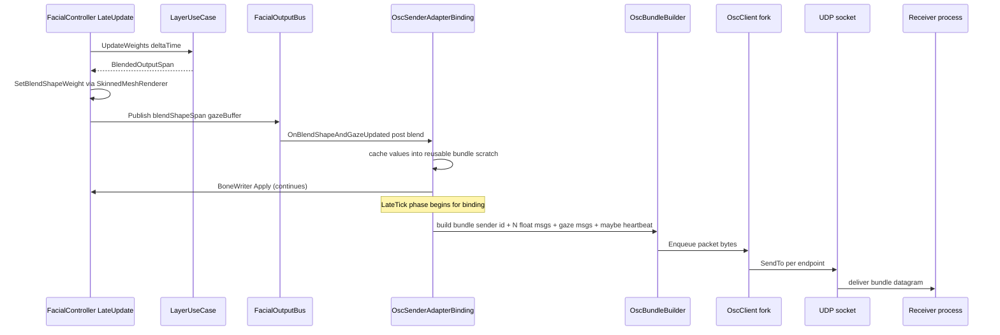
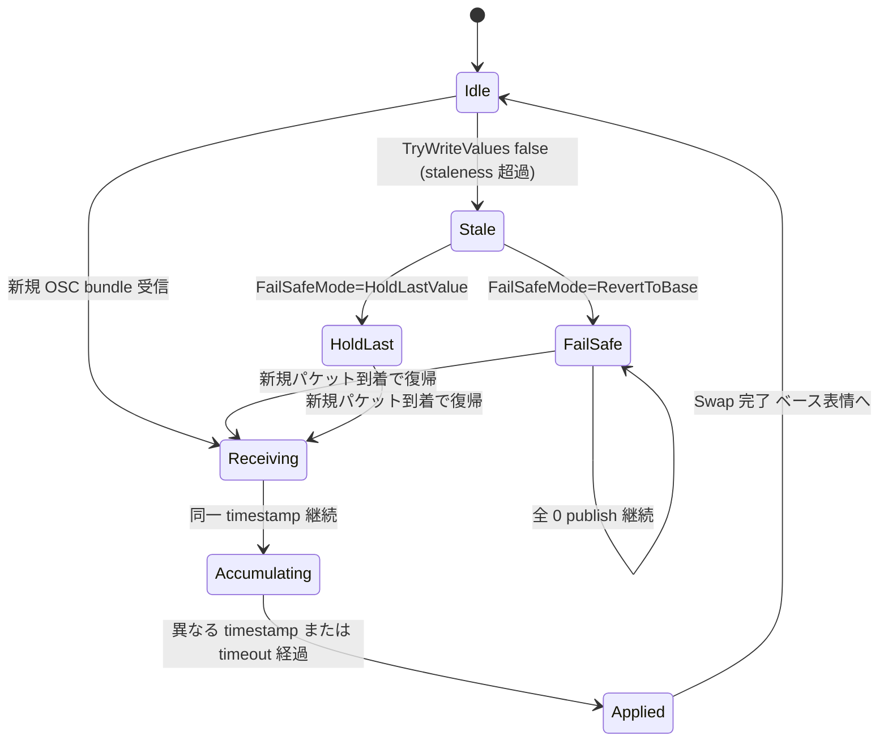
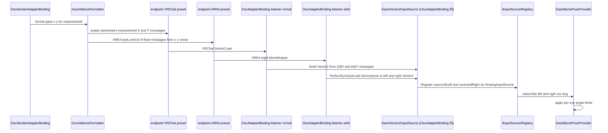
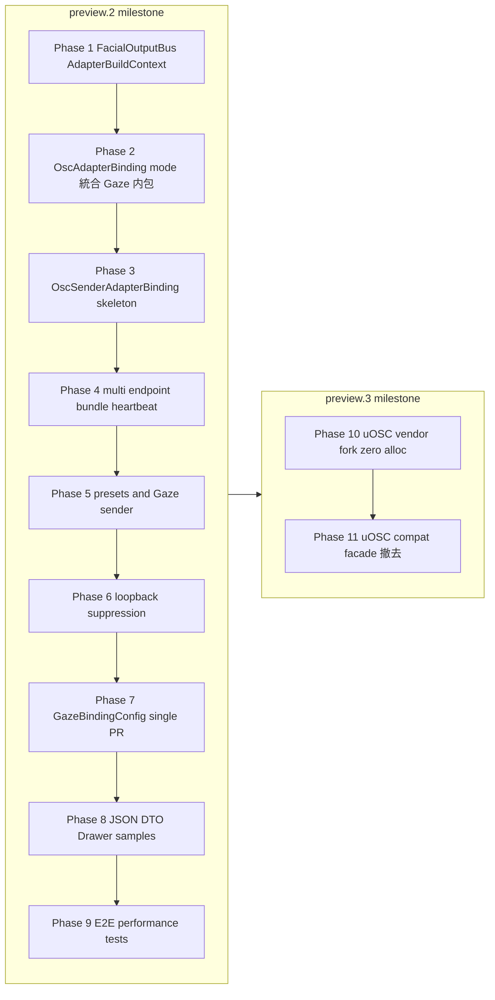

# Design Document — osc-output-binding

> 本 design は requirements.md（Req 1〜14）を実装可能な技術設計へ落とし込んだ自立ドキュメントである。詳細な調査・代替案検討は `research.md` を、既存コードとのマッピング差分は `gap-analysis.md` を、uOSC vendor copy の改修詳細は `uosc-modification-plan.md` を参照する。design.md 自体はレビュー用に self-contained に保つ。

## Overview

**Purpose**: 本 spec は、FacialControl の OSC 送信機能を AdapterBinding として正式統合し、同時に既存 OSC 受信 binding を破壊的拡張して `配信側プロセス → 描画側プロセス` を成立させる。これにより VTuber 配信の冗長構成・クロスエンジン (Unity → UnrealEngine 等) 連動・送信元瞬断時のフェイルセーフ復帰・ゾンビ送信元排除・bundle アトミック性・BlendShape 名整合性検査・Gaze の左右非対称送受信を一括で導入する。

**Users**: パッケージ `com.hidano.facialcontrol.osc` を使う Unity エンジニア（配信側・描画側双方）が対象。Inspector の `Add` ドロップダウンから `OSC Sender` / `OSC` (受信) の 2 binding を組み合わせ、JSON または Inspector で endpoint・mapping entry（BlendShape / Gaze_VRChat_XY / Gaze_ARKit_8BS の mode 別）・Gaze 構成を設定するワークフローで利用する。受信 binding は `InputSystemAdapterBinding` と同様、1 binding 内で BlendShape と Gaze Vector2 の両方を扱う。

**Impact**: 既存 `OscSender` / `OscSenderHost` を AdapterBinding として正式結線し、`OscAdapterBinding` 受信側 / `GazeBindingConfig` / `ExpressionBindingEntry`(InputSystem) / `FacialCharacterProfileConverter` / 既存 Gaze テスト群へ **後方互換のない構造変更**を加える。さらに `com.hidano.uosc` を vendor copy 化し、送受信ホットパスを zero-alloc に改修する。preview.2 以降の機能として導入する。

### Goals
- FacialController 合成後の post-blend BlendShape 値 + Gaze 入力 Vector2 を Domain 純度を保ったまま観察できる `FacialOutputBus` を新設し、AdapterBinding が同一フレーム内で OSC 送信を完結させる経路を確立する
- `OscSenderAdapterBinding` を Inspector の Add ドロップダウンから他 binding と同じ手順で導入でき、複数 endpoint への unicast 同報送信と OSC bundle によるフレームアトミック送信を実現する
- 既存 `OscAdapterBinding` を破壊的拡張し、staleness 超過時のベース表情自動復帰・送信元 UUID + 起動時刻に基づくゾンビ排除・OSC bundle アトミック適用・BlendShape 名一覧整合性検査を実装する
- VRChat 形式 / ARKit 形式（PerfectSync 互換 Gaze 含む）のアドレスプリセットを endpoint ごとに切替可能とし、Gaze の左右非対称を保ったまま送受信できるようにする
- 毎フレームのヒープ確保ゼロ（GC スパイク防止）を達成するため、`com.hidano.uosc` を vendor copy 化し送受信ホットパスを Span/ArrayPool ベースへ改修する
- `GazeBindingConfig` を左目用 / 右目用 sourceId 必須の構造に破壊的変更し、InputSystem / OSC の双方で左右独立 Vector2 入力経路を一系統に統一する

### Non-Goals
- VRM 対応（別マイルストーン）
- UDP multicast / broadcast の独自実装（unicast 複数 endpoint で代替）
- 音声ストリーム / リップシンク音声の OSC 送出（リップシンク値の float のみ対象）
- OSC timetag による未来時刻スケジューリング（bundle は採用するが time-shift 機能は使わない）
- ボーンの世界回転 / 位置値そのものの OSC 送出（Gaze は Vector2 / 8 BlendShape 経由のみ）
- IP allowlist による送信元 IP フィルタ（uOSC が受信時に IP を捨てる制約と、ゾンビ排除が UUID + 起動時刻で成立することにより削除）

## Boundary Commitments

### This Spec Owns
- **Domain 出力バス**: `IFacialOutputObserver` / `IFacialOutputBus` / `FacialOutputBus` の Domain 契約と実装、および `FacialController.LateUpdate` 末尾に追加される `Publish` フックの責務
- **送信側 binding**: `OscSenderAdapterBinding`（新規） + 内部 helper `OscSenderHost` 拡張、`OscBundleBuilder`、複数 endpoint 管理、アドレスプリセット enum、ループバック抑制ポリシー
- **受信側 binding**: 既存 `OscAdapterBinding` の破壊的拡張（mode 別 `OscMappingEntry` リストで BlendShape / Gaze_VRChat_XY / Gaze_ARKit_8BS を 1 binding 内で扱う / フェイルセーフモード / bundle アトミック処理 / ゾンビ排除 / heartbeat 整合性検査）。`InputSystemAdapterBinding` の単一 binding 内 mode 別エントリ集約パターンを踏襲し、Gaze Vector2 受信専用 binding を別途設けない。
- **GazeBindingConfig 破壊変更**: 左目用 / 右目用 sourceId フィールド追加 (`sourceIdLeft` / `sourceIdRight`)、対応する DTO と Converter、InputSystem 側 `ExpressionBindingEntry` の左右別 actionName 化、既存 Gaze テスト改修
- **JSON DTO**: `OscSenderOptionsDto` / `OscReceiverOptionsDto`（mode 別 `OscMappingEntryDto` を内包） および Documentation~/ への JSON スキーマ Markdown
- **Editor Drawer**: 上記 2 binding の UI Toolkit ベース PropertyDrawer（受信側 Drawer 内で mode 別 fold-out）
- **uOSC vendor fork**: `Library/PackageCache` から `Packages/com.hidano.uosc/` へ vendor copy 化し、送受信ホットパスを zero-alloc 化（`com.hidano.uosc` 1.0.0-fcfork.1）
- **メタ OSC アドレス契約**: `/_facialcontrol/sender_id`、`/_facialcontrol/blendshape_names` の本 spec 内定義
- **サンプル**: `Samples~/OscOutputDemo` + `Samples~/OscReceiverDemo` の canonical 配置、`Assets/Samples` 二重管理

### Out of Boundary
- VRM 形式の表情データ抽出と OSC 送出（別マイルストーン）
- multicast / broadcast を用いた UDP 配布（unicast 複数 endpoint の範疇で対応）
- リップシンク音声波形 / 音声特徴量の OSC 送出（リップシンクの BlendShape weight 値のみ対象）
- OSC timetag による未来時刻スケジューリング（時刻精度を伴う遅延配送）
- ボーンの世界 transform 値そのものの送出（Gaze は Vector2 / 8 BlendShape 経由のみ）
- DefaultExecutionOrder を用いた MonoBehaviour 実行順の global 制御（本 spec は pull 型 Publish に閉じる）
- 既存 `Multi Source Blend Demo`（InputSystem サンプル）の構造改修
- preview.1 ターゲットへの破壊的変更逆流入

### Allowed Dependencies
- Domain 層: `Hidano.FacialControl.Domain.*`（`Unity.Collections` のみ Engine 参照可）
- Application 層: `Hidano.FacialControl.Application.UseCases.LayerUseCase.BlendedOutputSpan`
- Adapters 層: `Hidano.FacialControl.Adapters.OSC.*`、`Hidano.FacialControl.Adapters.InputSources.*`、`Hidano.FacialControl.Adapters.Bone.*`、`Hidano.FacialControl.Adapters.Playable.FacialController`
- vendor: `com.hidano.uosc`（本 spec 内で fork 化）、`Unity.Collections`、`UnityEngine` / `UnityEngine.Animation`
- Editor: `UnityEditor`、UI Toolkit（IMGUI は新規利用禁止）
- 依存方向制約: Domain → なし、Application → Domain、Adapters → Application + Domain + Engine、Editor → Adapters + UnityEditor。逆向き参照は asmdef で禁止。

### Revalidation Triggers
- `IFacialOutputObserver` / `IFacialOutputBus` の signature 変更（Adapters 側 binding を実装する全 spec が再検証）
- 送信元識別ヘッダ / heartbeat の OSC アドレス・ペイロード形式変更（受信側互換性に直接影響）
- `GazeBindingConfig` のフィールド構成変更（InputSystem 側 spec、SO アセット、JSON DTO への再検証）
- `OscAdapterBinding` の SerializeField レイアウト変更（既存 SO アセット 既存 binding 利用者への再検証）
- uOSC fork API の public シグネチャ変更（fork 内部実装の互換性破壊）
- `AdapterBuildContext` への新 field 追加（全 binding spec が再検証）— **本 spec 内で 1 度実施済**: `IFacialOutputBus FacialOutputBus` を追加。既存 binding は当該フィールドを参照しないため動作影響なし。今後の spec で再追加する場合は改めて全 binding 再検証が必要。

## Architecture

### Existing Architecture Analysis

本 spec が触る既存システムは下記のレイヤード構造を保つ。

- **Domain 層** (`Hidano.FacialControl.Domain.*`): `AdapterBindingBase` / `AdapterBuildContext` / `IInputSource` / `IAnalogInputSource` / `IInputSourceRegistry` を提供。Unity 非依存。
- **Application 層** (`Hidano.FacialControl.Application.UseCases.LayerUseCase`): `_finalOutput` を `ReadOnlySpan<float>` で公開する `BlendedOutputSpan` プロパティが既に zero-alloc 設計。
- **Adapters 層** (`com.hidano.facialcontrol.osc/Runtime/Adapters/*`): 既存 `OscSender` / `OscSenderHost` / `OscReceiver` / `OscReceiverHost` / `OscDoubleBuffer` / `OscInputSource` / `OscAdapterBinding`。これらは binding として一部未結線。
- **VContainer DI**: `AdapterBindingHost` が `IInitializable` 経由で binding の `OnStart` を同期 dispatch、`ILateTickable` / `IFixedTickable` で per-frame lifecycle を回す。

維持しなければならない既存パターン:
- AdapterBinding の lifecycle 形（`[Serializable]` + `[FacialAdapterBinding(displayName)]` + `OnStart` / `OnTick` / `OnLateTick` / `OnFixedTick` / `Dispose`）
- `IInputSourceRegistry` への slug-keyed 登録パターン
- `OscDoubleBuffer` の lock-free 2-buffer swap + `WriteTick` カウンタ
- `SystemTextJsonParser`（実装は `JsonUtility` ベース）による DTO 往復経路
- `Samples~/` と `Assets/Samples/` の二重管理

### Architecture Pattern & Boundary Map

```mermaid
graph TB
    subgraph DomainLayer[Domain Layer]
        FacialOutputBus[FacialOutputBus]
        IFacialOutputObserver[IFacialOutputObserver]
        GazeSnapshot[GazeSnapshot value type]
        AdapterBindingBase[AdapterBindingBase]
    end

    subgraph ApplicationLayer[Application Layer]
        LayerUseCase[LayerUseCase BlendedOutputSpan]
    end

    subgraph AdaptersCore[Adapters Core]
        FacialController[FacialController LateUpdate]
        InputSourceRegistry[InputSourceRegistry]
        GazeBindingConfig[GazeBindingConfig]
        GazeBonePoseProvider[GazeBonePoseProvider]
    end

    subgraph AdaptersOsc[Adapters OSC]
        OscSenderAdapterBinding[OscSenderAdapterBinding]
        OscAdapterBinding[OscAdapterBinding receiver - mode entries integrated]
        OscBundleBuilder[OscBundleBuilder]
        OscBundleAccumulator[OscBundleAccumulator]
        OscAddressFormatter[OscAddressFormatter]
        SenderIdentity[SenderIdentity]
        ZombieEvictionPolicy[ZombieEvictionPolicy]
        HeartbeatConsistencyChecker[HeartbeatConsistencyChecker]
        LoopbackSuppressionPolicy[LoopbackSuppressionPolicy]
        GazeVector2InputSource[GazeVector2InputSource]
        PerfectSyncEyeLook[PerfectSyncEyeLook decompose]
    end

    subgraph UoscFork[uOSC fork zero alloc]
        OscClientFork[OscClient SoA buffer pool]
        OscServerFork[OscServer Socket ReceiveFrom]
        OscWriter[OscWriter Span based]
        OscPacketParser[OscPacketParser ref struct]
    end

    FacialController --> LayerUseCase
    FacialController --> FacialOutputBus
    LayerUseCase --> FacialOutputBus
    FacialOutputBus --> IFacialOutputObserver
    OscSenderAdapterBinding --> IFacialOutputObserver
    OscSenderAdapterBinding --> OscBundleBuilder
    OscBundleBuilder --> OscClientFork
    OscSenderAdapterBinding --> OscAddressFormatter
    OscSenderAdapterBinding --> LoopbackSuppressionPolicy
    OscSenderAdapterBinding --> SenderIdentity
    OscAdapterBinding --> OscBundleAccumulator
    OscAdapterBinding --> ZombieEvictionPolicy
    OscAdapterBinding --> HeartbeatConsistencyChecker
    OscAdapterBinding --> OscServerFork
    OscAdapterBinding --> GazeVector2InputSource
    OscAdapterBinding --> PerfectSyncEyeLook
    GazeVector2InputSource --> InputSourceRegistry
    GazeBindingConfig --> GazeBonePoseProvider
    GazeBonePoseProvider --> InputSourceRegistry
```



**Architecture Integration**:
- 選択パターン: **Hexagonal (Ports & Adapters)** を継承。新規追加コンポーネントはすべて Domain 契約（`IFacialOutputObserver`, `IAnalogInputSource`, `IInputSource`）の adapter として位置付ける。
- ドメイン境界: Domain は `FacialOutputBus` / `GazeSnapshot` の純粋契約のみ持ち、UnityEngine / uOSC を import しない。Adapters 側だけが OSC / Unity / uOSC fork を統合する。
- 既存パターン維持: AdapterBinding の `[Serializable]` + `[FacialAdapterBinding]` + lifecycle 形、`IInputSourceRegistry` の slug-keyed lookup、`OscDoubleBuffer` の lock-free swap、SystemTextJsonParser を変えない。
- 新規コンポーネントの必要性:
  - `FacialOutputBus` は Adapters 層が post-blend 値を Domain 純度で読むための唯一の経路。Adapters の binding が `FacialController` を直接参照するパスは domain inversion を破壊するため避ける。
  - `OscBundleBuilder` / `OscBundleAccumulator` は OSC bundle のフレームアトミック性 (Req 3, 11) を支える。
  - `SenderIdentity` / `ZombieEvictionPolicy` / `HeartbeatConsistencyChecker` は破壊的拡張で要求される機能 (Req 11) の単一責任分解。
- Steering 準拠: クリーンアーキテクチャ依存方向 / 毎フレーム GC ゼロ / Unity 標準ログのみ / UI Toolkit Editor の 4 つを満たす。

### Technology Stack

| Layer | Choice / Version | Role in Feature | Notes |
|-------|------------------|-----------------|-------|
| Frontend / CLI | UI Toolkit (Unity 6 同梱) | Inspector PropertyDrawer | IMGUI 不可（既存ルール） |
| Domain | C# / `Unity.Collections` のみ | `FacialOutputBus` / `GazeSnapshot` | UnityEngine 参照禁止 |
| Adapters (OSC) | C# 9+ Span, ArrayPool<byte>, BinaryPrimitives | bundle 構築 / parse / zero-alloc 化 | `com.hidano.facialcontrol.osc` 内に閉じる |
| OSC Transport | uOSC fork `1.0.0-fcfork.1` (vendor copy) | UDP 送受信 + Socket.ReceiveFrom + Span ベース parser | hecomi/uOSC MIT を fork、`Packages/com.hidano.uosc/` に embed |
| Data / Storage | JSON (`JsonUtility` ベース `SystemTextJsonParser`) | DTO 永続化 | 新 JSON ライブラリ持ち込み禁止 |
| Messaging / Events | OSC 1.0 over UDP（VRChat 互換 + ARKit/PerfectSync 互換） | フレームアトミック bundle 同報 | `/avatar/parameters/...` / `/ARKit/...` プリセット |
| Infrastructure / Runtime | Unity 6000.3.2f1 / URP 17.3.0 / Linear / Windows PC のみ | 動作環境 | モバイル/WebGL/VR は将来拡張のため契約のみ確保 |

新規依存はゼロ（uOSC は既存依存の fork 化）。判断根拠詳細は `research.md` の "Technology Decisions"。

## File Structure Plan

### Directory Structure
```
FacialControl/Packages/
├── com.hidano.uosc/                              # NEW (vendor copy + fork)
│   ├── Runtime/Core/Modern/                       # NEW zero-alloc 新 API
│   │   ├── OscMessage.cs                          # SoA struct
│   │   ├── OscMessagePool.cs                      # 配列再利用プール
│   │   ├── OscWriter.cs                           # Span + BinaryPrimitives
│   │   ├── OscBundleBuilder.cs                    # bundle 構築 + パケット生成
│   │   ├── OscClient.cs                           # ring buffer 送信 worker
│   │   ├── OscServer.cs                           # Socket.ReceiveFrom 受信 worker
│   │   ├── OscPacketParser.cs                     # ref struct, Span 経由 parse
│   │   ├── OscMessageView.cs                      # 受信 ref readonly struct
│   │   └── OscAddressHash.cs                      # UTF-8 → uint64 ハッシュ
│   ├── Runtime/Core/{Bundle.cs, Message.cs, Parser.cs, Reader.cs, Writer.cs}  # 既存 (互換 facade として残存、Phase 3 で撤去)
│   ├── Runtime/{uOscClient.cs, uOscServer.cs, ...}  # 既存 (互換 facade)
│   ├── package.json                               # version=1.0.0-fcfork.1
│   ├── README.md / CHANGELOG.md / LICENSE.md      # fork 明示 + MIT 維持
├── com.hidano.facialcontrol/
│   └── Runtime/Domain/
│       ├── Adapters/IFacialOutputObserver.cs      # NEW
│       ├── Adapters/IFacialOutputBus.cs           # NEW
│       ├── Models/GazeSnapshot.cs                 # NEW (readonly struct)
│       └── Services/FacialOutputBus.cs            # NEW
├── com.hidano.facialcontrol.osc/
│   └── Runtime/Adapters/
│       ├── AdapterBindings/
│       │   ├── OscSenderAdapterBinding.cs         # NEW
│       │   └── OscAdapterBinding.cs               # MODIFIED (mode 別 entry 統合の破壊変更)
│       ├── OSC/
│       │   ├── OscSenderEndpointConfig.cs         # NEW [Serializable]
│       │   ├── OscMappingEntry.cs                 # NEW [Serializable] (mode 別 entry)
│       │   ├── OscMappingMode.cs                  # NEW enum Normal_BlendShape / Gaze_VRChat_XY / Gaze_ARKit_8BS
│       │   ├── AddressPresetKind.cs               # NEW enum
│       │   ├── OscAddressFormatter.cs             # NEW zero-alloc address build
│       │   ├── PerfectSyncEyeLook.cs              # NEW 8 const + Vector2<->8 float
│       │   ├── SenderIdentity.cs                  # NEW readonly struct
│       │   ├── SenderIdentityGenerator.cs         # NEW UUID + UTC ms 生成
│       │   ├── OscBundleAccumulator.cs            # NEW timestamp-keyed 蓄積
│       │   ├── ZombieEvictionPolicy.cs            # NEW UUID + 起動時刻選別
│       │   ├── HeartbeatConsistencyChecker.cs     # NEW 名前一覧照合
│       │   ├── LoopbackSuppressionPolicy.cs       # NEW endpoint 集合比較
│       │   ├── FailSafeMode.cs                    # NEW enum
│       │   ├── OscSender.cs                       # MODIFIED zero-alloc 化
│       │   ├── OscSenderHost.cs                   # MODIFIED 複数 endpoint 対応
│       │   ├── OscReceiver.cs                     # MODIFIED OscServer fork へ
│       │   ├── OscReceiverHost.cs                 # MODIFIED bundle accumulator 連携
│       │   └── OscMappingTable.cs                 # NEW or MODIFIED hash-based
│       └── InputSources/
│           ├── GazeVector2InputSource.cs          # NEW Vector2 IAnalogInputSource (OscAdapterBinding 内で構築・registry に slug 登録)
│           └── OscInputSource.cs                  # MODIFIED failsafe hook
│       └── Json/Dto/
│           ├── OscSenderOptionsDto.cs             # NEW [Serializable]
│           ├── OscSenderEndpointDto.cs            # NEW [Serializable]
│           ├── OscReceiverOptionsDto.cs           # NEW [Serializable] (OscMappingEntryDto[] を内包)
│           └── OscMappingEntryDto.cs              # NEW [Serializable] (mode + expressionId + sourceIdLeft/Right 等)
│   └── Editor/AdapterBindings/
│       ├── OscSenderAdapterBindingDrawer.cs       # NEW (UI Toolkit)
│       └── OscAdapterBindingDrawer.cs             # MODIFIED (mode 別 fold-out で BlendShape / Gaze_VRChat / Gaze_ARKit を UI 表示)
│   └── Documentation~/
│       ├── osc-sender-options.md                  # NEW JSON スキーマ
│       └── osc-receiver-options.md                # NEW JSON スキーマ (mode 別 entry の構造を含む)
│   └── Samples~/
│       ├── OscOutputDemo/                         # NEW
│       └── OscReceiverDemo/                       # NEW
│   ├── package.json                               # MODIFIED samples 配列追加
│   ├── README.md / CHANGELOG.md                   # MODIFIED 破壊変更明記
├── com.hidano.facialcontrol.inputsystem/
│   └── Runtime/Adapters/AdapterBindings/
│       └── InputSystemAdapterBinding.cs           # MODIFIED 左右別 actionName
└── (FacialControl/Assets/Samples/                 # MODIFIED 二重管理ミラー)
    ├── OscOutputDemo/
    └── OscReceiverDemo/
```

### Modified Files
- `Packages/com.hidano.facialcontrol/Runtime/Domain/Adapters/AdapterBuildContext.cs` — `IFacialOutputBus FacialOutputBus` フィールドを追加（非 null 必須）。コンストラクタ引数も追加し、`null` 時は `ArgumentNullException`。
- `Packages/com.hidano.facialcontrol/Runtime/Adapters/Playable/FacialController.cs` — `LateUpdate` 末尾で `FacialOutputBus.Publish(blendShapeSpan, gazeSnapshotBuffer)` を呼び出すフックを追加。Bus への参照は `InitializeInternal` で child scope から resolve。`BuildAdapterBindingsChildScope` で VContainer に `IFacialOutputBus` を Scoped 登録し `AdapterBuildContext` コンストラクタへ渡す。
- `Packages/com.hidano.facialcontrol/Runtime/Adapters/ScriptableObject/GazeBindingConfig.cs` — `sourceIdLeft` / `sourceIdRight` フィールドを必須として追加（破壊変更）。旧単一 sourceId 経路は削除。
- `Packages/com.hidano.facialcontrol/Runtime/Adapters/Json/Dto/GazeBindingConfigDto.cs`（または相当 DTO）— 同上、左右別 sourceId フィールド必須化。
- `Packages/com.hidano.facialcontrol/Runtime/Adapters/Json/FacialCharacterProfileConverter.cs` — Gaze 構造変換の左右別対応。
- `Packages/com.hidano.facialcontrol.inputsystem/Runtime/Adapters/AdapterBindings/InputSystemAdapterBinding.cs` — `BuildGazeProvider` を `actionNameLeft` / `actionNameRight` 解決に変更。`ExpressionBindingEntry`(bindingMode = Gaze) の構造を破壊変更。
- `Packages/com.hidano.facialcontrol.osc/package.json` — `samples` 配列に `OscOutputDemo` / `OscReceiverDemo` 追加。
- `Packages/com.hidano.uosc/` — `Library/PackageCache` からの vendor copy 化、`manifest.json` の参照を local file path へ変更。
- 既存 Gaze テスト群（`FacialCharacterProfileSO_GazeConfigsRoundTripTests` 等）— 新構造に合わせた破壊改修。
- `docs/work-procedure.md`、`docs/backlog.md`、CHANGELOG — 作業手順 / 破壊変更明記。

## System Flows

### Flow 1: 送信側 1 フレーム送信パイプライン（OnLateTick）



**主要ゲート / 決定**:
- `FacialOutputBus.Publish` は `FacialController.LateUpdate` の `_layerUseCase.UpdateWeights` 直後・`BoneWriter.Apply` の前後どちらかで呼ぶ。本設計は **`BoneWriter.Apply` の前**に置き、Adapters 側 binding が同フレーム内に bundle を組み立て終わるよう pull 型観察を採用（決定 R1 → 採用案 (a)）。
- 同 `FacialController.LateUpdate` 経路の MonoBehaviour 内で Publish を行うため、`AdapterBindingHost.LateTick` の VContainer dispatch 順序に依存せず、Publish 時点で観察した binding 側 scratch buffer は同フレームの `OnLateTick` で UDP 送出される。
- bundle 構築のうち heartbeat（既定 5 秒）は `OnLateTick` 内で `TimeProvider` を参照して周期判定。最小周期は 0.5 秒（クランプ）。

### Flow 2: 受信側 bundle アトミック適用とフェイルセーフ復帰



**主要ゲート / 決定**:
- bundle 終端は明示通知されないため、`OscBundleAccumulator` は **同一 `Message.timestamp` を蓄積 → 次の異なる timestamp 到着 or timeout（既定 5 ms）で `OscDoubleBuffer.Swap` を実行**する。
- ゾンビ排除は `/_facialcontrol/sender_id` の (UUID + 起動時刻 UTC ms) を観測し、`ZombieEvictionPolicy` が最も新しい起動時刻の UUID のみを採用。切替時に Info ログ。
- フェイルセーフは `OscInputSource.TryWriteValues` が false を返した瞬間、`OscAdapterBinding` の `OnFixedTick` 内で `FailSafeMode` を参照し、`RevertToBase`（既定）なら `OscDoubleBuffer` の読取値を **全要素 0.0** に publish 切替。`HoldLastValue` ならスナップショットを保持。
- heartbeat 整合性検査は `Swap` 前準備フェーズで行い、ホットパスに重い文字列比較を入れない。

### Flow 3: Gaze 経路（送信 → 受信、OscAdapterBinding 統合版）



**主要ゲート / 決定**:
- Gaze Vector2 受信は **`OscAdapterBinding` 内に統合**された。`OscMappingEntry` の `mode` フィールドで `Normal_BlendShape` / `Gaze_VRChat_XY` / `Gaze_ARKit_8BS` を分別し、Gaze 系 mode のエントリは内部で `GazeVector2InputSource` を構築して `IInputSourceRegistry` に左右別 sourceId で登録する。`InputSystemAdapterBinding` の単一 binding 内 mode 集約パターン (`ExpressionBindingEntry.bindingMode`) を踏襲。
- 送信側は **正規化済み Vector2 を制限なしで分解** (Req 4.7)。角度制限の適用は受信側 `GazeBonePoseProvider` 責務に統一。
- ARKit 形式の符号定義: 左目 `x_L = eyeLookOutLeft - eyeLookInLeft`、`y_L = eyeLookUpLeft - eyeLookDownLeft`、右目 `x_R = eyeLookOutRight - eyeLookInRight`、`y_R = eyeLookUpRight - eyeLookDownRight`（向かって右が +x 方向）。同符号で逆合成。詳細は `research.md` の "PerfectSync Eye Look Sign Convention"。
- VRChat 形式は `{expressionId}X` / `{expressionId}Y` の 2 メッセージで左右共通 Vector2。`OscMappingEntry.leftRightIndependent = false` の場合は両 sourceId に同じ Vector2 を publish する。
- フェイルセーフ時（staleness 超過 / 受信途絶）は `OscAdapterBinding` 自身が Gaze 系 mode の `GazeVector2InputSource` を `(0, 0)` に publish 切替（Req 12.9）。受信元 binding と Gaze 受信が同一 binding 内なので異常時状態の伝播は内部呼出で完結する。

## Requirements Traceability

| Requirement | Summary | Components | Interfaces | Flows |
|-------------|---------|------------|------------|-------|
| 1.1 | Domain 名前空間配置 | FacialOutputBus | IFacialOutputBus | — |
| 1.2 | OnLateTick 直前で BlendShape + Gaze 通知 | FacialOutputBus, FacialController hook | IFacialOutputBus.Publish | Flow 1 |
| 1.3 | Gaze は Domain 純粋 struct | GazeSnapshot | GazeSnapshot value | — |
| 1.4 | 内部バッファ再利用で GC ゼロ | FacialOutputBus | IFacialOutputBus | Flow 1 |
| 1.5 | Subscribe / Unsubscribe を列挙中安全に反映 | FacialOutputBus | IFacialOutputBus.Subscribe / Unsubscribe | — |
| 1.6 | オブザーバ 0 件時 skip | FacialOutputBus | — | — |
| 1.7 | 例外時ログ + 他オブザーバへ継続 | FacialOutputBus | — | — |
| 1.8 | BlendShape index は FacialController と一致 | FacialOutputBus | IFacialOutputBus | — |
| 1.9 | Gaze は expressionId キー | GazeSnapshot, FacialOutputBus | IFacialOutputBus | — |
| 1.10 | 未接続 Gaze は通知対象から除外 | FacialOutputBus | IFacialOutputBus | — |
| 2.1〜2.8 | sender binding lifecycle 結線 | OscSenderAdapterBinding | IFacialOutputObserver | Flow 1 |
| 3.1〜3.10 | multi-endpoint unicast + bundle アトミック | OscSenderAdapterBinding, OscSenderEndpointConfig, OscBundleBuilder | — | Flow 1 |
| 4.1〜4.10 | アドレスプリセット + PerfectSync Gaze | OscAddressFormatter, AddressPresetKind, PerfectSyncEyeLook | — | Flow 3 |
| 5.1〜5.7 | ループバック抑制 | LoopbackSuppressionPolicy | — | — |
| 6.1〜6.10 | JSON DTO + スキーマドキュメント | OscSenderOptionsDto, OscReceiverOptionsDto（OscMappingEntryDto[] 内包） | — | — |
| 7.1〜7.8 | UI Toolkit Drawer | 2 Drawer（受信側は mode 別 fold-out で BlendShape / Gaze を統合表示） | — | — |
| 8.1〜8.13 | テスト | EditMode/PlayMode tests | — | Flow 1/2/3 |
| 9.1〜9.8 | サンプル + ドキュメント | Samples~/OscOutputDemo, OscReceiverDemo | — | — |
| 10.1〜10.7 | 性能 / アーキテクチャ制約 | 全コンポーネント横断 + uOSC fork | — | — |
| 11.1〜11.11 | 受信側破壊拡張 | OscAdapterBinding（mode 別 entry 統合）, OscBundleAccumulator, ZombieEvictionPolicy, HeartbeatConsistencyChecker, FailSafeMode | — | Flow 2 |
| 12.1〜12.9 | Gaze Vector2 受信（OscAdapterBinding 内に統合） | OscAdapterBinding（mode = Gaze_VRChat_XY / Gaze_ARKit_8BS）, GazeVector2InputSource, PerfectSyncEyeLook | IAnalogInputSource | Flow 3 |
| 13.1〜13.7 | GazeBindingConfig 破壊変更 | GazeBindingConfig, GazeBindingConfigDto, FacialCharacterProfileConverter, InputSystemAdapterBinding | — | Flow 3 |
| 14.1〜14.8 | 送信元識別 + heartbeat | SenderIdentity, SenderIdentityGenerator, OscSenderAdapterBinding | — | Flow 1 |

## Components and Interfaces

### Component Summary

| Component | Domain/Layer | Intent | Req Coverage | Key Dependencies (P0/P1) | Contracts |
|-----------|--------------|--------|--------------|--------------------------|-----------|
| FacialOutputBus | Domain.Services | post-blend + Gaze スナップショットを 1 frame 1 回 dispatch | 1.1, 1.2, 1.4–1.10 | IFacialOutputObserver (P0), LayerUseCase (P0) | Service, Event |
| IFacialOutputObserver | Domain.Adapters | bus からの通知受け取り口 | 1.2, 1.5 | (none) | Service |
| GazeSnapshot | Domain.Models | (expressionId, x, y) の readonly 構造体 | 1.3, 1.9 | (none) | State |
| OscSenderAdapterBinding | Adapters.OSC | post-blend + Gaze を bundle 化して同報送信 | 2.1–2.8, 3.1–3.10, 4.1–4.10, 5.1–5.7, 14.1–14.8 | FacialOutputBus (P0), OscBundleBuilder (P0), OscClient fork (P0) | Service, Event |
| OscSenderEndpointConfig | Adapters.OSC | endpoint + preset + 有効フラグ [Serializable] | 3.1–3.10, 4.1–4.10 | AddressPresetKind (P0) | State |
| AddressPresetKind | Adapters.OSC | VRChat / ARKit enum | 4.1–4.10 | — | State |
| OscAddressFormatter | Adapters.OSC | プリセットから OSC アドレス事前生成（UTF-8 byte 化） | 4.1–4.10 | OscClient fork (P0) | Service |
| PerfectSyncEyeLook | Adapters.OSC | 8 const + Vector2 ⇔ 8 float 双方向変換 | 4.6–4.7, 12.3 | — | Service |
| SenderIdentity / Generator | Adapters.OSC | UUID + UTC ms 保持 / 生成 | 14.1–14.2 | — | State, Service |
| OscBundleAccumulator | Adapters.OSC | timestamp キーで bundle 内 message を集積、Swap タイミング決定 | 11.7 | OscDoubleBuffer (P0) | Service |
| ZombieEvictionPolicy | Adapters.OSC | 観測中 UUID 群から最新起動時刻のみ採用 | 11.5–11.6 | SenderIdentity (P0) | Service |
| HeartbeatConsistencyChecker | Adapters.OSC | heartbeat 名前一覧 vs mapping の差分検出と部分反映マスク | 11.8–11.10 | — | Service |
| LoopbackSuppressionPolicy | Adapters.OSC | 自己プロセス内 listen endpoint 集合との比較 | 5.1–5.7 | OscAdapterBinding (P0) | Service |
| FailSafeMode | Adapters.OSC | 復帰モード enum (RevertToBase / HoldLastValue) | 11.3 | — | State |
| OscAdapterBinding (receiver) | Adapters.AdapterBindings | 既存 binding を破壊拡張。mode 別 OscMappingEntry リストで BlendShape / Gaze_VRChat_XY / Gaze_ARKit_8BS を 1 binding 内で扱う | 11.1–11.11, 12.1–12.9 | OscBundleAccumulator, ZombieEvictionPolicy, HeartbeatConsistencyChecker, GazeVector2InputSource, PerfectSyncEyeLook (all P0) | Service |
| OscMappingEntry / OscMappingMode | Adapters.OSC | mode 別 mapping エントリの [Serializable] 型と enum | 11.1, 12.1, 4.6 | AddressPresetKind (P0) | State |
| GazeVector2InputSource | Adapters.InputSources | OscAdapterBinding 内部で Gaze 系 entry から構築され、Vector2 を IAnalogInputSource として登録 | 12.5, 12.8 | IInputSourceRegistry (P0) | Service |
| GazeBindingConfig (modified) | Adapters.ScriptableObject | sourceIdLeft / sourceIdRight 必須化 | 13.1–13.4 | — | State |
| OscSenderOptionsDto / EndpointDto / OscReceiverOptionsDto / OscMappingEntryDto | Adapters.Json.Dto | JSON 永続化 [Serializable] | 6.1–6.10 | SystemTextJsonParser (P0) | API |
| OscSenderAdapterBindingDrawer / OscAdapterBindingDrawer (mod) | Editor.AdapterBindings | UI Toolkit ベース Drawer（受信側は mode 別 fold-out 内蔵） | 7.1–7.8 | UnityEditor (P0) | (View) |
| OscBundleBuilder / OscClient / OscServer / OscPacketParser / OscWriter / OscAddressHash | uOSC fork | zero-alloc OSC 送受信プリミティブ | 10.1, 10.6 | Socket, ArrayPool (P0) | Service |

Detailed blocks below cover the components that introduce new boundaries. Editor Drawer 群と DTO 群は Implementation Note にとどめる。

### Domain Layer

#### FacialOutputBus

| Field | Detail |
|-------|--------|
| Intent | post-blend BlendShape 値と Gaze スナップショット集合をフレーム末尾に 1 度だけ全 observer へ通知する Domain service |
| Requirements | 1.1, 1.2, 1.4, 1.5, 1.6, 1.7, 1.8, 1.9, 1.10 |
| Owner / Reviewers | Hidano / Junki Hiroi |

**Responsibilities & Constraints**
- 単一責任: post-blend 値 + Gaze の同フレーム配信のみ。値計算・サンプリング・送信ロジックは持たない。
- ドメイン境界: `Hidano.FacialControl.Domain.Services` 名前空間配置、UnityEngine / uOSC / Adapters 型を import しない。`Unity.Collections` のみ参照可。
- データ所有: observer の List<IFacialOutputObserver> を内部所有。observer 自体の寿命は呼出側 (binding) 管理。
- 不変条件: `Publish` 呼び出し中の `Subscribe`/`Unsubscribe` は **遅延適用**（イテレータ完了後に反映）し、列挙中変更例外を発生させない。
- スレッド: メインスレッド専用（FacialController.LateUpdate コンテキスト）。

**Dependencies**
- Inbound: `FacialController` — `Publish` 呼出元 (P0)
- Outbound: `IFacialOutputObserver`（複数）— observer 通知 (P0)
- External: `Unity.Collections`（オブザーバスナップショット用に `List` を使うがアロケ無しで再利用するためなくても可、最小実装は `System.Collections.Generic.List<T>` で足りる）— P1

**Contracts**: Service [x] / API [ ] / Event [x] / Batch [ ] / State [ ]

##### Service Interface
```csharp
namespace Hidano.FacialControl.Domain.Adapters
{
    public interface IFacialOutputBus
    {
        void Subscribe(IFacialOutputObserver observer);
        void Unsubscribe(IFacialOutputObserver observer);
        bool HasObservers { get; }

        // Publish is invoked by FacialController per frame.
        // gazeSnapshots length is the count of attached Gaze inputs; entries are valid only when source.IsValid.
        void Publish(ReadOnlySpan<float> postBlendValues, ReadOnlySpan<GazeSnapshot> gazeSnapshots);
    }

    public interface IFacialOutputObserver
    {
        void OnFacialOutputPublished(ReadOnlySpan<float> postBlendValues, ReadOnlySpan<GazeSnapshot> gazeSnapshots);
    }
}

namespace Hidano.FacialControl.Domain.Models
{
    public readonly struct GazeSnapshot
    {
        public readonly string ExpressionId;
        public readonly float X;
        public readonly float Y;
        public GazeSnapshot(string expressionId, float x, float y);
    }
}
```
- Preconditions: `Publish` の `postBlendValues.Length` は FacialController 内部 `_blendShapeNames` と一致。observer.OnFacialOutputPublished は同期呼出。
- Postconditions: observer.OnFacialOutputPublished 内で受け取った Span は呼出スコープ内のみ有効。observer は値をコピーすべき。
- Invariants: HasObservers=false のとき Publish は早期 return（要 1.6）。observer.OnFacialOutputPublished 例外時はログして他 observer 継続（要 1.7）。

##### Event Contract
- 発行イベント: post-blend 完了 + Gaze 評価完了
- 配信保証: メインスレッド同期 dispatch、フレームごと 1 回（FacialController が呼ぶ）、順序保持
- バックプレッシャ: なし（observer 例外は飲み込まれる）

##### State Management
- 内部 state: `_observers : List<IFacialOutputObserver>` + `_pendingAdds / _pendingRemoves : List<IFacialOutputObserver>`（列挙中変更用）
- 永続化: なし
- 並行性: メインスレッド only、別スレッド呼出は未サポート（実装で `Thread.CurrentThread` を assert する選択肢あり）

**Implementation Notes**
- Integration: FacialController.LateUpdate 末尾で `_bus.Publish(_layerUseCase.BlendedOutputSpan, _gazeSnapshotBuffer.AsSpan())` を呼ぶ。`_gazeSnapshotBuffer` は `GazeSnapshot[]` を `OnEnable` で確保、サイズは `_characterSO.GazeConfigs.Count`。Gaze 入力源が IsValid=false の expressionId は通知から除外（要 1.10）。
- Validation: ObserverList 列挙中の `Subscribe` / `Unsubscribe` を `_iterating` flag で検出し、pending list へ delay enqueue。Publish 終了時に apply。
- Risks: FacialController.LateUpdate と AdapterBindingHost.LateTick の MonoBehaviour vs VContainer dispatch 順問題（R1）。本設計は **pull 型 Publish を採用**することで OnLateTick lifecycle に依存せず同フレーム送信を保証する。binding は Publish コールバックで scratch buffer に値をコピーし、続く `OnLateTick`（同フレーム内 PlayerLoop の LateUpdate phase 内で AdapterBindingHost が dispatch）で bundle 送出する。FacialController.LateUpdate が VContainer の LateTick より前か後かに依存せず、Publish 時刻 ≤ 自身の OnLateTick 時刻 の関係が同フレーム内で常に成立する（FacialController が pull で呼ぶため）。

#### AdapterBuildContext（破壊的拡張）

| Field | Detail |
|-------|--------|
| Intent | binding が `OnStart` で必要とする中立 service コンテナ。本 spec で `IFacialOutputBus` を追加し、Adapter 層 binding が Domain 純度を保ったまま post-blend bus にアクセスできるようにする |
| Requirements | 1.1, 1.2, 2.4 |
| Owner / Reviewers | Hidano / Junki Hiroi |

**変更点**:
- 追加フィールド: `public readonly IFacialOutputBus FacialOutputBus;`
- 配置: 既存 `IInputSourceRegistry` フィールドの直後（Domain.Adapters 名前空間）
- null 性: **非 null 必須**。コンストラクタ引数を増やし、`null` 時は `ArgumentNullException`
- 初期化点: `FacialController.BuildAdapterBindingsChildScope` 内で VContainer child scope から `Resolve<IFacialOutputBus>()` した値を渡す

**影響範囲**:
- 既存 binding（`InputSystemAdapterBinding` / `OscAdapterBinding`（拡張前）/ ARKit 系 / Bone 系）は当該フィールドを参照しないため、追加によって既存ロジックは変化しない（フィールドが見えるだけ）
- `AdapterBuildContext` コンストラクタの呼出箇所（`FacialController` 1 箇所）を 1 行修正

**Implementation Notes**
- Integration: VContainer 側で `IFacialOutputBus` を child scope に register（lifetime = `Scoped`）。`FacialController.BuildAdapterBindingsChildScope` の builder.Register 呼出に追加。
- Validation: コンストラクタの null チェックに `FacialOutputBus` を加える。
- Risks: 値型 struct のフィールド追加なので boxing は発生しない。VContainer 側 register 漏れで `Resolve<IFacialOutputBus>()` が例外を吐く可能性 → unit test で構築経路を確認。
- Revalidation: design.md L67 の Revalidation Trigger に従い「本 spec 内で実施済」と注記済み。既存 binding 群に対する破壊的影響は無いことをテストで確認。

### Adapters Layer (Sending)

#### OscSenderAdapterBinding

| Field | Detail |
|-------|--------|
| Intent | post-blend BlendShape + Gaze を OSC bundle として複数 endpoint へ同報送信する binding |
| Requirements | 2.1–2.8, 3.1–3.10, 4.1–4.10, 5.1–5.7, 14.1–14.8, 10.1, 10.2, 10.7 |
| Owner / Reviewers | Hidano / Junki Hiroi |

**Responsibilities & Constraints**
- 単一責任: AdapterBinding lifecycle に乗せた OSC 送信パイプラインの統合。値計算・bundle 直列化・UDP 送信は内部コンポーネントへ委譲する。
- ドメイン境界: `Hidano.FacialControl.Adapters.AdapterBindings` 名前空間。Domain 経由でしか Application を参照しない。
- データ所有: endpoint 一覧 / SenderIdentity / heartbeat 周期 / scratch buffer 群。
- 不変条件: `_started=true` の間は `_endpoints` を不変扱い（再構成は `Dispose` → `OnStart` 再実行で行う）。
- スレッド: OnStart / OnLateTick / Dispose はメインスレッド。bundle データの UDP 送信は uOSC fork が worker thread で実行する。

**Dependencies**
- Inbound: `AdapterBindingHost`（lifecycle dispatch）— (P0)
- Outbound: `FacialOutputBus`（Subscribe 経由で post-blend 受領）— (P0)、`OscBundleBuilder` — (P0)、`OscClient`(fork) — (P0)、`LoopbackSuppressionPolicy` — (P1)、`SenderIdentityGenerator` — (P0)、`OscAddressFormatter` — (P0)
- External: `com.hidano.uosc` fork — UDP socket 送信 (P0)

**Contracts**: Service [x] / API [ ] / Event [ ] / Batch [ ] / State [x]

##### Service Interface
```csharp
namespace Hidano.FacialControl.Adapters.AdapterBindings
{
    [Serializable]
    [FacialAdapterBinding(displayName: "OSC Sender")]
    public sealed class OscSenderAdapterBinding : AdapterBindingBase, IFacialOutputObserver
    {
        // Inspector serialized fields
        public List<OscSenderEndpointConfig> endpoints;
        public List<string> blendShapeMapping;     // BlendShape 名のみ保持 (Req 4.1)
        public List<string> gazeExpressionIds;     // Gaze 送信対象 expressionId
        public bool suppressLoopback = true;       // 既定 ON (Req 5.2)
        public float heartbeatIntervalSeconds = 5f; // 既定 5 秒 (Req 14.3)

        // public read-only diagnostics
        public SenderIdentity Identity { get; }
        public bool IsStarted { get; }

        public override void OnStart(in AdapterBuildContext ctx);
        public override void OnLateTick(float deltaTime);
        public override void Dispose();

        void IFacialOutputObserver.OnFacialOutputPublished(
            ReadOnlySpan<float> postBlendValues,
            ReadOnlySpan<GazeSnapshot> gazeSnapshots);
    }
}
```
- Preconditions: `OnStart` 時点で `ctx.HostGameObject != null`、`endpoints` のうち 1 つ以上 enabled、`blendShapeMapping` または `gazeExpressionIds` のいずれかが非空。
- Postconditions: Subscribe 済みで Identity 発行済み（UUID + UTC ms）。heartbeat タイマーが起動。各 endpoint に対応する送信スロットが構成。
- Invariants: `endpoints` の (IP, port) 重複は 1 件に正規化（Req 3.7）。loopback 抑制対象 endpoint は送信スロットから除外（Req 5.4）。

##### State Management
- State model: `_started : bool`、`_identity : SenderIdentity`、`_heartbeatAccumulator : float`、`_scratchPostBlend : float[]`、`_scratchGaze : GazeSnapshot[]`、`_addressBytesPool : Dictionary<(string name, AddressPresetKind), byte[]>`（OnStart で事前 UTF-8 化）、`_endpointSlots : OscClient[]`
- Persistence: なし（state は in-memory のみ）
- Concurrency: OnFacialOutputPublished は FacialOutputBus.Publish スコープ内（メインスレッド）。OnLateTick は同フレーム内の binding lifecycle。bundle 送出は `OscClient.Enqueue(Span<byte>)` で worker thread に委譲。

**Implementation Notes**
- Integration:
  - `OnStart`: child scope の `IFacialOutputBus` を `ctx` 経由で resolve（DI 拡張）、`Subscribe(this)`。endpoint ごとに `OscClient` を生成し UTF-8 アドレスバッファを事前構築。SenderIdentity を生成。LoopbackSuppressionPolicy で抑制対象 endpoint を OFF。
  - `OnFacialOutputPublished`: `postBlendValues` / `gazeSnapshots` を scratch buffer にコピー（zero-alloc）。
  - `OnLateTick`: `heartbeatAccumulator += deltaTime`。`heartbeatAccumulator >= interval` なら heartbeat メッセージも bundle に同梱。`OscBundleBuilder` で `(sender_id 1 msg) + (N BlendShape float msgs) + (M Gaze msgs) + (optional heartbeat string[] msg)` を組み立てて `OscClient.Enqueue` を endpoint slot 数ぶん呼出。
  - `Dispose`: Subscribe 解除、`OscClient.Stop`、`SenderIdentity` リセット、`_started=false`。
- Validation: endpoint が 0 件・mapping が両方空・HostGameObject null の場合は `OnStart` を no-op + 警告ログ（Req 2.5、3.9）。Slug が `AdapterSlug` 規約違反の場合も同様。
- Risks: heartbeat 周期 0.5 秒未満は 0.5 秒へクランプして警告（Req 14.6）。UDP MTU (1500 - 28 = 1472 byte) を超える bundle は **複数 bundle に分割し timestamp を継承**（Req 3.5）し、警告ログを出力。

#### OscBundleBuilder（uOSC fork 配下）

| Field | Detail |
|-------|--------|
| Intent | OSC bundle のシリアライズを zero-alloc で行う再利用可能 builder |
| Requirements | 3.4, 3.5, 10.1, 10.6 |

**Responsibilities**
- 単一責任: `OscMessage` SoA pool から bundle byte 列を `Span<byte>`（ArrayPool 貸出）に書き出す。
- 入力: timestamp、（事前 UTF-8 化済みアドレス byte[] + 値）の列、heartbeat 用 string 列
- 出力: `Span<byte>` packet データ + length

**Implementation Notes**
- 内部: `OscWriter`（Span + BinaryPrimitives）+ `OscMessagePool`（配列再利用）+ `ArrayPool<byte>` から packet バッファ貸出。
- MTU 上限超過時は `out int continuationCount` で複数 packet を返す（呼出側が同 timestamp で再 build を続行）。

### Adapters Layer (Receiving)

#### OscAdapterBinding（破壊的拡張、mode 別 entry 統合）

| Field | Detail |
|-------|--------|
| Intent | OSC 受信を 1 binding に統合。`OscMappingEntry` の mode フィールドで BlendShape / Gaze_VRChat_XY / Gaze_ARKit_8BS を分別。`InputSystemAdapterBinding` の単一 binding 内 mode 集約パターン (`ExpressionBindingEntry.bindingMode`) を踏襲。bundle アトミック適用 / フェイルセーフ / ゾンビ排除 / heartbeat 整合性検査も内包 |
| Requirements | 11.1–11.11, 12.1–12.9 |

**Responsibilities & Constraints**
- 単一責任: OSC 受信 → mode 別 mapping → OscDoubleBuffer (BlendShape 経路) または GazeVector2InputSource (Gaze 経路) publish の統合。bundle 識別 / 送信元選別 / 名前整合性検査の orchestration。
- データ所有: `_mappings : List<OscMappingEntry>`、`_bundleAccumulator : OscBundleAccumulator`、`_zombiePolicy : ZombieEvictionPolicy`、`_heartbeatChecker : HeartbeatConsistencyChecker`、`_failSafeMode : FailSafeMode`、`_currentSenderId : SenderIdentity?`、`_skipMask : BitArray`、`_gazeSources : List<GazeVector2InputSource>`（Gaze 系 entry ごとに 1 つ）。
- 不変条件: `OscDoubleBuffer.Swap` は **bundle 単位**で呼ぶ（要 11.7）。ホットパス（受信 thread + `TryWriteValues`）に string 比較を入れない（Req 11.11）。Gaze 系 entry の Vector2 publish は同 bundle 内で BlendShape publish と同一タイミング。

**Dependencies**
- Inbound: `AdapterBindingHost`（lifecycle）、`OscReceiverHost`（uOSC 受信コールバック）
- Outbound: `OscBundleAccumulator` (P0)、`ZombieEvictionPolicy` (P0)、`HeartbeatConsistencyChecker` (P0)、`OscDoubleBuffer` (P0)、`OscInputSource` (P0)、`GazeVector2InputSource` (P0)、`PerfectSyncEyeLook` (P0)、`IInputSourceRegistry` (P0)
- External: uOSC fork — Socket + Parser (P0)

**Contracts**: Service [x] / API [ ] / Event [ ] / Batch [ ] / State [x]

##### Service Interface
```csharp
[Serializable]
[FacialAdapterBinding(displayName: "OSC")]
public sealed class OscAdapterBinding : AdapterBindingBase
{
    // 既存 fields (endpoint, port, stalenessSeconds) を維持
    [SerializeField] private string _endpoint = "0.0.0.0";
    [SerializeField] private int _port = OscConfiguration.DefaultReceivePort;
    [SerializeField] private float _stalenessSeconds;

    // 新規 fields:
    [SerializeField] private List<OscMappingEntry> _mappings;
    [SerializeField] private FailSafeMode _failSafeMode = FailSafeMode.RevertToBase;
    [SerializeField] private bool _consistencyCheckWarnLog = true;
    [SerializeField] private BundleInterpretationMode _bundleMode = BundleInterpretationMode.AtomicSwap;
    [SerializeField] private float _bundleAccumulationTimeoutMs = 5f;

    public OscDoubleBuffer Buffer { get; }      // (内部 / テスト参照用)
    public OscReceiver Receiver { get; }
    public SenderIdentity? CurrentSenderId { get; }
}

[Serializable]
public class OscMappingEntry
{
    public OscMappingMode mode;          // Normal_BlendShape / Gaze_VRChat_XY / Gaze_ARKit_8BS
    public string expressionId;          // Gaze: expressionId / BlendShape: BS 名（識別用）
    public string addressPattern;        // 受信 OSC アドレス（プリセット展開済み or 完全指定）
    public string sourceIdLeft;          // Gaze 用、null / 空文字可（BlendShape mode では未使用）
    public string sourceIdRight;         // Gaze 用、null / 空文字可
    public bool leftRightIndependent;    // Gaze 用 (VRChat mode: false なら左右共通 Vector2 を両 sourceId に publish)
}

public enum OscMappingMode
{
    Normal_BlendShape,    // OSC float → BlendShape 値（OscInputSource 経由で既存 BlendShape publish 経路）
    Gaze_VRChat_XY,       // 2 メッセージ {id}X / {id}Y → Vector2 IAnalogInputSource
    Gaze_ARKit_8BS,       // 8 float → PerfectSyncEyeLook.Decompose → 左右別 Vector2 IAnalogInputSource
}

public enum FailSafeMode { RevertToBase, HoldLastValue }
public enum BundleInterpretationMode { AtomicSwap, IndividualMessage }
```

##### State Management
- `_accumulator` は受信スレッドで蓄積、メインスレッド `OnFixedTick` で Swap 実行（既存パターン踏襲）。
- `_currentSenderId` は受信スレッドで観測し、Swap 前にメインスレッドが選別結果を確定。
- heartbeat 不一致 mask はメインスレッドのみ更新、`TryWriteValues` 経路は読み取りのみ（lock-free）。
- `_gazeSources` は `OnStart` で entry の `mode` が Gaze 系の場合のみ構築され、`IInputSourceRegistry.Register(slug, $"{expressionId}.left", source)` と `(slug, $"{expressionId}.right", source)` のペアで登録。`GazeBindingConfig.sourceIdLeft` / `sourceIdRight` から `slug:sub` で解決可能。

**Implementation Notes**
- Integration: `OnStart` で `_mappings` を mode 別に分類し、BlendShape entry は OscInputSource / OscDoubleBuffer 経路に、Gaze entry は `GazeVector2InputSource` 経路に振り分け。`OscReceiver.RegisterAnalogListener("/_facialcontrol/sender_id", ...)` と `RegisterAnalogListener("/_facialcontrol/blendshape_names", ...)` を追加（heartbeat は string 配列メッセージとして parse、`research.md` 対応）。Gaze_VRChat_XY mode は `{addressPattern}X` / `{addressPattern}Y` の 2 メッセージを 1 つの `GazeVector2InputSource` で集約。Gaze_ARKit_8BS mode は 8 アドレスを listen し `PerfectSyncEyeLook.Decompose` を内部で実行。
- Validation: heartbeat 受信時に `HeartbeatConsistencyChecker` が `_skipMask` を更新。不一致ログは同一不一致セットに対して 1 回のみ出力（hash で重複判定）。Gaze entry の sourceIdLeft / sourceIdRight 未指定は `OnStart` 時警告ログ + 当該 entry スキップ。
- Risks:
  - **bundle 終端検出** (R4): `Message.timestamp` を bundle 識別キーに使う設計を採用。`bundleAccumulationTimeoutMs`（既定 5 ms）でフラッシュ。`research.md` の「Bundle Accumulation Timeout」参照。
  - **既存 SerializeField の破壊変更**: SO アセットの再構築が必要。旧 `_mapping`（BS のみの構造）から `_mappings`（mode 別 entry）への移行のため、preview 段階の migration 不要原則で旧アセットは破棄。`docs/work-procedure.md` にアセット更新手順を明記。
  - **R8 解消**: 旧設計では別 binding 化していた Gaze 受信を統合したため、binding 間の cross-lookup（`AdapterBuildContext.OscBindingProvider` 等）は不要。フェイルセーフ時の状態伝播も同一 binding 内の内部呼出で完結し、binding 順序依存も消滅。

### Adapters Layer (Cross-cutting)

#### LoopbackSuppressionPolicy
- IP+port 集合 (string IP, int port) を `HashSet` で保持
- `OnStart` 時に同 child scope の `OscAdapterBinding` を列挙し、`(Endpoint, Port)` を抑制集合に追加
- `IsSuppressed(endpointConfig) : bool` を提供（毎フレーム呼ばない、構成変更時のみ）

#### SenderIdentity / SenderIdentityGenerator
```csharp
public readonly struct SenderIdentity
{
    public readonly Guid Uuid;
    public readonly long StartedAtUnixMs;  // UTC ms
}

public static class SenderIdentityGenerator
{
    public static SenderIdentity Generate();  // Guid.NewGuid() + DateTimeOffset.UtcNow.ToUnixTimeMilliseconds()
}
```
- OSC 表現: `/_facialcontrol/sender_id` に 2 引数 (`Guid.ToByteArray()` の 16 byte blob, `long` の UTC ms) を送る。送信時 1 メッセージ / bundle に 1 個同梱（要 14.2）。

#### ZombieEvictionPolicy
- 観測された `(SenderIdentity)` 群を内部 dict に蓄積（StartedAtUnixMs 降順）
- `IsAdopted(SenderIdentity) : bool` で「最新起動時刻」かを返す
- 切替検出時は前後の UUID + UTC ms を Info ログ（要 11.6）

#### HeartbeatConsistencyChecker
- heartbeat 受信時に送信側 BlendShape 名一覧と自身の mapping を比較し `_skipMask : BitArray` を更新
- 不一致セット (Hash) ごとに 1 回だけ警告ログ（要 11.10）

#### PerfectSyncEyeLook
- `public static class PerfectSyncEyeLook { public static readonly string[] Names = {...}; public static void Compose(Vector2 left, Vector2 right, Span<float> out8); public static void Decompose(ReadOnlySpan<float> in8, out Vector2 left, out Vector2 right); }`
- 8 名は ASCII 固定 (`eyeLookInLeft` 等)。送信側でも UTF-8 byte は事前計算しておく。
- 符号定義の正規化テスト (EditMode) で双方向変換が誤差 < 1e-6 を保証。

### Data Layer

#### GazeBindingConfig（破壊変更）

| Field | Detail |
|-------|--------|
| Intent | 左目用 / 右目用 sourceId を必須化して左右独立 Vector2 入力を可能にする |
| Requirements | 13.1–13.7 |

**変更点**:
- 追加: `public string sourceIdLeft;` `public string sourceIdRight;`（必須）
- 既存単一 sourceId フィールドは削除（破壊変更、後方互換なし）
- `GazeBindingConfigDto` も同様に左右別フィールド必須化
- `FacialCharacterProfileConverter` の双方向変換も改修
- `InputSystemAdapterBinding.ExpressionBindingEntry`(bindingMode=Gaze) も `actionNameLeft` / `actionNameRight` 必須化（同一 actionName を両方に指定すれば従来同等動作）

**Implementation Notes**
- Integration: 既存 SO アセットは preview 段階のため migration 不要。テスト群 (`FacialCharacterProfileSO_GazeConfigsRoundTripTests` 等) を一斉改修。
- Validation: 片方未解決時は警告 + 解決済み側を両目 fallback（Req 13.3）。両方未解決時はベース姿勢維持。

### Data Transfer Objects

#### OscSenderOptionsDto / OscSenderEndpointDto
```csharp
[Serializable]
public class OscSenderEndpointDto
{
    public string ip;
    public int port;
    public string preset;  // "vrchat" or "arkit"
    public bool enabled;
}

[Serializable]
public class OscSenderOptionsDto
{
    public OscSenderEndpointDto[] endpoints;
    public string[] blendShapeMapping;
    public string[] gazeExpressionIds;
    public bool suppressLoopback;
    public float heartbeatIntervalSeconds;
}
```

#### OscReceiverOptionsDto / OscMappingEntryDto
```csharp
[Serializable]
public class OscMappingEntryDto
{
    public string mode;                  // "blendShape" / "gazeVrchatXy" / "gazeArkit8Bs"
    public string expressionId;          // BlendShape mode では BlendShape 名、Gaze 系では Gaze の expressionId
    public string addressPattern;        // 受信 OSC アドレス（プリセット展開済み or 完全指定）
    public string sourceIdLeft;          // Gaze 用、null / 空文字許容
    public string sourceIdRight;         // Gaze 用、null / 空文字許容
    public bool leftRightIndependent;    // Gaze 用 (VRChat mode で意味を持つ)
}

[Serializable]
public class OscReceiverOptionsDto
{
    public string listenEndpoint;
    public int listenPort;
    public OscMappingEntryDto[] mappings;  // mode 別 entry を内包（BlendShape / Gaze_VRChat_XY / Gaze_ARKit_8BS）
    public float stalenessSeconds;
    public string failSafeMode;            // "revertToBase" or "holdLastValue"
    public bool consistencyCheckWarnLog;
    public string bundleMode;              // "atomicSwap" or "individualMessage"
    public float bundleAccumulationTimeoutMs;
}
```

**Implementation Notes**
- Round-trip: 既存 `SystemTextJsonParser`（`JsonUtility` ベース）で読み書き。未知キーは無視、必須欠落は警告 + 既定値補完（要 6.6, 6.7）。Gaze 系 entry で `sourceIdLeft` / `sourceIdRight` が両方未指定なら警告 + 当該 entry スキップ。
- JSON スキーマドキュメントは `Documentation~/osc-sender-options.md` / `osc-receiver-options.md`（mode 別 entry 構造を含む）に配置（要 6.8）。要件 6.10 はギャップ分析 R5 を踏まえ、本 design 内では `SystemTextJsonParser`（実装は `JsonUtility`）と整合する `[Serializable]` DTO として明文化し、新規 JSON ライブラリを持ち込まないことを契約とする。

### Editor Layer (Drawers)

Editor 層のコンポーネントは UI Toolkit ベース PropertyDrawer として実装する。詳細フルブロックは省略し、Implementation Note のみ記載。

- `OscSenderAdapterBindingDrawer`: endpoint ReorderableList、heartbeat 周期、ループバック抑制トグル、BlendShape mapping 名一覧、Gaze expressionId 一覧、SenderIdentity 読取専用表示。
- `OscAdapterBindingDrawer`（拡張）: listen endpoint、staleness、`FailSafeMode` enum、`consistencyCheckWarnLog`、`BundleInterpretationMode`、`bundleAccumulationTimeoutMs`、`_mappings` ReorderableList。各 entry は `OscMappingMode` の selector で fold-out 内容が変化し、BlendShape 選択時は `expressionId` + `addressPattern` のみ、Gaze 系選択時は追加で `sourceIdLeft` / `sourceIdRight` / `leftRightIndependent`（VRChat mode のみ有効）を表示。
- 全 Drawer は Editor 専用 asmdef 配下に置く（Runtime 漏出禁止）。入力検証は IP 空文字 / port 範囲外 / heartbeat 範囲外 / Gaze entry で sourceIdLeft + sourceIdRight 両方空 を HelpBox 表示。

## Data Models

### Domain Model
- 集約: `FacialOutputBus` は集約のルートではなく、`FacialController` ライフサイクル下の per-FC service。
- 値オブジェクト: `GazeSnapshot`、`SenderIdentity`、`AddressPresetKind`、`FailSafeMode`、`BundleInterpretationMode` はすべて不変値型。
- ドメインイベント: `FacialOutputBus.Publish` は形式上はイベント通知だが、Domain 層は同期 dispatch でメッセージング基盤を持たない（外部 messaging bus 不要）。
- ビジネスルール: Gaze は左右独立、角度制限は描画段（`GazeBonePoseProvider`）責務、送信は正規化済み Vector2 そのまま、受信は最新起動時刻 UUID のみ採用。

### Logical Data Model

#### OSC 上のメッセージ構造（送信側 1 フレーム bundle 例）
```
Bundle (timetag = NTP-ish ms timestamp)
├── /_facialcontrol/sender_id   [blob(16), int64]   ← Guid bytes + StartedAtUnixMs
├── /avatar/parameters/{name1}  [float]
├── /avatar/parameters/{name2}  [float]
├── ...
├── /avatar/parameters/{gazeId}X  [float]            ← VRChat preset Gaze
├── /avatar/parameters/{gazeId}Y  [float]
├── (or ARKit preset)
├── /ARKit/eyeLookInLeft         [float]
├── /ARKit/eyeLookOutLeft        [float]
├── ...
└── /_facialcontrol/blendshape_names  [string, string, ...]   ← heartbeat (5 秒に 1 回)
```

#### heartbeat の OSC 表現
- アドレス: `/_facialcontrol/blendshape_names`
- 引数: 送信対象 BlendShape 名の string 列（順序保持、OSC 1.0 string 型）
- 送信周期: 既定 5 秒、Drawer から 0.5〜60 秒範囲で設定可能。0.5 秒未満は警告 + クランプ。
- 起動時 1 回 + 周期で再送（要 14.3）。

### Data Contracts & Integration
- **API**: なし（OSC は外部プロトコルだが REST 形式ではない）
- **Event schema**: `/_facialcontrol/sender_id` (blob + int64) / `/_facialcontrol/blendshape_names` (string[]) を本 spec が定義する canonical 表現として固定。バージョニングは未導入（preview 段階のため）。
- **Cross-process data**: bundle 単位の eventual consistency（同 frame 適用 + staleness フェイルセーフ）。トランザクション・2PC・Saga は持たない。

## Error Handling

### Error Strategy
Unity 標準ログ（`Debug.Log/Warning/Error/LogException`）のみ使用。カスタム例外は新設しない（既存ルール）。binding 内で発生した例外は `AdapterBindingHost` が catch して `_skipped=true` に遷移し、他 binding と core パイプラインの継続を保証する（既存契約）。

### Error Categories and Responses
- **設定エラー**: endpoint 0 件、mapping 全空、Slug 規約違反 → 警告ログ + `OnStart` を no-op
- **ネットワークエラー**: UDP send 失敗 → uOSC fork 側で warn ログ + 次フレーム再試行（既存挙動）
- **整合性エラー**: heartbeat の名前一覧と mapping 不一致 → 該当 BlendShape のみ反映停止 + 警告ログ（同一不一致セット 1 回まで）
- **ゾンビ送信元検出**: 旧起動時刻の sender_id 受信 → Info ログ（adopt 切替時のみ） + 該当パケットを廃棄
- **MTU 超過**: bundle が 1472 byte を超える → 複数 bundle 分割 + 警告ログ
- **heartbeat 周期不正**: < 0.5 秒 → クランプ + 警告ログ
- **Gaze sourceId 部分未解決**: 解決済み側を fallback、両方未解決は警告 + ベース姿勢維持
- **bundle accumulator タイムアウト**: bundle 末尾未確定 → 蓄積中メッセージを timeout で flush（warn なし、定常動作）

### Monitoring
- 全エラーは Unity Console に集約。CI ログでも検証可能。
- `OscSenderAdapterBinding.Identity` / `OscAdapterBinding.CurrentSenderId` は Inspector に読取専用表示し、稼働中の sender 状態をオペレータが確認できる。

## Testing Strategy

### Unit Tests (EditMode)
1. **`FacialOutputBusTests`**: subscribe/unsubscribe 列挙中変更、空 observer skip、例外伝播 ログ化、BlendShape + Gaze 同時通知、未接続 Gaze 除外（Req 1.2, 1.5–1.7, 1.10、Req 8.2）。
2. **`OscSenderOptionsDtoTests` / `OscReceiverOptionsDtoTests` / `OscMappingEntryDtoTests`**: JSON 往復、未知キー無視、必須欠落時の警告 + デフォルト補完、Gaze entry の sourceIdLeft / sourceIdRight 欠落時スキップ（Req 6.5–6.7、Req 8.1）。
3. **`PerfectSyncEyeLookTests`**: 左右非対称 Vector2 (寄り目、片目流し目) で `Compose` → `Decompose` が誤差 < 1e-6 で復元（Req 4.6, 12.3、Req 8.3）。
4. **`GazeBindingConfig_RoundTripTests`**（既存改修）: 左右別 sourceId の DTO 往復、JSON 経路 (`FacialCharacterProfileExporter_GazeConfigsTests` 等を新構造へ改修)。
5. **`ZombieEvictionPolicyTests` / `HeartbeatConsistencyCheckerTests`**: UUID 観測列に対する選別、heartbeat 名前一覧不一致のマスク生成。

### Integration Tests (PlayMode)
1. **`OscSendReceiveE2ETests`**: `FacialController` → FacialOutputBus → `OscSenderAdapterBinding` → 実 UDP loopback → `OscAdapterBinding`(拡張) → `LayerUseCase` への post-blend 到達検証（Req 8.4）。
2. **`OscGazeE2ETests`**: 左右非対称 Gaze Vector2 が VRChat preset / ARKit preset 双方で誤差範囲で到達（Req 8.5）。
3. **`OscMultiEndpointTests`**: 1 sender → 2 receiver への同報送信（Req 8.6）。
4. **`OscBundleAtomicityTests`**: 1 フレーム分の全 message が受信側で同一フレームに反映される（Req 8.7）。
5. **`OscLoopbackSuppressionTests`**: 既定 ON で同一プロセス内 send/recv 同居時に送信されない、明示 OFF で送信される（Req 8.8）。
6. **`OscFailSafeRevertTests`**: 送信停止 → staleness 経過 → ベース表情復帰 → 再開で復元（Req 8.9）。
7. **`OscZombieEvictionTests`**: 古い起動時刻 UUID の値が無視される（Req 8.10）。
8. **`OscHeartbeatConsistencyTests`**: 名前一覧不一致 BlendShape のみ反映停止 + 警告ログ（Req 8.11）。

### Performance Tests (PlayMode)
1. **`OscSenderGCAllocationTests`**: 100 フレーム送信で `Profiler.GetTotalAllocatedMemoryLong` 差分 = 0 byte（BlendShape のみ / Gaze 同送 / bundle / heartbeat ケース、Req 8.12）。
2. **`OscReceiverGCAllocationTests`**: 100 フレーム受信で 0 byte。
3. **`OscBundleMtuTests`**: 大規模 mapping (1000 BlendShape) で MTU 超過時の分割動作と GC ゼロ維持。

### Test Placement
- EditMode: DTO 往復 / Domain bus 単体 / 双方向変換 / RoundTrip — `Packages/com.hidano.facialcontrol.osc/Tests/EditMode/`
- PlayMode: 実 UDP / フレーム同期 / 性能 — `Packages/com.hidano.facialcontrol.osc/Tests/PlayMode/`
- 命名: `{Target}Tests` / `{Method}_{Condition}_{Expected}`（Req 8.13）

## Performance & Scalability

- **GC 目標**: `OnLateTick` / 受信ホットパスとも 0 byte / frame。`Profiler.GetTotalAllocatedMemoryLong` 差分で監視。
- **UDP datagram 上限**: 1472 byte (Ethernet MTU 1500 − UDP/IP 28)。これを超える bundle は分割。送信側で `OscBundleBuilder` が分割実行。
- **同時 endpoint**: 上限規定なし。各 endpoint に独立 `OscClient`（fork）を割り当て、send は worker thread から非同期。
- **同時 sender_id 観測数**: 受信側 `ZombieEvictionPolicy` は内部 dictionary に上限 16 件を保持（FIFO eviction）。
- **heartbeat 周期**: 既定 5 秒 / 0.5〜60 秒の範囲。0.5 秒未満は警告クランプ。
- **bundle accumulation timeout**: 既定 5 ms。LAN RTT 1〜2 ms 想定に 2〜3 倍の余裕。
- **メイン target**: Windows PC、Unity 6000.3.2f1 / URP 17.3.0 / Linear。モバイル / WebGL / VR は将来拡張用に契約のみ確保（Req 10.6）。

## Migration Strategy

破壊的変更を含むため、preview 段階の migration 不要原則の下で手順を明示する。スコープを **preview.2 必須群** と **preview.3 候補群** に分け、preview milestone を確実に切るための最小実装サブセットを定義する。

### Scope Partition: preview.2 / preview.3

#### preview.2 必須群（本 spec の機能本体）
- **Phase 1**: `IFacialOutputBus` / `IFacialOutputObserver` / `GazeSnapshot` / `FacialOutputBus` 新設。`AdapterBuildContext` に `IFacialOutputBus` 追加。`FacialController.LateUpdate` pull 型 Publish フック。
- **Phase 2**: `OscAdapterBinding` 破壊拡張（`OscMappingEntry` mode 別 entry 統合 + bundle アトミック + フェイルセーフ + ゾンビ排除 + heartbeat 整合性検査）。Gaze Vector2 受信を同 binding 内に統合（旧 `OscGazeReceiverAdapterBinding` 案は廃止）。
- **Phase 3**: `OscSenderAdapterBinding` 骨格 + 単一 endpoint 送信。
- **Phase 4**: multi-endpoint + OSC bundle 送信 + heartbeat + 送信元 sender_id。
- **Phase 5**: アドレスプリセット (VRChat / ARKit) + Gaze 送信（PerfectSync 互換）。
- **Phase 6**: ループバック抑制ポリシー。
- **Phase 7**: `GazeBindingConfig` 破壊変更（`sourceIdLeft` / `sourceIdRight` 必須化）+ `InputSystemAdapterBinding` 左右別 actionName + 既存 Gaze テスト一斉改修。**この phase は単独 1 PR**。
- **Phase 8**: JSON DTO (`OscSenderOptionsDto` / `OscReceiverOptionsDto` / `OscMappingEntryDto`) + Editor Drawer 2 種類 + サンプル (`OscOutputDemo` / `OscReceiverDemo`)。
- **Phase 9**: E2E / 性能テスト（既存 uOSC 上で GC スパイクは許容、計測のみ）。

#### preview.3 送り群（zero-alloc 化 + facade 整理）
- **Phase 10**: uOSC vendor copy + fork 化（送信側 zero-alloc → 受信側 zero-alloc）。Req 10.x の zero-alloc 要件達成は本 phase で。
- **Phase 11**: uOSC 互換 facade 撤去（旧 `uOscClient` / `Bundle` / `Message` を削除し、新 `OscClient` / `OscServer` / `OscMessage` SoA に統一）。



### 各 Phase 補足
- 各 Phase の完了基準は対応 Requirement のテスト緑化。
- Phase 7 完了時点で `InputSystemAdapterBinding` / SO アセット / 既存 Gaze テストの一斉改修を伴うため、本 phase 単独で 1 PR を切る。
- 旧 `OscAdapterBinding` 利用箇所は preview 内のためすべて破棄改修対象、migration ツールは作らない。

### preview.2 で許容するトレードオフ
- **GC スパイク**: preview.2 段階の OSC 送受信ホットパスでは uOSC 既存実装の string / object[] アロケーションをそのまま許容。Req 10.1（毎フレーム GC ゼロ）の達成は preview.3 (Phase 10) で実現する。preview.2 のテストは「機能正しさ」と「処理遅延が許容範囲内」のみ検証し、`Profiler.GetAllocatedMemoryForCurrentThread()` 計測は preview.3 で完全達成を確認する。
- **uOSC 互換 facade 残存**: 旧 `uOscClient` / `Bundle` / `Message` は preview.2 内では残し、新 API への移行は preview.3 (Phase 11) で完了させる。

### preview.3 で達成するもの
- Req 10.1 の **毎フレームのヒープ確保ゼロ**（GC スパイク防止）。
- uOSC fork 完全完了（vendor copy + Span/ArrayPool ベース送受信 + 旧 facade 撤去）。
- 既存 PlayMode テストの新 API 経路への段階的移行完了。

## Supporting References

- [research.md](research.md) — Discovery 過程、代替案評価、設計判断のトレース、外部依存調査ログ
- [gap-analysis.md](gap-analysis.md) — Requirement 別の既存資産マッピング、新規コンポーネント分類、複雑度評価、横断的リスク
- [uosc-modification-plan.md](uosc-modification-plan.md) — uOSC vendor copy + 内部改修の具体的 GC ホットスポット一覧、新 API 設計、段階的計画
- 既存 OSC コードベース参照（絶対パス）:
  - `D:\Personal\Repositries\FacialControl\FacialControl\Packages\com.hidano.facialcontrol.osc\Runtime\Adapters\OSC\OscSender.cs`
  - `D:\Personal\Repositries\FacialControl\FacialControl\Packages\com.hidano.facialcontrol.osc\Runtime\Adapters\AdapterBindings\OscAdapterBinding.cs`
  - `D:\Personal\Repositries\FacialControl\FacialControl\Packages\com.hidano.facialcontrol.osc\Runtime\Adapters\OSC\OscDoubleBuffer.cs`
  - `D:\Personal\Repositries\FacialControl\FacialControl\Packages\com.hidano.facialcontrol\Runtime\Adapters\Playable\FacialController.cs`
  - `D:\Personal\Repositries\FacialControl\FacialControl\Packages\com.hidano.facialcontrol\Runtime\Adapters\ScriptableObject\GazeBindingConfig.cs`
- 外部参照:
  - [OSC 1.0 Specification](https://opensoundcontrol.stanford.edu/spec-1_0.html)
  - [VRChat OSC ドキュメント](https://docs.vrchat.com/docs/osc-overview) — `/avatar/parameters/{name}` 規約
  - [ARKit Face Blend Shapes (Apple)](https://developer.apple.com/documentation/arkit/arfaceanchor/blendshapelocation) — eyeLookXxx 8 名の正規表現
  - [hecomi/uOSC (MIT)](https://github.com/hecomi/uOSC) — 本 spec で fork 対象とする original
