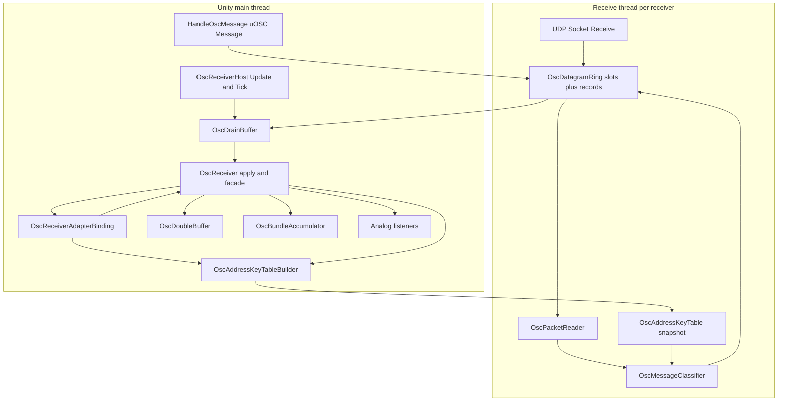
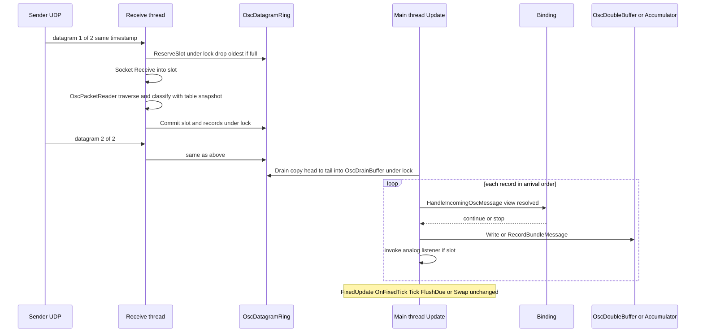
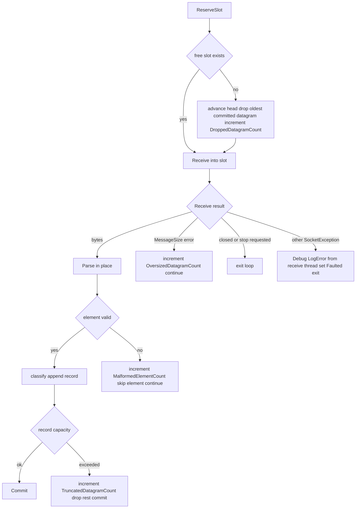
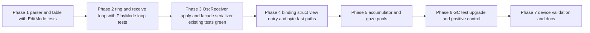

# Technical Design — osc-receive-zero-alloc

## Overview

**Purpose**: `com.hidano.facialcontrol.osc` の OSC 受信経路を、定常受信中に毎フレームのヒープ確保がゼロとなるよう再実装する。uOSC の受信パーサ（データグラムごとの `byte[]`、address / typetag の `string`、`object[]` + boxing）を経由しない自前の UDP 受信ループ・Span ベースのパケットリーダー・UTF-8 バイト列キーによるアドレス解決を `Hidano.FacialControl.Adapters.OSC` 名前空間に追加し、既存の受信機能（heartbeat 自動マッピング、sender_id / ZombieEviction、preset、gaze 広告、AtomicSwap / IndividualMessage、staleness / FailSafe、analog listener）の観測可能な挙動を変えずに GC のこぎり歯を除去する。

**Users**: FacialControl を組み込む Unity エンジニア（VTuber 配信・リアルタイム表情制御）。受信側 `OscReceiverAdapterBinding` を無改修のまま更新版パッケージへ差し替えるだけで恩恵を受ける。

**Impact**: `OscReceiverHost` が `uOSC.uOscServer` を AddComponent しなくなり、代わりに `OscUdpReceiveLoop` を保持する。`OscReceiver.HandleOscMessage(uOSC.Message)` はテスト・外部互換 facade として残り、内部で OSC ワイヤ形式へ一方向変換して新経路と同じパーサを通す。送信側（`OscSender` / `OscBundleBuilder` / 生 `UdpClient`）は変更しない。

### Goals
- 定常受信（ARKit 52 本 + gaze + sender_id、MTU 分割 2 パケット / フレーム）で受信スレッド・メインスレッドともに 0 byte/フレーム（heartbeat 到着フレームを除く）
- 既存 OSC EditMode / PlayMode テストを pre-existing 赤を除き緑に保つ
- `OscReceiverGCAllocationTests` を実 UDP loopback + 全スレッド計測へ昇格し 0 byte を assert する
- 実機（検証プロジェクト OscSend シーン）で Profiler の約 7 秒周期ののこぎり歯が消えることを確認する

### Non-Goals
- uOSC の vendor copy、uOSC 互換 facade の撤去（backlog M-16 Phase 11 は据え置き）
- 送信側コードの変更（テスト側の送信は本仕様のテスト資産として別途持つ）
- Jobs / Burst 化（差し替え可能な境界だけ保つ）
- 受信機能の意味論変更（`OscPortResolver` のポート解決、ListenEndpoint の扱い（現状ログ用途のみ）、bundle timeout など）
- 送信元エンドポイントによるフィルタリング（受信機能は送信元を使わない）

## Boundary Commitments

### This Spec Owns
- `com.hidano.facialcontrol.osc` 受信トランスポート：UDP ソケットの生成・bind・受信スレッド・停止（`OscUdpReceiveLoop`）
- 受信データグラムの固定リングとメインスレッドへの配送（`OscDatagramRing` / `OscDrainBuffer`）と、その溢れ時の最古破棄ポリシー
- OSC ワイヤ形式の受信側解析（`OscPacketReader` / `OscMessageView` / `OscArgumentReader`）
- UTF-8 バイト列キーによるアドレス解決テーブルとそのスナップショット公開（`OscAddressKeyTable`）
- 受信メッセージの分類レコード（`OscResolvedMessage`）と、binding への struct view 受け口（`IOscResolvedMessageHandler`）
- `OscReceiver.HandleOscMessage(uOSC.Message)` 互換 facade の変換規則（一方向）
- `OscBundleAccumulator` と binding gaze 経路のフレームリスト・プール化
- 受信側 GC アロケーションテスト（PlayMode）とリーダー単体テスト（EditMode）

### Out of Boundary
- `OscSender` / `OscBundleBuilder` / `OscSenderAdapterBinding`（ワイヤ形式の**参照元**として読むのみ）
- `uOSC` パッケージ本体（参照は facade の `uOSC.Message` 型のみ）
- `RuntimeMappingResolver` / `HeartbeatConsistencyChecker` / `GazeAdvertisementResolver` / `AddressPresetEstimator` / `ZombieEvictionPolicy` の内部ロジック（入力を string 化して既存 API へ渡す）
- `OscInputSource` / `GazeVector2InputSource` の消費側、`InputSourceRegistry`
- `com.hidano.facialcontrol.ifacialmocap` 等の他パッケージ（`OscReceiverAdapterBinding` の公開挙動が変わらない前提で無改修）

### Allowed Dependencies
- `Hidano.FacialControl.Domain`（`OscMapping`, `ITimeProvider`）、`Hidano.FacialControl.Adapters`（`AdapterBindingBase`, `AdapterBuildContext`）
- `System.Net.Sockets`, `System.Buffers.Binary`, `System.Text`, `System.Threading`（Adapters 層のみ）
- `Unity.Collections`（既存 `OscDoubleBuffer`）、`UnityEngine.Debug`
- `uOSC.Runtime` asmdef 参照は維持するが、参照箇所は `OscReceiver.HandleOscMessage` / `SetMessageFilter` / `OscBundleAccumulator.RecordMessage(uOSC.Message, …)` / `OscMessageSerializer` に限定する
- 依存方向：`OscPacketReader` / `OscAddressKeyTable` / `OscMessageClassifier`（Unity 非依存の純粋 C#）← `OscDatagramRing` ← `OscUdpReceiveLoop` ← `OscReceiver`（MonoBehaviour, facade）← `OscReceiverHost` ← `OscReceiverAdapterBinding`。左が右を参照してはならない。

### Revalidation Triggers
- `OscResolvedMessage` / `OscMessageView` / `IOscResolvedMessageHandler` のシェイプ変更
- 制御メッセージのワイヤ形式（`OscBundleBuilder` 側）変更 → リーダー・分類器・GC テストの送信ワークロードを再検証
- `OscDoubleBuffer` のロック規約、`OscBundleAccumulator.IsBundleTimestamp` の意味論変更
- `AdapterBindingHost` の tick フェーズ（現状 `Update` でドレイン、`FixedUpdate` で `OnFixedTick`）変更
- 受信ソケットの bind 方式（IPv6 dual-mode + ReuseAddress）変更 → `OscPortResolver` の前提が崩れる

## Architecture

### Existing Architecture Analysis
- 現行：`uOscServer`（UDP スレッド + 解析スレッド）→ `uOscServer.Update()`（**メインスレッド**）→ `OscReceiver.HandleOscMessage(uOSC.Message)` → `_messageFilter` = `OscReceiverAdapterBinding.HandleIncomingOscMessage` → `OscDoubleBuffer.Write` / `OscBundleAccumulator.RecordMessage` → `NotifyAnalogListeners`。`OnFixedTick` で `OscReceiverHost.Tick()`（`FlushDue` / `Swap`）と pending heartbeat / gaze 広告処理。
- 維持する境界：`OscReceiverAdapterBinding` の公開 API と `[Serializable]` 形状、`OscReceiverHost` の `Configure / ReconfigureMappings / Tick`、`OscReceiver` の `Initialize / StartReceiving / StopReceiving / HandleOscMessage / RegisterAnalogListener / UnregisterAnalogListener / SetMessageFilter / ExtractBlendShapeName`、`OscDoubleBuffer` のロック規約、`OscBundleAccumulator` の bundle 意味論。
- 解消する技術的負債：受信ホットパス上の string / object[] 確保、AtomicSwap の `new List<BufferedValue>`、gaze / 未マッピング経路の `Substring`、GC テストが uOSC 経路を素通りしていた欠陥。

### Architecture Pattern & Boundary Map



**Architecture Integration**:
- Selected pattern: gap-analysis Option C（ハイブリッド）+ スレッドモデル案1。トランスポート・解析・解決は新規コンポーネント、ライフサイクル・facade・binding 受け口は既存拡張。
- Domain/feature boundaries: 受信スレッドが触れるのは「ソケット」「自スレッド所有のスロット」「不変テーブル」「診断カウンタ」のみ。binding の状態、registry、`ScriptableObject`、`Debug.Log`（致命的エラーを除く）、`OscDoubleBuffer.Swap`、`Time` はメインスレッド限定。
- Existing patterns preserved: `OscDoubleBuffer` の copy-forward + lock、`OscBundleAccumulator` の timestamp 意味論、`OscPortResolver` によるポート解決、`OscReceiverHost` を binding が `AddComponent` する構造、apply が `Update` フェーズ・swap が `FixedUpdate` フェーズという分離。
- New components rationale: 「バイトを所有する層（リング）」「バイトを読む層（リーダー）」「バイトを意味に変える層（テーブル・分類器）」「意味を既存状態に反映する層（受信器・binding）」を分けることで zero-alloc 境界とスレッド境界を一致させる。
- Steering compliance: Adapters 層内に閉じる、通常 C#、Unity 標準ログのみ、カスタム例外なし、`allowUnsafeCode:false` 維持、Jobs/Burst 差し替え境界（`ReadOnlySpan<byte>` 入力）確保。

### Technology Stack

| Layer | Choice / Version | Role in Feature | Notes |
|-------|------------------|-----------------|-------|
| Runtime | Unity 6000.3.19f1 / Mono / C# 9 / .NET Standard 2.1 API | `ref struct` + `ReadOnlySpan<byte>` パーサ、`BinaryPrimitives`、`Guid.TryParse(ReadOnlySpan<char>)` | `allowUnsafeCode:false` を維持 |
| Transport | `System.Net.Sockets.Socket`（UDP, IPv6 dual-mode） | `Socket.Receive(byte[], int, int, SocketFlags)` を受信スレッドでブロッキング呼び出し | `ReceiveFrom` は Mono で 338 byte/回確保するため不採用（research.md 参照） |
| Threading | `System.Threading.Thread`（background）+ `Monitor` + `Interlocked` / `Volatile` | 受信スレッド 1 本 / 受信器、ロック保護 SPSC リング | uOSC の 2 スレッド構成より削減 |
| Buffers | 固定 `byte[]`（スロット連結）、固定 `OscResolvedMessage[]` | データグラムリング・ドレインバッファ | 起動時に一度だけ確保 |
| Existing | `OscDoubleBuffer`（`NativeArray<float>`）、`OscBundleAccumulator`、`OscPortResolver`、`OscAddressFormatter` | 値反映・bundle 意味論・ポート解決・UTF-8 生成規則 | 変更は加算のみ |
| Compat | `uOSC.Runtime`（`uOSC.Message` / `Timestamp` 型） | facade の入力型のみ | 受信ホットパスから uOSC を排除 |
| Test | `com.unity.test-framework` 1.6.0、`Unity.Profiling.ProfilerRecorder`（Memory カウンタ「GC Allocated In Frame」 = `ManagedAllocationProbe`） | EditMode リーダー単体、PlayMode UDP loopback E2E、GC ゲート | 計測器の自己検証手順は Testing Strategy。`GC.GetAllocatedBytesForCurrentThread` は Unity 6000.3.19f1 Mono で常に 0 を返すため使用しない（2026-09-15 実測） |

## File Structure Plan

### Directory Structure
```
Packages/com.hidano.facialcontrol.osc/
├── Runtime/
│   ├── AssemblyInfo.cs                          # 新規: InternalsVisibleTo(Osc.Tests.EditMode / PlayMode)
│   └── Adapters/
│       ├── OSC/
│       │   ├── OscControlAddresses.cs           # 新規: 制御アドレス定数と UTF-8 バイト列
│       │   ├── OscTypeTag.cs                    # 新規: 型タグ byte 定数と分類（payload 有無）
│       │   ├── OscPacketReader.cs               # 新規: ref struct。bundle/message 走査
│       │   ├── OscMessageView.cs                # 新規: readonly ref struct。address/typetag/args/timestamp
│       │   ├── OscArgumentReader.cs             # 新規: ref struct。引数の逐次読み出し
│       │   ├── OscAddressKeyTable.cs            # 新規: 不変スナップショット + Builder（同ファイル内 nested）
│       │   ├── OscAddressResolution.cs          # 新規: 解決結果（readonly struct）
│       │   ├── OscResolvedMessage.cs            # 新規: 配送レコード（readonly struct）
│       │   ├── OscMessageClassifier.cs          # 新規: view + table → OscResolvedMessage（受信スレッド）
│       │   ├── OscDatagramRing.cs               # 新規: スロット + レコード + ロック。commit/drain/drop
│       │   ├── OscDrainBuffer.cs                # 新規: メインスレッド所有のコピー先とレコード列挙
│       │   ├── OscUdpReceiveLoop.cs             # 新規: Socket + Thread + ThreadHooks + Faulted
│       │   ├── OscReceiveOptions.cs             # 新規: スロット/リング/ソケット設定（readonly struct）
│       │   ├── OscReceiveDiagnostics.cs         # 新規: Interlocked カウンタと一度きり警告状態
│       │   ├── IOscResolvedMessageHandler.cs    # 新規: binding のメインスレッド受け口
│       │   ├── OscMessageSerializer.cs          # 新規: uOSC.Message → OSC ワイヤ（facade 専用、internal）
│       │   ├── OscReceiver.cs                   # 変更: ループ所有・テーブル構築・apply・facade
│       │   ├── OscReceiverHost.cs               # 変更: uOscServer 撤去、Update でドレイン
│       │   ├── OscBundleAccumulator.cs          # 変更: フレームリストのプール化
│       │   └── OscAddressFormatter.cs           # 変更: GetOrAddAddressUtf8(pool, address) 追加
│       ├── AdapterBindings/
│       │   └── OscReceiverAdapterBinding.cs     # 変更: IOscResolvedMessageHandler 実装、byte fast path、gaze route set
│       ├── RuntimeSettings/OscRuntimeSettingsSO.cs   # 変更なし（受信リング設定の公開は backlog）
│       └── Json/Dto/OscReceiverOptionsDto.cs         # 変更なし
├── Tests/
│   ├── EditMode/Adapters/OSC/
│   │   ├── OscPacketReaderTests.cs              # 新規: 手組みパケットでの走査・型タグ・不正処理
│   │   ├── OscAddressKeyTableTests.cs           # 新規: 事前生成・完全一致・後勝ち・2 バイト文字
│   │   ├── OscMessageClassifierTests.cs         # 新規: 分類レコードの同値性
│   │   ├── OscDatagramRingTests.cs              # 新規: 最古破棄・ドレイン・version
│   │   ├── OscMessageSerializerTests.cs         # 新規: uOSC.Message → bytes → reader 往復
│   │   └── OscBundleAccumulatorTests.cs         # 変更: プール再利用・混入なし
│   └── PlayMode/
│       ├── Integration/OscUdpReceiveLoopTests.cs       # 新規: bind / 停止 / 溢れ警告 / 不正パケット継続
│       ├── Integration/OscSendReceiveE2ETests.cs       # 既存維持（新経路で緑）
│       └── Performance/OscReceiverGCAllocationTests.cs # 置換: UDP loopback + 全スレッド計測
├── Documentation~/osc-receiver-options.md       # 変更: 受信経路が uOSC 非依存になった旨と診断カウンタの追記
└── CHANGELOG.md                                 # 変更
```

### Modified Files
- `Runtime/Adapters/OSC/OscReceiver.cs` — `uOscServer` 依存を撤去し `OscUdpReceiveLoop` を所有。`Initialize` / `RegisterAnalogListener` / `SetGazeAddresses` がテーブルを再構築して公開。`HandleOscMessage(uOSC.Message)` は `OscMessageSerializer` → `CommitExternal` → `PumpReceived()`。`PumpReceived()` / `SetResolvedMessageHandler()` / `Diagnostics` / `ReceiveOptions` を追加。
- `Runtime/Adapters/OSC/OscReceiverHost.cs` — `uOSC.uOscServer` フィールドと AddComponent を撤去。`Update()` で `Receiver.PumpReceived()`。`Configure` に `OscReceiveOptions` を受ける overload を追加（既存 overload は既定値）。
- `Runtime/Adapters/OSC/OscBundleAccumulator.cs` — `_framePool` を追加し `CompleteCurrentBundleLocked` / `CompleteBareMessagesLocked` / `ApplyFrame` で再利用。`RecordMessage(uOSC.Message, …)` は残す。
- `Runtime/Adapters/AdapterBindings/OscReceiverAdapterBinding.cs` — `IOscResolvedMessageHandler` を実装（`HandleIncomingOscMessage(in OscMessageView, in OscResolvedMessage)`）。既存 `HandleIncomingOscMessage(uOSC.Message)` は削除せず、内部で `OscReceiver` の facade に委譲するか `[Obsolete]` 相当の互換維持（呼び出し元はリポジトリ内に存在しない）。heartbeat / gaze 広告 / preset のバイト列 unchanged fast path。gaze route を `List<GazeRoute>[] _gazeRouteSets` + `string[] _gazeRouteAddresses` で保持し `Receiver.SetGazeAddresses` へ登録。gaze フレームリストのプール化。
- `Runtime/Adapters/OSC/OscAddressFormatter.cs` — `GetOrAddAddressUtf8(Dictionary<string, byte[]> pool, string address)` を追加（UTF-8 生成規則は既存と同じ `Encoding.UTF8`）。
- `Runtime/Adapters/RuntimeSettings/OscRuntimeSettingsSO.cs`、`Runtime/Adapters/Json/Dto/OscReceiverOptionsDto.cs` — 変更なし。受信リング設定は `OscReceiveOptions`（既定 2048 byte × 32、ソケットバッファ OS 既定）をコードから渡す形に留める。
- `Runtime/Hidano.FacialControl.Osc.asmdef` — 参照変更なし（`uOSC.Runtime` は facade のため維持）。

## System Flows

### 受信 → 反映（定常フレーム）



- ドレインは `OscReceiverHost.Update()`（現行 `uOscServer.Update()` と同じフェーズ）。反映順序はデータグラム到着順・データグラム内要素順を保存する。
- レコードの `TableVersion` が現行テーブルと異なる場合はそのレコードを破棄する（マッピング再構築直後の最大 1 フレーム分）。
- **マッピング再構築の単一コミット点**：`OscReceiverHost.ReconfigureMappings(buffer, mappings, accumulator)` → `OscReceiver.Reconfigure(buffer, mappings, accumulator)` が、メインスレッド上で (1) 新テーブルを `Version + 1` で構築 → (2) `_buffer` / `_bundleAccumulator` / `_mappings` を差し替え → (3) `Volatile.Write(ref _table, newTable)` の順に**同一メソッド内で連続実行**する。`Apply` と `Reconfigure` は同一スレッド（メイン）なので割り込まれず、受信スレッドは (3) の前後どちらのテーブルで分類しても `TableVersion` によって新旧が判別できる。binding 側の既存順序（`BuildNormalLookup` → `_buffer.Resize` → 新 accumulator → `ReconfigureMappings`）は維持し、`Resize` されたバッファと新テーブルは (2)(3) で同時に公開される。旧版レコードは `Apply` で `StaleRecordCount++` して破棄。
- `receivedAtSeconds`（bundle timeout 用）は反映時にメインスレッドで `ITimeProvider` / `Time.unscaledTimeAsDouble` から取得する（既存と同一の時刻源）。

### 溢れ・不正パケット・停止



- 一度きり警告はメインスレッドのドレイン時に各カウンタの「0 → 非 0」遷移で `Debug.LogWarning` する（受信スレッドから警告ログを出さない）。
- 停止：`StopReceiving()` → `_stopRequested = 1` → `Socket.Close()`（ブロッキング `Receive` を解除）→ `Thread.Join(500 ms)`。
  - Join 成功（`State = Stopped`）：リングを `Clear()`。以後 `PumpReceived()` は no-op。`StartReceiving()` で再開可能。
  - Join タイムアウト（`State = Stopping`）：受信スレッドがまだ予約スロットへ書き込み中の可能性があるため、**リングを `Clear` せず、再利用も破棄もしない**。`StartReceiving()` は `Debug.LogError` して拒否。`Dispose` / `OnDestroy` はリングとループへの参照を保持したまま（受信スレッドが最終的に `Receive` から例外で抜けて `Stopped` へ遷移するまで GC 対象にならない）終了する。ループは `State` が `Stopped` になった時点で自分でリングを `Clear` する。再開は新しい `OscReceiver` / `OscReceiverHost` の生成で行う。
  - `Faulted` になった受信器はリング残量のドレインだけ行い、再開は `StartReceiving()` の再呼び出しで行う（スレッドは既に終了済み）。
  - PlayMode `OscUdpReceiveLoopTests` に「`Close` で `Receive` が解除され 500 ms 以内に Join 成功する」を Windows/Mono の契約として含める。解除されない環境が見つかった場合は `Stopping` 経路の安全性（再起動拒否・二重書込なし）を検証する。

## Requirements Traceability

| Requirement | Summary | Components | Interfaces | Flows |
|-------------|---------|------------|------------|-------|
| 1.1, 1.2 | 固定リングへ直接受信、コピーなし | OscDatagramRing, OscUdpReceiveLoop | `ReserveSlot` / `Socket.Receive(slotBytes, offset, len)` | 受信→反映 |
| 1.3 | 解析・解決・値抽出を受信スレッドで完了 | OscPacketReader, OscMessageClassifier | `TryReadNext`, `Classify` | 受信→反映 |
| 1.4 | 1 フレーム複数データグラム | OscDatagramRing | `DatagramSlotCount` ≥ 4 | 受信→反映 |
| 1.5 | 溢れ時は最古破棄 + 一度きり警告 | OscDatagramRing, OscReceiveDiagnostics | `DroppedDatagramCount`, `TryLogOnce` | 溢れ |
| 1.6 | 停止・破棄でスレッドとソケット終了 | OscUdpReceiveLoop, OscReceiverHost | `Stop`, `Dispose`, `OnDestroy` | 停止 |
| 1.7 | `OscPortResolver` 維持 | OscReceiver.StartReceiving | 既存 | — |
| 1.8 | bind / 受信例外を標準ログで通知し安全終了 | OscUdpReceiveLoop | `Faulted`, `LastError` | 溢れ・停止 |
| 2.1–2.6, 2.9 | Span 走査、byte 型タグ、BinaryPrimitives、4 byte 境界、string/blob スライス | OscPacketReader, OscMessageView, OscArgumentReader, OscTypeTag | `TryReadNext`, `TryReadNextArgument` | — |
| 2.7 | timestamp 意味論一致 | OscPacketReader | bare = `0x1`、bundle 値を透過 | — |
| 2.8 | 不正要素をスキップして継続 | OscPacketReader | `SkippedElementCount`, `LastError` | 不正パケット |
| 3.1, 3.2 | UTF-8 キー事前生成、プール流用 | OscAddressKeyTable.Builder, OscAddressFormatter | `GetOrAddAddressUtf8`, `Build` | — |
| 3.3, 3.4 | 一致でインデックス、非一致は確保なしスキップ | OscAddressKeyTable | `TryResolve(ReadOnlySpan<byte>, out OscAddressResolution)` | — |
| 3.5 | 2 バイト文字の完全一致 | OscAddressKeyTable | byte `SequenceEqual` | — |
| 3.6 | gaze アドレスの byte 判定 | OscAddressKeyTable（gaze キー） | `GazeRouteSet` | — |
| 3.7 | 解決結果が既存 string 実装と同一 | Builder のキー展開規則 | 完全一致 → prefix フォールバック、後勝ち | — |
| 4.1 | string 化を制御メッセージに限定 | Binding（メインスレッド） | `HandleIncomingOscMessage(in view, in resolved)` | 受信→反映 |
| 4.2 | sender_id 同一判定 | OscMessageClassifier, Binding | `SenderId` を値型で搬送 | — |
| 4.3–4.5 | heartbeat / preset / gaze 広告同一処理 | Binding byte scratch + 既存 resolver | `_heartbeatScratchBytes`, FNV-1a(byte) | — |
| 4.6, 4.7 | 非到着フレーム 0 byte、到着時最小確保 | Binding fast path | unchanged 判定 | — |
| 5.1, 5.2 | struct view 受け口と同一分岐 | IOscResolvedMessageHandler, Binding | `HandleIncomingOscMessage` | 受信→反映 |
| 5.3, 5.4 | facade 存続と同一結果 | OscReceiver, OscMessageSerializer | `HandleOscMessage(uOSC.Message)` → `CommitExternal` → `PumpReceived` | — |
| 5.5 | `OscDoubleBuffer` ロック規約維持 | OscReceiver.Apply（メインスレッド） | `Write` / `Swap` 不変 | — |
| 5.6 | analog listener の同一タイミング | OscReceiver.Apply | `ListenerSlot` | 受信→反映 |
| 5.7 | 公開シグネチャ削除なし | OscReceiver, OscReceiverHost, Binding | 加算のみ | — |
| 6.1, 6.2 | AtomicSwap リストのプール化・混入なし | OscBundleAccumulator | `_framePool`, `Clear()` | — |
| 6.3 | gaze / 未マッピングの Substring 排除 | OscAddressKeyTable | byte 解決 | — |
| 6.4, 6.5 | IndividualMessage / staleness / FailSafe 経路 0 byte | OscReceiver.Apply, Binding 既存 | 変更なし・検証のみ | — |
| 7.1–7.7 | 既存機能の挙動維持 | 全体 | facade 同一パーサ、順序保存 | 受信→反映 |
| 7.8 | 既存テスト緑 | facade, Serializer | — | — |
| 8.1–8.7 | GC テスト昇格 | OscReceiverGCAllocationTests, ThreadHooks, Diagnostics, ManagedAllocationProbe | `HeartbeatArrivalCount`, `FixedTickCount`, `AppliedDatagramCount` | Testing Strategy |
| 8.8 | リーダー EditMode 単体（TDD） | OscPacketReaderTests 他 | — | — |
| 9.1–9.4 | 受入・実機確認 | Testing Strategy / Validation Hooks | Profiler 記録 | — |
| 10.1–10.7 | 配置・非 vendor・sender 不変・通常 C#・標準ログ・受信スレッド制約 | Boundary Commitments, スレッド契約表 | — | — |

## Components and Interfaces

| Component | Domain/Layer | Intent | Req Coverage | Key Dependencies (P0/P1) | Contracts |
|-----------|--------------|--------|--------------|--------------------------|-----------|
| OscUdpReceiveLoop | Adapters/OSC transport | ソケット・受信スレッド・停止 | 1.1–1.8, 10.7 | OscDatagramRing (P0), OscPortResolver (P1) | Service, State |
| OscDatagramRing | Adapters/OSC transport | スロット + レコードの SPSC リング、最古破棄、ドレイン | 1.1, 1.2, 1.4, 1.5 | OscMessageClassifier (P0) | Service, State |
| OscDrainBuffer | Adapters/OSC transport | メインスレッド所有のコピー先、view 再構成 | 5.1 | — | Service |
| OscPacketReader / OscMessageView / OscArgumentReader / OscTypeTag | Adapters/OSC parser（Unity 非依存） | ワイヤ形式走査 | 2.1–2.9 | — | Service |
| OscAddressKeyTable (+Builder) / OscAddressResolution | Adapters/OSC resolve | UTF-8 キーの不変テーブル | 3.1–3.7, 6.3 | OscAddressFormatter (P1) | Service, State |
| OscMessageClassifier / OscResolvedMessage | Adapters/OSC resolve | view → レコード（受信スレッド） | 1.3, 4.2 | OscAddressKeyTable (P0) | Service |
| OscReceiveDiagnostics / OscReceiveOptions | Adapters/OSC | カウンタ・一度きり警告・設定 | 1.5, 1.8 | — | State |
| IOscResolvedMessageHandler | Adapters/OSC ↔ binding | binding のメインスレッド受け口 | 5.1, 5.2 | — | Service |
| OscMessageSerializer | Adapters/OSC compat | uOSC.Message → ワイヤ | 5.3, 5.4 | uOSC.Runtime (P1) | Service |
| OscReceiver（変更） | Adapters/OSC | ループ所有、テーブル構築、apply、facade、listener | 1.7, 5.3–5.7 | OscUdpReceiveLoop (P0), OscDoubleBuffer (P0) | Service, State |
| OscReceiverHost（変更） | Adapters/OSC | ライフサイクル、Update ドレイン、Tick | 1.6, 7.3 | OscReceiver (P0) | Service |
| OscBundleAccumulator（変更） | Adapters/OSC | フレームリストのプール | 6.1, 6.2 | — | State |
| OscReceiverAdapterBinding（変更） | Adapters/AdapterBindings | 制御・gaze・staleness の既存ロジックを struct view で駆動 | 4.1–4.7, 5.1, 5.2, 7.x | OscReceiver (P0), 既存 resolver 群 (P1) | Service, State |
| OscReceiverGCAllocationTests（置換） | Tests/PlayMode/Performance | 実 UDP + 全スレッド 0 byte ゲート | 8.1–8.7, 9.1 | ThreadHooks (P0) | Batch |

### スレッド / ロック契約

| 対象 | 受信スレッド | メインスレッド | 同期 |
|------|-------------|---------------|------|
| `Socket` | `Receive` のみ | 生成・bind・`Close` | `Close` がブロッキング `Receive` を解除。`_stopRequested` は `Volatile` |
| `OscDatagramRing` スロットバイト / レコード | 予約済みスロットへ書込・解析 | ドレイン時に `[head, tail)` を memcpy | `_sync`（Monitor）。予約・コミット・ドレイン・最古破棄はすべてロック下。予約中スロットは `[head, tail)` に含まれない |
| `OscAddressKeyTable` | `Volatile.Read` で参照、読み取りのみ | Builder で構築し `Volatile.Write` で差し替え | 不変オブジェクト + version |
| `OscReceiveDiagnostics` カウンタ | `Interlocked.Increment` | `Volatile.Read`、一度きり警告の `Interlocked.Exchange` | lock-free |
| `OscDrainBuffer` | 触らない | 所有・列挙 | 単一スレッド |
| `OscDoubleBuffer` | 触らない（変更点） | `Write` / `Swap` / `GetReadBuffer` | 既存の `_resizeLock` を維持 |
| `OscBundleAccumulator` | 触らない | `RecordBundleMessage` / `FlushDue` | 既存 `_sync` を維持（他 caller 互換） |
| binding の全状態（heartbeat scratch, gaze route sets, sender decision, fail-safe, registry） | 触らない | 全処理 | 既存の `_heartbeatSync` / `_gazeAdSync` / `_gazeBundleSync` は維持するが競合相手はいない（将来のスレッド変更に備え残す） |
| analog listener delegate | 触らない | `Apply` 内で invoke | `_analogListenersLock` は登録・解除・スロット配列差し替え時のみ |
| `Debug.Log*` | 致命的例外（bind 失敗・受信ループ異常終了）のみ | 一度きり警告・診断・既存ログ | — |
| `Time` / `ITimeProvider` | 触らない | `receivedAtSeconds` 取得 | — |
| ThreadHooks（`OnThreadStarted` / `OnThreadStopping`） | スレッド生涯で各 1 回 invoke | 設定は `Start` 前 | テスト・診断専用。ホットパスでは呼ばれない |

### リング容量と溢れ

| 項目 | 既定 | 範囲 | 溢れ・超過時 |
|------|------|------|-------------|
| `DatagramSlotBytes` | 2048 | 512–65535 | 超過データグラムは `SocketException(MessageSize)` → 破棄、`OversizedDatagramCount++`、一度きり警告（送信側 1472 分割と第三者の一般的な ≤1.5 KB を想定） |
| `DatagramSlotCount` | 32 | 4–1024 | 空きなし → 最古のコミット済みデータグラムを破棄、`DroppedDatagramCount++`、一度きり警告 |
| レコード数 / スロット | `DatagramSlotBytes / 16`（最小 8） | 派生 | 超過分のメッセージは破棄、`TruncatedDatagramCount++`、一度きり警告 |
| ドレインバッファ | リングと同容量 | 派生 | ドレインは常に全量コピーできる |
| `SocketReceiveBufferBytes` | 0（OS 既定） | 0 or 8 KB–8 MB | 0 以外なら `Socket.ReceiveBufferSize` に設定 |
| heartbeat byte scratch（binding） | 32 KB | 固定 | 超過分の名前は捨てて `HeartbeatTruncated` 警告一度。512 プリセット × 32 byte を想定 |
| gaze 広告 byte scratch（binding） | 8 KB | 固定 | 同上 |
| フレームリストプール（accumulator / gaze） | 4 本、`Queue` 初期容量 8 | 伸長可 | バースト時のみ確保 |

破棄単位はデータグラム。MTU 分割された 2 パケットの片方だけが破棄された場合の観測挙動は実 UDP ロスと同じ（同一 timestamp の残り要素は通常どおり反映される）。

### view のライフタイム規則
- 受信スレッド：`OscMessageView` の各スライスは `OscDatagramRing` の予約スロット上を指し、そのデータグラムの `Commit` を呼ぶまで有効。`OscMessageClassifier` はスライスを保持せず、`OscResolvedMessage`（値型のみ）へ縮約する。
- メインスレッド：`OscDrainBuffer` が再構成する `OscMessageView` は `HandleIncomingOscMessage(in view, in resolved)` の呼び出し期間のみ有効（実体は次の `Drain` まで残るが、契約上は呼び出し中のみ）。binding は必要なバイト列を自前の固定 scratch にコピーするか、その場で `string` 化する。
- `OscResolvedMessage` は値型であり、view の寿命とは独立に保持できる（ただし `TableVersion` が変わると意味を失う）。

### Adapters/OSC — transport

#### OscUdpReceiveLoop

| Field | Detail |
|-------|--------|
| Intent | UDP ソケットと受信スレッドを所有し、データグラムをリングへ直接受信して解析・分類・コミットする |
| Requirements | 1.1, 1.2, 1.3, 1.4, 1.6, 1.8, 10.5, 10.7 |

**Responsibilities & Constraints**
- `Start(port, options)` で `Socket(AddressFamily.InterNetworkV6, Dgram, Udp)` を生成、`IPv6Only=0`、`ReuseAddress=1`、`Bind(IPv6Any, port)`（uOSC と同一。`OscPortResolver` の前提を維持）。bind 失敗は `Debug.LogError` してスレッドを起動せず `Faulted=true`。
- スレッドは background、名前 `FacialControl.OscReceive:{port}`。ループ本体は Unity API を呼ばない（ThreadHooks を除く）。
- 受信スレッド上での確保は起動時以外ゼロ（例外経路を除く）。
- Jobs/Burst 差し替え境界：解析・分類は `ParseAndClassify(ReadOnlySpan<byte> datagram, Span<OscResolvedMessage> records, OscAddressKeyTable table, out int count)` の静的関数として `OscDatagramRing` から呼ばれ、ループ本体は I/O とリング操作のみ担う。

**Dependencies**
- Outbound: OscDatagramRing — スロット予約・コミット (P0)
- Outbound: OscReceiveDiagnostics — カウンタ (P1)
- External: System.Net.Sockets.Socket (P0)

**Contracts**: Service [x] / API [ ] / Event [ ] / Batch [ ] / State [x]

##### Service Interface
```csharp
public sealed class OscUdpReceiveLoop : IDisposable
{
    public OscUdpReceiveLoop(OscDatagramRing ring, OscReceiveDiagnostics diagnostics);
    public OscReceiveThreadHooks ThreadHooks { get; set; }   // Start 前に設定。テスト・診断専用
    public bool IsRunning { get; }
    public bool Faulted { get; }
    public int BoundPort { get; }
    public void Start(int port, in OscReceiveOptions options);  // 二重 Start は no-op
    public void Stop();                                          // Close → Join(500ms) → ring.Clear()
    public void Dispose();
}

public struct OscReceiveThreadHooks
{
    public Action OnThreadStarted;    // 受信スレッド上で 1 回
    public Action OnThreadStopping;   // 受信スレッド上で 1 回
    public Action OnDatagramCommitted; // internal 診断用（テストの positive control）。null 既定
}
```
- Preconditions: `Start` は `Stop` 済みまたは未起動で呼ぶ。`ThreadHooks` は `Start` 前に固定。
- Postconditions: `Stop` 後にコールバック（binding への apply）は発生しない。`Faulted` 後は `IsRunning=false`。
- Invariants: 受信スレッドはスロットバイト・レコード・診断カウンタ・不変テーブル以外に触れない。

##### State Management
- State model: `Stopped → Running → (Stopping → Stopped | Faulted)`。`Stopping` は「停止要求済みだが受信スレッドの終了未確認」を表し、この状態では `Start` 拒否・リング不変（上記 停止 契約）。
- Concurrency strategy: `_stopRequested`（`Volatile`）、`Socket.Close()` で解除。`ObjectDisposedException` / `SocketException(Interrupted, OperationAborted)` は停止要求中なら黙って終了、それ以外は `Debug.LogException` + `Faulted`。
- `SocketException(MessageSize)` は継続（`OversizedDatagramCount++`）。`ConnectionReset`（Windows の ICMP 到達不能通知）も継続。

**Implementation Notes**
- Integration: `OscReceiver.StartReceiving()` が `OscPortResolver.ResolveAvailablePort` で port を決めてから `Start` を呼ぶ（既存のログ文言を維持）。
- Validation: PlayMode `OscUdpReceiveLoopTests`（bind → 受信 → Stop で Join 成功、二重 Stop、Faulted 遷移）。
- Risks: `Socket.Receive` の確保有無は Unity 6 Mono 上で GC テストが検証する。確保が判明した場合は where-allocation 方式（`EndPoint` 派生）へ内部実装のみ切替。

#### OscDatagramRing

| Field | Detail |
|-------|--------|
| Intent | 固定スロット + 固定レコード配列のロック保護 SPSC リング。予約・コミット・最古破棄・ドレインを提供する |
| Requirements | 1.1, 1.2, 1.4, 1.5 |

**Responsibilities & Constraints**
- コンストラクタで `byte[SlotCount * SlotBytes]`、`OscResolvedMessage[SlotCount * RecordsPerSlot]`、`SlotHeader[SlotCount]`（state, length, recordCount, sequence, tableVersion）を一度だけ確保。
- **スロット状態と索引**：各スロットは `Free / Reserved / Committed` のいずれか。索引は `head`（最古の Committed）、`committedTail`（次に Commit されるべき位置 = `[head, committedTail)` が Committed 列）、`reservedTail`（次に Reserve される位置。`reservedTail == committedTail` なら予約なし、`reservedTail == committedTail + 1` なら 1 スロット Reserved）。すべて単調増加の論理カウンタで、物理索引は `% SlotCount`。
- **不変条件**：(I1) `head ≤ committedTail ≤ reservedTail ≤ head + SlotCount`。(I2) Reserved スロットは常に高々 1 つで、`Drain` の対象 `[head, committedTail)` に含まれない。(I3) `Drain` / `Clear` は Reserved スロットのバイトに触れない。(I4) Committed 列は Commit 順 = Drain 順。
- **状態遷移**（すべて `_sync` ロック下）：
  | 操作 | 事前 | 遷移 | 事後 |
  |---|---|---|---|
  | `TryReserveSlot` | 予約なし、`reservedTail − head < SlotCount` | `slot[reservedTail] = Reserved; reservedTail++` | 予約 1 |
  | `TryReserveSlot`（満杯） | 予約なし、`reservedTail − head == SlotCount` | `slot[head] = Free; head++; DroppedDatagramCount++` の後に通常予約 | 最古 Committed を 1 つ破棄。`head == committedTail` のときは Committed 列が空なので破棄対象がない（`reservedTail − head == SlotCount` かつ予約なしなら必ず Committed 列は満杯のため到達しない） |
  | `Commit` | `slot == committedTail`、Reserved | `slot = Committed; committedTail++` | 予約なし |
  | `Abort` | `slot == committedTail`、Reserved | `slot = Free; reservedTail--` | 予約なし |
  | `Drain` | — | `[head, committedTail)` を target へコピーし `slot = Free; head = committedTail` | Reserved は不変 |
  | `Clear` | 予約なし（`Stopped` 時のみ） | 全 Free、`head = committedTail = reservedTail` | — |
- **producer ブロック中の consumer 可視範囲**：受信スレッドが `Reserve` 後に `Socket.Receive` でブロックしている間、consumer は `[head, committedTail)` のみをドレインできる。Reserved スロットは `Commit` されるまで不可視。
- **wrap-around**：物理索引は `% SlotCount` で計算し、コピーは `[head, committedTail)` が物理的に分断される場合 2 回の memcpy に分ける。
- `Commit(slot, length, recordCount, tableVersion)` / `Abort(slot)` / `Drain(OscDrainBuffer target)`（戻り値はデータグラム数）は上表のとおり。
- `CommitExternal(ReadOnlySpan<byte> datagram, OscAddressKeyTable table)`：facade 用。予約 → コピー → `ParseAndClassify` → コミット（メインスレッドから呼ばれる。ロックにより受信スレッドと安全に共存）。
- `Clear()`：head = tail、予約解除。

**Dependencies**
- Outbound: OscMessageClassifier（`ParseAndClassify`）(P0)

**Contracts**: Service [x] / API [ ] / Event [ ] / Batch [ ] / State [x]

##### Service Interface
```csharp
public sealed class OscDatagramRing
{
    public OscDatagramRing(in OscReceiveOptions options, OscReceiveDiagnostics diagnostics);
    public int SlotBytes { get; }
    public int SlotCount { get; }
    public int RecordsPerSlot { get; }
    public int PendingDatagramCount { get; }              // ロック下で読む
    public bool TryReserveSlot(out int slot);             // 受信スレッド
    public Span<byte> GetSlotBytes(int slot);             // 予約者のみ
    public Span<OscResolvedMessage> GetSlotRecords(int slot);
    public void Commit(int slot, int length, int recordCount, int tableVersion);
    public void Abort(int slot);
    public int Drain(OscDrainBuffer target);              // メインスレッド
    public void CommitExternal(ReadOnlySpan<byte> datagram, OscAddressKeyTable table); // facade
    public void Clear();
}
```
- Invariants: 上記 I1〜I4。

**Implementation Notes**
- Validation: EditMode `OscDatagramRingTests` — 満杯時に最古が消え最新が残る、`Drain` 後に空、`CommitExternal` と `TryReserveSlot` の混在、`Clear`、`Abort` 後の再予約、wrap-around 境界（`SlotCount` の倍数 ±1）、Reserved 中の `Drain` が Reserved に触れないこと。加えて producer / consumer を別スレッドで回す並行テスト（EditMode、`Thread` 2 本 × 10,000 データグラム、順序保存とドロップ数の整合を検証）。
- Risks: レコード数超過（`TruncatedDatagramCount`）は 1472 byte / 16 byte = 92 メッセージ以下なら発生しない。

#### OscDrainBuffer

| Field | Detail |
|-------|--------|
| Intent | メインスレッドが所有するリングのコピー先。レコードを到着順に列挙し、各レコードに対応する `OscMessageView` を再構成する |
| Requirements | 5.1, 5.2 |

##### Service Interface
```csharp
public sealed class OscDrainBuffer
{
    public OscDrainBuffer(in OscReceiveOptions options);
    public int DatagramCount { get; }
    public int RecordCount { get; }
    public ref readonly OscResolvedMessage GetRecord(int index);
    public OscMessageView GetView(int index);   // レコードの ElementOffset/ElementLength から再構成
    public void Reset();
}
```
- Postconditions: `GetView` が返すスライスは次の `Drain`（= `Reset`）まで有効。契約上は handler 呼び出し中のみ有効として扱う。

### Adapters/OSC — parser（Unity 非依存）

#### OscPacketReader / OscMessageView / OscArgumentReader / OscTypeTag

| Field | Detail |
|-------|--------|
| Intent | OSC 1.0 ワイヤ形式を `ReadOnlySpan<byte>` 上で確保なしに走査する |
| Requirements | 2.1–2.9 |

**Responsibilities & Constraints**
- `#bundle`（8 byte 識別子 + 8 byte timestamp）と単一 message の両方を受理。ネスト bundle は深さ 8 まで固定スタックで追跡し、超過は要素スキップ。
- bare（トップレベル非 bundle）message の `TimestampKey` は `0x1`（uOSC と同一）。bundle 内要素は bundle の timestamp、ネストは内側の timestamp。
- 要素サイズは 4 の倍数かつ残量以内を必須（uOSC と同じ）。address は空でないこと（先頭 `/` は uOSC 同様に強制しない）。typetag は `,` 始まり。
- 既知タグ：payload あり `i`(4) `f`(4) `s`(pad4) `b`(4+len pad4)、payload なし `T` `F`（現行 uOSC と同じ受理集合。Req 2.4）。未知タグ → その message をスキップ（`OscPacketError.UnknownTypeTag`）し次の要素へ（現行 uOSC は未知タグの payload を消費せず後続をずらして解析するため、ここは「message 単位スキップ」で堅牢化する。可観測差分は「壊れた message が誤った値として反映されなくなる」方向のみ）。`h d t N I` の受理は backlog 送り。
- 長さ不足・アライメント違反・引数長不一致 → message（または bundle）スキップ、`SkippedElementCount++`、`LastError` 更新、例外を投げない。
- float は `BinaryPrimitives.ReadInt32BigEndian` → `BitConverter.Int32BitsToSingle`（確保なし）。

##### Service Interface
```csharp
public static class OscTypeTag
{
    public const byte Int32 = (byte)'i', Float32 = (byte)'f', String = (byte)'s', Blob = (byte)'b',
                      True = (byte)'T', False = (byte)'F';
    public static bool HasPayload(byte tag);
    public static bool IsKnown(byte tag);
}

public enum OscPacketError : byte { None, Truncated, Misaligned, BadAddress, BadTypeTags, UnknownTypeTag, ArgumentOutOfRange, BundleTooDeep }

public ref struct OscPacketReader
{
    public OscPacketReader(ReadOnlySpan<byte> packet);
    public bool TryReadNext(out OscMessageView message); // 深さ優先・到着順
    public int SkippedElementCount { get; }
    public OscPacketError LastError { get; }
    public static bool IsBundle(ReadOnlySpan<byte> packet);
}

public readonly ref struct OscMessageView
{
    public ReadOnlySpan<byte> Address { get; }     // 終端 NUL を含まない
    public ReadOnlySpan<byte> TypeTags { get; }    // 先頭 ',' を含まない
    public ReadOnlySpan<byte> Arguments { get; }   // 引数領域全体
    public ReadOnlySpan<byte> Element { get; }     // message 全体（再構成・コピー用）
    public ulong TimestampKey { get; }
    public int ArgumentCount => TypeTags.Length;
    public bool TryGetFirstAsFloat(out float value);       // 'f' → そのまま、'i' → int→float。それ以外 false（既存 TryGetFloat と同一）
    public OscArgumentReader GetArgumentReader();
}

public ref struct OscArgumentReader
{
    public bool TryReadNext(out OscArgument argument);    // 逐次。不正なら false + Error
    public OscPacketError Error { get; }
}

public readonly ref struct OscArgument
{
    public byte Tag { get; }
    public ReadOnlySpan<byte> Bytes { get; }   // s: NUL/pad なし, b: blob 本体, 数値: 生 BE バイト
    public bool TryGetFloat(out float v);      // f / i
    public bool TryGetInt32(out int v);        // i
    public bool IsString => Tag == OscTypeTag.String;
    public bool IsBlob => Tag == OscTypeTag.Blob;
}
```
- Preconditions: 入力スパンは呼び出し中不変（リングのスロット所有者のみが呼ぶ）。
- Postconditions: 走査中に managed 確保を行わない。`TryReadNext` が false を返した後の `SkippedElementCount` / `LastError` は診断用に安定。

**Implementation Notes**
- Validation: EditMode `OscPacketReaderTests` — 手組みバイト列（`OscBundleBuilder` 出力と手書きの両方）で bundle / bare / ネスト / 分割パケット / 2 バイト文字 address / blob+string の sender_id / `,T` / 未知タグ `,x` / 長さ不足 / 4 byte 非整列 / 型タグ数と引数長の不一致 を網羅。uOSC が受理するものは同じ順序で同じ値を返すこと。
- Risks: 第三者送信元の非標準パケット。未知タグはメッセージ単位スキップで残りを継続する（uOSC より堅牢）。

### Adapters/OSC — resolve

#### OscAddressKeyTable / Builder / OscAddressResolution

| Field | Detail |
|-------|--------|
| Intent | UTF-8 アドレスバイト列 → 解決結果（mapping index / gaze route set / listener slot / control kind）の不変テーブル |
| Requirements | 3.1–3.7, 6.3 |

**Responsibilities & Constraints**
- Builder はメインスレッド専用。入力：`OscMapping[] runtimeMappings`、`string[] gazeAddresses`（順序 = route set index）、`string[] listenerAddresses`（順序 = listener slot）、制御アドレス（常に登録）。
- キー展開規則（既存 string 実装と同一の解決結果を保証）：
  1. 各 mapping i について `OscAddress` を **完全一致キー**として登録（重複は後勝ち）。
  2. 各 mapping i について `BlendShapeName` が非空なら `VRChatAddressPrefix + name` と `ARKitAddressPrefix + name` を **フォールバックキー**として登録（重複は後勝ち）。フォールバックキーは同じバイト列の完全一致キーが存在する場合は追加しない（既存の「完全一致優先」）。
  3. gaze アドレス、listener アドレス、制御アドレスは同一バイト列のエントリに **フラグを合成**する（1 アドレスが mapping かつ listener かつ gaze で在り得る）。
- UTF-8 生成は `OscAddressFormatter.GetOrAddAddressUtf8(pool, address)` / `GetOrAddBlendShapeAddressUtf8(pool, preset, name)` を用い、受信器所有の `Dictionary<…, byte[]>` プールで同一アドレスの `byte[]` を共有する（3.2）。テーブルは `byte[]` 参照を保持するのみで、プール辞書には受信スレッドから触れない。
- 照合：`length` と FNV-1a 32bit（byte）を鍵にした開番地配列 → 候補の `SequenceEqual`。衝突時も確保なし。
- `Version`（単調増加 int）を持ち、`OscReceiver` が `Volatile.Write` で公開する。

##### Service Interface
```csharp
public readonly struct OscAddressResolution
{
    public readonly int MappingIndex;     // -1 = なし
    public readonly int GazeRouteSet;     // -1 = なし
    public readonly int ListenerSlot;     // -1 = なし
    public readonly OscControlKind Control; // None / SenderId / Heartbeat / Preset / GazeAdvertisement
    public bool IsKnownNormalBlendShape => MappingIndex >= 0;
    public bool IsUnmapped => MappingIndex < 0 && GazeRouteSet < 0 && ListenerSlot < 0 && Control == OscControlKind.None;
}

public sealed class OscAddressKeyTable
{
    public static readonly OscAddressKeyTable Empty;
    public int Version { get; }
    public int EntryCount { get; }
    public bool TryResolve(ReadOnlySpan<byte> addressUtf8, out OscAddressResolution resolution); // 確保なし
    public static uint Hash(ReadOnlySpan<byte> bytes);   // FNV-1a 32bit

    public sealed class Builder
    {
        public Builder(Dictionary<string, byte[]> utf8Pool);
        public Builder SetMappings(OscMapping[] runtimeMappings);
        public Builder SetGazeAddresses(IReadOnlyList<string> addresses);
        public Builder SetListenerAddresses(IReadOnlyList<string> addresses);
        public OscAddressKeyTable Build(int version);
    }
}
```
- Invariants: テーブルは構築後不変。`TryResolve` はスレッド安全（読み取りのみ）。

**Implementation Notes**
- Validation: EditMode `OscAddressKeyTableTests` — 完全一致優先、後勝ち、フォールバックの prefix 両対応、2 バイト文字 / 特殊記号の完全一致、非一致で確保なし（`ManagedAllocationProbe.MeasureAllocatedBytes` = 「GC Allocated In Frame」カウンタ差分。`ManagedAllocationProbeTests` で計測器が実確保を検出することを固定）、gaze + listener + mapping の合成。`OscReceiver.ExtractBlendShapeName` を使った既存解決との**同値性プロパティテスト**（ランダム mapping 集合に対して全アドレスで同じ index）。

#### OscMessageClassifier / OscResolvedMessage

| Field | Detail |
|-------|--------|
| Intent | 受信スレッドで `OscMessageView` を値型レコードへ縮約する |
| Requirements | 1.3, 4.2 |

##### Service Interface
```csharp
[Flags] public enum OscResolvedKind : byte { None = 0, BlendShape = 1, Gaze = 2, Listener = 4, Control = 8 }

public readonly struct OscResolvedMessage      // 48 byte 以下を目標
{
    public readonly OscResolvedKind Kind;
    public readonly OscControlKind Control;
    public readonly bool HasFloat;
    public readonly float FloatValue;         // HasFloat のとき有効
    public readonly int MappingIndex;         // -1 = なし
    public readonly int GazeRouteSet;         // -1 = なし
    public readonly int ListenerSlot;         // -1 = なし
    public readonly ulong TimestampKey;
    public readonly int TableVersion;
    public readonly int ElementOffset;        // スロット内 message 先頭
    public readonly int ElementLength;
    public readonly Guid SenderUuid;          // Control == SenderId のとき
    public readonly long SenderStartedAtUnixMs;
    public readonly bool SenderIdentityValid; // 解釈できたか（false なら既存どおり警告 1 回 + 無視）
}

public static class OscMessageClassifier
{
    // 戻り値 false = 未マッピングかつ listener なし（レコードを作らない）
    public static bool TryClassify(in OscMessageView view, OscAddressKeyTable table, out OscResolvedMessage record);
    public static int ParseAndClassify(ReadOnlySpan<byte> datagram, OscAddressKeyTable table,
                                       Span<OscResolvedMessage> records, OscReceiveDiagnostics diagnostics);
}
```
- 分類規則：
  - `TryResolve` 失敗 → レコードなし（3.4。既存でも未マッピング + listener なしは状態変更ゼロ）。
  - `HasFloat` は `TryGetFirstAsFloat`（`f` / `i` のみ）。`,T` などは `HasFloat=false` のまま届け、既存の「既知アドレスなら staleness 更新のみ」を維持。
  - `SenderId`：引数 1 が `b`(16 byte) → `new Guid(ReadOnlySpan<byte>)`（既存 `new Guid(byte[])` と同じバイト順解釈）、または `s` で `Guid.TryParse(ReadOnlySpan<char>)`（ASCII を `stackalloc char[64]` へ拡張）。引数 2 が `s` → `long.TryParse(ReadOnlySpan<char>)`、`i` → 数値。既存 `TryParseSenderIdentity` と同じ受理集合。blob 表現と文字列表現で同一 sender が同一 `SenderIdentity` になることを固定バイト列で検証する（`OscMessageClassifierTests`）。
  - `Heartbeat` / `Preset` / `GazeAdvertisement`：レコードのみ（バイト列はメインスレッドで view から読む）。
- Postconditions: 確保なし。`records` 容量超過時は残りを捨て `TruncatedDatagramCount++`。

#### IOscResolvedMessageHandler

```csharp
public interface IOscResolvedMessageHandler
{
    /// <summary>メインスレッド専用。false を返すと OscReceiver は書込・listener 通知を行わない（既存 filter 契約と同じ）。</summary>
    bool HandleIncomingOscMessage(in OscMessageView view, in OscResolvedMessage resolved);
}
```

### Adapters/OSC — receiver / host / compat

#### OscReceiver（変更）

| Field | Detail |
|-------|--------|
| Intent | 受信ループ・リング・テーブルを所有し、ドレインしたレコードを binding / バッファ / listener へ反映する。uOSC 互換 facade を提供する |
| Requirements | 1.7, 5.3–5.7, 6.4 |

**Responsibilities & Constraints**
- `Initialize(...)`：既存シグネチャ維持。`OscMapping[]` からテーブルを再構築し `Version++` で公開。`_addressToIndex` / `_blendShapeNameToIndex` は撤去（テーブルが代替）。
- `StartReceiving()`：既存のポート解決・ログ文言を維持し `OscUdpReceiveLoop.Start`。`_messageFilter` と resolved handler の両方が設定されている場合は「filter は無視され handler が優先される」旨を一度だけ警告。前回の `StopReceiving` で受信スレッドの終了が確認できていない（`ReceiveLoop.State == Stopping`）場合は `Debug.LogError` して起動しない（下記 停止 契約）。
- `PumpReceived()`（新規、メインスレッド）：`ring.Drain(drainBuffer)` → 各レコードに `Apply`。`OscReceiverHost.Update()` と facade から呼ばれる。
- `Apply(in view, in resolved)`：`resolved.TableVersion != table.Version` → 破棄。**前段フィルタ**を 1 回だけ実行する：resolved handler が設定されていれば `handler.HandleIncomingOscMessage(in view, in resolved)`、設定されておらず `_messageFilter` が設定されていれば `_messageFilter(_facadeMessage)`（facade 経路でのみ非 null。UDP 経路では `_facadeMessage` が既定値のため filter は呼ばれずスキップ）、どちらも未設定なら通過。前段が false → return。`!HasFloat` → return。`MappingIndex ≥ 0` → `WriteValue`（AtomicSwap なら `RecordBundleMessage(timestampKey, index, value, now)`、それ以外 `Write`）。`ListenerSlot ≥ 0` → `_listenerSlots[slot]?.Invoke(value)`（例外は `Debug.LogException` で握る、既存どおり）。
- **filter / handler 排他契約**：`SetMessageFilter` と `SetResolvedMessageHandler` は排他で、同一メッセージに対して前段フィルタは必ず 1 回だけ呼ばれる。両方設定時は handler を優先し filter は呼ばない。これにより facade 経由で通常メッセージが二重処理（`MarkAcceptedPacket` の重複等）されることを防ぐ。binding は `SetResolvedMessageHandler` のみを使い、`SetMessageFilter` は外部の旧利用者向けに残す。
- `HandleOscMessage(uOSC.Message)`：`!_initialized || _buffer == null` → return。`address` null/空 → return（既存）。`OscMessageSerializer.TryWrite(message, _facadeScratch, out length)` → `_facadeMessage = message` → `ring.CommitExternal(span, table)` → `PumpReceived()` → `_facadeMessage = default`。filter はここでは直接呼ばず、`Apply` の前段フィルタとして 1 回だけ呼ばれる。`CommitExternal` は UDP 由来の未ドレインデータグラムより後ろにコミットされるため、facade メッセージの適用順は「先にリングにあったもの → facade」となる（既存でも `uOscServer.Update` の後に呼ばれる場合は同じ順序）。
- `RegisterAnalogListener` / `UnregisterAnalogListener`：既存の `Dictionary<string, Action<float>>` を維持しつつ `Action<float>[] _listenerSlots` と `string[] _listenerAddresses` を再構築し、テーブルを再公開。
- `SetGazeAddresses(IReadOnlyList<string>)`（新規）：binding から gaze route アドレス列を受け取りテーブル再公開。
- `SetResolvedMessageHandler(IOscResolvedMessageHandler)`（新規）。
- `Diagnostics`（新規 getter）、`ReceiveOptions`（新規、`StartReceiving` 前に設定）。

##### Service Interface（追加分のみ）
```csharp
public partial class OscReceiver : MonoBehaviour
{
    public OscReceiveOptions ReceiveOptions { get; set; }
    public OscReceiveDiagnostics Diagnostics { get; }
    public OscAddressKeyTable CurrentTable { get; }             // テスト・診断
    public void SetResolvedMessageHandler(IOscResolvedMessageHandler handler);
    public void SetGazeAddresses(IReadOnlyList<string> addresses);
    public int PumpReceived();                                   // 反映したレコード数
    internal OscUdpReceiveLoop ReceiveLoop { get; }              // テスト（ThreadHooks）
}
```
- Preconditions: すべてメインスレッドから呼ぶ。
- Postconditions: `PumpReceived` は定常状態で確保ゼロ。

**Implementation Notes**
- Integration: `SetMessageFilter(Func<uOSC.Message,bool>)` は残す。binding は使用をやめる。
- Validation: 既存 `OscReceiverAnalogListenerTests`（facade 直後の同期 invoke）、`OscIntegrationTests`、`OscSendReceiveTests`。
- Risks: facade スクラッチ（64 KB）は初回 `HandleOscMessage` で遅延確保（テスト計測前のウォームアップで確保済みになる）。

#### OscReceiverHost（変更）

- `Configure(...)` 既存 overload 維持 + `OscReceiveOptions` を受ける overload 追加。`uOSC.uOscServer` の取得・破棄コードを撤去。
- `Update()`（新規）：`_receiver?.PumpReceived()`。現行 `uOscServer.Update()` と同じフェーズ。
- `Tick()`：不変（`FlushDue` / `Swap`）。
- `OnDestroy()`：`StopReceiving` → `Destroy(_receiver)`。

#### OscMessageSerializer（facade 専用）

```csharp
internal static class OscMessageSerializer   // facade 専用。InternalsVisibleTo でテストから参照
{
    // values の型: float→f, int→i, string→s, byte[]→b, bool→T/F。その他（long/double/null 等）は false（既存 uOSC.Message.Write と同じ受理集合）。
    // timestamp が IsBundleTimestamp なら #bundle で包む（TimestampKey を透過させるため）。
    public static bool TryWrite(uOSC.Message message, byte[] destination, out int length);
    public static int GetRequiredLength(uOSC.Message message);
}
```
- 確保なし（`Encoding.UTF8.GetBytes(string, int, int, byte[], int)`）。`destination` 不足時は false（呼び出し側は 64 KB スクラッチを持つ）。
- `internal` に留める理由：Req 5.3 / 5.4 は facade 互換のみを要求し、外部公開 API の追加は求めていない。

#### OscBundleAccumulator（変更）

- `Stack<List<BufferedValue>> _framePool`（初期 4 本）、`_readyFrames` は `new Queue<>(8)`。`CompleteCurrentBundleLocked` / `CompleteBareMessagesLocked` は `_currentBundleValues = RentLocked()`。`FlushDue` の `ApplyFrame` 後に `frame.Clear(); ReturnLocked(frame)`。`Clear()` は全フレームをプールへ戻す。
- `RecordMessage(uOSC.Message, …)` は既存互換で残す（テストが使用）。

### Adapters/AdapterBindings

#### OscReceiverAdapterBinding（変更）

| Field | Detail |
|-------|--------|
| Intent | 既存の制御・gaze・staleness ロジックを `OscResolvedMessage` + `OscMessageView` で駆動する |
| Requirements | 4.1–4.7, 5.1, 5.2, 6.1–6.5, 7.1–7.7 |

**Responsibilities & Constraints**
- `StartReceiverPhase`：`_helperHost.Receiver.SetResolvedMessageHandler(this)`、`ReceiveOptions` を settings から設定、gaze route 構築後に `SetGazeAddresses(_gazeRouteAddresses)`。
- `HandleIncomingOscMessage(in view, in resolved)`（メインスレッド）の分岐は既存と同一順序：
  1. `Control == SenderId` → `HandleSenderIdentity(in resolved)`（`SenderIdentityValid` false なら既存文言で警告）→ `ZombieEvictionPolicy.Observe` → bundle / bare 判定キャッシュ → return false。
  2. `IsAcceptedSenderMessage(resolved.TimestampKey)` false → return false。
  3. `Heartbeat` → `AccumulateHeartbeatBytes(in view)`（同一 timestamp で byte scratch へ追記、異なれば reset）→ `_heartbeatDirty = 1` → return false。
  4. `Preset` → 引数 1 (`s`) を `_currentPresetUtf8` と `SequenceEqual`、引数 2 の有無 / 内容も比較。差分があるときのみ string 化して `_currentPresetName` / `_currentCustomPrefix` を更新 → return false。
  5. `GazeAdvertisement` → heartbeat と同じ byte 累積 → `_gazeAdDirty = 1` → return false。
  6. `GazeRouteSet ≥ 0 && HasFloat` → `_gazeRouteSets[set]` の各 route に対し AtomicSwap なら gaze bundle へ `Record`、それ以外は `Runtime.Record`。handledGaze = true。
  7. `handledGaze || resolved.IsKnownNormalBlendShape` → `MarkAcceptedPacket()`（`HasFloat` に依らない：既存の `,T` 挙動を維持）。
  8. return true。
- `ProcessPendingHeartbeatMappings`：byte scratch の FNV-1a を `_lastHeartbeatBytesHash` と比較、同一かつ処理済みなら return（確保ゼロ）。異なれば `_heartbeatProcessingScratch` へ `Encoding.UTF8.GetString` で展開し、以降は既存コード（`UpdateFromHeartbeat` → `HeartbeatHashHelper.ComputeFnv1a` → `LastHeartbeatHash` → `MergeWithHeartbeat` → `PublishRuntimeMappings` → `ReconfigureMappings`）。`LastHeartbeatHash` の算出元は従来どおり string 列。
- `ProcessPendingGazeAdvertisement`：同様に byte ハッシュで gate してから既存 `GazeAdvertisementResolver.Parse`。`RebuildGazeRoutes` 後に `_gazeRouteSets` / `_gazeRouteAddresses` を再構築し `Receiver.SetGazeAddresses`。
- gaze フレームリストは `OscBundleAccumulator` と同じプール方式。
- 既存の `HandleIncomingOscMessage(uOSC.Message)` は private のため削除可能だが、公開 API 加算原則に従いテストからの参照有無を確認して整理する（現状リポジトリ内の参照は `OscReceiver.SetMessageFilter` 経由のみ）。

**Dependencies**
- Inbound: OscReceiver — `IOscResolvedMessageHandler` 呼び出し (P0)
- Outbound: OscReceiver — `SetGazeAddresses`, `SetResolvedMessageHandler` (P0)
- Outbound: RuntimeMappingResolver / HeartbeatConsistencyChecker / GazeAdvertisementResolver / AddressPresetEstimator / ZombieEvictionPolicy — 既存 API (P1)

**Contracts**: Service [x] / API [ ] / Event [ ] / Batch [ ] / State [x]

##### State Management
- 追加状態：`byte[] _heartbeatScratchBytes`（32 KB）、`int[] _heartbeatScratchOffsets`（1024 + 1）、`int _heartbeatScratchCount`、`uint _lastHeartbeatBytesHash`、`bool _hasHeartbeatBytesHash`、同様の gaze 広告用（8 KB / 256 ペア）、`byte[] _currentPresetUtf8` / `_currentCustomPrefixUtf8`（各 256 byte 固定 + 長さ）、`List<GazeRoute>[] _gazeRouteSets`、`string[] _gazeRouteAddresses`、`Stack<List<GazeSample>> _gazeFramePool`。
- 既存の `_heartbeatScratch`（`List<string>`）は string 化後の展開先として残す。

**Implementation Notes**
- Validation: 既存 EditMode / PlayMode（heartbeat 自動マッピング、zombie eviction、preset、gaze 広告、AtomicSwap、fail-safe）が facade 経由・UDP 経由の両方で緑。追加：`,T` メッセージで staleness が更新される回帰テスト、同一 heartbeat 連続到着で `UpdateFromHeartbeat` 省略が観測不能であること（`HeartbeatChecker.HasMismatch` 等が同じ）。
- Risks: byte 累積 scratch の超過（512 プリセット超）→ 一度きり警告と切り詰め。既存は無制限（`List<string>`）だったが、上限はプリセット上限 512 の品質基準に整合させる。

## Data Models

### Domain Model
- 本仕様は Domain 層のモデルを追加・変更しない。`OscMapping`（Domain）を入力として Adapters 層内の値型に変換する。

### Logical Data Model（Adapters 層内）
- `OscDatagramRing`：`SlotHeader { int Length; int RecordCount; int TableVersion; uint Sequence }` × SlotCount、`byte[]`、`OscResolvedMessage[]`。自然キーは `Sequence`（単調増加、ドロップ検知用）。
- `OscAddressKeyTable`：`Entry { byte[] KeyUtf8; uint Hash; int MappingIndex; int GazeRouteSet; int ListenerSlot; OscControlKind Control }`、`int[] Buckets`（2 のべき、負荷率 ≤ 0.5）、`int[] Next`。参照整合：`MappingIndex < runtimeMappings.Length`、`GazeRouteSet < gazeAddresses.Count`、`ListenerSlot < listenerAddresses.Count` を Builder が保証。
- 一貫性：テーブルとレコードは `Version` で結び付く。`OscReceiver.Reconfigure(buffer, mappings, accumulator)` がバッファ・accumulator・テーブルを単一のメインスレッド コミット点で差し替え（System Flows 参照）、古いレコードは版不一致で破棄される。

### Data Contracts & Integration
- ワイヤ形式は変更しない（送信側 `OscBundleBuilder` が正）。受信側の受理集合は現行 uOSC と同じ（`i f s b T F`）。
- 受信リング設定（`OscReceiveOptions`）はコード経由（`OscReceiver.ReceiveOptions` / `OscReceiverHost.Configure` overload）のみで、`OscRuntimeSettingsSO` / `OscReceiverOptionsDto` / Inspector / JSON への公開は本仕様では行わない（backlog へ「受信リング設定の公開」として送る）。既定値 2048 byte × 32 スロットは送信側 1472 分割と一般的な OSC 送信元を十分にカバーする。

## Error Handling

### Error Strategy
- 受信スレッドでは例外を投げない・投げさせない。解析エラーはカウンタと要素スキップ、ソケットエラーは分類して継続 / 停止。
- メインスレッドのドレイン時に一度きり警告（`Debug.LogWarning`）を出す。文言は `[OscReceiver] ...` 接頭辞で、port と件数を含める。
- 致命的（bind 失敗、受信ループの想定外例外）は受信スレッド or `StartReceiving` から `Debug.LogError` / `Debug.LogException` し、`Faulted` を立ててメインスレッドを止めない（1.8）。
- カスタム例外型は新設しない（10.6）。引数検証（`ArgumentNullException` 等）は既存どおり標準例外。

### Error Categories and Responses
| 事象 | 検出場所 | 応答 | 観測 |
|------|----------|------|------|
| リング満杯 | 受信スレッド `TryReserveSlot` | 最古データグラム破棄 | `DroppedDatagramCount`、警告 1 回 |
| データグラム > スロット | `Socket.Receive` → `MessageSize` | 当該データグラム破棄 | `OversizedDatagramCount`、警告 1 回（スロットサイズ設定の案内を含む） |
| レコード容量超過 | `ParseAndClassify` | 残り要素破棄 | `TruncatedDatagramCount`、警告 1 回 |
| 不正要素 | `OscPacketReader` | 要素スキップ・継続 | `MalformedElementCount`、警告 1 回（`LastError` 種別付き） |
| sender_id payload 解釈不能 | 分類器 → binding | 既存文言で警告（毎回。既存挙動） | — |
| テーブル版不一致 | `Apply` | レコード破棄 | `StaleRecordCount`（警告なし） |
| bind 失敗 | `Start` | `LogError`、`Faulted` | `IsRunning=false` |
| 受信ループ例外（停止要求外） | 受信スレッド | `LogException`、`Faulted`、スレッド終了 | `LastError` |
| listener 例外 | `Apply` | `LogException` で握る（既存） | — |
| heartbeat scratch 超過 | binding | 切り詰め、警告 1 回 | — |

### Monitoring
- `OscReceiveDiagnostics`：`ReceivedDatagramCount`（受信スレッド）, `AppliedDatagramCount`（メインスレッドのドレインで加算）, `DroppedDatagramCount`, `OversizedDatagramCount`, `TruncatedDatagramCount`, `MalformedElementCount`, `StaleRecordCount`, `HeartbeatArrivalCount`（binding が heartbeat レコード適用時に加算）、`FixedTickCount`（binding の `OnFixedTick` で加算。GC テストがフレーム構成を確認する）。受信スレッド単独の確保量カウンタは持たない（`GC.GetAllocatedBytesForCurrentThread` が Unity Mono で常に 0 のため。全スレッド計測は「GC Allocated In Frame」カウンタで行う）。
- Inspector（`OscReceiverAdapterBindingDrawer`）への表示は本仕様の範囲外（将来の加算）。

## Testing Strategy

### Unit Tests（EditMode, `Tests/EditMode/Adapters/OSC/`）
1. `OscPacketReaderTests`：bundle / bare / ネスト / 分割パケット / `,bs` sender_id / `,s…` チャンク / `,ss` preset / 2 バイト文字 address / `,T` / 未知タグ / 長さ不足 / 非整列 / 引数長不一致 / timestamp 0・1・bundle 値。`OscBundleBuilder` 出力を入力にした往復。
2. `OscAddressKeyTableTests`：完全一致優先・後勝ち・prefix フォールバック・合成フラグ・非一致確保なし・`ExtractBlendShapeName` ベース実装との同値性。
3. `OscMessageClassifierTests`：`HasFloat` の `f`/`i`/`T` 挙動、sender_id の blob / string / int / long 受理集合が `TryParseSenderIdentity` と一致。
4. `OscDatagramRingTests`：最古破棄・順序保存・`Drain` 後空・`CommitExternal` 混在・`Clear`。
5. `OscMessageSerializerTests`：uOSC.Message（各型）→ bytes → reader で同値。bundle timestamp 透過。
6. `OscBundleAccumulatorTests`（追加）：プール再利用でインスタンスが再登場すること、`Clear()` 後に前 bundle の値が混入しないこと。
7. 既存 EditMode（`OscReceiverAdapterBindingTests` 等）が facade 経由で緑。

### Integration Tests（PlayMode, `Tests/PlayMode/Integration/`）
1. `OscUdpReceiveLoopTests`：bind → 実 UDP 送信 → `PumpReceived` で値反映、`StopReceiving` で Join 成功・以後コールバックなし、二重 Start / Stop、`Faulted` 遷移（既に占有されたポートへの直接 `Start`）、溢れ警告が一度だけ（`LogAssert.Expect`）、不正パケット混在で有効要素が継続。
2. 既存 `OscSendReceiveE2ETests` / `OscSendReceiveTests` / `OscBundleAtomicityTests` / `OscZombieEvictionTests` / `OscHeartbeatConsistencyTests` / `OscGazeE2ETests` / `OscFailSafeRevertTests` / `OscMultiEndpointTests` / `OscLoopbackSuppressionTests` が新経路で緑（pre-existing 赤 4 件 + フレーキー 1 件は除外）。
3. 10 体受信（`TenIndependentBindings` 系）で受信スレッド 10 本が独立に停止できること。

### Performance（PlayMode, `Tests/PlayMode/Performance/OscReceiverGCAllocationTests.cs` 置換）
- **ワークロード**（8.4）：テスト内送信器 = `OscBundleBuilder` で事前生成した (a) 定常フレーム bundle（sender_id + VRChat preset アドレス ARKit 52 本 + gaze X/Y、1472 byte で 2 パケット）、(b) heartbeat フレーム bundle（(a) + `blendshape_names` チャンク + `preset` + `gaze` 広告）。送信は **接続済み UDP `Socket.Send(byte[], int, int, SocketFlags)`** で行い、テスト側の送信も確保ゼロにする。heartbeat は 25 フレームごと（100 フレーム中 4 回）。
- **手順**：受信 binding 起動 → ウォームアップ 30 フレーム（heartbeat を含み、自動マッピング完了と facade スクラッチ等の遅延確保を済ませる）→ `StabilizeManagedHeap()` → 計測 100 フレーム（各フレーム `yield return null`、送信 → 受信スレッド → `Update` ドレイン → `OnFixedTick`）。
- **計測器**：
  - M2（authoritative）: Memory カウンタ「GC Allocated In Frame」（`ProfilerRecorder.StartNew(ProfilerCategory.Memory, "GC Allocated In Frame")`、共有ヘルパー `ManagedAllocationProbe`）。全スレッド・フレーム単位・byte 精度で、plain `Thread` 上の確保も計上する。`Profiler.enabled` に依存しない。各フレーム `LastValue` を読む。
  - M1（診断用）: `ProfilerRecorder.StartNew(ProfilerCategory.Memory, "GC.Alloc", 256, SumAllSamplesInFrame | CollectOnlyOnCurrentThread)`。メインスレッド分のみ。値が 100 byte 単位に丸められるため M2 との差し引きには使わず、失敗メッセージに併記するだけ。
  - M3（記録のみ）: `GC.GetTotalMemory(false)`（= `Profiler.GetMonoUsedSizeLong`）の窓前後差分。Boehm のブロック粒度で小さな確保を取りこぼすため記録のみ。
  - 2026-09-15 Unity 6000.3.19f1 実測（`GcInstrumentProbeTests`、`[Explicit]` で保存）: `GC.GetAllocatedBytesForCurrentThread` は全スレッドで常に 0、`GC.GetTotalAllocatedBytes` は存在しない、GC.Alloc マーカーは `CollectOnlyOnCurrentThread` 無しでも `Profiler.BeginThreadProfiling` で登録しても受信スレッドを集計しない（640 KB 注入に対し 10 KB）。「GC Allocated In Frame」だけが 640 KB を検出した。
- **Positive control（較正、8.1）**：計測窓とは別のループで `ThreadHooks.OnDatagramCommitted = () => sink = new byte[1024]` を注入して 5 データグラム受信し、M2 の窓合計の増分（ベースライン 10 フレームとの差）が注入量以上であることを **assert** する。M1 の増分が注入量以上なら `profilerSeesWorkerThread = true` として記録する（実測では `false`）。
- **ゲート**：
  - G（全スレッド、常に必須）：heartbeat 到着フレームを除く各フレームで M2 == 0 を assert。M2 は受信スレッド分を含むため、受信スレッドのゲート（G1）とメインスレッドのゲート（G2）は同一 assert で担保される。
  - heartbeat 到着フレームは M2 / M1 の値を記録のみ（unchanged heartbeat では 0 になる想定だが、仕様上は除外）。受信スレッドは制御メッセージでも確保しない設計だが、heartbeat フレームでの受信スレッド分は M2 から分離できないため、この分は positive control と `OscUdpReceiveLoop` / `OscMessageClassifier` の EditMode 確保 0 テストで担保する。
  - positive control で M2 が注入分を検出できない場合はテスト**失敗**（計測器故障を PASS 扱いにしない）。`Assert.Inconclusive` は使わない。
- **heartbeat 到着フレームの除外**（8.5）：フレーム番号のタイミング依存を避け、「送った番号」ではなく「適用された事実」で判定する。各フレームの `Update` ドレイン直後に `Diagnostics.AppliedDatagramCount`（ドレインで適用したデータグラム数、メインスレッドで加算）と `HeartbeatArrivalCount` を読み、`HeartbeatArrivalCount` の増分が 1 以上のフレームを除外する。heartbeat フレームは 25 フレームごとに送るが、隣接フレームへずれても適用側のカウンタで正しく除外される。計測 100 フレームは `yield return null` 1 回を 1 フレームとし、`PumpReceived`（ドレイン）と `OnFixedTick` をテストから各 1 回手動で呼び、`Diagnostics.FixedTickCount` で回数を確認する（`WaitForFixedUpdate` はバッチモードで 1 回あたり約 350 フレームを消費し、`LastValue` 読みが受信スレッドの確保フレームを見逃すため使わない — 2026-09-15 実測）。テストランナーはコルーチン 1 ステップあたり約 490 byte をメインスレッドで固定的に確保するため、製品経路を呼ばない同形の 20 フレームでハーネス分（中央値）を先に計測し、各フレームの M2 から差し引いた値を 0 と比較する。切り分け用に「送信のみ」「送信 + ドレイン」の内訳も記録する。窓の開始前に「送信済みデータグラム数 == 適用済みデータグラム数」になるまで待つ（最大 1 秒）ことで、ウォームアップ分の遅延到着が計測窓へ漏れないようにする。除外フレーム数と番号をテスト出力に記録。
- **失敗メッセージ**（8.7）：`frame={i} gcAllocBytes={v} heartbeatFrame={bool}` を列挙。
- **既存シナリオ**：`OnFixedTick_HeartbeatHashUnchanged100Frames_ZeroGCAllocation` / `GazeAdvertisement_ContentUnchanged_ArrivesEveryTick_ZeroAllocPerFrame` / `GazeVector2InputSource_ReadAfterAutoCreation_ZeroAlloc` は facade 経由のまま維持（メインスレッド計測）。baseline 記録テスト 2 件は UDP 経由の 0 byte assert へ置換。

### Validation Hooks（実機確認, 9.3 / 9.4）
- 検証プロジェクト OscSend シーン → 受信側 Profiler（Memory モジュール GC Used Memory、CPU モジュール GC.Alloc 全スレッド）を 60 秒観測し、のこぎり歯消失のスクリーンショットと `Diagnostics` カウンタ値を `.kiro/specs/osc-receive-zero-alloc/validation.md` に記録する。
- Fork（`jp.co.unvgi.*`）への publish 漏れに注意（memory: fork-package-publish-gap）。

## Performance & Scalability
- 目標：定常 0 byte/フレーム（両スレッド）。受信スレッド CPU は 2 パケット/フレームで数十 µs。ロック保持は µs オーダー、1 フレームあたり受信側 4 回 + メイン 1 回。
- メモリ：受信器 1 体あたり固定 ≈ 2 × (64 KB + 32 × 128 × 48 B ≈ 192 KB) ≈ 512 KB + binding scratch 40 KB。10 体で ≈ 5.5 MB（`DatagramSlotCount` を下げれば縮小可）。
- スレッド数：受信器 1 体 1 本（uOSC は 2 本）。
- Jobs/Burst：`ParseAndClassify(ReadOnlySpan<byte>, table, Span<records>)` が純関数のため、将来 `NativeArray` + Job へ置換する境界になる。

## Migration Strategy



- Phase 3 完了時点で `uOscServer` への依存が `OscReceiverHost` から消える。ロールバックは `OscReceiverHost` を旧実装に戻すだけで可能（他の新規型は独立）。
- 互換性：`HandleOscMessage(uOSC.Message)`、`SetMessageFilter`、`RegisterAnalogListener`、`OscReceiverHost.Configure/ReconfigureMappings/Tick`、`OscReceiverAdapterBinding` の公開プロパティはすべて維持。`Hidano.FacialControl.Osc.asmdef` の `uOSC.Runtime` 参照は維持（M-16 Phase 11 で撤去）。
- 設定：`OscRuntimeSettingsSO` / DTO の加算フィールドは既定値で従来 JSON を読める。`Documentation~/osc-receiver-options.md` に追記。
- 依存する他パッケージ（ifacialmocap 等）は無改修。`OscReceiverDemo` サンプルも無改修。
- 検証順序：EditMode 全緑 → PlayMode OSC 全緑（pre-existing 赤除外）→ GC ゲート → 実機。

## Open Questions / Risks
- ~~Unity 6000.3.19f1 の `ProfilerRecorder` がユーザースレッドの GC.Alloc を集計するか~~ — 2026-09-15 解決: GC.Alloc マーカーは集計しない（`BeginThreadProfiling` 登録でも同じ）。Memory カウンタ「GC Allocated In Frame」が全スレッドを計上するため、これを authoritative（M2）に固定した。`GC.GetAllocatedBytesForCurrentThread` は常に 0 を返す（`GcThreadAllocationApiProbeTests` / `GcInstrumentProbeTests` に記録）。
- ~~`Socket.Receive` が Unity 6 Mono で確保ゼロか~~ — 2026-09-15 解決: `Socket.Receive(byte[], int, int, SocketFlags)` / `(..., out SocketError)` / `Socket.Send(byte[], int, int, SocketFlags)` は確保ゼロ。**`Socket.Receive(Span<byte>, SocketFlags)` は呼び出しごとに Span 長の一時配列を確保する**（2048 byte スロットで 2080 byte/回。実 UDP ゲートで「1 データグラムあたり 2080 byte」として検出）。受信ループは `OscDatagramRing.GetSlotSegment` で backing 配列 + オフセットを取り、byte[] オーバーロードで受ける。`ReceivePathAllocationProbeTests` で byte[] 系の確保ゼロを固定。
- `ZombieEvictionPolicy.Observe` / `RememberBundleSenderDecision` の定常確保 — コード確認済み（2026-09-15）：`SenderIdentity` は `IEquatable` 実装で boxing なし、`Dictionary<Guid,…>.Values` の列挙は struct enumerator、`Dictionary<ulong,bool>` + bounded `Queue<ulong>` は定常で確保なし。ただし既定容量で生成すると上限 32 件に達するまで挿入のたびに成長確保が走る（実 UDP ゲートで heartbeat 翌フレームの 284 byte として観測）。上限 +1 で事前確保する形に修正済み（2026-09-15、修正後 3 回連続で再現なし）。sender 切替時のみ `Debug.Log` の文字列確保（既存挙動、計測窓では発生しない）。sender_id は実送信で毎フレーム届くため GC テストの定常ワークロードに含める（既に (a) に含まれる）。
- `Socket.Receive` の oversized datagram 挙動 — Windows/Mono では `SocketException(MessageSize)` が期待されるが、切り詰め値が返る実装もあり得る。`OscUdpReceiveLoopTests` で「スロットサイズ + 1 byte のデータグラム」を送り、例外か切り詰めかを確認して `OversizedDatagramCount` の判定方法をテストで固定する（切り詰めの場合は `Receive` の戻り値 == スロット長かつ `Socket.Available` 等で判定できないため、`MSG_TRUNC` 相当が取れない環境では「スロット長ちょうどのデータグラムは oversized 疑い」として警告に留める）。
- 送信元エンドポイントを将来使う場合（送信元別フィルタ）は `ReceiveFrom` + 非確保 `EndPoint` が必要。本仕様では非目標として記録。
