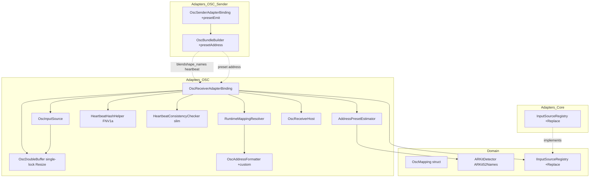
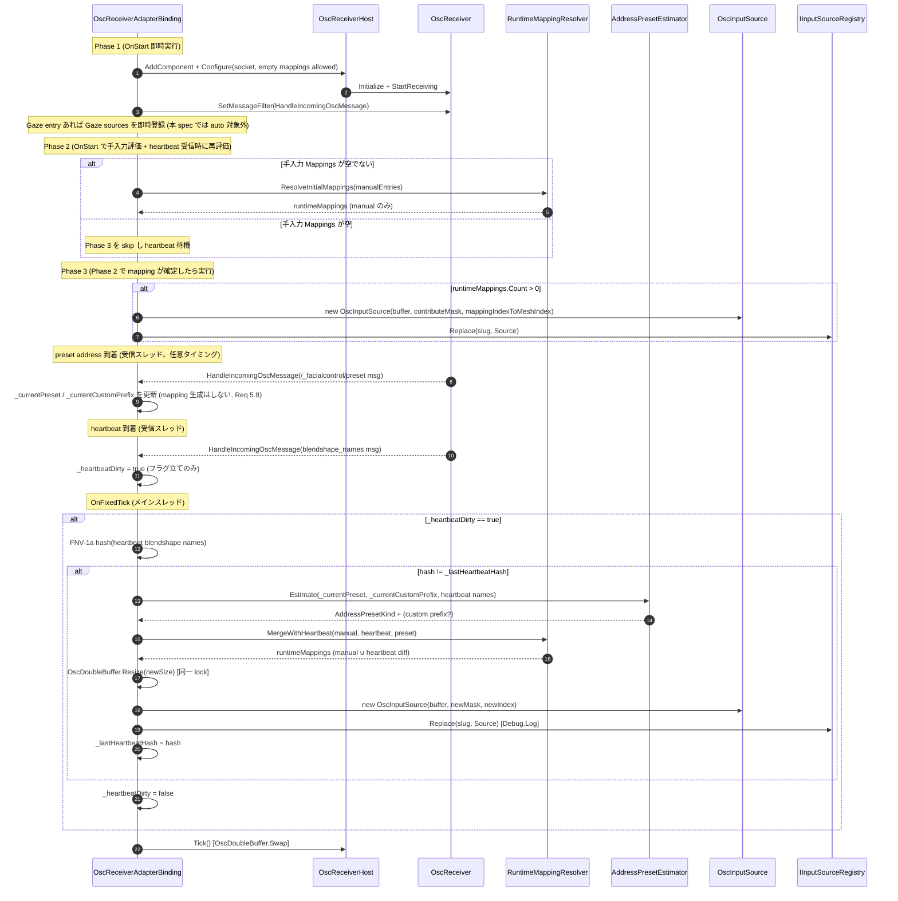
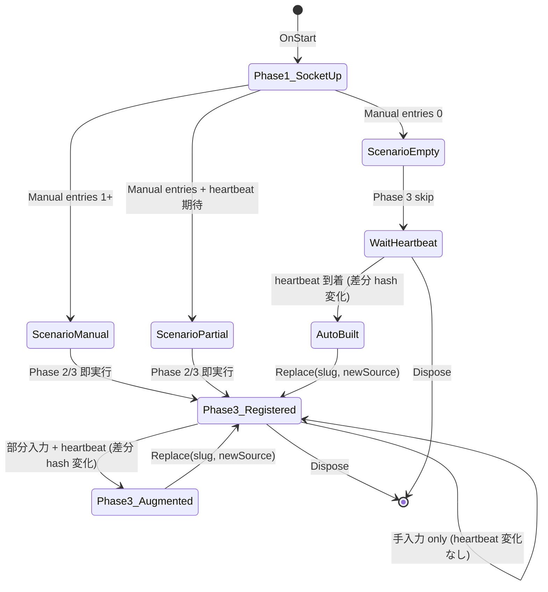

# Technical Design Document — osc-receiver-auto-mapping

## Overview

**Purpose**: 受信側 `OscReceiverAdapterBinding` の `Mappings` 列挙を、送信側 heartbeat (`/_facialcontrol/blendshape_names`) と受信側モデルの BlendShape 名一覧から自動生成する経路を追加し、200 シェイプ規模のモデルでも Inspector 手入力なしで OSC 受信を成立させる。`Mappings` が空 / 部分入力 / 完全手入力の 3 ケースを統一フローで扱う。

**Users**: Unity エンジニア（受信側統合担当、サンプル動作確認担当、パフォーマンス担当）。プレリリース利用者は `OscReceiverDemo` を空 `Mappings` のまま Import するだけで `OscOutputDemo` からの送信を受信側モデルへ反映できる。

**Impact**: `OscReceiverAdapterBinding` の `OnStart` lifecycle を Phase 1〜3 に再構成し、heartbeat 受信時に Phase 2/3 を再実行できる構造に変える。`HeartbeatConsistencyChecker` から `SkipMask` を廃止し warning 専用に縮退。送信側に preset 専用の独立 OSC address `/_facialcontrol/preset` の送出経路を追加（`/_facialcontrol/blendshape_names` は一切変更しない、後方互換）。`IInputSourceRegistry` に `Replace` API を追加。`AddressPresetKind.Custom` 値と `OscAddressFormatter` の custom prefix overload を追加。

### Goals

- **G1**: 空 `Mappings` でも heartbeat 受信後に runtime mapping が自動生成され、受信側モデルの BlendShape weight が更新される（Req 1, 7）。
- **G2**: 手入力 / 部分入力 / 完全自動の 3 ケースが同じ起動シーケンスで動作し、既存 `FacialAdapterBindingCollectionSO` アセットを無改修で起動可能（Req 2, 6）。
- **G3**: heartbeat 由来 mapping の生成・拡張が GC ゼロ目標を破らない（Req 4）。
- **G4**: 独立 OSC address `/_facialcontrol/preset` で preset 識別子を送ることで preset 推定を確定的に行う（Req 3, 5）。

### Non-Goals

- **NG1**: Gaze entry（`Gaze_VRChat_XY` / `Gaze_ARKit_8BS`）の自動生成（heartbeat / preset address に Gaze id を含まないため、follow-up spec で「Gaze auto mapping」を扱う想定）。本 spec 完了後の follow-up として `docs/backlog.md` M-25（Gaze の auto mapping 化）に登録済み。`OscReceiverDemoProfile.asset` は Gaze entry を手入力 mapping として残す（後述のハイブリッド構成）。
- **NG2**: 送信側 (`OscOutputAdapterBinding`) の自動 mapping 生成（本 spec は受信側に閉じる）。送信側改修は本 spec で「preset 専用 address `/_facialcontrol/preset` の送出経路追加」と「preset 出力 ON/OFF オプション SerializedField 追加」のみ。
- **NG3**: heartbeat 以外の経路（JSON プリセット配信等）からの mapping 投入。
- **NG4**: Inspector の「Manual / Auto」出自 badge UI（preview 段階は runtime 内部状態 + 診断ログのみ。Inspector UI 拡張は backlog）。
- **NG5**: `OscRuntimeSettingsSO` のスキーマ破壊的変更（heartbeat 由来 mapping は `[NonSerialized]` 別コレクションに保持）。
- **NG6**: UDP loopback の E2E PlayMode テスト（決定論性のため `HandleHeartbeat` 直接呼び出し方式を採用。E2E は別 spec の backlog）。

## Boundary Commitments

### This Spec Owns

- **Receiver auto mapping lifecycle**: `OscReceiverAdapterBinding.OnStart` の 3 Phase 分割、heartbeat 駆動の Phase 2/3 再実行、`OscInputSource` の Replace ベース差し替え。
- **Runtime mapping merge**: 手入力 `OscMappingEntry` (Normal_BlendShape) と heartbeat 由来 mapping のマージ・出自タグ・診断 API。
- **Address preset 推定**: `AddressPresetEstimator`（新規 helper）による preset address 由来 / 名前ベース推定、`AddressPresetKind.Custom` 値、`OscAddressFormatter` の custom prefix overload。
- **Preset 専用 address `/_facialcontrol/preset`**: address 定数の単一定義（`BlendShapeNamesAddress` と同じ箇所）、受信側 message dispatcher への preset ハンドラ追加、preset 名 + custom prefix の runtime 内部状態保持。
- **Heartbeat consistency checker のスリム化**: SkipMask 廃止、ContributeMask を binding 側で生成、mismatch warning は維持。
- **OscDoubleBuffer の動的 Resize**: `Write` と `Resize` を同一 lock（`Monitor`）で保護し、受信スレッドからの取りこぼし / 旧 buffer Dispose 競合を防止。
- **送信側 preset address 送出改修**: `OscBundleBuilder` に preset 専用 address (`/_facialcontrol/preset`) 送出経路を追加、`OscSenderAdapterBinding` で preset 名 + (custom 時) custom prefix を送出、preset 出力 ON/OFF オプション（デフォルト ON）。`/_facialcontrol/blendshape_names` の `string[]` payload は無改修。
- **IInputSourceRegistry.Replace API**: 新 API の Domain interface 追加と Adapters 実装、ログレベル `Debug.Log`。
- **Heartbeat 変化検出ハッシュ**: FNV-1a 32-bit の binding 内専用 helper。GC ゼロ。
- **サンプル更新**: `OscReceiverDemoProfile.asset` を手入力 `Normal_BlendShape` 4 件削除 + `Gaze_VRChat_XY` 1 件残しのハイブリッド構成に書き換え、README で auto mapping をデフォルト経路として説明。
- **PlayMode 統合テスト**: `OscReceiverAdapterBindingAutoMappingIntegrationTests`（仮称）を `HandleHeartbeat` 直接呼び出し方式で追加。

### Out of Boundary

- Gaze auto mapping（NG1、follow-up spec として `docs/backlog.md` M-25 に登録済み）
- 送信側の auto mapping 生成（NG2）
- JSON プリセット配信経路（NG3）
- Inspector Manual/Auto badge UI（NG4、`docs/backlog.md` M-26 へ追記済み）
- `OscRuntimeSettingsSO` の破壊的スキーマ変更（NG5）
- UDP loopback E2E テスト（NG6、別 spec の backlog 候補）
- 表情 (Expression) id 体系の改廃

### Allowed Dependencies

- **Upstream（Domain 層）**:
  - `Hidano.FacialControl.Domain.Services.ARKitDetector.ARKit52Names`（52 名、preset 推定の単一情報源）
  - `Hidano.FacialControl.Domain.Models.OscMapping`（既存 readonly struct、本 spec で改変しない）
  - `Hidano.FacialControl.Domain.Adapters.IInputSourceRegistry`（本 spec で `Replace` API を追加）
- **Sibling（Adapters 層）**:
  - `OscReceiver` / `OscReceiverHost` / `OscBundleAccumulator`（既存）
  - `OscAddressFormatter`（custom prefix overload を追加）
  - `OscBundleBuilder` / `OscSenderAdapterBinding`（送信側に preset 専用 address `/_facialcontrol/preset` の送出経路を追加）
- **External**: uOSC（既存依存、追加なし）

### Revalidation Triggers

- `IInputSourceRegistry.Replace` API のシグネチャ変更 → 他 binding spec へ通知
- preset address 仕様変更（`/_facialcontrol/preset` の payload フォーマット変更）→ `osc-output-binding` spec への通知
- `AddressPresetKind` enum 値の追加・改廃 → JSON DTO (`OscMappingEntryDto`) との互換性確認
- `OscDoubleBuffer` の lock 戦略変更（`Write` / `Resize` の同一 lock）→ 既存 `OscDoubleBufferTests` への影響確認

## Architecture

### Existing Architecture Analysis

**現在のパターン**:
- クリーンアーキテクチャ（Domain ← Application ← Adapters ← Editor）。Domain は Unity 非依存契約を維持し、`OscInputSource` / `OscReceiverAdapterBinding` は Adapters 層。
- AdapterBinding lifecycle: `OnStart` → `OnFixedTick`（毎フレーム） → `Dispose`。`OnStart` 内で `OscReceiverHost` 構築 + `OscInputSource` 構築 + `IInputSourceRegistry.Register`。
- 受信スレッド ↔ メインスレッド: `OscReceiver` が UDP 受信スレッドから `_buffer.Write(...)` を呼び、メインスレッドの `OnFixedTick` で `_buffer.Swap()` する double-buffer 構造。

**保持する境界**:
- Domain → Adapters の片方向依存（`ARKitDetector.ARKit52Names` を Adapters から参照）
- `OscMapping` (Domain) は readonly struct のまま改変しない
- `OscRuntimeSettingsSO` のシリアライズ済みフィールドは破壊的変更しない（preset 出力 ON/OFF は `OscSenderAdapterBinding` の SerializedField として追加）
- `OscMappingEntry` の 6 シリアライズフィールドを温存し、heartbeat 由来 mapping は `[NonSerialized]` 別コレクションで保持
- `GazeVector2InputSource` は `BlendShapeCount=0` / `ContributeMask=new BitArray(0)` の ValueProvider 型であり、SkipMask 廃止（ContributeMask を binding 側に移す改修）の影響を受けない。Gaze 経路はコード変更ゼロで現行のまま温存する

**統合ポイント**:
- `HandleIncomingOscMessage`（既存）の `BlendShapeNamesAddress` 分岐に auto mapping 駆動フックを追加
- `HandleIncomingOscMessage`（既存）に `/_facialcontrol/preset` (PresetAddress) 分岐を新設し、preset 名 / custom prefix を runtime 内部状態に保持（mapping 生成はトリガしない、Req 5.8）
- `OnFixedTick`（既存）に「heartbeat 差分検出時の Phase 2/3 再実行」を追加

**解消する技術的負債**:
- `HeartbeatConsistencyChecker` の SkipMask / ContributeMask 兼用責務 → mismatch warning 専用へ縮退
- `OscReceiverAdapterBinding.OnStart` の `!hasBlendShapeMappings && !hasGazeMappings` 早期 return → Phase 1 で socket だけ起動する経路へ置換

### Architecture Pattern & Boundary Map



**Architecture Integration**:
- **Selected pattern**: 既存 Clean Architecture を維持し、Adapters 内で `AddressPresetEstimator` / `RuntimeMappingResolver` / `HeartbeatHashHelper` を小粒度 helper として追加（research.md Option C）。
- **Domain/feature boundaries**: Domain は `ARKitDetector.ARKit52Names` の参照と `IInputSourceRegistry.Replace` シグネチャ追加のみ。auto mapping ロジックは Adapters に閉じる。
- **Existing patterns preserved**: OnStart/OnFixedTick/Dispose lifecycle、`OscReceiverHost` 経由の socket open、double buffer の Volatile/Interlocked パターン。`/_facialcontrol/preset` は `/_facialcontrol/blendshape_names` と同様に独立した OSC address message として dispatch される。
- **New components rationale**:
  - `AddressPresetEstimator`: preset address 由来 preset → 名前一致率 → fallback の判定戦略を単体テスト可能にするため独立関数群。
  - `RuntimeMappingResolver`: 手入力 ∪ heartbeat 差分のマージと出自タグを単体テスト可能にするため。
  - `HeartbeatHashHelper`: FNV-1a 32-bit を GC ゼロで提供。
- **Steering compliance**: 毎フレームのヒープ確保ゼロ目標を `_runtimeMappings` 配列を heartbeat 差分時にのみ再確保することで達成。`UnityEngine.Debug.Log/Warning` のみ使用。

### Technology Stack

| Layer | Choice / Version | Role in Feature | Notes |
|-------|------------------|-----------------|-------|
| Frontend / CLI | — | — | UI 改修はスコープ外（backlog） |
| Backend / Services | C# 9 (Unity 6 Roslyn) | Adapters 層の Runtime ロジック | 追加依存なし |
| Data / Storage | Unity ScriptableObject + JSON DTO | `OscReceiverDemoProfile.asset` 書き換え、`OscMappingEntry` SerializedField 温存 | スキーマ破壊変更なし |
| Messaging / Events | uOSC（既存） + preset 専用 address 追加 | preset 情報を独立 address `/_facialcontrol/preset` で送出（preset 名 string + custom 時 prefix string）。`/_facialcontrol/blendshape_names` は無改修 | chunk 境界と無関係な独立 message |
| Infrastructure / Runtime | `Unity.Collections.NativeArray<float>` | `OscDoubleBuffer` の `Write` / `Resize` 同一 lock（`Monitor`）方式 Resize | Allocator.Persistent、Resize はメインスレッド、lock は受信スレッド Write のみ |

## File Structure Plan

### Directory Structure

```
FacialControl/Packages/com.hidano.facialcontrol/
└── Runtime/Domain/Adapters/
    └── IInputSourceRegistry.cs                   # 改修: Replace API 追加

FacialControl/Packages/com.hidano.facialcontrol/
└── Runtime/Adapters/InputSources/
    └── InputSourceRegistry.cs                    # 改修: Replace API 実装

FacialControl/Packages/com.hidano.facialcontrol.osc/
├── Runtime/Adapters/AdapterBindings/
│   ├── OscReceiverAdapterBinding.cs              # 改修: OnStart 3 Phase 分割 + heartbeat 駆動再構築
│   └── OscSenderAdapterBinding.cs                # 改修: preset 出力 ON/OFF SerializedField 追加
└── Runtime/Adapters/OSC/
    ├── AddressPresetKind.cs                      # 改修: Custom 値追加
    ├── OscAddressFormatter.cs                    # 改修: custom prefix overload 追加
    ├── HeartbeatConsistencyChecker.cs            # 改修: SkipMask 廃止、warning 専用化
    ├── OscDoubleBuffer.cs                        # 改修: Write/Resize 同一 lock 方式 Resize
    ├── OscBundleBuilder.cs                       # 改修: preset 専用 address /_facialcontrol/preset 送出経路追加
    ├── AddressPresetEstimator.cs                 # 新規: preset address 由来/名前ベース推定 helper
    ├── RuntimeMappingResolver.cs                 # 新規: 手入力 ∪ heartbeat 差分のマージ helper
    └── HeartbeatHashHelper.cs                    # 新規: FNV-1a 32-bit GC ゼロ計算 helper

FacialControl/Packages/com.hidano.facialcontrol.osc/
├── Samples~/OscReceiverDemo/
│   ├── OscReceiverDemoProfile.asset              # 改修: Normal_BlendShape 4 件削除、Gaze_VRChat_XY 1 件残し (ハイブリッド構成)
│   └── README.md                                 # 改修: auto mapping をデフォルト経路として説明、Gaze 手入力残しの理由を説明
└── Samples~/OscOutputDemo/
    └── README.md                                 # 改修: /_facialcontrol/preset address payload 説明

FacialControl/Packages/com.hidano.facialcontrol.osc/
└── Tests/
    ├── EditMode/Adapters/OSC/
    │   ├── AddressPresetEstimatorTests.cs        # 新規
    │   ├── RuntimeMappingResolverTests.cs        # 新規
    │   ├── HeartbeatHashHelperTests.cs           # 新規
    │   ├── HeartbeatConsistencyCheckerTests.cs   # 改修: SkipMask 検証部削除
    │   ├── OscDoubleBufferTests.cs               # 改修: Resize と Write の並行 1000 回で native crash しないケース追加
    │   └── OscAddressFormatterTests.cs           # 改修: custom prefix overload テスト追加
    ├── EditMode/Adapters/InputSources/
    │   └── OscInputSourceMaskTests.cs            # 改修: SkipMask 引数経路削除
    ├── EditMode/Adapters/AdapterBindings/
    │   └── OscReceiverAdapterBindingTests.cs     # 改修: SkipMask assertion → ContributeMask assertion
    └── PlayMode/Integration/
        ├── OscHeartbeatConsistencyTests.cs       # 改修: SkipMask 検証部 → ContributeMask 検証
        ├── OscReceiverAdapterBindingIntegrationTests.cs  # 退行禁止: Gaze 検証部 + 手入力起動シーケンスを緑維持
        └── OscReceiverAdapterBindingAutoMappingIntegrationTests.cs  # 新規

FacialControl/Packages/com.hidano.facialcontrol/
└── Tests/EditMode/Adapters/InputSources/
    └── InputSourceRegistryTests.cs               # 改修: Replace API テスト追加

docs/
└── backlog.md                                    # 改修済み: M-25 (Gaze auto mapping follow-up) / M-26 (Inspector Manual/Auto badge UI)
```

### Modified Files

- `Runtime/Domain/Adapters/IInputSourceRegistry.cs` — `Replace(AdapterSlug, IInputSource)` および `Replace(AdapterSlug, string, IInputSource)` 追加。
- `Runtime/Adapters/InputSources/InputSourceRegistry.cs` — `Replace` 実装、挿入順保持、`Debug.Log` でログ出力。
- `Runtime/Adapters/AdapterBindings/OscReceiverAdapterBinding.cs` — OnStart 3 Phase 分割、heartbeat 駆動 mapping 再構築、`/_facialcontrol/preset` (PresetAddress) ハンドラ追加、preset 名 / custom prefix の runtime 状態保持、`RuntimeMappingResolver` 委譲、出自タグ保持、診断 API (`GetMappingOrigin`)。`PresetAddress` 定数は `BlendShapeNamesAddress` と同じ箇所で単一定義。`OscInputSource` constructor から `skipMask` 引数を削除する。
- `Runtime/Adapters/AdapterBindings/OscSenderAdapterBinding.cs` — `[SerializeField] private bool _emitPresetInHeartbeat = true;` 追加、現在の `AddressPresetKind`（Custom 時は custom prefix）を `/_facialcontrol/preset` address で送出する経路を追加。
- `Runtime/Adapters/OSC/AddressPresetKind.cs` — `Custom` 値追加。
- `Runtime/Adapters/OSC/OscAddressFormatter.cs` — `FormatBlendShapeAddress(string, string)` / `FormatBlendShapeAddressUtf8(string, string)` / `GetOrAddBlendShapeAddressUtf8(pool, string, string)` overload 追加。Pool key を `(name, customPrefix)` 形式に拡張。
- `Runtime/Adapters/OSC/HeartbeatConsistencyChecker.cs` — `SkipMask` / `ContributeMask` / `_mappedMeshBlendShapeMask` 削除。sender/receiver 名前差分の `UpdateFromHeartbeat` + `_loggedMismatchHashes` ベースの warning のみ残す。
- `Runtime/Adapters/OSC/OscDoubleBuffer.cs` — `Write(int, float)` と `Resize(int newSize)` を同一 lock オブジェクト（`Monitor`）で保護。Resize 中の受信スレッド Write が旧 buffer の Dispose と競合しないことを保証。
- `Runtime/Adapters/OSC/OscBundleBuilder.cs` — preset 専用 address `/_facialcontrol/preset` の送出経路を追加（preset 名 string + custom 時 prefix string）。`/_facialcontrol/blendshape_names` の送出ロジックは無改修。
- `Samples~/OscReceiverDemo/OscReceiverDemoProfile.asset` — `_mappings` から手入力 `Normal_BlendShape` 4 件を削除し、`Gaze_VRChat_XY` 1 件のみ残すハイブリッド構成（BlendShape=auto / Gaze=手入力）。
- `Samples~/OscReceiverDemo/README.md` — 「Normal_BlendShape は auto mapping がデフォルト経路、Gaze は heartbeat に id を含まないため手入力 mapping を残す」を 1 段落以上で説明。
- `Samples~/OscOutputDemo/README.md` — `/_facialcontrol/preset` address での preset 指定 / custom prefix 指定方法の説明節を追加。
- `docs/backlog.md` — M-25（Gaze auto mapping follow-up spec）/ M-26（Inspector Manual/Auto badge UI）追記済み。

## System Flows

### OnStart 3 Phase 分割と heartbeat 駆動再実行



**Key Decisions (diagram に表現されない補足)**:
- 受信スレッドからの hot path は `_heartbeatDirty = true;` フラグ立てのみ。FNV-1a 計算と mapping 再構築はメインスレッド `OnFixedTick` で実行する（Req 4.3）。
- preset address `/_facialcontrol/preset` の受信は preset 名 / custom prefix を runtime 内部状態に保持するだけで mapping 再構築をトリガしない。BlendShape 名 heartbeat 受信時の再構築タイミングで最新 preset 状態を参照する（Req 5.8、preset 受信が BlendShape 名 heartbeat より前後どちらでも正しく動作する）。
- preset 情報は BlendShape 名 heartbeat とは独立した OSC message のため、BlendShape 名 heartbeat の chunk 分割境界と完全に無関係。
- `OscInputSource` 差し替えは `Replace` 経由（`Register` 重複時 LogError を回避）。
- Phase 2/3 はメソッド `ResolveAndPublishRuntimeMappings()` として抽出し OnStart と OnFixedTick の両方から呼び出す。

### 3 シナリオの状態遷移



**シナリオ別補足**:
- **手入力 only (ScenarioManual)**: OnStart で Phase 2/3 即実行。heartbeat が到着しても hash 変化がなければ何もしない（Req 6.1）。
- **空 only (ScenarioEmpty)**: OnStart で Phase 1 のみ実行。`OscInputSource` 未登録。heartbeat 到着まで Aggregator に値を出力しない（Req 1.4）。
- **部分入力 + heartbeat (ScenarioPartial)**: OnStart で手入力分の Phase 2/3 を実行（即時 register）。heartbeat 到着後に差分 mapping を追加し `Replace` で差し替え（Req 2.2）。手入力 entry の `addressPattern` は heartbeat 由来推定で上書きされない（Req 2.3）。

### OscDoubleBuffer Resize (同一 lock 方式) 擬似コード

```text
class OscDoubleBuffer:
    _bufferA, _bufferB : NativeArray<float>
    _writeIndex : int                        // 0 or 1
    _size : int
    _resizeLock : object                     // Write / Resize を保護する単一 lock

    // ----- 受信スレッド (Write) -----
    Write(index, value):
        lock (_resizeLock):                  // Monitor ベース: managed heap 確保ゼロ
            if index >= _size: return        // Resize 中に旧 index で来ても範囲外は破棄
            writeBuffer = GetWriteBuffer()    // _writeIndex に従い _bufferA / _bufferB を選択
            writeBuffer[index] = value
            Interlocked.Increment(ref _writeTick)

    // ----- メインスレッド (OnFixedTick 経由) -----
    Resize(newSize):
        if newSize == _size: return
        lock (_resizeLock):                  // Write と同一 lock で旧 buffer Dispose との競合を防止
            if newSize == _size: return      // double-checked
            newA = new NativeArray<float>(newSize, Persistent, ClearMemory)
            newB = new NativeArray<float>(newSize, Persistent, ClearMemory)
            copyLen = min(_size, newSize)
            CopyRange(_bufferA, newA, copyLen) // 旧 writeBuffer 側の値を新 buffer に維持
            _bufferA.Dispose(); _bufferB.Dispose()
            _bufferA = newA; _bufferB = newB; _size = newSize; _writeIndex = 0

    // ----- メインスレッド専用 -----
    GetReadBuffer():                         // Resize と同一スレッド (OnFixedTick) なので競合なし
        return _writeIndex == 0 ? _bufferB : _bufferA
```

**Key Decisions**:
- `Write`（受信スレッド）と `Resize`（メインスレッド）を同一 lock オブジェクト `_resizeLock` で保護し、Resize 中の旧 buffer Dispose と受信スレッド書き込みの競合（native crash）を排除する。
- lock は `Monitor` ベースのため managed heap 確保ゼロ。Req 4.4 の「`TryWriteValues` 1 回あたり 0 byte」と整合する。lock が入るのは `Write`（受信スレッド側）であり、`TryWriteValues`（メインスレッド読み取り側）ではない点に注意。
- `GetReadBuffer` はメインスレッド専用、`Resize` も `OnFixedTick` でメインスレッド実行のため両者は同一スレッドで競合しない。lock が必要なのは `Write`（受信スレッド） vs `Resize`（メインスレッド）の競合のみ。
- Resize は heartbeat 内容変化時（FNV-1a hash 差分）のみ発火するため、lock 競合による latency スパイクは実用上無視できる。
- 検証: `OscDoubleBufferTests` に「Resize と Write を別スレッドから並行 1000 回実行しても native crash しない」テストを追加する。

## Requirements Traceability

| Requirement | Summary | Components | Interfaces | Flows |
|-------------|---------|------------|------------|-------|
| 1.1 | 空 Mappings で OSC 受信を起動し OscInputSource 登録を heartbeat 到着まで延期 | OscReceiverAdapterBinding (Phase 1) | OnStart, IInputSourceRegistry.Replace | OnStart 3 Phase 分割 |
| 1.2 | heartbeat 受信時に積集合で runtime mapping 生成 + Source 登録 | OscReceiverAdapterBinding, RuntimeMappingResolver | HandleIncomingOscMessage, ResolveAndPublishRuntimeMappings | OnStart 3 Phase 分割 |
| 1.3 | addressPattern を推定 preset で組み立て、expressionId を BlendShape 名に一致 | AddressPresetEstimator, OscAddressFormatter | Estimate, FormatBlendShapeAddress | OnStart 3 Phase 分割 |
| 1.4 | heartbeat 未受信中は OscInputSource 未登録 | OscReceiverAdapterBinding (Phase 1) | OnStart | 3 シナリオの状態遷移 |
| 1.5 | 名前一致ゼロのとき LogWarning 1 度のみ | RuntimeMappingResolver | MergeWithHeartbeat, _loggedEmptyIntersectionHashes | — |
| 1.6 | runtime mapping を再評価可能な構造で保持 | OscReceiverAdapterBinding (`_runtimeMappings`, `_lastHeartbeatHash`) | ResolveAndPublishRuntimeMappings | OnStart 3 Phase 分割 |
| 2.1 | 手入力 entry を runtime mapping として優先採用し即時登録 | RuntimeMappingResolver | ResolveInitialMappings | 3 シナリオ (ScenarioManual) |
| 2.2 | heartbeat 由来で手入力カバー外を追加 | RuntimeMappingResolver | MergeWithHeartbeat | 3 シナリオ (ScenarioPartial) |
| 2.3 | 同一 expressionId は手入力の addressPattern を優先 | RuntimeMappingResolver | MergeWithHeartbeat | 3 シナリオ (ScenarioPartial) |
| 2.4 | Gaze のみ + 空 Normal_BlendShape は Gaze 結線維持 + auto BlendShape 生成 | OscReceiverAdapterBinding (Phase 1 Gaze 登録), RuntimeMappingResolver | OnStart, ResolveAndPublishRuntimeMappings | OnStart 3 Phase 分割 |
| 2.5 | 出自を runtime API + 診断ログで識別 | OscReceiverAdapterBinding (`MappingOrigin[]`), GetMappingOrigin | GetMappingOrigin | — |
| 2.6 | OscMappingEntry の SerializeField を破壊しない、heartbeat 由来は [NonSerialized] 別コレクション | OscReceiverAdapterBinding (`_runtimeMappings`, `_mappingOrigins`) | — | — |
| 3.1 | 3 種 preset を識別、AddressPresetKind.Custom 追加 | AddressPresetKind, AddressPresetEstimator | — | — |
| 3.2 | preset address 受信時はそれを採用、未受信時は ARKit52 一致率 ≥ 50% で ARKit、未満で VRChat | AddressPresetEstimator | Estimate(preset, customPrefix, names) | — |
| 3.3 | VRChat は `/avatar/parameters/{name}` | OscAddressFormatter | FormatBlendShapeAddress(VRChat, name) | — |
| 3.4 | ARKit 標準名は `/ARKit/{name}`、非標準は VRChat fallback | RuntimeMappingResolver, OscAddressFormatter | FormatBlendShapeAddress(ARKit/VRChat, name) | — |
| 3.5 | Custom は preset address 由来 prefix を overload で組み立て、prefix 欠落時 VRChat fallback + warning 1 回 | OscAddressFormatter (custom overload), AddressPresetEstimator | FormatBlendShapeAddress(string, string) | — |
| 3.6 | 同名複数候補は preset address 由来を最優先、無ければ VRChat、衝突は warning 1 回 | RuntimeMappingResolver | MergeWithHeartbeat | — |
| 3.7 | ARKit 標準名は ARKitDetector.ARKit52Names を単一情報源 | AddressPresetEstimator | Estimate, ARKitDetector.ARKit52Names | — |
| 4.1 | heartbeat 変化検出は FNV-1a (GC ゼロ) | HeartbeatHashHelper | ComputeFnv1a(names) | — |
| 4.2 | hash 一致時は新規確保せず既存再利用 | OscReceiverAdapterBinding | ResolveAndPublishRuntimeMappings | OnStart 3 Phase 分割 |
| 4.3 | 再構築はメインスレッド、受信スレッドはフラグ立てのみ | OscReceiverAdapterBinding (`_heartbeatDirty`) | HandleIncomingOscMessage, OnFixedTick | OnStart 3 Phase 分割 |
| 4.4 | OscInputSource.TryWriteValues は 0 byte 維持 | OscInputSource (既存) | TryWriteValues | — |
| 4.5 | Write と Resize を同一 lock で保護、旧 buffer Dispose 競合を防止 (Monitor で GC ゼロ) | OscDoubleBuffer | Resize(int), Write(int, float) | OscDoubleBuffer Resize 擬似コード |
| 4.6 | ContributeMask を binding 側で生成、SkipMask 廃止 | OscReceiverAdapterBinding, HeartbeatConsistencyChecker (slim) | ResolveAndPublishRuntimeMappings, UpdateFromHeartbeat | — |
| 4.7 | IInputSourceRegistry.Replace API 追加、Debug.Log 出力 | IInputSourceRegistry, InputSourceRegistry | Replace(AdapterSlug, IInputSource) | OnStart 3 Phase 分割 |
| 5.1 | 送信側は `/_facialcontrol/preset` address に preset 名 + (custom 時) prefix を送出、blendshape_names は無改修 | OscBundleBuilder, OscSenderAdapterBinding | AddPresetMessage(preset, customPrefix) | — |
| 5.2 | 旧 receiver は未知 address `/_facialcontrol/preset` を dispatch せず単純無視 (警告なし) | OscReceiverAdapterBinding (旧) | — | — |
| 5.3 | 新 receiver は preset address ハンドラで preset 名 / custom prefix を runtime 状態に保持 | OscReceiverAdapterBinding (PresetAddress ハンドラ), AddressPresetEstimator | HandleIncomingOscMessage, Estimate | OnStart 3 Phase 分割 |
| 5.4 | preset 識別子は vrchat / arkit / custom の 3 値、custom は prefix 1 要素続く | AddressPresetEstimator | Estimate | — |
| 5.5 | 未知 preset は warning 1 回 + 名前ベース推定にフォールバック | AddressPresetEstimator | Estimate, _loggedUnknownPresets | — |
| 5.6 | preset 結果は runtime 内部状態、SO は破壊変更なし、PresetAddress は単一定数定義 | OscReceiverAdapterBinding (`_currentPreset`, `_currentCustomPrefix`, `PresetAddress` const) | — | — |
| 5.7 | preset 出力は Inspector / JSON で ON/OFF (デフォルト ON) | OscSenderAdapterBinding (`_emitPresetInHeartbeat` SerializedField) | — | — |
| 5.8 | preset 受信と mapping 生成を疎結合に保つ (preset 受信のみで mapping は生成せず、heartbeat 受信時に最新 preset を参照、前後どちらの順序でも動作) | OscReceiverAdapterBinding (`_currentPreset`, `_heartbeatDirty`) | HandleIncomingOscMessage, OnFixedTick | OnStart 3 Phase 分割 |
| 6.1 | 既存手入力構成は現行同一の起動順序・mask 構成で動作 | OscReceiverAdapterBinding | OnStart, ResolveAndPublishRuntimeMappings | 3 シナリオ (ScenarioManual) |
| 6.2 | Gaze 結線・GazeVector2InputSource 登録・bundle accumulator 経路を改変しない。GazeVector2InputSource は BlendShapeCount=0 / ContributeMask=BitArray(0) のため SkipMask 廃止の影響を受けない | OscReceiverAdapterBinding (Gaze 経路は touch しない) | RegisterGazeSources | — |
| 6.3 | SenderIdentity / ZombieEvictionPolicy / OscBundleAccumulator / FailSafeMode を退行させない | OscReceiverAdapterBinding (既存初期化を Phase 1 で維持) | OnStart | — |
| 6.4 | HeartbeatConsistencyChecker の mismatch 検出と 1 度ログは継続提供 | HeartbeatConsistencyChecker (slim) | UpdateFromHeartbeat, _loggedMismatchHashes | — |
| 6.5 | ReceiverEnabled=false 時は heartbeat 受信も auto mapping 生成もしない | OscReceiverAdapterBinding (既存早期 return) | OnStart | — |
| 6.6 | Dispose で heartbeat 由来 runtime mapping / 拡張済み mask / 再確保 buffer を解放 | OscReceiverAdapterBinding | Dispose | — |
| 7.1 | 空 Mappings で VRChat 形式送信を受信側 BlendShape に反映 | OscReceiverAdapterBindingAutoMappingIntegrationTests (新規) | — | OnStart 3 Phase 分割 |
| 7.2 | 空 Mappings で ARKit 形式送信を受信側 BlendShape に反映 | OscReceiverAdapterBindingAutoMappingIntegrationTests (新規) | — | OnStart 3 Phase 分割 |
| 7.3 | LogError なし、heartbeat 未受信中は BlendShape weight 初期値維持 | OscReceiverAdapterBindingAutoMappingIntegrationTests (新規) | — | — |
| 7.4 | heartbeat ゼロ送信なら BlendShape weight 不変、OscInputSource 未登録 | OscReceiverAdapterBindingAutoMappingIntegrationTests (新規) | — | — |
| 7.5 | PlayMode 統合テストを HandleHeartbeat 直接呼び出し方式で提供 | OscReceiverAdapterBindingAutoMappingIntegrationTests (新規) | — | — |
| 7.6 | OscReceiverDemoProfile.asset を Normal_BlendShape 4 件削除 + Gaze_VRChat_XY 1 件残しのハイブリッド構成に書き換え、README で説明 | OscReceiverDemoProfile.asset, README.md | — | — |
| 7.7 | サンプル README に auto mapping 動作条件 + `/_facialcontrol/preset` 指定 + custom prefix + Gaze は別 spec で auto 化予定の説明節を追加 | OscReceiverDemo/README.md, OscOutputDemo/README.md | — | — |
| 7.8 | Gaze auto mapping 化を follow-up spec として `docs/backlog.md` M-25 に登録、本 spec では Gaze を手入力 mapping 維持 | docs/backlog.md (M-25), OscReceiverDemoProfile.asset | — | — |

## Components and Interfaces

| Component | Domain/Layer | Intent | Req Coverage | Key Dependencies (P0/P1) | Contracts |
|-----------|--------------|--------|--------------|--------------------------|-----------|
| OscReceiverAdapterBinding | Adapters/OSC | OnStart 3 Phase 分割 + heartbeat 駆動再構築 + 出自タグ保持 | 1.*, 2.*, 6.* | OscReceiverHost (P0), OscInputSource (P0), IInputSourceRegistry (P0), RuntimeMappingResolver (P0), AddressPresetEstimator (P0), HeartbeatHashHelper (P0), OscDoubleBuffer (P0), HeartbeatConsistencyChecker (P1) | Service, State |
| RuntimeMappingResolver | Adapters/OSC | 手入力 ∪ heartbeat 差分のマージと出自タグを GC 最小で計算 | 1.2, 1.5, 2.1, 2.2, 2.3, 2.4, 3.4, 3.6 | OscAddressFormatter (P0), ARKitDetector (P1) | Service |
| AddressPresetEstimator | Adapters/OSC | preset address 由来 / 名前ベースで preset 種別と custom prefix を確定 | 3.1, 3.2, 3.7, 5.3, 5.4, 5.5 | ARKitDetector (P0) | Service |
| HeartbeatHashHelper | Adapters/OSC | heartbeat 名配列の FNV-1a 32-bit 計算 (GC ゼロ) | 4.1 | — | Service |
| OscDoubleBuffer | Adapters/OSC | Write / Resize 同一 lock (Monitor) で旧 buffer Dispose 競合を防止 | 4.5 | Unity.Collections.NativeArray (P0) | State |
| HeartbeatConsistencyChecker (slim) | Adapters/OSC | sender/receiver 名前差分の mismatch warning 専用に縮退 | 6.4 | — | Service |
| OscAddressFormatter | Adapters/OSC | VRChat / ARKit / Custom prefix の組み立て (custom overload 追加) | 3.3, 3.4, 3.5 | — | Service |
| AddressPresetKind | Adapters/OSC | Custom 値追加 | 3.1 | — | State |
| OscBundleBuilder | Adapters/OSC | preset 専用 address `/_facialcontrol/preset` の送出経路追加 (preset 名 + custom prefix) | 5.1 | — | Batch |
| OscSenderAdapterBinding | Adapters/OSC | preset address 送出 + 出力 ON/OFF SerializedField 追加 (デフォルト ON) | 5.1, 5.7 | OscBundleBuilder (P0) | State |
| IInputSourceRegistry | Domain/Adapters | Replace API シグネチャ追加 | 4.7 | — | Service |
| InputSourceRegistry | Adapters/InputSources | Replace API 実装 (挿入順保持、Debug.Log 出力) | 4.7 | — | Service |
| OscReceiverDemoProfile (asset) | Samples~ | Normal_BlendShape 削除 + Gaze 残しのハイブリッド構成に書き換え | 7.6, 7.8 | — | State |

### Adapters / OSC

#### OscReceiverAdapterBinding

| Field | Detail |
|-------|--------|
| Intent | OnStart 3 Phase 分割と heartbeat 駆動の runtime mapping 再構築、および `/_facialcontrol/preset` 受信を司る binding |
| Requirements | 1.1, 1.2, 1.4, 1.6, 2.4, 2.5, 2.6, 4.2, 4.3, 4.6, 5.3, 5.6, 5.8, 6.1, 6.3, 6.5, 6.6 |

**Responsibilities & Constraints**
- 主責務: OSC socket + filter 起動 (Phase 1) → mapping 確定 (Phase 2) → OscInputSource Replace (Phase 3) の lifecycle 管理。`/_facialcontrol/preset` 受信時の preset 名 / custom prefix の runtime 状態保持。
- ドメイン境界: Adapters/OSC に閉じ、Domain は `OscMapping` (struct) と `ARKitDetector.ARKit52Names` のみ参照。
- 不変条件: `OscInputSource` は同一 slug で常に 1 インスタンスのみ登録される (`Replace` API 使用)。heartbeat 駆動の再構築はメインスレッドで実行する。`BlendShapeNamesAddress` と `PresetAddress` は同じ箇所で単一定義された address 定数。
- preset 疎結合: preset address 受信は preset 状態の更新のみ行い mapping 再構築をトリガしない。BlendShape 名 heartbeat 受信時に最新 preset 状態を参照する（Req 5.8、preset と heartbeat の到着順序に依存しない）。

**Dependencies**
- Inbound: `FacialAdapterBindingCollectionSO` (P0) — Inspector / Asset で本 binding を保持
- Outbound: `OscReceiverHost` (P0) — socket open / Tick、`OscInputSource` (P0) — Aggregator への値供給、`IInputSourceRegistry` (P0) — Replace 経由で差し替え、`RuntimeMappingResolver` (P0) — mapping マージ、`AddressPresetEstimator` (P0) — preset 推定、`HeartbeatHashHelper` (P0) — 変化検出、`HeartbeatConsistencyChecker` (P1) — mismatch warning
- External: uOSC (P0) — UDP 受信

**Contracts**: Service [x] / State [x]

##### Service Interface
```csharp
namespace Hidano.FacialControl.Adapters.AdapterBindings
{
    public sealed class OscReceiverAdapterBinding : AdapterBindingBase
    {
        public enum MappingOrigin
        {
            Manual,
            HeartbeatAuto
        }

        public override void OnStart(in AdapterBuildContext ctx);
        public override void OnFixedTick(float fixedDeltaTime);
        public override void Dispose();

        // 診断 API
        public IReadOnlyList<OscMapping> RuntimeMappings { get; }
        public MappingOrigin GetMappingOrigin(int runtimeMappingIndex);
        public AddressPresetKind? CurrentPreset { get; }
        public string CurrentCustomPrefix { get; }
        public uint LastHeartbeatHash { get; }

        // 既存 API は維持
    }
}
```
- Preconditions: `OnStart` 呼び出し時 `ctx.HostGameObject != null`、`ctx.BlendShapeNames` が受信側 mesh の BlendShape 一覧を提供する。
- Postconditions: Phase 1 完了で OSC socket がオープン、Phase 2/3 完了で `IInputSourceRegistry` に slug 登録 (1 件以上の mapping 時)。
- Invariants: 同一 slug の `OscInputSource` は常に 1 インスタンスのみ。heartbeat 差分検出後の再構築はメインスレッドで実行。

##### State Management
- 状態: `_runtimeMappings: OscMapping[]`, `_mappingOrigins: MappingOrigin[]`, `_lastHeartbeatHash: uint`, `_heartbeatDirty: int` (Volatile/Interlocked), `_currentPreset: AddressPresetKind?`, `_currentCustomPrefix: string`
- 永続化: heartbeat 由来 mapping は全て `[NonSerialized]`。SerializedField `_mappings` は手入力 entry のみ保持し既存契約と互換。
- 並行性: 受信スレッドからは BlendShape 名 heartbeat 受信時に `_heartbeatDirty = 1` の Volatile.Write、preset address 受信時に `_currentPreset` / `_currentCustomPrefix` の更新を行う。これらは reference / value の単純代入で torn read を起こさず、メインスレッドは `_heartbeatDirty` 検出後の再構築タイミングで最新値を読む。mapping 再構築自体はメインスレッドで lock 不要。

**Implementation Notes**
- Integration: 既存の Gaze 経路 (`RegisterGazeSources` 等) は Phase 1 内で従来通り実行。SenderIdentity / ZombieEvictionPolicy / OscBundleAccumulator も Phase 1 で初期化する。
- Validation: `ctx.BlendShapeNames` が空の場合は `Debug.LogWarning` で警告し Phase 1 のみ起動。heartbeat と mesh の積集合が空のときは `RuntimeMappingResolver` 経由で warning 1 度のみ。
- Risks: heartbeat 差分検出ハッシュの衝突確率は 2^-32 と十分低いが、衝突した場合は次の heartbeat で復旧する想定。Replace 経由の差し替えで Aggregator 側の参照が瞬間的に旧 source を見続ける可能性があるが、Aggregator は次フレームで Registry を再 resolve するため問題ない。

#### RuntimeMappingResolver

| Field | Detail |
|-------|--------|
| Intent | 手入力 entry と heartbeat 由来 BlendShape 名のマージを GC 最小で実行し、出自タグを付与した OscMapping[] を生成 |
| Requirements | 1.2, 1.5, 2.1, 2.2, 2.3, 2.4, 3.4, 3.6 |

**Responsibilities & Constraints**
- 主責務: 手入力 `OscMappingEntry` (mode=Normal_BlendShape) を `OscMapping` に変換 → heartbeat 由来差分を append → 出自タグ配列を返す。
- 不変条件: 同一 expressionId に対して手入力 entry の addressPattern が常に優先される。
- GC: 入力 List / 配列を再利用可能な構造（builder pattern）で受け取り、結果配列は heartbeat 差分時のみ新規確保。

**Dependencies**
- Inbound: `OscReceiverAdapterBinding` (P0)
- Outbound: `OscAddressFormatter` (P0) — preset に応じた address 組み立て、`ARKitDetector` (P1) — ARKit fallback 判定

**Contracts**: Service [x]

##### Service Interface
```csharp
namespace Hidano.FacialControl.Adapters.OSC
{
    public static class RuntimeMappingResolver
    {
        public readonly struct ResolveResult
        {
            public OscMapping[] RuntimeMappings { get; }
            public OscReceiverAdapterBinding.MappingOrigin[] Origins { get; }
            public int ManualCount { get; }
            public int HeartbeatAutoCount { get; }
        }

        // 手入力のみで構築 (OnStart Phase 2)
        public static ResolveResult ResolveInitialMappings(
            IReadOnlyList<OscMappingEntry> manualEntries);

        // 手入力 ∪ heartbeat 差分のマージ (heartbeat 駆動 Phase 2)
        public static ResolveResult MergeWithHeartbeat(
            IReadOnlyList<OscMappingEntry> manualEntries,
            IReadOnlyList<string> heartbeatBlendShapeNames,
            IReadOnlyList<string> meshBlendShapeNames,
            AddressPresetKind preset,
            string customPrefix,                            // preset == Custom のときのみ有効
            ref bool warnedOnEmptyIntersection,             // Req 1.5 / 3.6 の warning 1 回制御
            ref bool warnedOnAddressCollision);
    }
}
```
- Preconditions: `manualEntries` は null 可、`heartbeatBlendShapeNames` も null 可（heartbeat 未受信時）。`meshBlendShapeNames` は必須。
- Postconditions: `ResolveResult.RuntimeMappings` の最初に手入力分 (`ManualCount` 件)、続いて heartbeat 差分 (`HeartbeatAutoCount` 件) が並ぶ。`Origins[i]` は同じ順序で `Manual` / `HeartbeatAuto`。
- Invariants: 同一 expressionId は手入力優先で唯一のエントリ。空 intersection の場合は `RuntimeMappings.Length == 手入力 count`。

**Implementation Notes**
- Integration: 内部で `HashSet<string>` を使うが、binding 側が `[NonSerialized]` の再利用可能 set を渡せる overload を検討（preview 段階は static method で十分）。
- Validation: `manualEntries[i].mode != Normal_BlendShape` のときは無視（Gaze entry は別経路）。空文字列の `expressionId` / `addressPattern` も無視。
- Risks: heartbeat 由来差分の優先付けが期待と異なる場合は `MappingOrigin` 配列で診断ログ追跡可能。

#### AddressPresetEstimator

| Field | Detail |
|-------|--------|
| Intent | preset address 由来 preset と名前一致率から preset 種別と custom prefix を確定 |
| Requirements | 3.1, 3.2, 3.7, 5.3, 5.4, 5.5 |

**Responsibilities & Constraints**
- 主責務: `/_facialcontrol/preset` address で受信し runtime 状態に保持された preset 名 / custom prefix を解釈 → 未受信なら BlendShape 名の ARKit52 名一致率 ≥ 50% で ARKit、未満で VRChat。
- 不変条件: preset address を受信済みの場合は名前ベース推定をスキップ。未知 preset は warning 1 回 + 名前ベースへフォールバック。custom prefix 欠落時は warning 1 回 + VRChat fallback。
- preset 情報は BlendShape 名 heartbeat とは独立の OSC message として届くため、本 helper は heartbeat payload を走査して sentinel を抽出する処理を一切持たない（chunk 分割境界と無関係）。

**Dependencies**
- Inbound: `OscReceiverAdapterBinding` (P0)
- Outbound: `ARKitDetector.ARKit52Names` (P0)

**Contracts**: Service [x]

##### Service Interface
```csharp
namespace Hidano.FacialControl.Adapters.OSC
{
    public static class AddressPresetEstimator
    {
        public const string PresetVrChat = "vrchat";
        public const string PresetArKit = "arkit";
        public const string PresetCustom = "custom";

        public readonly struct EstimationResult
        {
            public AddressPresetKind Preset { get; }
            public string CustomPrefix { get; }   // preset == Custom のときのみ非 null
        }

        // preset address で受信した preset 名 / custom prefix と、heartbeat の BlendShape 名から推定。
        // presetName が null (preset address 未受信) のときは blendShapeNames の ARKit52 一致率で推定。
        public static EstimationResult Estimate(
            string presetName,                              // /_facialcontrol/preset 由来、未受信なら null
            string presetCustomPrefix,                      // preset == custom のとき続く string、無ければ null
            IReadOnlyList<string> blendShapeNames,          // 名前ベースフォールバック用
            ref bool warnedOnUnknownPreset,
            ref bool warnedOnMissingCustomPrefix);
    }
}
```
- Preconditions: `presetName` は null 可（preset address 未受信時 = 名前ベース推定にフォールバック）。`blendShapeNames` は名前ベース推定のために必要。
- Postconditions: `presetName` が `vrchat` / `arkit` / `custom` のいずれかなら確定。`custom` かつ `presetCustomPrefix` 有効なら `CustomPrefix` に設定。
- Invariants: `presetName == null` または未知文字列のときは名前ベース推定結果を返す。`presetName` 由来の確定は BlendShape 名走査より優先（Req 3.2(a)）。

**Implementation Notes**
- Integration: 名前一致率計算は `ARKitDetector.ARKit52Names` を `HashSet` 化し `blendShapeNames` を 1 走査して count するだけで GC ゼロ可能（HashSet は binding 側で 1 回生成し再利用）。preset address 由来の preset 名 / custom prefix は binding の `_currentPreset` / `_currentCustomPrefix` runtime 状態から渡される。
- Validation: preset 文字列が `vrchat` / `arkit` / `custom` 以外なら warning + 名前ベース fallback。`custom` で custom prefix が null/empty なら warning + VRChat fallback。
- Risks: 名前一致率 50% 閾値は ARKit/VRChat 混在モデルで誤判定の可能性あり。実機調査で閾値を調整する余地を残す（design.md コメントに記載）。

#### HeartbeatHashHelper

| Field | Detail |
|-------|--------|
| Intent | heartbeat 名配列の FNV-1a 32-bit ハッシュを GC ゼロで計算 |
| Requirements | 4.1 |

**Responsibilities & Constraints**
- 主責務: `IReadOnlyList<string>` の各 char を順序依存で FNV-1a 連続ハッシュ。
- 不変条件: 同一入力に対し常に同一ハッシュを返す。GC アロケーション 0 byte。

**Dependencies**
- Inbound: `OscReceiverAdapterBinding` (P0)
- Outbound: なし

**Contracts**: Service [x]

##### Service Interface
```csharp
namespace Hidano.FacialControl.Adapters.OSC
{
    public static class HeartbeatHashHelper
    {
        public const uint Fnv1aOffsetBasis = 2166136261u;
        public const uint Fnv1aPrime = 16777619u;

        public static uint ComputeFnv1a(IReadOnlyList<string> names);
        public static uint ComputeFnv1a(IReadOnlyList<string> names, int startIndex, int count);
    }
}
```

**Implementation Notes**
- 擬似コード（research.md Topic 4 参照）。
- 各文字を 2 byte (low/high) に分解し XOR + 乗算。名前間に `0x00` 区切りを入れて連続名衝突を回避。

#### OscDoubleBuffer (改修)

| Field | Detail |
|-------|--------|
| Intent | runtime mapping 拡張時の Resize と受信スレッド Write を同一 lock で保護し native crash を防止 |
| Requirements | 4.5 |

**Responsibilities & Constraints**
- 主責務: 既存 double buffer + Resize の `Write` と `Resize` を同一 lock オブジェクト（`Monitor`）で保護し、Resize 中の旧 buffer Dispose と受信スレッド書き込みの競合を排除する。
- 不変条件: lock は `Write`（受信スレッド）と `Resize`（メインスレッド）の競合のみ保護する。`GetReadBuffer`（メインスレッド読み取り）と `Resize`（メインスレッド）は同一スレッドのため lock 不要。
- 並行性: `Monitor` ベースのため lock 取得自体は managed heap 確保ゼロ。`TryWriteValues`（メインスレッド読み取り側）に lock は入らないため Req 4.4 の「0 byte 確保」を維持。

**Dependencies**
- Inbound: `OscReceiver` / `OscBundleAccumulator` (受信スレッド), `OscReceiverAdapterBinding` (メインスレッド Resize 呼び出し)
- Outbound: `Unity.Collections.NativeArray<float>` (P0)

**Contracts**: State [x]

##### State Management
- 状態: `_bufferA`, `_bufferB` (NativeArray), `_writeIndex`, `_writeTick`, `_size`, `_resizeLock` (object)
- 永続化: なし（runtime only）
- 並行性: research.md Topic 5 + design.md 「OscDoubleBuffer Resize (同一 lock 方式) 擬似コード」参照。`Write` と `Resize` を `lock (_resizeLock)` で保護し、`Resize` 中に来た範囲外 index の Write は破棄する。

**Implementation Notes**
- Integration: `OscReceiverAdapterBinding.ResolveAndPublishRuntimeMappings` から呼ばれる際は必ずメインスレッド (`OnFixedTick` 経路)。`GetReadBuffer` も同じメインスレッドのため Resize と競合しない。
- Validation: `OscDoubleBufferTests` に「Resize と Write を別スレッドから並行 1000 回実行しても native crash しない」テストを追加する。
- Risks: lock は受信スレッド hot path に入るが、`Resize` は heartbeat 内容変化時のみ発火するため lock 競合による latency スパイクは実用上無視できる。`Write` 側の lock は通常時ほぼ無競合（メインスレッドが Resize 中でない限り即取得）。

#### HeartbeatConsistencyChecker (slim 化)

| Field | Detail |
|-------|--------|
| Intent | sender/receiver 名前差分の mismatch warning 専用に縮退（SkipMask / ContributeMask 廃止） |
| Requirements | 6.4 |

**Responsibilities & Constraints**
- 主責務: `UpdateFromHeartbeat(senderNames)` で senderOnly / receiverOnly 差分を計算し、`_loggedMismatchHashes` で 1 度だけ `Debug.LogWarning`。
- 不変条件: SkipMask / ContributeMask / `_mappedMeshBlendShapeMask` は本クラスから完全削除。`HasMismatch` プロパティと mismatch hash ベースの 1 度ログは維持。
- ContributeMask は本クラスでは生成せず、binding 側が runtime mapping から生成する。

**Dependencies**
- Inbound: `OscReceiverAdapterBinding` (P0)
- Outbound: なし

**Contracts**: Service [x]

##### Service Interface
```csharp
namespace Hidano.FacialControl.Adapters.OSC
{
    public sealed class HeartbeatConsistencyChecker
    {
        public HeartbeatConsistencyChecker(
            IReadOnlyList<string> receiverBlendShapeNames,
            bool warnLogEnabled = true);

        public bool HasMismatch { get; }
        public IReadOnlyList<string> SenderOnlyNames { get; }
        public IReadOnlyList<string> ReceiverOnlyNames { get; }

        public void UpdateFromHeartbeat(IReadOnlyList<string> senderBlendShapeNames);
        public void Clear();
    }
}
```

**Implementation Notes**
- Integration: binding は runtime mapping 再構築のたびに `receiverBlendShapeNames` (runtime mapping 由来の名前一覧) を渡して Checker を再構築する。Checker 自体を毎回 new するか、`Reconfigure(IReadOnlyList<string>)` メソッドを追加するかは実装時に決定（preview 段階は new で十分）。
- Validation: 既存 `HeartbeatConsistencyCheckerTests` から SkipMask / ContributeMask の assertion を削除し、SenderOnly / ReceiverOnly / HasMismatch のみ検証する形に再構成。
- Risks: 既存 PlayMode テスト `OscHeartbeatConsistencyTests` の SkipMask 検証部を削除し、ContributeMask 検証は `OscInputSource.ContributeMask` 経由で行う形に置換する必要あり。

#### OscAddressFormatter (custom overload 追加)

| Field | Detail |
|-------|--------|
| Intent | VRChat / ARKit 既存経路に加え、custom prefix 経路を追加 |
| Requirements | 3.3, 3.4, 3.5 |

**Contracts**: Service [x]

##### Service Interface（追加分のみ）
```csharp
namespace Hidano.FacialControl.Adapters.OSC
{
    public static class OscAddressFormatter
    {
        // 既存 API はそのまま維持
        public static string FormatBlendShapeAddress(AddressPresetKind preset, string blendShapeName);

        // 新規 overload
        public static string FormatBlendShapeAddress(string customPrefix, string blendShapeName);
        public static byte[] FormatBlendShapeAddressUtf8(string customPrefix, string blendShapeName);
        public static byte[] GetOrAddBlendShapeAddressUtf8(
            Dictionary<(string name, string customPrefix), byte[]> addressBytesPool,
            string customPrefix,
            string blendShapeName);
    }
}
```

**Implementation Notes**
- Integration: 既存 `GetBlendShapePrefix(AddressPresetKind)` の switch は VRChat / ARKit でのみ動作、Custom は別 overload を呼ぶ。`AddressPresetKind.Custom` のケースで既存 API を呼ぶと従来通り `NotSupportedException` を投げる契約とし、呼び出し側は preset == Custom 判定で overload を選択する。
- Validation: `customPrefix` が null/empty の場合は `ArgumentException`。先頭 `/` の自動付加は行わない（呼び出し側責務）。
- Risks: Pool key の型変更（`(string, AddressPresetKind)` → `(string, string)` でも兼用するか別 Pool にするか）は実装時詳細。互換のため別 Pool を持つのが安全。

#### AddressPresetKind (Custom 値追加)

| Field | Detail |
|-------|--------|
| Intent | `Custom` enum 値追加 |
| Requirements | 3.1 |

```csharp
namespace Hidano.FacialControl.Adapters.OSC
{
    [Serializable]
    public enum AddressPresetKind
    {
        VRChat = 0,
        ARKit = 1,
        Custom = 2
    }
}
```

**Implementation Notes**: 数値割り当てを明示し、既存シリアライズ値 (`0`, `1`) を破壊しない。

#### OscBundleBuilder / OscSenderAdapterBinding (送信側 preset address 送出改修)

| Field | Detail |
|-------|--------|
| Intent | preset 専用 address `/_facialcontrol/preset` の送出経路を追加し、Inspector で出力 ON/OFF 可能にする。`/_facialcontrol/blendshape_names` は無改修 |
| Requirements | 5.1, 5.7 |

**OscBundleBuilder 改修**:
```csharp
// 既存 (無改修): BlendShape 名 heartbeat
private void AddHeartbeatMessages(ulong timestamp, byte[] addressUtf8, string[] names, int count);

// 新規: preset 専用 address /_facialcontrol/preset の message を bundle に追加
private void AddPresetMessage(
    ulong timestamp,
    byte[] presetAddressUtf8,   // "/_facialcontrol/preset"
    string presetName,          // "vrchat" / "arkit" / "custom"
    string customPrefix);       // preset == "custom" のときのみ非 null
```

preset message ロジック:
- `presetName` を 1 つ目の string 引数として `/_facialcontrol/preset` address に packing。
- `presetName == "custom" && customPrefix != null` のとき、続けて `customPrefix` を 2 つ目の string 引数として追加。
- BlendShape 名 heartbeat とは独立した OSC message のため、`/_facialcontrol/blendshape_names` の chunk 分割ロジックには一切触れない。

**OscSenderAdapterBinding 改修**:
- 新 SerializeField `[SerializeField] private bool _emitPresetInHeartbeat = true;` を追加。デフォルト ON。
- JSON DTO 側にも対応するフィールドを追加（既存 `OscSenderOptionsDto` の boolean フィールド追加は破壊変更ではない）。
- heartbeat 送信タイミングで `_emitPresetInHeartbeat == true` のときのみ、現在の `AddressPresetKind` を文字列化して `OscBundleBuilder.AddPresetMessage` を呼び、`/_facialcontrol/preset` message を bundle に同梱する。

**Implementation Notes**:
- Integration: 既存 `BuildHeartbeatBundle` API は維持。`AddPresetMessage` を bundle 構築経路に追加する形でサンプル / テストの影響を最小化。
- Validation: `_emitPresetInHeartbeat == false` のときは `/_facialcontrol/preset` message を一切送らず、従来の `/_facialcontrol/blendshape_names` のみ。受信側は名前ベース推定にフォールバックする。
- Risks: preset address は独立 message のため MTU / chunk 分割境界への影響はない。旧 receiver は未知 address `/_facialcontrol/preset` を dispatch せず単純無視するため、警告も発生しない（sentinel 方式より後方互換がクリーン）。

### Domain / Adapters

#### IInputSourceRegistry (Replace API 追加)

| Field | Detail |
|-------|--------|
| Intent | heartbeat 駆動の意図的差し替え専用 API を追加 |
| Requirements | 4.7 |

**Contracts**: Service [x]

##### Service Interface（追加分のみ）
```csharp
namespace Hidano.FacialControl.Domain.Adapters
{
    public interface IInputSourceRegistry
    {
        // 既存 API はそのまま維持

        /// <summary>
        /// 既存登録があれば差し替え、なければ新規登録する。
        /// `Debug.Log` で "id={id} replaced (prev type={prevType}, new type={newType})" を出力。
        /// 重複時 LogError は出さない。
        /// </summary>
        void Replace(AdapterSlug slug, IInputSource source);

        /// <summary>
        /// <c>&lt;slug&gt;:&lt;sub&gt;</c> 複合 id 版。
        /// </summary>
        void Replace(AdapterSlug slug, string sub, IInputSource source);
    }
}
```

**Implementation Notes**:
- Integration: `InputSourceRegistry` の `RegisterInternal` を再利用しつつ、duplicate 時のログを `Debug.LogError` ではなく `Debug.Log` に切り替える private helper `ReplaceInternal` を新設する。
- Validation: 既存 `Register` の重複時 LogError 仕様は変更しない（後方互換のため）。
- Risks: 他 binding spec が `Replace` を誤用するリスクがあるため、API ドキュメントに「heartbeat 駆動の意図的差し替え専用」を明記。

### Samples~

#### OscReceiverDemoProfile.asset

| Field | Detail |
|-------|--------|
| Intent | 手入力 `Normal_BlendShape` を削除し、`Gaze_VRChat_XY` は残すハイブリッド構成（BlendShape=auto / Gaze=手入力）で配布 |
| Requirements | 7.6, 7.8 |

**Implementation Notes**:
- `_mappings` から手入力 `Normal_BlendShape` entry 4 件を削除し、`Gaze_VRChat_XY` entry 1 件のみ残す（「完全に空 Mappings」ではない）。
- Gaze を残す理由: heartbeat / preset address に Gaze id を含まないため、Gaze は本 spec で auto mapping 化できず手入力 mapping として維持する。Gaze auto mapping 化は follow-up spec（`docs/backlog.md` M-25）。
- 既存 `Slug: osc` / `_settings` 参照は保持。
- README で「Normal_BlendShape は heartbeat 駆動の auto mapping がデフォルト経路、Gaze は heartbeat に id を含まないため手入力 mapping を残している」旨を 1 段落以上で説明。
- 受け入れ条件: 受信開始時の Mappings は Gaze 1 件のみ（Normal_BlendShape は 0 件）。heartbeat 受信後に Normal_BlendShape の auto mapping が生成され、Gaze は手入力経路のまま並存する。

## Data Models

### Logical Data Model

本 spec で新規導入されるデータ構造は全て runtime のみ（永続化なし）。シリアライズ層は既存 `OscMappingEntry` を温存。

**Runtime data structures**:
- `OscMapping[] _runtimeMappings` — 手入力 + heartbeat 由来をマージした runtime mapping。`[NonSerialized]`。
- `OscReceiverAdapterBinding.MappingOrigin[] _mappingOrigins` — `_runtimeMappings[i]` の出自 (`Manual` / `HeartbeatAuto`)。
- `uint _lastHeartbeatHash` — 最後に処理した heartbeat の FNV-1a 32-bit ハッシュ。
- `int _heartbeatDirty` (Volatile) — 受信スレッドからメインスレッドへの「変化あり」フラグ。
- `AddressPresetKind? _currentPreset` / `string _currentCustomPrefix` — `/_facialcontrol/preset` 由来の preset 状態（runtime 内部、SO 非永続化）。
- `object _resizeLock` (OscDoubleBuffer 内) — `Write`（受信スレッド）と `Resize`（メインスレッド）を保護する単一 lock。

### Data Contracts & Integration

#### Heartbeat / Preset Payload Schema (別 address 方式)

**BlendShape 名 heartbeat (無改修)** — OSC address: `/_facialcontrol/blendshape_names` (既存 `OscReceiverAdapterBinding.BlendShapeNamesAddress`)

| Position | Type | Value | Notes |
|----------|------|-------|-------|
| `payload[0..N-1]` | string | BlendShape 名 | 既存と完全同一。本 spec で一切変更しない。chunk 分割も従来通り |

**Preset address (新設)** — OSC address: `/_facialcontrol/preset` (新規 `OscReceiverAdapterBinding.PresetAddress`、`BlendShapeNamesAddress` と同じ箇所で単一定義)

| Position | Type | Value | Notes |
|----------|------|-------|-------|
| `payload[0]` | string | `"vrchat"` / `"arkit"` / `"custom"` | preset 名 (Req 5.1, 5.4) |
| `payload[1]` | string | custom prefix (例 `/myapp/`) | preset == `custom` のときのみ |

- BlendShape 名 heartbeat と preset address は独立した OSC message。preset は chunk 分割境界と無関係（chunk 分割問題は別 address 方式で解消）。
- preset address の受信は preset 状態を更新するのみで mapping 生成をトリガしない。BlendShape 名 heartbeat 受信時に最新 preset 状態を参照する（Req 5.8）。

**互換性**:
- 旧 sender (本 spec 改修前): `/_facialcontrol/blendshape_names` のみ。新 receiver は preset address 未受信のため名前ベース推定にフォールバック (Req 3.2(b))。
- 新 sender (preset 出力 ON): 両 address を送出。旧 receiver は未知 address `/_facialcontrol/preset` を dispatch せず単純無視（警告も発生しない、sentinel 方式より clean）。
- 新 sender (preset 出力 OFF): `/_facialcontrol/blendshape_names` のみ。旧/新 receiver ともに名前ベース推定で動作。

#### MappingOrigin (診断用 enum)

```csharp
public enum MappingOrigin
{
    Manual,        // SerializedField _mappings 由来
    HeartbeatAuto  // heartbeat 由来の自動生成
}
```

`OscReceiverAdapterBinding.GetMappingOrigin(int runtimeMappingIndex)` で取得可能。診断ログ + テスト用途のみ。

## Error Handling

### Error Strategy

- **fail safe (warning + 継続)**: heartbeat と mesh の積集合空、未知 preset、custom prefix 欠落、address 衝突は `Debug.LogWarning` で 1 度だけ通知し、フォールバック動作で継続する。
- **fail fast (例外)**: `OnStart` 時の `ctx.HostGameObject == null` は `Debug.LogError` で通知し OSC binding 起動を放棄（既存挙動を維持）。`OscDoubleBuffer.Resize` の `newSize < 0` は `ArgumentOutOfRangeException`（既存）。
- **log only (silent)**: heartbeat hash 一致時の no-op、Replace API の差し替え（`Debug.Log` のみ、エラーではない）。

### Error Categories and Responses

| カテゴリ | シナリオ | レスポンス |
|----------|----------|------------|
| User Errors | `Mappings` 空 + heartbeat 未受信 | OscInputSource 未登録（Aggregator に出力なし、警告ログなし、Req 1.4） |
| User Errors | heartbeat と mesh の積集合ゼロ | `Debug.LogWarning("heartbeat と mesh BlendShape が一致しません")` 1 回のみ（Req 1.5） |
| User Errors | 未知 preset 文字列 | `Debug.LogWarning("unknown preset '{name}'")` 1 回 + 名前ベース fallback（Req 5.5） |
| User Errors | custom prefix 欠落 | `Debug.LogWarning("custom preset is missing prefix; using VRChat fallback")` 1 回（Req 3.5） |
| Business Logic | 同名 BlendShape の address 衝突 | `Debug.LogWarning` 1 回 + preset address 由来最優先 / VRChat fallback（Req 3.6） |
| Business Logic | heartbeat と sender / receiver 名差分 | `HeartbeatConsistencyChecker` が mismatch hash ベースで 1 度 `Debug.LogWarning`（既存挙動維持、Req 6.4） |
| System Errors | `OscDoubleBuffer.Resize` 中の受信スレッド Write | `Write` / `Resize` を同一 lock で保護。Resize 中に来た範囲外 index (≥ newSize) の Write は lock 内で silently drop |
| System Errors | `IInputSourceRegistry.Replace` 重複差し替え | `Debug.Log("id={id} replaced ...")` のみ（LogError なし、Req 4.7） |

### Monitoring

- `Debug.Log` / `Debug.LogWarning` / `Debug.LogError` のみ使用（steering 準拠）。
- 出自診断: `OscReceiverAdapterBinding.GetMappingOrigin(int)` / `CurrentPreset` / `LastHeartbeatHash` を runtime API として公開し、PlayMode 統合テスト + 手動デバッグから参照可能。

## Testing Strategy

### Unit Tests (EditMode)

- **HeartbeatHashHelperTests**: `ComputeFnv1a` の決定論性、空配列、null 安全、同一文字列の再現性、順序依存性を検証。
- **AddressPresetEstimatorTests**: preset address 由来 preset (`presetName` 引数) の `vrchat` / `arkit` / `custom` 各分岐、`presetName == null` (未受信) 時の名前ベース推定、未知 preset の warning 1 回、custom prefix 欠落 (null/empty) の warning 1 回 + VRChat fallback、名前一致率 50% 境界、ARKit52 名 0/26/52 件のケース。
- **RuntimeMappingResolverTests**: 手入力 only / 空 only / 部分入力 + heartbeat / 手入力と heartbeat の重複時優先順、ARKit 推定での非標準名 VRChat fallback、空 intersection 時の warning 1 回。
- **OscAddressFormatterTests (custom prefix overload)**: `/myapp/` などの custom prefix での組み立て、空 prefix での例外、Pool 再利用の同一 byte[] 返却。
- **OscDoubleBufferTests (Resize と Write 並行)**: Resize と Write を別スレッドから並行 1000 回実行しても native crash しないことを検証。Resize 完了後の `Write` が新 buffer に書かれること、範囲外 index の Write が drop されることを検証。
- **InputSourceRegistryTests (Replace API)**: 既存 id への Replace で挿入順保持、未登録 id への Replace で新規登録、`Debug.Log` 出力、LogError なし、null source で `ArgumentNullException`。

### Integration Tests (PlayMode)

- **OscReceiverAdapterBindingAutoMappingIntegrationTests** (新規、Req 7.5 受け入れ):
  - `OnStart_EmptyMappingsAndHeartbeatReceived_RegistersAutoMappingsForVrChatPreset`
  - `OnStart_EmptyMappingsAndHeartbeatReceived_RegistersAutoMappingsForArKitPreset`
  - `OnStart_EmptyMappingsAndNoHeartbeat_DoesNotRegisterOscInputSource`
  - `OnStart_PartialManualMappingsAndHeartbeat_AppendsHeartbeatDiffPreservingManualAddress`
  - `HandleHeartbeat_CustomPresetWithPrefix_GeneratesAddressesWithCustomPrefix`
  - `HandleHeartbeat_HeartbeatHashUnchanged_DoesNotRebuildOscInputSource`
  - `OnFixedTick_EmptyIntersection_LogsWarningOnce`
  - `Dispose_HeartbeatDrivenMappingsAllocated_ReleasesAllRuntimeState`
- **OscHeartbeatConsistencyTests** (改修、Req 6.4): SkipMask 検証部を削除し ContributeMask 検証 + mismatch warning 1 度のみ検証に置換。
- **OscReceiverAdapterBindingIntegrationTests** (既存、退行禁止): 手入力 mapping only の起動シーケンスが現行と同一であること（Req 6.1）。**Gaze 検証部分（`GazeVector2InputSource` 登録・bundle accumulator 経路）が SkipMask 廃止 / `OscInputSource` constructor の `skipMask` 引数削除の影響を受けず緑のまま維持されること（Req 6.2）を退行禁止リストに含める**。
- **OscSendReceiveTests** (既存): `/_facialcontrol/preset` address message と `/_facialcontrol/blendshape_names` heartbeat を実 UDP 経路で送受信できることを確認（実 5 秒 wait なし、`HandleHeartbeat` 直接呼び出しに準ずる）。

### Performance Tests

- **AutoMapping_HeartbeatHashUnchanged_ZeroAllocPerFrame**: heartbeat 内容が同一の場合、`OnFixedTick` 100 回呼び出しで GC allocation が 0 byte であることを `Unity.PerformanceTesting` などで検証。
- **OscDoubleBuffer_ResizeUnderConcurrentWrites_NoNativeCrash**: Resize と `Write` を別スレッドから並行 1000 回実行しても native crash（旧 buffer Dispose 後アクセス）が発生しないことを検証。lock 保護下で Resize 完了後の Write が新 buffer に正しく書かれることを確認。

### 既存 PlayMode 統合テストへの影響表

| テストファイル | 影響 | 対応 |
|----------------|------|------|
| `Tests/EditMode/Adapters/OSC/HeartbeatConsistencyCheckerTests.cs` | SkipMask / ContributeMask の assertion が直接記述（行 25, 42, 60, 79, 92, 105, 110-120, 133, 147, 159 等） | SkipMask 検証を削除し SenderOnly / ReceiverOnly / HasMismatch のみ検証する形に再構成 |
| `Tests/EditMode/Adapters/InputSources/OscInputSourceMaskTests.cs` | `skipMask: new BitArray(...)` 引数を持つ constructor 呼び出し（行 30, 47, 71, 97, 137, 163） | SkipMask 引数を削除し ContributeMask のみで OscInputSource を構築する形に再構成 |
| `Tests/EditMode/Adapters/AdapterBindings/OscReceiverAdapterBindingTests.cs` | `AssertMask(binding.HeartbeatChecker.SkipMask, ...)` (行 597) | SkipMask 検証を削除し `binding.InputSource.ContributeMask` の検証に置換 |
| `Tests/PlayMode/Integration/OscHeartbeatConsistencyTests.cs` | `AssertMask(_binding.HeartbeatChecker.SkipMask, ...)` (行 62) | SkipMask 検証を削除し ContributeMask + mismatch warning 検証に置換 |
| `Tests/PlayMode/Integration/OscReceiverAdapterBindingIntegrationTests.cs` | 手入力 mapping only の起動シーケンス + **Gaze 検証部分**（既存挙動） | Req 6.1 / 6.2 退行禁止確認のため緑を維持。Replace API 追加・SkipMask 廃止・`OscInputSource` constructor の `skipMask` 引数削除で Gaze 経路（`GazeVector2InputSource` 登録・bundle accumulator）の挙動が変わらないことを確認 |
| `Tests/EditMode/Adapters/InputSources/InputSourceRegistryTests.cs` | 既存 `Register` 重複時 LogError テスト（行 281-282 等） | 既存テストは維持。新規 `Replace` API テストを追加 |

`Grep` 結果に基づく SkipMask 全参照箇所:
- `HeartbeatConsistencyChecker.cs` (Runtime): 削除対象
- `OscReceiverAdapterBinding.cs` (Runtime, 行 429): `_heartbeatChecker?.SkipMask` を削除し ContributeMask のみ binding 側で生成して OscInputSource に渡す
- `OscInputSource.cs` (Runtime): `_skipMask` フィールド、`skipMask` constructor 引数、`TryWriteValues` 内の `_skipMask` 参照を削除（簡素化）
- 上記 4 テストファイル: 影響表参照

`OscInputSource` constructor から `skipMask` 引数を削除する際の波及確認:

| 経路 / 呼び出し元 | `skipMask` 引数削除の影響 | 対応 |
|-------------------|--------------------------|------|
| `OscReceiverAdapterBinding`（Normal_BlendShape auto/manual 経路） | constructor 呼び出しが `skipMask` 引数を渡している箇所を ContributeMask のみに変更 | 本 spec で改修 |
| `GazeVector2InputSource`（Gaze 経路） | `GazeVector2InputSource` は `OscInputSource` ではなく ValueProvider 型（`BlendShapeCount=0` / `ContributeMask=new BitArray(0)`）。`OscInputSource` の constructor を共有しないため `skipMask` 引数削除の影響ゼロ（コード変更不要） | 影響なし（退行確認のみ） |
| 他 InputSource 実装（VMC / InputSystem 等の binding） | `OscInputSource` を直接 new していないため影響なし。各 binding は独自の InputSource を構築 | 影響なし |
| テスト（`OscInputSourceMaskTests` 等） | `skipMask:` 引数付き constructor 呼び出しを削除 | 影響表参照 |

Register 重複検証の既存箇所:
- `InputSourceRegistry.cs:99-104` (RegisterInternal の duplicate 時 LogError) → 本 spec で変更しない（Replace は別経路）
- `InputSourceRegistryTests.cs:281-282` → 維持

## Performance & Scalability

- **GC allocation 目標**: `OnFixedTick` の hot path で 0 byte。heartbeat 差分時のみ `OscMapping[]` / `int[]` / `MappingOrigin[]` の再確保が発生（heartbeat 5 秒間隔なので毎フレーム発生しない）。
- **OscDoubleBuffer.Resize レイテンシ**: `Resize` の lock 保持時間は NativeArray 確保 + コピー（mapping 件数に比例、最大 512 件想定で 100us 未満）を含む。受信スレッドの `Write` はこの間 lock 待ちになるが、Resize は heartbeat 内容変化時のみ発火するため lock 競合による latency スパイクは実用上無視できる。通常時の `Write` は無競合で即 lock 取得（`Monitor` の uncontended path、managed heap 確保ゼロ）。
- **heartbeat 5 秒間隔**: 既存通り。auto mapping 再構築は heartbeat 内容変化時のみ実行（FNV-1a hash 比較）。
- **同時 binding 数**: 既存通り 10 体以上想定。各 binding が独立した OscReceiverHost / OscDoubleBuffer / OscInputSource を持つため線形スケール。

## Supporting References

### 後方互換マトリクス

| 組合せ | preset 出力 | 送出 OSC address | 受信側 preset 推定 | mapping 生成 |
|--------|-------------|-------------------|---------------------|--------------|
| 旧 sender × 旧 receiver | なし | `/_facialcontrol/blendshape_names` のみ | 不要（手入力のみ） | 手入力 mapping のみ |
| 旧 sender × 新 receiver | なし | `/_facialcontrol/blendshape_names` のみ | 名前ベース推定 (Req 3.2(b)、ARKit52 一致率) | heartbeat 由来 mapping 生成（手入力 ∪ heartbeat 差分） |
| 新 sender × 旧 receiver (preset ON) | あり | `blendshape_names` + `/_facialcontrol/preset` | 不要（手入力のみ） | 手入力 mapping のみ。旧 receiver は未知 address `/_facialcontrol/preset` を dispatch せず単純無視（warning も発生しない、sentinel 方式より clean） |
| 新 sender × 旧 receiver (preset OFF) | なし | `/_facialcontrol/blendshape_names` のみ | 不要 | 旧 sender × 旧 receiver と同じ |
| 新 sender × 新 receiver (preset ON) | あり | `blendshape_names` + `/_facialcontrol/preset` (custom 時 prefix 同梱) | preset address 由来確定 (Req 3.2(a)) | preset に従って auto mapping 生成 |
| 新 sender × 新 receiver (preset OFF) | なし | `/_facialcontrol/blendshape_names` のみ | 名前ベース推定 | ARKit52 一致率による推定で auto mapping 生成 |

### Existing Code Analysis

gap-analysis.md の「主要参照ファイル」セクションを再分類した結果:

| ファイル | 分類 | 本 spec での扱い |
|----------|------|-------------------|
| `Runtime/Adapters/AdapterBindings/OscReceiverAdapterBinding.cs` | 改修 | OnStart 3 Phase 分割、heartbeat 駆動再構築、出自タグ |
| `Runtime/Adapters/InputSources/OscInputSource.cs` | 改修 | SkipMask 経路削除、constructor の `skipMask` 引数削除、ContributeMask は引数で受け取る形に整理 |
| `Runtime/Adapters/OSC/HeartbeatConsistencyChecker.cs` | 改修 | SkipMask / ContributeMask / `_mappedMeshBlendShapeMask` 完全削除、warning 専用化 |
| `Runtime/Adapters/OSC/OscDoubleBuffer.cs` | 改修 | `Write` / `Resize` 同一 lock (Monitor) 方式 Resize |
| `Runtime/Adapters/OSC/OscBundleAccumulator.cs` | 再利用 | 改修なし |
| `Runtime/Adapters/OSC/OscReceiverHost.cs` | 再利用 | 改修なし。Configure は空 mappings 配列でも動作する既存挙動を活用 |
| `Runtime/Adapters/OSC/OscReceiver.cs` | 再利用 | 改修なし |
| `Runtime/Adapters/OSC/OscAddressFormatter.cs` | 改修 | custom prefix overload 追加 |
| `Runtime/Adapters/OSC/AddressPresetKind.cs` | 改修 | Custom 値追加 |
| `Runtime/Adapters/OSC/OscMappingEntry.cs` | 再利用 | SerializedField 温存 |
| `Runtime/Adapters/OSC/OscMappingMode.cs` | 再利用 | 改修なし |
| `Runtime/Adapters/OSC/PerfectSyncEyeLook.cs` | 再利用 | Gaze 経路のため改修なし |
| `GazeVector2InputSource`（Gaze ValueProvider） | 再利用 | `BlendShapeCount=0` / `ContributeMask=new BitArray(0)` の ValueProvider 型。SkipMask 廃止・`OscInputSource` constructor の `skipMask` 引数削除の影響を受けない（コード変更ゼロ）。退行禁止リストで Gaze 検証を緑維持 |
| `Runtime/Adapters/OSC/SenderIdentity.cs` | 再利用 | 改修なし |
| `Runtime/Adapters/OSC/ZombieEvictionPolicy.cs` | 再利用 | 改修なし |
| `Runtime/Adapters/OSC/FailSafeMode.cs` | 再利用 | 改修なし |
| `Runtime/Adapters/OSC/OscBundleBuilder.cs` | 改修 | preset 専用 address `/_facialcontrol/preset` の送出経路追加（blendshape_names は無改修） |
| `Runtime/Adapters/OSC/OscSender.cs` | 再利用 | 改修なし |
| `Runtime/Adapters/AdapterBindings/OscSenderAdapterBinding.cs` | 改修 | preset address 送出 + 出力 ON/OFF SerializedField 追加 |
| `Runtime/Adapters/RuntimeSettings/OscRuntimeSettingsSO.cs` | 再利用 | スキーマ破壊変更なし。preset 出力 ON/OFF は OscSenderAdapterBinding 側 SerializedField |
| `Runtime/Adapters/Json/Dto/OscMappingEntryDto.cs` | 再利用 | 既存 DTO 温存 |
| `Editor/AdapterBindings/OscReceiverAdapterBindingDrawer.cs` | 再利用 | Inspector UI は本 spec スコープ外（backlog） |
| `Runtime/Domain/Adapters/AdapterBuildContext.cs` | 再利用 | `BlendShapeNames` の参照のみ |
| `Runtime/Domain/Adapters/IInputSourceRegistry.cs` | 改修 | Replace API シグネチャ追加 |
| `Runtime/Domain/Models/OscMapping.cs` | 再利用 | readonly struct 温存 |
| `Runtime/Domain/Services/ARKitDetector.cs` | 再利用 | `ARKit52Names` を AddressPresetEstimator から参照 |
| `Runtime/Adapters/InputSources/InputSourceRegistry.cs` | 改修 | Replace API 実装追加 |
| `Samples~/OscReceiverDemo/OscReceiverDemoProfile.asset` | 改修 | Normal_BlendShape 4 件削除 + Gaze_VRChat_XY 1 件残し（ハイブリッド構成） |
| `Samples~/OscReceiverDemo/README.md` | 改修 | auto mapping デフォルト経路 + Gaze 手入力残し理由を説明 |
| `Samples~/OscOutputDemo/README.md` | 改修 | `/_facialcontrol/preset` address payload + custom prefix 指定方法を説明追加 |
| `Runtime/Adapters/OSC/AddressPresetEstimator.cs` | 新規追加 | preset address 由来/名前ベース推定 helper |
| `Runtime/Adapters/OSC/RuntimeMappingResolver.cs` | 新規追加 | 手入力 ∪ heartbeat 差分マージ |
| `Runtime/Adapters/OSC/HeartbeatHashHelper.cs` | 新規追加 | FNV-1a 32-bit GC ゼロ計算 |
| `Tests/EditMode/Adapters/OSC/AddressPresetEstimatorTests.cs` | 新規追加 | — |
| `Tests/EditMode/Adapters/OSC/RuntimeMappingResolverTests.cs` | 新規追加 | — |
| `Tests/EditMode/Adapters/OSC/HeartbeatHashHelperTests.cs` | 新規追加 | — |
| `Tests/PlayMode/Integration/OscReceiverAdapterBindingAutoMappingIntegrationTests.cs` | 新規追加 | — |

`SkipMask` / `_skipMask` / `skipMask` 全参照箇所（Grep 結果）→ 影響表参照（削除 or 再構成対象）。
