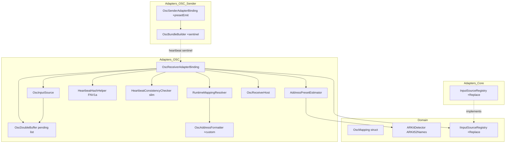
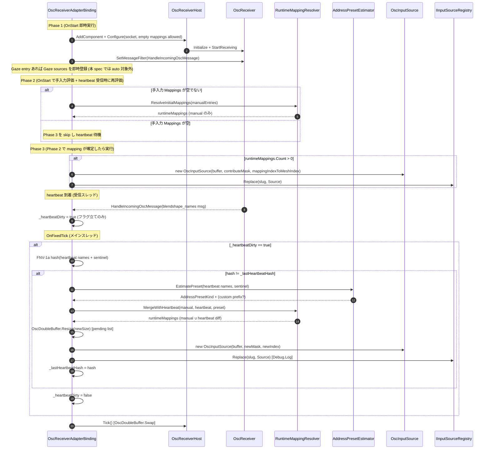
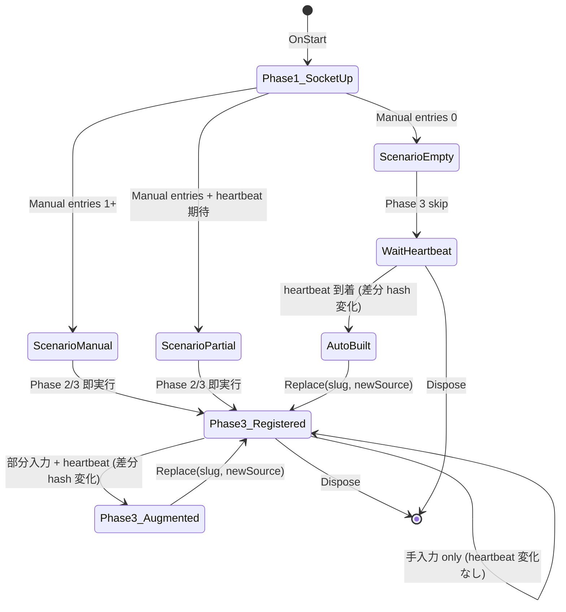

# Technical Design Document — osc-receiver-auto-mapping

## Overview

**Purpose**: 受信側 `OscReceiverAdapterBinding` の `Mappings` 列挙を、送信側 heartbeat (`/_facialcontrol/blendshape_names`) と受信側モデルの BlendShape 名一覧から自動生成する経路を追加し、200 シェイプ規模のモデルでも Inspector 手入力なしで OSC 受信を成立させる。`Mappings` が空 / 部分入力 / 完全手入力の 3 ケースを統一フローで扱う。

**Users**: Unity エンジニア（受信側統合担当、サンプル動作確認担当、パフォーマンス担当）。プレリリース利用者は `OscReceiverDemo` を空 `Mappings` のまま Import するだけで `OscOutputDemo` からの送信を受信側モデルへ反映できる。

**Impact**: `OscReceiverAdapterBinding` の `OnStart` lifecycle を Phase 1〜3 に再構成し、heartbeat 受信時に Phase 2/3 を再実行できる構造に変える。`HeartbeatConsistencyChecker` から `SkipMask` を廃止し warning 専用に縮退。送信側 heartbeat payload に sentinel + preset 識別子を追加（後方互換）。`IInputSourceRegistry` に `Replace` API を追加。`AddressPresetKind.Custom` 値と `OscAddressFormatter` の custom prefix overload を追加。

### Goals

- **G1**: 空 `Mappings` でも heartbeat 受信後に runtime mapping が自動生成され、受信側モデルの BlendShape weight が更新される（Req 1, 7）。
- **G2**: 手入力 / 部分入力 / 完全自動の 3 ケースが同じ起動シーケンスで動作し、既存 `FacialAdapterBindingCollectionSO` アセットを無改修で起動可能（Req 2, 6）。
- **G3**: heartbeat 由来 mapping の生成・拡張が GC ゼロ目標を破らない（Req 4）。
- **G4**: heartbeat payload に preset 識別子を含めることで preset 推定を確定的に行う（Req 3, 5）。

### Non-Goals

- **NG1**: Gaze entry（`Gaze_VRChat_XY` / `Gaze_ARKit_8BS`）の自動生成（heartbeat に Gaze id を含まないため、別 spec で「Gaze auto mapping」を扱う想定）。
- **NG2**: 送信側 (`OscOutputAdapterBinding`) の自動 mapping 生成（本 spec は受信側に閉じる）。送信側改修は本 spec で「heartbeat 末尾 sentinel + preset 追加」と「preset 出力 ON/OFF オプション SerializedField 追加」のみ。
- **NG3**: heartbeat 以外の経路（JSON プリセット配信等）からの mapping 投入。
- **NG4**: Inspector の「Manual / Auto」出自 badge UI（preview 段階は runtime 内部状態 + 診断ログのみ。Inspector UI 拡張は backlog）。
- **NG5**: `OscRuntimeSettingsSO` のスキーマ破壊的変更（heartbeat 由来 mapping は `[NonSerialized]` 別コレクションに保持）。
- **NG6**: UDP loopback の E2E PlayMode テスト（決定論性のため `HandleHeartbeat` 直接呼び出し方式を採用。E2E は別 spec の backlog）。

## Boundary Commitments

### This Spec Owns

- **Receiver auto mapping lifecycle**: `OscReceiverAdapterBinding.OnStart` の 3 Phase 分割、heartbeat 駆動の Phase 2/3 再実行、`OscInputSource` の Replace ベース差し替え。
- **Runtime mapping merge**: 手入力 `OscMappingEntry` (Normal_BlendShape) と heartbeat 由来 mapping のマージ・出自タグ・診断 API。
- **Address preset 推定**: `AddressPresetEstimator`（新規 helper）による sentinel/名前ベース推定、`AddressPresetKind.Custom` 値、`OscAddressFormatter` の custom prefix overload。
- **Heartbeat consistency checker のスリム化**: SkipMask 廃止、ContributeMask を binding 側で生成、mismatch warning は維持。
- **OscDoubleBuffer の動的 Resize**: pending list 方式の atomic swap、受信スレッドからの取りこぼし防止。
- **送信側 heartbeat 最小改修**: `OscBundleBuilder.AddHeartbeatMessages` の末尾 sentinel + preset 名 append、`OscSenderAdapterBinding` の preset 出力 ON/OFF オプション（デフォルト ON）。
- **IInputSourceRegistry.Replace API**: 新 API の Domain interface 追加と Adapters 実装、ログレベル `Debug.Log`。
- **Heartbeat 変化検出ハッシュ**: FNV-1a 32-bit の binding 内専用 helper。GC ゼロ。
- **サンプル更新**: `OscReceiverDemoProfile.asset` を空 Mappings に書き換え、README で auto mapping をデフォルト経路として説明。
- **PlayMode 統合テスト**: `OscReceiverAdapterBindingAutoMappingIntegrationTests`（仮称）を `HandleHeartbeat` 直接呼び出し方式で追加。

### Out of Boundary

- Gaze auto mapping（NG1）
- 送信側の auto mapping 生成（NG2）
- JSON プリセット配信経路（NG3）
- Inspector Manual/Auto badge UI（NG4、`docs/backlog.md` へ追記）
- `OscRuntimeSettingsSO` の破壊的スキーマ変更（NG5）
- UDP loopback E2E テスト（NG6、別 spec の backlog 候補）
- 表情 (Expression) id 体系の改廃

### Allowed Dependencies

- **Upstream（Domain 層）**:
  - `Hidano.FacialControl.Domain.Services.ARKitDetector.ARKit52Names`（52 名、preset 推定の単一情報源）
  - `Hidano.FacialControl.Domain.Models.OscMapping`（既存 readonly struct、本 spec で改変しない）
  - `Hidano.FacialControl.Domain.Adapters.IInputSourceRegistry`（本 spec で `Replace` API を追加）
- **Sibling（Adapters 層）**:
  - `OscReceiver` / `OscReceiverHost` / `OscBundleAccumulator`（既存）
  - `OscAddressFormatter`（custom prefix overload を追加）
  - `OscBundleBuilder` / `OscSenderAdapterBinding`（送信側 heartbeat の sentinel 追加）
- **External**: uOSC（既存依存、追加なし）

### Revalidation Triggers

- `IInputSourceRegistry.Replace` API のシグネチャ変更 → 他 binding spec へ通知
- heartbeat payload schema 変更（sentinel フォーマット変更）→ `osc-output-binding` spec への通知
- `AddressPresetKind` enum 値の追加・改廃 → JSON DTO (`OscMappingEntryDto`) との互換性確認
- `OscDoubleBuffer.Resize` の lock 戦略変更 → 既存 `OscDoubleBufferTests` への影響確認

## Architecture

### Existing Architecture Analysis

**現在のパターン**:
- クリーンアーキテクチャ（Domain ← Application ← Adapters ← Editor）。Domain は Unity 非依存契約を維持し、`OscInputSource` / `OscReceiverAdapterBinding` は Adapters 層。
- AdapterBinding lifecycle: `OnStart` → `OnFixedTick`（毎フレーム） → `Dispose`。`OnStart` 内で `OscReceiverHost` 構築 + `OscInputSource` 構築 + `IInputSourceRegistry.Register`。
- 受信スレッド ↔ メインスレッド: `OscReceiver` が UDP 受信スレッドから `_buffer.Write(...)` を呼び、メインスレッドの `OnFixedTick` で `_buffer.Swap()` する double-buffer 構造。

**保持する境界**:
- Domain → Adapters の片方向依存（`ARKitDetector.ARKit52Names` を Adapters から参照）
- `OscMapping` (Domain) は readonly struct のまま改変しない
- `OscRuntimeSettingsSO` のシリアライズ済みフィールドは破壊的変更しない（preset 出力 ON/OFF は `OscSenderAdapterBinding` の SerializedField として追加）
- `OscMappingEntry` の 6 シリアライズフィールドを温存し、heartbeat 由来 mapping は `[NonSerialized]` 別コレクションで保持

**統合ポイント**:
- `HandleIncomingOscMessage`（既存）の `BlendShapeNamesAddress` 分岐に auto mapping 駆動フックを追加
- `OnFixedTick`（既存）に「heartbeat 差分検出時の Phase 2/3 再実行」を追加

**解消する技術的負債**:
- `HeartbeatConsistencyChecker` の SkipMask / ContributeMask 兼用責務 → mismatch warning 専用へ縮退
- `OscReceiverAdapterBinding.OnStart` の `!hasBlendShapeMappings && !hasGazeMappings` 早期 return → Phase 1 で socket だけ起動する経路へ置換

### Architecture Pattern & Boundary Map



**Architecture Integration**:
- **Selected pattern**: 既存 Clean Architecture を維持し、Adapters 内で `AddressPresetEstimator` / `RuntimeMappingResolver` / `HeartbeatHashHelper` を小粒度 helper として追加（research.md Option C）。
- **Domain/feature boundaries**: Domain は `ARKitDetector.ARKit52Names` の参照と `IInputSourceRegistry.Replace` シグネチャ追加のみ。auto mapping ロジックは Adapters に閉じる。
- **Existing patterns preserved**: OnStart/OnFixedTick/Dispose lifecycle、`OscReceiverHost` 経由の socket open、double buffer の Volatile/Interlocked パターン。
- **New components rationale**:
  - `AddressPresetEstimator`: sentinel → 名前一致率 → fallback の判定戦略を単体テスト可能にするため独立関数群。
  - `RuntimeMappingResolver`: 手入力 ∪ heartbeat 差分のマージと出自タグを単体テスト可能にするため。
  - `HeartbeatHashHelper`: FNV-1a 32-bit を GC ゼロで提供。
- **Steering compliance**: 毎フレームのヒープ確保ゼロ目標を `_runtimeMappings` 配列を heartbeat 差分時にのみ再確保することで達成。`UnityEngine.Debug.Log/Warning` のみ使用。

### Technology Stack

| Layer | Choice / Version | Role in Feature | Notes |
|-------|------------------|-----------------|-------|
| Frontend / CLI | — | — | UI 改修はスコープ外（backlog） |
| Backend / Services | C# 9 (Unity 6 Roslyn) | Adapters 層の Runtime ロジック | 追加依存なし |
| Data / Storage | Unity ScriptableObject + JSON DTO | `OscReceiverDemoProfile.asset` 書き換え、`OscMappingEntry` SerializedField 温存 | スキーマ破壊変更なし |
| Messaging / Events | uOSC（既存） + 自前 sentinel + preset 追加 | heartbeat payload 末尾に `"__preset__"` + preset 名 + (custom 時) prefix を追加 | string[] 1 本で完結 |
| Infrastructure / Runtime | `Unity.Collections.NativeArray<float>` | `OscDoubleBuffer` の pending list 方式 Resize | Allocator.Persistent、再確保はメインスレッド |

## File Structure Plan

### Directory Structure

```
FacialControl/Packages/com.hidano.facialcontrol/
└── Runtime/Domain/Adapters/
    └── IInputSourceRegistry.cs                   # 改修: Replace API 追加

FacialControl/Packages/com.hidano.facialcontrol/
└── Runtime/Adapters/InputSources/
    └── InputSourceRegistry.cs                    # 改修: Replace API 実装

FacialControl/Packages/com.hidano.facialcontrol.osc/
├── Runtime/Adapters/AdapterBindings/
│   ├── OscReceiverAdapterBinding.cs              # 改修: OnStart 3 Phase 分割 + heartbeat 駆動再構築
│   └── OscSenderAdapterBinding.cs                # 改修: preset 出力 ON/OFF SerializedField 追加
└── Runtime/Adapters/OSC/
    ├── AddressPresetKind.cs                      # 改修: Custom 値追加
    ├── OscAddressFormatter.cs                    # 改修: custom prefix overload 追加
    ├── HeartbeatConsistencyChecker.cs            # 改修: SkipMask 廃止、warning 専用化
    ├── OscDoubleBuffer.cs                        # 改修: pending list 方式 Resize
    ├── OscBundleBuilder.cs                       # 改修: AddHeartbeatMessages に sentinel + preset
    ├── AddressPresetEstimator.cs                 # 新規: sentinel/名前ベース推定 helper
    ├── RuntimeMappingResolver.cs                 # 新規: 手入力 ∪ heartbeat 差分のマージ helper
    └── HeartbeatHashHelper.cs                    # 新規: FNV-1a 32-bit GC ゼロ計算 helper

FacialControl/Packages/com.hidano.facialcontrol.osc/
├── Samples~/OscReceiverDemo/
│   ├── OscReceiverDemoProfile.asset              # 改修: Mappings を全削除 (空 Mappings)
│   └── README.md                                 # 改修: auto mapping をデフォルト経路として説明
└── Samples~/OscOutputDemo/
    └── README.md                                 # 改修: sentinel + preset payload 説明

FacialControl/Packages/com.hidano.facialcontrol.osc/
└── Tests/
    ├── EditMode/Adapters/OSC/
    │   ├── AddressPresetEstimatorTests.cs        # 新規
    │   ├── RuntimeMappingResolverTests.cs        # 新規
    │   ├── HeartbeatHashHelperTests.cs           # 新規
    │   ├── HeartbeatConsistencyCheckerTests.cs   # 改修: SkipMask 検証部削除
    │   ├── OscDoubleBufferTests.cs               # 改修: Resize 中受信ケース追加
    │   └── OscAddressFormatterTests.cs           # 改修: custom prefix overload テスト追加
    ├── EditMode/Adapters/InputSources/
    │   └── OscInputSourceMaskTests.cs            # 改修: SkipMask 引数経路削除
    ├── EditMode/Adapters/AdapterBindings/
    │   └── OscReceiverAdapterBindingTests.cs     # 改修: SkipMask assertion → ContributeMask assertion
    └── PlayMode/Integration/
        ├── OscHeartbeatConsistencyTests.cs       # 改修: SkipMask 検証部 → ContributeMask 検証
        └── OscReceiverAdapterBindingAutoMappingIntegrationTests.cs  # 新規

FacialControl/Packages/com.hidano.facialcontrol/
└── Tests/EditMode/Adapters/InputSources/
    └── InputSourceRegistryTests.cs               # 改修: Replace API テスト追加

docs/
└── backlog.md                                    # 改修: Inspector Manual/Auto badge UI を追記
```

### Modified Files

- `Runtime/Domain/Adapters/IInputSourceRegistry.cs` — `Replace(AdapterSlug, IInputSource)` および `Replace(AdapterSlug, string, IInputSource)` 追加。
- `Runtime/Adapters/InputSources/InputSourceRegistry.cs` — `Replace` 実装、挿入順保持、`Debug.Log` でログ出力。
- `Runtime/Adapters/AdapterBindings/OscReceiverAdapterBinding.cs` — OnStart 3 Phase 分割、heartbeat 駆動 mapping 再構築、`RuntimeMappingResolver` 委譲、出自タグ保持、診断 API (`GetMappingOrigin`)。
- `Runtime/Adapters/AdapterBindings/OscSenderAdapterBinding.cs` — `[SerializeField] private bool _emitPresetInHeartbeat = true;` 追加、`AddressPresetKind` の `Custom` 経路を heartbeat 出力に含める。
- `Runtime/Adapters/OSC/AddressPresetKind.cs` — `Custom` 値追加。
- `Runtime/Adapters/OSC/OscAddressFormatter.cs` — `FormatBlendShapeAddress(string, string)` / `FormatBlendShapeAddressUtf8(string, string)` / `GetOrAddBlendShapeAddressUtf8(pool, string, string)` overload 追加。Pool key を `(name, customPrefix)` 形式に拡張。
- `Runtime/Adapters/OSC/HeartbeatConsistencyChecker.cs` — `SkipMask` / `ContributeMask` / `_mappedMeshBlendShapeMask` 削除。sender/receiver 名前差分の `UpdateFromHeartbeat` + `_loggedMismatchHashes` ベースの warning のみ残す。
- `Runtime/Adapters/OSC/OscDoubleBuffer.cs` — `Resize(int newSize)` を pending list 方式に置換。新規 `BeginPendingMode()` / `EndPendingModeAndFlush(NativeArray<float> destination)` 内部メソッド追加。
- `Runtime/Adapters/OSC/OscBundleBuilder.cs` — `AddHeartbeatMessages` の引数に preset 情報を追加し、末尾に sentinel + preset 名 + (custom 時) custom prefix を append。
- `Samples~/OscReceiverDemo/OscReceiverDemoProfile.asset` — `_mappings` を空配列 `[]` に書き換え。Gaze entry も削除。
- `Samples~/OscReceiverDemo/README.md` — 「auto mapping がデフォルト経路」を 1 段落以上で説明。手入力サンプルは backlog の独立サンプルとして再提供される旨を追記。
- `Samples~/OscOutputDemo/README.md` — sentinel + preset payload の説明節を追加。
- `docs/backlog.md` — Inspector Manual/Auto badge UI 表示タスクを追記。

## System Flows

### OnStart 3 Phase 分割と heartbeat 駆動再実行



**Key Decisions (diagram に表現されない補足)**:
- 受信スレッドからの hot path は `_heartbeatDirty = true;` フラグ立てのみ。FNV-1a 計算と mapping 再構築はメインスレッド `OnFixedTick` で実行する（Req 4.3）。
- `OscInputSource` 差し替えは `Replace` 経由（`Register` 重複時 LogError を回避）。
- Phase 2/3 はメソッド `ResolveAndPublishRuntimeMappings()` として抽出し OnStart と OnFixedTick の両方から呼び出す。

### 3 シナリオの状態遷移



**シナリオ別補足**:
- **手入力 only (ScenarioManual)**: OnStart で Phase 2/3 即実行。heartbeat が到着しても hash 変化がなければ何もしない（Req 6.1）。
- **空 only (ScenarioEmpty)**: OnStart で Phase 1 のみ実行。`OscInputSource` 未登録。heartbeat 到着まで Aggregator に値を出力しない（Req 1.4）。
- **部分入力 + heartbeat (ScenarioPartial)**: OnStart で手入力分の Phase 2/3 を実行（即時 register）。heartbeat 到着後に差分 mapping を追加し `Replace` で差し替え（Req 2.2）。手入力 entry の `addressPattern` は heartbeat 由来推定で上書きされない（Req 2.3）。

### OscDoubleBuffer Resize (pending list 方式) 擬似コード

```text
class OscDoubleBuffer:
    _bufferA, _bufferB : NativeArray<float>
    _writeIndex : int                        // 0 or 1
    _pendingMode : int                       // Volatile, 0=normal / 1=pending
    _pendingList : List<(int index, float value)>   // メインスレッド初期化、受信スレッドが lock 内 Add
    _pendingLock : object

    // ----- 受信スレッド -----
    Write(index, value):
        if Volatile.Read(_pendingMode) == 1:
            lock (_pendingLock):
                if Volatile.Read(_pendingMode) == 1:
                    _pendingList.Add((index, value))
                    return
        writeBuffer = GetWriteBuffer()
        writeBuffer[index] = value
        Interlocked.Increment(ref _writeTick)

    // ----- メインスレッド -----
    Resize(newSize):
        if newSize == _size: return
        // 1. pending mode に切替 (atomic, lock 不要)
        Volatile.Write(_pendingMode, 1)
        // 2. 新 buffer 確保 (lock 外)
        newA = new NativeArray<float>(newSize, Persistent, ClearMemory)
        newB = new NativeArray<float>(newSize, Persistent, ClearMemory)
        // 3. 旧 buffer の値を新 buffer A にコピー (range = min(old, new))
        copyLen = min(_size, newSize)
        CopyRange(_bufferA, newA, copyLen) // 旧 writeBuffer の値を維持
        // 4. 旧 buffer 解放
        _bufferA.Dispose(); _bufferB.Dispose()
        _bufferA = newA; _bufferB = newB; _size = newSize; _writeIndex = 0
        // 5. pending list の再投入
        lock (_pendingLock):
            for each (idx, val) in _pendingList:
                if idx < _size: _bufferA[idx] = val
            _pendingList.Clear()
            // 6. 通常モードに復帰 (lock 内で atomic 切替)
            Volatile.Write(_pendingMode, 0)
```

**Key Decisions**:
- `_pendingMode` の `Volatile.Read/Write` で hot path から lock を回避（pending mode が 0 なら lock 取得不要）。
- `_pendingList` への `Add` は pending mode が 1 のときだけ実行され、Resize 完了後に即 Clear される。
- 旧 buffer の値はコピー範囲 `min(old, new)` で新 buffer A に移行。新 B はクリア状態。
- Resize 中の Write は最大 1 回の lock 取得で済む（pending mode 切替は Volatile 1 命令）。

## Requirements Traceability

| Requirement | Summary | Components | Interfaces | Flows |
|-------------|---------|------------|------------|-------|
| 1.1 | 空 Mappings で OSC 受信を起動し OscInputSource 登録を heartbeat 到着まで延期 | OscReceiverAdapterBinding (Phase 1) | OnStart, IInputSourceRegistry.Replace | OnStart 3 Phase 分割 |
| 1.2 | heartbeat 受信時に積集合で runtime mapping 生成 + Source 登録 | OscReceiverAdapterBinding, RuntimeMappingResolver | HandleIncomingOscMessage, ResolveAndPublishRuntimeMappings | OnStart 3 Phase 分割 |
| 1.3 | addressPattern を推定 preset で組み立て、expressionId を BlendShape 名に一致 | AddressPresetEstimator, OscAddressFormatter | EstimatePreset, FormatBlendShapeAddress | OnStart 3 Phase 分割 |
| 1.4 | heartbeat 未受信中は OscInputSource 未登録 | OscReceiverAdapterBinding (Phase 1) | OnStart | 3 シナリオの状態遷移 |
| 1.5 | 名前一致ゼロのとき LogWarning 1 度のみ | RuntimeMappingResolver | MergeWithHeartbeat, _loggedEmptyIntersectionHashes | — |
| 1.6 | runtime mapping を再評価可能な構造で保持 | OscReceiverAdapterBinding (`_runtimeMappings`, `_lastHeartbeatHash`) | ResolveAndPublishRuntimeMappings | OnStart 3 Phase 分割 |
| 2.1 | 手入力 entry を runtime mapping として優先採用し即時登録 | RuntimeMappingResolver | ResolveInitialMappings | 3 シナリオ (ScenarioManual) |
| 2.2 | heartbeat 由来で手入力カバー外を追加 | RuntimeMappingResolver | MergeWithHeartbeat | 3 シナリオ (ScenarioPartial) |
| 2.3 | 同一 expressionId は手入力の addressPattern を優先 | RuntimeMappingResolver | MergeWithHeartbeat | 3 シナリオ (ScenarioPartial) |
| 2.4 | Gaze のみ + 空 Normal_BlendShape は Gaze 結線維持 + auto BlendShape 生成 | OscReceiverAdapterBinding (Phase 1 Gaze 登録), RuntimeMappingResolver | OnStart, ResolveAndPublishRuntimeMappings | OnStart 3 Phase 分割 |
| 2.5 | 出自を runtime API + 診断ログで識別 | OscReceiverAdapterBinding (`MappingOrigin[]`), GetMappingOrigin | GetMappingOrigin | — |
| 2.6 | OscMappingEntry の SerializeField を破壊しない、heartbeat 由来は [NonSerialized] 別コレクション | OscReceiverAdapterBinding (`_runtimeMappings`, `_mappingOrigins`) | — | — |
| 3.1 | 3 種 preset を識別、AddressPresetKind.Custom 追加 | AddressPresetKind, AddressPresetEstimator | — | — |
| 3.2 | sentinel 優先、未指定時は ARKit52 一致率 ≥ 50% で ARKit、未満で VRChat | AddressPresetEstimator | EstimatePreset(names, sentinel) | — |
| 3.3 | VRChat は `/avatar/parameters/{name}` | OscAddressFormatter | FormatBlendShapeAddress(VRChat, name) | — |
| 3.4 | ARKit 標準名は `/ARKit/{name}`、非標準は VRChat fallback | RuntimeMappingResolver, OscAddressFormatter | FormatBlendShapeAddress(ARKit/VRChat, name) | — |
| 3.5 | Custom は overload で組み立て、prefix 欠落時 VRChat fallback + warning 1 回 | OscAddressFormatter (custom overload), AddressPresetEstimator | FormatBlendShapeAddress(string, string) | — |
| 3.6 | 同名複数候補は sentinel 最優先、無ければ VRChat、衝突は warning 1 回 | RuntimeMappingResolver | MergeWithHeartbeat | — |
| 3.7 | ARKit 標準名は ARKitDetector.ARKit52Names を単一情報源 | AddressPresetEstimator | EstimatePreset, ARKitDetector.ARKit52Names | — |
| 4.1 | heartbeat 変化検出は FNV-1a (GC ゼロ) | HeartbeatHashHelper | ComputeFnv1a(names) | — |
| 4.2 | hash 一致時は新規確保せず既存再利用 | OscReceiverAdapterBinding | ResolveAndPublishRuntimeMappings | OnStart 3 Phase 分割 |
| 4.3 | 再構築はメインスレッド、受信スレッドはフラグ立てのみ | OscReceiverAdapterBinding (`_heartbeatDirty`) | HandleIncomingOscMessage, OnFixedTick | OnStart 3 Phase 分割 |
| 4.4 | OscInputSource.TryWriteValues は 0 byte 維持 | OscInputSource (既存) | TryWriteValues | — |
| 4.5 | Resize は pending list 切替、再投入で取りこぼし防止 | OscDoubleBuffer | Resize(int), Write(int, float) | OscDoubleBuffer Resize 擬似コード |
| 4.6 | ContributeMask を binding 側で生成、SkipMask 廃止 | OscReceiverAdapterBinding, HeartbeatConsistencyChecker (slim) | ResolveAndPublishRuntimeMappings, UpdateFromHeartbeat | — |
| 4.7 | IInputSourceRegistry.Replace API 追加、Debug.Log 出力 | IInputSourceRegistry, InputSourceRegistry | Replace(AdapterSlug, IInputSource) | OnStart 3 Phase 分割 |
| 5.1 | 送信側で sentinel + preset 名 + (custom 時) prefix を末尾追加 | OscBundleBuilder, OscSenderAdapterBinding | AddHeartbeatMessages(sentinel, preset, customPrefix) | — |
| 5.2 | 旧 receiver は sentinel を mesh 不一致名として skip | OscReceiverAdapterBinding (旧) | — | — |
| 5.3 | 新 receiver は末尾走査で sentinel を検出し preset payload を消費 | AddressPresetEstimator | EstimatePreset | OnStart 3 Phase 分割 |
| 5.4 | preset 識別子は vrchat / arkit / custom の 3 値、custom は prefix 1 要素続く | AddressPresetEstimator | EstimatePreset | — |
| 5.5 | 未知 preset は warning 1 回 + 名前ベース推定にフォールバック | AddressPresetEstimator | EstimatePreset, _loggedUnknownPresets | — |
| 5.6 | preset 結果は runtime 内部状態、SO は破壊変更なし | OscReceiverAdapterBinding (`_currentPreset`, `_currentCustomPrefix`) | — | — |
| 5.7 | preset 出力は Inspector / JSON で ON/OFF (デフォルト ON) | OscSenderAdapterBinding (`_emitPresetInHeartbeat` SerializedField) | — | — |
| 6.1 | 既存手入力構成は現行同一の起動順序・mask 構成で動作 | OscReceiverAdapterBinding | OnStart, ResolveAndPublishRuntimeMappings | 3 シナリオ (ScenarioManual) |
| 6.2 | Gaze 結線・GazeVector2InputSource 登録・bundle accumulator 経路を改変しない | OscReceiverAdapterBinding (Gaze 経路は touch しない) | RegisterGazeSources | — |
| 6.3 | SenderIdentity / ZombieEvictionPolicy / OscBundleAccumulator / FailSafeMode を退行させない | OscReceiverAdapterBinding (既存初期化を Phase 1 で維持) | OnStart | — |
| 6.4 | HeartbeatConsistencyChecker の mismatch 検出と 1 度ログは継続提供 | HeartbeatConsistencyChecker (slim) | UpdateFromHeartbeat, _loggedMismatchHashes | — |
| 6.5 | ReceiverEnabled=false 時は heartbeat 受信も auto mapping 生成もしない | OscReceiverAdapterBinding (既存早期 return) | OnStart | — |
| 6.6 | Dispose で heartbeat 由来 runtime mapping / 拡張済み mask / 再確保 buffer を解放 | OscReceiverAdapterBinding | Dispose | — |
| 7.1 | 空 Mappings で VRChat 形式送信を受信側 BlendShape に反映 | OscReceiverAdapterBindingAutoMappingIntegrationTests (新規) | — | OnStart 3 Phase 分割 |
| 7.2 | 空 Mappings で ARKit 形式送信を受信側 BlendShape に反映 | OscReceiverAdapterBindingAutoMappingIntegrationTests (新規) | — | OnStart 3 Phase 分割 |
| 7.3 | LogError なし、heartbeat 未受信中は BlendShape weight 初期値維持 | OscReceiverAdapterBindingAutoMappingIntegrationTests (新規) | — | — |
| 7.4 | heartbeat ゼロ送信なら BlendShape weight 不変、OscInputSource 未登録 | OscReceiverAdapterBindingAutoMappingIntegrationTests (新規) | — | — |
| 7.5 | PlayMode 統合テストを HandleHeartbeat 直接呼び出し方式で提供 | OscReceiverAdapterBindingAutoMappingIntegrationTests (新規) | — | — |
| 7.6 | OscReceiverDemoProfile.asset を空 Mappings に書き換え、README で説明 | OscReceiverDemoProfile.asset, README.md | — | — |
| 7.7 | サンプル README に空 Mappings 運用 + auto mapping 動作条件説明節を追加 | OscReceiverDemo/README.md, OscOutputDemo/README.md | — | — |

## Components and Interfaces

| Component | Domain/Layer | Intent | Req Coverage | Key Dependencies (P0/P1) | Contracts |
|-----------|--------------|--------|--------------|--------------------------|-----------|
| OscReceiverAdapterBinding | Adapters/OSC | OnStart 3 Phase 分割 + heartbeat 駆動再構築 + 出自タグ保持 | 1.*, 2.*, 6.* | OscReceiverHost (P0), OscInputSource (P0), IInputSourceRegistry (P0), RuntimeMappingResolver (P0), AddressPresetEstimator (P0), HeartbeatHashHelper (P0), OscDoubleBuffer (P0), HeartbeatConsistencyChecker (P1) | Service, State |
| RuntimeMappingResolver | Adapters/OSC | 手入力 ∪ heartbeat 差分のマージと出自タグを GC 最小で計算 | 1.2, 1.5, 2.1, 2.2, 2.3, 2.4, 3.4, 3.6 | OscAddressFormatter (P0), ARKitDetector (P1) | Service |
| AddressPresetEstimator | Adapters/OSC | sentinel/名前ベースで preset 種別と custom prefix を確定 | 3.1, 3.2, 3.7, 5.3, 5.4, 5.5 | ARKitDetector (P0) | Service |
| HeartbeatHashHelper | Adapters/OSC | heartbeat 名配列の FNV-1a 32-bit 計算 (GC ゼロ) | 4.1 | — | Service |
| OscDoubleBuffer | Adapters/OSC | pending list 方式 Resize で受信値取りこぼし防止 | 4.5 | Unity.Collections.NativeArray (P0) | State |
| HeartbeatConsistencyChecker (slim) | Adapters/OSC | sender/receiver 名前差分の mismatch warning 専用に縮退 | 6.4 | — | Service |
| OscAddressFormatter | Adapters/OSC | VRChat / ARKit / Custom prefix の組み立て (custom overload 追加) | 3.3, 3.4, 3.5 | — | Service |
| AddressPresetKind | Adapters/OSC | Custom 値追加 | 3.1 | — | State |
| OscBundleBuilder | Adapters/OSC | heartbeat 末尾に sentinel + preset 名 + (custom 時) prefix を追加 | 5.1 | — | Batch |
| OscSenderAdapterBinding | Adapters/OSC | preset 出力 ON/OFF SerializedField 追加 (デフォルト ON) | 5.7 | OscBundleBuilder (P0) | State |
| IInputSourceRegistry | Domain/Adapters | Replace API シグネチャ追加 | 4.7 | — | Service |
| InputSourceRegistry | Adapters/InputSources | Replace API 実装 (挿入順保持、Debug.Log 出力) | 4.7 | — | Service |
| OscReceiverDemoProfile (asset) | Samples~ | 空 Mappings に書き換え | 7.6 | — | State |

### Adapters / OSC

#### OscReceiverAdapterBinding

| Field | Detail |
|-------|--------|
| Intent | OnStart 3 Phase 分割と heartbeat 駆動の runtime mapping 再構築を司る binding |
| Requirements | 1.1, 1.2, 1.4, 1.6, 2.4, 2.5, 2.6, 4.2, 4.3, 4.6, 6.1, 6.3, 6.5, 6.6 |

**Responsibilities & Constraints**
- 主責務: OSC socket + filter 起動 (Phase 1) → mapping 確定 (Phase 2) → OscInputSource Replace (Phase 3) の lifecycle 管理。
- ドメイン境界: Adapters/OSC に閉じ、Domain は `OscMapping` (struct) と `ARKitDetector.ARKit52Names` のみ参照。
- 不変条件: `OscInputSource` は同一 slug で常に 1 インスタンスのみ登録される (`Replace` API 使用)。heartbeat 駆動の再構築はメインスレッドで実行する。

**Dependencies**
- Inbound: `FacialAdapterBindingCollectionSO` (P0) — Inspector / Asset で本 binding を保持
- Outbound: `OscReceiverHost` (P0) — socket open / Tick、`OscInputSource` (P0) — Aggregator への値供給、`IInputSourceRegistry` (P0) — Replace 経由で差し替え、`RuntimeMappingResolver` (P0) — mapping マージ、`AddressPresetEstimator` (P0) — preset 推定、`HeartbeatHashHelper` (P0) — 変化検出、`HeartbeatConsistencyChecker` (P1) — mismatch warning
- External: uOSC (P0) — UDP 受信

**Contracts**: Service [x] / State [x]

##### Service Interface
```csharp
namespace Hidano.FacialControl.Adapters.AdapterBindings
{
    public sealed class OscReceiverAdapterBinding : AdapterBindingBase
    {
        public enum MappingOrigin
        {
            Manual,
            HeartbeatAuto
        }

        public override void OnStart(in AdapterBuildContext ctx);
        public override void OnFixedTick(float fixedDeltaTime);
        public override void Dispose();

        // 診断 API
        public IReadOnlyList<OscMapping> RuntimeMappings { get; }
        public MappingOrigin GetMappingOrigin(int runtimeMappingIndex);
        public AddressPresetKind? CurrentPreset { get; }
        public string CurrentCustomPrefix { get; }
        public uint LastHeartbeatHash { get; }

        // 既存 API は維持
    }
}
```
- Preconditions: `OnStart` 呼び出し時 `ctx.HostGameObject != null`、`ctx.BlendShapeNames` が受信側 mesh の BlendShape 一覧を提供する。
- Postconditions: Phase 1 完了で OSC socket がオープン、Phase 2/3 完了で `IInputSourceRegistry` に slug 登録 (1 件以上の mapping 時)。
- Invariants: 同一 slug の `OscInputSource` は常に 1 インスタンスのみ。heartbeat 差分検出後の再構築はメインスレッドで実行。

##### State Management
- 状態: `_runtimeMappings: OscMapping[]`, `_mappingOrigins: MappingOrigin[]`, `_lastHeartbeatHash: uint`, `_heartbeatDirty: int` (Volatile/Interlocked), `_currentPreset: AddressPresetKind?`, `_currentCustomPrefix: string`
- 永続化: heartbeat 由来 mapping は全て `[NonSerialized]`。SerializedField `_mappings` は手入力 entry のみ保持し既存契約と互換。
- 並行性: 受信スレッドからは `_heartbeatDirty = 1` の Volatile.Write のみ。再構築はメインスレッドで lock 不要。

**Implementation Notes**
- Integration: 既存の Gaze 経路 (`RegisterGazeSources` 等) は Phase 1 内で従来通り実行。SenderIdentity / ZombieEvictionPolicy / OscBundleAccumulator も Phase 1 で初期化する。
- Validation: `ctx.BlendShapeNames` が空の場合は `Debug.LogWarning` で警告し Phase 1 のみ起動。heartbeat と mesh の積集合が空のときは `RuntimeMappingResolver` 経由で warning 1 度のみ。
- Risks: heartbeat 差分検出ハッシュの衝突確率は 2^-32 と十分低いが、衝突した場合は次の heartbeat で復旧する想定。Replace 経由の差し替えで Aggregator 側の参照が瞬間的に旧 source を見続ける可能性があるが、Aggregator は次フレームで Registry を再 resolve するため問題ない。

#### RuntimeMappingResolver

| Field | Detail |
|-------|--------|
| Intent | 手入力 entry と heartbeat 由来 BlendShape 名のマージを GC 最小で実行し、出自タグを付与した OscMapping[] を生成 |
| Requirements | 1.2, 1.5, 2.1, 2.2, 2.3, 2.4, 3.4, 3.6 |

**Responsibilities & Constraints**
- 主責務: 手入力 `OscMappingEntry` (mode=Normal_BlendShape) を `OscMapping` に変換 → heartbeat 由来差分を append → 出自タグ配列を返す。
- 不変条件: 同一 expressionId に対して手入力 entry の addressPattern が常に優先される。
- GC: 入力 List / 配列を再利用可能な構造（builder pattern）で受け取り、結果配列は heartbeat 差分時のみ新規確保。

**Dependencies**
- Inbound: `OscReceiverAdapterBinding` (P0)
- Outbound: `OscAddressFormatter` (P0) — preset に応じた address 組み立て、`ARKitDetector` (P1) — ARKit fallback 判定

**Contracts**: Service [x]

##### Service Interface
```csharp
namespace Hidano.FacialControl.Adapters.OSC
{
    public static class RuntimeMappingResolver
    {
        public readonly struct ResolveResult
        {
            public OscMapping[] RuntimeMappings { get; }
            public OscReceiverAdapterBinding.MappingOrigin[] Origins { get; }
            public int ManualCount { get; }
            public int HeartbeatAutoCount { get; }
        }

        // 手入力のみで構築 (OnStart Phase 2)
        public static ResolveResult ResolveInitialMappings(
            IReadOnlyList<OscMappingEntry> manualEntries);

        // 手入力 ∪ heartbeat 差分のマージ (heartbeat 駆動 Phase 2)
        public static ResolveResult MergeWithHeartbeat(
            IReadOnlyList<OscMappingEntry> manualEntries,
            IReadOnlyList<string> heartbeatBlendShapeNames,
            IReadOnlyList<string> meshBlendShapeNames,
            AddressPresetKind preset,
            string customPrefix,                            // preset == Custom のときのみ有効
            ref bool warnedOnEmptyIntersection,             // Req 1.5 / 3.6 の warning 1 回制御
            ref bool warnedOnAddressCollision);
    }
}
```
- Preconditions: `manualEntries` は null 可、`heartbeatBlendShapeNames` も null 可（heartbeat 未受信時）。`meshBlendShapeNames` は必須。
- Postconditions: `ResolveResult.RuntimeMappings` の最初に手入力分 (`ManualCount` 件)、続いて heartbeat 差分 (`HeartbeatAutoCount` 件) が並ぶ。`Origins[i]` は同じ順序で `Manual` / `HeartbeatAuto`。
- Invariants: 同一 expressionId は手入力優先で唯一のエントリ。空 intersection の場合は `RuntimeMappings.Length == 手入力 count`。

**Implementation Notes**
- Integration: 内部で `HashSet<string>` を使うが、binding 側が `[NonSerialized]` の再利用可能 set を渡せる overload を検討（preview 段階は static method で十分）。
- Validation: `manualEntries[i].mode != Normal_BlendShape` のときは無視（Gaze entry は別経路）。空文字列の `expressionId` / `addressPattern` も無視。
- Risks: heartbeat 由来差分の優先付けが期待と異なる場合は `MappingOrigin` 配列で診断ログ追跡可能。

#### AddressPresetEstimator

| Field | Detail |
|-------|--------|
| Intent | heartbeat payload と名前一致率から preset 種別と custom prefix を確定 |
| Requirements | 3.1, 3.2, 3.7, 5.3, 5.4, 5.5 |

**Responsibilities & Constraints**
- 主責務: heartbeat 末尾の sentinel `"__preset__"` を検出 → preset 文字列を読み取り → 未指定なら ARKit52 名一致率 ≥ 50% で ARKit、未満で VRChat。
- 不変条件: sentinel が見つかった場合は名前ベース推定をスキップ。未知 preset は warning 1 回 + 名前ベースへフォールバック。

**Dependencies**
- Inbound: `OscReceiverAdapterBinding` (P0)
- Outbound: `ARKitDetector.ARKit52Names` (P0)

**Contracts**: Service [x]

##### Service Interface
```csharp
namespace Hidano.FacialControl.Adapters.OSC
{
    public static class AddressPresetEstimator
    {
        public const string PresetSentinel = "__preset__";
        public const string PresetVrChat = "vrchat";
        public const string PresetArKit = "arkit";
        public const string PresetCustom = "custom";

        public readonly struct EstimationResult
        {
            public AddressPresetKind Preset { get; }
            public string CustomPrefix { get; }   // preset == Custom のときのみ非 null
            public int PayloadStartIndex { get; } // sentinel + preset payload を除いた BlendShape 名配列の終端
            public bool SentinelFound { get; }
        }

        public static EstimationResult Estimate(
            IReadOnlyList<string> heartbeatPayload,
            ref bool warnedOnUnknownPreset,
            ref bool warnedOnMissingCustomPrefix);
    }
}
```
- Preconditions: `heartbeatPayload` は null 可（null のときは `EstimationResult` のデフォルト = VRChat 推定）。
- Postconditions: sentinel が見つかった場合 `PayloadStartIndex` は sentinel の位置（呼び出し側はこれを使って BlendShape 名範囲を切り出す）。
- Invariants: sentinel が存在しない場合は `SentinelFound == false`、`PayloadStartIndex == payload.Count`。

**Implementation Notes**
- Integration: 名前一致率計算は `ARKitDetector.ARKit52Names` を `HashSet` 化し payload を 1 走査して count するだけで GC ゼロ可能（HashSet は binding 側で 1 回生成し再利用）。
- Validation: preset 文字列が `vrchat` / `arkit` / `custom` 以外なら warning + VRChat fallback。`custom` で続く要素が存在しないと warning + VRChat fallback。
- Risks: 名前一致率 50% 閾値は ARKit/VRChat 混在モデルで誤判定の可能性あり。実機調査で閾値を調整する余地を残す（design.md コメントに記載）。

#### HeartbeatHashHelper

| Field | Detail |
|-------|--------|
| Intent | heartbeat 名配列の FNV-1a 32-bit ハッシュを GC ゼロで計算 |
| Requirements | 4.1 |

**Responsibilities & Constraints**
- 主責務: `IReadOnlyList<string>` の各 char を順序依存で FNV-1a 連続ハッシュ。
- 不変条件: 同一入力に対し常に同一ハッシュを返す。GC アロケーション 0 byte。

**Dependencies**
- Inbound: `OscReceiverAdapterBinding` (P0)
- Outbound: なし

**Contracts**: Service [x]

##### Service Interface
```csharp
namespace Hidano.FacialControl.Adapters.OSC
{
    public static class HeartbeatHashHelper
    {
        public const uint Fnv1aOffsetBasis = 2166136261u;
        public const uint Fnv1aPrime = 16777619u;

        public static uint ComputeFnv1a(IReadOnlyList<string> names);
        public static uint ComputeFnv1a(IReadOnlyList<string> names, int startIndex, int count);
    }
}
```

**Implementation Notes**
- 擬似コード（research.md Topic 4 参照）。
- 各文字を 2 byte (low/high) に分解し XOR + 乗算。名前間に `0x00` 区切りを入れて連続名衝突を回避。

#### OscDoubleBuffer (改修)

| Field | Detail |
|-------|--------|
| Intent | runtime mapping 拡張時の Resize 中に受信値を取りこぼさない pending list 方式 |
| Requirements | 4.5 |

**Responsibilities & Constraints**
- 主責務: 既存 double buffer + Resize に pending list 方式を追加し、受信スレッドからの Write を Resize 中も受け付ける。
- 不変条件: `_pendingMode == 0` の通常時は既存挙動と完全互換（lock 取得なし、Volatile.Read 1 命令のみ）。
- 並行性: pending list への Add は double-checked locking、Resize 中の atomic swap は Volatile.Write 1 命令。

**Dependencies**
- Inbound: `OscReceiver` / `OscBundleAccumulator` (受信スレッド), `OscReceiverAdapterBinding` (メインスレッド Resize 呼び出し)
- Outbound: `Unity.Collections.NativeArray<float>` (P0)

**Contracts**: State [x]

##### State Management
- 状態: `_bufferA`, `_bufferB` (NativeArray), `_writeIndex`, `_writeTick`, `_pendingMode` (Volatile int), `_pendingList` (List<(int, float)>), `_pendingLock` (object)
- 永続化: なし（runtime only）
- 並行性: research.md Topic 5 + design.md 「OscDoubleBuffer Resize 擬似コード」参照。

**Implementation Notes**
- Integration: `OscReceiverAdapterBinding.ResolveAndPublishRuntimeMappings` から呼ばれる際は必ずメインスレッド (`OnFixedTick` 経路)。
- Validation: 既存 `OscDoubleBufferTests` に Resize 中受信ケースを追加し、再投入後のバッファ値を検証。
- Risks: pending list が無限に膨らむ可能性があるが、Resize は heartbeat 変化時のみで頻度低。安全のため pending list の最大長を 1024 とし、超過時は警告 + 古いエントリを破棄する（実装時詳細）。

#### HeartbeatConsistencyChecker (slim 化)

| Field | Detail |
|-------|--------|
| Intent | sender/receiver 名前差分の mismatch warning 専用に縮退（SkipMask / ContributeMask 廃止） |
| Requirements | 6.4 |

**Responsibilities & Constraints**
- 主責務: `UpdateFromHeartbeat(senderNames)` で senderOnly / receiverOnly 差分を計算し、`_loggedMismatchHashes` で 1 度だけ `Debug.LogWarning`。
- 不変条件: SkipMask / ContributeMask / `_mappedMeshBlendShapeMask` は本クラスから完全削除。`HasMismatch` プロパティと mismatch hash ベースの 1 度ログは維持。
- ContributeMask は本クラスでは生成せず、binding 側が runtime mapping から生成する。

**Dependencies**
- Inbound: `OscReceiverAdapterBinding` (P0)
- Outbound: なし

**Contracts**: Service [x]

##### Service Interface
```csharp
namespace Hidano.FacialControl.Adapters.OSC
{
    public sealed class HeartbeatConsistencyChecker
    {
        public HeartbeatConsistencyChecker(
            IReadOnlyList<string> receiverBlendShapeNames,
            bool warnLogEnabled = true);

        public bool HasMismatch { get; }
        public IReadOnlyList<string> SenderOnlyNames { get; }
        public IReadOnlyList<string> ReceiverOnlyNames { get; }

        public void UpdateFromHeartbeat(IReadOnlyList<string> senderBlendShapeNames);
        public void Clear();
    }
}
```

**Implementation Notes**
- Integration: binding は runtime mapping 再構築のたびに `receiverBlendShapeNames` (runtime mapping 由来の名前一覧) を渡して Checker を再構築する。Checker 自体を毎回 new するか、`Reconfigure(IReadOnlyList<string>)` メソッドを追加するかは実装時に決定（preview 段階は new で十分）。
- Validation: 既存 `HeartbeatConsistencyCheckerTests` から SkipMask / ContributeMask の assertion を削除し、SenderOnly / ReceiverOnly / HasMismatch のみ検証する形に再構成。
- Risks: 既存 PlayMode テスト `OscHeartbeatConsistencyTests` の SkipMask 検証部を削除し、ContributeMask 検証は `OscInputSource.ContributeMask` 経由で行う形に置換する必要あり。

#### OscAddressFormatter (custom overload 追加)

| Field | Detail |
|-------|--------|
| Intent | VRChat / ARKit 既存経路に加え、custom prefix 経路を追加 |
| Requirements | 3.3, 3.4, 3.5 |

**Contracts**: Service [x]

##### Service Interface（追加分のみ）
```csharp
namespace Hidano.FacialControl.Adapters.OSC
{
    public static class OscAddressFormatter
    {
        // 既存 API はそのまま維持
        public static string FormatBlendShapeAddress(AddressPresetKind preset, string blendShapeName);

        // 新規 overload
        public static string FormatBlendShapeAddress(string customPrefix, string blendShapeName);
        public static byte[] FormatBlendShapeAddressUtf8(string customPrefix, string blendShapeName);
        public static byte[] GetOrAddBlendShapeAddressUtf8(
            Dictionary<(string name, string customPrefix), byte[]> addressBytesPool,
            string customPrefix,
            string blendShapeName);
    }
}
```

**Implementation Notes**
- Integration: 既存 `GetBlendShapePrefix(AddressPresetKind)` の switch は VRChat / ARKit でのみ動作、Custom は別 overload を呼ぶ。`AddressPresetKind.Custom` のケースで既存 API を呼ぶと従来通り `NotSupportedException` を投げる契約とし、呼び出し側は preset == Custom 判定で overload を選択する。
- Validation: `customPrefix` が null/empty の場合は `ArgumentException`。先頭 `/` の自動付加は行わない（呼び出し側責務）。
- Risks: Pool key の型変更（`(string, AddressPresetKind)` → `(string, string)` でも兼用するか別 Pool にするか）は実装時詳細。互換のため別 Pool を持つのが安全。

#### AddressPresetKind (Custom 値追加)

| Field | Detail |
|-------|--------|
| Intent | `Custom` enum 値追加 |
| Requirements | 3.1 |

```csharp
namespace Hidano.FacialControl.Adapters.OSC
{
    [Serializable]
    public enum AddressPresetKind
    {
        VRChat = 0,
        ARKit = 1,
        Custom = 2
    }
}
```

**Implementation Notes**: 数値割り当てを明示し、既存シリアライズ値 (`0`, `1`) を破壊しない。

#### OscBundleBuilder / OscSenderAdapterBinding (送信側最小改修)

| Field | Detail |
|-------|--------|
| Intent | heartbeat 末尾に sentinel + preset 名 + (custom 時) prefix を追加し、Inspector で出力 ON/OFF 可能にする |
| Requirements | 5.1, 5.7 |

**OscBundleBuilder 改修**:
```csharp
// 既存
private void AddHeartbeatMessages(ulong timestamp, byte[] addressUtf8, string[] names, int count);

// 改修後 (overload 追加 or 引数追加)
private void AddHeartbeatMessages(
    ulong timestamp,
    byte[] addressUtf8,
    string[] names,
    int count,
    string presetSentinel,      // null or "__preset__"
    string presetName,          // null or "vrchat" / "arkit" / "custom"
    string customPrefix);       // null or "/myapp/"
```

末尾 append ロジック:
- `presetSentinel != null && presetName != null` のとき、`names` のチャンク化と同じ packing で末尾に `"__preset__"`, `presetName` を append。
- `presetName == "custom" && customPrefix != null` のとき、続けて `customPrefix` を append。

**OscSenderAdapterBinding 改修**:
- 新 SerializeField `[SerializeField] private bool _emitPresetInHeartbeat = true;` を追加。デフォルト ON。
- JSON DTO 側にも対応するフィールドを追加（既存 `OscSenderOptionsDto` の boolean フィールド追加は破壊変更ではない）。
- heartbeat 送信時に `_emitPresetInHeartbeat == true` のときのみ、現在の `AddressPresetKind` を文字列化して `OscBundleBuilder.AddHeartbeatMessages` に渡す。

**Implementation Notes**:
- Integration: 既存 `BuildHeartbeatBundle` API は維持し、新 overload を追加する形にしてサンプル / テストの影響を最小化。
- Validation: `_emitPresetInHeartbeat == false` のときは sentinel を一切送らず従来の string[] のみ。
- Risks: heartbeat MTU 制限（既存 `GetFittingStringChunkCount` 経路）が sentinel + preset 名分だけ消費される。BlendShape 名のチャンク分割境界は再計算が必要だが既存ロジック内で吸収可能。

### Domain / Adapters

#### IInputSourceRegistry (Replace API 追加)

| Field | Detail |
|-------|--------|
| Intent | heartbeat 駆動の意図的差し替え専用 API を追加 |
| Requirements | 4.7 |

**Contracts**: Service [x]

##### Service Interface（追加分のみ）
```csharp
namespace Hidano.FacialControl.Domain.Adapters
{
    public interface IInputSourceRegistry
    {
        // 既存 API はそのまま維持

        /// <summary>
        /// 既存登録があれば差し替え、なければ新規登録する。
        /// `Debug.Log` で "id={id} replaced (prev type={prevType}, new type={newType})" を出力。
        /// 重複時 LogError は出さない。
        /// </summary>
        void Replace(AdapterSlug slug, IInputSource source);

        /// <summary>
        /// <c>&lt;slug&gt;:&lt;sub&gt;</c> 複合 id 版。
        /// </summary>
        void Replace(AdapterSlug slug, string sub, IInputSource source);
    }
}
```

**Implementation Notes**:
- Integration: `InputSourceRegistry` の `RegisterInternal` を再利用しつつ、duplicate 時のログを `Debug.LogError` ではなく `Debug.Log` に切り替える private helper `ReplaceInternal` を新設する。
- Validation: 既存 `Register` の重複時 LogError 仕様は変更しない（後方互換のため）。
- Risks: 他 binding spec が `Replace` を誤用するリスクがあるため、API ドキュメントに「heartbeat 駆動の意図的差し替え専用」を明記。

### Samples~

#### OscReceiverDemoProfile.asset

| Field | Detail |
|-------|--------|
| Intent | 既存手入力 mapping を全削除し、auto mapping をデフォルト経路として配布 |
| Requirements | 7.6 |

**Implementation Notes**:
- `_mappings` 配列を空 `[]` に書き換える（既存 5 件を全削除）。Gaze entry も削除（heartbeat に Gaze id が含まれないため別 spec 課題）。
- 既存 `Slug: osc` / `_settings` 参照は保持。
- README で「auto mapping がデフォルト経路。Mappings を空のまま Import すれば送信側の heartbeat に従って自動 mapping が生成される」旨を 1 段落以上で説明。
- 手入力サンプルは backlog に「独立サンプル化」として登録（タスク phase で `docs/backlog.md` に追記）。

## Data Models

### Logical Data Model

本 spec で新規導入されるデータ構造は全て runtime のみ（永続化なし）。シリアライズ層は既存 `OscMappingEntry` を温存。

**Runtime data structures**:
- `OscMapping[] _runtimeMappings` — 手入力 + heartbeat 由来をマージした runtime mapping。`[NonSerialized]`。
- `OscReceiverAdapterBinding.MappingOrigin[] _mappingOrigins` — `_runtimeMappings[i]` の出自 (`Manual` / `HeartbeatAuto`)。
- `uint _lastHeartbeatHash` — 最後に処理した heartbeat の FNV-1a 32-bit ハッシュ。
- `int _heartbeatDirty` (Volatile) — 受信スレッドからメインスレッドへの「変化あり」フラグ。
- `AddressPresetKind? _currentPreset` / `string _currentCustomPrefix` — heartbeat 由来 preset 状態。
- `List<(int index, float value)> _pendingList` (OscDoubleBuffer 内) — Resize 中の受信値一時保持。

### Data Contracts & Integration

#### Heartbeat Payload Schema

OSC address: `/_facialcontrol/blendshape_names` (既存 `OscReceiverAdapterBinding.BlendShapeNamesAddress`)

| Position | Type | Value | Notes |
|----------|------|-------|-------|
| `payload[0..N-1]` | string | BlendShape 名 | 既存と同じ |
| `payload[N]` | string | `"__preset__"` | sentinel (Req 5.1)。preset 出力 OFF 時は省略 |
| `payload[N+1]` | string | `"vrchat"` / `"arkit"` / `"custom"` | preset 名 |
| `payload[N+2]` | string | custom prefix (例 `/myapp/`) | preset == `custom` のときのみ |

**互換性**:
- 旧 sender (本 spec 改修前): `payload[0..N-1]` のみ。新 receiver は sentinel が見つからないため名前ベース推定にフォールバック (Req 3.2(b))。
- 新 sender (preset 出力 ON): 上記スキーマ。旧 receiver は sentinel / preset 名を mesh 不一致 BlendShape として skip し、warning が 1 回出る可能性あり。
- 新 sender (preset 出力 OFF): `payload[0..N-1]` のみ。旧/新 receiver ともに名前ベース推定で動作。

#### MappingOrigin (診断用 enum)

```csharp
public enum MappingOrigin
{
    Manual,        // SerializedField _mappings 由来
    HeartbeatAuto  // heartbeat 由来の自動生成
}
```

`OscReceiverAdapterBinding.GetMappingOrigin(int runtimeMappingIndex)` で取得可能。診断ログ + テスト用途のみ。

## Error Handling

### Error Strategy

- **fail safe (warning + 継続)**: heartbeat と mesh の積集合空、未知 preset、custom prefix 欠落、address 衝突は `Debug.LogWarning` で 1 度だけ通知し、フォールバック動作で継続する。
- **fail fast (例外)**: `OnStart` 時の `ctx.HostGameObject == null` は `Debug.LogError` で通知し OSC binding 起動を放棄（既存挙動を維持）。`OscDoubleBuffer.Resize` の `newSize < 0` は `ArgumentOutOfRangeException`（既存）。
- **log only (silent)**: heartbeat hash 一致時の no-op、Replace API の差し替え（`Debug.Log` のみ、エラーではない）。

### Error Categories and Responses

| カテゴリ | シナリオ | レスポンス |
|----------|----------|------------|
| User Errors | `Mappings` 空 + heartbeat 未受信 | OscInputSource 未登録（Aggregator に出力なし、警告ログなし、Req 1.4） |
| User Errors | heartbeat と mesh の積集合ゼロ | `Debug.LogWarning("heartbeat と mesh BlendShape が一致しません")` 1 回のみ（Req 1.5） |
| User Errors | 未知 preset 文字列 | `Debug.LogWarning("unknown preset '{name}'")` 1 回 + 名前ベース fallback（Req 5.5） |
| User Errors | custom prefix 欠落 | `Debug.LogWarning("custom preset is missing prefix; using VRChat fallback")` 1 回（Req 3.5） |
| Business Logic | 同名 BlendShape の address 衝突 | `Debug.LogWarning` 1 回 + sentinel 最優先 / VRChat fallback（Req 3.6） |
| Business Logic | heartbeat と sender / receiver 名差分 | `HeartbeatConsistencyChecker` が mismatch hash ベースで 1 度 `Debug.LogWarning`（既存挙動維持、Req 6.4） |
| System Errors | `OscDoubleBuffer.Resize` 中の受信値取りこぼし | pending list に保持し再投入。再投入時に index ≥ newSize なら silently drop |
| System Errors | `IInputSourceRegistry.Replace` 重複差し替え | `Debug.Log("id={id} replaced ...")` のみ（LogError なし、Req 4.7） |

### Monitoring

- `Debug.Log` / `Debug.LogWarning` / `Debug.LogError` のみ使用（steering 準拠）。
- 出自診断: `OscReceiverAdapterBinding.GetMappingOrigin(int)` / `CurrentPreset` / `LastHeartbeatHash` を runtime API として公開し、PlayMode 統合テスト + 手動デバッグから参照可能。

## Testing Strategy

### Unit Tests (EditMode)

- **HeartbeatHashHelperTests**: `ComputeFnv1a` の決定論性、空配列、null 安全、同一文字列の再現性、順序依存性を検証。
- **AddressPresetEstimatorTests**: sentinel 検出、`vrchat` / `arkit` / `custom` の各分岐、未知 preset の warning 1 回、custom prefix 欠落、名前一致率 50% 境界、ARKit52 名 0/26/52 件のケース。
- **RuntimeMappingResolverTests**: 手入力 only / 空 only / 部分入力 + heartbeat / 手入力と heartbeat の重複時優先順、ARKit 推定での非標準名 VRChat fallback、空 intersection 時の warning 1 回。
- **OscAddressFormatterTests (custom prefix overload)**: `/myapp/` などの custom prefix での組み立て、空 prefix での例外、Pool 再利用の同一 byte[] 返却。
- **OscDoubleBufferTests (Resize 中受信)**: Resize 直前直後の `Write` が pending list 経由で新 buffer に再投入されることを検証。Resize 完了後の `Write` が直接新 buffer に書かれることを検証。
- **InputSourceRegistryTests (Replace API)**: 既存 id への Replace で挿入順保持、未登録 id への Replace で新規登録、`Debug.Log` 出力、LogError なし、null source で `ArgumentNullException`。

### Integration Tests (PlayMode)

- **OscReceiverAdapterBindingAutoMappingIntegrationTests** (新規、Req 7.5 受け入れ):
  - `OnStart_EmptyMappingsAndHeartbeatReceived_RegistersAutoMappingsForVrChatPreset`
  - `OnStart_EmptyMappingsAndHeartbeatReceived_RegistersAutoMappingsForArKitPreset`
  - `OnStart_EmptyMappingsAndNoHeartbeat_DoesNotRegisterOscInputSource`
  - `OnStart_PartialManualMappingsAndHeartbeat_AppendsHeartbeatDiffPreservingManualAddress`
  - `HandleHeartbeat_CustomPresetWithPrefix_GeneratesAddressesWithCustomPrefix`
  - `HandleHeartbeat_HeartbeatHashUnchanged_DoesNotRebuildOscInputSource`
  - `OnFixedTick_EmptyIntersection_LogsWarningOnce`
  - `Dispose_HeartbeatDrivenMappingsAllocated_ReleasesAllRuntimeState`
- **OscHeartbeatConsistencyTests** (改修、Req 6.4): SkipMask 検証部を削除し ContributeMask 検証 + mismatch warning 1 度のみ検証に置換。
- **OscReceiverAdapterBindingIntegrationTests** (既存): 手入力 mapping only の起動シーケンスが現行と同一であること（Req 6.1 退行禁止）。
- **OscSendReceiveTests** (既存): heartbeat sentinel + preset を実 UDP 経路で送受信できることを確認（実 5 秒 wait なし、`HandleHeartbeat` 直接呼び出しに準ずる）。

### Performance Tests

- **AutoMapping_HeartbeatHashUnchanged_ZeroAllocPerFrame**: heartbeat 内容が同一の場合、`OnFixedTick` 100 回呼び出しで GC allocation が 0 byte であることを `Unity.PerformanceTesting` などで検証。
- **OscDoubleBuffer_ResizeUnderConcurrentWrites_NoLostMessages**: Resize 中に 1000 件の `Write` を別スレッドから実行し、再投入後の buffer 値が期待通り反映されることを検証。

### 既存 PlayMode 統合テストへの影響表

| テストファイル | 影響 | 対応 |
|----------------|------|------|
| `Tests/EditMode/Adapters/OSC/HeartbeatConsistencyCheckerTests.cs` | SkipMask / ContributeMask の assertion が直接記述（行 25, 42, 60, 79, 92, 105, 110-120, 133, 147, 159 等） | SkipMask 検証を削除し SenderOnly / ReceiverOnly / HasMismatch のみ検証する形に再構成 |
| `Tests/EditMode/Adapters/InputSources/OscInputSourceMaskTests.cs` | `skipMask: new BitArray(...)` 引数を持つ constructor 呼び出し（行 30, 47, 71, 97, 137, 163） | SkipMask 引数を削除し ContributeMask のみで OscInputSource を構築する形に再構成 |
| `Tests/EditMode/Adapters/AdapterBindings/OscReceiverAdapterBindingTests.cs` | `AssertMask(binding.HeartbeatChecker.SkipMask, ...)` (行 597) | SkipMask 検証を削除し `binding.InputSource.ContributeMask` の検証に置換 |
| `Tests/PlayMode/Integration/OscHeartbeatConsistencyTests.cs` | `AssertMask(_binding.HeartbeatChecker.SkipMask, ...)` (行 62) | SkipMask 検証を削除し ContributeMask + mismatch warning 検証に置換 |
| `Tests/PlayMode/Integration/OscReceiverAdapterBindingIntegrationTests.cs` | 手入力 mapping only の起動シーケンス（既存挙動） | Req 6.1 退行禁止確認のため緑を維持。Replace API 追加で挙動が変わらないことを確認 |
| `Tests/EditMode/Adapters/InputSources/InputSourceRegistryTests.cs` | 既存 `Register` 重複時 LogError テスト（行 281-282 等） | 既存テストは維持。新規 `Replace` API テストを追加 |

`Grep` 結果に基づく SkipMask 全参照箇所:
- `HeartbeatConsistencyChecker.cs` (Runtime): 削除対象
- `OscReceiverAdapterBinding.cs` (Runtime, 行 429): `_heartbeatChecker?.SkipMask` を削除し ContributeMask のみ binding 側で生成して OscInputSource に渡す
- `OscInputSource.cs` (Runtime): `_skipMask` フィールド、`skipMask` constructor 引数、`TryWriteValues` 内の `_skipMask` 参照を削除（簡素化）
- 上記 4 テストファイル: 影響表参照

Register 重複検証の既存箇所:
- `InputSourceRegistry.cs:99-104` (RegisterInternal の duplicate 時 LogError) → 本 spec で変更しない（Replace は別経路）
- `InputSourceRegistryTests.cs:281-282` → 維持

## Performance & Scalability

- **GC allocation 目標**: `OnFixedTick` の hot path で 0 byte。heartbeat 差分時のみ `OscMapping[]` / `int[]` / `MappingOrigin[]` の再確保が発生（heartbeat 5 秒間隔なので毎フレーム発生しない）。
- **OscDoubleBuffer.Resize レイテンシ**: pending list 切替の lock 取得時間は数十 ns オーダー。NativeArray 確保 + コピーは mapping 件数に比例（最大 512 件想定で 100us 未満）。メインスレッドで実行するため受信スレッドは影響なし。
- **heartbeat 5 秒間隔**: 既存通り。auto mapping 再構築は heartbeat 内容変化時のみ実行（FNV-1a hash 比較）。
- **同時 binding 数**: 既存通り 10 体以上想定。各 binding が独立した OscReceiverHost / OscDoubleBuffer / OscInputSource を持つため線形スケール。

## Supporting References

### 後方互換マトリクス

| 組合せ | preset 出力 | heartbeat payload | 受信側 preset 推定 | mapping 生成 |
|--------|-------------|-------------------|---------------------|--------------|
| 旧 sender × 旧 receiver | なし | `string[]` のみ | 不要（手入力のみ） | 手入力 mapping のみ |
| 旧 sender × 新 receiver | なし | `string[]` のみ | 名前ベース推定 (Req 3.2(b)、ARKit52 一致率) | heartbeat 由来 mapping 生成（手入力 ∪ heartbeat 差分） |
| 新 sender × 旧 receiver (preset ON) | あり | `string[]` + sentinel + preset 名 | 不要（手入力のみ） | 手入力 mapping のみ。sentinel + preset 名は mesh 不一致で `HeartbeatConsistencyChecker` の `receiverOnly` warning に出る可能性（致命的でない） |
| 新 sender × 旧 receiver (preset OFF) | なし | `string[]` のみ | 不要 | 旧 sender × 旧 receiver と同じ |
| 新 sender × 新 receiver (preset ON) | あり | `string[]` + sentinel + preset 名 + (custom 時 prefix) | sentinel 由来確定 (Req 3.2(a)) | preset に従って auto mapping 生成 |
| 新 sender × 新 receiver (preset OFF) | なし | `string[]` のみ | 名前ベース推定 | ARKit52 一致率による推定で auto mapping 生成 |

### Existing Code Analysis

gap-analysis.md の「主要参照ファイル」セクションを再分類した結果:

| ファイル | 分類 | 本 spec での扱い |
|----------|------|-------------------|
| `Runtime/Adapters/AdapterBindings/OscReceiverAdapterBinding.cs` | 改修 | OnStart 3 Phase 分割、heartbeat 駆動再構築、出自タグ |
| `Runtime/Adapters/InputSources/OscInputSource.cs` | 改修 | SkipMask 経路削除、ContributeMask は引数で受け取る形に整理 |
| `Runtime/Adapters/OSC/HeartbeatConsistencyChecker.cs` | 改修 | SkipMask / ContributeMask / `_mappedMeshBlendShapeMask` 完全削除、warning 専用化 |
| `Runtime/Adapters/OSC/OscDoubleBuffer.cs` | 改修 | pending list 方式 Resize |
| `Runtime/Adapters/OSC/OscBundleAccumulator.cs` | 再利用 | 改修なし |
| `Runtime/Adapters/OSC/OscReceiverHost.cs` | 再利用 | 改修なし。Configure は空 mappings 配列でも動作する既存挙動を活用 |
| `Runtime/Adapters/OSC/OscReceiver.cs` | 再利用 | 改修なし |
| `Runtime/Adapters/OSC/OscAddressFormatter.cs` | 改修 | custom prefix overload 追加 |
| `Runtime/Adapters/OSC/AddressPresetKind.cs` | 改修 | Custom 値追加 |
| `Runtime/Adapters/OSC/OscMappingEntry.cs` | 再利用 | SerializedField 温存 |
| `Runtime/Adapters/OSC/OscMappingMode.cs` | 再利用 | 改修なし |
| `Runtime/Adapters/OSC/PerfectSyncEyeLook.cs` | 再利用 | Gaze 経路のため改修なし |
| `Runtime/Adapters/OSC/SenderIdentity.cs` | 再利用 | 改修なし |
| `Runtime/Adapters/OSC/ZombieEvictionPolicy.cs` | 再利用 | 改修なし |
| `Runtime/Adapters/OSC/FailSafeMode.cs` | 再利用 | 改修なし |
| `Runtime/Adapters/OSC/OscBundleBuilder.cs` | 改修 | AddHeartbeatMessages に sentinel + preset 追加 |
| `Runtime/Adapters/OSC/OscSender.cs` | 再利用 | 改修なし |
| `Runtime/Adapters/AdapterBindings/OscSenderAdapterBinding.cs` | 改修 | preset 出力 ON/OFF SerializedField 追加 |
| `Runtime/Adapters/RuntimeSettings/OscRuntimeSettingsSO.cs` | 再利用 | スキーマ破壊変更なし。preset 出力 ON/OFF は OscSenderAdapterBinding 側 SerializedField |
| `Runtime/Adapters/Json/Dto/OscMappingEntryDto.cs` | 再利用 | 既存 DTO 温存 |
| `Editor/AdapterBindings/OscReceiverAdapterBindingDrawer.cs` | 再利用 | Inspector UI は本 spec スコープ外（backlog） |
| `Runtime/Domain/Adapters/AdapterBuildContext.cs` | 再利用 | `BlendShapeNames` の参照のみ |
| `Runtime/Domain/Adapters/IInputSourceRegistry.cs` | 改修 | Replace API シグネチャ追加 |
| `Runtime/Domain/Models/OscMapping.cs` | 再利用 | readonly struct 温存 |
| `Runtime/Domain/Services/ARKitDetector.cs` | 再利用 | `ARKit52Names` を AddressPresetEstimator から参照 |
| `Runtime/Adapters/InputSources/InputSourceRegistry.cs` | 改修 | Replace API 実装追加 |
| `Samples~/OscReceiverDemo/OscReceiverDemoProfile.asset` | 改修 | Mappings 全削除 |
| `Samples~/OscReceiverDemo/README.md` | 改修 | auto mapping デフォルト経路説明 |
| `Samples~/OscOutputDemo/README.md` | 改修 | sentinel + preset 説明追加 |
| `Runtime/Adapters/OSC/AddressPresetEstimator.cs` | 新規追加 | sentinel/名前ベース推定 helper |
| `Runtime/Adapters/OSC/RuntimeMappingResolver.cs` | 新規追加 | 手入力 ∪ heartbeat 差分マージ |
| `Runtime/Adapters/OSC/HeartbeatHashHelper.cs` | 新規追加 | FNV-1a 32-bit GC ゼロ計算 |
| `Tests/EditMode/Adapters/OSC/AddressPresetEstimatorTests.cs` | 新規追加 | — |
| `Tests/EditMode/Adapters/OSC/RuntimeMappingResolverTests.cs` | 新規追加 | — |
| `Tests/EditMode/Adapters/OSC/HeartbeatHashHelperTests.cs` | 新規追加 | — |
| `Tests/PlayMode/Integration/OscReceiverAdapterBindingAutoMappingIntegrationTests.cs` | 新規追加 | — |

`SkipMask` / `_skipMask` / `skipMask` 全参照箇所（Grep 結果）→ 影響表参照（削除 or 再構成対象）。
