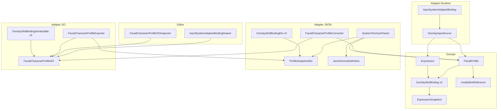
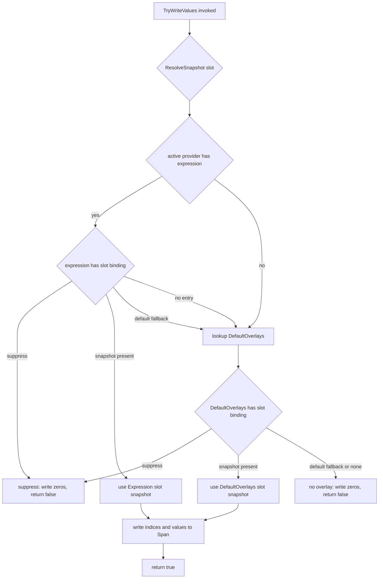
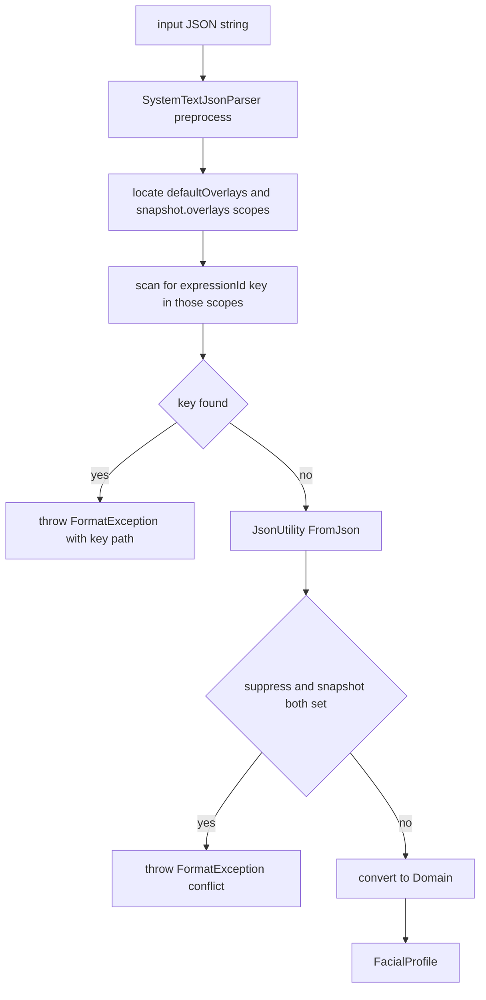
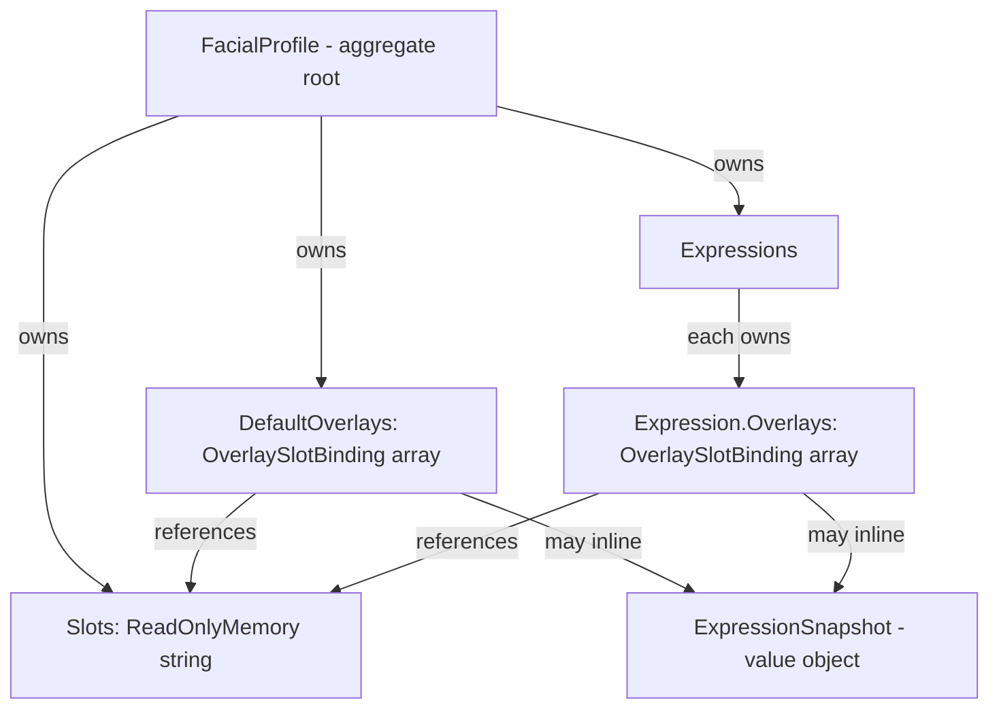
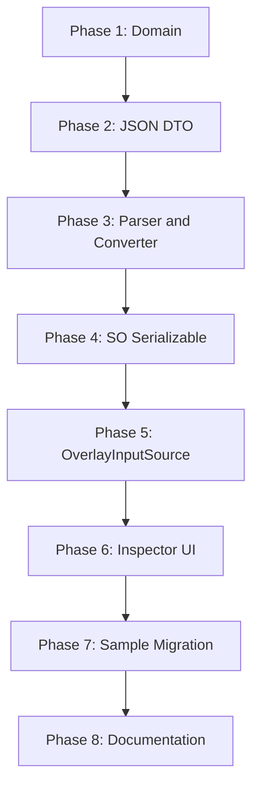

# Technical Design Document: overlay-clip-redesign

## Overview

**Purpose**: 本仕様は preview.2 段階で Overlay 機能をスキーマレベルから刷新する破壊的変更である。Overlay の意味論を「Expression が指す `expressionId`」から「`FacialProfile.Slots` を真実とし、Expression と DefaultOverlays がそれぞれ slot ごとに 3 状態 (default fallback / 明示 suppress / 個別 `ExpressionSnapshot` override) を表明するモデル」へ再設計する。

**Users**: Unity エンジニア (FacialControl パッケージの利用者) は、本変更により Inspector 上で 1 Expression あたりの overlay 設定を slot 単位の 3 状態 UI として直接編集でき、`blink_overlay` のような中間 Expression を別エントリとして抱えずに済む。VTuber 配信ワークフローでは AnimationClip + cachedSnapshot のベイクパイプラインに統合されたまま、per-frame GC ゼロ契約も維持される。

**Impact**: Domain (`OverlaySlotBinding`, `FacialProfile`, `Expression`) → JSON DTO / Parser / Converter → SO Serializable / Exporter → Inspector UI (4 タブ → 6 タブ) → Sample 資産 (`MultiSourceBlendDemo`) → 全関連テスト (7 既存系統 + Inspector UI 新規) を一貫して刷新する。旧 `expressionId` フィールドは Parser PreProcessor で明示拒否し、自動マイグレーションは提供しない。

### Goals

- `OverlaySlotBinding` を `(slot, suppress, ExpressionSnapshot?)` の 3 状態値型として再定義し、型レベルで矛盾組み合わせ (`suppress=true && snapshot!=null`) を排除する。
- `FacialProfile.Slots` を Adapter Bindings の `overlaySlot` / `Expression.Overlays` / `FacialProfile.DefaultOverlays` の単一の真実とする。
- JSON の旧 `expressionId` フィールドを Parser PreProcessor 段階で `FormatException` として拒否し、`JsonUtility` の silent drop による移行漏れを防止する。
- Inspector を 4 タブ (表情 / 目線 / Adapter Bindings / Debug) から 6 タブ (表情ライブラリ / レイヤー / ベース表情 / 目線 / Adapter Bindings / Debug) に再編し、表情ライブラリタブに Slots 宣言・Default Overlays・Overlays 3 状態 UI を集約する。
- `OverlayInputSource` の per-frame ヒープアロケーションをゼロのまま維持し、PlayMode Performance テストで自動検証する。

### Non-Goals

- 旧 `expressionId` ベース overlay からの自動マイグレーション (preview.2 で明示的に非対応)。
- ARKit / InputSystem / OSC のロジック変更 (`overlaySlot` 参照箇所の更新のみ許容)。
- リップシンク・Timeline 統合・新規通信プロトコル対応。
- ランタイム UI 提供 (Editor 拡張のみ)。
- preview.3 以降での `Slots` を `HashSet` 化する大規模 Slots 環境向け最適化 (preview.2 では `ReadOnlyMemory<string>` + 線形検索で十分)。

## Boundary Commitments

### This Spec Owns

- **Domain 層の overlay モデル一新**: `OverlaySlotBinding` 型再定義、`FacialProfile.Slots` の追加、`InvalidSlotReference` 値型、`FacialProfile.ValidateSlotReferences()` の実装。
- **JSON スキーマの破壊的変更**: `OverlaySlotBindingDto` / `ProfileSnapshotDto.slots` / `JsonSchemaDefinition` 定数、Parser の旧 `expressionId` 検出 PreProcessor、`SystemTextJsonParser` / `FacialCharacterProfileConverter` の双方向変換。
- **SO シリアライズと Editor 専用エクスポート**: `OverlaySlotBindingSerializable` の新フィールド (`AnimationClip` + `cachedSnapshot` + `suppress`)、`FacialCharacterProfileSO._slots`、`FacialCharacterProfileExporter` の overlay clip サンプリング統合。
- **Inspector UI 6 タブ再編**: `FacialCharacterProfileSOInspector` のタブ分離、Slots 宣言セクション・Default Overlays セクション・Expression 行 Overlays 3 状態 UI、`InputSystemAdapterBindingDrawer` の `overlaySlot` dropdown 化。
- **OverlayInputSource の snapshot 引きへの書き換えと per-frame GC ゼロ維持**: `_resolvedBySlot` 構造への置換、PlayMode Performance テストの方法論定義。
- **Sample 資産の新スキーマ移行**: `MultiSourceBlendDemoCharacter.asset` / `Assets/StreamingAssets/.../profile.json` / `Packages/.../Samples~/.../profile.json` の同期更新と `blink_overlay` の snapshot inline 化。
- **テスト書き換え/新規追加**: 既存 7 系統のテスト書き換えと Inspector UI 用 EditMode テスト・PlayMode Performance テストの新規追加。

### Out of Boundary

- 旧 `expressionId` JSON / `OverlaySlotBindingSerializable` からのランタイム自動変換 (preview.2 では明示的に拒否)。
- ARKit / InputSystem / OSC アダプタの内部ロジック (overlaySlot 参照箇所の更新のみで、入力解析・送受信ロジックは触らない)。
- Timeline 統合、リップシンク用入力プロトコル、Renderer 切り替えなど隣接機能。
- preview.3 以降で予定される Sample Import フロー一本化 (現状は二重管理ルールを維持)。

### Allowed Dependencies

- **Domain (Unity 非依存)**: `Hidano.FacialControl.Domain.Models.{Expression, ExpressionSnapshot, FacialProfile, BlendShapeSnapshot, BoneSnapshot, InvalidLayerReference}`。新規 `InvalidSlotReference` は同名前空間に追加する。
- **Adapter (JSON)**: `JsonUtility` (Unity 標準)。System.Text.Json 等の追加依存は導入しない (steering tech.md "JSON パースは `JsonUtility` ベース" を遵守)。
- **Adapter (SO)**: `UnityEngine.AnimationClip` + Editor 専用 `AnimationClipSampler` (既存)。Exporter は Editor asmdef のみ。
- **Editor (Inspector)**: UI Toolkit (`UnityEditor.UIElements`)、既存 `BuildArrayListView` 等の共通ビルダ。IMGUI を新規 UI に使わない (steering tech.md)。
- **InputSystem 連携**: `Packages/com.hidano.facialcontrol.inputsystem` から本パッケージへの参照のみ許容 (逆方向は禁止)。

### Revalidation Triggers

以下のいずれかが発生した場合、依存 spec / 利用者は再検証する。

- `OverlaySlotBinding` のフィールド構造変更 (本 spec で 1 度実施)。
- `FacialProfile` ctor シグネチャの変更 (本 spec で `slots` 引数を追加)。
- JSON スキーマ (`profile.json` 構造) の変更 (本 spec で破壊的変更)。
- `OverlayInputSource` の per-frame GC ゼロ契約の前提 (`_resolvedBySlot` 構造) を破る変更。
- Inspector タブ ID 定数 (`TabExpressionsName` 等) の改名 (派生 Inspector に波及)。

## Architecture

### Existing Architecture Analysis

- **クリーンアーキテクチャ**: Domain → Application → Adapters → Editor の片方向依存を asmdef で強制。本 spec の変更も同方向に伝搬する (Domain → JSON → SO → Inspector)。
- **既存パターンを最大限再利用**: `ExpressionSnapshot` は readonly struct として独立済み (`Runtime/Domain/Models/ExpressionSnapshot.cs:20-136`)、`OverlaySlotBinding.Snapshot` 型に直接採用。`FacialProfile` 防御的コピー (lines 131-140) と Dictionary 事前展開 (`_resolvedById`) パターンも継続。
- **Inspector の派生 hook**: `FacialCharacterProfileSOInspector` は `OnBuildPreLayersSections` (line 241) hook を持ち、InputSystem パッケージ側の派生 Inspector 影響を局所化できる。
- **JSON は `JsonUtility`**: `SystemTextJsonParser` の名前に反して System.Text.Json は使わない。`JsonUtility` は未知フィールドを silent drop するため、旧 `expressionId` 検出は文字列レベル PreProcessor が唯一の経路 (research.md Risk 4 / Carry-Forward Item 5)。
- **既存 `OverlayInputSource` の GC ゼロ契約**: ctor で `_resolvedById` を事前構築し、毎フレームは Dictionary lookup + `int[]/float[]` 配列直書きで完結 (`Runtime/Adapters/InputSources/OverlayInputSource.cs:91-97, 104-144`)。本 spec ではこのパターンを `_resolvedBySlot` に拡張するのみ。

### Architecture Pattern & Boundary Map



**Architecture Integration**:
- **Selected pattern**: 既存クリーンアーキテクチャをそのまま継続 (Domain → JSON → SO → Inspector → Adapter 実行時)。本 spec は構造変更ではなく型刷新。
- **Domain/feature boundaries**: `OverlaySlotBinding` 型と `FacialProfile.Slots` の所有者は Domain。JSON DTO / SO Serializable は Adapter 層が翻訳。Inspector は Editor 層がビュー。
- **Existing patterns preserved**: `ExpressionSnapshot` 値型再利用 / 防御的コピー / Dictionary 事前展開 / `BitArray` mask キャッシュ / `cachedSnapshot` ベイクパターン / `_layerNameChoices` 動的候補リスト / タブ ID 定数。
- **New components rationale**: `InvalidSlotReference` (`InvalidLayerReference` の兄弟、Slots 整合性違反を表現)、6 タブ用の新セクションビルダ群 (`BuildSlotsDeclarationSection`, `BuildDefaultOverlaysSection`, `BuildOverlaysSectionForExpression`)、`OverlayInputSource._resolvedBySlot` (3 状態解決を slot 単位で事前展開)。
- **Steering compliance**: Unity 標準ログのみで例外を伝搬 (Debug.LogWarning)、Editor は UI Toolkit、毎フレーム GC ゼロ目標、JsonUtility 縛り、asmdef 依存方向を維持。

### Technology Stack

| Layer | Choice / Version | Role in Feature | Notes |
|-------|------------------|-----------------|-------|
| Domain | C# 9 (Unity 6000.3.2f1 同梱) `readonly struct` | `OverlaySlotBinding` を不変値型として再定義、`Nullable<ExpressionSnapshot>` で 3 状態を表現 | research.md Carry-Forward Item 1 で boxing リスクを評価済 (Decision Log §D2 参照) |
| Adapter (JSON) | `UnityEngine.JsonUtility` | DTO 双方向変換 | 未知フィールド silent drop の制約があるため Preprocessor 段階で `expressionId` 検出 |
| Adapter (SO) | `ScriptableObject` + `UnityEditor.AnimationClipSampler` (既存 Editor 内ヘルパ) | overlay clip → cachedSnapshot ベイク | Exporter は Editor asmdef のみ |
| Editor UI | UI Toolkit (`UnityEditor.UIElements`) | 6 タブ + Slots 宣言 + 3 状態ラジオ | IMGUI 不使用、`BuildArrayListView` 共通ビルダを再利用 |
| Adapter Runtime | C# 9 + `System.Collections.BitArray` | per-frame GC ゼロを維持した snapshot 引き解決 | LINQ / boxing / `ToArray` 禁止 |
| Tests | `com.unity.test-framework` (1.6.0) + `Unity.PerformanceTesting` (1.0.x) | EditMode TDD 書き換え + PlayMode Performance allocation 検証 | `GC.GetTotalAllocatedBytes(true)` 差分計測 |

steering `tech.md` "Key Libraries" との差分はなし。新規依存パッケージは追加しない。

## File Structure Plan

### Directory Structure

```
Packages/com.hidano.facialcontrol/
├── Runtime/
│   ├── Domain/Models/
│   │   ├── OverlaySlotBinding.cs            # REPL: (slot, expressionId) → (slot, suppress, snapshot)
│   │   ├── FacialProfile.cs                 # MOD: Slots プロパティ + ctor 拡張 + ValidateSlotReferences
│   │   ├── Expression.cs                    # MOD: XML doc 更新 (API 互換)
│   │   └── InvalidSlotReference.cs          # NEW: Slots 整合性違反値型
│   ├── Adapters/Json/
│   │   ├── Dto/OverlaySlotBindingDto.cs     # REPL: expressionId → suppress + snapshot
│   │   ├── Dto/ProfileSnapshotDto.cs        # MOD: slots: List<string> 追加
│   │   ├── JsonSchemaDefinition.cs          # MOD: Slots 定数 + OverlaySlot 定数刷新 + SampleProfileJson
│   │   └── SystemTextJsonParser.cs          # MOD: ConvertOverlaySlotBindings + RejectLegacyExpressionId Preprocessor
│   ├── Adapters/ScriptableObject/
│   │   ├── FacialCharacterProfileSO.cs      # MOD: _slots: List<string> 追加
│   │   └── Serializable/
│   │       ├── OverlaySlotBindingSerializable.cs  # REPL: 新 4 フィールド構造
│   │       └── FacialCharacterProfileConverter.cs # MOD: ConvertOverlays + ToFacialProfile シグネチャ拡張
│   └── Adapters/InputSources/
│       └── OverlayInputSource.cs            # REPL: _resolvedById → _resolvedBySlot + snapshot 引き
├── Editor/
│   ├── AutoExport/
│   │   └── FacialCharacterProfileExporter.cs  # MOD: overlay clip サンプリングを統合
│   └── Inspector/
│       └── FacialCharacterProfileSOInspector.cs  # MOD: 4 タブ → 6 タブ + 新セクションビルダ群
└── Tests/
    ├── EditMode/
    │   ├── Domain/
    │   │   ├── OverlaySlotBindingTests.cs                  # REPL: 3 状態
    │   │   └── FacialProfileSlotsTests.cs                  # NEW: Slots 整合性
    │   ├── Adapters/
    │   │   ├── InputSources/OverlayInputSourceTests.cs     # REPL: snapshot 引き
    │   │   └── Json/SystemTextJsonParserOverlaysTests.cs   # REPL: 旧フィールド拒否
    │   ├── Application/
    │   │   ├── LayerUseCaseOverlayLayerTests.cs            # REPL: 新スキーマ
    │   │   ├── LayerUseCaseAnalogOverlayTests.cs           # REPL: 新スキーマ
    │   │   ├── LayerUseCaseAnalogExpressionAdditionTests.cs# REPL: 新スキーマ
    │   │   └── ExpressionUseCaseActiveProviderTests.cs     # REPL: 新スキーマ
    │   └── Editor/Inspector/
    │       ├── OverlaysTabUITests.cs                       # NEW: 3 状態 UI / AnimationClip / Slots 整合性
    │       └── SampleAssetsAreInSyncTests.cs               # NEW: dev/Samples~ drift 検出
    └── PlayMode/Performance/
        └── OverlayInputSourcePerformanceTests.cs           # NEW: per-frame allocation = 0 検証

Packages/com.hidano.facialcontrol.inputsystem/
├── Runtime/Adapters/AdapterBindings/InputSystemAdapterBinding.cs  # MOD: BuildOverlaySources で Slots 検証 + warning
└── Editor/AdapterBindings/InputSystemAdapterBindingDrawer.cs      # MOD: overlaySlot を DropdownField 化

FacialControl/
├── Assets/Samples/FacialControl InputSystem/0.1.0-preview.2/Multi Source Blend Demo/
│   └── MultiSourceBlendDemoCharacter.asset                # MOD: _slots + 新 OverlaySlotBindingSerializable
├── Assets/StreamingAssets/FacialControl/MultiSourceBlendDemoCharacter/
│   └── profile.json                                        # MOD: 新スキーマ (slots + snapshot inline)
└── Packages/com.hidano.facialcontrol.inputsystem/Samples~/MultiSourceBlendDemo/StreamingAssets/FacialControl/MultiSourceBlendDemoCharacter/
    └── profile.json                                        # MOD: dev 側と同期 (canonical 配布)
```

### Modified Files

主要な改修対象は本セクション末尾の Components & Interfaces で詳述する。各ファイルの責務は **1 つに留める** ことを徹底し、Inspector 6 タブ再編は `FacialCharacterProfileSOInspector` 内の private メソッド分離で吸収する (新規 .cs 追加は最小化)。

## System Flows

### Overlay 解決フロー (per-frame, OverlayInputSource)



**Key decisions** (フローの prose 化を最小化):
- ctor 時に Expression 個別 snapshot と DefaultOverlays snapshot を `(exprId, slot)` 複合キーで事前展開し、毎フレームの解決は Dictionary lookup + 配列直書きのみで完結する (GC ゼロ)。
- `slot` が `_profile.Slots` に未宣言なら ctor 時に 1 度だけ `Debug.LogWarning` を出し、当該 slot は no-op として `_emptyMask` を返す (Req 3.6)。
- 矛盾組み合わせ (`suppress=true && snapshot!=null`) は Domain ctor で既に拒否されているため、解決経路に到達しない。

### JSON パース時の旧フィールド拒否フロー



**Key decisions**:
- スコープ判定は文字列レベル走査で行う。`gaze_configs[].expressionId` / `_gazeConfigs[].expressionId` は維持対象なので除外する (Carry-Forward Item 5 解決、§D5 参照)。
- 矛盾組み合わせ検出は DTO レベル (Preprocessor の後) で実施。Parser 側で 2 段階に分けることで、エラーメッセージを「フィールド名」と「論理矛盾」で区別できる。

## Requirements Traceability

| Requirement | Summary | Components | Interfaces | Flows |
|-------------|---------|------------|------------|-------|
| 1.1 | FacialProfile.Slots プロパティ | `FacialProfile` | `FacialProfile.Slots: ReadOnlyMemory<string>` | - |
| 1.2 | Slots 空コレクション初期化 | `FacialProfile` | ctor 防御的コピー | - |
| 1.3 | Overlays 整合性検証 | `FacialProfile`, `InvalidSlotReference` | `ValidateSlotReferences()` | - |
| 1.4 | Slots 重複検出 | `FacialProfile` | `ValidateSlotReferences()` | - |
| 1.5 | Adapter Bindings 権威ソース | `FacialProfile.Slots`, `InputSystemAdapterBinding` | `Slots` | - |
| 2.1-2.7 | OverlaySlotBinding 3 状態モデル | `OverlaySlotBinding` | ctor `(slot, suppress, snapshot)`, `Suppress`, `Snapshot`, `IsDefaultFallback` | - |
| 3.1-3.4 | OverlayInputSource 解決経路 4 種 | `OverlayInputSource` | `TryWriteValues`, `ResolveSnapshot` | Overlay 解決フロー |
| 3.5 | per-frame GC ゼロ | `OverlayInputSource` | `_resolvedBySlot` 事前展開 | - |
| 3.6 | 未宣言 slot の警告ログ | `OverlayInputSource` | ctor 時 `Debug.LogWarning` | - |
| 4.1-4.8 | JSON DTO + Parser + Converter | `ProfileSnapshotDto`, `OverlaySlotBindingDto`, `SystemTextJsonParser`, `JsonSchemaDefinition`, `FacialCharacterProfileConverter` | DTO フィールド, `ConvertOverlaySlotBindings`, `RejectLegacyExpressionId` | JSON 拒否フロー |
| 5.1-5.7 | SO Serializable + Exporter | `OverlaySlotBindingSerializable`, `FacialCharacterProfileSO`, `FacialCharacterProfileExporter` | フィールド + `SampleAnimationClipsIntoCachedSnapshots` | - |
| 6.1-6.11 | Inspector 6 タブ + Overlays 3 状態 UI | `FacialCharacterProfileSOInspector`, `InputSystemAdapterBindingDrawer` | `BuildExpressionLibraryTab` 等 + DropdownField | - |
| 7.1-7.7 | Sample データ移行 | Sample assets (.asset / profile.json x2) | - | - |
| 8.1-8.5 | 後方互換非対応 | `SystemTextJsonParser`, `OverlaySlotBinding`, `OverlaySlotBindingSerializable`, CHANGELOG | `RejectLegacyExpressionId` | JSON 拒否フロー |
| 9.1-9.4 | per-frame GC ゼロ + 自動検証 | `OverlayInputSource`, `OverlayInputSourcePerformanceTests` | PlayMode allocation 計測 | - |
| 10.1-10.5 | ARKit/InputSystem/OSC 影響限定 | `InputSystemAdapterBinding`, ARKit/OSC 経路 (確認のみ) | `Slots` 参照のみ | - |
| 11.1-11.10 | テスト書き換え + Inspector UI テスト | 全テストファイル | - | - |

## Components and Interfaces

### Summary

| Component | Domain/Layer | Intent | Req Coverage | Key Dependencies (P0/P1) | Contracts |
|-----------|--------------|--------|--------------|--------------------------|-----------|
| `OverlaySlotBinding` | Domain/Models | 3 状態 overlay binding 値型 | 2.1-2.7, 8.2 | `ExpressionSnapshot` (P0) | State |
| `FacialProfile` (拡張) | Domain/Models | Slots 真実 + 整合性検証 | 1.1-1.5 | `OverlaySlotBinding` (P0), `InvalidSlotReference` (P1) | State |
| `InvalidSlotReference` | Domain/Models | Slots 整合性違反値型 | 1.3, 1.4 | (none) | State |
| `OverlaySlotBindingDto` | Adapter/Json | 新 JSON DTO | 4.2, 4.4, 8.1 | `ExpressionSnapshotDto` (P0) | API |
| `ProfileSnapshotDto` (拡張) | Adapter/Json | slots フィールド追加 | 4.1 | (none) | API |
| `SystemTextJsonParser` (拡張) | Adapter/Json | 新スキーマ + 旧フィールド拒否 | 4.3, 4.4, 4.5, 4.7, 4.8, 8.1 | `OverlaySlotBindingDto` (P0), `JsonSchemaDefinition` (P0) | Service |
| `JsonSchemaDefinition` (拡張) | Adapter/Json | 定数 + サンプル更新 | 4.6 | (none) | State |
| `OverlaySlotBindingSerializable` | Adapter/SO | SO シリアライズ + clip 参照 | 5.1, 8.3 | `AnimationClip` (P0), `ExpressionSnapshotDto` (P0) | State |
| `FacialCharacterProfileSO` (拡張) | Adapter/SO | _slots 追加 | 5.2, 1.5 | (none) | State |
| `FacialCharacterProfileConverter` (拡張) | Adapter/SO | 双方向変換 + slots 引き渡し | 4.7, 5.1, 5.2 | DTO + Serializable (P0) | Service |
| `FacialCharacterProfileExporter` (拡張) | Editor (Editor asmdef) | overlay clip サンプリング統合 | 5.3, 5.4, 5.5, 5.6, 5.7 | `AnimationClipSampler` (P0) | Batch |
| `OverlayInputSource` (REPL) | Adapter/InputSources | snapshot 引き解決 + GC ゼロ | 3.1-3.6, 9.1-9.3 | `FacialProfile`, `IActiveExpressionProvider` (P0) | Service |
| `FacialCharacterProfileSOInspector` (REPL) | Editor/Inspector | 6 タブ + Overlays 3 状態 UI | 6.1-6.11 | UI Toolkit (P0), `_layerNameChoices` (P1) | UI |
| `InputSystemAdapterBindingDrawer` (拡張) | InputSystem Editor | overlaySlot dropdown 化 | 6.11, 10.5 | `FacialCharacterProfileSO._slots` (P0) | UI |
| `InputSystemAdapterBinding` (微修正) | InputSystem Adapter | Slots 検証 + warning | 10.1, 10.2, 1.5 | `FacialProfile.Slots` (P0) | Service |

### Domain / Models

#### OverlaySlotBinding (REPL)

| Field | Detail |
|-------|--------|
| Intent | slot に対する 3 状態 overlay binding を不変表現する readonly struct |
| Requirements | 2.1, 2.2, 2.3, 2.4, 2.5, 2.6, 2.7, 8.2 |

**Responsibilities & Constraints**
- 不変値型として `(string Slot, bool Suppress, ExpressionSnapshot? Snapshot)` を保持。
- ctor は (i) `slot` が空文字なら `ArgumentException`、(ii) `Suppress=true && Snapshot!=null` なら `ArgumentException` で構築拒否。
- `IsDefaultFallback => !Suppress && !Snapshot.HasValue` を計算プロパティで提供。
- 旧 `ExpressionId` プロパティ・旧 ctor は型から完全削除する。

**Dependencies**
- Inbound: `Expression.Overlays`, `FacialProfile.DefaultOverlays` (P0)
- Outbound: `ExpressionSnapshot` (P0)

**Contracts**: State [x]

##### State Management
- 構築後 immutable。`Equals` / `GetHashCode` は `Slot` (Ordinal) と `Suppress` と `Snapshot.HasValue ? Snapshot.Value : default` で構成する。
- `Snapshot.GetHashCode` は `Snapshot` 自体に既存実装あり (`ExpressionSnapshot` は IEquatable で値同等)。
- `ToString` は `IsSuppress` / `IsDefaultFallback` / `snapshot inline` の 3 表現を出し分ける。

**Implementation Notes**
- Integration: research.md `Runtime/Domain/Models/OverlaySlotBinding.cs:1-74` を全置換。`IsSuppress` プロパティは `Suppress` フィールドへ単純 alias 化 (互換 API は残さない)。
- Validation: `OverlaySlotBindingTests` で 3 状態構築 + 矛盾組合せ拒否 + Equals 4 ケースを観測。
- Risks: research.md Carry-Forward Item 2 の `Nullable<ExpressionSnapshot>` boxing 懸念 → §D2 で Nullable<T> + struct value 直接保持を採用 (Dictionary value direct copy で boxing 不発生)。

#### FacialProfile (MOD)

| Field | Detail |
|-------|--------|
| Intent | Slots を真実とし、Overlays/DefaultOverlays の整合性検証を提供する |
| Requirements | 1.1, 1.2, 1.3, 1.4, 1.5 |

**Responsibilities & Constraints**
- `Slots: ReadOnlyMemory<string>` プロパティ追加。`research.md` Carry-Forward Item 1 結論に基づき `ReadOnlyMemory<string>` で十分 (preview.2 想定 Slots 数: 数〜十数程度、線形検索 O(N) で許容)。preview.3 以降で `Slots × Expressions × DefaultOverlays = O(S × (E × S + S))` がボトルネックになれば `HashSet` 化を検討 (§D1 参照)。
- ctor シグネチャ拡張: `FacialProfile(string id, LayerDefinition[] layers, Expression[] expressions, string[] gazeConfigs, InputSourceDeclaration[][] inputs, OverlaySlotBinding[] defaultOverlays, string[] slots)`。**named argument 強制**で呼び出し側の破壊度を緩和する (research.md Risk 5)。
- 防御的コピー: `slots` 引数を `string[]` で受け取り内部 `string[]` にコピー → `ReadOnlyMemory<string>(_slots)` を公開。null は `Array.Empty<string>()` 正規化。
- `ValidateSlotReferences()`: (i) `Slots` 内重複 → `InvalidSlotReference(Slot, "Duplicate")`、(ii) `Expression.Overlays[i].Slot` / `DefaultOverlays[i].Slot` のうち `Slots` に存在しないもの → `InvalidSlotReference(Slot, "Undeclared")` を返す `IReadOnlyList<InvalidSlotReference>`。

**Dependencies**
- Inbound: 全 Application UseCase, JSON Parser, SO Converter (P0)
- Outbound: `OverlaySlotBinding`, `InvalidSlotReference` (P0)

**Contracts**: State [x]

**Implementation Notes**
- Integration: `Runtime/Domain/Models/FacialProfile.cs:42-46, 131-140, 149-167, 173-200` を拡張。`TryGetDefaultOverlay` は API 互換 (`OverlaySlotBinding` 型シグネチャは維持)。
- Validation: `FacialProfileSlotsTests` (NEW) で初期化・重複検出・Overlays/DefaultOverlays 整合性違反検出を Red→Green。
- Risks: ctor 破壊変更が約 30+ 箇所に波及。Phase 順序で named arg を強制し赤期間を Phase 1 に閉じ込める。

#### InvalidSlotReference (NEW)

| Field | Detail |
|-------|--------|
| Intent | Slots 整合性違反 (重複 / 未宣言参照) を表す値型 |
| Requirements | 1.3, 1.4 |

**Responsibilities & Constraints**
- `(string Slot, string Reason)` を保持する readonly struct。`Reason` は `"Duplicate"` / `"Undeclared"` のいずれか。
- `InvalidLayerReference` の兄弟として同じ XML doc / Equality パターンを採用。

**Contracts**: State [x]

### Adapter / Json

#### OverlaySlotBindingDto (REPL)

| Field | Detail |
|-------|--------|
| Intent | overlay binding の JSON 表現 (新 3 フィールド) |
| Requirements | 4.2, 4.4, 8.1 |

**Responsibilities & Constraints**
- フィールド: `slot: string`, `suppress: bool`, `snapshot: ExpressionSnapshotDto`。`expressionId` フィールドは型から完全削除。
- `JsonUtility` 互換のため `[Serializable]` クラス (struct ではなく class) を維持。

**Sample JSON**:
```json
{
  "slot": "blink",
  "suppress": false,
  "snapshot": {
    "id": "",
    "transitionDuration": 0.0,
    "blendShapes": [
      {"name": "Blink_L", "value": 1.0},
      {"name": "Blink_R", "value": 1.0}
    ],
    "bones": [],
    "rendererPaths": []
  }
}
```

3 状態の JSON 表現:
- **default fallback**: `{"slot": "blink", "suppress": false, "snapshot": null}`
- **suppress**: `{"slot": "blink", "suppress": true, "snapshot": null}`
- **snapshot override**: 上記サンプルのとおり (`suppress: false`, `snapshot: {...}`)

#### ProfileSnapshotDto (MOD)

| Field | Detail |
|-------|--------|
| Intent | プロファイルスナップショットに `slots` 配列追加 |
| Requirements | 4.1 |

**Responsibilities & Constraints**
- `slots: List<string>` フィールドを追加 (既存 `defaultOverlays`, `expressions`, `gazeConfigs` と同階層)。
- `NormalizeProfileSnapshotDto` で `null → new List<string>()` 正規化を行い、欠落 JSON を空 Slots として読める。

#### JsonSchemaDefinition (MOD)

| Field | Detail |
|-------|--------|
| Intent | スキーマ定数とドキュメント用 SampleProfileJson 更新 |
| Requirements | 4.6 |

**Responsibilities & Constraints**
- `JsonSchemaDefinition.Profile.Slots = "slots"` 新規追加。
- `JsonSchemaDefinition.Profile.OverlaySlot.ExpressionId` 削除、`Suppress = "suppress"` / `Snapshot = "snapshot"` 追加。
- `SampleProfileJson` (research.md `JsonSchemaDefinition.cs:292-357`) を新スキーマで全置換。`blink_overlay` の例は `smile.snapshot.overlays[0]` に snapshot 直書き。

#### SystemTextJsonParser (MOD)

| Field | Detail |
|-------|--------|
| Intent | 新スキーマ双方向変換 + 旧 expressionId 拒否 + 矛盾組合せ拒否 |
| Requirements | 4.3, 4.4, 4.5, 4.7, 4.8, 8.1 |

**Responsibilities & Constraints**
- `Parse(string json)` の最初に `RejectLegacyExpressionIdInOverlays(json)` を実行。
- DTO → Domain 変換で `OverlaySlotBindingDto.suppress && snapshot != null` 検出時は `FormatException("OverlaySlotBinding for slot '{slot}' has both suppress=true and a non-null snapshot.")`。
- `ConvertToProfile` (research.md `SystemTextJsonParser.cs:619-628`) で `dto.slots` を `FacialProfile` ctor の `slots` named arg に渡す。

##### Service Interface (RejectLegacyExpressionIdInOverlays)

```csharp
internal static class LegacyOverlayFieldDetector
{
    public static void RejectLegacyExpressionIdInOverlays(string json);
}
```

- **Preconditions**: `json` は `JsonUtility` でパース可能な合法な JSON 文字列。
- **Postconditions**: `defaultOverlays` 配列内 / `expressions[].snapshot.overlays` 配列内に `"expressionId"` キーが存在しなければ何も起きない。存在すれば `FormatException` を throw する。エラーメッセージは `"Legacy field 'expressionId' detected in OverlaySlotBinding scope (path={path}). preview.2 で削除されたフィールドです。"` 形式。
- **Invariants**: `gaze_configs[].expressionId` / `_gazeConfigs[].expressionId` などの他スコープは検出対象外。

**Algorithm** (research.md Carry-Forward Item 5 解決、§D5 Decision Log 参照):

検出は `JsonUtility` で構造解析せず、軽量な状態機械で行う。

1. JSON 文字列を 1 文字ずつ走査し、ネストしたオブジェクト / 配列のキーパス (path stack) を維持する。
2. キーパスが下記いずれかにマッチする状態で配列要素として入ったオブジェクトの直下キーを `"expressionId"` で検出する:
   - `defaultOverlays[N]`
   - `expressions[N].snapshot.overlays[N]`
3. 下記スコープでは検出しない (黒リスト):
   - `gaze_configs[N]`, `_gazeConfigs[N]`, `gazeConfigs[N]`
   - `expressions[N].snapshot.id` 等 overlays 以外
4. ヒット時は path 文字列 (例: `defaultOverlays[0].expressionId`) を含む `FormatException` を throw。

**Edge cases**:
- ネストした overlays (理論上は ExpressionSnapshot.overlays は持たないが、防御的に scope chain で判定)。
- escaped key (`"expressionId"` に escape は入らないが `\"expressionId\"` 文字列値は false-positive を避ける必要があるため、必ずキー位置で判定する)。

**Dependencies**
- Inbound: `Parse` 呼び出し元 (Editor / Runtime / テスト) (P0)
- Outbound: `ProfileSnapshotDto`, `OverlaySlotBindingDto`, `JsonUtility` (P0)

**Contracts**: Service [x]

#### FacialCharacterProfileConverter (MOD)

| Field | Detail |
|-------|--------|
| Intent | SO ↔ Domain ↔ DTO の 3 方向変換で slots と新 overlays を翻訳 |
| Requirements | 4.7, 5.1, 5.2 |

**Responsibilities & Constraints**
- `ToFacialProfile(SO so)` シグネチャ拡張: 内部で `so._slots` を `FacialProfile` ctor に渡す。
- `ConvertOverlays(IList<OverlaySlotBindingSerializable> serializables)` を新型化:
  - `serializable.suppress=true` → `new OverlaySlotBinding(slot, suppress: true, snapshot: null)`
  - `serializable.suppress=false && cachedSnapshot.IsEmpty()` → `new OverlaySlotBinding(slot, suppress: false, snapshot: null)` (default fallback)
  - `serializable.suppress=false && cachedSnapshot 有効` → `cachedSnapshot` を `ExpressionSnapshot` に再構築して inline。
- 逆方向 (Domain → DTO) は `OverlaySlotBindingDto` を出力時に `Snapshot` を Dto 化する既存ヘルパ (`ConvertSnapshotBlendShapes` パターン、research.md `FacialCharacterProfileConverter.cs:229-241`) を流用。

### Adapter / ScriptableObject

#### OverlaySlotBindingSerializable (REPL)

| Field | Detail |
|-------|--------|
| Intent | SO シリアライズ用 4 フィールド構造 |
| Requirements | 5.1, 8.3 |

**Responsibilities & Constraints**
- フィールド: `slot: string`, `suppress: bool`, `animationClip: AnimationClip`, `cachedSnapshot: ExpressionSnapshotDto`。
- 旧 `expressionId` フィールドは完全削除 (Unity SerializedField は型から消すと旧 .asset 上のキーを silent drop するが、本仕様は preview.2 破壊的変更なので問題なし)。
- `[Serializable]` クラス。Tooltip は新セマンティクスに合わせて更新 (`"suppress=true で AnimationClip と cachedSnapshot は無視されます"`)。

**Implementation Notes**
- Integration: research.md `Runtime/Adapters/ScriptableObject/Serializable/OverlaySlotBindingSerializable.cs:1-19`。
- Validation: 3 状態 (`Default` / `Suppress` / `Override`) を判定するピュア関数 `OverlaySlotBindingState GetState()` を Serializable 上に追加 (Inspector が UI 状態判定で再利用、テスト容易性向上)。

```csharp
public enum OverlaySlotBindingState { DefaultFallback, Suppress, Override }

public static class OverlaySlotBindingSerializableExtensions
{
    public static OverlaySlotBindingState GetState(this OverlaySlotBindingSerializable s)
    {
        if (s.suppress) return OverlaySlotBindingState.Suppress;
        if (s.animationClip != null) return OverlaySlotBindingState.Override;
        return OverlaySlotBindingState.DefaultFallback;
    }
}
```

#### FacialCharacterProfileSO (MOD)

| Field | Detail |
|-------|--------|
| Intent | _slots: List<string> を真実として保持 |
| Requirements | 5.2, 1.5 |

**Responsibilities & Constraints**
- `[SerializeField] private List<string> _slots = new();` 追加 (research.md `FacialCharacterProfileSO.cs:24` 隣接)。
- `public IReadOnlyList<string> Slots => _slots;` プロパティ追加。
- `BuildFallbackProfile()` (research.md lines 56-60) で `_slots` を `FacialProfile` ctor に渡す。

#### FacialCharacterProfileExporter (MOD, Editor asmdef)

| Field | Detail |
|-------|--------|
| Intent | overlay clip を expression clip と同じパイプラインでサンプリング、cachedSnapshot を更新 |
| Requirements | 5.3, 5.4, 5.5, 5.6, 5.7 |

**Responsibilities & Constraints**
- `FlushAutoExport` 経路 (research.md `FacialCharacterProfileExporter.cs:40-68`) の `SampleAnimationClipsIntoCachedSnapshots` に overlays 走査を追加:
  ```
  for each Expression in SO:
      sample expression.cachedSnapshot from expression.animationClip
      for each overlay in expression.overlays:
          if overlay.suppress: clear overlay.cachedSnapshot
          else if overlay.animationClip != null: sample overlay.cachedSnapshot from overlay.animationClip
          else: clear overlay.cachedSnapshot (default fallback)
      end
  end
  for each defaultOverlay in SO._defaultOverlays:
      same as above
  ```
- サンプリングタイミングは既存 `OnSerializedObjectChanged` → `FlushAutoExport` の debounce 経路に統合。research.md Carry-Forward Item 3 解決 → §D3 Decision Log 参照: 「expression.animationClip と同経路に乗せ、Sample 数 × Slot 数の負荷増加を許容。preview.2 想定の Sample 数 (5-20 Expressions × 数 Slots) であれば既存 debounce で吸収可能」。
- `BuildProfileSnapshotDto` で `dto.slots = SO._slots` および `dto.defaultOverlays` を新スキーマで出力 (research.md は `defaultOverlays` 出力ロジックの欠落を指摘、本 spec で同時に修正)。
- `_slots` 重複 / 未参照 slot の検出時は `Debug.LogWarning` を出力するが、エクスポート自体は継続する (Req 5.7)。

**Contracts**: Batch [x]

##### Batch / Job Contract
- **Trigger**: `OnSerializedObjectChanged` 経由の debounce flush (既存)。
- **Input / validation**: SO の全 Expression + DefaultOverlays の `OverlaySlotBindingSerializable` リスト。各 entry の `(suppress, animationClip)` 組み合わせを上記アルゴリズムで処理。
- **Output / destination**: SO 上の `cachedSnapshot` フィールド + 出力先 JSON ファイル (StreamingAssets 等)。
- **Idempotency & recovery**: 同入力で実行すれば同出力 (AnimationClip サンプリング結果は決定論)。失敗時は `Debug.LogError` を出して中断、SO は読み取り専用扱いに戻す。

### Adapter / InputSources

#### OverlayInputSource (REPL)

| Field | Detail |
|-------|--------|
| Intent | snapshot 引きで 3 状態を解決し、per-frame GC ゼロを維持する |
| Requirements | 3.1-3.6, 9.1, 9.2, 9.3 |

**Responsibilities & Constraints**
- ctor 時に `(exprId, slot)` 複合キーで全 Expression × 該当 Slot の `ResolvedSnapshot` を事前展開する。`DefaultOverlays` 側も `(__default__, slot)` のような特殊キーで同じ Dictionary に格納する (実装は `Dictionary<SlotKey, ResolvedSnapshot>` + 内部 struct `SlotKey`)。
- 毎フレームの `TryWriteValues` は: (i) active expression を取得、(ii) `(activeExpr.Id, _slot)` で TryGetValue、(iii) 未ヒットなら `(__default__, _slot)` で fallback、(iv) `Suppress` なら zero 出力、(v) snapshot 有効なら `Indices/Values/Mask` を output へコピー。

##### Service Interface

```csharp
public sealed class OverlayInputSource : ValueProviderInputSourceBase
{
    public OverlayInputSource(
        InputSourceId id,
        string slot,
        int blendShapeCount,
        IReadOnlyList<string> blendShapeNames,
        FacialProfile profile,
        IActiveExpressionProvider activeProvider,
        string emotionLayerName);

    public override BitArray ContributeMask { get; }
    public override bool TryWriteValues(Span<float> output);
}

internal readonly struct SlotKey : IEquatable<SlotKey>
{
    public readonly string ExpressionId;  // null の場合は DefaultOverlays
    public readonly string Slot;
    // GetHashCode は Slot 主導 (Slot 衝突は稀) で boxing 回避
}

internal readonly struct ResolvedSnapshot
{
    public readonly bool Suppress;
    public readonly bool HasSnapshot;
    public readonly int[] Indices;
    public readonly float[] Values;
    public readonly BitArray Mask;
}
```

- **Preconditions**: `slot` 非空、`profile` non-null、`blendShapeCount >= 0`。
- **Postconditions**: ctor 完了時点で `_resolvedBySlot` は (i) 全 `Expression.Overlays[slot=this._slot]` の override / suppress エントリ、(ii) `DefaultOverlays[slot=this._slot]` の override / suppress エントリを含む。default fallback は Dictionary から省く (lookup miss 経路で fallback と判定)。
- **Invariants**: 毎フレームの `TryWriteValues` 呼び出しで `new` / boxing / LINQ / `ToArray` を一切行わない。`Span<float> output` への直書きと `BitArray.SetAll(false)` のみ。
- **slot 未宣言時**: ctor で `profile.Slots.Span` を線形検索し、`_slot` が見つからなければ `_logged` フラグ付きで `Debug.LogWarning` を 1 度だけ出して `_resolvedBySlot` を空のまま保持。`TryWriteValues` は false を返し続ける (Req 3.6)。

**Dependencies**
- Inbound: `InputSystemAdapterBinding.BuildOverlaySources` (P0)
- Outbound: `FacialProfile`, `Expression`, `IActiveExpressionProvider`, `Span<float>` (P0)

**Contracts**: Service [x]

**Implementation Notes**
- Integration: research.md `Runtime/Adapters/InputSources/OverlayInputSource.cs:1-227` を全置換。`ResolvedExpression` (lines 186-224) は `ResolvedSnapshot` に改名し、入力を `ExpressionSnapshot` に変更。`Build(snapshot, slotKey, nameToIndex, blendShapeCount)` シグネチャへ。
- Validation: `OverlayInputSourceTests` (REPL) で 4 解決経路を観測。`OverlayInputSourcePerformanceTests` (NEW, PlayMode) で 1000 フレーム後の `GC.GetTotalAllocatedBytes(true)` 差分が 0 byte であることを検証。
- Risks: research.md Risk 3 で boxing リスク評価済 → §D2 Decision Log 参照。Dictionary key は `SlotKey` struct で `IEquatable<SlotKey>` 実装、`.GetHashCode` はキャッシュ済み、boxing 不発生。

### Editor / Inspector

#### FacialCharacterProfileSOInspector (REPL タブ構造のみ)

| Field | Detail |
|-------|--------|
| Intent | 6 タブ構成と Overlays 3 状態 UI を提供する |
| Requirements | 6.1, 6.2, 6.3, 6.4, 6.5, 6.6, 6.7, 6.8, 6.9, 6.10 |

**Responsibilities & Constraints**
- タブ ID 定数を 6 個に再定義 (research.md `FacialCharacterProfileSOInspector.cs:47-50`):
  ```
  TabExpressionLibraryName = "ExpressionLibrary"   // NEW
  TabLayersName             = "Layers"              // NEW (旧 TabExpressionsName から分離)
  TabBaseExpressionName     = "BaseExpression"      // NEW (旧 TabExpressionsName から分離)
  TabGazeName               = "Gaze"                // 既存 (改名のみ)
  TabAdapterBindingsName    = "AdapterBindings"     // 既存
  TabDebugName              = "Debug"               // 既存
  ```
- 派生 Inspector (InputSystem 用) との互換は `OnBuildPreLayersSections` hook (research.md line 241) を維持し、新タブ ID への参照差し替えは派生側で別 PR 化する (本 spec の Boundary 外、ただし破壊的なので revalidation trigger に明記)。

**VisualElement 階層**:

```
Root (TabbedView)
├── ExpressionLibraryTab
│   ├── SlotsDeclarationSection (Box)
│   │   ├── Header: "Slots"
│   │   └── BuildArrayListView<string>(_slotsProperty, allowAdd, allowRemove, onRename)
│   ├── DefaultOverlaysSection (Box)
│   │   ├── Header: "Default Overlays"
│   │   └── BuildArrayListView<OverlaySlotBindingSerializable>(...)
│   │       └── 各 row:
│   │           ├── DropdownField (slot, choices = _slotNameChoices)
│   │           └── 3 状態ラジオ + AnimationClipField (条件可視)
│   └── ExpressionListSection (ListView)
│       └── 各 Expression row (BuildExpressionRow):
│           ├── Foldout (expression Id)
│           ├── DropdownField (Layer)
│           └── OverlaysSection (Box)
│               └── 各 declared slot の row:
│                   ├── Label (slot 名)
│                   ├── RadioButtonGroup [Default | Suppress | Override]
│                   └── ObjectField<AnimationClip> (Override 選択時のみ visible)
├── LayersTab (BuildLayersSection を移植)
├── BaseExpressionTab (BuildBaseExpressionSection を移植)
├── GazeTab (既存)
├── AdapterBindingsTab (既存、InputSystemAdapterBindingDrawer 経由)
└── DebugTab (既存)
```

**3 状態ラジオの動作 (BuildOverlaysSectionForExpression)**:
- `RadioButtonGroup` の選択肢は `["Default", "Suppress", "Override"]`。
- 選択値変更時のハンドラ:
  - `Default` → `serializable.suppress = false; serializable.animationClip = null; cachedSnapshot.Clear();`
  - `Suppress` → `serializable.suppress = true; serializable.animationClip = null; cachedSnapshot.Clear();`
  - `Override` → `serializable.suppress = false; ` AnimationClipField を `style.display = Flex` に。
- 初期値判定は `OverlaySlotBindingSerializable.GetState()` (上述拡張メソッド) で行う。
- `Override` 以外で AnimationClipField は `style.display = None` (Req 6.9: 非表示または無効化)。

**Slots 整合性違反警告 (Req 6.10)**:
- Slots 宣言から削除された slot を `Default Overlays` または `Expression.Overlays` が参照している場合、当該 row の先頭に警告アイコン (`HelpBox` の `MessageType.Warning`) を表示。
- 検出は `FacialProfile.ValidateSlotReferences()` の結果を使うが、Inspector レベルでは `_slots` と各 binding の `slot` フィールドを直接比較する軽量版 (`SO レベル ValidateSlots()` ヘルパ) を用意。

**`_slots` 編集時の dropdown 連動 (Req 6.11, research.md Carry-Forward Item 4)**:
- `_slotsProperty` を `TrackPropertyValue` で監視し、変更検知時に `RefreshSlotNameChoices()` → 全 `DropdownField.choices` を再設定。
- `RefreshSlotNameChoices` は `_layerNameChoices` パターン (research.md `FacialCharacterProfileSOInspector.cs:142, 1020`) を踏襲。
- `InputSystemAdapterBindingDrawer` 側の dropdown も同経路で再描画される (PropertyDrawer の `schedule.Execute` で polling、§D4 Decision Log 参照)。

**Contracts**: UI [x] (UI Toolkit)

**Implementation Notes**
- Integration: research.md `Editor/Inspector/FacialCharacterProfileSOInspector.cs:178-205` (タブ構築部) を 6 タブに再編。`BuildLayersSection` (line 973) / `BuildBaseExpressionSection` (line 408) は中身は変更せず移植。
- Validation: `OverlaysTabUITests` (NEW) で `CreateInspectorGUI()` 戻り値の VisualElement に対し `Q<RadioButtonGroup>(name)` / `Q<DropdownField>(name)` で要素検索、3 状態切替・AnimationClip 設定・Slots 整合性違反の警告表示を観測。
- Risks: research.md Risk 2 で UI Toolkit テスト容易性を緩和済 → 状態判定ロジックを `OverlaySlotBindingSerializableExtensions.GetState` に切り出し、Inspector 側は薄いビュー。

#### InputSystemAdapterBindingDrawer (MOD, Editor asmdef of inputsystem パッケージ)

| Field | Detail |
|-------|--------|
| Intent | overlaySlot を Slots 宣言から動的 dropdown 化 |
| Requirements | 6.11, 10.5 |

**Responsibilities & Constraints**
- research.md `InputSystemAdapterBindingDrawer.cs:288, 363-376` の `PropertyField` (TextField) を `DropdownField` に置換。
- choices は `property.serializedObject.targetObject as FacialCharacterProfileSO` を辿って `so.Slots` (List<string>) から動的取得。`so` 取得失敗時 (旧 SO 等) は HelpBox 「FacialCharacterProfileSO の Slots を先に宣言してください」を表示し、dropdown は disabled。
- `_slots` 変更検知は `schedule.Execute(() => RefreshChoices()).Every(intervalMs)` で polling (Req 6.11、research.md Risk 6、§D4 Decision Log 参照)。
- choices 配列再生成は `_slots` 内容が変わった時のみ。`Equals` 比較で no-op をスキップして無駄な GC を抑制。

### Adapter / InputSystem

#### InputSystemAdapterBinding (MOD)

| Field | Detail |
|-------|--------|
| Intent | Slots 検証を加えた overlay source 構築 |
| Requirements | 10.1, 10.2, 1.5 |

**Responsibilities & Constraints**
- research.md `Runtime/Adapters/AdapterBindings/InputSystemAdapterBinding.cs:440-510` の `BuildOverlaySources` 内で `entry.overlaySlot` を `ctx.Profile.Slots.Span` で線形検索し、未ヒットなら `Debug.LogWarning` + skip。
- 既存ロジック (源ID 構築、blendShapeCount 等) は無変更。

**Contracts**: Service [x]

## Data Models

### Domain Model

`OverlaySlotBinding` は値型でアグリゲートを持たないが、`FacialProfile` のアグリゲート境界に内包される。`Slots` は `FacialProfile` が単独で所有し、`Expression.Overlays` / `FacialProfile.DefaultOverlays` は `Slots` を参照する側。整合性検証 (`ValidateSlotReferences`) は `FacialProfile` がアグリゲートルートとして実施する。



**Invariants**:
- `Slots` の要素はすべて非空文字列、Ordinal 比較でユニーク。
- `DefaultOverlays[i].Slot` および `Expressions[j].Overlays[k].Slot` は `Slots` のいずれかと一致する。
- `DefaultOverlays[i].Slot` の集合は `Slots` の部分集合 (一致 or 真部分集合)。
- 1 binding 内で `Suppress=true && Snapshot != null` は構築時に拒否される。

### Logical Data Model

| Entity | Owner | Cardinality | Notes |
|--------|-------|-------------|-------|
| `FacialProfile` | aggregate root | 1 per character | `Slots`, `Expressions[]`, `DefaultOverlays[]`, `Layers[]` etc. |
| `Slots` (string集合) | `FacialProfile` | 0..N strings | Ordinal unique |
| `OverlaySlotBinding` | `FacialProfile.DefaultOverlays[]` または `Expression.Overlays[]` | 0..N per parent | `(slot, suppress, snapshot?)` |
| `ExpressionSnapshot` (inline 値オブジェクト) | `OverlaySlotBinding.Snapshot` | 0..1 | Nullable<T>。HasValue=false で default fallback |

### Data Contracts & Integration

#### JSON Schema (excerpt)

```json
{
  "$schemaVersion": 2,
  "id": "MultiSourceBlendDemoCharacter",
  "slots": ["blink"],
  "layers": [...],
  "expressions": [
    {
      "id": "smile",
      "snapshot": {
        "id": "smile",
        "transitionDuration": 0.25,
        "blendShapes": [...],
        "bones": [],
        "rendererPaths": [],
        "overlays": [
          {
            "slot": "blink",
            "suppress": false,
            "snapshot": {
              "id": "",
              "transitionDuration": 0.0,
              "blendShapes": [
                {"name": "Blink_L", "value": 1.0},
                {"name": "Blink_R", "value": 1.0}
              ],
              "bones": [],
              "rendererPaths": []
            }
          }
        ]
      }
    },
    {
      "id": "smile_closed_eye",
      "snapshot": {
        "id": "smile_closed_eye",
        "transitionDuration": 0.25,
        "blendShapes": [...],
        "bones": [],
        "rendererPaths": [],
        "overlays": [
          {"slot": "blink", "suppress": true, "snapshot": null}
        ]
      }
    }
  ],
  "defaultOverlays": [
    {"slot": "blink", "suppress": false, "snapshot": null}
  ],
  "gazeConfigs": [...]
}
```

#### Serialization Rules

- `slots` 欠落 → 空配列として正規化 (`NormalizeProfileSnapshotDto` に追加)。
- `OverlaySlotBindingDto.snapshot == null` は default fallback または suppress を意味する (`suppress` フィールドで判別)。
- `OverlaySlotBindingDto.snapshot != null && suppress == true` は `FormatException` で拒否。
- `OverlaySlotBindingDto.expressionId` (旧フィールド) は preprocessor で `FormatException`。

## Error Handling

### Error Strategy

steering `tech.md` "Architectural Contracts" に従い、すべての例外は標準例外 + `Debug.Log/Warning/Error` のみ。カスタム例外型は新設しない。

### Error Categories and Responses

- **User Errors (構築時 invalid input)**: `OverlaySlotBinding` ctor で `slot` が空 → `ArgumentException`。`suppress=true && snapshot!=null` → `ArgumentException` "OverlaySlotBinding cannot be both Suppress and have a non-null Snapshot."
- **Schema Errors (JSON 入力不正)**: 旧 `expressionId` フィールド → `FormatException` "Legacy field 'expressionId' detected at path '{path}'"。矛盾組み合わせ → `FormatException`。
- **Runtime Warnings (実行時整合性違反)**:
  - `OverlayInputSource` ctor で `_slot` が `profile.Slots` に未宣言 → `Debug.LogWarning` 1 回。
  - Inspector で参照中 slot が `_slots` から削除された → 当該 row に警告 HelpBox。
  - Exporter で `_slots` 重複 / 未参照 slot → `Debug.LogWarning` (エクスポート継続)。
  - `InputSystemAdapterBinding.BuildOverlaySources` で `entry.overlaySlot` が未宣言 → `Debug.LogWarning` + skip。

### Monitoring

`Profiler.BeginSample("OverlayInputSource.TryWriteValues")` を `OverlayInputSource.TryWriteValues` のエントリに挟み、Profiler で per-frame allocation を観測可能にする (research.md Risk 3 緩和策)。

## Testing Strategy

### EditMode Unit Tests (REPL or NEW)

| File | Coverage | Requirements |
|------|----------|--------------|
| `Tests/EditMode/Domain/OverlaySlotBindingTests.cs` (REPL) | 3 状態構築 / 矛盾組合せ拒否 / Equals / GetHashCode | 2.1-2.7, 8.2 |
| `Tests/EditMode/Domain/FacialProfileSlotsTests.cs` (NEW) | Slots 初期化・重複検出・Overlays/DefaultOverlays 整合性検証 | 1.1-1.5 |
| `Tests/EditMode/Adapters/InputSources/OverlayInputSourceTests.cs` (REPL) | 4 解決経路 (Expression individual / Expression suppress / DefaultOverlays individual / 未解決) + 未宣言 slot warning | 3.1-3.6 |
| `Tests/EditMode/Adapters/Json/SystemTextJsonParserOverlaysTests.cs` (REPL) | 旧 expressionId 拒否 / 矛盾組合せ拒否 / 3 状態 round-trip / SampleProfileJson | 4.3-4.8, 8.1 |
| `Tests/EditMode/Application/LayerUseCaseOverlayLayerTests.cs` (REPL) | 新スキーマで blink_overlay → smile/smile_closed_eye 個別 snapshot シナリオ | 11.3 |
| `Tests/EditMode/Application/LayerUseCaseAnalogOverlayTests.cs` (REPL) | 同上 | 11.4 |
| `Tests/EditMode/Application/LayerUseCaseAnalogExpressionAdditionTests.cs` (REPL) | 同上 | 11.5 |
| `Tests/EditMode/Application/ExpressionUseCaseActiveProviderTests.cs` (REPL) | overlay 経路への参照のみ更新 | 11.6 |
| `Tests/EditMode/Editor/Inspector/OverlaysTabUITests.cs` (NEW) | 3 状態切替 (Default↔Suppress↔Override) / AnimationClip 設定 / Slots 削除時の警告 / Slots 編集時の dropdown 連動 | 6.7-6.10, 11.8 |
| `Tests/EditMode/Editor/Inspector/SampleAssetsAreInSyncTests.cs` (NEW) | dev/Samples~ profile.json テキスト一致 / .asset YAML key set 一致 | 7.5 |

### PlayMode Tests

| File | Coverage | Requirements |
|------|----------|--------------|
| `Tests/PlayMode/Performance/OverlayInputSourcePerformanceTests.cs` (NEW) | 1000 フレーム TryWriteValues 後の `GC.GetTotalAllocatedBytes(true)` 差分 = 0 byte | 9.1-9.4 |

#### PlayMode Performance テスト方法論 (Carry-Forward Item 5 解決)

research.md Risk 3 / Carry-Forward Item 5 で挙げた `Unity.PerformanceTesting` vs `GC.GetTotalAllocatedBytes(true)` 比較の結論 (§D5 Decision Log 参照): **`GC.GetTotalAllocatedBytes(true)` 差分計測を採用**。

- 採用理由: (i) `Unity.PerformanceTesting` は ms 計測寄りで allocation byte の assertion が貧弱、(ii) `GC.GetTotalAllocatedBytes(true)` は .NET 標準で正確、(iii) preview.2 では新規パッケージ依存を避ける (steering tech.md 縛り)。
- テスト構造:
  ```csharp
  [UnityTest]
  public IEnumerator TryWriteValues_1000Frames_AllocatesZeroBytes()
  {
      // Arrange
      var src = BuildOverlayInputSource(...);
      var output = new float[blendShapeCount];
      // Warm-up: 10 frames で JIT 稼働させる
      for (int i = 0; i < 10; i++) { src.TryWriteValues(output); yield return null; }

      // Act
      long before = GC.GetTotalAllocatedBytes(true);
      for (int i = 0; i < 1000; i++) { src.TryWriteValues(output); yield return null; }
      long after = GC.GetTotalAllocatedBytes(true);

      // Assert
      Assert.That(after - before, Is.EqualTo(0L), "per-frame allocation must be zero");
  }
  ```
- スレッショルド: 厳密に 0 byte。`yield return null` 自体の allocation はメインスレッド側で発生するため計測対象外 (TryWriteValues 内のヒープ確保のみが対象)。
- 失敗時のデバッグ: Unity Profiler の Allocation Call Tree で原因を特定。

### Performance / Load

| Item | Target | Measurement |
|------|--------|-------------|
| `OverlayInputSource.TryWriteValues` per-frame allocation | 0 byte | PlayMode テスト (上述) |
| `OverlayInputSource` ctor 構築時間 | < 1 ms (10 Slots × 50 Expressions) | 必要に応じて Profiler で確認 (テスト化は preview.3) |
| Inspector 6 タブ初期描画時間 | < 100 ms (10 Expressions) | 手動確認 |

## Migration Strategy

### Phase ordering (compile-red period containment)



**Phase 詳細** (research.md "(d) 推奨実装順序" を踏襲、合計 12-17 営業日):

1. **Phase 1 (1-2 日, Domain)**: `InvalidSlotReference` 追加 → `OverlaySlotBinding` 全置換 → `FacialProfile` ctor 拡張 + `ValidateSlotReferences` → Domain テスト Red→Green。**コンパイル赤化開始**。
2. **Phase 2 (1 日, JSON DTO)**: `OverlaySlotBindingDto` / `ProfileSnapshotDto.slots` / `JsonSchemaDefinition` 定数。
3. **Phase 3 (2-3 日, Parser)**: `SystemTextJsonParser.ConvertOverlaySlotBindings` / `BuildOverlaySlotBindingDtoList` / `RejectLegacyExpressionIdInOverlays` Preprocessor / `SampleProfileJson` 更新 / `FacialCharacterProfileConverter` シグネチャ拡張 → JSON テスト Red→Green。
4. **Phase 4 (1 日, SO)**: `OverlaySlotBindingSerializable` フィールド置換 / `FacialCharacterProfileSO._slots` / `FacialCharacterProfileExporter` の overlay clip サンプリング。
5. **Phase 5 (2-3 日, OverlayInputSource)**: `_resolvedById → _resolvedBySlot` 置換 → OverlayInputSource テスト Red→Green / Performance テスト追加 / Application UseCase テスト Red→Green。**この時点で全 Runtime テスト Green、コンパイル赤期間終了**。
6. **Phase 6 (3-5 日, Inspector)**: 6 タブ再編 → Slots 宣言セクション → Default Overlays セクション → Expression row Overlays 3 状態 UI → `InputSystemAdapterBindingDrawer` dropdown 化 → Inspector UI テスト追加。
7. **Phase 7 (1 日, Sample)**: `Assets/StreamingAssets/.../profile.json` → `Packages/.../Samples~/.../profile.json` 同期 → `MultiSourceBlendDemoCharacter.asset` → Editor で起動確認。
8. **Phase 8 (半日, ドキュメント)**: CHANGELOG / README / 全テスト最終実行。

**Compile-red containment 戦略**:
- **Phase 1-3 で赤期間集中**: Domain ctor 拡張は Phase 1 内で完結させ、依存テストの Red→Green を Phase 1 末で達成 (Domain テストのみ)。Application/Adapter テストは Phase 5 末に集中して Green 化。
- **named arg 強制**: `FacialProfile` ctor の positional 呼出を全て named arg に書き換える PR を **Phase 1 直前に分離**することで、Phase 1 の赤期間を最小化する選択肢あり (research.md Risk 5)。
- **本仕様での選択**: preview.2 段階で破壊的変更を許容しているため、named arg 書き換えは Phase 1-5 内に統合する (PR 分離せず一括で行う)。

### Sample Data Migration (Req 7, smile/smile_closed_eye blink_overlay snapshot inlining)

旧スキーマ (`MultiSourceBlendDemoCharacter.asset:38-228`):
- `blink_overlay` Expression が独立して存在し、ID = `blink_overlay`、AnimationClip = blink 用 clip。
- `smile.overlays` および `smile_closed_eye.overlays` は `(slot: blink, expressionId: blink_overlay)` または `(slot: blink, expressionId: "")` で `blink_overlay` を参照 / suppress していた。
- `_defaultOverlays` も `(slot: blink, expressionId: blink_overlay)` で同じ Expression を参照。

新スキーマ移行手順:
1. `_slots` に `["blink"]` を追加。
2. `blink_overlay` Expression エントリを SO / JSON から削除 (`MultiSourceBlendDemoCharacter.asset:145-225`、`profile.json:145-225` 相当)。
3. `_defaultOverlays[0]` を `(slot: blink, suppress: false, animationClip: <blink_clip>, cachedSnapshot: <blink_snapshot>)` に書き換え (旧 `blink_overlay` Expression のスナップショットを inline)。
4. `smile.overlays[0]` を `_defaultOverlays[0]` と同じ override 表現に書き換え (もしくは default fallback `(slot: blink, suppress: false, animationClip: null, cachedSnapshot: null)`)。
5. `smile_closed_eye.overlays[0]` を `(slot: blink, suppress: true, animationClip: null, cachedSnapshot: null)` に書き換え。
6. JSON 側 (`Assets/StreamingAssets/.../profile.json`、`Packages/.../Samples~/.../profile.json`) も同期。snapshot は inline JSON で記述 (上述 Sample JSON を参照)。
7. dev/Samples~ の同期は `SampleAssetsAreInSyncTests` (NEW) で自動検証。

**Rollback triggers**:
- Sample 起動で `smile` 表情選択時に blink overlay が出ない → 移行漏れ。
- `Tests/EditMode/Editor/Inspector/SampleAssetsAreInSyncTests.cs` 失敗 → drift 発生。

**Validation checkpoints**:
- Phase 7 末で Editor 起動 → smile / smile_closed_eye の挙動を旧スキーマ時と比較 (Req 7.6)。

## Risk Mitigation Matrix

research.md "(e) 移行リスクと緩和策" を本セクションで一覧化する。

| ID | Risk | Mitigation | Owner | Status |
|----|------|------------|-------|--------|
| R1 | Sample 二重管理同期 drift | (i) 移行 PR チェックリスト、(ii) `SampleAssetsAreInSyncTests` (NEW) で profile.json テキスト比較 + .asset YAML key set 一致を CI 検証、(iii) Sample に `blink_overlay` 残存を検出するアサート | Phase 7 | 設計済 (Req 7.5 / Test §11) |
| R2 | Inspector UI のテスト容易性 | (i) 状態判定を `OverlaySlotBindingSerializableExtensions.GetState` に切り出し、(ii) `CreateInspectorGUI` 戻り値の VisualElement に対し `Q<RadioButtonGroup>` 等で要素検索、(iii) in-memory `ScriptableObject.CreateInstance` を使う | Phase 6 | 設計済 (`OverlaysTabUITests`) |
| R3 | OverlayInputSource GC ゼロ維持 | (i) `_resolvedBySlot` 事前展開、(ii) `ResolvedSnapshot` を struct で Dictionary value 直書き、(iii) `BitArray.SetAll(false)` のみで mask クリア、(iv) PlayMode `GC.GetTotalAllocatedBytes(true)` 差分テスト、(v) Profiler.BeginSample 挿入 | Phase 5 | 設計済 (`OverlayInputSourcePerformanceTests`) |
| R4 | 旧 expressionId silent drop | (i) Parser PreProcessor で文字列レベル走査、(ii) `defaultOverlays` / `expressions[].snapshot.overlays` のみ検出スコープ、(iii) `gaze_configs` 等を黒リスト化、(iv) `SystemTextJsonParserOverlaysTests` で固定 legacy JSON での fail 観測 | Phase 3 | 設計済 (§D5 Decision Log) |
| R5 | FacialProfile ctor 破壊シグネチャ波及 | (i) named arg 強制、(ii) Phase 1 内で ctor 拡張完了、(iii) 既存 ctor overload は残さない (preview.2 破壊的方針) | Phase 1 | 設計済 |
| R6 | Adapter Bindings overlaySlot dropdown 到達経路 | (i) `property.serializedObject.targetObject as FacialCharacterProfileSO` で SO アクセス、(ii) Slots 未設定時は HelpBox + disabled、(iii) `schedule.Execute` polling で `_slots` 編集を反映 | Phase 6 | 設計済 (`InputSystemAdapterBindingDrawer`) |

## Decision Log (research.md Carry-Forward 結論)

research.md "Research Items to Carry Forward" の 5 項目を本 spec で確定した結論。

### D1. Slots を ReadOnlyMemory<string> vs HashSet<string>

**決定**: `ReadOnlyMemory<string>` 採用。

**根拠**:
- preview.2 想定 Slots 数は数〜十数程度で、線形検索 O(N) は十分高速。
- `FacialProfile` の他のコレクション (`Expressions`, `DefaultOverlays`) と同じ `ReadOnlyMemory` パターンに揃える。
- 計算量上限: `Slots × Expressions × DefaultOverlays = O(S × (E × S + S))`。S=10, E=50 で 5500 比較 = 検証時のみ実行で許容範囲。
- preview.3 以降で S × E が増えれば `HashSet` 化を検討 (revalidation trigger ではない)。

### D2. ExpressionSnapshot? (Nullable<T>) の boxing リスク

**決定**: `Nullable<ExpressionSnapshot>` 採用。

**根拠**:
- `ExpressionSnapshot` は readonly struct。`Nullable<T>` でラップしても `HasValue` / `Value` アクセスで boxing は発生しない (.NET Runtime 仕様)。
- Dictionary value で `out ResolvedSnapshot` する経路では `ResolvedSnapshot` を非 nullable struct で保持し、`bool HasSnapshot` フラグで区別する (Nullable<T> を Dictionary value にしない)。
- `OverlaySlotBinding.Snapshot` の API は `ExpressionSnapshot?` を公開 (利用者には Nullable で意図明示)。内部経路では `bool HasSnapshot + ExpressionSnapshot Snapshot` の 2 フィールドに展開して boxing 不発生。

### D3. Inspector の OverlaySlotBindingSerializable.animationClip サンプリングタイミング

**決定**: 既存 `OnSerializedObjectChanged` → `FlushAutoExport` debounce 経路に統合。

**根拠**:
- expression.animationClip と同経路に乗せることでサンプリング機構を一本化。
- preview.2 想定 Sample 数 (5-20 Expressions × 数 Slots) であれば既存 debounce で吸収可能。
- preview.3 以降で 100+ Expressions × 多数 Slots がボトルネック化したら、`SamplingScheduler` の per-clip キャッシュキー (clip GUID + revision) で増分更新 (revalidation trigger 候補)。

### D4. _slots 編集時の Adapter Bindings dropdown 連動

**決定**: SO 内 `TrackPropertyValue` + `InputSystemAdapterBindingDrawer` 内 `schedule.Execute` polling のハイブリッド。

**根拠**:
- Inspector 内部 (`FacialCharacterProfileSOInspector`) では `TrackPropertyValue` で同 SerializedObject の変更を即時反映。
- PropertyDrawer 側 (`InputSystemAdapterBindingDrawer`) は別 SerializedProperty 階層なので `TrackPropertyValue` がチェーンせず、`schedule.Execute(() => RefreshChoices()).Every(intervalMs)` で軽量 polling。
- choices 配列は `_slots` 内容変更時のみ再生成 (`Equals` 比較で no-op skip)。

### D5. JSON expressionId 検出スコープ

**決定**: 文字列レベル状態機械で `defaultOverlays[N]` および `expressions[N].snapshot.overlays[N]` 直下のキー位置で検出。

**根拠**:
- `JsonUtility` は未知フィールドを silent drop するため Preprocessor が唯一の検出経路 (research.md Risk 4)。
- 検出スコープ: `defaultOverlays[N]` / `expressions[N].snapshot.overlays[N]` のキー位置。
- 黒リスト: `gaze_configs[N].expressionId`, `_gazeConfigs[N].expressionId`, `expressions[N].snapshot.id` 等の他スコープ。
- 実装: 文字列を 1 文字ずつ走査し、ネストレベルとキーパスを stack で維持する状態機械。Regex は `expressionId` 文字列値での誤マッチを誘発するため不採用。
- escape 処理: JSON spec 準拠のキー文字列内 `\"` を skip。
- テスト: `SystemTextJsonParserOverlaysTests.Parse_LegacyExpressionIdField_ThrowsFormatException` (固定 legacy JSON で fail 観測)、`Parse_GazeConfigsExpressionId_DoesNotThrow` (gaze_configs スコープでの非検出を観測)。

### D6. PlayMode Performance テスト方法論

**決定**: `GC.GetTotalAllocatedBytes(true)` 差分計測を採用。

**根拠**:
- `Unity.PerformanceTesting` は ms 計測寄りで allocation byte の assertion が貧弱。
- `GC.GetTotalAllocatedBytes(true)` は .NET 標準で正確、新規パッケージ依存なし (steering tech.md 縛り)。
- Warm-up 10 フレーム → 1000 フレームの差分を assertion = 0 byte。
- 失敗時は Unity Profiler の Allocation Call Tree で特定。

---

_design.md は research.md の調査結果を踏まえて自己完結する設計を記述する。詳細な背景・代替案比較は research.md を参照。_
