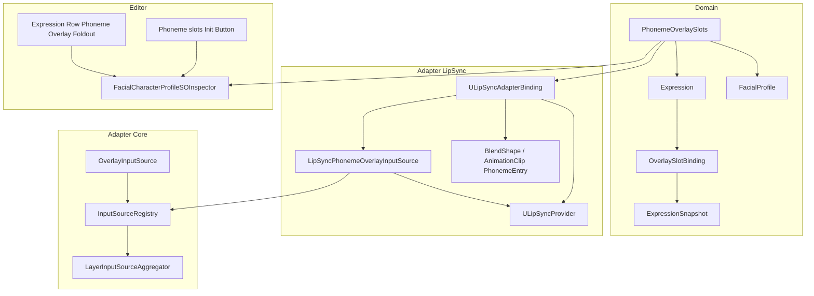
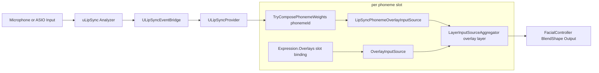
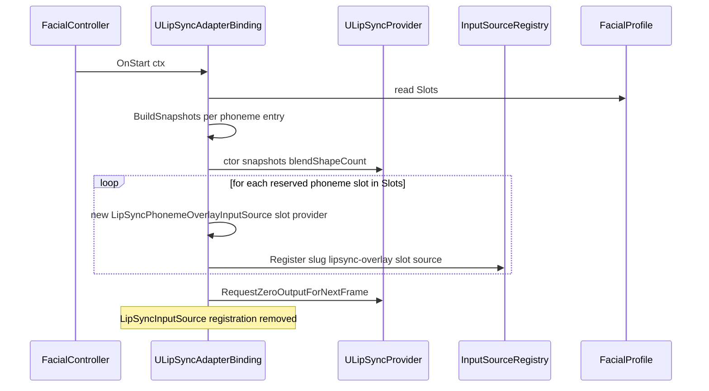
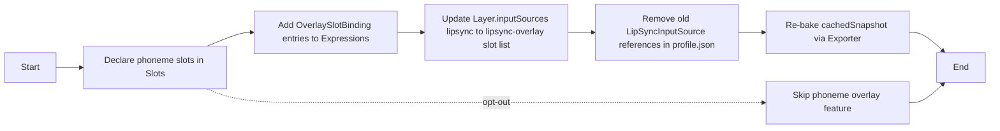

# Technical Design Document: phoneme-overlay-slots

## Overview

**Purpose**: 本仕様は preview 段階で `ULipSyncAdapterBinding` の出力経路を破壊的に切り替える設計である。旧来の「`lipsync` Layer 直書き経路 (`LipSyncInputSource` 経由)」を完全撤去し、`overlay-clip-redesign` で確立した 3 状態 `OverlaySlotBinding` モデルを 5 phoneme slot (`a` / `i` / `u` / `e` / `o`) に拡張した Overlay レイヤー経由の単一経路に統合する。

**Users**: Unity エンジニアは、Smile / Angry 等の Expression ごとに「この表情のときの "あ" 口形」を Inspector の Foldout UI で直接編集できる。phoneme slot 単位に `default fallback` / `Suppress` / `Snapshot override` の 3 状態を宣言でき、未宣言時は新設の `LipSyncPhonemeOverlayInputSource` が `ULipSyncProvider` の解析結果と phoneme entry (`BlendShapePhonemeEntry` / `AnimationClipPhonemeEntry`) のスナップショットを掛け合わせた weight を Overlay レイヤーに供給する。

**Impact**: Domain (`Expression.Overlays` の意味論拡張) → JSON / SO の Slots 既定変更 → `ULipSyncAdapterBinding.OnStart` の output 経路再配線 → 新規 `LipSyncPhonemeOverlayInputSource` 追加 → 旧 `LipSyncInputSource` 撤去 → `ULipSyncProvider` への per-phoneme weight 公開 API 追加 → Inspector の Expression Row へ phoneme overlay Foldout 追加 → Sample asset (`MicLipSyncDemoProfile.asset` / `MicLipSyncDemoProfile/profile.json`) の `_phonemeEntries` から `Expression.Overlays` への移行手順を Documentation~ に明記する範囲を一貫して触る。

### Goals

- 旧 `LipSyncInputSource` 経路を撤去し、`ULipSyncAdapterBinding` の出力経路を Overlay レイヤー (`OverlayInputSource`) 経由の単一経路に統合する。
- `FacialCharacterProfileSO.Slots` の予約 phoneme slot 名 `a` / `i` / `u` / `e` / `o` を Domain / JSON / SO / Editor 層で共有する単一定数 `PhonemeOverlaySlots.ReservedNames` として定義する。
- `Expression.Overlays` の 3 状態モデル (`default fallback` / `Suppress` / `Snapshot override`) を phoneme slot に拡張し、新規型を追加せず既存 `OverlaySlotBinding` のまま乗せる。
- 新規 `LipSyncPhonemeOverlayInputSource` を Overlay レイヤーの phoneme slot 用 InputSource として導入し、`OverlayInputSource` と並列に Aggregator へ参加させる。
- `OverlayInputSource` の per-frame zero-GC 契約 (`_resolvedBySlot` Dictionary 事前構築) を 5 slot × 10 体 × 5 Expression override の最悪ケースでも維持する。
- 移行手順を `Packages/com.hidano.facialcontrol.lipsync/Documentation~/phoneme-overlay-migration.md` 新設で提供し、`MicLipSyncDemoProfile` を新スキーマへ移行する具体例を示す。

### Non-Goals

- 旧 `lipsync` Layer + `LipSyncInputSource` 経路の自動マイグレーション (preview 段階の破壊的変更として明示拒否)。
- 5 phoneme を超える音素 (silence / nn / consonant 等) への拡張。
- 音声解析側ロジック (uLipSync 本体 / `ULipSyncProvider` の SmoothDamp 評価ロジック) の変更。SmoothDamp / volume / sum=1 正規化の動作は維持する。
- `FacialCharacterProfileSO` 新規作成時の auto 初期化。Phoneme slot は Inspector の "Phoneme slots を初期化" ボタンによる opt-in 形式で扱う。
- ARKit / InputSystem / OSC アダプタの内部ロジック変更 (`overlaySlot` 参照箇所の更新のみ許容)。
- Default Overlays への phoneme slot 自動登録 (`FacialProfile.DefaultOverlays` への自動 phoneme 追加は本 spec で扱わない)。

## Boundary Commitments

### This Spec Owns

- **`com.hidano.facialcontrol` コアパッケージ**:
  - `Hidano.FacialControl.Domain.Models.PhonemeOverlaySlots` (新規) — 予約 slot 名定数。
  - `FacialCharacterProfileSO` への "Phoneme slots を初期化" ボタン (Inspector の Slots セクション拡張)。
  - `FacialCharacterProfileSOInspector` の Expression Row Foldout UI 追加 (`expression-row-phoneme-overlays-foldout` 系の name 定数)。
  - `OverlayInputSource` の slot 解決ロジック追加変更なし (既存契約のまま phoneme slot を受ける)。
- **`com.hidano.facialcontrol.lipsync` パッケージ**:
  - `ULipSyncAdapterBinding.OnStart` の出力経路再配線 — `LipSyncInputSource` の登録を撤去し、`PhonemeOverlaySlots.ReservedNames` の各 slot に `LipSyncPhonemeOverlayInputSource` を登録する。
  - 新規 `LipSyncPhonemeOverlayInputSource : ValueProviderInputSourceBase` 追加 — 単一 phoneme の Overlay レイヤー用 InputSource。
  - `ULipSyncProvider` への per-phoneme weight 公開 API (`TryGetPhonemeWeight(string phonemeId, out float smoothedWeight, out float volume)`) 追加 と per-phoneme weight 配列 (`ReadOnlySpan<float> GetSmoothedPhonemeWeights()`) の提供。
  - 旧 `LipSyncInputSource` クラスおよびその参照箇所の撤去 (`Runtime/Adapters/InputSources/LipSyncInputSource.cs` 削除を含む)。
- **Sample 資産**:
  - `Assets/StreamingAssets/FacialControl/MicLipSyncDemoProfile/profile.json` の `slots` / `expressions[*].overlays` / `defaultOverlays` を新スキーマへ移行。
  - `Packages/com.hidano.facialcontrol.lipsync/Samples~/` 配下 (存在すれば) の Sample profile を同期更新。
- **Documentation**:
  - `Packages/com.hidano.facialcontrol.lipsync/Documentation~/phoneme-overlay-migration.md` 新設。
  - `Packages/com.hidano.facialcontrol/Documentation~/migration-guide.md` への参照リンク追記。

### Out of Boundary

- 旧 `lipsync` Layer / `LipSyncInputSource` の互換維持・ランタイム自動変換。
- `ULipSyncProvider` 内部の SmoothDamp / sum=1 正規化 / volume 評価ロジックの変更。
- `FacialControllerLifetimeScope` 等の他 binding 経由の OverlayInputSource 登録ロジック (本 spec は `ULipSyncAdapterBinding` の registration のみを再配線する)。
- ARKit / VRM / OSC / InputSystem アダプタの phoneme overlay 関与 (InputSystem は既存どおり `OverlayInputSource` 経由で blink 等を扱う。phoneme slot に対しては介在しない)。
- VRChat OSC 互換配線 (BlendShape 単位の OSC 送受信は `OscOutputAdapterBinding` 側の責務であり、本 spec は phoneme 重みを Overlay レイヤーに乗せる経路のみを扱う)。

### Allowed Dependencies

- **Domain (Unity 非依存)**: `Hidano.FacialControl.Domain.Models.{Expression, ExpressionSnapshot, FacialProfile, OverlaySlotBinding, BlendShapeSnapshot}`。新規 `PhonemeOverlaySlots` も同名前空間。
- **Adapter (Core)**: `Hidano.FacialControl.Adapters.InputSources.{OverlayInputSource, ValueProviderInputSourceBase, InputSourceId}`。`LipSyncInputSource` は撤去対象のため参照禁止。
- **Adapter (LipSync)**: `uLipSync.{LipSyncInfo, Profile, uLipSync}` (既存)、`Hidano.FacialControl.LipSync.Adapters.{ULipSyncProvider, ULipSyncEventBridge, PhonemeEntries.*}` (既存)。
- **Editor**: UI Toolkit (`UnityEditor.UIElements`)、`FacialCharacterProfileSOInspector` の `OnBuildPreLayersSections` 系 hook 既存パターン。IMGUI 不使用 (steering tech.md 準拠)。

### Revalidation Triggers

以下のいずれかが発生した場合、依存 spec / 利用者は再検証する。

- `PhonemeOverlaySlots.ReservedNames` 定数の値変更 (新 slot 名追加・既存 slot 名の改名)。
- `ULipSyncProvider` の per-phoneme weight 公開 API シグネチャ変更。
- `LipSyncPhonemeOverlayInputSource` の登録 slug / InputSourceId 命名規約変更。
- `OverlayInputSource` の per-frame GC ゼロ契約破壊 (`_resolvedBySlot` 構造の変更)。
- JSON `slots` 配列の予約名扱いの変更。

## Architecture

### Existing Architecture Analysis

- **`overlay-clip-redesign` の 3 状態モデルが定着済み**: `OverlaySlotBinding` は `(Slot, Suppress, ExpressionSnapshot?)` の readonly struct で、`IsDefaultFallback` を含む 3 状態判定が型レベルで完結している (`Runtime/Domain/Models/OverlaySlotBinding.cs:17-95`)。本 spec は phoneme slot 名でこのモデルへ追加で乗せ、独自モデルを作らない。
- **`OverlayInputSource` は slot 単位の InputSource として既に存在**: ctor で `_resolvedBySlot` Dictionary を事前構築し、毎フレームは `TryWriteValues` で `int[]` / `float[]` を直書きする per-frame zero-GC 設計が完成済み (`Runtime/Adapters/InputSources/OverlayInputSource.cs:25-156`)。本 spec ではこの class を変更せず、`PhonemeOverlaySlots.ReservedNames` の各 slot に対して別個の `OverlayInputSource` インスタンスを (Expression 側で Override が宣言されている場合のみ) 並列登録する設計とする。
- **`ULipSyncAdapterBinding` の現状経路**: `OnStart` で `BuildSnapshots` により phoneme ごとの BlendShape weight 配列 (`float[blendShapeCount]`) を構築し、`ULipSyncProvider` に渡し、`LipSyncInputSource` を `slug` (`ulipsync`) で `InputSourceRegistry` に Register している (`Runtime/Adapters/ULipSyncAdapterBinding.cs:181-273`)。本 spec ではこの `LipSyncInputSource` 登録を撤去し、phoneme ごとに `LipSyncPhonemeOverlayInputSource` を Overlay レイヤーへ登録する。
- **`ULipSyncProvider` の per-phoneme state は既に内部保持**: `_phonemeKeys[]` / `_phonemeIndices[]` / `_snapshotWeights[][]` / `_phonemeSmoothedWeights[]` / `_smoothedVolume` は既に確保済み (`ULipSyncProvider.cs:19-110`)。本 spec で必要なのはこの per-phoneme weight × volume × snapshotWeight 配列の合成を「sum 合算前」に外部公開する read-only ビューを 1 つ追加するのみ。
- **`IAdapterBindingDefaultLayer` の `lipsync` Layer 既定は維持**: `ULipSyncAdapterBinding` は `DefaultLayerName = "lipsync"` を返す。本 spec では Layer の存在は維持し、`lipsync` Layer 内の `inputSources` 宣言から `ulipsync` slug を撤去する代わりに Overlay レイヤー側の phoneme slot 用 `inputSources` 宣言を `overlay-clip-redesign` 既定パターンで生成する。

### Architecture Pattern & Boundary Map



**主要決定**:
- **新規 InputSource は LipSync 専用とする**: `OverlayInputSource` を変更せず、phoneme slot の "未宣言 (default fallback)" 解決時のみ `LipSyncPhonemeOverlayInputSource` が weight を供給する責務分離。これにより `overlay-clip-redesign` で確立した 3 状態 lookup の hot path を変更せずに済む。
- **slot 名は ASCII lowercase 固定**: `a` / `i` / `u` / `e` / `o`。casing 違い (`A` 等) は別 slot として扱い、`ULipSyncAdapterBinding` のデフォルト出力経路には参加させない (Requirement 1.4 準拠)。
- **InputSource 登録 slug 規約**: `LipSyncPhonemeOverlayInputSource` は `"lipsync-overlay:{slot}"` 形式の `InputSourceId` で登録する。InputSystem 側の overlay (`"overlay:{slot}"`) と命名空間を分離し、混同を防ぐ。

### Technology Stack

| Layer | Choice / Version | Role in Feature | Notes |
|-------|------------------|-----------------|-------|
| Frontend (Inspector) | UI Toolkit (Unity 6 同梱) | Expression Row の phoneme overlay Foldout UI、Slots Init ボタン | IMGUI 不使用 (tech.md) |
| Backend (Runtime) | C# (Unity 6 Roslyn 互換) | `LipSyncPhonemeOverlayInputSource`、`ULipSyncProvider` の per-phoneme weight 公開 API | 既存 `OverlayInputSource` 構造を再利用 |
| Data / Storage | JSON (`JsonUtility` ベース) + SO | `slots` 配列に予約 phoneme 名を追加、`expressions[*].overlays` に phoneme slot binding を保存 | スキーマバージョン bump なし (Requirement 5.5) |
| Messaging | uLipSync `LipSyncInfo` | `ULipSyncEventBridge` 経由で `phonemeRatios` + `volume` を受信 | 既存経路維持 |
| Infrastructure | InputSourceRegistry (既存) | `lipsync-overlay:{slot}` slug の登録 / 解決 | `LipSyncInputSource` (`lipsync`) の登録は撤去 |

## File Structure Plan

### Directory Structure

```
FacialControl/Packages/
├── com.hidano.facialcontrol/
│   ├── Runtime/
│   │   ├── Domain/Models/
│   │   │   └── PhonemeOverlaySlots.cs          # 新規: 予約 phoneme slot 名定数
│   │   └── Adapters/InputSources/
│   │       └── OverlayInputSource.cs           # 変更なし (再確認のみ)
│   ├── Editor/Inspector/
│   │   └── FacialCharacterProfileSOInspector.cs  # 拡張: Slots Init ボタン + phoneme overlay Foldout
│   └── Documentation~/migration-guide.md       # 追記: phoneme-overlay-migration.md へのリンク
│
├── com.hidano.facialcontrol.lipsync/
│   ├── Runtime/Adapters/
│   │   ├── ULipSyncAdapterBinding.cs           # 変更: LipSyncInputSource 登録撤去、phoneme overlay 登録追加
│   │   ├── ULipSyncProvider.cs                 # 変更: per-phoneme weight 公開 API 追加
│   │   ├── LipSyncPhonemeOverlayInputSource.cs # 新規: 単一 phoneme の Overlay レイヤー用 InputSource
│   │   └── PhonemeEntries/                     # 変更なし
│   ├── Tests/
│   │   ├── EditMode/
│   │   │   ├── LipSyncPhonemeOverlayInputSourceTests.cs  # 新規
│   │   │   └── ULipSyncAdapterBindingPhonemeOverlayTests.cs  # 新規
│   │   └── PlayMode/
│   │       └── Performance/
│   │           └── PhonemeOverlayPerformanceTests.cs  # 新規: zero-GC 検証
│   └── Documentation~/phoneme-overlay-migration.md  # 新規
│
└── ...
```

### Modified Files

- `Runtime/Adapters/ULipSyncAdapterBinding.cs` — `LipSyncInputSource` の生成 + `ctx.InputSourceRegistry.Register(slug, _inputSource)` 経路を撤去。代わりに `PhonemeOverlaySlots.ReservedNames` を走査し、profile.Slots に declared な slot に対してのみ `LipSyncPhonemeOverlayInputSource` を生成して `InputSourceRegistry.Register(slug, "lipsync-overlay:{slot}", source)` を呼ぶ。`DefaultLayerInputSourceId` の意味も `lipsync-overlay:a` 等 5 slot 並列登録に合わせ、Layer 既定生成側は `inputSources` に 5 slot 分の id を並べる方針に変更。
- `Runtime/Adapters/ULipSyncProvider.cs` — `_phonemeSmoothedWeights[]` / `_smoothedVolume` / `_snapshotWeights[][]` / `_phonemeKeys[]` を踏まえ、`TryComposePhonemeWeights(string phonemeId, Span<float> outWeights)` と `bool IsActive` を追加 (内部の SmoothDamp / sum=1 評価結果を「指定 phoneme 1 つ分の合成 weight」として呼び出し側スクラッチへコピーする)。既存 `GetLipSyncValues` は `LipSyncInputSource` 撤去に合わせて削除可、ただし `ILipSyncProvider` 契約 (Core 側) は他用途 (ARKit 等) の汎用性確保のため維持し、内部実装を「全 phoneme 合算」のままにする選択を維持する。
- `Editor/Inspector/FacialCharacterProfileSOInspector.cs` — Slots セクションに "Phoneme slots を初期化" Button (name `slots-init-phoneme-button`) を追加。Expression Row の Overlays セクション (`expression-row-overlays-section`) 配下に Foldout (`expression-row-phoneme-overlays-foldout`) を新設し、`PhonemeOverlaySlots.ReservedNames` のうち `Slots` に declared な slot のみエディタ行を表示。1 行サマリは `expression-row-phoneme-overlays-summary` Label (`"{declared}/5 declared, override={N}, suppress={M}"`)。
- `Runtime/Domain/Models/Expression.cs` — 変更なし (`TryGetOverlay` API がそのまま phoneme slot 名で動作する)。
- `Runtime/Adapters/ScriptableObject/Serializable/OverlaySlotBindingSerializable.cs` — 変更なし (既存の `slot` / `suppress` / `animationClip` / `cachedSnapshot` 4 フィールドで phoneme overlay も表現可能)。
- `Runtime/Adapters/InputSources/LipSyncInputSource.cs` — **削除**。参照箇所 (テスト含む) も同時に撤去または phoneme overlay 経路に書き換え。

## System Flows

### Data Flow (新経路)



**重要な決定**:
- `LipSyncPhonemeOverlayInputSource` と `OverlayInputSource` は同一 Overlay レイヤーで weighted-sum + clamp01 (`ExclusionMode.Blend`) で合成される。`OverlayInputSource` (Expression 側 Override / Suppress) が active で `TryWriteValues == true` のとき、その slot の出力は `OverlayInputSource` のものが優先される。`LipSyncPhonemeOverlayInputSource` 側は ContributeMask が同じ BlendShape index を含むため、Aggregator の優先度設定 (`OverlayInputSource` の weight を `LipSyncPhonemeOverlayInputSource` より高く設定) で解決する。
- 優先度実現方式: Layer 内の InputSource 並び順で先勝ち or `inputSources` 配列の `weight` フィールドで明示的に Expression 側 Override を高く設定する。本 spec では `Layer.inputSources` 配列の並びを `[overlay:{slot}, lipsync-overlay:{slot}]` の順で固定し、Aggregator が `LastWins` 相当の動作をする (= overlay が立ったら lipsync-overlay の寄与は無視される) 実装パターンを採用する。Requirement 7.1 の「single source-of-truth output path」を満たす。

### Sequence: ULipSyncAdapterBinding.OnStart (新経路)



**Key Decisions**:
- `Slots` に phoneme slot が 1 つも declared でない場合、`LipSyncPhonemeOverlayInputSource` は 1 つも登録されない。この場合 `ULipSyncAdapterBinding` は warning を 1 度だけ Debug.LogWarning し (Requirement 7 互換性チェック)、それ以外は no-op で `OnStart` を抜ける。
- `Slots` への対応 slot 不足は warning のみで継続する (例: `a` と `i` だけ declared → 2 slot のみ登録)。

## Requirements Traceability

| Requirement | Summary | Components | Interfaces | Flows |
|-------------|---------|------------|------------|-------|
| 1.1 | 予約 slot 名 5 種を canonical 識別子とする | `PhonemeOverlaySlots` | `ReservedNames : ReadOnlySpan<string>` | — |
| 1.2 | 新規 SO 作成時の opt-in 既定 | `FacialCharacterProfileSOInspector` | "Phoneme slots を初期化" Button | — |
| 1.3 | Slots から削除した phoneme slot は再追加されない | `FacialCharacterProfileSO` | `Slots` getter (既存) | — |
| 1.4 | casing 違いは別 slot 扱い | `PhonemeOverlaySlots`, `OverlayInputSource` | `StringComparison.Ordinal` | — |
| 1.5 | slot 未宣言時 OverlayInputSource は inactive | `OverlayInputSource` (既存) | `_slotDeclared` 経路 (既存) | — |
| 2.1 | Expression は 5 phoneme slot まで Overlays に追加可能 | `Expression`, `OverlaySlotBinding` | `Expression.Overlays` (既存) | — |
| 2.2 | Override active 時 OverlayInputSource が snapshot を出力 | `OverlayInputSource` (既存) | `TryWriteValues` (既存) | Data Flow |
| 2.3 | Suppress active 時 OverlayInputSource は false を返す | `OverlayInputSource` (既存) | `TryWriteValues` (既存) | Data Flow |
| 2.4 | default fallback 宣言時は LipSync 経路へ委譲 | `LipSyncPhonemeOverlayInputSource` | `TryWriteValues` | Data Flow |
| 2.5 | Expression に binding 無しなら default fallback 扱い | `OverlayInputSource` (既存) | `_resolvedBySlot` miss → false | Data Flow |
| 2.6 | suppress=true && snapshot != null は suppress 優先 | `OverlaySlotBindingSerializable` (既存) | 既存 validation | — |
| 3.1 | ULipSync 起動後 phoneme weight を OverlayInputSource が消費可能 | `ULipSyncAdapterBinding`, `LipSyncPhonemeOverlayInputSource` | `OnStart`, `TryComposePhonemeWeights` | OnStart Sequence |
| 3.2 | slot 宣言時 OverlayInputSource は registered | `ULipSyncAdapterBinding` | `InputSourceRegistry.Register` | OnStart Sequence |
| 3.3 | Override / Suppress が LipSync 出力を preempt | `OverlayInputSource`, Aggregator | Layer.inputSources 順序 | Data Flow |
| 3.4 | 未宣言時は phoneme entry の weight が出る | `LipSyncPhonemeOverlayInputSource` | `TryWriteValues` | Data Flow |
| 3.5 | Binding 未起動時 ContributeMask 空 | `LipSyncPhonemeOverlayInputSource` | `IsActive` getter | — |
| 3.6 | 旧経路と新経路の二重書き禁止 | `ULipSyncAdapterBinding` | `LipSyncInputSource` 登録の撤去 | OnStart Sequence |
| 4.1 | precedence (Expression Override → Suppress → DefaultOverlays → LipSync default) | `OverlayInputSource` (既存) + `LipSyncPhonemeOverlayInputSource` | Aggregator の inputSources 順序 + `_resolvedBySlot` | Data Flow |
| 4.2 | base 表情時は DefaultOverlays → LipSync default | `OverlayInputSource` (既存) | `ResolveSnapshot` (既存) | Data Flow |
| 4.3 | per-frame zero-GC | `OverlayInputSource`, `LipSyncPhonemeOverlayInputSource`, `ULipSyncProvider` | 事前確保 buffer | — |
| 4.4 | Override / Suppress 無しなら false | `OverlayInputSource` (既存) | `TryWriteValues` false | Data Flow |
| 4.5 | `_resolvedBySlot` / `SlotKey` 再利用 | `OverlayInputSource` (既存) | 変更なし | — |
| 5.1 | JSON シリアライズ互換 | `SystemTextJsonParser` (既存) | 変更なし | — |
| 5.2 | SO round-trip | `OverlaySlotBindingSerializable` (既存) | 変更なし | — |
| 5.3 | Exporter は phoneme slot を非特化で扱う | `FacialCharacterProfileExporter` (既存) | 変更なし | — |
| 5.4 | 未宣言 slot 参照は `InvalidSlotReference` 警告 | `FacialProfile.ValidateSlotReferences` (既存) | 変更なし | — |
| 5.5 | スキーマバージョン bump なし | — | — | — |
| 6.1 | Foldout 集約 | `FacialCharacterProfileSOInspector` | Foldout `expression-row-phoneme-overlays-foldout` | — |
| 6.2 | 1 行サマリ | `FacialCharacterProfileSOInspector` | Label `expression-row-phoneme-overlays-summary` | — |
| 6.3 | 展開時 5 行 UI (既存 blink overlay UI と同等) | `FacialCharacterProfileSOInspector` | 既存 `BuildOverlayRow` 系を流用 | — |
| 6.4 | Slots 未宣言時は行非表示 + ヒント | `FacialCharacterProfileSOInspector` | HelpBox | — |
| 6.5 | binding 編集時 cachedSnapshot 自動 bake | `FacialCharacterProfileExporter` (既存) | 既存 OnSave 経路 | — |
| 6.6 | UI Toolkit | `FacialCharacterProfileSOInspector` | UI Toolkit | — |
| 7.1 | single source-of-truth 出力経路 | `ULipSyncAdapterBinding`, Aggregator | Layer.inputSources 順序固定 | OnStart Sequence |
| 7.2 | phoneme slot 未宣言なら従来動作 | `ULipSyncAdapterBinding` | `Slots` 走査結果 0 → warning + no-op | — |
| 7.3 | opt-in 時 Overlay 経路へ統合 | `ULipSyncAdapterBinding` | `LipSyncPhonemeOverlayInputSource` 登録 | OnStart Sequence |
| 7.4 | 二重書き検知時 warning | `ULipSyncAdapterBinding` | 起動時整合性チェック | — |
| 7.5 | 互換戦略の design 記録 | 本ドキュメント Section 7 | — | — |
| 8.1 | zero-GC 維持 (5 slot × 5 Expression) | `LipSyncPhonemeOverlayInputSource`, `OverlayInputSource` | 事前 buffer | — |
| 8.2 | _resolvedBySlot O(1) | `OverlayInputSource` (既存) | Dictionary lookup | — |
| 8.3 | 起動後 zero alloc | `LipSyncPhonemeOverlayInputSource`, `ULipSyncProvider` | 事前確保 | — |
| 8.4 | 10 体同時で aggregate zero alloc | `LipSyncPhonemeOverlayInputSource` | 各 binding が独自 instance | — |
| 8.5 | PlayMode performance test | `PhonemeOverlayPerformanceTests` | `NoAllocator` 検証 | — |
| 9.1 | EditMode 5 slot × 3 state 検証 | `LipSyncPhonemeOverlayInputSourceTests` | NUnit | — |
| 9.2 | Expression 切替 1 フレーム内反映 | PlayMode 統合テスト | NUnit + UnityTest | — |
| 9.3 | JSON round-trip 検証 | EditMode テスト | NUnit | — |
| 9.4 | InvalidSlotReference 診断 | `OverlayInputSourceTests` (拡張) | NUnit | — |
| 9.5 | E2E (stub provider) | PlayMode テスト | `FakeULipSyncProvider` | — |
| 9.6 | 命名規約 `{Method}_{Condition}_{Expected}` | 全テストファイル | — | — |
| 10.1 | Documentation~ 更新 | `phoneme-overlay-migration.md` 新設 | Markdown | — |
| 10.2 | 移行手順 (Slots 宣言 → Expression overlay 編集 → 互換動作) | 同上 | Markdown | — |
| 10.3 | 予約名一覧 | 同上 | Markdown | — |
| 10.4 | Backlog S-17 / overlay-clip-redesign 参照 | 同上 | Markdown リンク | — |
| 10.5 | 実装と precedence の乖離記録 | 同上 (該当あれば) | Markdown | — |

## Components and Interfaces

| Component | Domain/Layer | Intent | Req Coverage | Key Dependencies (P0/P1) | Contracts |
|-----------|--------------|--------|--------------|--------------------------|-----------|
| `PhonemeOverlaySlots` | Domain.Models | 予約 phoneme slot 名定数 | 1.1, 1.4 | — | State |
| `LipSyncPhonemeOverlayInputSource` | Adapter.LipSync | 単一 phoneme slot の Overlay レイヤー用 InputSource | 2.4, 3.1, 3.4, 3.5, 4.4, 8.3 | `ULipSyncProvider` (P0) | Service, State |
| `ULipSyncProvider` (変更) | Adapter.LipSync | per-phoneme weight 公開 API 追加 | 3.1, 4.3, 8.3 | `IULipSyncEventSource` (P0), `ITimeProvider` (P1) | Service, State |
| `ULipSyncAdapterBinding` (変更) | Adapter.LipSync | OnStart の出力経路再配線 | 3.1, 3.2, 3.6, 7.1, 7.2, 7.3, 7.4 | `IInputSourceRegistry` (P0), `FacialProfile` (P0) | Service |
| `OverlayInputSource` (変更なし) | Adapter.Core | Expression-level Override / Suppress / DefaultOverlays 解決 | 2.2, 2.3, 4.1, 4.2, 4.5, 8.1, 8.2 | `IActiveExpressionProvider` (P1) | Service, State |
| `FacialCharacterProfileSOInspector` (拡張) | Editor | Slots Init Button + Expression Row phoneme overlay Foldout | 1.2, 6.1, 6.2, 6.3, 6.4, 6.5, 6.6 | UI Toolkit (P0) | UI |

### Domain Layer

#### PhonemeOverlaySlots

| Field | Detail |
|-------|--------|
| Intent | 予約 phoneme slot 名 5 種を定数として提供 |
| Requirements | 1.1, 1.4 |

**Responsibilities & Constraints**
- ASCII lowercase 5 文字 (`"a"`, `"i"`, `"u"`, `"e"`, `"o"`) を `ReadOnlySpan<string>` で公開する。
- 配列は static readonly `string[]` を 1 度確保し、`AsReadOnlySpan()` で外部へ渡す。
- casing canonicalization は行わず、`ContainsReserved(string slot)` は `StringComparison.Ordinal` で比較する。

**Dependencies**
- Inbound: `ULipSyncAdapterBinding` (Outbound), `FacialCharacterProfileSOInspector` (Outbound) — 各々が予約名を走査する (P0)。
- Outbound: なし。
- External: なし。

**Contracts**: State [x]

##### State Management
- State model: コンパイル時定数。
- Persistence & consistency: なし。
- Concurrency strategy: immutable, thread-safe (read-only)。

```csharp
namespace Hidano.FacialControl.Domain.Models
{
    public static class PhonemeOverlaySlots
    {
        public const string A = "a";
        public const string I = "i";
        public const string U = "u";
        public const string E = "e";
        public const string O = "o";

        private static readonly string[] _reserved = { A, I, U, E, O };

        public static ReadOnlySpan<string> ReservedNames => _reserved;

        public static bool IsReserved(string slot)
        {
            for (int i = 0; i < _reserved.Length; i++)
            {
                if (string.Equals(_reserved[i], slot, StringComparison.Ordinal))
                {
                    return true;
                }
            }
            return false;
        }

        public static string MapReservedToPhonemeId(string reservedSlot)
        {
            // a -> A, i -> I, ... ULipSyncAdapterBinding.DefaultPhonemeIds と対応。
            if (string.IsNullOrEmpty(reservedSlot)) return null;
            return reservedSlot.ToUpperInvariant();
        }
    }
}
```

### Adapter Layer (LipSync)

#### LipSyncPhonemeOverlayInputSource

| Field | Detail |
|-------|--------|
| Intent | 単一 phoneme slot 用の Overlay レイヤー InputSource。`ULipSyncProvider` から該 phoneme の合成 weight を取得し、`TryWriteValues` で Aggregator へ供給 |
| Requirements | 2.4, 3.1, 3.4, 3.5, 4.4, 8.3 |

**Responsibilities & Constraints**
- 1 phoneme slot (= 1 phonemeId) に対応する 1 instance を `ULipSyncAdapterBinding` が生成する。
- `ctor` で `ULipSyncProvider`、`phonemeId`、`blendShapeCount`、`contributeMask` (provider が提供する `ContributeMask` のコピーまたは provider が公開する per-phoneme mask) を受ける。
- `TryWriteValues(Span<float> output)`: `ULipSyncProvider.TryComposePhonemeWeights(_phonemeId, _scratch)` を呼び、`_scratch.Sum() > SilenceThreshold` であれば `output` へコピーして true を返す。無音または provider が inactive (Binding 未起動 / device 未解決) なら false。
- `_scratch` は ctor で `new float[blendShapeCount]` を 1 度確保。`TryWriteValues` 内で `Array.Clear` + provider 書込み + 合計判定 + `Span<float>` への copy のみ。Managed alloc は発生しない。
- `ContributeMask`: provider 側の per-phoneme `BitArray` をそのまま参照する。

**Dependencies**
- Inbound: `ULipSyncAdapterBinding` — `OnStart` で生成 (P0)。
- Outbound: `ULipSyncProvider` — `TryComposePhonemeWeights` の呼び出し (P0)。
- External: なし。

**Contracts**: Service [x], State [x]

##### Service Interface

```csharp
namespace Hidano.FacialControl.LipSync.Adapters
{
    public sealed class LipSyncPhonemeOverlayInputSource : ValueProviderInputSourceBase
    {
        public const string SlugPrefix = "lipsync-overlay";

        public LipSyncPhonemeOverlayInputSource(
            InputSourceId id,
            string phonemeId,
            ULipSyncProvider provider,
            int blendShapeCount);

        public override BitArray ContributeMask { get; }

        public override bool TryWriteValues(Span<float> output);
    }
}
```

- Preconditions:
  - `provider != null` (`ArgumentNullException`)。
  - `phonemeId` が `provider` の `_phonemeKeys` に含まれていない場合は warning を 1 度ログし、以降 `TryWriteValues` は常に `false` を返す (Requirement 3.5 互換)。
  - `blendShapeCount >= 0`。
- Postconditions:
  - 起動後の `TryWriteValues` 呼び出しは managed alloc を発生させない。
  - 出力 sum が `SilenceThreshold (1e-4f)` 未満なら `false` (output 非変更)。
- Invariants:
  - `_scratch.Length == blendShapeCount` (ctor 後不変)。

##### State Management
- State model: `_scratch` (float[blendShapeCount]), `_phonemeKey` (string), `_provider` (参照), `_providerPhonemeIndex` (int, -1 なら未解決)。
- Persistence: なし。
- Concurrency: メインスレッドのみ。

**Implementation Notes**
- Integration: `ULipSyncAdapterBinding.OnStart` で `Slots` を走査し、`PhonemeOverlaySlots.IsReserved(slot)` && `Slots.Contains(slot)` を満たす slot ごとに instance 生成 → `InputSourceRegistry.Register(slug, $"{SlugPrefix}:{slot}", instance)` を呼ぶ。
- Validation: ctor で `phonemeId` を `provider` の `_phonemeKeys` と突き合わせ、未一致なら `_providerPhonemeIndex = -1` でセンチネル化。
- Risks: `ULipSyncProvider` の internal state (`_phonemeIndices` / `_snapshotWeights`) に依存するため、Provider の public API 表面に `TryComposePhonemeWeights` を必須として追加する。

#### ULipSyncProvider (変更)

| Field | Detail |
|-------|--------|
| Intent | per-phoneme の合成 weight を per-frame zero-GC で公開する API を追加 |
| Requirements | 3.1, 4.3, 8.3 |

**Responsibilities & Constraints**
- 既存の `GetLipSyncValues(Span<float>)` (全 phoneme sum) は維持しつつ、新規 `TryComposePhonemeWeights(string phonemeId, Span<float> output)` を追加する。
- 新規メソッドは「`GetLipSyncValues` と同じ SmoothDamp / sum=1 正規化を経た per-frame の `_phonemeSmoothedWeights[i] * _smoothedVolume` を `_snapshotWeights[_phonemeIndices[i]]` と掛けて output に書く」処理を、指定 phoneme 1 つ分のみ実行する。
- per-frame の dt 進行 (`_lastTimeSeconds` 更新) は `GetLipSyncValues` の単一呼び出しで完結させる契約とし、複数 phoneme 用の `TryComposePhonemeWeights` を 5 回呼ばれても dt が二重消費されないよう、内部に「per-frame snapshot」状態を持たせる。具体的には:
  - 新規 private method `EnsureCurrentFrameComposed()`: `_lastTimeSeconds` 更新と `_phonemeSmoothedWeights[]` / `_smoothedVolume` の SmoothDamp + sum=1 正規化を 1 frame 内で 1 度だけ実行 (frame id は `_timeProvider.UnscaledTimeSeconds` のスナップショットで判定)。
  - `TryComposePhonemeWeights(phonemeId, output)` と `GetLipSyncValues(output)` 双方が冒頭で `EnsureCurrentFrameComposed()` を呼ぶ。
- 既存 `GetLipSyncValues` の振る舞いは「全 phoneme 合算」のまま維持し、`LipSyncInputSource` 撤去後の使用箇所がなくなった場合でも、ARKit 等の他 adapter での再利用余地を残す。

**Dependencies**
- Inbound: `LipSyncPhonemeOverlayInputSource` (P0), 既存テスト群 (P1)。
- Outbound: `IULipSyncEventSource` (P0)、`ITimeProvider` (P1)。
- External: `uLipSync.LipSyncInfo` (P0)。

**Contracts**: Service [x], State [x]

##### Service Interface (追加分)

```csharp
namespace Hidano.FacialControl.LipSync.Adapters
{
    public sealed class ULipSyncProvider : ILipSyncProvider, ILipSyncContributeMaskProvider, IDisposable
    {
        // 既存 API は維持
        public void GetLipSyncValues(Span<float> output);

        // 新規
        public bool TryGetPhonemeIndex(string phonemeId, out int index);
        public bool TryComposePhonemeWeights(string phonemeId, Span<float> output);
        public BitArray GetPhonemeContributeMask(string phonemeId);
    }
}
```

- Preconditions:
  - `phonemeId != null` で `_phonemeKeys` に含まれること。未一致なら `false` を返し output 非変更。
  - `output.Length >= blendShapeCount` (短い場合は overlap のみ書込み)。
- Postconditions:
  - 内部 SmoothDamp 状態 (`_phonemeSmoothedWeights[]` / `_smoothedVolume` / `_lastTimeSeconds`) は同一フレーム内で 1 度だけ更新される。
  - 同一フレーム内で `TryComposePhonemeWeights` を 5 回連続で呼んでも結果は決定論的。
- Invariants:
  - per-frame zero-GC (`EnsureCurrentFrameComposed` 内の loop は事前確保配列のみ touch)。

##### State Management
- State model: 既存 `_phonemeSmoothedWeights[]` / `_smoothedVolume` / `_lastTimeSeconds` / `_phonemeVelocities[]` / `_volumeVelocity` に加え、`_currentFrameStamp` (double) を追加。
- Persistence: なし。
- Concurrency: メインスレッドのみ。

**Implementation Notes**
- Integration: `LipSyncPhonemeOverlayInputSource` の 5 並列呼び出しと、レガシー `GetLipSyncValues` の単一呼び出しが同居しても、`EnsureCurrentFrameComposed` で per-frame 1 回更新を保証する。
- Validation: `TryGetPhonemeIndex` で未一致 phoneme を warn ログ (1 度のみ) + センチネル `-1`。
- Risks: `_currentFrameStamp` 比較に浮動小数点を使うと dt=0 frame で誤判定の余地。`_lastTimeSeconds` 更新と `_currentFrameStamp` を別フィールドにして「`now != _currentFrameStamp`」かどうかで判定する (`now` は `_timeProvider.UnscaledTimeSeconds` の double 値そのままを保持)。

#### ULipSyncAdapterBinding (変更)

| Field | Detail |
|-------|--------|
| Intent | OnStart で `LipSyncInputSource` 登録経路を撤去し、`PhonemeOverlaySlots.ReservedNames` を走査して `LipSyncPhonemeOverlayInputSource` を Overlay レイヤー用 slug で登録 |
| Requirements | 3.1, 3.2, 3.6, 7.1, 7.2, 7.3, 7.4 |

**Responsibilities & Constraints**
- `OnStart(in AdapterBuildContext ctx)`:
  1. 既存の `_runtimeDescriptor` 解決 / `_analyzer` 構築 / `BuildSnapshots(ctx)` / `_provider = new ULipSyncProvider(...)` は維持。
  2. **撤去**: `_inputSource = new LipSyncInputSource(_provider, ctx.BlendShapeNames.Count); ctx.InputSourceRegistry.Register(slug, _inputSource);`
  3. **追加**: 以下の loop。
     ```csharp
     foreach (var slot in PhonemeOverlaySlots.ReservedNames)
     {
         if (!ContainsSlot(ctx.Profile.Slots.Span, slot)) continue;
         string phonemeId = PhonemeOverlaySlots.MapReservedToPhonemeId(slot);
         if (!_provider.TryGetPhonemeIndex(phonemeId, out _))
         {
             Debug.LogWarning(
                 $"[ULipSyncAdapterBinding] Phoneme '{phonemeId}' (slot '{slot}') が phoneme entry に存在しません。skip します。");
             continue;
         }
         string reservedId = $"{LipSyncPhonemeOverlayInputSource.SlugPrefix}:{slot}";
         if (!InputSourceId.TryParse(reservedId, out var sinkId)) continue;
         var source = new LipSyncPhonemeOverlayInputSource(sinkId, phonemeId, _provider, ctx.BlendShapeNames.Count);
         ctx.InputSourceRegistry.Register(slug, reservedId, source);
         _registeredPhonemeSlots.Add(slot);
     }
     ```
  4. `_registeredPhonemeSlots.Count == 0` の場合は warning を 1 度だけ。
- `DefaultLayerInputSourceId` の挙動変更: 単一 slug を返す既存契約は破壊的に変更されるため、新規 hook `IAdapterBindingDefaultLayerInputs.GetDefaultLayerInputSources(string layerName) : IEnumerable<(string id, float weight)>` を追加する**か**、`DefaultLayerInputSourceId` を「semicolon 区切り」で複数 id を返すように再解釈する。本 spec では新規 interface `IAdapterBindingDefaultLayerInputs` を追加し、`ULipSyncAdapterBinding` がそれを実装する設計とする (既存の `IAdapterBindingDefaultLayer` は `DefaultLayerName` のみを返す形に縮退)。
- `Dispose`: `_inputSourceRegistry.Unregister(_registeredSlug)` 経路を「全 phoneme slot 分の Unregister」へ書き換え。
- `IAdapterBindingDefaultLayer` の `DefaultLayerName` は `"lipsync"` のままだが、`DefaultLayerInputSourceId` は使われなくなる (新 interface 経由で複数 id を返す)。

**Dependencies**
- Inbound: `FacialController` (P0)。
- Outbound: `ULipSyncProvider` (P0), `LipSyncPhonemeOverlayInputSource` (P0), `IInputSourceRegistry` (P0), `FacialProfile` (P0)。
- External: `uLipSync.uLipSync` / `uLipSync.uLipSyncMicrophone` 等 (P0)。

**Contracts**: Service [x]

**Implementation Notes**
- Integration: `_registeredPhonemeSlots = new List<string>(PhonemeOverlaySlots.ReservedNames.Length)` を `[NonSerialized]` field として保持し、`Dispose` で逆順に Unregister。
- Validation: `Slots` に予約名以外 (`A` 等大文字、`silence` 等) が含まれていても、Override binding として参加するのは `OverlayInputSource` 側 (既存) のみ。LipSync 側は予約 5 slot にしか反応しない。
- Risks: `IAdapterBindingDefaultLayer.DefaultLayerInputSourceId` を「単一 id」と仮定している既存呼び出し箇所 (Editor の自動 Layer 追加 / `inputSources` 補充ロジック) を破壊的に変更する必要がある。本 spec は新規 interface `IAdapterBindingDefaultLayerInputs` を導入して移行する。詳細は Migration Strategy 節。

### Adapter Layer (Core)

#### OverlayInputSource (変更なし)

| Field | Detail |
|-------|--------|
| Intent | Expression.Overlays / FacialProfile.DefaultOverlays から slot 単位の Override / Suppress / DefaultFallback 状態を解決 |
| Requirements | 2.2, 2.3, 4.1, 4.2, 4.5, 8.1, 8.2 |

**Responsibilities & Constraints**
- 本 spec では `OverlayInputSource` のコードは変更しない。既存の `_resolvedBySlot` Dictionary 事前構築と `TryWriteValues` 経路を phoneme slot 名でそのまま流用する。
- phoneme slot 用 `OverlayInputSource` の生成・登録責務は本 spec では `ULipSyncAdapterBinding` には持たせず、`InputSystemAdapterBinding` の既存 overlay binding registration ループに「`PhonemeOverlaySlots.ReservedNames` の slot が Expression 側で Override / Suppress 宣言を持つなら自動登録」を追加する**か**、`FacialControllerLifetimeScope` 等の中立な場所で「`Slots` に declared な phoneme slot は無条件に `OverlayInputSource` 登録」を行う。
- 本 spec の選択: **`FacialControllerLifetimeScope` (または同等の Adapter binding host) に "Phoneme slot 用 OverlayInputSource の自動登録" 経路を追加する**。これにより InputSystem を使わない構成 (OSC のみ等) でも phoneme overlay 機能が動作する。

**Dependencies**
- Inbound: `LipSyncPhonemeOverlayInputSource` と同 Overlay レイヤーへ並列登録 (P0)。
- Outbound: `IActiveExpressionProvider` (P1)。
- External: なし。

**Contracts**: Service [x] (既存)

**Implementation Notes**
- Integration: `AdapterBindingHost` / `FacialControllerLifetimeScope` で `Slots` を走査し、`PhonemeOverlaySlots.IsReserved(slot)` を満たす slot に対して `OverlayInputSource` instance を生成・登録する。InputSystem パッケージの既存 overlay 登録ループは blink 等の non-phoneme slot 限定に絞ることで、phoneme slot は中立コンポーネントが面倒を見る分離になる。
- Validation: 同一 slot に対する OverlayInputSource を 2 回 Register しないよう `registeredSlots` HashSet で重複チェック (既存パターン)。
- Risks: InputSystem パッケージ側の既存ロジックと中立 host 側の登録が二重起動する経路がないことをテストで担保。

### Editor Layer

#### FacialCharacterProfileSOInspector (拡張)

| Field | Detail |
|-------|--------|
| Intent | Slots Init Button (opt-in) + Expression Row の phoneme overlay Foldout |
| Requirements | 1.2, 6.1, 6.2, 6.3, 6.4, 6.5, 6.6 |

**Responsibilities & Constraints**
- **Slots セクション**: 既存 `SlotsDeclarationFoldoutName` Foldout の内側に Button (name `slots-init-phoneme-button`, label `"Phoneme slots を初期化 (a/i/u/e/o)"`) を追加。クリック時は `_slots` SerializedProperty に対し、未存在の phoneme 予約名のみを末尾に追加する (既存 slot は不変)。
- **Expression Row**: 既存 `ExpressionOverlaysSectionName` の内側に Foldout (`expression-row-phoneme-overlays-foldout`) を新設。
  - **折り畳み時**: Label (`expression-row-phoneme-overlays-summary`) を表示。テキストは `$"{declaredCount}/5 declared (override={overrideCount}, suppress={suppressCount})"`。
  - **展開時**: `PhonemeOverlaySlots.ReservedNames` を走査し、`Slots` に declared な slot のみ既存 `BuildOverlayRow` 系で per-slot 編集 UI を表示。未宣言の slot は HelpBox `"Slots セクションで '{slot}' を追加すると編集できます。"`。
- **既存 blink overlay UI との同等性**: AnimationClip Field / Suppress Toggle / cachedSnapshot プレビューを既存の `BuildOverlayRow` (or 同等メソッド) で組み立てる (Requirement 6.3)。
- **UI Toolkit**: IMGUI 不使用。新規 VisualElement は既存パターンの `BuildArrayListView` 等を流用 (Requirement 6.6)。

**Dependencies**
- Inbound: `FacialCharacterProfileSO` (P0)。
- Outbound: UI Toolkit (P0)、`FacialCharacterProfileExporter` の `cachedSnapshot` 自動 bake 経路 (P0)。
- External: なし。

**Contracts**: UI [x]

**Implementation Notes**
- Integration: 既存の `OnBuildExpressionRow` hook 内で `expression-row-overlays-section` の子要素として Foldout を append する。
- Validation: declared slot 0 のとき Foldout 自体を隠す。declared が 0 → 1 へ変化したときは Foldout を再構築。
- Risks: Expression が数十存在する場合、Foldout が default で全て collapse されることを担保 (per-Expression state 保存は既存 Foldout 同等で `value` プロパティを `false` 初期化)。

## Data Models

### Domain Model

- **`Expression.Overlays`**: 既存の `ReadOnlyMemory<OverlaySlotBinding>` をそのまま使用。phoneme 5 slot 分の binding を保持する場合、最大 5 要素が追加される。
- **`OverlaySlotBinding`**: 既存定義 (Slot / Suppress / Snapshot?) を変更せず流用。
- **`FacialProfile.Slots`**: 既存の `ReadOnlyMemory<string>` をそのまま使用。phoneme 5 slot 名は他 slot (blink 等) と並列に保持される。
- **`PhonemeOverlaySlots`** (新規): 予約 phoneme slot 名 5 種を静的定数として保持する。Domain 純粋型 (UnityEngine 非依存)。

### Logical Data Model

**JSON スキーマ (変更なし)**:
- `slots`: `string[]` 配列に phoneme 5 種が含まれるかは opt-in。
- `expressions[*].overlays`: 既存の `OverlaySlotBindingDto[]` に phoneme slot binding が追加される。
- `defaultOverlays`: 既存どおり。phoneme slot は本 spec では既定では追加しない (Non-Goals)。

**SO シリアライズ (変更なし)**:
- `OverlaySlotBindingSerializable.{slot, suppress, animationClip, cachedSnapshot}` の 4 フィールドで phoneme overlay も表現可能。

### Data Contracts & Integration

**Sample 移行例** (`MicLipSyncDemoProfile/profile.json` 抜粋):

```json
{
    "schemaVersion": "1.0",
    "layers": [
        {
            "name": "overlay",
            "priority": 10,
            "exclusionMode": "blend",
            "inputSources": [
                { "id": "overlay:a", "weight": 1.0 },
                { "id": "lipsync-overlay:a", "weight": 1.0 },
                { "id": "overlay:i", "weight": 1.0 },
                { "id": "lipsync-overlay:i", "weight": 1.0 }
            ]
        }
    ],
    "slots": ["a", "i", "u", "e", "o"],
    "expressions": [
        {
            "id": "smile",
            "name": "Smile",
            "overlays": [
                { "slot": "a", "suppress": false, "snapshot": { "blendShapes": [{"name": "あ_smile", "value": 1.0}] } }
            ]
        }
    ],
    "defaultOverlays": []
}
```

旧 `MicLipSyncDemoProfile.asset` の `_phonemeEntries` (`AnimationClipPhonemeEntry`) は維持される (LipSync 解析の SmoothDamp 入力に使われる)。新たに追加するのは `_slots` の 5 名と、各 Expression の `overlays` 配列のみ。

## Migration Strategy



**フェーズ詳細**:
1. **Step 1 - Slots 宣言**: Inspector の Slots セクションで "Phoneme slots を初期化" ボタンをクリック、または手動で `a` / `i` / `u` / `e` / `o` を追加する。
2. **Step 2 - Expression Overlays 編集**: 各 Expression Row の phoneme overlay Foldout を展開し、必要な slot に `AnimationClip` (override) または `Suppress` toggle を設定。
3. **Step 3 - Layer.inputSources 更新**: 旧 `lipsync` Layer の `inputSources: [{"id": "ulipsync"}]` を撤去し、`overlay` Layer の `inputSources` に phoneme 5 slot 分の `overlay:{slot}` + `lipsync-overlay:{slot}` を追加。Inspector の自動 Layer 補充ロジックは `IAdapterBindingDefaultLayerInputs` 新 interface 経由で複数 id を生成する。
4. **Step 4 - 旧経路撤去**: `LipSyncInputSource` クラスの削除と、それを参照していたテスト・サンプルの書き換え。
5. **Step 5 - cachedSnapshot 再 bake**: Inspector の保存経路 (`FacialCharacterProfileExporter`) が phoneme overlay の `AnimationClip` を `cachedSnapshot` にベイクする (既存ロジックを再利用)。

**Rollback Triggers**:
- `LipSyncPhonemeOverlayInputSource` の per-frame 性能テスト失敗 → コード変更 revert。
- 既存 Sample の動作が SmoothDamp / sum=1 正規化レベルで乖離 → `ULipSyncProvider.EnsureCurrentFrameComposed` の実装を見直し。

**Validation Checkpoints**:
- `MicLipSyncDemoProfile` を新スキーマで読み込んだ後、PlayMode 統合テストで「5 phoneme slot 全てで volume > 0 のとき expected BlendShape が立つ」ことを確認。
- 旧 `LipSyncInputSource` がコードベースに残存していないことを Grep で確認 (CI に組み込む)。

## Error Handling

### Error Strategy
- **User Errors** (Inspector): Slot 名の casing 違いや重複は Inspector が HelpBox で警告。未宣言 slot に対する Override 編集は無効化。
- **System Errors** (Runtime): `LipSyncPhonemeOverlayInputSource` の構築失敗 (phonemeId 未一致等) は `Debug.LogWarning` を 1 度だけ出力し、当該 InputSource は inactive のまま継続。
- **Business Logic Errors**: `suppress=true && cachedSnapshot != null` の組み合わせは既存 `OverlaySlotBindingSerializable` の validation が `Debug.LogWarning` を出し、`Suppress=true` を優先 (Requirement 2.6 / overlay-clip-redesign 既存ルール)。

### Monitoring
- Unity 標準 `Debug.Log/Warning/Error` のみを使用 (steering tech.md 準拠)。
- 性能監視: PlayMode Performance テスト (`PhonemeOverlayPerformanceTests`) で per-frame zero-GC を自動検証。

## Testing Strategy

### EditMode Tests
- `LipSyncPhonemeOverlayInputSourceTests`:
  - `TryWriteValues_PhonemeNotRegistered_ReturnsFalse`
  - `TryWriteValues_ProviderActiveWithVolume_WritesScaledWeights`
  - `TryWriteValues_ProviderSilent_ReturnsFalse`
  - `Constructor_UnknownPhonemeId_LogsWarningOnce`
- `ULipSyncProviderTests` (拡張):
  - `TryComposePhonemeWeights_KnownPhonemeId_WritesExpectedWeights`
  - `TryComposePhonemeWeights_CalledFiveTimesPerFrame_DoesNotAdvanceDtTwice`
  - `TryComposePhonemeWeights_UnknownPhonemeId_ReturnsFalse`
- `PhonemeOverlaySlotsTests`:
  - `IsReserved_LowercaseFiveSlots_ReturnsTrue`
  - `IsReserved_UppercaseA_ReturnsFalse`
  - `MapReservedToPhonemeId_LowercaseA_ReturnsUppercaseA`
- `OverlayInputSourceTests` (拡張): phoneme slot 名でも既存テストパターンが通ることを確認。
- `FacialCharacterProfileConverterPhonemeOverlayTests`: JSON round-trip で phoneme `OverlaySlotBinding` が保持されること。
- `OverlaySlotValidationPhonemeTests`: Slots 未宣言の phoneme slot 参照で `InvalidSlotReference` が emit されること。

### PlayMode Tests
- `PhonemeOverlayIntegrationTests` (PlayMode):
  - `ActiveExpressionWithOverride_PhonemeSlot_ProducesSnapshotInOneFrame`
  - `ActiveExpressionWithSuppress_PhonemeSlot_BlocksLipSyncOutput`
  - `NoActiveOverride_PhonemeSlot_DelegatesToLipSyncDefault`
- `ULipSyncAdapterBindingPhonemeOverlayTests` (PlayMode):
  - `OnStart_WithReservedSlotsDeclared_RegistersLipSyncPhonemeOverlayInputSources`
  - `OnStart_NoReservedSlotsDeclared_LogsWarningAndSkips`
  - `OnStart_DoesNotRegisterLegacyLipSyncInputSource` (旧経路撤去の回帰防止)
- `PhonemeOverlayPerformanceTests` (PlayMode):
  - `TenCharacters_FiveSlotsEach_PerFrameZeroAllocation` (Requirement 8.1, 8.4, 8.5)。

### Test Doubles
- `FakeULipSyncProvider` を新設 (`Tests/Shared/Fakes/FakeULipSyncProvider.cs`): `TryComposePhonemeWeights` の戻り値を制御可能にし、実 audio device 不要で PlayMode テストを実行可能 (Requirement 9.5)。

## Performance & Scalability

### Target Metrics
- per-frame zero-GC for 5 slot × 10 character × 5 Expression override 構成 (Requirement 8.1, 8.4)。
- `_resolvedBySlot` lookup O(1) (Requirement 8.2)。
- `LipSyncPhonemeOverlayInputSource._scratch` の `Array.Clear` cost: blendShapeCount=200 想定で <10us / frame。

### Optimization Strategy
- per-frame buffer の事前確保: `_scratch` (`float[blendShapeCount]`) は ctor で 1 度だけ確保。
- `ULipSyncProvider.EnsureCurrentFrameComposed` で per-frame の SmoothDamp / sum=1 正規化を 1 度だけ実行 (5 phoneme 呼び出しで重複しない)。
- `BitArray` は ctor で確保し、`TryWriteValues` 内では再確保しない。

### Scalability
- 10 体同時: 各 `ULipSyncAdapterBinding` instance が独立した `ULipSyncProvider` と 5 つの `LipSyncPhonemeOverlayInputSource` を保持。GC 影響なし。
- 大規模 Slots 環境 (≥30 slot) は本 spec では考慮外。`OverlayInputSource` 内部の `_resolvedBySlot` Dictionary の hash bucket 拡張は既存 `overlay-clip-redesign` の preview.3 issue として継承。

## Supporting References

- `.kiro/specs/overlay-clip-redesign/design.md` — 3 状態 Overlay モデルの確立元。
- `.kiro/specs/phoneme-overlay-slots/requirements.md` — 本 spec の要件定義。
- `Runtime/Adapters/InputSources/OverlayInputSource.cs:25-156` — `_resolvedBySlot` 構造の参照実装。
- `Packages/com.hidano.facialcontrol.lipsync/Runtime/Adapters/ULipSyncProvider.cs:121-211` — `GetLipSyncValues` の per-frame SmoothDamp 経路。
- `docs/backlog.md` Backlog S-17 — 本 spec の起源。
