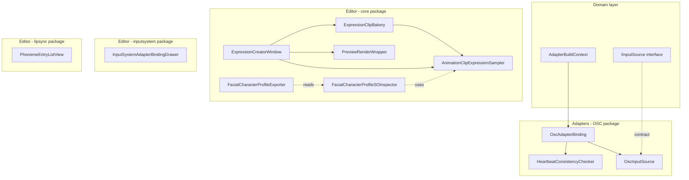
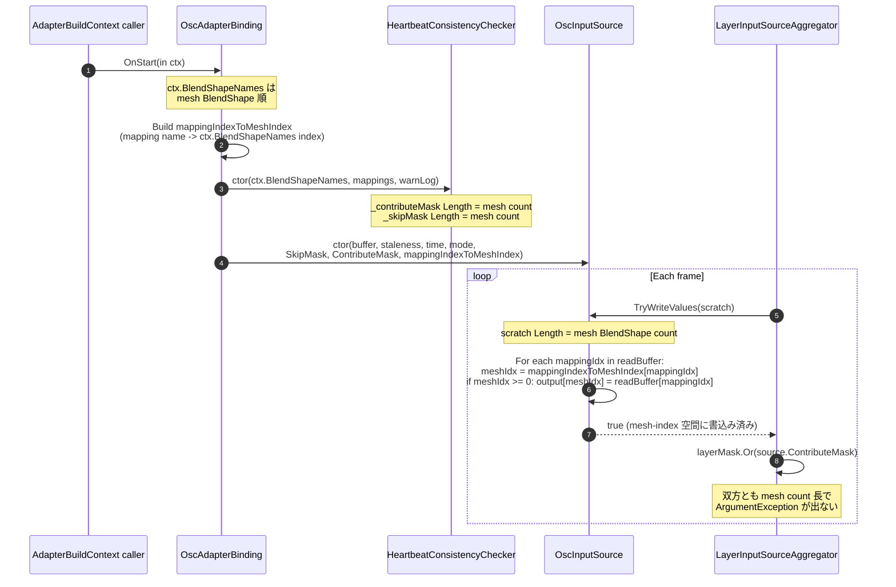
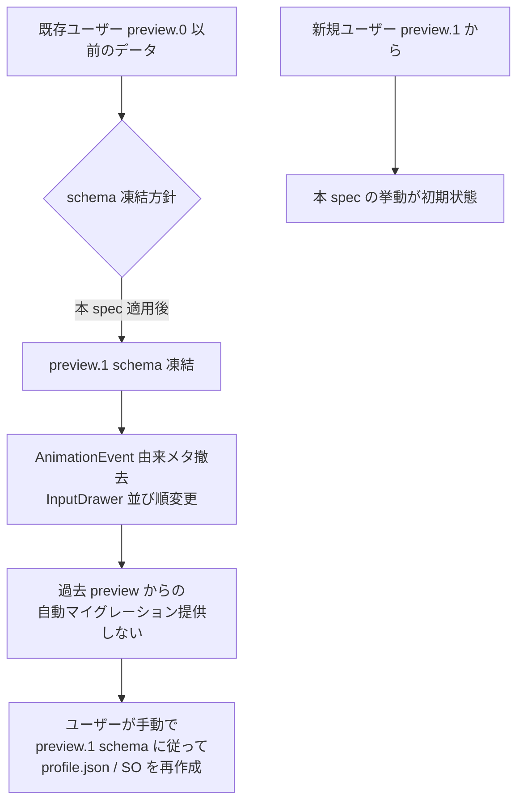

# Design Document — preview1-polish-pack

## Overview

**Purpose**: preview.1 リリース直前の Editor UX 改善 + バグ修正パックとして、`docs/backlog.md` の短期項目 S-10〜S-16 を 1 spec に集約した 7 件の独立した修正を、それぞれの影響範囲が限定される形で実装する。OSC 受信側のランタイムバグ（index 空間ずれ）解消、Expression 遷移メタ二重編集経路の Profile Inspector 一本化、`ExpressionCreatorWindow` の UX 改善、Gaze 関連 Inspector / Drawer の UI 整理、`uLipSync` PhonemeEntry の Undo 整合性を 1 PR シリーズで提供する。

**Users**: 本パッケージを取り込む Unity エンジニア。とくに preview.1 を箱出しで触る初回ユーザーが「OscReceiverDemo + OscOutputDemo を同一プロセスで起動して即落ちる」「同じ値が 2 か所で編集できる」「ボタンが潰れて押せない」といった preview 段階固有の摩擦に当たらないことを目標とする。

**Impact**: ランタイムは OSC 受信経路の `BitArray` 整合性を回復することで `LayerInputSourceAggregator.AggregateInternal` 経由の例外連鎖を停止させる。Editor は AnimationClip メタの片側撤去 + UI 構成の整理で Source of Truth を Profile Inspector 一元に統一する。preview スキーマは本変更時点に凍結し、過去 preview からの自動マイグレーションは提供しない。

### Goals

- `OscReceiverDemo` と `OscOutputDemo` の同一プロセス起動時に `BitArray.Or` 経由の例外を一切発生させない（S-10）
- Expression 遷移時間 / カーブの編集経路を Profile Inspector の Expression Row に一本化する（S-11）
- `ExpressionCreatorWindow` のベイクボタン / PNG 書き出し / 新規 Clip 作成導線を完成させる（S-12）
- Gaze 用 Expression Row の AnimationClip スロットを `isGaze=true` で非表示にする（S-13）
- GazeConfig 一括再生成ボタン + 削除 Undo 経路を整備する（S-14）
- `InputSystemAdapterBindingDrawer` の Expression Binding 行を新並び順 + Action 名グレーアウトに揃える（S-15）
- `PhonemeEntryListView` の Undo 後 ListView 表示を SerializedProperty 現在値と一致させる（S-16）
- 全変更について EditMode テスト（新規 / 既存）を Red→Green→Refactor の TDD で整備する

### Non-Goals

- Domain `Expression` bridge ctor（`TransitionDuration` / `TransitionCurve` を受ける方）の撤去判断（別 PR）
- PlayMode テストの追加（実 OSC 送受信は既存 PlayMode 群に委ねる）
- リップシンク音声解析 / 新規入力ソースの追加
- preview.1 以前のユーザー JSON / SO データの自動マイグレーション
- 本 spec 範囲外の `docs/backlog.md` エントリへの波及

## Boundary Commitments

### This Spec Owns

- `HeartbeatConsistencyChecker` および `OscInputSource` の **mesh BlendShape index 空間整合**（mask 構築 + 受信値書込み）
- `IInputSource.ContributeMask` の XML doc-comment 契約（mesh BlendShape index 空間であることの明文化）
- `ExpressionClipBakery.Bake` の AnimationEvent 経路撤去と、`AnimationClipExpressionSampler` のメタ既定値返却挙動
- `ExpressionCreatorWindow` の UI 構成（遷移メタ Foldout 削除、bake ボタン形状、PNG 保存ボタン、Clip 新規作成ボタン）
- `PreviewRenderWrapper` の PNG 出力公開 API
- `FacialCharacterProfileSOInspector` の Expression Row における Gaze 用 AnimationClip スロット表示制御
- `FacialCharacterProfileSOInspector` の GazeConfig 一括再生成ボタン + Undo 経路修正
- `InputSystemAdapterBindingDrawer.BindExpressionBindingRow` の field 配置順 + Action 名 enable/disable 制御
- `PhonemeEntryListView` の `Undo.undoRedoPerformed` 購読 + Rebuild 経路
- 上記すべてに対応する EditMode テストの新規 / 更新

### Out of Boundary

- Domain `Expression` 型の bridge ctor 撤去
- PlayMode テストの追加 / 修正
- リップシンク音声解析 / 新規入力ソース実装
- preview.1 以前のスキーマ / JSON データの自動マイグレーション
- OSC 送信側（`OscSenderAdapterBinding`）のロジック変更（heartbeat 送信フォーマットは現状維持）

### Allowed Dependencies

- `Hidano.FacialControl.Domain.*`（`IInputSource`, `OscMapping`, `AdapterBuildContext`, `Expression`）
- `Hidano.FacialControl.Application.*`
- `Hidano.FacialControl.Adapters.*`（OSC / InputSystem / LipSync の各サブ namespace）
- `Hidano.FacialControl.Editor.*`（UI Toolkit, Sampling, Tools, Inspector, Common）
- Unity Engine: `UnityEngine.Animations`, `UnityEditor.AnimationUtility`, `UnityEngine.Texture2D`, `UnityEditor.EditorUtility`, `UnityEditor.Undo`, `UnityEngine.UIElements`
- 外部パッケージ: 既存依存（uOsc, com.unity.inputsystem, com.unity.test-framework）に追加なし

### Revalidation Triggers

- `IInputSource.ContributeMask` の契約（mesh BlendShape index 空間）変更 → 全 InputSource 実装の再点検が必要
- `AdapterBuildContext.BlendShapeNames` の供給仕様変更 → OSC binding 初期化経路の再点検
- `ExpressionSerializable.transitionDuration` / `transitionCurve` の永続化形式変更 → JSON schema の再整合が必要
- `PreviewRenderWrapper` の公開 API シグネチャ変更 → Editor 拡張で利用する他ツールの再点検
- `Undo.undoRedoPerformed` 経路の購読対称性が崩れる変更 → Editor 拡張全般の cleanup 経路再確認

## Architecture

本 spec は既存パッケージ（`com.hidano.facialcontrol` / `com.hidano.facialcontrol.osc` / `com.hidano.facialcontrol.inputsystem` / `com.hidano.facialcontrol.lipsync`）にまたがる 7 件の独立した修正を含む。各 Requirement は対応する 1〜3 個のクラスに閉じており、相互依存はない（Requirement 1 と他の Requirement の間にも依存はない）。

### Existing Architecture Analysis

本変更が触れる既存レイヤーは以下のとおり。すべてクリーンアーキテクチャの asmdef 境界を維持する。

- **Domain**（`com.hidano.facialcontrol/Runtime/Domain/`）— `IInputSource` インターフェースの XML doc-comment 更新のみ。`LayerInputSourceAggregator` / `AnalogBlendShapeInputSource` は触れない（参考実装として読み取るのみ）。
- **Adapters / OSC**（`com.hidano.facialcontrol.osc/Runtime/Adapters/`）— `HeartbeatConsistencyChecker`, `OscAdapterBinding`, `OscInputSource` の 3 クラスを mesh-index 空間に整列。
- **Editor / Tools**（`com.hidano.facialcontrol/Editor/Tools/`）— `ExpressionClipBakery` から AnimationEvent 書込みを撤去、`ExpressionCreatorWindow` の UI 構成を整理。
- **Editor / Sampling**（`com.hidano.facialcontrol/Editor/Sampling/`）— `AnimationClipExpressionSampler` のメタ抽出を簡略化（メタ無しを既定値返却に統一）。
- **Editor / Common**（`com.hidano.facialcontrol/Editor/Common/`）— `PreviewRenderWrapper` に PNG 出力用 Texture2D 取得 API を追加。
- **Editor / AutoExport**（`com.hidano.facialcontrol/Editor/AutoExport/`）— `FacialCharacterProfileExporter` は変更なし（既に SO 側を真値として読んでいる）。挙動回帰のテストのみ実施。
- **Editor / Inspector**（`com.hidano.facialcontrol/Editor/Inspector/`）— `FacialCharacterProfileSOInspector` の Expression Row + GazeConfigs セクション。
- **Editor / AdapterBindings**（`com.hidano.facialcontrol.inputsystem/Editor/AdapterBindings/`）— `InputSystemAdapterBindingDrawer` の `BindExpressionBindingRow` + `UpdateGazeActionFieldVisibility`。
- **LipSync / Editor / Inspector**（`com.hidano.facialcontrol.lipsync/Editor/Inspector/`）— `PhonemeEntryListView` の Undo 購読経路。

### Architecture Pattern & Boundary Map



**Architecture Integration**:

- Selected pattern: 既存のクリーンアーキテクチャ（Domain / Application / Adapters / Editor）を維持。本 spec は Adapters + Editor 層内の限定変更で完結。
- Domain/feature boundaries: Domain 層は `IInputSource` の XML doc-comment 追加のみで実体は不変。OSC / InputSystem / LipSync の各パッケージは互いに参照しない独立性を維持。
- Existing patterns preserved: `AnalogBlendShapeInputSource` の `nameToIndex` パターン（mesh-index 空間整合）、`FacialCharacterProfileSOInspector` の Undo group + `ApplyModifiedPropertiesAndCollapseUndo` パターン、`PreviewRenderWrapper` の Setup/Render/Dispose ライフサイクル。
- New components rationale: 新規 class 追加は行わず、既存クラスへの method 追加 + 内部実装変更のみ。これにより asmdef や `package.json` への影響を最小化する。
- Steering compliance: TDD 厳守 / EditMode 中心 / UI Toolkit 採用 / Domain UnityEngine.Debug 直接呼び容認 / 毎フレームのヒープ確保ゼロ目標を維持。

### Technology Stack

| Layer | Choice / Version | Role in Feature | Notes |
|-------|------------------|-----------------|-------|
| Runtime / Adapters (OSC) | C# (Unity 6 互換 Roslyn) | OSC 受信値の mesh-index 空間整合 | `System.Collections.BitArray`, `Unity.Collections.NativeArray<float>` を継続使用 |
| Editor (UI Toolkit) | UI Toolkit (Unity 6000.3.2f1 同梱) | Expression Creator Window / Profile Inspector / Adapter Binding Drawer の UI 改修 | IMGUI 新規追加なし |
| Editor (Animation) | `UnityEditor.AnimationUtility` | AnimationClip Bake から `SetAnimationEvents` 経路撤去 | `GetCurveBindings` / `SetEditorCurve` は維持 |
| Editor (Preview) | `UnityEditor.PreviewRenderUtility`, `UnityEngine.Texture2D` | PreviewRenderWrapper の PNG 出力 API | `ReadPixels` → `EncodeToPNG` の標準経路 |
| Editor (Undo) | `UnityEditor.Undo` | GazeConfig 削除 / PhonemeEntryListView の Undo 経路 | `Undo.RecordObject` / `Undo.undoRedoPerformed` 標準パターン |
| Test Framework | `com.unity.test-framework` 1.6.0 | EditMode テストの新規 / 更新 | PlayMode テストは本 spec で追加しない |

## File Structure Plan

### Directory Structure

本 spec は既存ディレクトリ構造を一切変更しない。修正対象ファイルは下記のとおり。

```
FacialControl/Packages/
├── com.hidano.facialcontrol/
│   ├── Runtime/Domain/Interfaces/
│   │   └── IInputSource.cs                          # XML doc-comment 更新 (S-10 / Req 1)
│   ├── Editor/Tools/
│   │   ├── ExpressionClipBakery.cs                  # AnimationEvent 撤去 (S-11 / Req 2)
│   │   └── ExpressionCreatorWindow.cs               # UI 整理 + 新規ボタン (S-11, S-12 / Req 2, 3)
│   ├── Editor/Sampling/
│   │   └── AnimationClipExpressionSampler.cs        # メタ抽出の簡略化 (S-11 / Req 2)
│   ├── Editor/Common/
│   │   └── PreviewRenderWrapper.cs                  # PNG 出力 API 追加 (S-12 / Req 3)
│   ├── Editor/Inspector/
│   │   └── FacialCharacterProfileSOInspector.cs     # Gaze スロット表示 + GazeConfig 再生成 + Undo (S-13, S-14 / Req 4, 5)
│   └── Tests/EditMode/
│       ├── Editor/Tools/
│       │   └── ExpressionCreatorWindowTests.cs      # 既存更新 + 新規ケース (Req 2, 3)
│       ├── Editor/Sampling/
│       │   ├── AnimationClipExpressionSamplerTests.cs            # 既存更新 (Req 2)
│       │   └── AnimationClipExpressionSamplerMetadataTests.cs    # 既存更新 (Req 2)
│       └── Editor/Inspector/
│           ├── FacialCharacterProfileSOInspectorGazeConfigsTests.cs  # 既存更新 + 新規ケース (Req 4, 5)
│           └── FacialCharacterProfileSOInspectorExpressionRowTests.cs # 新規 (Req 4)
├── com.hidano.facialcontrol.osc/
│   ├── Runtime/Adapters/OSC/
│   │   └── HeartbeatConsistencyChecker.cs           # mesh-index 空間整合 (S-10 / Req 1)
│   ├── Runtime/Adapters/AdapterBindings/
│   │   └── OscAdapterBinding.cs                     # ctx.BlendShapeNames を Checker / Source に供給 (S-10 / Req 1)
│   ├── Runtime/Adapters/InputSources/
│   │   └── OscInputSource.cs                        # mesh-index 空間書込み (S-10 / Req 1)
│   └── Tests/EditMode/
│       ├── Adapters/OSC/
│       │   └── HeartbeatConsistencyCheckerTests.cs  # 既存更新 (Req 1)
│       └── Adapters/InputSources/
│           └── OscInputSourceMaskTests.cs           # 新規 (Req 1)
├── com.hidano.facialcontrol.inputsystem/
│   ├── Editor/AdapterBindings/
│   │   └── InputSystemAdapterBindingDrawer.cs       # 並び順 + Action 名グレーアウト (S-15 / Req 6)
│   └── Tests/EditMode/Adapters/AdapterBindings/
│       └── InputSystemAdapterBindingDrawerTests.cs  # 既存更新 + 新規ケース (Req 6)
└── com.hidano.facialcontrol.lipsync/
    ├── Editor/Inspector/
    │   └── PhonemeEntryListView.cs                  # Undo 購読 (S-16 / Req 7)
    └── Tests/EditMode/Editor/
        └── PhonemeEntryListViewTests.cs             # 既存更新 + 新規ケース (Req 7)
```

### Modified Files

- `Runtime/Domain/Interfaces/IInputSource.cs` — `ContributeMask` の `<remarks>` を mesh BlendShape index 空間契約として明文化（Req 1.6）。
- `Runtime/Adapters/OSC/HeartbeatConsistencyChecker.cs` — ctor を `(IReadOnlyList<string> meshBlendShapeNames, IReadOnlyList<OscMapping> receiverMappings, bool warnLogEnabled)` 形式に拡張（既存 ctor は維持して overload 追加）。`_contributeMask` / `_skipMask` を `meshBlendShapeNames.Count` 長で確保し、`UpdateFromHeartbeat` 内で mapping name → mesh index の逆引きを通じてマスクを立てる。
- `Runtime/Adapters/AdapterBindings/OscAdapterBinding.cs` — `OnStart(in ctx)` 内で `ctx.BlendShapeNames` を新規 ctor overload に渡し、`HeartbeatConsistencyChecker` と `OscInputSource` の双方を mesh-index 空間で初期化する。
- `Runtime/Adapters/InputSources/OscInputSource.cs` — ctor に `mappingIndexToMeshIndex` 配列を受ける overload を追加し、`TryWriteValues` 内で `readBuffer[mappingIdx] → output[meshIdx]` のリマップを行う。`_contributeMask` は mesh-index 空間で渡されたものを保持。
- `Editor/Tools/ExpressionClipBakery.cs` — `Bake(...)` から `AnimationUtility.SetAnimationEvents(...)` 経路を削除。BlendShape Curve 書込みのみ残す。`MetaKeyTransitionDuration` / `MetaKeyTransitionCurvePreset` 定数および `transitionDuration` / `transitionCurvePreset` 引数は保持（後方互換のため、ただし内部では使用されない）。
- `Editor/Sampling/AnimationClipExpressionSampler.cs` — `ExtractTransitionMetadata` のロジックを「AnimationEvent が無ければ既定値（`Expression.DefaultTransitionDuration` / `TransitionCurvePreset.Linear`）」に統一。`MetaSetFunctionName` 定数は後方互換のため維持するが内部経路で使用されないことを doc-comment に明示。
- `Editor/Tools/ExpressionCreatorWindow.cs` — (a) `transitionFoldout` 全体を削除（`_transitionDurationField` / `_curveTypeDropdown` フィールドも削除）、`OnBakeClicked` の `transitionDuration` / `transitionCurvePreset` 引数は既定値（0.25f, Linear）で `ExpressionClipBakery.Bake` を呼ぶ形に揃える、(b) bottomSection の bake ボタンに `style.flexShrink = 0f` + `style.minWidth = 140f` を適用、(c) leftPanel に「プレビューを PNG として保存」ボタンを追加、(d) `_clipField` の隣に「新規作成」ボタンを追加。
- `Editor/Common/PreviewRenderWrapper.cs` — `Texture2D CapturePreviewTexture(int width, int height)` を追加。内部で `PreviewRenderUtility` 経由のレンダーフレームから `Texture2D.ReadPixels` で複製した `Texture2D` を返す。
- `Editor/Inspector/FacialCharacterProfileSOInspector.cs` — (a) `BuildAnimationClipFields` 内で `clipField.style.display` を `currentIsGaze ? DisplayStyle.None : DisplayStyle.Flex` で制御、(b) `isGazeToggle` の変更コールバックで AnimationClip スロット表示を即時更新、(c) GazeConfigs セクションに「GazeConfig を一括再生成」ボタン追加、(d) `RemoveGazeConfigAt` 内で `Undo.RecordObject(target, "Remove GazeConfig")` を `DeleteArrayElementAtIndex` の直前に挿入。
- `Editor/AdapterBindings/InputSystemAdapterBindingDrawer.cs` — `BindExpressionBindingRow` 内の `element.Add(...)` 順を `表情 ID → 動作モード → useDistinct → 左 Action → 右 Action → Action 名 → トリガモード（→ overlay 関連）` に並び替え。`UpdateGazeActionFieldVisibility` の `actionField.style.display` 制御を `actionField.SetEnabled(...)` に書き換え（display は常に Flex 維持）。
- `Editor/Inspector/PhonemeEntryListView.cs` — コンストラクタで `RegisterCallback<AttachToPanelEvent>(OnAttachToPanel)` / `RegisterCallback<DetachFromPanelEvent>(OnDetachFromPanel)` を登録。Attach 時に `Undo.undoRedoPerformed += OnUndoRedoPerformed`、Detach 時に `-=`。`OnUndoRedoPerformed` で `serializedObject.Update()` → `RebuildIndexProxy` → `_listView.Rebuild()`。

## System Flows

S-10 の OSC index 空間変換が本 spec で最も複雑なフローのため、シーケンス図で示す。他 Requirement は単純な UI / API 変更のため flow 図は省略する（Components 章で十分）。

### Flow: OSC 受信値の mesh-index 空間整列（Req 1）



**Key decisions captured by diagram**:

- `ctx.BlendShapeNames` を真値とし、Binding 初期化時に `mappingIndexToMeshIndex` を 1 度だけ構築（毎フレーム逆引きを避けることで GC ゼロ契約維持）。
- mapping name が `ctx.BlendShapeNames` に存在しない場合 `mappingIndexToMeshIndex[mappingIdx] = -1` とし、`TryWriteValues` 側で `-1` をスキップ（要件 1.5 の「mapping name と一致しない mesh インデックスは未書込み」を保証）。
- `ContributeMask` も同じ mesh-index 空間で立て、mapping に対応する mesh index にのみ bit を立てる（要件 1.2 / 1.3 / 1.6）。
- `_skipMask` は heartbeat 経由で更新されるが、長さは mesh count 長で維持され、`UpdateFromHeartbeat` 内で「sender が持つ mapping name のうち receiver mesh に存在するもの」に bit を立てる経路に書き換える（要件 1.2 と整合）。

## Requirements Traceability

| Requirement | Summary | Components | Interfaces / Files | Flows |
|-------------|---------|------------|--------------------|-------|
| 1.1 | OSC 同一プロセス起動で BitArray.Or 例外を出さない | OscReceiver Subsystem | `OscAdapterBinding`, `HeartbeatConsistencyChecker`, `OscInputSource` | OSC 受信値の mesh-index 空間整列 |
| 1.2 | `_contributeMask` / `_skipMask` を mesh BlendShape 数長で構築 | HeartbeatConsistencyChecker | `HeartbeatConsistencyChecker(meshBlendShapeNames, receiverMappings, warnLogEnabled)` | 同上 |
| 1.3 | `ctx.BlendShapeNames` を Checker に供給 | OscAdapterBinding | `OnStart(in ctx)` | 同上 |
| 1.4 | TryWriteValues を mesh-index 空間で書込み | OscInputSource | `TryWriteValues(Span<float>)` + `_mappingIndexToMeshIndex` | 同上 |
| 1.5 | mapping 数 ≠ mesh 数で誤書込みしない | OscInputSource | 同上 | 同上 |
| 1.6 | IInputSource.ContributeMask の契約明文化 | IInputSource | `IInputSource.ContributeMask` の XML doc-comment | — |
| 1.7 | 既存テストの mesh-index 追従更新 | Test Suite | `HeartbeatConsistencyCheckerTests` | — |
| 1.8 | 新規 OscInputSourceMaskTests | Test Suite | `OscInputSourceMaskTests` | — |
| 2.1 | Bake から AnimationEvent 撤去 | ExpressionClipBakery | `Bake(clip, entries, transitionDuration, transitionCurvePreset)` | — |
| 2.2 | Sampler は既定値を返す | AnimationClipExpressionSampler | `SampleSummary(clip)` | — |
| 2.3 | Creator Window は遷移メタ Foldout を提示しない | ExpressionCreatorWindow | `CreateGUI()` | — |
| 2.4 | Profile Inspector が遷移メタの唯一の編集経路 | FacialCharacterProfileSOInspector | Expression Row 既存スライダー | — |
| 2.5 | AutoExport は SO 側から直接参照 | FacialCharacterProfileExporter | `BuildProfileSnapshotDto` の既存挙動 | — |
| 2.6 | AnimationEvent 由来メタ撤去を破壊的変更として許容 | Preview1 Polish Pack（spec 全体） | Migration Strategy 章 | — |
| 2.7 | 対応テスト群を AnimationEvent 期待しない挙動に揃える | Test Suite | `ExpressionCreatorWindowTests`, `AnimationClipExpressionSamplerTests`, `AnimationClipExpressionSamplerMetadataTests` | — |
| 3.1 | bake ボタンに flexShrink=0 + minWidth | ExpressionCreatorWindow | `CreateGUI()` bottomSection | — |
| 3.2 | leftPanel に PNG 保存ボタン追加 | ExpressionCreatorWindow | `CreateGUI()` leftPanel + `OnSavePreviewClicked()` | — |
| 3.3 | クリックで RenderTexture → PNG 保存 | ExpressionCreatorWindow + PreviewRenderWrapper | `OnSavePreviewClicked()`, `PreviewRenderWrapper.CapturePreviewTexture(...)` | — |
| 3.4 | clipField 隣に新規作成ボタン | ExpressionCreatorWindow | `CreateGUI()` rightPanel clip 行 | — |
| 3.5 | クリックで `SaveFilePanelInProject` → 空 Clip 生成 | ExpressionCreatorWindow | `OnCreateNewClipClicked()` | — |
| 3.6 | ダイアログキャンセルで Clip 未生成 | ExpressionCreatorWindow | `OnCreateNewClipClicked()` 内 path null チェック | — |
| 3.7 | PreviewRenderWrapper の PNG 出力 API 公開 | PreviewRenderWrapper | `Texture2D CapturePreviewTexture(int width, int height)` | — |
| 3.8 | ExpressionCreatorWindowTests に 3 件のテスト追加 | Test Suite | `ExpressionCreatorWindowTests` | — |
| 4.1 | isGaze=true で clip スロット非表示 | FacialCharacterProfileSOInspector | `BuildAnimationClipFields` | — |
| 4.2 | isGaze=false で clip スロット表示 | FacialCharacterProfileSOInspector | 同上 | — |
| 4.3 | isGaze トグル切替で即時反映 | FacialCharacterProfileSOInspector | `isGazeToggle.RegisterValueChangedCallback` | — |
| 4.4 | 内部 AnimationClip 参照値を破壊しない | FacialCharacterProfileSOInspector | SerializedProperty bind 経路維持 | — |
| 4.5 | 表示状態の EditMode テスト | Test Suite | `FacialCharacterProfileSOInspectorExpressionRowTests` | — |
| 5.1 | 一括再生成ボタンを `GazeConfigBulkResolveButton` 近傍に追加 | FacialCharacterProfileSOInspector | `BuildGazeConfigsSection` / `RebuildGazeConfigsUI` | — |
| 5.2 | クリックで未生成の Gaze 用 Expression に GazeConfig 補完 | FacialCharacterProfileSOInspector | `BulkRegenerateGazeConfigs()` | — |
| 5.3 | 既存 GazeConfig は上書きしない | FacialCharacterProfileSOInspector | 同上 | — |
| 5.4 | GazeConfig 削除前に Undo.RecordObject | FacialCharacterProfileSOInspector | `RemoveGazeConfigAt` | — |
| 5.5 | Ctrl+Z で GazeConfig 行を SerializedProperty レベルで復元 | FacialCharacterProfileSOInspector | 同上 + Inspector の自然な再描画 | — |
| 5.6 | EditMode テストで一括再生成 + Undo 復元を検証 | Test Suite | `FacialCharacterProfileSOInspectorGazeConfigsTests` | — |
| 6.1 | Binding 行を新並び順に変更 | InputSystemAdapterBindingDrawer | `BindExpressionBindingRow` | — |
| 6.2 | Gaze + useDistinct=true で Action 名グレーアウト | InputSystemAdapterBindingDrawer | `UpdateGazeActionFieldState(...)` | — |
| 6.3 | Gaze + useDistinct=false で Action 名通常表示 | InputSystemAdapterBindingDrawer | 同上 | — |
| 6.4 | useDistinct トグル切替で enable/disable 即時更新 | InputSystemAdapterBindingDrawer | `useDistinctLeftRightToggle.RegisterValueChangedCallback` | — |
| 6.5 | 破壊的変更として並び順変更を許容 | Preview1 Polish Pack | Migration Strategy 章 | — |
| 6.6 | EditMode テストで並び順 + enable 状態を検証 | Test Suite | `InputSystemAdapterBindingDrawerTests` | — |
| 7.1 | コンストラクタで Undo.undoRedoPerformed を購読 | PhonemeEntryListView | コンストラクタ + `OnAttachToPanel` | — |
| 7.2 | DetachFromPanelEvent で購読解除 | PhonemeEntryListView | `OnDetachFromPanel` | — |
| 7.3 | OnUndoRedoPerformed で serializedObject.Update + Rebuild | PhonemeEntryListView | `OnUndoRedoPerformed()` | — |
| 7.4 | Undo 直後の表示値が SerializedProperty 現在値と一致 | PhonemeEntryListView | 同上 | — |
| 7.5 | 複数連続 Undo で例外なし | PhonemeEntryListView | `OnUndoRedoPerformed()` の null safety | — |
| 7.6 | EditMode テストで Undo → モード切替 → 一致を検証 | Test Suite | `PhonemeEntryListViewTests` | — |

## Components and Interfaces

### Summary

| Component | Domain/Layer | Intent | Req Coverage | Key Dependencies (P0/P1) | Contracts |
|-----------|--------------|--------|--------------|--------------------------|-----------|
| `HeartbeatConsistencyChecker` | Adapters / OSC | Heartbeat 整合判定 mask を mesh-index 空間で構築 | 1.2, 1.3, 1.7 | `OscMapping`, `IReadOnlyList<string>` mesh names (P0) | Service |
| `OscAdapterBinding` | Adapters / OSC | OSC 結線初期化（mesh-index 整列を含む） | 1.1, 1.3 | `AdapterBuildContext` (P0), `HeartbeatConsistencyChecker` (P0), `OscInputSource` (P0) | Service |
| `OscInputSource` | Adapters / OSC | OSC 受信値を mesh-index 空間に書込み | 1.1, 1.4, 1.5 | `OscDoubleBuffer` (P0), `ITimeProvider` (P0), `BitArray` masks (P0), `int[] mappingIndexToMeshIndex` (P0) | Service |
| `IInputSource` | Domain / Interfaces | ContributeMask 契約の明文化 | 1.6 | — | Service (contract only) |
| `ExpressionClipBakery` | Editor / Tools | AnimationClip ベイク（メタ撤去） | 2.1 | `AnimationUtility` (P0) | Service |
| `AnimationClipExpressionSampler` | Editor / Sampling | AnimationClip サンプリング（メタ既定値返却） | 2.2 | `AnimationUtility` (P0) | Service |
| `ExpressionCreatorWindow` | Editor / Tools | Expression 作成 UI（メタ UI 撤去 + ボタン改善） | 2.3, 3.1〜3.6 | `ExpressionClipBakery` (P0), `AnimationClipExpressionSampler` (P0), `PreviewRenderWrapper` (P0) | UI |
| `PreviewRenderWrapper` | Editor / Common | プレビュー描画 + PNG 出力 API | 3.3, 3.7 | `PreviewRenderUtility` (P0), `Texture2D` (P0) | Service |
| `FacialCharacterProfileSOInspector` | Editor / Inspector | Expression Row + GazeConfigs 表示制御 | 4.1〜4.4, 5.1〜5.5 | `SerializedProperty`, `Undo` (P0) | UI |
| `InputSystemAdapterBindingDrawer` | Editor / AdapterBindings | Expression Binding 行 UI（並び順 + Action 名 enable） | 6.1〜6.4 | `SerializedProperty`, UI Toolkit (P0) | UI |
| `PhonemeEntryListView` | LipSync / Editor / Inspector | PhonemeEntry ListView の Undo 整合 | 7.1〜7.5 | `Undo.undoRedoPerformed`, `SerializedObject` (P0) | UI |

### Adapters / OSC

#### HeartbeatConsistencyChecker

| Field | Detail |
|-------|--------|
| Intent | Heartbeat 整合判定の mask を mesh BlendShape index 空間で構築する |
| Requirements | 1.2, 1.3, 1.7 |

**Responsibilities & Constraints**

- `_skipMask` / `_contributeMask` は mesh BlendShape 名配列の長さで確保する（mapping 個数ではない）。
- `UpdateFromHeartbeat` 内で「sender が持つ mapping name を receiver mesh index 空間にマップして bit を立てる」経路で skip/contribute を更新する。
- 既存 ctor（`IReadOnlyList<OscMapping>` または `IReadOnlyList<string>` を受ける）は下位互換性のため残すが、`[Obsolete]` 等の警告は出さない（preview 段階のため）。新しい呼出元は新規 ctor overload を使う。

**Dependencies**

- Inbound: `OscAdapterBinding` (P0)
- Outbound: `OscMapping` (P1, value type)
- External: なし（System.Collections.BitArray のみ）

**Contracts**: Service [x]

##### Service Interface

```csharp
public sealed class HeartbeatConsistencyChecker
{
    /// <summary>
    /// mesh-index 空間で mask を構築する新規 ctor。
    /// </summary>
    /// <param name="meshBlendShapeNames">mesh の BlendShape 名（index 順）。null 不可。</param>
    /// <param name="receiverMappings">受信側 OSC マッピング配列。null 不可。</param>
    /// <param name="warnLogEnabled">不一致時の警告ログを有効化するか。</param>
    public HeartbeatConsistencyChecker(
        IReadOnlyList<string> meshBlendShapeNames,
        IReadOnlyList<OscMapping> receiverMappings,
        bool warnLogEnabled = true);

    // 既存 ctor 2 種は下位互換性のため残す。
    public HeartbeatConsistencyChecker(IReadOnlyList<OscMapping> receiverMappings, bool warnLogEnabled = true);
    public HeartbeatConsistencyChecker(IReadOnlyList<string> receiverBlendShapeNames, bool warnLogEnabled = true);

    public int BlendShapeCount { get; }       // mesh BlendShape 数を返す（新規 ctor 経由のとき）
    public bool HasMismatch { get; }
    public BitArray SkipMask { get; }         // Length = mesh BlendShape count（新規 ctor 経由のとき）
    public BitArray ContributeMask { get; }   // Length = mesh BlendShape count（新規 ctor 経由のとき）

    public void UpdateFromHeartbeat(IReadOnlyList<string> senderBlendShapeNames);
    public void Clear();
}
```

- Preconditions: 新規 ctor は `meshBlendShapeNames != null` かつ `receiverMappings != null`。
- Postconditions: 新規 ctor 経由のとき `SkipMask.Length == ContributeMask.Length == meshBlendShapeNames.Count` を保証する。`UpdateFromHeartbeat` 後、`SkipMask[i] == true` ⇔ mesh index `i` の BlendShape に対応する mapping を sender が送っていない、かつ `ContributeMask[i] == !SkipMask[i] && (mapping name が mesh index i に対応する)`。
- Invariants: ctor 後 mask 長は不変。

**Implementation Notes**

- 既存 ctor 経路は `BlendShapeCount = receiverMappings.Count` のままで互換動作するが、`LayerInputSourceAggregator` と組み合わせると S-10 のバグを再現することを doc-comment に明記する。
- 新規 ctor 経路では、ctor 内で mapping name → mesh index の逆引き辞書を構築し、その結果を `Update` 経路に渡せる private field に格納する。

#### OscAdapterBinding

| Field | Detail |
|-------|--------|
| Intent | OSC 結線初期化時に mesh-index 空間整合に必要な情報を Checker / Source に供給する |
| Requirements | 1.1, 1.3 |

**Responsibilities & Constraints**

- `OnStart(in ctx)` 内で `ctx.BlendShapeNames` を Checker と Source の双方に供給する。
- mapping index → mesh index の逆引き配列を `OnStart` 内で 1 回だけ構築し、Source ctor に渡す（毎フレーム逆引きを避けて GC 0 を維持）。
- `ctx.BlendShapeNames` が null または空でも binding は起動可能とし、その場合は Checker / Source を null のまま登録しない（既存 `hasBlendShapeMappings` ガードを維持）。

**Dependencies**

- Inbound: `AdapterBuildContext` ビルダー (P0)
- Outbound: `HeartbeatConsistencyChecker` (P0), `OscInputSource` (P0)
- External: なし

**Contracts**: Service [x]

##### Service Interface

```csharp
public override void OnStart(in AdapterBuildContext ctx);
// 内部で以下を実行:
// 1. mappingIndexToMeshIndex = BuildMappingToMeshIndexMap(runtimeMappings, ctx.BlendShapeNames)
// 2. _heartbeatChecker = new HeartbeatConsistencyChecker(ctx.BlendShapeNames, runtimeMappings, _consistencyCheckWarnLog)
// 3. _inputSource = new OscInputSource(
//        _buffer, _stalenessSeconds, ctx.TimeProvider, _failSafeMode,
//        _heartbeatChecker.SkipMask, _heartbeatChecker.ContributeMask,
//        mappingIndexToMeshIndex)
```

- Preconditions: `ctx.HostGameObject != null`（既存 ガード維持）。`ctx.BlendShapeNames` が null の場合は空配列として扱う。
- Postconditions: Source / Checker の mask 長と Aggregator の `blendShapeCount` が一致する。
- Invariants: `_started` が true の間は同一 mapping/mesh セットを保持。

**Implementation Notes**

- `BuildMappingToMeshIndexMap` は private static helper として実装。同名 BlendShape が mesh 側に複数ある場合は最初のヒットを採用（`AnalogBlendShapeInputSource.nameToIndex` と同方針）。
- mapping name が mesh に存在しない場合は `-1` を格納し、`OscInputSource` 側でスキップする。

#### OscInputSource

| Field | Detail |
|-------|--------|
| Intent | OSC 受信値を mesh BlendShape index 空間に書込む |
| Requirements | 1.1, 1.4, 1.5 |

**Responsibilities & Constraints**

- `_mappingIndexToMeshIndex[mappingIdx] == -1` のとき該当値は破棄（未書込みのまま `output[i]` の値を保持）。
- `_contributeMask` は ctor で渡された mesh-index 空間のものをそのまま `ContributeMask` プロパティから返す。
- staleness / FailSafe 経路は既存挙動を維持（mesh-index 空間整列は値の宛先のみを変える）。

**Dependencies**

- Inbound: `LayerInputSourceAggregator` (P0)
- Outbound: `OscDoubleBuffer` (P0), `ITimeProvider` (P0)
- External: なし

**Contracts**: Service [x]

##### Service Interface

```csharp
public sealed class OscInputSource : ValueProviderInputSourceBase
{
    /// <summary>
    /// mesh-index 空間整合用 ctor。mappingIndexToMeshIndex を通じて受信値を再マッピングする。
    /// </summary>
    public OscInputSource(
        OscDoubleBuffer buffer,
        float stalenessSeconds,
        ITimeProvider timeProvider,
        FailSafeMode failSafeMode,
        BitArray skipMask,
        BitArray contributeMask,
        int[] mappingIndexToMeshIndex);

    // 既存 ctor は維持（下位互換）。新規呼出元は overload を使う。
    public OscInputSource(
        OscDoubleBuffer buffer,
        float stalenessSeconds,
        ITimeProvider timeProvider,
        FailSafeMode failSafeMode = FailSafeMode.HoldLastValue,
        BitArray skipMask = null,
        BitArray contributeMask = null);

    public override BitArray ContributeMask { get; }
    public override bool TryWriteValues(Span<float> output);
}
```

- Preconditions: 新規 ctor は `mappingIndexToMeshIndex != null` かつ `mappingIndexToMeshIndex.Length == buffer.Size`。
- Postconditions: `TryWriteValues(output)` 完了後、`output[meshIdx] = readBuffer[mappingIdx]` （mappingIdx → meshIdx は `_mappingIndexToMeshIndex` 経由）。`meshIdx == -1` または `meshIdx >= output.Length` のとき該当値は書込まれない。`_skipMask[meshIdx] == true` のとき `output[meshIdx] = 0f` を書く（既存 staleness 経路と整合）。
- Invariants: ctor 後 `_mappingIndexToMeshIndex` 配列は不変。

**Implementation Notes**

- 書込みループは 1 パス: `for (int mappingIdx = 0; mappingIdx < readBuffer.Length; mappingIdx++)`。
- `BlendShapeCount` プロパティは新規 ctor 経由のとき `contributeMask.Length` を返す（mesh BlendShape 数）。`ValueProviderInputSourceBase` 既存実装の挙動を確認のうえ overload で適切な値を渡す。

### Domain / Interfaces

#### IInputSource

| Field | Detail |
|-------|--------|
| Intent | ContributeMask 契約を mesh BlendShape index 空間として明文化する |
| Requirements | 1.6 |

**Responsibilities & Constraints**

- インターフェース本体は変更なし。`ContributeMask` プロパティの `<remarks>` セクションを更新し、「`BitArray.Length == BlendShapeCount` かつ mesh BlendShape index 空間である」を明示する。
- 既存 `IInputSource` 実装はすべてこの契約に準拠していることを doc-comment 末尾に記載する（`AnalogBlendShapeInputSource`, `OscInputSource`, `ValueProviderInputSourceBase`, `ExpressionTriggerInputSourceBase` 等）。

**Dependencies**: なし（interface のみ）

**Contracts**: Service [x] (contract documentation only)

**Implementation Notes**

- `<remarks>` を以下のとおりに更新する想定（最終文言は実装時に調整）:
  > 返される `BitArray` は事前確保済み参照であり、`BitArray.Length` は `BlendShapeCount` と一致する。
  > **mask の index 軸は mesh BlendShape index 空間**であり、`LayerInputSourceAggregator` 側の `blendShapeCount` と同一の軸である必要がある。
  > 入力源固有の index 空間（mapping index / sourceId など）を使う実装は、ctor 等で逆引きを構築し、`ContributeMask` を mesh-index 空間で立てる責務を持つ。
  > UnityEngine 型を含めず、実行中に新規確保しない。`TryWriteValues` が false を返す場合でも、構造上の contribute 集合として返す。

### Editor / Tools

#### ExpressionClipBakery

| Field | Detail |
|-------|--------|
| Intent | AnimationClip への BlendShape 値ベイクから AnimationEvent メタ書込み経路を撤去する |
| Requirements | 2.1 |

**Responsibilities & Constraints**

- `Bake(...)` は BlendShape Curve のみを書込み、AnimationEvent には触れない（`AnimationUtility.SetAnimationEvents` 呼出しを削除）。
- `transitionDuration` / `transitionCurvePreset` 引数は後方互換のため残すが、内部で使用しないことを doc-comment に明示。
- `MetaKeyTransitionDuration` / `MetaKeyTransitionCurvePreset` 定数は `AnimationClipExpressionSampler` と共有しているため、`Sampler` 側の互換ロードに必要なら維持。本 spec では参照箇所が無くなるため両方とも削除候補（実装時に確認）。

**Dependencies**

- Inbound: `ExpressionCreatorWindow` (P0)
- Outbound: `AnimationUtility` (P0)

**Contracts**: Service [x]

##### Service Interface

```csharp
public static class ExpressionClipBakery
{
    public static void Bake(
        AnimationClip clip,
        IReadOnlyList<BlendShapeBakeEntry> entries,
        float transitionDuration,            // 引数は維持（旧呼出元互換）。内部では未使用。
        TransitionCurvePreset transitionCurvePreset);  // 同上。

    public static Dictionary<(string, string), float> LoadBlendShapeValues(
        AnimationClip clip,
        IExpressionAnimationClipSampler sampler);
}
```

- Preconditions: `clip != null`, `entries != null`。
- Postconditions: `clip` 内の既存 EditorCurve は全削除され、`entries` の BlendShape のみが時刻 0 に `AnimationCurve.Constant` として書込まれる。`AnimationUtility.GetAnimationEvents(clip)` は呼出後も既存のイベント（メタ以外）を保持しないことを保証する必要があれば `SetAnimationEvents(clip, Array.Empty<AnimationEvent>())` を呼ぶ（既存テストの期待挙動に合わせて判断）。
- Invariants: BlendShape Curve のみ書込み、メタ AnimationEvent は一切書込まない。

**Implementation Notes**

- 既存テスト `Bake_TransitionMetadata_WritesAnimationEvents` は失敗する想定。Red→Green サイクルで「メタが書込まれないこと」を検証するテストに書き換える。
- 引数を残す理由: 呼出元 `ExpressionCreatorWindow.OnBakeClicked` のシグネチャ変更を最小化するため。preview.2 以降で引数も削除する場合は別 PR。

#### ExpressionCreatorWindow

| Field | Detail |
|-------|--------|
| Intent | Expression 作成 UI から遷移メタ UI を撤去し、ベイクボタン形状 / PNG 保存 / 新規 Clip 作成を追加する |
| Requirements | 2.3, 3.1, 3.2, 3.3, 3.4, 3.5, 3.6 |

**Responsibilities & Constraints**

- `_transitionDurationField` / `_curveTypeDropdown` / `transitionFoldout` 関連のフィールドおよび UI 構築コードを削除する。
- `OnBakeClicked` 内で `ExpressionClipBakery.Bake` に渡す `transitionDuration` / `transitionCurvePreset` は既定値（`Expression.DefaultTransitionDuration`, `TransitionCurvePreset.Linear`）を使う（後方互換のため引数は残るが意味を持たない）。
- bottomSection 内 bake ボタンに `style.flexShrink = 0f` と `style.minWidth = ButtonMinWidth`（例: 140f）を適用する。
- leftPanel に「プレビューを PNG として保存」ボタンを追加。クリック時は `EditorUtility.SaveFilePanel("プレビュー画像を保存", ..., "expression-preview", "png")` でパス取得 → `PreviewRenderWrapper.CapturePreviewTexture(PreviewSize, PreviewSize)` で `Texture2D` を取得 → `Texture2D.EncodeToPNG()` → `File.WriteAllBytes(path, bytes)` → `Texture2D` を `UnityEngine.Object.DestroyImmediate` で解放。
- `_clipField` の隣に「新規作成」ボタンを追加。クリック時は `EditorUtility.SaveFilePanelInProject("新規 AnimationClip を作成", ..., "anim", "")` でパス取得（キャンセル時は空文字 → 何もしない）→ `new AnimationClip()` → `AssetDatabase.CreateAsset(clip, projectRelativePath)` → `AssetDatabase.SaveAssets()` → `_clipField.value = AssetDatabase.LoadAssetAtPath<AnimationClip>(...)` で更新（既存の `OnClipFieldChanged` が発火）。

**Dependencies**

- Inbound: ユーザー操作（EditorWindow）
- Outbound: `ExpressionClipBakery` (P0), `AnimationClipExpressionSampler` (P0), `PreviewRenderWrapper` (P0), `EditorUtility` (P0), `AssetDatabase` (P0)

**Contracts**: UI [x]

**Implementation Notes**

- bottomSection の修正は最小: `bakeButton.style.flexShrink = 0f; bakeButton.style.minWidth = ButtonMinWidth;` の 2 行追加。
- PNG 保存ボタンは `OnSavePreviewClicked` の private method 化。`Texture2D` 作成は capture API 側に閉じるため CreatorWindow は受け取った Texture を `EncodeToPNG` + `DestroyImmediate` するだけ。
- 「新規作成」ボタンの labeled layout は `_clipField` を `VisualElement (FlexDirection.Row)` で wrap して内部に並べる方式を取る（ObjectField 自身の lable 構造を維持するため）。
- `OnClipFieldChanged` は `RestoreSliderValuesFromTargetClip` を呼ぶため、新規 Clip 生成直後はスライダー値が 0 にリセットされる（既存挙動と整合）。

#### AnimationClipExpressionSampler

| Field | Detail |
|-------|--------|
| Intent | AnimationEvent メタが書込まれなくなる前提で、メタ抽出を既定値返却に統一する |
| Requirements | 2.2 |

**Responsibilities & Constraints**

- `SampleSummary(clip)` および `SampleSnapshot(snapshotId, clip)` は、AnimationEvent メタが存在しなくても例外を出さず既定値（`Expression.DefaultTransitionDuration`, `TransitionCurvePreset.Linear`）を返す（既存挙動と同じ）。
- AnimationEvent メタが存在する場合（過去にベイクされた古い AnimationClip）でも、既存ロジックでメタ値を読み出して返す経路は維持する（読み込み側の後方互換）。Bake 側は新規に書込まないため、新規 AnimationClip では常に既定値経路を通る。
- `MetaSetFunctionName` 定数は public API として残す（外部からの参照可能性のため）。

**Dependencies**

- Inbound: `ExpressionCreatorWindow` (P0), `FacialCharacterProfileExporter` (P0)
- Outbound: `AnimationUtility` (P0)

**Contracts**: Service [x]

**Implementation Notes**

- 実装変更は最小（AC2.2 が「既定値を返す」を要求しているのみで、現状でも実現済み）。テストの観点で「Bake が AnimationEvent を書込まなくなった後、Sampler が既定値を返すこと」を新規 fixture / 既存 fixture 更新で固定化する。

### Editor / Common

#### PreviewRenderWrapper

| Field | Detail |
|-------|--------|
| Intent | プレビューフレームを `Texture2D` として外部に渡せる API を公開する |
| Requirements | 3.3, 3.7 |

**Responsibilities & Constraints**

- 新規 `CapturePreviewTexture(int width, int height)` を追加。内部で `PreviewRenderUtility.BeginPreview` → `Render(true, true)` → `EndPreview()` で取得した `Texture` を `RenderTexture.active` 経由で `Texture2D.ReadPixels` で複製し、返却する `Texture2D` の所有権を呼出側に渡す。
- 呼出側は受け取った `Texture2D` を `UnityEngine.Object.DestroyImmediate` で解放する責務を持つ（doc-comment に明示）。
- 既存 `Render(Rect rect)` / `HandleInput(...)` / `Cleanup()` / `Dispose()` のシグネチャと挙動は変更しない。

**Dependencies**

- Inbound: `ExpressionCreatorWindow` (P0)
- Outbound: `PreviewRenderUtility` (P0), `Texture2D` (P0), `RenderTexture` (P1)

**Contracts**: Service [x]

##### Service Interface

```csharp
public class PreviewRenderWrapper : IDisposable
{
    /// <summary>
    /// 現在のプレビューを width x height の <see cref="Texture2D"/> として複製して返す。
    /// 返値の所有権は呼出側にあり、不要時は <see cref="UnityEngine.Object.DestroyImmediate"/> で解放すること。
    /// </summary>
    /// <param name="width">取得テクスチャの幅（pixel）。1 以上。</param>
    /// <param name="height">取得テクスチャの高さ（pixel）。1 以上。</param>
    /// <returns>preview が未初期化の場合は null、それ以外は新規 <see cref="Texture2D"/>。</returns>
    public Texture2D CapturePreviewTexture(int width, int height);

    // 既存 API は不変。
    public void Setup(GameObject sourceObject);
    public void Render(Rect rect);
    public bool HandleInput(Rect rect);
    public bool HandleInput(Rect rect, PreviewInputFrame frame);
    public void ResetCamera();
    public void Cleanup();
    public void Dispose();
}
```

- Preconditions: `IsInitialized == true` のとき有効。`width >= 1 && height >= 1`。
- Postconditions: 返値が non-null の場合、`Texture2D.width == width && Texture2D.height == height`。プレビューカメラの state（position / rotation / pivot）は変更しない。
- Invariants: 呼出後も `_previewRenderUtility` / `_previewInstance` のライフサイクルは不変。

**Implementation Notes**

- 内部実装案: `Rect renderRect = new Rect(0, 0, width, height); BeginPreview(renderRect, GUIStyle.none); Render(true, true); var tex = EndPreview() as Texture;` の後 `RenderTexture.active = tex as RenderTexture; var output = new Texture2D(width, height, TextureFormat.RGBA32, false); output.ReadPixels(new Rect(0, 0, width, height), 0, 0); output.Apply(); RenderTexture.active = previousActive; return output;`。
- 既存 `Render(Rect)` と State を干渉させないため、`_state.position` / `_state.rotation` の代入経路を分離するか、`Render(Rect rect)` 後に呼ばれる前提で複製する形にする（実装時に確認）。

### Editor / Inspector

#### FacialCharacterProfileSOInspector — Expression Row（Req 4）

| Field | Detail |
|-------|--------|
| Intent | `isGaze=true` の Expression Row で AnimationClip スロットを非表示にする |
| Requirements | 4.1, 4.2, 4.3, 4.4 |

**Responsibilities & Constraints**

- `BuildAnimationClipFields(row, exprIndex)` 内で `clipField` 生成直後に `clipField.style.display = currentIsGaze ? DisplayStyle.None : DisplayStyle.Flex` を設定する。
- `isGazeToggle.RegisterValueChangedCallback` 内で、同じ row 内の `ExpressionRowClipFieldName` を検索して `style.display` を即時更新する経路を追加する（既存の `ChangeExpressionIsGaze` が row rebuild を伴う場合はそちらの副作用で吸収可、実装時に確認）。
- SerializedProperty `animationClip` の bind 関係は維持。`style.display = None` は **UI 表示の制御のみ** であり、内部参照値は保持される（AC4.4）。

**Contracts**: UI [x]

**Implementation Notes**

- `clipField` には既に `ExpressionClipObjectField` 派生クラスが使われており、name は `ExpressionRowClipFieldName` 定数で識別可能。EditMode テスト側もこの name でクエリできる。

#### FacialCharacterProfileSOInspector — GazeConfigs（Req 5）

| Field | Detail |
|-------|--------|
| Intent | GazeConfig 一括再生成ボタン追加 + 削除経路の Undo.RecordObject 経路復元 |
| Requirements | 5.1, 5.2, 5.3, 5.4, 5.5 |

**Responsibilities & Constraints**

- 新規 button: name 定数 `GazeConfigBulkRegenerateButtonName = "gaze-config-bulk-regenerate-button"` を追加し、`RebuildGazeConfigsUI` 内で `_gazeConfigsContainer.Add(...)` で配置（既存 `GazeConfigBulkResolveButtonName` の近傍）。
- handler `BulkRegenerateGazeConfigs()` は以下のロジック:
  1. `serializedObject.Update()` を呼ぶ。
  2. `_expressionsProperty` を走査し、`isGaze == true` の Expression について `id` を集める。
  3. `_rootGazeConfigsProperty` を走査し、既に GazeConfig が存在する `expressionId` を集める。
  4. 2 で集めた `id` のうち 3 に含まれないものに対し、`_rootGazeConfigsProperty.arraySize += 1` で末尾要素を追加し、`ResetGazeConfigToDefaults(...)` で初期化 + `expressionId` をセット。
  5. `int undoGroup = BeginUndoGroup("Bulk Regenerate GazeConfigs"); ... ApplyModifiedPropertiesAndCollapseUndo(undoGroup);` で囲む。
  6. `RebuildGazeConfigsUI()` + `UpdateValidation()` を呼ぶ。
- `RemoveGazeConfigAt` を修正:
  - `serializedObject.Update();` の直後、`_rootGazeConfigsProperty.DeleteArrayElementAtIndex` の直前に `Undo.RecordObject(target, "Remove GazeConfig");` を挿入。
  - 既存の `BeginUndoGroup("Remove GazeConfig")` + `ApplyModifiedPropertiesAndCollapseUndo(undoGroup)` は維持。

**Contracts**: UI [x]

**Implementation Notes**

- `BulkRegenerateGazeConfigs` のループ中で `_expressionsProperty.GetArrayElementAtIndex(i).FindPropertyRelative("isGaze")` を読み、`isGaze=true` の Expression の `id` を回収する。型変換などのオーバーヘッドが小さいため一括処理可能。
- `Undo.RecordObject` の `target` は `serializedObject.targetObject`（= `FacialCharacterProfileSO`）。SerializedProperty の変更前に呼ぶことで「変更前の `_rootGazeConfigs` 配列」を Undo stack に登録する。

### Editor / AdapterBindings

#### InputSystemAdapterBindingDrawer

| Field | Detail |
|-------|--------|
| Intent | Expression Binding 行の field 並び順を新規順に変更し、Gaze + useDistinct=true 時の Action 名フィールドを `SetEnabled(false)` でグレーアウトする |
| Requirements | 6.1, 6.2, 6.3, 6.4 |

**Responsibilities & Constraints**

- `BindExpressionBindingRow` 内の `element.Add(...)` 呼出し順を以下に揃える:
  1. `expressionDropdown`（表情 ID）
  2. `bindingModeField`（動作モード）
  3. `useDistinctLeftRightToggle`（useDistinct）
  4. `actionLeftDropdown`（左 Action）
  5. `actionRightDropdown`（右 Action）
  6. `actionDropdown`（Action 名）
  7. `triggerModeField`（トリガモード）
  8. `overlaySlotField`（Overlay slot）
  9. `overlayTargetLayerField`（Overlay 対象レイヤー）
- `UpdateGazeActionFieldVisibility` を `UpdateGazeActionFieldState` にリネーム（method 名のみ変更、シグネチャ維持）し、ロジックを以下に書き換える:
  - `actionField.SetEnabled(!(isGaze && useDistinctLeftRight))` を実行。`actionField.style.display` への代入は撤去。
  - `useDistinctLeftRightField.style.display` の制御は維持（Gaze 以外では非表示）。
  - `leftActionField.style.display` / `rightActionField.style.display` も維持（Gaze + useDistinct=true でのみ表示）。
- `actionDropdown` / `useDistinctLeftRightToggle` / `bindingModeField` の `RegisterValueChangedCallback` 内呼出しを `UpdateGazeActionFieldState` 名に揃える。

**Dependencies**

- Inbound: `ExpressionBindings` SerializedProperty 経由
- Outbound: UI Toolkit `DropdownField` / `Toggle` / `EnumField` (P0)

**Contracts**: UI [x]

**Implementation Notes**

- `element.Add` の順序変更だけで Visual order が変わる。既存 EditMode テスト `InputSystemAdapterBindingDrawerTests` は name 検索ベースのため並び順変更には影響しないが、新規テストで「element.contentContainer.Children() の順序が要求順と一致」を検証する必要がある。
- 新規テスト: `BindExpressionBindingRow_PreservesNewFieldOrder`, `UpdateGazeActionFieldState_GazeAndUseDistinct_DisablesActionField`, `UpdateGazeActionFieldState_GazeWithoutUseDistinct_EnablesActionField`。

### LipSync / Editor / Inspector

#### PhonemeEntryListView

| Field | Detail |
|-------|--------|
| Intent | `Undo.undoRedoPerformed` を購読し、Undo 直後に `_listView` の表示値を SerializedProperty 現在値と一致させる |
| Requirements | 7.1, 7.2, 7.3, 7.4, 7.5 |

**Responsibilities & Constraints**

- コンストラクタで `RegisterCallback<AttachToPanelEvent>(OnAttachToPanel)` + `RegisterCallback<DetachFromPanelEvent>(OnDetachFromPanel)` を登録する。
- `OnAttachToPanel(AttachToPanelEvent _)` 内で `Undo.undoRedoPerformed += OnUndoRedoPerformed;` を実行。
- `OnDetachFromPanel(DetachFromPanelEvent _)` 内で `Undo.undoRedoPerformed -= OnUndoRedoPerformed;` を実行。
- `OnUndoRedoPerformed()` のロジック:
  1. `_listProperty?.serializedObject` が null または `targetObject == null` の場合は no-op。
  2. それ以外: `_listProperty.serializedObject.Update();`
  3. `RebuildIndexProxy(_indexProxy, GetListProperty());`
  4. `ClampSelection();`
  5. `_listView?.Rebuild();`
- `OnUndoRedoPerformed` 内で例外を吐かないこと（AC7.5）— SerializedObject が null や破棄状態のとき silent return。

**Dependencies**

- Inbound: `uLipSync` 設定 SerializedObject（外部から `PhonemeEntryListView` をマウントする経路）
- Outbound: `Undo.undoRedoPerformed` (P0), `ListView` (P0), `SerializedObject` (P0)

**Contracts**: UI [x]

**Implementation Notes**

- `AttachToPanelEvent` / `DetachFromPanelEvent` を使う理由: Editor Reload や Inspector 切替で VisualElement が detach される際に確実に subscribe を解除するため。コンストラクタで直接 subscribe すると同じ handler が複数回登録されるリスク（同一 listProperty で複数 PhonemeEntryListView を作る場合）が残る。
- Test 用に `internal` の `InvokeUndoRedoForTest()` を追加して `Undo.undoRedoPerformed` をシミュレートする経路を作るか、テスト側で `Undo.PerformUndo()` の直接呼出しを使う（テスト経路は EditMode で実行可）。

## Data Models

本 spec はデータモデルの新規追加 / 変更を伴わない。既存 `OscMapping`, `ExpressionSerializable`, `GazeBindingConfig`, `PhonemeEntryBase` などのスキーマは維持。

`AnimationClip` 内 `AnimationEvent` のうち `functionName == "FacialControlMeta_Set"` の reserved event は書込まれなくなるが、過去にベイクされた AnimationClip に残るイベントは Sampler 側で読み出しは可能（後方互換）。これは「ベイク時にメタが書込まれない（forward incompatibility）」「Sampler は既存メタも既定値も両方扱える（backward compatibility）」の **書込み片側撤去** パターンであり、データ移行ではない。

## Error Handling

### Error Strategy

本 spec は Unity 標準ログ（`Debug.Log/Warning/Error`）のみを使う既存方針を維持する。新規例外型は導入しない。

### Error Categories and Responses

- **入力検証エラー (4xx 相当)**:
  - `HeartbeatConsistencyChecker` 新規 ctor で `meshBlendShapeNames == null` または `receiverMappings == null` の場合 `ArgumentNullException`（既存 ctor と同方針）。
  - `OscInputSource` 新規 ctor で `mappingIndexToMeshIndex == null` の場合 `ArgumentNullException`。
  - `PreviewRenderWrapper.CapturePreviewTexture` で `width < 1 || height < 1` の場合 `ArgumentOutOfRangeException`。`IsInitialized == false` の場合は `null` を返す（呼出側で「保存ボタン押下時に未初期化なら status label に警告を出す」処理を行う）。
- **OSC mapping 不整合 (5xx 相当)**:
  - `OscAdapterBinding.OnStart` 内で mapping name が `ctx.BlendShapeNames` に見つからない場合は `Debug.LogWarning` でその mapping をスキップする旨を出す（`AnalogBlendShapeInputSource` と同方針）。例外は投げず、binding 自体は起動する。
- **Undo 経路エラー**:
  - `PhonemeEntryListView.OnUndoRedoPerformed` 内で `serializedObject` が null / `targetObject == null` の場合は silent return（AC7.5）。
  - `FacialCharacterProfileSOInspector.RemoveGazeConfigAt` 内で `target == null` の場合は既存 `if (configIndex < 0 || configIndex >= ...) return;` 経路と同じく early return（`Undo.RecordObject(null, ...)` を呼ばないこと）。
- **PNG 保存エラー**:
  - `ExpressionCreatorWindow.OnSavePreviewClicked` 内で `File.WriteAllBytes` が `IOException` を投げた場合は status label に「PNG 保存に失敗しました: {message}」を出す + `Debug.LogError`。`Texture2D` は `try/finally` で確実に `DestroyImmediate`。

### Monitoring

- 既存の `Debug.LogWarning(...)` / `Debug.LogError(...)` をすべての異常系で利用。新規ログ追加先:
  - `HeartbeatConsistencyChecker` 新規 ctor 内で mapping name が mesh に見つからない場合の warn（mapping ごとに発火させず構築時 1 回でまとめる）。
  - `OscAdapterBinding.OnStart` 内の mapping → mesh index 構築時の不一致警告。
  - `BulkRegenerateGazeConfigs` 実行時に補完した Expression 数を `Debug.Log` で通知（任意、UX 改善のため）。

## Testing Strategy

### EditMode テスト（本 spec の全カバレッジは EditMode 内に閉じる）

#### Req 1（S-10）テスト

- 更新: `Tests/EditMode/Adapters/OSC/HeartbeatConsistencyCheckerTests.cs`
  - `Constructor_NewOverload_MaskLengthEqualsMeshCount`
  - `UpdateFromHeartbeat_MappingPresentInSender_ContributeBitSetAtMeshIndex`
  - `UpdateFromHeartbeat_MappingMissingInSender_SkipBitSetAtMeshIndex`
- 新規: `Tests/EditMode/Adapters/InputSources/OscInputSourceMaskTests.cs`
  - `TryWriteValues_MappingCountLessThanMeshCount_WritesOnlyMappedIndices`
  - `TryWriteValues_MappingCountGreaterThanMeshCount_SkipsOutOfRangeIndices`
  - `TryWriteValues_MappingOrderDiffersFromMeshOrder_WritesToCorrectMeshIndex`
  - `TryWriteValues_MappingNameNotInMesh_DoesNotOverwriteTargetIndex`
  - `ContributeMask_LengthEqualsMeshBlendShapeCount`

#### Req 2（S-11）テスト

- 更新: `Tests/EditMode/Editor/Tools/ExpressionCreatorWindowTests.cs`
  - `Bake_TransitionMetadata_WritesAnimationEvents` を `Bake_DoesNotWriteAnimationEvents` に書き換え（メタが書込まれないこと）
- 更新: `Tests/EditMode/Editor/Sampling/AnimationClipExpressionSamplerTests.cs` / `AnimationClipExpressionSamplerMetadataTests.cs`
  - `SampleSummary_NoAnimationEventMeta_ReturnsDefaultTransitionDuration`
  - `SampleSummary_NoAnimationEventMeta_ReturnsLinearCurvePreset`
- 既存: `FacialCharacterProfileExporter_BaseExpressionBakeTests` / `FacialCharacterProfileExporter_GazeConfigsTests` を実行し、`transitionDuration` 値が SO 側 Inspector スライダー値と一致することを確認（変更不要だが回帰検出のため再実行）。

#### Req 3（S-12）テスト

- 更新: `Tests/EditMode/Editor/Tools/ExpressionCreatorWindowTests.cs`
  - `BakeButton_HasFlexShrinkZeroAndMinWidth`
  - `LeftPanel_Contains_SavePreviewPngButton`
  - `OnSavePreviewClicked_WithInitializedPreview_CapturesTexture` (PNG 書き出し処理は Texture2D 生成までを mock で検証)
  - `ClipField_HasSiblingCreateNewButton`
  - `OnCreateNewClipClicked_DialogReturnsValidPath_CreatesAndAssignsClip`
  - `OnCreateNewClipClicked_DialogCancelled_DoesNotChangeClipField`
- 新規: `Tests/EditMode/Editor/PreviewRenderWrapperTests.cs` の更新
  - `CapturePreviewTexture_NotInitialized_ReturnsNull`
  - `CapturePreviewTexture_Initialized_ReturnsTexture2DOfRequestedSize`

#### Req 4（S-13）テスト

- 新規: `Tests/EditMode/Editor/Inspector/FacialCharacterProfileSOInspectorExpressionRowTests.cs`
  - `BuildAnimationClipFields_IsGazeTrue_HidesClipField`
  - `BuildAnimationClipFields_IsGazeFalse_ShowsClipField`
  - `ToggleIsGaze_UpdatesClipFieldVisibilityImmediately`
  - `ToggleIsGazeOnAndOff_PreservesAnimationClipReference`

#### Req 5（S-14）テスト

- 更新: `Tests/EditMode/Editor/Inspector/FacialCharacterProfileSOInspectorGazeConfigsTests.cs`
  - `RebuildGazeConfigsUI_Contains_BulkRegenerateButton`
  - `BulkRegenerateGazeConfigs_AddsMissingConfigsForGazeExpressions`
  - `BulkRegenerateGazeConfigs_DoesNotOverwriteExistingConfigs`
  - `RemoveGazeConfigAt_RecordsUndoBeforeDeletion`
  - `RemoveGazeConfigAt_UndoRestoresArrayElement`

#### Req 6（S-15）テスト

- 更新: `Tests/EditMode/Adapters/AdapterBindings/InputSystemAdapterBindingDrawerTests.cs`
  - `BindExpressionBindingRow_PreservesNewFieldOrder` (`element.Children()` の name 配列が要求順と一致)
  - `UpdateGazeActionFieldState_GazeAndUseDistinct_DisablesActionField`
  - `UpdateGazeActionFieldState_GazeWithoutUseDistinct_EnablesActionField`
  - `UpdateGazeActionFieldState_NonGazeMode_EnablesActionField`
  - `ToggleUseDistinct_UpdatesActionFieldEnabledStateImmediately`

#### Req 7（S-16）テスト

- 更新: `Tests/EditMode/Editor/PhonemeEntryListViewTests.cs`
  - `Constructor_SubscribesUndoRedoOnAttachToPanel`
  - `Detach_UnsubscribesUndoRedo`
  - `OnUndoRedoPerformed_UpdatesSerializedObjectAndRebuildsListView`
  - `UndoAfterSetEntryKind_DisplaysSerializedPropertyCurrentValue`
  - `OnUndoRedoPerformed_AfterTargetDestroyed_DoesNotThrow`

### Test Approach Notes

- すべて EditMode 配下（PlayMode 機能不要）。
- 命名は `{Target}Tests` クラス / `{Method}_{Condition}_{Expected}` メソッドを厳守。
- mock / fake は外部境界（`AnimationUtility`, `EditorUtility`, `Undo`, `File.WriteAllBytes`）のみで使用。
- `PreviewRenderWrapper.CapturePreviewTexture` のテストは `PreviewRenderUtility` の実体が EditMode テストで動作するため、本物の Texture2D を返す経路を直接検証する（mock 不要）。
- Undo テストでは `Undo.PerformUndo()` を呼出して再描画後のプロパティ値を検証する。

## Migration Strategy

本 spec は preview 段階の破壊的変更を許容する。マイグレーション関連の決定:



### preview.1 schema freeze policy

- **AnimationEvent 由来メタ**: 過去にベイクされた AnimationClip に `AnimationEvent (functionName=FacialControlMeta_Set)` が残っている場合、`AnimationClipExpressionSampler` は引き続きそれを読み出すが、`ExpressionCreatorWindow` 経由で再ベイクすると AnimationEvent は削除される。Source of truth は Profile Inspector の `transitionDuration` / `transitionCurve` に統一される。
- **InputDrawer 並び順変更**: SerializedProperty / SerializedObject のスキーマは変更しないため、UI 並び順変更だけでユーザーデータの再作成は不要。
- **Gaze 用 Expression Row の AnimationClip スロット**: SerializedProperty `animationClip` は破壊されないため（display=None のみ）、以前 `isGaze=true` 状態で AnimationClip を割り当てていたユーザーがいても値は保持される。トグルを OFF にすると再び表示される。
- **OSC index 空間整列**: ランタイム挙動の修正であり、永続化データへの影響なし。SO / JSON のスキーマは不変。

### Rollback triggers

- preview.1 リリース後に「mapping 順 = mesh 順」前提で動いていたユーザー設定が、新規 mesh-index 空間整列で逆に壊れるケースが発覚した場合 → `OscAdapterBinding` 旧 ctor 経路へのフォールバックを提供する別 PR を起こす（Out-of-scope）。
- AnimationEvent 撤去後の `transitionDuration` が profile.json の値と乖離するケースが発覚した場合 → `FacialCharacterProfileExporter` のロジック確認 + テスト追加（Out-of-scope、回帰なら別 PR）。
