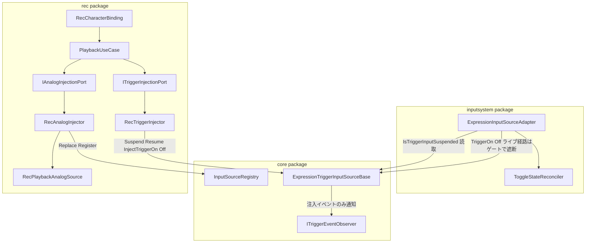
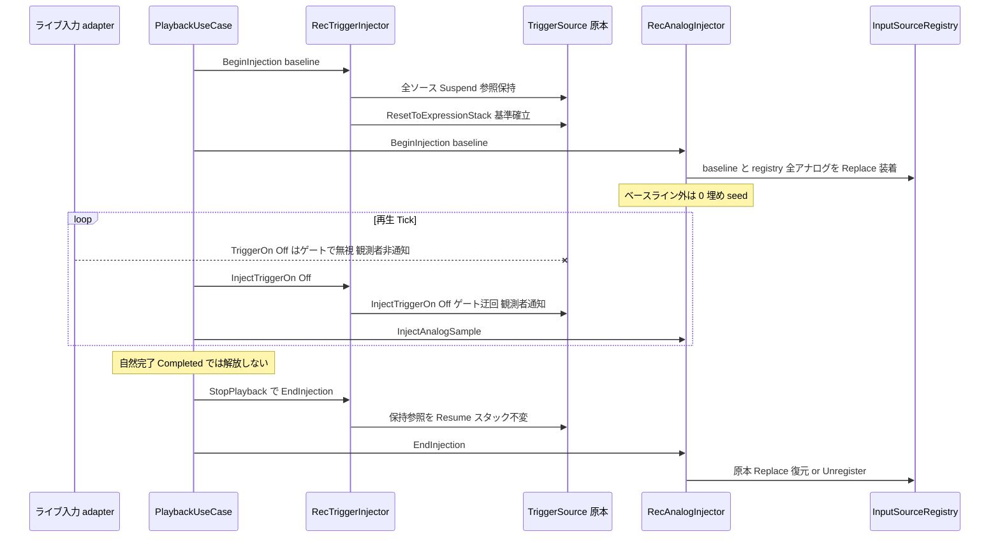
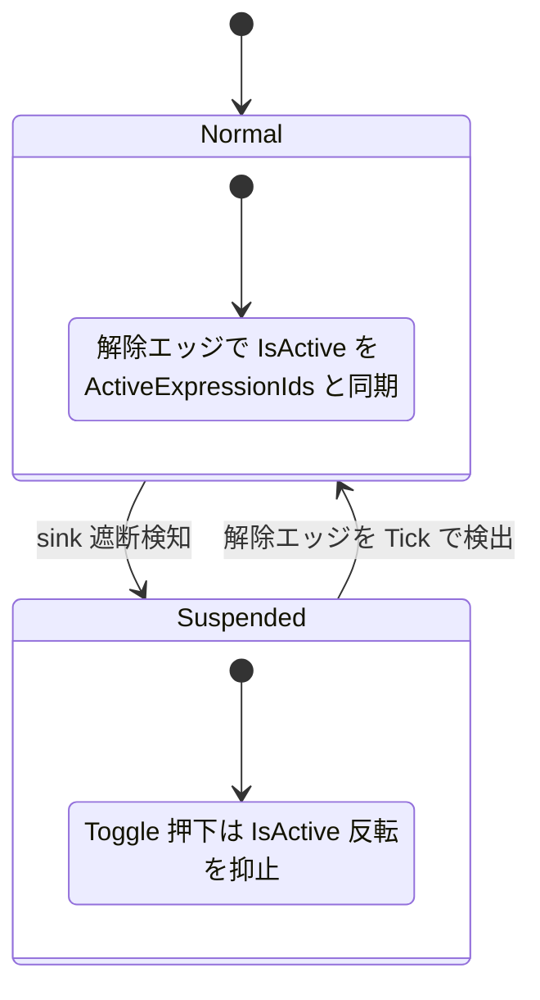

# Technical Design Document — rec-playback-input-exclusivity

## Overview

**Purpose**: 本機能は、REC（`com.hidano.facialcontrol.rec`）の再生中にコントローラ等のライブ入力（トリガー on/off・アナログ軸値・gaze）が再生結果へ混入しない入力排他を、Unity エンジニアに提供する。

**Users**: FacialControl を利用する Unity エンジニアが、REC 再生を記録どおりの決定的なブレンド再現として利用する。再生中のコントローラ誤操作・接続デバイスのライブ値が結果を乱さない。

**Impact**: 既存 spec rec-recording-playback の「トリガーは差し替えず原本インスタンスを直接駆動する」設計判断（同 design.md:302/798）は原本直接駆動という点で維持しつつ、その帰結である「ライブ入力も素通しになる」挙動を本 spec が上書きする。core の `ExpressionTriggerInputSourceBase` にライブ入力の遮断面（Suspend/Resume）と遮断迂回の注入面（Inject）を追加し、rec のトリガー注入ポートをアナログ注入ポートと対称のライフサイクルへ再形成する。あわせてアナログ / gaze 側の残余ギャップ（記録ベースライン外ソースの素通し）も塞ぎ、inputsystem の Toggle バインド状態整合を最小改修で解消する。

### Goals
- 再生中のライブトリガー入力を core のゲートで遮断し、再生駆動イベントのみ注入経路で通す（観測者通知あり = 再生中の記録維持）
- アナログ / gaze の遮断対象を「記録ベースライン ∪ registry 登録済み全アナログソース」へ拡大する（ベースライン外は 0 埋め seed）
- 排他の確立・解放を trigger → analog の一貫順序で行い、`StopPlayback` を唯一の解放点とする
- 遮断中の Toggle 押下による `entry.IsActive` の乖離を、遮断中抑止 + 解除時同期の両方で解消する
- 未使用時（遮断・注入とも不使用）の core の挙動・性能を bit 単位で不変に保つ

### Non-Goals
- 排他の on/off オプション（常時有効。設定は設けない）
- osc / lipsync / ifacialmocap / timeline パッケージの改修
- 再生中に新規登録された入力ソースの遮断（開始時スナップショット方式の既知制限として文書化）
- 記録機能・`.fcrec` 永続化フォーマットの変更
- rec-recording-playback 側 design.md ファイルの改稿（上書き関係の明記は本書で行う。原本の書き換えはスコープ外）

## Boundary Commitments

### This Spec Owns
- `ExpressionTriggerInputSourceBase` のトリガー入力遮断面（`SuspendTriggerInput` / `ResumeTriggerInput` / `IsTriggerInputSuspended`）と注入面（`InjectTriggerOn` / `InjectTriggerOff`）の契約
- `ITriggerInjectionPort` の新形状（`BeginInjection` / `InjectTriggerOn` / `InjectTriggerOff` / `EndInjection`）
- 再生セッション中の入力排他ライフサイクル（確立順序・解放点・部分状態の禁止）
- `RecAnalogInjector` の遮断対象決定規則（ベースライン ∪ registry 全アナログソース、0 埋め seed）
- inputsystem の Toggle 状態整合規則（遮断中抑止 + 解除エッジ同期）と、その EditMode テスト継ぎ目（`ToggleStateReconciler`）

### Out of Boundary
- トリガーイベントの観測バス（`ITriggerEventObserver` / `IFacialInputObservationBus`）の契約 — rec-recording-playback が所有（本 spec は通知有無の規則のみ追加）
- アナログ注入の占有規則（`IInjectedInputSource`）・復元規則（`ReplacedSource`）— rec-recording-playback design.md:427-448 の既存契約を流用し変更しない
- `ResetToExpressionStack` の挙動（遷移なし即時確立・観測者非通知）— 既存のまま。ゲート非適用という関係性のみ本 spec が規定
- Hold / Analog / gaze バインドの inputsystem 既存挙動（Req 7.3）

### Allowed Dependencies
- rec → core（`ExpressionTriggerInputSourceBase` の新 API、`IInputSourceRegistry`、`IAnalogInputSource`）— 既存方向
- inputsystem → core（sink 直参照での `IsTriggerInputSuspended` 読み取り）— 既存方向（registry 非経由・0-alloc）
- core は rec / inputsystem を知らない（rec-recording-playback Req 6.6 維持）。core 改修は観測面・注入面・遮断面の追加に限定

### Revalidation Triggers
- `ITriggerInjectionPort` の形状変更（利用者: `RecCharacterBinding`、`PlaybackUseCaseTests` の Fake）
- `ExpressionTriggerInputSourceBase` の公開 API 追加（派生: inputsystem sink、timeline `TimelineExpressionStateSink`、rec テストの `TestTriggerSource`）
- `Replace/Register` による入力ソース差し替え規則の変更（`rec-timeline-baking` 等の追随利用者に影響）
- rec-recording-playback design.md:302/306/798 の「ライブ素通し」記述 — **本 spec が上書きする**。以後、再生中のライブ TriggerOn/Off は遮断が正となる（再生中の記録には注入イベントのみが残る）

## Architecture

### Existing Architecture Analysis

- **原本直接駆動（rec-recording-playback design.md:302）**: トリガーは registry 差し替えではなく原本 `ExpressionTriggerInputSourceBase` を直接駆動する。停止時にスタックが sink に残り、ライブ引き継ぎ（同 Req 3.5）が構造的に成立する。本 spec はこの構造を維持したままゲートを重ねる
- **sink 直参照問題**: `ExpressionInputSourceAdapter` は sink をフィールド直参照で押すため registry `Replace` では遮断不能。遮断は core インスタンス自身が持つしかない（research.md 参照）
- **面の後付け注入の前例**: `SetTriggerEventObserver` が「core に観測面だけ追加し rec を知らせない」既存パターン。遮断面・注入面も同型で追加する
- **再入吸収パターン**: `RecAnalogInjector.BeginInjection` は冒頭で自己 `EndInjection()` を呼ぶ。トリガー側も同型にする
- **gaze の扱い**: gaze は 2 軸アナログとして統一済み（rec-recording-playback の既存判断）。本 spec でも専用経路は設けない

### Architecture Pattern & Boundary Map



**Architecture Integration**:
- **Selected pattern**: Approach A — 既存コンポーネント拡張（**ユーザー決定**）。`ExpressionTriggerInputSourceBase` に per-instance ゲートを直接追加する。集中ゲートサービス（B-2）・rec 側一貫性クラス分離（C）は不採用（比較は research.md）
- **Domain boundaries**: 遮断状態は各 sink インスタンスが所有。誰を遮断するか（スナップショット）と Resume 責務は `RecTriggerInjector` が所有。Toggle 整合状態は inputsystem の `BindingEntry` が所有
- **Existing patterns preserved**: 観測面後付け注入（`SetTriggerEventObserver`）、`IInjectedInputSource` 占有規則、`ReplacedSource` 復元、warn-once ログ、`BeginInjection` 冒頭の再入吸収
- **New components rationale**: 新規クラスは `ToggleStateReconciler`（inputsystem 内 internal）のみ。Req 5.6（Fake のみ EditMode 検証）のため `InputAction.CallbackContext` 非依存の純ロジックとして分離する
- **Steering compliance**: 依存方向（rec → core、inputsystem → core、core は両者を知らない）を維持。Domain 層は Unity 非依存契約のまま

### Technology Stack

新規外部依存なし。既存スタック（Unity 6000.3.19f1 / C# / com.unity.inputsystem 1.17.0 / com.unity.test-framework 1.6.0）の範囲内で成立する。

| Layer | Choice | Role in Feature | Notes |
|-------|--------|-----------------|-------|
| core Domain | `ExpressionTriggerInputSourceBase`（改修） | 遮断ゲート + 注入面の実体 | Unity 非依存。bool 分岐 1 個の追加のみ |
| rec Domain/Adapters | `ITriggerInjectionPort` 再形成 + 注入アダプタ改修 | 排他ライフサイクルの実行 | 破壊的変更（preview 段階で許容、利用箇所 2 件） |
| inputsystem Adapters | `ExpressionInputSourceAdapter` 最小改修 + `ToggleStateReconciler` 新設 | Toggle 状態整合 | rec-recording-playback Req 6.7 の inputsystem 限定緩和 |

## File Structure Plan

### New Files

```
FacialControl/Packages/com.hidano.facialcontrol.inputsystem/
├── Runtime/
│   ├── AssemblyInfo.cs                                  # InternalsVisibleTo(Tests.EditMode) 追加（core/lipsync の前例踏襲）
│   └── Adapters/InputSources/ToggleStateReconciler.cs   # internal。Toggle 反転抑止・解除時同期の純ロジック
└── Tests/EditMode/Adapters/InputSources/
    └── ToggleStateReconcilerTests.cs                    # Fake sink による EditMode 検証
```

### Modified Files

| ファイル | 変更内容 |
|---------|---------|
| `com.hidano.facialcontrol/Runtime/Domain/Services/ExpressionTriggerInputSourceBase.cs` | 遮断面（`SuspendTriggerInput`/`ResumeTriggerInput`/`IsTriggerInputSuspended`）+ 注入面（`InjectTriggerOn/Off`）追加。`TriggerOn/Off` 本体を private コアへ切り出し 2 面から呼ぶ |
| `com.hidano.facialcontrol/Tests/EditMode/Domain/ExpressionTriggerInputSourceBaseTests.cs` | ゲート・注入面のテスト追加（既存テストは全緑維持 = Req 5.1/5.2 の回帰ガード） |
| `com.hidano.facialcontrol.rec/Runtime/Domain/Interfaces/ITriggerInjectionPort.cs` | `EstablishBaseline` を `BeginInjection(baseline)` へ吸収、`EndInjection` 追加（`IAnalogInjectionPort` と対称化） |
| `com.hidano.facialcontrol.rec/Runtime/Adapters/Playback/RecTriggerInjector.cs` | `BeginInjection` で全トリガーソースの Suspend + baseline 確立、`EndInjection` で保持参照を Resume |
| `com.hidano.facialcontrol.rec/Runtime/Adapters/Playback/RecAnalogInjector.cs` | `BeginInjection` の走査を「baseline ∪ registry 全アナログソース」へ拡大。ベースライン外は 0 埋め seed |
| `com.hidano.facialcontrol.rec/Runtime/Application/UseCases/PlaybackUseCase.cs` | `StartPlayback` で trigger→analog `BeginInjection`、`StopPlayback` で trigger→analog `EndInjection` |
| `com.hidano.facialcontrol.inputsystem/Runtime/Adapters/InputSources/ExpressionInputSourceAdapter.cs` | Toggle 分岐の反転抑止（`ToggleStateReconciler` 経由）+ `Tick` での解除エッジ検出と同期 |
| `com.hidano.facialcontrol.rec/Tests/EditMode/{RecTriggerInjectorTests, RecAnalogInjectorTests, PlaybackUseCaseTests}.cs` | 新契約への追随（Fake の `Begin/End` カウンタ + 呼出順記録化を含む） |
| `com.hidano.facialcontrol.rec/README.md`, `Documentation~/README.md` | 既知制限 2 点の文書化（Req 6.1/6.2） |

> `RecCharacterBinding.cs` はポート再形成に伴うコンパイル追随のみ（`EnsurePlaybackSession` の構築コードは変更不要。`CollectTriggerSources` は `RecTriggerInjector` が流用）。

## System Flows

### 再生開始〜停止の排他ライフサイクル



**フロー上の決定**:
- **Suspend → Reset の順**（`BeginInjection` 内）: ゲートを立ててから基準確立するため、確立後にライブイベントが割り込む余地がない
- **確立・解放とも trigger → analog の一貫順序**（Req 4.4）: `PlaybackUseCase` のみが順序を所有し、部分的排他状態を定常状態として残さない。`Load` 冒頭の `StopPlayback()` も同順序に乗る
- **再入**: `BeginInjection` は冒頭で内部 `EndInjection` を行い、最新の registry スナップショットで取り直す（Completed→再 Start は冪等 Suspend でも吸収される二重防御）
- **解放点は `StopPlayback` のみ**（Req 4.3）: 自然完了（Completed）では両ポートとも解放しない（アナログ既存挙動と対称）

### Toggle 状態整合（inputsystem）



- (a) 遮断中の Toggle 押下: `sink.IsTriggerInputSuspended` を確認し、反転自体を抑止（`TriggerOn/Off` も発行しない）
- (b) 解除エッジ: `Tick(float)`（FacialController から毎フレーム呼出）で各 sink の遮断状態の立ち下がりを検出し、Toggle エントリの `IsActive` を `sink.ActiveExpressionIds` の包含判定（Ordinal 線形走査）で確定する
- keyboard / controller sink が同一インスタンスの場合は `ReferenceEquals` で重複処理をスキップ
- フレーム順序: InputSystem のイベント処理は `Tick`（LateUpdate 経由）より前。遮断中の押下は (a) で抑止済みのため、解除と同一フレームでも stale 反転は発生しない

## Requirements Traceability

| Requirement | Summary | Components | Interfaces | Flows |
|-------------|---------|------------|------------|-------|
| 1.1 | 遮断面の提供・冪等 | ExpressionTriggerInputSourceBase | SuspendTriggerInput / ResumeTriggerInput | 排他ライフサイクル |
| 1.2 | 遮断中のライブ TriggerOn/Off 無視 | ExpressionTriggerInputSourceBase | TriggerOn / TriggerOff（ゲート適用） | 同上 loop 部 |
| 1.3 | 無視イベントの観測者非通知 | ExpressionTriggerInputSourceBase | ITriggerEventObserver（非通知規則） | 同上 |
| 1.4 | 解除時スタック維持 | ExpressionTriggerInputSourceBase | ResumeTriggerInput（事後条件） | 同上 |
| 1.5 | ResetToExpressionStack はゲート対象外 | ExpressionTriggerInputSourceBase | ResetToExpressionStack（既存のまま） | 同上 |
| 1.6 | 排他は常時有効・オプションなし | PlaybackUseCase / RecTriggerInjector | —（設定面を設けない） | — |
| 2.1 | 注入はライブ同一のスタック処理 | ExpressionTriggerInputSourceBase | InjectTriggerOn / InjectTriggerOff | 同上 loop 部 |
| 2.2 | 注入イベントの観測者通知 | ExpressionTriggerInputSourceBase | ITriggerEventObserver | 同上 |
| 2.3 | 注入はゲート状態と無関係に機能 | ExpressionTriggerInputSourceBase | InjectTriggerOn / InjectTriggerOff | — |
| 2.4 | トリガーポートのアナログ対称化 | ITriggerInjectionPort / RecTriggerInjector | BeginInjection / EndInjection | 排他ライフサイクル |
| 3.1 | 全アナログ / gaze ソースの遮断 | RecAnalogInjector | BeginInjection（走査拡大） | 同上 |
| 3.2 | ライブ値の非反映 | RecAnalogInjector / RecPlaybackAnalogSource | IInjectedInputSource 占有 | 同上 |
| 3.3 | ベースライン外の確定的 seed | RecAnalogInjector | BeginInjection（0 埋め） | 同上 |
| 3.4 | 開始時スナップショット方式 | RecTriggerInjector / RecAnalogInjector | BeginInjection | 同上 |
| 4.1 | イベント発火前の排他確立 | PlaybackUseCase | StartPlayback | 同上 |
| 4.2 | StopPlayback での両解放 | PlaybackUseCase | StopPlayback | 同上 |
| 4.3 | 自然完了で解放しない | PlaybackUseCase | Tick / Completed | 同上 Note |
| 4.4 | 一貫順序・部分状態禁止 | PlaybackUseCase | StartPlayback / StopPlayback | 同上 |
| 5.1 | core 改修は面の追加に限定 | ExpressionTriggerInputSourceBase | 追加 API 一式（既存パス不変） | — |
| 5.2 | 未使用時の挙動・性能不変 | ExpressionTriggerInputSourceBase | ゲート bool 分岐 1 個 | — |
| 5.3 | core は rec を知らない | ExpressionTriggerInputSourceBase | —（rec 型を参照しない） | — |
| 5.4 | 拡張パッケージ無改修（inputsystem のみ緩和） | ExpressionInputSourceAdapter / ToggleStateReconciler | —（他 4 パッケージは触れない） | — |
| 5.5 | 毎フレーム GC ゼロ | 全コンポーネント | —（定常経路 0-alloc 設計） | — |
| 5.6 | Fake のみ EditMode 検証 | ToggleStateReconciler / 各テスト | InternalsVisibleTo | — |
| 6.1 | 新規登録ソース対象外の文書化 | rec README / Documentation~ | — | — |
| 6.2 | timeline 経由も遮断の文書化 | rec README / Documentation~ | — | — |
| 7.1 | Toggle 状態の乖離防止 | ExpressionInputSourceAdapter / ToggleStateReconciler | TryFlip / SyncWithStack | Toggle 状態整合 |
| 7.2 | 解除後の空振りなし | 同上 | 同上 | 同上 |
| 7.3 | Hold / Analog / gaze 無変更 | ExpressionInputSourceAdapter | —（Toggle 分岐のみ改修） | — |
| 7.4 | 遮断未発生時は挙動不変 | 同上 | —（bool 読取のみ） | — |

## Components and Interfaces

| Component | Domain/Layer | Intent | Req Coverage | Key Dependencies | Contracts |
|-----------|--------------|--------|--------------|------------------|-----------|
| ExpressionTriggerInputSourceBase | core / Domain | トリガー入力の遮断ゲート + 注入面 | 1.1–1.5, 2.1–2.3, 5.1–5.3, 5.5 | ITriggerEventObserver (P1) | Service, State |
| RecTriggerInjector | rec / Adapters | 全トリガーソースの Suspend/Resume と注入駆動 | 2.4, 3.4, 1.6 | ExpressionTriggerInputSourceBase (P0) | Service |
| ITriggerInjectionPort | rec / Domain | トリガー注入ポートの対称ライフサイクル契約 | 2.4 | — | Service |
| RecAnalogInjector | rec / Adapters | アナログ / gaze 遮断対象の全ソース拡大 | 3.1–3.4 | IInputSourceRegistry (P0), RecPlaybackAnalogSource (P0) | Service |
| PlaybackUseCase | rec / Application | 排他確立・解放の順序統制 | 4.1–4.4, 1.6 | ITriggerInjectionPort (P0), IAnalogInjectionPort (P0) | Service, State |
| ExpressionInputSourceAdapter | inputsystem / Adapters | Toggle 反転抑止 + 解除エッジ同期の配線 | 7.1–7.4, 5.4 | ExpressionTriggerInputSourceBase (P0), ToggleStateReconciler (P0) | State |
| ToggleStateReconciler | inputsystem / Adapters (internal) | Toggle 整合の純ロジック（EditMode テスト継ぎ目） | 7.1, 7.2, 5.6 | — | Service |
| rec ドキュメント | rec / Documentation | 既知制限の文書化 | 6.1, 6.2 | — | — |

### core / Domain

#### ExpressionTriggerInputSourceBase（改修）

| Field | Detail |
|-------|--------|
| Intent | トリガー入力の per-instance 遮断ゲートと、ゲートを迂回する注入面を既存基底へ追加する |
| Requirements | 1.1, 1.2, 1.3, 1.4, 1.5, 2.1, 2.2, 2.3, 5.1, 5.2, 5.3, 5.5 |

**Responsibilities & Constraints**
- 遮断状態（bool 1 個）を自身で所有する。誰が・いつ遮断するかは知らない（rec 型を参照しない = Req 5.3）
- `TriggerOn/Off` の本体を private コア（例: `TriggerOnCore/TriggerOffCore`）へ切り出し、ライブ面（ゲート適用）と注入面（ゲート迂回）の 2 面から呼ぶ。切り出しは純リファクタであり既存挙動を変更しない（Req 5.1）
- ゲート中のライブ `TriggerOn/Off` は無視 + 観測者非通知 + **ログなし**（毎イベント警告は GC / ノイズ源のため出さない）
- `ResetToExpressionStack` はゲート非適用（既存性質のまま。rec-recording-playback Req 3.8 の基準確立を遮断中も成立させる）
- 引数 null 検証はゲート判定より先に行う（既存の `ArgumentNullException` 契約を遮断中も維持）

**Dependencies**
- Inbound: inputsystem sink / timeline `TimelineExpressionStateSink` / rec テスト `TestTriggerSource` — 派生としてゲートを自動継承（P1）
- Inbound: `RecTriggerInjector` — Suspend/Resume/Inject の呼出元（P0）
- Outbound: `ITriggerEventObserver` — 注入イベントのみ通知（P1）

**Contracts**: Service [x] / State [x]

##### Service Interface

```csharp
public abstract class ExpressionTriggerInputSourceBase : IInputSource
{
    /// <summary>ライブトリガー入力が遮断中かどうか。inputsystem アダプタが sink 直参照で読む（registry 非経由・0-alloc）。</summary>
    public bool IsTriggerInputSuspended { get; }

    /// <summary>ライブトリガー入力の遮断を開始する。冪等。</summary>
    /// <returns>状態が未遮断→遮断へ変化した場合 true。既に遮断中なら false（状態・副作用なし）。</returns>
    public bool SuspendTriggerInput();

    /// <summary>遮断を解除する。冪等。スタック・遷移状態は変更しない。</summary>
    /// <returns>状態が遮断→解除へ変化した場合 true。未遮断なら false（状態・副作用なし）。</returns>
    public bool ResumeTriggerInput();

    /// <summary>ゲートを迂回して TriggerOn を実行する（再生駆動用）。観測者へ通知する。</summary>
    /// <exception cref="ArgumentNullException">expressionId が null。</exception>
    public void InjectTriggerOn(string expressionId);

    /// <summary>ゲートを迂回して TriggerOff を実行する（再生駆動用）。削除成功時のみ観測者へ通知する。</summary>
    /// <exception cref="ArgumentNullException">expressionId が null。</exception>
    public void InjectTriggerOff(string expressionId);

    // 既存 API（シグネチャ不変・ゲート適用のみ追加）
    public void TriggerOn(string expressionId);   // 遮断中: null 検証後に無視（スタック不変・観測者非通知・ログなし）
    public void TriggerOff(string expressionId);  // 同上
    public void ResetToExpressionStack(IReadOnlyList<string> expressionIds); // ゲート非適用（不変）
}
```

- Preconditions: なし（遮断状態は任意のタイミングで変更可）
- Postconditions: `Resume` 後の `ActiveExpressionIds` は解除時点と同一（Req 1.4）。`InjectTriggerOn/Off` の結果状態はライブ `TriggerOn/Off` と bit 単位で同一（Req 2.1）
- Invariants: 遮断未使用かつ注入未使用なら、追加コストはライブ `TriggerOn/Off` 内の bool 分岐 1 個のみ（Req 5.2）。全 API で 0-alloc（Req 5.5）

##### State Management
- State model: `_isTriggerInputSuspended : bool`（per-instance、初期値 false）
- Persistence: なし（ランタイム状態のみ。ドメインリロードで自然消滅）
- Concurrency: メインスレッド前提（既存契約と同一）

**Implementation Notes**
- Integration: `TriggerOn/Off` → private コア切り出しの際、`_triggerEventObserver` 通知はコア側に残す（注入面から同一通知が出る = Req 2.2）
- Validation: 既存 `ExpressionTriggerInputSourceBaseTests` の全緑維持を Req 5.1/5.2 の回帰ガードとする
- Risks: 派生（timeline sink）がゲートを自動継承するため、timeline 経由の TriggerOn/Off も再生中は遮断される — 意図した仕様であり既知制限として文書化（Req 6.2）

### rec / Domain + Adapters

#### ITriggerInjectionPort(再形成)

| Field | Detail |
|-------|--------|
| Intent | トリガー注入ポートを `IAnalogInjectionPort` と対称のライフサイクル契約へ再形成する |
| Requirements | 2.4 |

**Contracts**: Service [x]

##### Service Interface

```csharp
namespace Hidano.FacialControl.Rec.Domain.Interfaces
{
    /// <summary>再生のトリガー出力ポート。IAnalogInjectionPort と対称のライフサイクルを持つ。</summary>
    public interface ITriggerInjectionPort
    {
        /// <summary>排他の確立（全トリガーソースの遮断）と記録された基準状態の確立を一体で行う。再入時は内部で EndInjection してから取り直す。</summary>
        void BeginInjection(RecBaselineState baseline);

        void InjectTriggerOn(string sourceId, string expressionId);

        void InjectTriggerOff(string sourceId, string expressionId);

        /// <summary>排他を解放する。スタックは解除時点のまま維持される（ライブ引き継ぎ）。冪等。</summary>
        void EndInjection();
    }
}
```

- 旧 `EstablishBaseline(baseline)` は `BeginInjection(baseline)` へ吸収する（破壊的変更。利用箇所は `RecCharacterBinding.EnsurePlaybackSession` と `PlaybackUseCaseTests` の Fake のみでコスト低。preview 段階の破壊的変更許容方針に整合）

#### RecTriggerInjector（改修）

| Field | Detail |
|-------|--------|
| Intent | 再生開始時に全トリガーソースを Suspend + 基準確立し、停止時に保持参照を Resume する |
| Requirements | 2.4, 3.4, 1.6 |

**Responsibilities & Constraints**
- `BeginInjection`: 内部 `EndInjection()`（再入吸収）→ `_getAllTriggerSources()`（`CollectTriggerSources` 流用）で**開始時点の全トリガーソースを列挙**し、参照を `_suspendedSources`（`List<ExpressionTriggerInputSourceBase>`、再利用バッファ）へ保持 → 各ソースを `SuspendTriggerInput()` → `ResetToExpressionStack`（baseline あり: 記録スタック / なし: 空スタック。既存ロジック踏襲）。**Suspend → Reset の順**により、基準確立後のライブイベント割り込みを構造的に排除する
- `InjectTriggerOn/Off`: 既存の id 解決（`_resolveTriggerSource` + warn-once）を維持し、呼び先を `TriggerOn/Off` から `InjectTriggerOn/Off` へ変更する。注入はゲート状態と無関係に機能する（Req 2.3）ため、スナップショット外ソースへの注入イベントも従来どおり届く
- `EndInjection`: `_suspendedSources` の保持参照を `ResumeTriggerInput()` して clear。**registry 非経由**のため、再生中に Unregister されたソースも安全に Resume できる。冪等（空なら no-op）
- 遮断対象は `BeginInjection` 時点のスナップショットで固定（Req 3.4。再生中の新規登録ソースは対象外 = 既知制限）

**Dependencies**
- Inbound: `PlaybackUseCase` — ポート経由の呼出（P0）
- Outbound: `ExpressionTriggerInputSourceBase` — Suspend/Resume/Inject/Reset（P0）

**Contracts**: Service [x]（`ITriggerInjectionPort` の実装）

**Implementation Notes**
- Integration: コンストラクタ・`RecCharacterBinding` の構築コードは不変（`Func` 2 本の注入をそのまま使う）
- Validation: 「Suspend 済みソースが Unregister された後の EndInjection で Resume されること」「再入時に古いスナップショットが解放されること」をテストで固定
- Risks: `_suspendedSources` の参照保持がソース寿命を延ばすが、セッション中のみでありリークではない

#### RecAnalogInjector（改修）

| Field | Detail |
|-------|--------|
| Intent | 遮断対象を「baseline ∪ registry 登録済み全アナログ / gaze ソース」へ拡大する |
| Requirements | 3.1, 3.2, 3.3, 3.4 |

**Responsibilities & Constraints**
- `BeginInjection` を 2 段走査にする:
  1. **baseline 走査**（既存ロジック不変）: `AnalogEntries` を記録値 seed で装着
  2. **registry 走査**（追加）: `RegisteredIds` を列挙し、「`IAnalogInputSource` であり、未装着（`_attachedSources` に無い）で、`IInjectedInputSource` でない」ソースを `RecPlaybackAnalogSource`（axisCount はライブの `AxisCount`）で Replace 装着。seed は **0 埋め**（gaze は中立 0,0）
- **seed = 0 埋め（ユーザー決定・Req 3.3）**: 再生結果の決定的再現を優先し、再生開始時の表情跳びは許容する。ライブ値が読めない場合（`TryReadAxes` 失敗 / `IsValid == false`）のフォールバック分岐も 0 埋めに統合され、分岐自体が消える（ライブ値は一切読まない）
- 占有規則（`IInjectedInputSource` スキップ + warn-once）・`ReplacedSource` 復元・`EndInjection` は既存契約を流用し変更しない（装着元によらず同一経路で復元）
- `AxisCount <= 0` のソースは装着せずスキップ（既存 warn-once 系を流用）

**Dependencies**
- Inbound: `PlaybackUseCase` — ポート経由の呼出（P0）
- Outbound: `IInputSourceRegistry` — Replace/Register/Unregister/TryResolve/RegisteredIds（P0）
- Outbound: `RecPlaybackAnalogSource` — 装着実体（P0）

**Contracts**: Service [x]（`IAnalogInjectionPort` の実装。インターフェース自体は不変）

**Implementation Notes**
- Integration: `BeginInjection` は非毎フレーム処理のため、0 埋めバッファ等のヒープ確保を許容（Req 5.5 は定常処理のみが対象）
- Validation: 「baseline 外ソースが 0 で確定すること」「gaze 2 軸が (0,0) になること」「baseline 内ソースの seed が記録値優先であること（走査順の regress ガード）」をテストで固定
- Risks: 記録時に存在しなかった多軸デバイスの 0 埋めがユーザーに「入力が死んだ」と誤認される可能性 — 再生中である旨は既存の再生 UI/状態で判別可能。文書化で補足

#### PlaybackUseCase（改修）

| Field | Detail |
|-------|--------|
| Intent | 排他の確立・解放を一貫順序（trigger → analog）で統制する唯一のオーナー |
| Requirements | 4.1, 4.2, 4.3, 4.4, 1.6 |

**Responsibilities & Constraints**
- `StartPlayback`: `_triggerPort.BeginInjection(baseline)` → `_analogPort.BeginInjection(baseline)` → `_scheduler.Load(timeline)`。排他確立はイベント発火開始より前（Req 4.1）
- `StopPlayback`: `_triggerPort.EndInjection()` → `_analogPort.EndInjection()` → scheduler リセット。確立・解放とも trigger → analog の同一順序（Req 4.4）
- 自然完了（`Tick` 内 Completed / `StartPlayback` 直後の即時 Completed）では**どちらのポートも解放しない**（Req 4.3。`State == Completed` から `StopPlayback` は通る既存ガード条件を維持し、`StopPlayback` を唯一の解放点とする）
- `Load` 冒頭の `StopPlayback()` は新順序へ自動的に乗る（変更不要）

**Contracts**: Service [x] / State [x]（`RecPlaybackState` 遷移は既存のまま）

**Implementation Notes**
- Integration: `EstablishBaseline` 呼出 1 行の置換 + `StopPlayback` への 1 行追加が本体。フィルタ済み baseline（missing expressionId 除去）の生成は不変
- Validation: Fake ポートを Begin/End カウンタ + 呼出順記録に更新し、「Start で T.Begin→A.Begin の順」「Stop で T.End→A.End の順」「Completed で End が呼ばれない」を固定
- Risks: なし（順序所有を UseCase に一元化しており、部分状態は Begin/End の対で構造的に排除される）

### inputsystem / Adapters

#### ToggleStateReconciler（新規・internal）

| Field | Detail |
|-------|--------|
| Intent | Toggle 反転抑止と解除時同期を `InputAction.CallbackContext` 非依存の純ロジックとして提供する（EditMode テスト継ぎ目） |
| Requirements | 7.1, 7.2, 5.6 |

**Responsibilities & Constraints**
- 状態を持たない internal static クラス。判定に必要な情報（遮断状態・エントリ状態・アクティブ ID リスト）をすべて引数で受ける
- `BindingEntry` は internal インターフェース `IToggleStateEntry` を実装し、Reconciler はこの抽象のみに依存する（Fake エントリで EditMode 検証可能）

**Contracts**: Service [x]

##### Service Interface

```csharp
namespace Hidano.FacialControl.Adapters.InputSources
{
    /// <summary>Toggle バインドの状態 1 件分の読み書き面（BindingEntry が実装）。</summary>
    internal interface IToggleStateEntry
    {
        string ExpressionId { get; }
        bool IsActive { get; set; }
    }

    /// <summary>Toggle 状態整合の純ロジック。0-alloc。</summary>
    internal static class ToggleStateReconciler
    {
        /// <summary>Toggle 押下時の反転を試みる。遮断中は状態不変で false（呼出側は TriggerOn/Off を発行しない）。</summary>
        public static bool TryFlip(bool isTriggerInputSuspended, IToggleStateEntry entry);

        /// <summary>遮断解除エッジで呼ぶ。IsActive を activeExpressionIds の包含（Ordinal 線形走査）で確定する。</summary>
        public static void SyncWithStack(IReadOnlyList<string> activeExpressionIds, IToggleStateEntry entry);
    }
}
```

- Preconditions: なし
- Postconditions: `TryFlip` が true のとき `IsActive` は反転済み（呼出側は新値に応じ `TriggerOn/Off` を発行）。`SyncWithStack` 後の `IsActive` は `activeExpressionIds.Contains(ExpressionId)`（Ordinal）と一致
- Invariants: 両メソッドとも 0-alloc（`Contains` は for 走査で実装。LINQ 禁止）

#### ExpressionInputSourceAdapter（改修）

| Field | Detail |
|-------|--------|
| Intent | Toggle 分岐と Tick へ Reconciler を配線する最小改修 |
| Requirements | 7.1, 7.2, 7.3, 7.4, 5.4 |

**Responsibilities & Constraints**
- `DispatchPerformed` の Toggle 分岐のみ改修: 反転を `ToggleStateReconciler.TryFlip(sink.IsTriggerInputSuspended, entry)` 経由にする。Hold / Value（Analog）分岐は無改修（Req 7.3。Hold は押下↔解放で `IsActive` が自己整合するため対処不要）
- `Tick(float)` に解除エッジ検出を追加: `_wasKeyboardSuspended` / `_wasControllerSuspended`（bool 2 個）で各 sink の遮断状態の立ち下がりを検出し、立ち下がった sink に属する **Toggle モードの** エントリへ `SyncWithStack(sink.ActiveExpressionIds, entry)` を適用する。エントリ→sink の対応は既存 `ResolveSink(entry.Action)` を流用（エッジフレームのみ実行）。keyboard / controller が同一インスタンスなら `ReferenceEquals` で片側のみ処理
- 遮断が一度も発生しない場合の追加コストは、Toggle 押下時の bool 読取 + `Tick` の bool 比較 2 回のみ（Req 7.4: 挙動不変）。定常フレームで 0-alloc（Req 5.5。`_bindings` の Dictionary 列挙は struct enumerator）

**Dependencies**
- Inbound: FacialController — `Tick` 呼出（P1、既存）
- Outbound: `ExpressionTriggerInputSourceBase` — `IsTriggerInputSuspended` / `ActiveExpressionIds` の sink 直読み（P0、registry 非経由）
- Outbound: `ToggleStateReconciler` — 整合判定（P0）

**Contracts**: State [x]（`BindingEntry.IsActive` の整合規則を上記のとおり変更）

**Implementation Notes**
- Integration: `Runtime/AssemblyInfo.cs` を新設し `[assembly: InternalsVisibleTo("Hidano.FacialControl.InputSystem.Tests.EditMode")]` を追加（core / lipsync の既存前例踏襲）。sink は `ExpressionTriggerInputSourceBase`（プレーンクラス）のため EditMode で実インスタンス構築可能であり、外部 Fake は不要
- Validation: Reconciler 単体（EditMode・Fake エントリ）+ 配線の代表ケース（遮断中押下→非発火、解除エッジ→同期）。`InputAction` 発火が要る網羅ケースは既存 PlayMode テスト（`ExpressionInputSourceAdapterTests`）へ追加してよいが、受け入れ判定は EditMode 側で完結させる（Req 5.6）
- Risks: `ResolveSink` はエントリの binding path から都度分類するため、エッジフレームの同期対象判定が binding 変更に追従する（意図どおり）。同期は Toggle エントリのみが対象で、Hold/Value の `IsActive` には触れない

### rec / Documentation

#### 既知制限の文書化（README.md / Documentation~/README.md）

| Field | Detail |
|-------|--------|
| Intent | 入力排他の既知制限を利用者向けに明示する |
| Requirements | 6.1, 6.2 |

記載内容（両ファイルの既知制限節へ追記）:
1. **再生開始後に新規登録された入力ソースは遮断対象外**（開始時スナップショット方式。トリガー・アナログ / gaze 共通）
2. **timeline パッケージ経由の TriggerOn/Off も再生中は遮断される**（`TimelineExpressionStateSink` が `ExpressionTriggerInputSourceBase` 派生のため。REC 再生と Timeline 再生の同時使用は非対応）

補足として、ベースライン外アナログソースが再生開始時に 0（gaze は中立）へ確定する挙動も記載する。

## Error Handling

### Error Strategy
本機能はエラーを投げない方針を既存系から踏襲する。Unity 標準ログのみ・warn-once パターンを維持し、毎イベントのログ出力は行わない。

### Error Categories and Responses
- **遮断中のライブ TriggerOn/Off**: エラーではない。無視 + 観測者非通知 + **ログなし**（高頻度イベントのため警告は GC / ノイズ源。Req 1.2/1.3）。null 引数のみ既存どおり `ArgumentNullException`
- **注入先ソース未解決**（記録に居るが現構成に無い id）: 既存の warn-once + スキップを維持（`RecTriggerInjector._warnedMissingSourceIds`）
- **アナログ装着系の異常**（不正 id / 占有済み / axisCount 不整合 / 復元時の参照不一致）: 既存の warn-once 群を流用。registry 走査由来のソースにも同一規則を適用
- **冪等操作の重複呼出**（Suspend 済み Suspend / 未遮断 Resume / 空 EndInjection）: エラーでもログでもなく静かな no-op（戻り値 bool で状態変化の有無のみ通知）

### Monitoring
- `InputSourceRegistry.Replace` の既存 Info ログが、アナログ注入・復元の監査ログを兼ねる（rec-recording-playback の既存決定を踏襲）
- トリガー側の Suspend/Resume は定常運用でログを出さない（診断は `IsTriggerInputSuspended` / `ActiveExpressionIds` の読み取りで行う）

## Testing Strategy

すべて Fake / 実インスタンス（プレーンクラス）で EditMode 配置（Req 5.6）。TDD（Red-Green-Refactor）厳守。テスト命名は `{Method}_{Condition}_{Expected}`。

### Unit Tests（core: ExpressionTriggerInputSourceBaseTests 追記）
1. `SuspendTriggerInput_重複呼出_2回目はfalseで状態不変`（Resume も対称に検証。1.1）
2. `TriggerOn_遮断中_スタック不変かつ観測者非通知`（TriggerOff も。1.2, 1.3）
3. `ResumeTriggerInput_遮断中にInjectで積んだスタック_解除後も維持`（1.4）
4. `ResetToExpressionStack_遮断中_基準確立が成立`（1.5）
5. `InjectTriggerOn_遮断中_ライブTriggerOnと同一結果かつ観測者通知`（遮断なしでも機能することを併せて検証。2.1, 2.2, 2.3）

### Unit Tests（inputsystem: ToggleStateReconcilerTests 新設）
1. `TryFlip_遮断中_falseでIsActive不変`（7.1）
2. `TryFlip_非遮断_IsActive反転でtrue`（7.4 の既存挙動同値性）
3. `SyncWithStack_スタックに含まれる_IsActiveがtrue`／`含まれない_false`（7.2）

### Integration Tests（rec: 既存テストクラスの改修・追加）
1. `RecTriggerInjectorTests`: `BeginInjection_全トリガーソース_Suspendされ基準確立される` / `EndInjection_Unregister済みソース_保持参照でResumeされる` / `BeginInjection_再入_旧スナップショットが先に解放される`（2.4, 3.4）
2. `RecAnalogInjectorTests`: `BeginInjection_ベースライン外ソース_0埋めseedでReplaceされる` / `BeginInjection_gazeソース_中立00で確定する` / `BeginInjection_ベースライン内ソース_記録値seedが優先される`（3.1–3.3）
3. `PlaybackUseCaseTests`: Fake 両ポートを Begin/End カウンタ + 呼出順記録へ更新し、`StartPlayback_排他確立_trigger先行でイベント発火前` / `StopPlayback_両解放_trigger先行` / `自然完了_解放されない`（4.1–4.4）
4. `ExpressionInputSourceAdapter` 配線: 遮断中 Toggle 押下の非発火と解除エッジ同期の代表ケース（実 sink インスタンス + `InternalsVisibleTo` 経由。7.1, 7.2）

### Performance / Regression
1. 既存 `ExpressionTriggerInputSourceBaseTests` 全緑維持（5.1, 5.2 の回帰ガード）
2. rec の既存 `RecGcZeroGateTests`（PlayMode）が再生定常フレームの GC ゼロを引き続き検証（5.5。排他有効中の Tick 経路が対象に含まれる）
3. inputsystem 既存 PlayMode テスト（`ExpressionInputSourceAdapterTests` / Allocation 系）の全緑維持（7.3, 7.4）

## Performance & Scalability

- **未使用時コスト**（Req 5.2）: ライブ `TriggerOn/Off` に bool 分岐 1 個、adapter `Tick` に bool 比較 2 回のみ。ヒープ・仮想呼出の追加なし
- **定常フレーム 0-alloc**（Req 5.5): ゲート判定・注入・Toggle 整合はすべて既存バッファ / bool / 線形走査で完結。`_suspendedSources` は `BeginInjection`（非定常）でのみ伸長し得る再利用 `List`
- **非定常処理のアロケーション許容**: `BeginInjection/EndInjection`（再生開始・停止時のみ）は 0 埋めバッファ・スナップショット構築のヒープ確保を許容する（steering の「毎フレーム処理でゼロ目標」に整合）
- 10 体同時制御時も遮断は per-instance bool のため線形コスト増のみ

## Migration Strategy

スキーマ・データ移行なし。`ITriggerInjectionPort` の破壊的変更は同一リポジトリ内の利用箇所 2 件（`RecCharacterBinding` / テスト Fake）の同時改修で完結する（preview 段階の破壊的変更許容方針）。`.fcrec` フォーマット・記録データへの影響はない。
