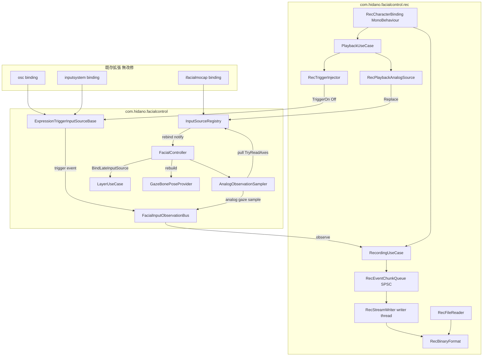
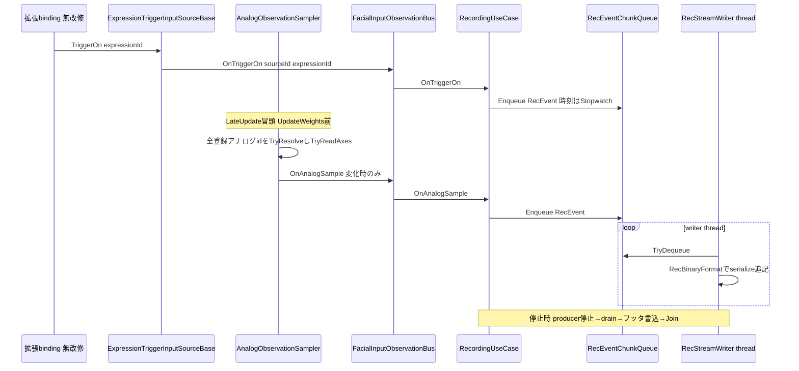
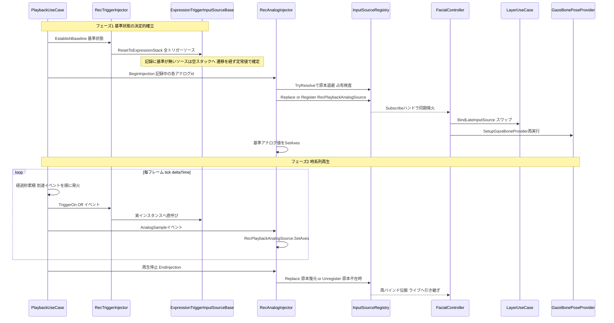

# Technical Design Document: rec-recording-playback

## Overview

**Purpose**: 本機能は、表情操作（トリガー on/off・アナログ軸値・gaze）を操作イベント時系列として記録し、本物の入力パイプラインを駆動するリアルタイム再生によって収録時プレビューと同一のブレンドを完全再現する REC 機能を、新規 UPM パッケージ `com.hidano.facialcontrol.rec` として Unity エンジニアに提供する。

**Users**: VTuber 配信・収録ワークフローを構築する Unity エンジニアが、パフォーマンス収録とその完全再現（および後続 spec でのベイク素材化）のために利用する。

**Impact**: core（`com.hidano.facialcontrol`）へ「操作イベントの観測面」と「入力ソース差し替えの注入面」を正式に追加する。既存コードパスの挙動は変更せず、観測者未登録かつ差し替え未実施なら既存の挙動・性能は完全に不変とする。既存 4 拡張パッケージ（osc / inputsystem / lipsync / ifacialmocap）は無改修。

### Goals

- 操作イベント（トリガー on/off + expressionId、アナログ軸値、gaze -1..1 Vector2）を秒ベース時系列で記録の正本とする
- 本物の入力パイプライン（`ExpressionTriggerInputSourceBase.TriggerOn/Off` とアナログ/gaze 値駆動）による再生で、遷移計算・レイヤー合成をライブと同一コードパスで実行させる
- 記録は別スレッドの sidecar ストリーミング書き出しとし、記録・再生とも毎フレーム定常処理のヒープ確保ゼロを達成する
- core の観測・注入面は後続 spec（`rec-timeline-baking`）および将来機能から再利用可能な正式 API として設計する

### Non-Goals

- Timeline 独自 Track・ベイク済みカーブ書き出し・スクラブ・Timeline 編集（後続 spec `rec-timeline-baking`）
- 音声解析・リップシンク音源の記録（既存方針どおりスコープ外。リップシンク由来の操作イベントは他入力と同様に観測面経由で記録される）
- ランタイム UI の提供
- 記録セッション中の `SetProfile` 再初期化を跨ぐ完全な記録保証（再購読 + 警告ログで継続するが、切替瞬間の欠落は許容）
- 拡張パッケージ内部の直接参照消費者（registry を介さない配線）への注入到達（下記 Boundary Commitments 参照）

## Boundary Commitments

### This Spec Owns

- 新規パッケージ `com.hidano.facialcontrol.rec` の全体（記録・再生・永続化・検証）
- 記録データ（sidecar `.fcrec` ファイル）のフォーマットとその正本性（操作イベントレベル、合成後 BlendShape 値は正本にしない）
- core への以下の面の追加（実装は core パッケージ内、契約のオーナーは本 spec）:
  - トリガー観測フック（`ExpressionTriggerInputSourceBase` の per-instance observer）
  - トリガー基準状態確立 API（`ExpressionTriggerInputSourceBase.ResetToExpressionStack` — 遷移を経ない定常状態スナップ）
  - 入力観測バス（`IFacialInputObservationBus` / `IFacialInputObserver`）とアナログ/gaze の pull サンプリング
  - Replace / Unregister 再バインド伝搬（レイヤー入力源 + GazeBonePoseProvider。Unregister は「ソース消滅 = 未解決時挙動への回帰」として伝搬）
  - 注入ソースのマーカー契約（`IInjectedInputSource`）と多重注入の占有規則（本 spec が注入面の契約オーナー。`rec-timeline-baking` 等の他の注入利用者もこの規則に従う）
- `IInputSourceRegistry.cs` の Replace 系 XML doc 文字化け修繕（L37-42 / L57-67 相当）+ 通知中再入の実行時ガード + Unregister 通知（null 通知）の契約追加

### Out of Boundary

- 既存コードパスの挙動変更（観測者未登録・差し替え未実施時は bit 単位で従来同一の実行結果であること）
- 拡張パッケージ（osc / inputsystem / lipsync / ifacialmocap）のあらゆる変更
- 拡張パッケージ内部で registry を介さず直接参照される消費者への注入（例: 拡張 binding が自前構築した `AnalogBonePoseProvider` / `AnalogBlendShapeInputSource` の内部キャッシュ）。ブレンド出力（レイヤー入力源）と gaze ボーン（`GazeBonePoseProvider`）は registry 経由のため到達し、Req 3.3 のブレンド完全再現は満たされる
- 系1（`ExpressionUseCase` / `FacialController.Activate` 直接呼び出し）経路の記録。記録対象は系2（`ExpressionTriggerInputSourceBase`）に限定する（実機入力は系2 のみを populate する既知の実態に基づく）
- 記録 UI の高度化（Editor は最小限の操作 Inspector のみ）

### Allowed Dependencies

- rec → core（`com.hidano.facialcontrol`）のみ。OSC / InputSystem / lipsync / ifacialmocap パッケージへの依存禁止（Req 7.3）
- core → rec の依存禁止（core は rec を知らない、Req 6.6）
- rec Runtime 内は `Rec.Domain ← Rec.Application ← Rec.Adapters` の asmdef 強制（Req 7.2）
- BCL のみ追加利用（`System.Threading.Thread` / `System.Diagnostics.Stopwatch` / `System.IO.FileStream`）。新規外部ライブラリなし

### Revalidation Triggers

以下の変更時は後続 spec（`rec-timeline-baking`）および利用側の再検証が必要:

- `IFacialInputObservationBus` / `IFacialInputObserver` / `ITriggerEventObserver` の契約形状変更
- `.fcrec` バイナリフォーマットのレコード種別・レイアウト変更（ヘッダ version を必ず上げる）
- Replace / Unregister 再バインド伝搬の到達範囲・発火順・通知セマンティクス（Unregister = null 通知）の変更
- 注入面の占有規則（`IInjectedInputSource` マーカー、占有中 id への注入スキップ、参照同一性による復元ガード）の変更
- `ExpressionTriggerInputSourceBase.ResetToExpressionStack` の契約変更（観測フック非通知・遷移スキップの意味論）
- sidecar パス規約（`StreamingAssets/FacialControl/{assetName}/recordings/`）の変更
- `ExpressionTriggerInputSourceBase` のトリガー観測フック呼び出し位置の変更

## Architecture

### Existing Architecture Analysis

- **観測バスの前例**: core には `IFacialOutputBus` / `FacialOutputBus`（出力観測）が存在し、`HasObservers` ガード・publish 中の Subscribe/Unsubscribe 遅延適用・観測者例外の隔離（`Debug.LogException`）という契約が確立済み。入力観測バスはこれと対称に設計する
- **registry と遅延バインド**: `InputSourceRegistry.Replace` は既に `Subscribe` ハンドラを同期発火する。`LayerUseCase.BindLateInputSource` は同 id スワップ（remove→add + weight 焼き込み）を実装済み。再バインド伝搬はこの 2 つの既存機構の汎化として実現する
- **消費トポロジ**: アナログ/gaze は pull 型（`IAnalogInputSource.TryRead*`）。レイヤー入力源は `FacialController.InitializeInternal` で構築時 1 回解決、`GazeBonePoseProvider` は構築時 readonly キャッシュ、gaze snapshot（OSC 送信）経路のみ毎フレーム再解決
- **維持すべき統合点**: child LifetimeScope の build 順（binding の `OnStart` → レイヤー解決 → gaze provider 構築）、`LateUpdate` の処理順（UpdateWeights → 出力書込 → PublishFacialOutput → BoneWriter → GazeBone）

### Architecture Pattern & Boundary Map



**Architecture Integration**:

- **Selected pattern**: 既存のクリーンアーキテクチャ + per-FC 観測バス（`FacialOutputBus` と対称の入力版）。rec は core の公開面のみを消費する独立パッケージ
- **Domain/feature boundaries**: 観測面・注入面の契約は core が所有し rec を知らない。記録・再生・永続化のロジックはすべて rec 側
- **Existing patterns preserved**: `HasObservers` ガード / publish 中変更の遅延適用 / 例外隔離（FacialOutputBus 踏襲）、`Subscribe` + `BindLateInputSource` による遅延・差し替えバインド、`StreamingAssets/FacialControl/{assetName}/` sidecar 規約（ARKit config.json 前例）
- **New components rationale**: 入力観測バス（core にアナログ/gaze の push 集約点が存在しないため）、AnalogObservationSampler（拡張無改修制約下で唯一成立する pull 消費点観測）、SPSC チャンクキュー（既存 buffer 群は最新値スロット型で時系列保持に転用不可）
- **Steering compliance**: 依存内向き（Adapters→Application→Domain）を rec でも asmdef 強制。エラーは Unity 標準ログのみ。UI Toolkit（Editor）。毎フレーム GC ゼロ。※steering `structure.md` の「3 パッケージ」記載は陳腐化しており（現在 5 パッケージ + 本 spec で 6 つ目）、steering 更新は実装フェーズで別途行う

### Dependency Direction（破ってはならない）

```
Rec.Domain（Unity 型を使わない契約。UnityEngine.Debug のみ容認）
  ← Rec.Application（ユースケース。Domain のみ参照）
    ← Rec.Adapters（Unity 依存実装。core の Domain/Application/Adapters 3 asmdef + Rec.Domain/Application を参照）
      ← Rec.Editor（Editor 専用 asmdef、includePlatforms: Editor）
```

core 側追加分は既存レイヤー配置に従う: 観測契約 = core Domain、バス実装 = core Domain/Services、サンプラーと配線 = core Adapters。

### Technology Stack

| Layer | Choice / Version | Role in Feature | Notes |
|-------|------------------|-----------------|-------|
| Runtime | Unity 6000.3.2f1 / C# | 実行基盤 | 既存どおり |
| 新規パッケージ | `com.hidano.facialcontrol.rec` 0.1.0-preview.1 | 記録・再生・永続化 | 依存は core のみ（Req 7.3） |
| Threading | `System.Threading.Thread`（IsBackground） | sidecar 書き出し専用スレッド | `IFacialMocapReceiverHost.ReceiveLoop` の既存パターン踏襲 |
| 時間計測 | `System.Diagnostics.Stopwatch`（記録） / `Time.deltaTime` 累積（再生） | 秒ベースタイムスタンプ | GC ゼロ（Req 1.5, 8.6） |
| Data / Storage | 追記型バイナリ `.fcrec`（自前フォーマット） | sidecar 永続化 | JsonUtility 不使用（Req 5.6）。research.md 参照 |
| Editor | UI Toolkit | RecCharacterBinding の操作 Inspector | 最小限 |

新規外部依存なし。

## File Structure Plan

### New Package: `FacialControl/Packages/com.hidano.facialcontrol.rec/`

```
com.hidano.facialcontrol.rec/
├── Runtime/
│   ├── Domain/
│   │   ├── Hidano.FacialControl.Rec.Domain.asmdef
│   │   ├── Models/
│   │   │   ├── RecEvent.cs              # 固定レイアウトのイベント struct（kind/timestamp/idIndex/axes 参照）
│   │   │   ├── RecEventKind.cs          # enum: IdDefine / TriggerOn / TriggerOff / AnalogSample / BaselineTrigger / BaselineAnalog / Footer
│   │   │   ├── RecBaselineState.cs      # 基準状態（トリガーソース別スタック + アナログソース別値）
│   │   │   ├── RecTimeline.cs           # 読込済み記録（基準状態 + イベント列 + id テーブル + 総時間）
│   │   │   └── RecLoadResult.cs         # 読込結果（Timeline + 欠落 expressionId リスト）
│   │   ├── Interfaces/
│   │   │   ├── IRecClock.cs             # 記録用単調クロック契約
│   │   │   ├── IRecEventSink.cs         # 記録イベントの書込先契約（writer 抽象）
│   │   │   ├── ITriggerInjectionPort.cs # 再生→トリガー駆動の出力ポート
│   │   │   └── IAnalogInjectionPort.cs  # 再生→アナログ/gaze 駆動の出力ポート
│   │   └── Services/
│   │       ├── RecIdTable.cs            # id 文字列 ↔ u16 index（書込側: 初出時のみ登録）
│   │       ├── RecEventChunkQueue.cs    # SPSC チャンク連結キュー（飽和時のみセグメント追加 alloc）
│   │       ├── RecBinaryFormat.cs       # レコードの serialize/deserialize（事前確保バッファ、復旧スキャン）
│   │       ├── RecPlaybackScheduler.cs  # 経過秒→イベント発火カーソル（フレームレート非依存）
│   │       └── RecValidation.cs         # 記録 vs プロファイルの expressionId 整合性検証
│   ├── Application/
│   │   ├── Hidano.FacialControl.Rec.Application.asmdef
│   │   └── UseCases/
│   │       ├── RecordingUseCase.cs      # セッション制御・観測イベント正規化・基準状態捕捉
│   │       └── PlaybackUseCase.cs       # 読込・再生制御・スケジューラ駆動・欠落 id フィルタ
│   └── Adapters/
│       ├── Hidano.FacialControl.Rec.Adapters.asmdef
│       ├── Playable/
│       │   └── RecCharacterBinding.cs   # MonoBehaviour ファサード（FacialController 参照、tick 駆動、ライフサイクル）
│       ├── InputSources/
│       │   └── RecPlaybackAnalogSource.cs # IInputSource+IAnalogInputSource 再生実装（SetAxes/TryRead*）
│       ├── Injection/
│       │   ├── RecTriggerInjector.cs    # ITriggerInjectionPort 実装（TryGetExpressionTriggerSourceById 経由）
│       │   └── RecAnalogInjector.cs     # IAnalogInjectionPort 実装（Replace 注入 + 原本退避/復元）
│       └── FileSystem/
│           ├── RecSidecarPath.cs        # StreamingAssets/FacialControl/{assetName}/recordings/ パス規約
│           ├── RecStreamWriter.cs       # writer thread（IRecEventSink 実装、finalize、Editor Refresh）
│           └── RecFileReader.cs         # .fcrec 読込（フッタ欠落時スキャン復旧）
├── Editor/
│   ├── Hidano.FacialControl.Rec.Editor.asmdef
│   └── Inspector/
│       └── RecCharacterBindingInspector.cs # UI Toolkit: 記録/再生の開始停止ボタン + 状態表示
├── Tests/
│   ├── EditMode/   # Domain（キュー/フォーマット/スケジューラ/検証）+ Adapters（パス/injector Fake）
│   ├── PlayMode/   # Integration（記録→再生の再現、Replace 再バインド）+ Performance（GC ゼロゲート）
│   └── Shared/     # Fake クロック・Fake registry 等
├── Samples~/       # 本 spec では空でよい（後続 spec でデモ追加想定）
├── Documentation~/
├── package.json / README.md / CHANGELOG.md / LICENSE.md
```

### Modified Files（core: `FacialControl/Packages/com.hidano.facialcontrol/`）

- `Runtime/Domain/Interfaces/ITriggerEventObserver.cs`（**新規**）— トリガーイベント観測契約
- `Runtime/Domain/Interfaces/IInjectedInputSource.cs`（**新規**）— 注入ソースのマーカー契約（占有検出用）
- `Runtime/Domain/Services/ExpressionTriggerInputSourceBase.cs` — per-instance observer フック追加（`TriggerOn`/`TriggerOff` 末尾で `_observer?.OnTriggerOn/Off(Id, expressionId)`。null 既定・alloc なし）+ 基準状態確立 API `ResetToExpressionStack`（遷移を経ない定常スナップ）
- `Runtime/Domain/Adapters/IFacialInputObservationBus.cs` / `IFacialInputObserver.cs`（**新規**）— 入力観測バス契約
- `Runtime/Domain/Services/FacialInputObservationBus.cs`（**新規**）— バス実装（FacialOutputBus と対称）
- `Runtime/Adapters/InputSources/AnalogObservationSampler.cs`（**新規**）— アナログ/gaze の pull サンプリング
- `Runtime/Adapters/Playable/FacialController.cs` — バス配線・サンプラー駆動・全宣言 id Subscribe による再バインド伝搬（Replace = スワップ / Unregister = 除去）・gaze provider 再構築・`InputObservationBus` / `InputSourceRegistry` 公開プロパティ
- `Runtime/Application/UseCases/LayerUseCase.cs` — `UnbindLateInputSource(int layerIdx, string id)` 追加（Unregister 伝搬時のレイヤー除去。内部 registry の `TryRemoveSource` の薄いラッパ）
- `Runtime/Adapters/Playable/FacialControllerLifetimeScope.cs`（child scope DI 登録ファイル）— `FacialInputObservationBus` の登録追加
- `Runtime/Adapters/InputSources/InputSourceRegistry.cs` — 通知中再入の実行時ガード（notify 中フラグ + `Debug.LogError` + no-op、数行・alloc なし）+ `UnregisterInternal` での `NotifySubscribers(key, null)` 発火
- `Runtime/Domain/Adapters/IInputSourceRegistry.cs` — Replace 系 XML doc の文字化け修繕 + Subscribe 契約の明文化（Register/Replace で新ソース、Unregister で `null` を受け取る。通知中のハンドラから registry を変更する呼び出しは契約違反であり実行時に LogError + 無視される）

## System Flows

### 記録フロー



- 記録は観測のみで、ライブの表情出力に一切書込まない（Req 2.5）
- **基準状態の捕捉**（Req 1.6）: 記録開始時に、各トリガーソースの `ActiveExpressionIds` をスタック順（古い→新しい）の `BaselineTrigger` レコードとして、全アナログソースの現在値を `BaselineAnalog` レコードとして書き出す。基準状態は通常イベントとは**別のレコード種別**であり、再生側が「基準確立」と「時系列イベント」を区別できる（t=0 の TriggerOn への畳み込みは行わない — 畳み込むと再生時に遷移時間ぶんの収束窓が生じ、収録時ブレンドと一致しないため）
- 記録の構造は「基準状態 + 以降のイベント列」。基準レコードは最初の時刻付きイベントより前に必ず出現する（フォーマット不変条件）

### 再生フロー（基準状態確立 → 時系列再生）+ Replace 再バインド伝搬



- **基準状態の確立**（Req 3.8）: 再生開始時、FacialController 配下の**全トリガーソース**を `ResetToExpressionStack` で基準状態へ確定する（記録に基準の無いソースは空スタック = ライブの残存トリガーを解除）。スタックは 0→1 の新遷移ではなく**遷移を経ない定常値**として立ち上がるため、収束窓なしにフレーム 0 から収録時と同一のブレンドになる。ライブ状態への重畳は行わない
- アナログ基準値は注入直後に `SetAxes` で確定（記録に登場しないアナログソースはライブのまま — 同一構成なら記録時に全登録ソースが基準捕捉されているため差は生じない。Req 3.3 は「同一プロファイル・同一レイヤー設定」で無条件に成立する）
- トリガーは差し替えず**原本インスタンスを直接駆動**する。停止時にスタックが sink に残り、自動解除なしの保持（Req 3.5）が構造的に成立する
- アナログ/gaze のみ Replace 注入。原本が registry に存在しない id（別構成への記録持ち込み — preview スコープ内の正式サポート）は `Register` で装着し、停止時は `Unregister`（null 通知の再バインド伝搬で消費側が未解決時挙動へ回帰）
- 停止時の原本復元で次フレームからライブ値が pull される（値差はジャンプするが、ライブのアナログ経路自体に平滑化が存在しない既存仕様と同一。research.md 参照）
- 1 フレームに複数イベントのタイムスタンプが到達した場合は記録順にすべて発火する（Req 3.4: 順序と時刻の維持）
- 再生中の記録は禁止しない（注入イベントも実操作イベントとして観測・記録される。`ResetToExpressionStack` は観測フックへ通知しないが、その結果状態は次の記録開始時の基準捕捉で捕らえられる）

## Requirements Traceability

| Requirement | Summary | Components | Interfaces | Flows |
|-------------|---------|------------|------------|-------|
| 1.1 | トリガー on/off の記録 | ExpressionTriggerInputSourceBase フック, FacialInputObservationBus, RecordingUseCase | ITriggerEventObserver, IFacialInputObserver | 記録フロー |
| 1.2 | アナログ軸値の記録 | AnalogObservationSampler, RecordingUseCase | IFacialInputObserver.OnAnalogSample | 記録フロー |
| 1.3 | gaze Publish の記録 | AnalogObservationSampler（gaze は 2 軸アナログとして統一） | 同上 | 記録フロー |
| 1.4 | 操作イベントのみ正本 | RecEvent, RecBinaryFormat | — | — |
| 1.5 | 秒ベース相対時刻 | IRecClock, StopwatchRecClock | IRecClock | — |
| 1.6 | 開始時の基準状態捕捉 | RecordingUseCase, RecBaselineState | ActiveExpressionIds（既存）, TryReadAxes（既存） | 記録フロー注記 |
| 2.1–2.4 | セッション開始/停止/二重開始拒否/停止中非記録 | RecordingUseCase, RecCharacterBinding | RecordingUseCase Service IF | 記録フロー |
| 2.5 | 記録は観測のみ | FacialInputObservationBus（読取専用契約） | IFacialInputObserver | 記録フロー |
| 3.1 | 本物のパイプラインへ時系列発火 | PlaybackUseCase, RecTriggerInjector, RecAnalogInjector | ITriggerInjectionPort, IAnalogInjectionPort | 再生フロー |
| 3.2 | ライブと同一コードパス | RecTriggerInjector（原本直呼び）, RecPlaybackAnalogSource（IAnalogInputSource 準拠） | — | 再生フロー |
| 3.3 | 同一ブレンド再現（同一構成で無条件成立） | 基準状態確立 + 消費粒度サンプリング + Replace 再バインド | ResetToExpressionStack | 両フロー |
| 3.4 | フレームレート非依存の時刻発火 | RecPlaybackScheduler | — | 再生フロー |
| 3.5 | 停止時の状態保持・自動解除なし | RecTriggerInjector（sink 残留）, RecAnalogInjector（原本復元） | — | 再生フロー |
| 3.6 | 終端到達の検知 | PlaybackUseCase（State + Completed イベント） | PlaybackUseCase Service IF | — |
| 3.7 | 二重再生拒否 | PlaybackUseCase | 同上 | — |
| 3.8 | 再生開始時の基準状態確立（重畳なし） | PlaybackUseCase, RecTriggerInjector, RecAnalogInjector, ExpressionTriggerInputSourceBase | ResetToExpressionStack, ITriggerInjectionPort.EstablishBaseline | 再生フロー フェーズ1 |
| 4.1–4.4 | gaze 別チャネル/-1..1 非正規化/同一値駆動/2軸 | AnalogObservationSampler, RecPlaybackAnalogSource | IAnalogInputSource（既存） | 両フロー |
| 5.1–5.2 | sidecar 規約 / profile.json 非同居 | RecSidecarPath | — | — |
| 5.3 | 停止時ファイナライズ | RecStreamWriter | IRecEventSink | 記録フロー |
| 5.4–5.5 | 読込復元 / 不在・破損時エラー | RecFileReader, RecBinaryFormat | RecLoadResult | — |
| 5.6 | 追記型・JsonUtility 制約回避 | RecBinaryFormat（追記型バイナリ） | — | — |
| 5.7 | Editor・ビルド後の両対応 | RecSidecarPath, RecStreamWriter | — | — |
| 6.1 | 面の追加に限定・挙動不変 | 全 core 変更（観測者ゼロ時ゼロコスト設計） | — | — |
| 6.2 | トリガー観測面 | ExpressionTriggerInputSourceBase フック | ITriggerEventObserver | 記録フロー |
| 6.3 | アナログ/gaze 共通観測面 | FacialInputObservationBus, AnalogObservationSampler | IFacialInputObservationBus | 記録フロー |
| 6.4 | Replace / Unregister 再バインド | FacialController（全宣言 id Subscribe）, LayerUseCase.BindLateInputSource / UnbindLateInputSource | IInputSourceRegistry（Unregister null 通知追加）, IInjectedInputSource | 再生フロー |
| 6.5 | 未使用時ゼロコスト | HasObservers ガード / null observer / Subscribe 追加のみ | — | — |
| 6.6–6.7 | core は rec 非依存 / 拡張無改修 | パッケージ依存構成 | — | Boundary Map |
| 7.1–7.4 | UPM 構成 / asmdef / core のみ依存 / 追加設定不要 | パッケージ構成, RecCharacterBinding | — | — |
| 8.1–8.2 | 記録・再生の毎フレーム GC ゼロ | RecEventChunkQueue, RecPlaybackScheduler, 事前確保バッファ | — | — |
| 8.3–8.4 | 別スレッド順次書き出し / I/O 非ブロック | RecStreamWriter, RecEventChunkQueue | IRecEventSink | 記録フロー |
| 8.5 | 飽和時の無欠落継続 | RecEventChunkQueue（セグメント追加） | — | — |
| 8.6 | 計測・駆動の GC ゼロ | IRecClock, RecPlaybackScheduler | — | — |
| 9.1 | 欠落 expressionId の安全スキップ + 通知 | PlaybackUseCase（発火前フィルタ）, RecValidation | — | 再生フロー |
| 9.2 | 整合性の事前検証 | RecValidation, RecLoadResult | RecLoadResult | — |
| 9.3 | Unity 標準ログのみ | 全コンポーネント | — | — |

## Components and Interfaces

### Summary

| Component | Domain/Layer | Intent | Req Coverage | Key Dependencies | Contracts |
|-----------|--------------|--------|--------------|------------------|-----------|
| ITriggerEventObserver + 基底フック + ResetToExpressionStack | core Domain | トリガー on/off の per-instance 観測点 + 基準状態確立 API | 1.1, 3.8, 6.2, 6.5 | なし | Event, Service |
| IFacialInputObservationBus / 実装 | core Domain | 入力操作イベントの per-FC 集約・配信 | 1.1–1.3, 2.5, 6.3, 6.5 | ITriggerEventObserver (P0) | Service, Event |
| IInjectedInputSource + 注入占有規則 | core Domain | 注入ソースの占有検出マーカーと多重注入規則 | 6.4 | なし | State |
| AnalogObservationSampler | core Adapters | アナログ/gaze の pull 消費点サンプリング | 1.2, 1.3, 4.1, 4.2, 6.3 | IInputSourceRegistry (P0), Bus (P0) | Service |
| FacialController 配線 + 再バインド | core Adapters | バス配線 / 全宣言 id Subscribe / Replace・Unregister 伝搬 / gaze 再構築 | 6.1, 6.4, 6.5 | Registry (P0), LayerUseCase (P0) | State |
| RecEventChunkQueue | rec Domain | SPSC チャンク連結キュー | 8.1, 8.3–8.5 | なし | Service |
| RecBinaryFormat + RecIdTable | rec Domain | `.fcrec` の追記型 serialize/deserialize | 1.4, 5.3–5.6 | なし | Batch |
| RecPlaybackScheduler | rec Domain | 経過秒によるイベント発火カーソル | 3.4, 8.2, 8.6 | なし | Service |
| RecValidation | rec Domain | expressionId 整合性検証 | 9.1, 9.2 | FacialProfile (P0) | Service |
| RecordingUseCase | rec Application | セッション制御・観測正規化・基準状態捕捉 | 1.1–1.6, 2.1–2.5 | Bus (P0), Queue (P0), IRecClock (P0) | Service, State |
| PlaybackUseCase | rec Application | 読込・基準確立・再生制御・欠落フィルタ | 3.1–3.8, 9.1 | Scheduler (P0), Injection Ports (P0) | Service, State |
| RecStreamWriter | rec Adapters | writer thread + ファイナライズ | 5.1, 5.3, 5.7, 8.3, 8.4 | Queue (P0), RecBinaryFormat (P0) | Batch |
| RecFileReader | rec Adapters | 読込 + 復旧スキャン | 5.4, 5.5 | RecBinaryFormat (P0) | Batch |
| RecTriggerInjector / RecAnalogInjector | rec Adapters | 再生の注入ポート実装（基準確立 + 占有規則遵守） | 3.1, 3.2, 3.5, 3.8, 4.3, 4.4 | FacialController (P0), Registry (P0) | Service |
| RecPlaybackAnalogSource | rec Adapters | 再生用アナログ/gaze ソース | 3.2, 4.3, 4.4 | IAnalogInputSource (P0) | State |
| RecCharacterBinding | rec Adapters | ユーザー向け MonoBehaviour ファサード | 2.x, 3.x, 7.4 | FacialController (P0) | Service |
| RecSidecarPath | rec Adapters | sidecar パス規約 | 5.1, 5.2, 5.7 | FacialCharacterProfileSO 規約 (P1) | Service |
| RecCharacterBindingInspector | rec Editor | 記録/再生の操作 UI（最小） | 2.1, 2.2 補助 | RecCharacterBinding (P0) | — |

以下、新しい境界を導入するコンポーネントのみ詳細化する。

### core Domain

#### ITriggerEventObserver + ExpressionTriggerInputSourceBase フック / ResetToExpressionStack

| Field | Detail |
|-------|--------|
| Intent | 全トリガー入力が通る唯一の共通点に per-instance 観測フックと基準状態確立 API を追加する |
| Requirements | 1.1, 3.8, 6.2, 6.5 |

**Responsibilities & Constraints**
- `TriggerOn` / `TriggerOff` の**スタック操作成立後**に observer へ通知する（TriggerOff は `Remove` 成功時のみ。既存の「不在 id は静かに無視」と整合）
- observer は 1 インスタンスにつき高々 1 つ（多重配信はバス側の責務）。未設定時は `?.Invoke` 相当の null チェック 1 回のみで、alloc・仮想呼び出しゼロ（Req 6.5）
- `ResetToExpressionStack` は内部スタックを与えられた列（古い→新しい）で置換し、**遷移を経ずに**合成結果を定常値として確定する（snapshot / target / current / mask を最終状態へスナップ、`_isComplete = true`）。空列 = 全解除。深度超過分は先頭（最古）から切り詰める
- `ResetToExpressionStack` は観測フックへ**通知しない**（基準確立は操作イベントではない。記録との関係は再生フロー注記参照）
- 派生クラス（拡張パッケージ）のコンストラクタ・既存 API は不変

**Contracts**: Event [x] / Service [x]

##### Event Contract
```csharp
namespace Hidano.FacialControl.Domain.Interfaces
{
    /// <summary>トリガー型入力源の on/off イベント観測契約。</summary>
    public interface ITriggerEventObserver
    {
        void OnTriggerOn(string sourceId, string expressionId);
        void OnTriggerOff(string sourceId, string expressionId);
    }
}

// ExpressionTriggerInputSourceBase への追加（抜粋）
public void SetTriggerEventObserver(ITriggerEventObserver observer); // null 許容 = 解除

/// <summary>
/// 内部スタックを指定列（古い→新しい）で置換し、遷移を経ない定常状態として確定する。
/// 空列で全解除。observer へは通知しない。非毎フレーム呼出前提（再生開始時等）。
/// </summary>
public void ResetToExpressionStack(IReadOnlyList<string> expressionIds);
```
- Preconditions: メインスレッドからのみ呼ばれる（TriggerOn/Off の既存前提と同一）
- Postconditions: 観測通知はスタック・遷移状態の更新後。observer 内の例外は呼出元へ伝播する（core Domain では catch しない。バス実装側で隔離する）。`ResetToExpressionStack` 直後の `TryWriteValues` は最終合成値を返し、`Tick` は進行しない（遷移完了状態）
- Invariants: observer 未設定・`ResetToExpressionStack` 未使用時の TriggerOn/Off の実行結果・性能は従来と不変

#### IInjectedInputSource + 注入占有規則

| Field | Detail |
|-------|--------|
| Intent | Replace/Register による注入ソースを他の注入者・診断ツールが識別できるマーカー契約と、多重注入時の占有規則を定義する |
| Requirements | 6.4 |

**Responsibilities & Constraints**
- 注入面の契約オーナーは本 spec。`rec-timeline-baking` 等、Replace/Register で入力ソースを差し替えるすべての利用者はこの規則に従う
- core は規則を「契約 + マーカー interface」として提供するのみで、占有の集中管理テーブルは持たない（core は注入者を知らない）

**Contracts**: State [x]

##### State Management
```csharp
namespace Hidano.FacialControl.Domain.Interfaces
{
    /// <summary>
    /// 注入（Replace/Register）で装着された代替入力ソースのマーカー。
    /// ReplacedSource は退避した原本（原本不在の新規 Register 時は null）。
    /// </summary>
    public interface IInjectedInputSource
    {
        IInputSource ReplacedSource { get; }
    }
}
```
- **占有規則（注入者が遵守する契約）**:
  1. **装着（Begin）**: 対象 id の現エントリを `TryResolve` し、それが `IInjectedInputSource` を実装している場合は**他者占有**とみなし、当該 id への注入をスキップして `Debug.LogWarning`（再生等の処理全体は継続。スタック的な多重占有は行わない）
  2. **復元（End）**: 対象 id の現エントリが**自分の装着したインスタンスと参照同一である場合のみ**、原本を `Replace`（原本不在で装着した場合は `Unregister`）する。参照が異なる場合（自分の装着後に他者が差し替えた場合）は `Debug.LogWarning` + no-op（後続占有者の状態を破壊しない）
  3. 規則 1+2 により「A 装着 → B 装着 → A 復元」の系で B の占有が破壊されない（B は装着時にスキップされるか、A の復元が no-op になるかのいずれか）
- Concurrency strategy: 装着・復元はメインスレッドのみ（registry の既存前提と同一）

#### IFacialInputObservationBus / FacialInputObservationBus

| Field | Detail |
|-------|--------|
| Intent | 1 つの FacialController 配下の全操作イベント（トリガー + アナログ/gaze サンプル）を集約し複数観測者へ配信する |
| Requirements | 1.1–1.3, 2.5, 6.3, 6.5, 6.6 |

**Responsibilities & Constraints**
- per-FC スコープ: child LifetimeScope に登録され、`SetProfile` 再初期化で作り直される（`FacialOutputBus` と同一のライフサイクル）
- 観測は読取専用契約。バスはパイプラインへ何も書き戻さない（Req 2.5）
- タイムスタンプは持たない（観測者が受領時に自身のクロックで刻む）

**Dependencies**
- Inbound: ExpressionTriggerInputSourceBase — トリガーイベント（P0）/ AnalogObservationSampler — サンプル（P0）/ rec RecordingUseCase — 購読（P2: core は知らない）
- Outbound: なし

**Contracts**: Service [x] / Event [x]

##### Service Interface
```csharp
namespace Hidano.FacialControl.Domain.Adapters
{
    /// <summary>操作イベント観測者。すべてメインスレッドから呼ばれる。</summary>
    public interface IFacialInputObserver
    {
        void OnTriggerOn(string sourceId, string expressionId);
        void OnTriggerOff(string sourceId, string expressionId);
        /// <summary>アナログ/gaze のフレーム消費粒度サンプル。axes は呼出中のみ有効（保持禁止）。</summary>
        void OnAnalogSample(string sourceId, ReadOnlySpan<float> axes);
    }

    public interface IFacialInputObservationBus : ITriggerEventObserver
    {
        bool HasObservers { get; }
        void Subscribe(IFacialInputObserver observer);
        void Unsubscribe(IFacialInputObserver observer);
        void PublishAnalogSample(string sourceId, ReadOnlySpan<float> axes);
    }
}
```
- Preconditions: メインスレッド専用（不変条件として XML doc に明記）
- Postconditions: publish 中の Subscribe/Unsubscribe は現 publish 終了後に適用（FacialOutputBus と同一）。観測者の例外は `Debug.LogException` で隔離し他観測者へ継続配信
- Invariants: `HasObservers == false` のとき全 publish は早期 return（alloc・列挙なし、Req 6.5）

**Implementation Notes**
- Integration: バスが `ITriggerEventObserver` を実装するため、トリガー配線は `source.SetTriggerEventObserver(bus)` の 1 行で済む
- Validation: FacialOutputBusTests と同型のテスト（publish 中購読の遅延適用・例外隔離・HasObservers）を EditMode で移植
- Risks: `SetProfile` でバスインスタンスが変わる → rec 側で参照同一性を毎フレーム比較して再購読（後述）

### core Adapters

#### AnalogObservationSampler

| Field | Detail |
|-------|--------|
| Intent | registry 登録済みの全 `IAnalogInputSource` をフレーム消費粒度で pull サンプリングし、変化時のみバスへ流す |
| Requirements | 1.2, 1.3, 4.1, 4.2, 6.3, 6.5, 6.7 |

**Responsibilities & Constraints**
- `FacialController.LateUpdate` 冒頭（`UpdateWeights` 前）で駆動され、「このフレームにパイプラインが消費する値」を観測する
- id リストは `RegisteredIds` から構築し、`RegisteredIds.Count` の変化検出時のみ再走査（alloc は再走査時のみ許容 = 非毎フレーム）。**毎フレーム id → `TryResolve` で再解決**するため Replace 直後のソース差し替えにも自動追従する
- 変化検出は前回サンプル値との float ビット完全一致比較（epsilon なし、記録漏れ防止優先）。値域の正規化・clamp は行わない（gaze -1..1 をそのまま通す、Req 4.2）
- `IsValid == false` / `TryReadAxes == false` のソースはそのフレームのサンプル対象外（last-valid policy の既存契約に整合）
- バスの `HasObservers == false` なら全処理をスキップ（Req 6.5）

**Dependencies**
- Inbound: FacialController — 毎フレーム駆動（P0）
- Outbound: IInputSourceRegistry — 解決（P0）/ IFacialInputObservationBus — publish（P0）

**Contracts**: Service [x]

##### Service Interface
```csharp
namespace Hidano.FacialControl.Adapters.InputSources
{
    public sealed class AnalogObservationSampler
    {
        public AnalogObservationSampler(IInputSourceRegistry registry, IFacialInputObservationBus bus);
        /// <summary>毎フレーム 1 回、LateUpdate 冒頭で呼ぶ。観測者ゼロ時は即 return。</summary>
        public void SampleFrame();
    }
}
```
- Preconditions: メインスレッド。registry/bus 非 null
- Postconditions: 変化のあったソースのみ `PublishAnalogSample(id, axes)` が 1 回ずつ呼ばれる。内部バッファ（前回値・読取バッファ）は事前確保・再利用
- Invariants: 毎フレーム定常処理で alloc ゼロ（再走査フレームを除く）

**Implementation Notes**
- Integration: 前回値バッファは (id, AxisCount) ごとに確保。AxisCount 上限は再走査時に実測（ARKit 52 等の大きい軸数も動的対応）
- Validation: Replace 直後のフレームで新ソースの値が観測されること、observer ゼロ時に ProfilerRecorder で alloc ゼロであることをテスト
- Risks: フレーム内複数 Publish は最終消費値へ畳まれる（ライブブレンドも同じ値しか見ない = Req 3.3 の意味論と一致。research.md 参照）

#### FacialController 配線 + Replace / Unregister 再バインド伝搬

| Field | Detail |
|-------|--------|
| Intent | バス/サンプラーの組み込みと、Replace（差し替え）/ Unregister（消滅）時に消費側キャッシュを追従させる伝搬経路の追加 |
| Requirements | 6.1, 6.4, 6.5, 6.7 |

**Responsibilities & Constraints**
- `InitializeInternal` で: バスを child scope から取得（`CacheChildScopeServices` 拡張）→ 解決済み `ExpressionTriggerInputSourceBase` 全てへ `SetTriggerEventObserver(bus)` → サンプラー構築
- `ResolveLayerInputSourcesFromRegistry` を汎化: **解決成否に関わらず全宣言 id を `Subscribe`** し、通知時に:
  - **非 null（Register/Replace）**: (1) `BindLateInputSource`（既存の同 id スワップ経路）、(2) `PopulateLayer2Provider` 再実行、(3) 新ソースがトリガー型ならフック再配線
  - **null（Unregister = ソース消滅）**: (1) `LayerUseCase.UnbindLateInputSource(layerIdx, id)` でレイヤーから除去、(2) `PopulateLayer2Provider` 再実行。消費側は当該 id の**未解決時挙動へ回帰**する（レイヤー: 当該ソースが合成から外れる = 初期解決失敗時と同じ状態。既存の遅延バインドハンドラは `lateSource != null` ガード済みのため null 通知で誤動作しない）
- GazeConfigs 由来の gaze id（`GazeBindingConfigResolver` の解決 id 形式）も `Subscribe` し、通知時（null 含む）に `SetupGazeBoneProvider()` を再実行する（null なら resolver が解決失敗 → 当該 binding はスキップ = 既存の未解決時挙動）
- gaze snapshot（OSC 送信）経路は既存の毎フレーム再解決のため無変更（消滅時は `TryResolve` 失敗で自然にスキップ）
- `LateUpdate` 冒頭に `_analogSampler?.SampleFrame()` を追加（`UpdateWeights` の直前）
- 公開面: `public IFacialInputObservationBus InputObservationBus { get; }` / `public IInputSourceRegistry InputSourceRegistry { get; }`（rec が購読・注入・列挙・参照同一性チェックに使用）

**Contracts**: State [x]

##### State Management
- State model: バス/サンプラー/Subscribe ハンドラはすべて child scope 世代に紐づく。`Cleanup` → 再 build で全て作り直し（Subscribe の解除 API は不要 — registry 自体が世代交代する）
- Concurrency strategy: すべてメインスレッド。**再入制約: Subscribe ハンドラ内から registry の Register/Replace/Unregister/Subscribe を呼ぶことを禁止**。`InputSourceRegistry` は notify 中フラグによる**実行時ガード**を持ち、通知中の再入呼び出しは `Debug.LogError` + no-op とする（数行・alloc なしの軽量実装。契約違反の早期発見が目的）。契約は `IInputSourceRegistry` の XML doc に明記する（文字化け修繕と同時に）

**Implementation Notes**
- Integration: 発火順 = `Replace`/`Unregister` → 同期で再バインドハンドラ群 → 次フレームの `Aggregate` から反映。`BindLateInputSource` は weight 焼き込み・`_layerHasAdditionalSources` を既に処理するため追加実装は薄い。`UnbindLateInputSource` は内部 registry の `TryRemoveSource` の薄いラッパとして LayerUseCase に追加
- Validation: PlayMode 統合テストで「Replace 後 1 フレーム以内にレイヤー出力と gaze ボーンが新ソース値を反映」「Unregister 後に当該ソースが合成から外れ未解決時挙動へ回帰」「Replace 後のトリガーイベントがバスへ届く」「通知中再入が LogError + no-op になる」を確認
- Risks: 観測者ゼロ・Replace 未使用時の追加コストは「宣言 id 数ぶんの Subscribe 登録（初期化時 1 回）」のみで毎フレームコストなし（Req 6.5 / 6.1 遵守）。Unregister の null 通知は新規契約のため、既存 Subscribe 利用箇所（遅延バインドハンドラ 1 箇所）の null 安全を実装時に再確認する

### rec Domain

#### RecEventChunkQueue

| Field | Detail |
|-------|--------|
| Intent | 捕捉スレッド（メイン）→ writer thread への SPSC イベント手渡し。飽和時も欠落なし |
| Requirements | 8.1, 8.3, 8.4, 8.5 |

**Responsibilities & Constraints**
- 単一 producer（メインスレッド）・単一 consumer（writer thread）前提の chunked queue: 固定長セグメント（`RecEvent` 配列 + 可変軸値用 float 配列）を初期 N 個事前確保し、飽和時のみ新セグメントを追加 alloc（Req 8.5 の許容条件そのもの）
- Enqueue は I/O 完了を待たない（Req 8.4）。セグメント境界の受け渡しは `Volatile`/`Interlocked` による軽量同期
- Unity 非依存（EditMode で TDD）

**Contracts**: Service [x]

##### Service Interface
```csharp
namespace Hidano.FacialControl.Rec.Domain.Services
{
    public sealed class RecEventChunkQueue
    {
        public RecEventChunkQueue(int segmentCapacity, int initialSegments, int axisFloatCapacityPerSegment);
        /// <summary>producer 専用。飽和時はセグメント追加で必ず成功する（欠落なし）。</summary>
        public void Enqueue(in RecEvent evt, ReadOnlySpan<float> axes);
        /// <summary>consumer 専用。取得できたら true。axes は次回 TryDequeue まで有効。</summary>
        public bool TryDequeue(out RecEvent evt, out ReadOnlySpan<float> axes);
        public bool IsEmpty { get; }
        /// <summary>診断用: 飽和による追加確保が発生した回数。</summary>
        public int GrowthCount { get; }
    }
}
```
- Preconditions: Enqueue はメインスレッドのみ / TryDequeue は writer thread のみ（SPSC 契約、XML doc に明記）
- Postconditions: FIFO 順序保証。定常時（非飽和）の Enqueue/TryDequeue は alloc ゼロ
- Invariants: イベントは失われない（飽和 = 追加確保、破棄しない）

#### RecBinaryFormat + RecIdTable（`.fcrec` フォーマット）

| Field | Detail |
|-------|--------|
| Intent | 追記型バイナリコンテナの serialize/deserialize。JsonUtility 非使用・writer 側 alloc ゼロ |
| Requirements | 1.4, 1.5, 5.3, 5.4, 5.5, 5.6 |

**Responsibilities & Constraints**
- 事前確保 byte バッファへの手書きシリアライズ（little-endian 固定）。id 文字列の UTF-8 encode は初出時（IdDefine 発行時）のみ
- フッタ欠落ファイル（クラッシュ等）は先頭からのレコードスキャンで復旧読込し、truncated tail は警告付きで破棄（Req 5.5 の「解釈できない」はヘッダ不正・レコード破損時のみエラー扱い）
- フォーマット詳細は Data Models 節参照

**Contracts**: Batch [x]

##### Batch / Job Contract
- Trigger: writer thread の dequeue ごと（serialize）/ 読込 API 呼出（deserialize）
- Input / validation: magic `FREC` + version u16 検証。未知 version はエラー（前方互換は preview 段階では持たない）
- Output / destination: `Span<byte>` への書込（I/O は RecStreamWriter の責務）
- Idempotency & recovery: レコードは自己記述長を持ち、復旧スキャンで途中破損の切り捨てが可能

#### RecPlaybackScheduler

| Field | Detail |
|-------|--------|
| Intent | 経過秒の累積とイベントカーソル管理。フレームレート非依存の発火 |
| Requirements | 3.4, 3.6, 8.2, 8.6 |

**Contracts**: Service [x]

##### Service Interface
```csharp
namespace Hidano.FacialControl.Rec.Domain.Services
{
    public sealed class RecPlaybackScheduler
    {
        public void Load(RecTimeline timeline);   // カーソルを先頭へ
        /// <summary>deltaTime を加算し、到達したイベントを記録順に visitor へ発火。終端到達で true。</summary>
        public bool Tick(float deltaTime, IRecEventVisitor visitor);
        public double ElapsedSeconds { get; }
        public bool IsCompleted { get; }
        public void Reset();
    }

    public interface IRecEventVisitor
    {
        void VisitTriggerOn(string sourceId, string expressionId);
        void VisitTriggerOff(string sourceId, string expressionId);
        void VisitAnalogSample(string sourceId, ReadOnlySpan<float> axes);
    }
}
```
- Postconditions: 同一 Tick 内で複数イベントが到達した場合も記録順を維持して全て発火。Tick は alloc ゼロ
- Invariants: 経過時間は `double` 累積（長時間セッションでの精度劣化回避）

#### RecValidation

| Field | Detail |
|-------|--------|
| Intent | 記録が参照する expressionId と現在プロファイルの整合性検証 |
| Requirements | 9.1, 9.2, 9.3 |

**Contracts**: Service [x]

##### Service Interface
```csharp
namespace Hidano.FacialControl.Rec.Domain.Services
{
    public static class RecValidation
    {
        /// <summary>timeline が参照する全 expressionId のうち profile に存在しないものを distinct で返す。</summary>
        public static IReadOnlyList<string> FindMissingExpressionIds(RecTimeline timeline, FacialProfile profile);
    }
}
```
- Postconditions: 例外を投げない（カスタム例外なし、Req 9.3）。空リスト = 整合

### rec Application

#### RecordingUseCase

| Field | Detail |
|-------|--------|
| Intent | 記録セッションのライフサイクル管理と観測イベントの RecEvent 正規化 |
| Requirements | 1.1–1.6, 2.1–2.5 |

**Responsibilities & Constraints**
- `IFacialInputObserver` を実装し、受領イベントへ `IRecClock` の相対秒を刻んで `IRecEventSink`（実体 RecStreamWriter + キュー）へ渡す
- 開始時: クロック起点をゼロリセット → **基準状態捕捉**（トリガーソース群の `ActiveExpressionIds` をスタック順の `BaselineTrigger`、アナログソース群の現在値を `BaselineAnalog` として emit。時刻付きイベントとは別レコード種別）→ sink オープン → バス購読
- 二重開始は拒否 + `Debug.LogWarning`、既存セッション継続（Req 2.3）。停止中はバス非購読のため記録されない（Req 2.4）
- `StopSession` は**冪等**: 未開始・停止済みでの呼び出しは警告を出さず静かに no-op（`OnDisable` と `OnDestroy` の二重呼び出しで安全）
- 基準状態の列挙は Adapters 側から注入されるスナップショット提供デリゲート経由（Application は Unity/registry を知らない）

**Contracts**: Service [x] / State [x]

##### Service Interface
```csharp
namespace Hidano.FacialControl.Rec.Application.UseCases
{
    public sealed class RecordingUseCase : IFacialInputObserver
    {
        public RecordingUseCase(IRecClock clock, IRecEventSink sink);
        /// <summary>false = 二重開始拒否（警告ログ済み）。baselineProvider は開始時点の入力状態列挙。</summary>
        public bool StartSession(RecBaselineStateProvider baselineProvider);
        /// <summary>sink のファイナライズ完了までを含む。冪等（未開始/停止済みは静かに no-op）。</summary>
        public void StopSession();
        public bool IsRecording { get; }
    }
}
```

##### State Management
- State model: `Idle → Recording → Idle`。状態遷移はメインスレッドのみ
- Persistence & consistency: 永続化は sink（Adapters）へ委譲。UseCase はイベント順序の保証のみ担う

#### PlaybackUseCase

| Field | Detail |
|-------|--------|
| Intent | 記録の読込・基準状態確立・再生制御・欠落 expressionId フィルタ・終端検知 |
| Requirements | 3.1–3.8, 9.1, 9.2 |

**Responsibilities & Constraints**
- `Load` 時に `RecValidation` を実行し `RecLoadResult`（timeline + 欠落 id リスト）を保持。再生開始時、欠落 id を distinct 単位で 1 回ずつ `Debug.LogWarning`（イベント毎に出さない = ログスパム回避）
- `StartPlayback` はフェーズ1 として**基準状態を確立**する（Req 3.8）: `ITriggerInjectionPort.EstablishBaseline`（全トリガーソースの `ResetToExpressionStack`。欠落 expressionId は基準スタックからも除外）→ `IAnalogInjectionPort.BeginInjection` + 基準アナログ値の適用。ライブ状態への重畳は行わず、収束窓なしにフレーム 0 から収録時ブレンドと一致する
- 再生 Tick で scheduler を駆動し、欠落 id を参照するトリガーイベントは**発火前にスキップ**する（未知 id の TriggerOn は表情ゼロ落ち遷移を引き起こすため。research.md 参照）
- 二重再生は拒否 + 警告（Req 3.7）。終端到達で `State = Completed` とし `Completed` イベントを 1 回発火（Req 3.6）
- 停止時は注入ポートへ `EndInjection`（原本復元 / 原本不在時は除去）を指示するのみで、トリガー・値の自動解除は行わない（Req 3.5）。`StopPlayback` は冪等（未再生時は静かに no-op）

**Contracts**: Service [x] / State [x]

##### Service Interface
```csharp
namespace Hidano.FacialControl.Rec.Application.UseCases
{
    public enum RecPlaybackState { Idle, Playing, Completed }

    public sealed class PlaybackUseCase
    {
        public PlaybackUseCase(ITriggerInjectionPort triggerPort, IAnalogInjectionPort analogPort);
        /// <summary>読込 + 検証。失敗時は null を返しエラーログ（Req 5.5 / 9.3）。</summary>
        public RecLoadResult Load(RecTimeline timeline, FacialProfile profile);
        public bool StartPlayback();          // false = 二重再生拒否 / 未 Load
        public void Tick(float deltaTime);    // 毎フレーム。Playing 以外は no-op
        public void StopPlayback();           // 状態保持のまま停止（原本復元指示を含む）
        public RecPlaybackState State { get; }
        public event Action Completed;        // 終端到達時に 1 回
    }
}
```
- Invariants: `Tick` は alloc ゼロ（Req 8.2）

### rec Adapters

#### RecStreamWriter（writer thread）

| Field | Detail |
|-------|--------|
| Intent | キューを消費し sidecar へ順次追記する専用スレッドと、停止・異常時のファイナライズ |
| Requirements | 5.1, 5.3, 5.7, 8.3, 8.4 |

**Responsibilities & Constraints**
- `Thread`（`IsBackground = true`）+ 事前確保 byte バッファ + `FileStream` 追記。ループは `IFacialMocapReceiverHost.ReceiveLoop` のパターン（throttled error log 含む）を踏襲
- ファイナライズ手順: producer 停止 → 停止シグナル → キュー drain → フッタ（イベント数・総時間）書込 → `FileStream` close → `Join(timeout: 2000ms)`
- **FileStream の所有権は writer thread に固定**する: writer thread はループ脱出時に `finally` で必ず `FileStream` を close する（フッタ書込の成否と独立）。`Join` タイムアウト時、メインスレッドは stream に一切触れない（エラーログのみ）— writer thread が遅れて終了する際に `finally` で close されるため、Windows のファイルロックが残留して「次の記録が開始できない」事態を防ぐ。次の記録は常に新パス（連番）で開始されるため、仮に旧ロックが短時間残っても衝突しない
- `Close`（停止 API）は**冪等**: 二重呼び出し・未オープン時は静かに no-op
- Editor では記録停止時のみ `#if UNITY_EDITOR` で `AssetDatabase.Refresh()`（.meta 生成と Project ウィンドウ反映）。毎フレーム・書込中は呼ばない
- I/O 例外は writer thread 内で捕捉し `Debug.LogError`（メインスレッドの捕捉を阻害しない、Req 8.4）。エラー後もキュー消費は継続し捕捉側を飽和させない

**Contracts**: Batch [x]

##### Batch / Job Contract
- Trigger: `Open(path)` でスレッド起動、キュー到着ごとに serialize + 追記
- Input / validation: `RecEventChunkQueue` からの FIFO 消費
- Output / destination: `StreamingAssets/FacialControl/{assetName}/recordings/{recordingName}.fcrec`
- Idempotency & recovery: 追記のみ・上書きなし。同名ファイルは開始時に連番リネームで回避。クラッシュ時はフッタ欠落 → 読込側の復旧スキャン

**Implementation Notes**
- Integration: `RecCharacterBinding.OnDisable/OnDestroy` から `StopSession` が呼ばれ、Play 終了・オブジェクト破棄時の flush 取りこぼしを防ぐ。ドメインリロードは Editor 上の Play 停止（OnDisable）で先行捕捉される
- Validation: 停止直後にファイルが読込可能であること、書込中の人工 I/O 遅延（テスト用 sink 差し替え）でメインスレッドが遅延しないことを PlayMode で確認
- Risks: Windows PC 限定のため StreamingAssets への実行時書込は成立（将来の Android では StreamingAssets を File API で読めない制約あり — Documentation~ に記録）

#### RecTriggerInjector / RecAnalogInjector

| Field | Detail |
|-------|--------|
| Intent | 再生イベントを本物のパイプラインへ駆動する注入ポート実装（基準確立 + 占有規則遵守） |
| Requirements | 3.1, 3.2, 3.5, 3.8, 4.3, 4.4 |

**Responsibilities & Constraints**
- Trigger: `FacialController.TryGetExpressionTriggerSourceById(sourceId)` で原本を解決し `TriggerOn/Off` を直呼び（差し替えない）。解決失敗はイベント単位で警告 + スキップ（distinct 単位 1 回）
- Trigger 基準確立: `EstablishBaseline` は FacialController 配下の**全トリガーソース**（registry 列挙 + `is ExpressionTriggerInputSourceBase`）へ `ResetToExpressionStack` を適用する。基準に含まれるソースはそのスタックへ、含まれないソースは空スタックへ（ライブ残存トリガーの解除）
- Analog: 再生開始時、記録に登場する各アナログ id について:
  - 原本あり → `TryResolve` で退避 → `RecPlaybackAnalogSource` を `Replace`
  - **原本なし**（別構成への記録持ち込み — preview スコープ内の正式サポート）→ `Register` で新規装着（`ReplacedSource = null`）
  - 現エントリが `IInjectedInputSource`（他者占有）→ 当該 id をスキップ + Warning（占有規則 1）
- イベント到達で `SetAxes`。`EndInjection` は占有規則 2 に従う: 現エントリが自分の装着インスタンスと参照同一の場合のみ、原本を `Replace`（原本なし装着なら `Unregister`）。参照が異なれば Warning + no-op
- `RecPlaybackAnalogSource` は `IInjectedInputSource` を実装し、装着時に基準アナログ値でシードする
- id 文字列 → `AdapterSlug`(+sub) の分解は既存 `InputSourceId` / slug 規約（`slug:sub`）に従う

**Contracts**: Service [x]

##### Service Interface
```csharp
namespace Hidano.FacialControl.Rec.Domain.Interfaces
{
    public interface ITriggerInjectionPort
    {
        /// <summary>全トリガーソースを基準状態へ確立（基準に無いソースは空スタックへ）。遷移を経ない。</summary>
        void EstablishBaseline(RecBaselineState baseline);
        void InjectTriggerOn(string sourceId, string expressionId);
        void InjectTriggerOff(string sourceId, string expressionId);
    }

    public interface IAnalogInjectionPort
    {
        /// <summary>
        /// baseline 中の全アナログ id へ再生ソースを装着し基準値を適用する。
        /// 原本あり = Replace / 原本なし = Register / 他者占有 = スキップ + Warning。
        /// </summary>
        void BeginInjection(RecBaselineState baseline);
        void InjectAnalogSample(string sourceId, ReadOnlySpan<float> axes);
        /// <summary>
        /// 占有規則に従い原本復元（Replace）または除去（Unregister）。
        /// 自分の装着インスタンスが現エントリでない id は Warning + no-op。冪等。
        /// </summary>
        void EndInjection();
    }
}
```
- Invariants: `EndInjection` 後、自分の注入ソースはパイプラインから完全に外れる（復元/除去は Replace/Unregister 経由で再バインド伝搬される）。`EndInjection` は冪等

#### RecCharacterBinding（MonoBehaviour ファサード）

| Field | Detail |
|-------|--------|
| Intent | FacialController 1 体に対する記録・再生のユーザー向け入口。追加の必須設定なしで動作 |
| Requirements | 2.1, 2.2, 3.6, 7.4 |

**Responsibilities & Constraints**
- `[RequireComponent]` はせず、Inspector 参照未設定なら `GetComponent<FacialController>()` で自動解決（Req 7.4）
- 公開 API: `StartRecording(string recordingName = null)` / `StopRecording()` / `LoadRecording(string name)` / `StartPlayback()` / `StopPlayback()` / `IsRecording` / `PlaybackState` / `event Completed`
- `Update` で: (1) 再生中なら `PlaybackUseCase.Tick(Time.deltaTime)`、(2) 記録中なら `controller.InputObservationBus` の参照同一性を比較し、`SetProfile` 再初期化でバスが変わっていたら再購読 + `Debug.LogWarning`（切替瞬間の欠落は既知の制限）
- `OnDisable`/`OnDestroy` で記録・再生を安全停止（writer ファイナライズ含む）。停止経路（`StopRecording` / `StopPlayback` / `OnDisable` / `OnDestroy`）はすべて冪等で、二重呼び出しでも警告・例外を出さない
- 記録名省略時は開始時刻ベース（例: `rec_20260716_153000`）

**Contracts**: Service [x]（シグネチャは上記に含む）

#### RecSidecarPath

| Field | Detail |
|-------|--------|
| Intent | sidecar 保存先のパス規約を一元化 |
| Requirements | 5.1, 5.2, 5.7 |

**Responsibilities & Constraints**
- `{Application.streamingAssetsPath}/FacialControl/{assetName}/recordings/{recordingName}.fcrec` を返す（`FacialCharacterProfileSO.StreamingAssetsRootFolder` 定数を再利用し規約流用を明示）
- `recordings/` サブフォルダにより profile.json / ARKit config.json と物理的に分離（Req 5.2）
- assetName は `FacialCharacterProfileSO.CharacterAssetName`（= SO 名）由来。無効文字は `-` へ置換
- Editor / ビルド後の両方で書込・読込可能（Windows PC 前提、Req 5.7）

### rec Editor

#### RecCharacterBindingInspector（summary-only）

UI Toolkit 製の最小 Inspector。Play 中に記録/再生の開始・停止ボタンと状態（IsRecording / PlaybackState / 経過秒 / 保存先パス）を表示する。新しい境界は導入しない（`RecCharacterBinding` の公開 API を呼ぶだけ）。要件 2.1/2.2/3 系の手動操作を Unity エンジニアがコードなしで確認するための補助であり、ランタイム UI ではない。

## Data Models

### Domain Model

- **集約ルート**: `RecTimeline`（1 記録 = 1 ファイル = 1 タイムライン）= **基準状態（`RecBaselineState`）+ 時刻付きイベント列**。イベント列は時刻昇順・不変
- **値オブジェクト**: `RecEvent`（kind + timestampSeconds + sourceIdIndex + expressionIdIndex + axes 参照）、`RecEventKind`、`RecBaselineState`（トリガーソース別スタック列 + アナログソース別軸値）
- **不変条件**:
  - 基準状態レコードは最初の時刻付きイベントより前に必ず出現する（再生側が「基準確立」と「時系列イベント」を構造的に区別できる）
  - タイムスタンプは記録開始起点の相対秒（`double`）で単調非減少（Req 1.5）
  - id 参照（u16 index）は必ず先行する IdDefine レコードで定義済み
  - 正本は「基準状態 + 操作イベント」のみ。合成後 BlendShape 値・フレーム番号は保持しない（Req 1.4）
  - gaze はアナログ 2 軸サンプルとして -1..1 を無変換で保持（Req 4.2, 4.4）
  - 同一トリガーソースの `BaselineTrigger` は出現順がスタック順（古い→新しい）を表す

### Physical Data Model（`.fcrec` バイナリレイアウト）

すべて little-endian。1 ファイル = ヘッダ + レコード列 + （正常終了時）フッタ。

**ヘッダ（16 bytes 固定）**

| Offset | Type | Field |
|--------|------|-------|
| 0 | u8[4] | magic `F` `R` `E` `C` |
| 4 | u16 | formatVersion = 1 |
| 6 | u16 | flags（予約 = 0） |
| 8 | i64 | 記録開始時刻（Unix ms、メタ情報） |

**レコード共通**: `[u8 kind]` + kind 別ペイロード（各レコードは自己記述長）

| kind | Record | Payload |
|------|--------|---------|
| 1 | IdDefine | u16 idIndex, u8 idKind（1=source, 2=expression）, u16 utf8Len, byte[utf8Len] |
| 2 | TriggerOn | f64 t, u16 sourceIdx, u16 expressionIdx |
| 3 | TriggerOff | f64 t, u16 sourceIdx, u16 expressionIdx |
| 4 | AnalogSample | f64 t, u16 sourceIdx, u8 axisCount, f32[axisCount] |
| 5 | BaselineTrigger | u16 sourceIdx, u16 expressionIdx（時刻なし。同一 source の出現順 = スタック順） |
| 6 | BaselineAnalog | u16 sourceIdx, u8 axisCount, f32[axisCount]（時刻なし） |
| 255 | Footer | f64 durationSeconds, u32 eventCount |

- **基準状態レコード（kind 5/6）は最初の時刻付きレコード（kind 2/3/4）より前に出現しなければならない**（違反は読込エラー）。基準に必要な IdDefine は基準レコードに先行する

- **追記のみ**（Req 5.6）: id 辞書をヘッダに置かず初出時インライン定義することで、記録中の順次ストリーミング書き出しと辞書保持を両立
- **復旧**: フッタ欠落（クラッシュ）時は先頭からスキャンし、途中で切れたレコードを警告付き破棄して読込続行。magic/version 不正・レコード kind 不明はエラー（`Debug.LogError` + 再生開始しない、Req 5.5）
- **上限**: idIndex は u16（65,535 id）。プリセット上限 512 の既存要件に対し十分。axisCount は u8（255 軸）で ARKit 52 を包含
- **バージョニング**: 破壊的変更時は formatVersion をインクリメント。preview 段階は旧 version の読込互換を持たない（既存の「preview 段階は破壊的変更許容」方針に整合）

### Data Contracts & Integration

- 観測イベント契約（`IFacialInputObserver`）と注入契約（Injection Ports）が rec ↔ core の唯一の統合面。`ReadOnlySpan<float>` の axes は**コールバック中のみ有効**（保持禁止）を両契約共通の規約とする
- 後続 spec `rec-timeline-baking` は同じ `.fcrec` と `RecTimeline` を入力として消費する想定。同 spec が注入面を使う場合は本 spec 定義の**占有規則**（`IInjectedInputSource` 節参照）に従う（Revalidation Triggers 参照）

## Error Handling

### Error Strategy

Unity 標準ログのみ（`Debug.Log/Warning/Error`）。カスタム例外型は追加しない（Req 9.3）。失敗はすべて「該当操作の不成立 + ログ」で表現し、bool 戻り値・null 戻り値・状態プロパティで利用側から検知可能にする。

### Error Categories and Responses

**ユーザー操作エラー**
- 二重記録開始 → 拒否 + Warning、既存セッション継続（Req 2.3）
- 二重再生開始 / 未 Load 再生 → 拒否 + Warning（Req 3.7）
- sidecar 不在・ヘッダ不正・未知 version → Error + 再生を開始しない（`Load` が null / false、Req 5.5）

**データ整合性エラー**
- 欠落 expressionId → 読込時に `RecLoadResult.MissingExpressionIds` で事前検知可能（Req 9.2）。再生時は該当イベントを発火前スキップ（基準スタックからも除外）+ distinct 単位 1 回の Warning、再生全体は継続（Req 9.1）
- トリガー sourceId 解決失敗（binding 構成変更等）→ distinct 単位 1 回の Warning + スキップ
- アナログ原本不在（別構成への記録持ち込み）→ エラーではなく正式サポート: `Register` で装着し Info ログ、停止時 `Unregister`
- フッタ欠落ファイル → Warning + スキャン復旧読込（truncated tail は破棄）
- 基準レコードが時刻付きイベントより後に出現 → 読込エラー（フォーマット不変条件違反）

**注入・並行利用エラー**
- 注入対象 id が他者占有（`IInjectedInputSource` 検出）→ 当該 id をスキップ + Warning、再生は継続（占有規則 1）
- 復元時に現エントリが自分の装着インスタンスでない → Warning + no-op（占有規則 2。後続占有者を破壊しない）
- registry 通知中の再入（Register/Replace/Unregister/Subscribe）→ `Debug.LogError` + no-op（実行時ガード）

**システムエラー**
- writer thread の I/O 例外 → thread 内で捕捉し Error ログ（throttled）、キュー消費は継続（捕捉側を飽和させない、Req 8.4）
- ファイナライズ Join タイムアウト → Error ログのみ。**FileStream は writer thread が `finally` で必ず close** するためロック残留せず、次の記録（常に新パス）は開始可能
- 停止系 API の二重呼び出し（`OnDisable` + `OnDestroy` 等）→ 冪等・静かに no-op
- 記録セッション中の `SetProfile` 再初期化 → 再購読 + Warning（切替瞬間の欠落は既知の制限）

### Monitoring

- `RecEventChunkQueue.GrowthCount`（飽和拡張回数）と記録イベント総数を停止時に Info ログ出力（I/O 遅延兆候の診断）
- `InputSourceRegistry.Replace` の既存 Info ログ（差し替え型名）が注入・復元の監査ログを兼ねる

## Testing Strategy

### Unit Tests（EditMode / rec Domain 中心、TDD 対象の核）

1. `RecEventChunkQueue` — FIFO 順序、飽和時のセグメント拡張で無欠落、SPSC 並行 Enqueue/Dequeue の整合（producer/consumer スレッドテスト）
2. `RecBinaryFormat` — 全レコード種別（基準レコード含む）の roundtrip、基準レコードの出現順不変条件（違反で読込エラー）、フッタ欠落ファイルの復旧スキャン、truncated tail 破棄、未知 version エラー
3. `RecPlaybackScheduler` — 大小 deltaTime での順序・時刻維持（1 Tick 複数イベント発火）、終端検知、double 累積精度
4. `RecValidation` / `PlaybackUseCase` — 欠落 expressionId の distinct 検出と発火前スキップ（基準スタックからの除外含む）、二重開始/再生の拒否、停止系 API の冪等性
5. `FacialInputObservationBus`（core） — publish 中 Subscribe/Unsubscribe の遅延適用、観測者例外の隔離、HasObservers ガード（FacialOutputBusTests と同型）
6. `ExpressionTriggerInputSourceBase.ResetToExpressionStack`（core） — 遷移を経ない定常確定（直後の TryWriteValues が最終合成値）、空列での全解除、observer 非通知、深度超過の切り詰め
7. `InputSourceRegistry`（core） — Unregister の null 通知、通知中再入の LogError + no-op ガード

### Integration Tests（PlayMode）

1. 記録 → 停止 → 読込 → 再生で、トリガー・アナログ・gaze を含む操作列のブレンド出力（`BlendedOutputSpan`）が**フレーム 0 から**収録時と一致する（同一プロファイル・同一レイヤー設定で無条件成立、Req 3.3/3.8。保持中トリガーがある状態からの収録・再生を含む）
2. 基準状態確立 — ライブの残存トリガー（記録に無いもの）が再生開始で解除され、基準スタックが遷移を経ず定常値で立ち上がる（収束窓が無いこと、Req 3.8）
3. `Replace` / `Unregister` 再バインド伝搬 — 差し替え後 1 フレーム以内にレイヤー出力・gaze ボーンが新ソース値を反映し、復元後にライブ値へ戻る。原本不在 id への Register 装着 → Unregister 除去で未解決時挙動へ回帰する
4. 再生停止時の状態保持 — on のままのトリガーが解除されず、ライブ TriggerOff で通常遷移すること（Req 3.5）
5. 注入占有規則 — 他者占有 id への装着スキップ + Warning、「A 装着 → B 装着 → A 復元」で B の占有が破壊されない
6. 記録停止時のファイナライズ — 停止直後にファイルが読込可能、`OnDestroy` 経由でも取りこぼしなし、二重停止で安全
7. 観測者未登録時の既存挙動不変 — rec 未使用シーンで既存 PlayMode スイートが緑のまま（回帰ゲート）

### Performance Tests（PlayMode / Performance）

1. 記録中の毎フレーム GC アロケーションゼロ（`FacialControllerGcZeroGateTests` の ProfilerRecorder パターン踏襲、Req 8.1）
2. 再生中の毎フレーム GC アロケーションゼロ（Req 8.2）
3. 観測者ゼロ時の core 追加コストゼロ（alloc ゲート + 既存 GC ゲートの継続緑、Req 6.5）
4. 人工 I/O 遅延（テスト用 slow sink）下でメインスレッドの捕捉が停止・欠落しない（Req 8.4/8.5、`GrowthCount` で拡張発生を確認）

## Security Considerations

- sidecar は `StreamingAssets` 配下のローカルファイルのみを扱い、ネットワーク送受信・認証情報は扱わない。パス組み立ては `RecSidecarPath` に一元化し、assetName の無効文字置換でディレクトリトラバーサルを防ぐ（`..` 等を含む名前を拒否）

## Performance & Scalability

- **目標**: 記録・再生とも毎フレーム定常処理でヒープ確保ゼロ（Req 8）。10 体同時制御時も記録スコープが per-FC バスで独立し、キャラクター毎に `RecCharacterBinding` を付けるだけでスケールする
- **サンプラーコスト**: 登録アナログ id 数 ×（dictionary lookup + TryReadAxes + 比較）/フレーム。想定規模（数〜数十 id）で無視可能。観測者ゼロなら早期 return
- **書き出し**: I/O はすべて writer thread。メインスレッドは Enqueue（配列書込 + Volatile 更新）のみ
- **将来拡張**: `IRecEventSink` / Injection Ports のインターフェース分離により、Jobs/Burst 化や別ストレージへの差し替えが可能（既存方針に整合）

## Supporting References

- 検討過程・代替案・トレードオフの詳細: `.kiro/specs/rec-recording-playback/research.md`
  - sidecar フォーマット選定（JSONL / JSON+バイナリ / 追記型バイナリの比較）
  - 基準状態レコード + 決定的確立への設計変更（t=0 TriggerOn 畳み込み方式の廃止理由）
  - 観測スコープ（per-FC バス vs static event）
  - pull 消費点サンプリングの意味論的正当性
  - Replace / Unregister 再バインド伝搬の到達範囲と既知の制限
  - 注入面の多重占有規則（A→B→A 系の破壊防止）
  - 再生停止 → ライブ引き継ぎの値ジャンプ許容の根拠
  - asmdef 3 分割の判断
