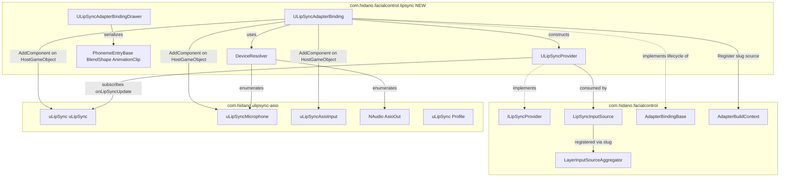
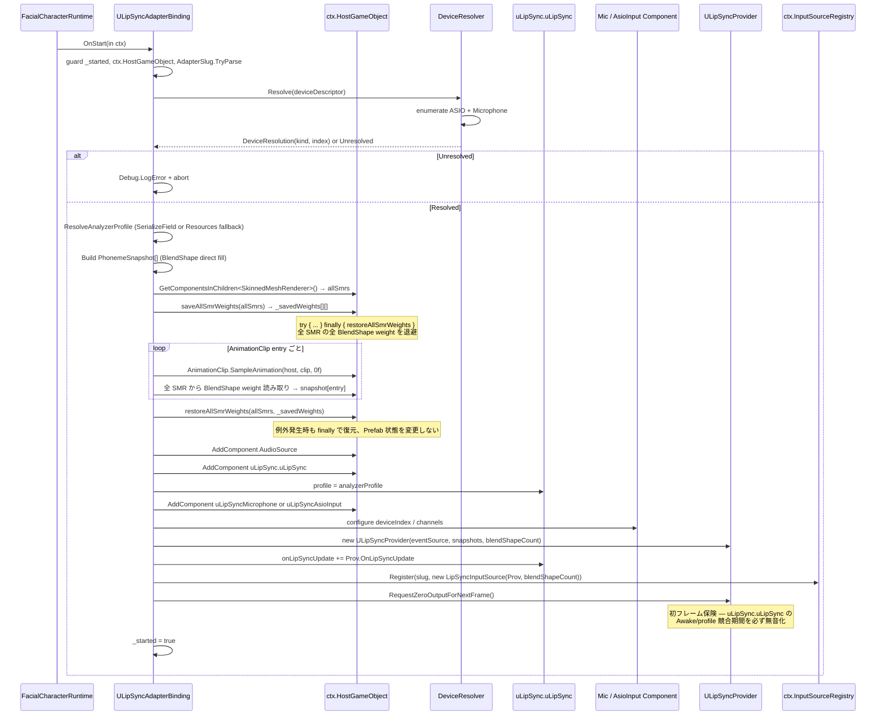
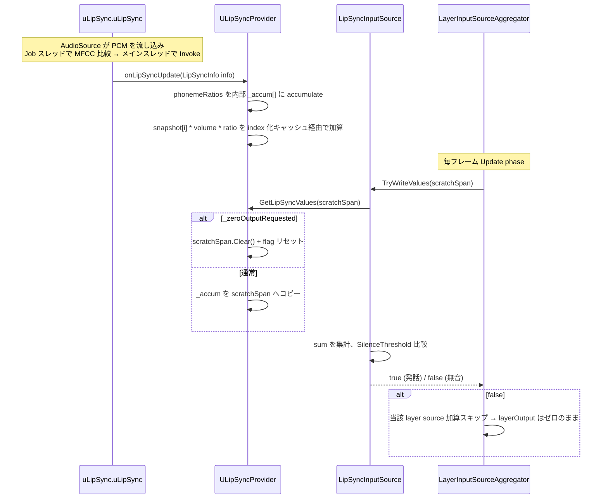
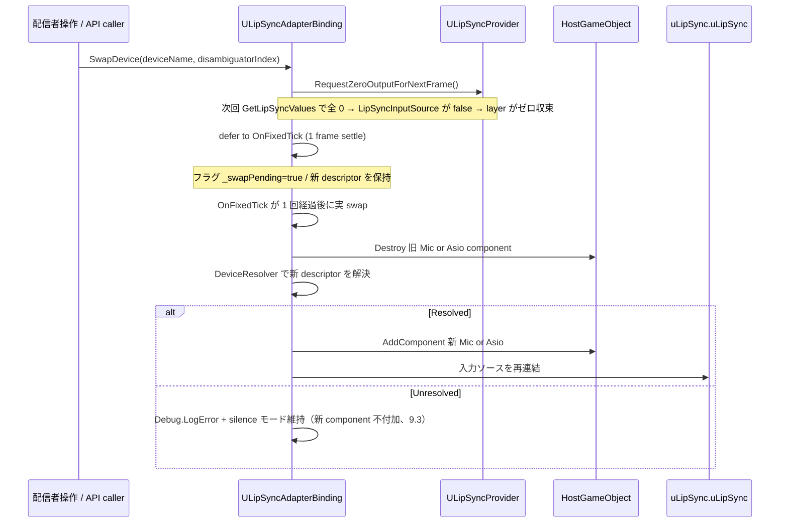

# Design Document — `com.hidano.facialcontrol.lipsync` (uLipSync 連携アダプタパッケージ)

言語: 日本語 / 日付: 2026-05-07 / 対象 spec: `.kiro/specs/ulipsync-adapter-package/`

## Overview

本パッケージ `com.hidano.facialcontrol.lipsync` は、`com.hidano.facialcontrol`（コア）と `com.hidano.ulipsync-asio`（ASIO Fork、3.1.5-custom 互換）を橋渡しする **新規 UPM 姉妹パッケージ** である。コア側は既に `ILipSyncProvider` / `LipSyncInputSource` / `lipsync` レイヤー / `LayerUseCase.additionalInputSources` / `LayerInputSourceAggregator` を完備しており、本パッケージはそれらを **追加的（additive）** に実装・利用する立場で uLipSync の解析結果（`LipSyncInfo.phonemeRatios` × `volume`）を BlendShape 値ベクトルに射影する。

**Users**: VTuber 配信者向けキャラクター制御を実装する Unity エンジニア（プレリリーススコープ: Windows PC）。

**Impact**: `OscReceiverAdapterBinding` と同じ「Inspector で `_adapterBindings` 配列に追加 1 つ」という体験で uLipSync 連携を導入できるようになる。コア (`com.hidano.facialcontrol`) のソースは **0 行も改変しない**。Character Prefab には `uLipSync.uLipSync` / `AudioSource` / 入力コンポーネントを **一切持たせない**（Prefab-Clean Contract）。

### Goals

- uLipSync 連携を独立 UPM パッケージとして配布し、リップシンクが不要なプロジェクトでは導入不要にする（1.1）。
- `OscReceiverAdapterBinding` のライフサイクルとレイアウト規約を踏襲した `ULipSyncAdapterBinding` を提供（6.x）。
- BlendShape 形式 / AnimationClip 形式の音素エントリを 1 バインディング内で混在編集可（4.1）。
- Mic / ASIO の自動判定とランタイム hot-swap（7.x, 8.x）。
- 毎フレームのヒープ確保 0 byte をホットパスで保証（11.x）。

### Non-Goals

- 音声解析の実装（uLipSync 側の責務）。
- コア型（`ILipSyncProvider` / `LipSyncInputSource` / `lipsync` レイヤー / `LayerUseCase` / `LayerInputSourceAggregator`）の再定義・改変。
- 新規 ScriptableObject アセット型の追加（`PhonemeBlendShapeMapSO` 等は作らない、3.1）。
- AnimationClip の時間軸再生（time-0 サンプリングのみ、4.6）。
- macOS / Linux / モバイル / WebGL / VR 対応（1.6）。
- デバイス断時の OS 既定デバイスへの自動フォールバック（9.2）。
- バインディング間でのデバイス共有・ミキサー抽象（10.4）。
- `ExpressionUseCase` の push/pop 経路を介した値注入（毎フレーム `Dictionary` 確保が発生するため、6.4）。

## Boundary Commitments

### This Spec Owns

- パッケージ `com.hidano.facialcontrol.lipsync` 自体（`package.json` / asmdef / README / CHANGELOG / LICENSE / `Documentation~/`）。
- `Hidano.FacialControl.LipSync.Adapters` 名前空間配下のすべてのランタイム型（`ULipSyncProvider` / `ULipSyncAdapterBinding` / `PhonemeEntryBase` 派生 2 種 / `DeviceDescriptor` / `IAsioDriverEnumerator` / `IMicrophoneDeviceEnumerator` 等）。
- `Hidano.FacialControl.LipSync.Editor` 名前空間配下の Editor 専用型（`ULipSyncAdapterBindingDrawer` 等）。
- `Runtime/Resources/FacialControl/LipSync/Default uLipSync Profile.asset` 1 個（パッケージ同梱の既定 Analyzer Profile、3.5）。
- `Samples~/MicLipSyncDemo/`（必須） + 任意 `Samples~/AnimationClipLipSyncDemo/` の Scene / FacialCharacterProfileSO 一式。
- EditMode / PlayMode / Tests/Shared テストスイート（14.1, 14.2）。

### Out of Boundary

- コア型の改変（`ILipSyncProvider` / `LipSyncInputSource` / `LayerUseCase` / `LayerInputSourceAggregator` / `AdapterBuildContext` / `AdapterBindingBase` / `AdapterSlug` / `IInputSourceRegistry` / `[FacialAdapterBinding]` 属性）。
- uLipSync 自体（`uLipSync.uLipSync` / `uLipSyncMicrophone` / `uLipSyncAsioInput` / `Profile`）の改変。
- ARKit / OSC / InputSystem 連携の修正（別パッケージ）。
- 音素キャリブレーション UI（uLipSync 側 Editor ウィンドウが提供）。
- AnimationClip の時間軸再生・キーフレーム補間（time-0 のみ）。
- 多モデル同時操作の音声入力共有（バインディング間でデバイスを共有しない）。

### Allowed Dependencies

- `com.hidano.facialcontrol`（コア）— Domain / Application / Adapters の 3 asmdef を Runtime asmdef から参照可。
- `com.hidano.ulipsync-asio`（3.1.5-custom 互換）— `uLipSync.Runtime` および `uLipSync.Runtime.Windows` asmdef を Runtime asmdef から参照可。`uLipSync.Runtime.Windows` 経由で NAudio (`NAudio.Core.dll` / `NAudio.Asio.dll`) precompiled references が間接的に解決される（DD-A 参照）。
- `Unity.Animation`（`AnimationClip` 型のために必要）。
- `UnityEngine.Microphone`（Engine 標準、`Microphone.devices` 列挙）。

### Revalidation Triggers

以下のいずれかが変更された場合、本パッケージの設計と実装を再検証する。

- `ILipSyncProvider` のシグネチャ変更（特に `GetLipSyncValues(Span<float>)` の契約と `BlendShapeNames` の意味）。
- `LipSyncInputSource.SilenceThreshold` の値変更、または `false` 時の output 非変更契約の変更。
- `LayerInputSourceAggregator` の per-layer `Array.Clear` 動作の変更（zero-frame settle の前提が崩れる）。
- `AdapterBuildContext` のフィールド追加・型変更。
- `AdapterBindingBase` の lifecycle hook 追加・順序変更。
- `[FacialAdapterBinding]` discovery 規約の変更（`AdapterBindingsListView` の type discovery 経路）。
- `com.hidano.ulipsync-asio` のメジャーアップデート（特に `uLipSync.uLipSync.profile` の Awake/OnEnable シーケンス、`onLipSyncUpdate` の event payload）。

## Architecture

### Existing Architecture Analysis

- コア (`com.hidano.facialcontrol`) はクリーンアーキテクチャ（Domain → Application → Adapters）を asmdef で強制している。本パッケージは新 asmdef `Hidano.FacialControl.LipSync` (Runtime) と `Hidano.FacialControl.LipSync.Editor` (Editor) を持ち、Adapters 層相当として Engine / Unity API / uLipSync API に依存する。
- Domain 層 (`Hidano.FacialControl.Domain`) は Engine 参照を持たない契約。本パッケージは Domain 名前空間に新規型を追加しない。
- 既存パターン:
  - **`AdapterBindingBase` lifecycle**: `OnStart(in AdapterBuildContext) → OnTick / OnLateTick / OnFixedTick → Dispose`。`OscReceiverAdapterBinding` (lines 111-183) を雛形とする。
  - **Prefab-Clean Contract**: `OscReceiverAdapterBinding` の `OscReceiverHost` AddComponent / Destroy パターン、`InputSystemAdapterBinding` の `ExpressionInputSourceAdapter` AddComponent パターンを踏襲。
  - **Inline serialization**: `[Serializable]` + `[FacialAdapterBinding(displayName: ...)]` 付き sealed class を `[SerializeReference] List<AdapterBindingBase>` （`FacialCharacterProfileSO._adapterBindings`）に格納。`AdapterBindingsListView` の Add ドロップダウンが `TypeCache.GetTypesWithAttribute<FacialAdapterBindingAttribute>()` で discover する。
  - **`LayerInputSourceAggregator` の per-layer `Array.Clear`**: 毎フレーム per-layer バッファをゼロクリアしてから加算するため、`LipSyncInputSource.TryWriteValues == false`（無音時）で当該レイヤーは自動的にゼロ収束する。

### Architecture Pattern & Boundary Map



**Architecture Integration**:

- **Selected pattern**: 既存 `OscReceiverAdapterBinding` / `InputSystemAdapterBinding` の **Adapter Binding パターン**を完全踏襲。新規パターンは導入しない。
- **Domain/feature boundaries**: 本パッケージは Adapters 層相当。Domain 層には触れない。`uLipSync` 名前空間と `Hidano.FacialControl.*` 名前空間の橋渡しのみ担う。
- **Existing patterns preserved**:
  - Prefab-Clean Contract（`AddComponent` on `ctx.HostGameObject` → `Dispose` で `Destroy`）。
  - `[FacialAdapterBinding]` 属性 + `AdapterBindingBase` 派生 sealed class + 引数なし ctor。
  - `IInputSourceRegistry.Register(slug, source)` 経由のレジストリ登録。
  - Inline `[SerializeReference]` polymorphic list（コア側の adapter bindings list と同じ仕組みを binding 内部の音素エントリで再現）。
  - UI Toolkit Editor（IMGUI 不可）。
- **New components rationale**:
  - `ULipSyncProvider`: コア `ILipSyncProvider` 契約の実装、uLipSync `LipSyncInfo` → 固定長 `Span<float>` への 0-alloc 射影。
  - `ULipSyncAdapterBinding`: lifecycle 集約、デバイス解決、hot-swap、provider/InputSource 構築・登録。
  - `PhonemeEntryBase` 派生: BlendShape 形式 / AnimationClip 形式の混在を許容する `[SerializeReference]` ベース型。
  - `DeviceResolver`: ASIO ドライバ列挙と `Microphone.devices` の組合せロジックを純粋関数として切出し、テスト容易性確保。
- **Steering compliance**:
  - **クリーンアーキテクチャ**: Adapters 層相当に位置づけ、Domain への依存方向を維持。
  - **シェーダー / 物理演算 / レンダーパイプライン非依存**: 本パッケージは BlendShape API のみに依存。
  - **エラーハンドリングは Unity 標準ログのみ**: `Debug.Log/Warning/Error`（14.9）。
  - **UI Toolkit Editor**: PropertyDrawer は `CreatePropertyGUI` ベース（12.2）。
  - **TDD 厳守**: `IAsioDriverEnumerator` / `IMicrophoneDeviceEnumerator` / `IULipSyncEventSource` 抽象化で Fake 注入可能（14.1, 14.2）。
  - **GC 0 byte ホットパス**: 構築時のみ確保、ホットパスで `new` 禁止（11.x）。

### Technology Stack

| Layer | Choice / Version | Role in Feature | Notes |
|-------|------------------|-----------------|-------|
| Runtime ランタイム | C# 9.0 / Unity 6000.3.2f1 / .NET Standard 2.1 | `ULipSyncProvider`, `ULipSyncAdapterBinding`, `DeviceResolver` の本体実装 | Engine 標準 `Microphone.devices`、`AnimationClip.SampleAnimation` を使用 |
| Audio Input オーディオ入力 | `com.hidano.ulipsync-asio` 3.1.5-custom 互換 | `uLipSync.uLipSync` / `uLipSyncMicrophone` / `uLipSyncAsioInput` を `AddComponent` で動的付加 | `uLipSync.Runtime` および `uLipSync.Runtime.Windows` asmdef を参照 |
| ASIO Driver Enumeration ASIO ドライバ列挙 | NAudio.Asio.dll (`uLipSync.Runtime.Windows` 経由) | `AsioOut.GetDriverNames()` を直接呼び ASIO ドライバ名一覧を取得 | uLipSync.Runtime.Windows asmdef が `precompiledReferences` で公開、本パッケージは間接参照（DD-A） |
| Editor UI Toolkit | Unity 6 同梱 UI Toolkit | `[CustomPropertyDrawer]` / `ListView` / `PropertyField` で多態リスト Drawer 実装 | IMGUI 不可（tech.md / Req 12.2） |
| Test Framework | `com.unity.test-framework` 1.6.0 | EditMode / PlayMode テスト + `GC.GetTotalAllocatedBytes` 差分計測 | 既存 `Tests/PlayMode/Performance/` パターンを踏襲（14.4） |

> 詳細な調査ログ（NAudio 参照経路の検証、`uLipSync.uLipSync.profile` 注入タイミング検証、AnimationClip サンプリングの代替手段比較）は `research.md` を参照。

## File Structure Plan

### Directory Structure

```
FacialControl/Packages/com.hidano.facialcontrol.lipsync/
├── package.json
├── README.md
├── CHANGELOG.md
├── LICENSE.md
├── Runtime/
│   ├── Hidano.FacialControl.LipSync.asmdef        # Runtime asmdef（Windows / Editor 限定 platform）
│   ├── Adapters/
│   │   ├── ULipSyncProvider.cs                    # ILipSyncProvider 実装
│   │   ├── ULipSyncAdapterBinding.cs              # AdapterBindingBase 派生 sealed class
│   │   ├── PhonemeEntries/
│   │   │   ├── PhonemeEntryBase.cs                # [SerializeReference] 基底
│   │   │   ├── BlendShapePhonemeEntry.cs          # 形式 (a)
│   │   │   ├── AnimationClipPhonemeEntry.cs       # 形式 (b)
│   │   │   └── PhonemeSnapshot.cs                 # 内部スナップショット値オブジェクト
│   │   ├── Devices/
│   │   │   ├── DeviceDescriptor.cs                # (deviceName, disambiguatorIndex) value
│   │   │   ├── IAsioDriverEnumerator.cs           # テスト境界
│   │   │   ├── IMicrophoneDeviceEnumerator.cs     # テスト境界
│   │   │   ├── DefaultAsioDriverEnumerator.cs     # AsioOut.GetDriverNames() ラッパ
│   │   │   ├── DefaultMicrophoneDeviceEnumerator.cs # Microphone.devices ラッパ
│   │   │   └── DeviceResolver.cs                  # 純粋関数: 記述子 → 種別 + 解決インデックス
│   │   └── ULipSyncEventBridge.cs                 # IULipSyncEventSource 抽象 + 既定実装（テスト用 Fake 差替点）
│   └── Resources/
│       └── FacialControl/
│           └── LipSync/
│               └── Default uLipSync Profile.asset # uLipSync Sample Profile を複製した既定（3.4, 3.5）
├── Editor/
│   ├── Hidano.FacialControl.LipSync.Editor.asmdef  # includePlatforms: ["Editor"]
│   └── Inspector/
│       ├── ULipSyncAdapterBindingDrawer.cs        # CustomPropertyDrawer (UI Toolkit)
│       ├── PhonemeEntryListView.cs                # 多態リスト ListView（型セレクタ + makeItem 切替）
│       └── DeviceDescriptorPopup.cs               # ASIO + Mic の名前候補 popup
├── Tests/
│   ├── EditMode/
│   │   ├── Hidano.FacialControl.LipSync.Tests.EditMode.asmdef
│   │   ├── Adapters/
│   │   │   ├── ULipSyncProviderTests.cs           # 14.1 (a)–(g)
│   │   │   ├── PhonemeSnapshotBuilderTests.cs     # 14.1 (h), (i), (j)
│   │   │   └── DeviceResolverTests.cs             # 14.1 (k)
│   │   └── Performance/
│   │       └── ULipSyncProviderAllocationTests.cs # 14.1 (g) GC 0 byte（GC.GetTotalAllocatedBytes 差分）
│   ├── PlayMode/
│   │   ├── Hidano.FacialControl.LipSync.Tests.PlayMode.asmdef
│   │   ├── Lifecycle/
│   │   │   └── ULipSyncAdapterBindingLifecycleTests.cs  # 14.2 (a), (c)
│   │   ├── HotSwap/
│   │   │   └── DeviceHotSwapTests.cs              # 14.2 (b)
│   │   └── MultiCharacter/
│   │       └── TenCharacterIsolationTests.cs      # 14.2 (d)
│   └── Shared/
│       ├── Hidano.FacialControl.LipSync.Tests.Shared.asmdef
│       ├── FakeULipSyncEventSource.cs             # IULipSyncEventSource 偽装、phonemeRatios を制御注入
│       ├── FakeAsioDriverEnumerator.cs            # 任意ドライバ名配列を返す
│       └── FakeMicrophoneDeviceEnumerator.cs      # 任意デバイス配列を返す
├── Samples~/
│   └── MicLipSyncDemo/
│       ├── Scenes/MicLipSyncDemo.unity            # Character GameObject に uLipSync 系コンポーネントなし（13.3）
│       ├── Profiles/MicLipSyncDemoProfile.asset   # FacialCharacterProfileSO（ULipSyncAdapterBinding inline）
│       └── README.md
└── Documentation~/
    ├── usage.md                                   # AnimationClip time-0 サンプリング注意点（4.6）+ ASIO 利用手順（13.5）
    └── migration-guide.md                         # uLipSyncBlendShape 手結線からの移行 4 ステップ（14.6）
```

加えて `FacialControl/Assets/Samples/com.hidano.facialcontrol.lipsync/MicLipSyncDemo/` を二重管理（ミラー）として配置（13.6 / structure.md）。

### Modified Files

- `FacialControl/Packages/manifest.json` — `com.hidano.facialcontrol.lipsync` のローカルパッケージ参照を追加（dev では `file:` プロトコル）。
- `FacialControl/Packages/packages-lock.json` — manifest 同期。
- **コア / OSC / InputSystem の既存ソースは一切変更しない**（boundary commitment）。

> File Structure Plan は Components & Interfaces のマップ。同じ責務を 2 ファイルに分割しない。`Adapters/PhonemeEntries/` `Adapters/Devices/` の小フォルダは依存方向と単一責任を可視化するための物理的分離。

## System Flows

### Flow 1: バインディング起動シーケンス（OnStart）



**Key decisions**:
- `uLipSync.uLipSync.profile` を AddComponent **後** に注入。Awake の `AllocateBuffers` は `profile=null` のまま `phonemeCount=1` で確保するが、`uLipSync.Update()` の自己整合性チェック（`profile.mfccs.Count * mfccNum != _phonemes.Length` で再 `AllocateBuffers`）が次フレームで補正する（DD-E）。この 1 フレーム期間に `onLipSyncUpdate` が garbage 値で発火した場合の保険として、`OnStart` 末尾で `Provider.RequestZeroOutputForNextFrame()` を **明示的に呼ぶ**ことで初回 `GetLipSyncValues` を強制 zero settle に固定する（DD-StartupSettle）。これにより半開きの口が一瞬出る flicker を `LipSyncInputSource.SilenceThreshold` 経路の挙動に依存させずに排除する（Req 9.3 整合）。
- AnimationClip サンプリング時の SMR weight 保存・復元シーケンス（DD-AnimSampling）:
  1. `ctx.HostGameObject.GetComponentsInChildren<SkinnedMeshRenderer>(includeInactive: true)` で **全 SMR を列挙**（複数メッシュ持ちキャラの衣装メッシュ等を含む）。
  2. 各 SMR について現在の全 BlendShape weight を `float[][] _savedWeights` に退避。
  3. `try { foreach (clip) { AnimationClip.SampleAnimation(host, clip, 0f); 各 SMR から BlendShape weight 読み取り → snapshot[entry] } } finally { 全 SMR の全 BlendShape weight を `_savedWeights` から復元 }` の順序で実行。
  4. 例外（不正 clip / curve binding 不整合等）で中断しても `finally` 経路で必ず復元し、Prefab の BlendShape 状態を変更しない（Prefab-Clean Contract 拡張）。
  5. 全 clip 処理後に **1 度だけ**復元するため、各 entry ごとに save/restore する必要はなく、最初の `SampleAnimation` 呼出による上書きを次の `SampleAnimation` で上書きする形で進める（性能最適化）。
- Provider の `onLipSyncUpdate` 購読は LipSyncInputSource 登録の **直前** に行うことで、Aggregator が登録済み source を初回参照する前にイベントを 1 度受け取る最低限のタイミングを担保。

### Flow 2: ホットパス（フレーム毎）



**Key decisions**:
- Accumulate は `OnLipSyncUpdate`（イベント駆動）側で完了させ、`GetLipSyncValues` は Span へのコピーのみ。これにより、`GetLipSyncValues` の呼出頻度（Aggregator が毎フレーム呼ぶ）と uLipSync イベント頻度が独立になり、両方とも 0-alloc を保証する。
- Phoneme key → snapshot index の lookup は OnStart で構築した `string[]` + 並列 `int[]` キャッシュに対し、`info.phonemeRatios.TryGetValue(key, out value)` で参照する（11.6, DD-PhonemeLookup）。

### Flow 3: ホットスワップ シーケンス



**Key decisions**:
- Hot-swap は **deferred**（OnFixedTick 1 サイクル待ち）。同期 swap は 1 フレームの古いデータが残るリスクがあり、deferred で `LipSyncInputSource.TryWriteValues == false` の挙動（output 非変更 + Aggregator 側 `Array.Clear` でゼロ化）を保証してから rebuild する（DD-C）。
- `uLipSync.uLipSync` 本体と `ULipSyncProvider` は破棄せず再利用。`IInputSourceRegistry` の登録も維持（8.3）。
- Multi-character: 各バインディングは独立インスタンスで静的状態を持たないため、相互影響なし（10.1, 8.4）。

## Requirements Traceability

| Requirement | Summary | Components | Interfaces / Files | Flows |
|-------------|---------|------------|--------------------|-------|
| 1.1 | `package.json` に id とコア/uLipSync 依存と Unity 6000.3.2f1 を宣言 | パッケージメタ | `package.json` | — |
| 1.2 | 標準 UPM レイアウト（Runtime/Editor/Tests/Samples~/Documentation~/README/CHANGELOG/LICENSE） | パッケージメタ | File Structure Plan 全体 | — |
| 1.3 | `Hidano.FacialControl.LipSync.*` 名前空間 | 全公開型 | `*.cs` の namespace 宣言 | — |
| 1.4 | Runtime asmdef に Editor 機能を含めない | asmdef 構成 | `Hidano.FacialControl.LipSync.asmdef` (Runtime), `.Editor.asmdef` 分離 | — |
| 1.5 | `com.hidano.ulipsync-asio` 未導入時のコンパイルエラー / 依存解決エラー | パッケージメタ | `package.json` の `dependencies` | — |
| 1.6 | Windows-only metadata（`keywords` + README） | パッケージメタ | `package.json` keywords / README | — |
| 2.1 | Prefab に uLipSync 系コンポーネントを事前付与不要 | `ULipSyncAdapterBinding` | `OnStart` AddComponent 経路 | Flow 1 |
| 2.2 | OnStart で `uLipSync.uLipSync` を AddComponent | `ULipSyncAdapterBinding` | `OnStart` | Flow 1 |
| 2.3 | OnStart で Mic or AsioInput を AddComponent | `ULipSyncAdapterBinding` + `DeviceResolver` | `OnStart` + `DeviceResolver.Resolve` | Flow 1 |
| 2.4 | Dispose で AddComponent 全件 Destroy | `ULipSyncAdapterBinding` | `Dispose` | — |
| 2.5 | MicLipSyncDemo Sample で Prefab-Clean を実証 | Samples | `Samples~/MicLipSyncDemo/Scenes/...` | — |
| 3.1 | 新規 SO アセット型を作らない | パッケージ全体 | （アセット型を新規定義しない） | — |
| 3.2 | per-character 設定は `[SerializeField]` で binding 自身に保持 | `ULipSyncAdapterBinding` | フィールド宣言 | — |
| 3.3 | `[SerializeField]` polymorphic phoneme entry list | `ULipSyncAdapterBinding` + `PhonemeEntryBase` | `[SerializeReference] List<PhonemeEntryBase> _phonemeEntries` | — |
| 3.4 | optional `[SerializeField] uLipSync.Profile`、未指定時 `Resources.Load` フォールバック | `ULipSyncAdapterBinding` | `_analyzerProfile`、`ResolveAnalyzerProfile` | Flow 1 |
| 3.5 | 既定 Profile は同梱 1 個共有 | パッケージ同梱 | `Runtime/Resources/FacialControl/LipSync/Default uLipSync Profile.asset` | — |
| 4.1 | BlendShape 形式 / AnimationClip 形式の混在 | `PhonemeEntryBase` 派生 2 種 | `BlendShapePhonemeEntry` / `AnimationClipPhonemeEntry` | — |
| 4.2 | OnStart で `float[blendShapeCount]` スナップショット作成 | `ULipSyncAdapterBinding` (private builder) | `BuildSnapshots` | Flow 1 |
| 4.3 | BlendShape 形式は単一 index に `maxWeight` を fill | builder | `BuildSnapshots` 内 BlendShape 分岐 | — |
| 4.4 | AnimationClip 形式は time-0 で BlendShape weight を抽出 | builder | `BuildSnapshots` 内 AnimationClip 分岐（`AnimationClip.SampleAnimation(host, 0f)`） | Flow 1 |
| 4.5 | ホットパスは形式に関わらず同一加算 | `ULipSyncProvider` | `OnLipSyncUpdate` accumulate ループ | Flow 2 |
| 4.6 | `Documentation~/usage.md` に time-0 制約明記 | docs | `Documentation~/usage.md` | — |
| 4.7 | 未解決 BlendShape 名は LogWarning + skip | builder | `BuildSnapshots` 内 lookup 分岐 | — |
| 5.1 | `ILipSyncProvider` 実装 | `ULipSyncProvider` | `class ULipSyncProvider : ILipSyncProvider` | Flow 2 |
| 5.2 | onLipSyncUpdate を購読し内部バッファに反映 | `ULipSyncProvider` | `OnLipSyncUpdate(LipSyncInfo info)` | Flow 2 |
| 5.3 | `GetLipSyncValues` でスナップショット重み付け合算 | `ULipSyncProvider` | `GetLipSyncValues(Span<float>)` | Flow 2 |
| 5.4 | `BlendShapeNames` が固定順 | `ULipSyncProvider` | `ReadOnlySpan<string> BlendShapeNames` | — |
| 5.5 | 無音時 sum < SilenceThreshold で `false` 返却に整合 | `ULipSyncProvider` + 既存 `LipSyncInputSource` | LipSyncInputSource (existing, line 74) | Flow 2 |
| 5.6 | 未マップ phoneme key を無視（ログ無し） | `ULipSyncProvider` | `OnLipSyncUpdate` 内 `TryGetValue` のヒット時のみ加算 | — |
| 5.7 | 設定済み entry の現フレーム不在は寄与 0 | `ULipSyncProvider` | accumulate 仕様（不在キー＝寄与 0） | — |
| 5.8 | コンストラクタが `(IULipSyncEventSource, IReadOnlyList<PhonemeSnapshot>)` を受け、null 時 ANE | `ULipSyncProvider` | ctor 仕様 | — |
| 5.9 | `Dispose` で onLipSyncUpdate 購読解除 | `ULipSyncProvider` | `Dispose` | — |
| 6.1 | `[FacialAdapterBinding(displayName: "uLipSync")]` 付き sealed class、引数なし ctor | `ULipSyncAdapterBinding` | `[Serializable] [FacialAdapterBinding(...)] sealed class ...` | — |
| 6.2 | OnStart 順序（AddComponent x N → Profile inject → snapshot → provider/InputSource → register） | `ULipSyncAdapterBinding` | `OnStart` | Flow 1 |
| 6.3 | `LayerUseCase.additionalInputSources` 経路で合算合成へ供給 | `ULipSyncAdapterBinding` + 既存 `LayerUseCase` | `IInputSourceRegistry.Register(slug, source)` | — |
| 6.4 | `ExpressionUseCase` push/pop 経路を使用しない | （非採用） | — | — |
| 6.5 | Dispose で 購読解除・登録解除・コンポーネント Destroy 全部 | `ULipSyncAdapterBinding` | `Dispose` | — |
| 6.6 | Profile 解決失敗時の roll back & 早期 return | `ULipSyncAdapterBinding` | `OnStart` 失敗パス | Flow 1 |
| 6.7 | OscReceiverAdapterBinding と同一 lifecycle 順序 | `ULipSyncAdapterBinding` | OnStart→OnFixedTick→Dispose | — |
| 7.1 | `[SerializeField] DeviceDescriptor _deviceDescriptor` | `ULipSyncAdapterBinding` | フィールド | — |
| 7.2 | ASIO ドライバ列挙で一致時 AsioInput | `DeviceResolver` | `Resolve` | Flow 1 |
| 7.3 | Mic 列挙で一致時 Microphone | `DeviceResolver` | `Resolve` | Flow 1 |
| 7.4 | `disambiguatorIndex` で N 番目選択 | `DeviceResolver` | `Resolve` ループ実装 | — |
| 7.5 | ASIO/Mic toggle UI を持たない（自動判定のみ） | `ULipSyncAdapterBindingDrawer` | Drawer 仕様 | — |
| 8.1 | `SwapDevice(deviceName, disambiguatorIndex)` public API | `ULipSyncAdapterBinding` | public method | Flow 3 |
| 8.2 | swap 時のシーケンス（zero settle → Destroy 旧 → AddComponent 新 → Provider/Registry 維持） | `ULipSyncAdapterBinding` + `ULipSyncProvider.RequestZeroOutputForNextFrame` | — | Flow 3 |
| 8.3 | ULipSyncProvider 購読・LipSyncInputSource 登録は維持 | `ULipSyncAdapterBinding` | swap 内部 | Flow 3 |
| 8.4 | 10 体マルチキャラクタ間で hot-swap が独立 | （静的状態を持たない設計） | インスタンス分離 | — |
| 8.5 | swap 失敗時 LogError + silence モード維持（壊れ component を残さない） | `ULipSyncAdapterBinding` | swap 失敗パス | Flow 3 |
| 9.1 | 起動時解決失敗で LogError + 利用可能リスト出力 | `ULipSyncAdapterBinding` | `OnStart` 失敗パス | Flow 1 |
| 9.2 | OS 既定デバイスへの自動フォールバック禁止 | （仕様） | OnStart 早期 return | — |
| 9.3 | 中断時 zero settle + silence モード | `ULipSyncAdapterBinding` + provider | `SwapDevice(unresolvable)` 経路 | Flow 3 |
| 9.4 | silence モードで自動再解決しない | （仕様） | — | — |
| 9.5 | silence モードからの復旧は SwapDevice or 再構築のみ | （仕様） | — | — |
| 10.1 | 10 体以上独立 binding でフレーム落ちなく動作 | `ULipSyncAdapterBinding` | インスタンス分離 + 静的状態無し | — |
| 10.2 | AdapterSlug キー名前空間化 | `ULipSyncAdapterBinding` | `Slug` 自動生成 + 一意性 | — |
| 10.3 | 同一 character に 2 個目以降の binding は LogError | `ULipSyncAdapterBinding` | `OnStart` 内 Registry 衝突検知 | — |
| 10.4 | per-character device 選択を許す（共有抽象なし） | `ULipSyncAdapterBinding` | DeviceDescriptor を per-binding 保持 | — |
| 11.1 | provider のホットパスで GC 0 byte | `ULipSyncProvider` | `OnLipSyncUpdate` + `GetLipSyncValues` | Flow 2 |
| 11.2 | binding lifecycle hooks で GC 0 byte | `ULipSyncAdapterBinding` | `OnFixedTick` etc. | — |
| 11.3 | `LipSyncInputSource → ULipSyncProvider → snapshot` 連鎖で GC 0 byte | 既存 + 本パッケージ | — | Flow 2 |
| 11.4 | EditMode benchmark で 0 byte 検証 | テスト | `ULipSyncProviderAllocationTests` | — |
| 11.5 | OnStart の構築コストは GC 許容 | `ULipSyncAdapterBinding` | OnStart スコープ | — |
| 11.6 | LINQ / `string.Format` / `new T[]` 等をホットパスで禁止、README に方針明記 | コード規約 + docs | README | — |
| 12.1 | Editor 専用 asmdef 配下に PropertyDrawer | `Hidano.FacialControl.LipSync.Editor.asmdef` | `[CustomPropertyDrawer(typeof(ULipSyncAdapterBinding))]` | — |
| 12.2 | UI Toolkit | `ULipSyncAdapterBindingDrawer` | `CreatePropertyGUI` | — |
| 12.3 | 多態 phoneme entry list + 型セレクタ + 追加/削除/並べ替え | `PhonemeEntryListView` | `ListView` + `AdvancedDropdown` | — |
| 12.4 | デバイス記述子 popup + 手動 override + disambiguator | `DeviceDescriptorPopup` | UI Toolkit | — |
| 12.5 | optional `uLipSync.Profile` を ObjectField、未指定時プレースホルダ | `ULipSyncAdapterBindingDrawer` | UI Toolkit | — |
| 12.6 | BlendShape 名空欄時 HelpBox | `PhonemeEntryListView` | per-row Validation | — |
| 12.7 | OscReceiverAdapterBindingDrawer と style 整合 | `ULipSyncAdapterBindingDrawer` | UI Toolkit `PropertyField` | — |
| 13.1 | `Samples~/MicLipSyncDemo/` を `samples` 配列に登録 | `package.json` | `samples[0]` | — |
| 13.2 | Sample 同梱物（profile / 音素エントリ / Scene） | `Samples~/MicLipSyncDemo/` | フォルダ構成 | — |
| 13.3 | Scene の Character GameObject に uLipSync 系コンポーネント無し | Sample Scene | `MicLipSyncDemo.unity` | — |
| 13.4 | optional `Samples~/AnimationClipLipSyncDemo/` | Sample（任意） | フォルダ構成 | — |
| 13.5 | ASIO Sample Scene を同梱せず手順のみ docs 化 | docs | `Documentation~/usage.md` ASIO 章 | — |
| 13.6 | `Samples~/` ↔ `Assets/Samples/` 二重管理を docs 明記 | docs | README または `Documentation~/usage.md` | — |
| 14.1 | EditMode テストスイート (a)–(k) | テスト | `Tests/EditMode/**` | — |
| 14.2 | PlayMode テストスイート (a)–(d) | テスト | `Tests/PlayMode/**` | — |
| 14.3 | OscReceiverAdapterBindingTests と 1:1 対応 | テスト | Lifecycle / Registry / 例外時安全停止 | — |
| 14.4 | CI で EditMode + PlayMode 失敗ゼロ | CI | (既存 GitHub Actions に追加) | — |
| 14.5 | `{Method}_{Condition}_{Expected}` 命名 | テスト | 全 `*Tests.cs` | — |
| 14.6 | README / CHANGELOG / Documentation~ 同梱 | docs | パッケージルート + `Documentation~/` | — |
| 14.7 | 日本語コメント・ドキュメント | 全コード + docs | XML doc / 通常コメント | — |
| 14.8 | コーディング規約（`Hidano.FacialControl.LipSync` 名前空間ルート、4-space、`_camelCase` 等） | 全コード | namespace + style | — |
| 14.9 | エラーは Unity 標準ログのみ、独自例外型なし | 全コード | `Debug.Log/Warning/Error` + `ArgumentNullException` 等標準例外 | — |

## Components and Interfaces

### Component Summary

| Component | Domain/Layer | Intent | Req Coverage | Key Dependencies (P0/P1) | Contracts |
|-----------|--------------|--------|--------------|--------------------------|-----------|
| `ULipSyncProvider` | Adapters | uLipSync `LipSyncInfo` を `ILipSyncProvider` 契約に橋渡し、ホットパス GC 0 byte | 5.1–5.9, 11.1, 11.3 | `IULipSyncEventSource` (P0), `PhonemeSnapshot[]` (P0) | Service, State |
| `ULipSyncAdapterBinding` | Adapters | binding lifecycle 集約、Prefab-Clean Contract、デバイス解決、hot-swap | 2.1–2.5, 6.1–6.7, 8.1–8.5, 9.1–9.5, 10.1–10.4 | `AdapterBuildContext` (P0), `ULipSyncProvider` (P0), `DeviceResolver` (P0), `uLipSync.uLipSync` (P0) | Service, State |
| `PhonemeEntryBase` 派生 2 種 | Adapters (Models) | BlendShape 形式 / AnimationClip 形式の `[SerializeReference]` ベース inline 設定 | 4.1, 4.3, 4.4, 12.3 | `AnimationClip` (P1, AnimationClip 形式のみ) | State |
| `DeviceResolver` | Adapters | (deviceName, disambiguatorIndex) → 種別 + 解決インデックス の純粋関数 | 7.1–7.4, 8.5, 9.1, 9.2 | `IAsioDriverEnumerator` (P0), `IMicrophoneDeviceEnumerator` (P0) | Service |
| `IAsioDriverEnumerator` / `DefaultAsioDriverEnumerator` | Adapters (境界) | NAudio `AsioOut.GetDriverNames()` を呼ぶラッパ + テスト境界 | 7.2, 14.1(k) | NAudio (P0, 間接参照) | Service |
| `IMicrophoneDeviceEnumerator` / `DefaultMicrophoneDeviceEnumerator` | Adapters (境界) | `UnityEngine.Microphone.devices` ラッパ + テスト境界 | 7.3, 14.1(k) | `UnityEngine.Microphone` (P0) | Service |
| `IULipSyncEventSource` / `ULipSyncEventBridge` | Adapters (境界) | `uLipSync.uLipSync.onLipSyncUpdate` 抽象、Fake 注入可（TDD） | 5.2, 14.1(a)–(g) | `uLipSync.uLipSync` (P0) | Event |
| `ULipSyncAdapterBindingDrawer` + `PhonemeEntryListView` + `DeviceDescriptorPopup` | Editor | UI Toolkit PropertyDrawer | 12.1–12.7 | `SerializedProperty`, UI Toolkit (P0) | UI |

### Adapters / Hot Path

#### `ULipSyncProvider`

| Field | Detail |
|-------|--------|
| Intent | uLipSync 解析結果を `ILipSyncProvider` の固定長 `Span<float>` 出力に射影し、ホットパスで 0 byte 確保を維持 |
| Requirements | 5.1, 5.2, 5.3, 5.4, 5.5, 5.6, 5.7, 5.8, 5.9, 11.1, 11.3 |
| Owner / Reviewers | Hidano (impl) / Junki Hiroi (review) |

**Responsibilities & Constraints**
- `ILipSyncProvider` の全メソッドを実装する。
- 構築時に渡された `IReadOnlyList<PhonemeSnapshot>` と `IULipSyncEventSource` を参照保持し、構築後に再代入しない。
- ホットパス（`OnLipSyncUpdate` / `GetLipSyncValues`）で `new` を行わない。すべての作業バッファ（`_accum: float[]`、`_phonemeKeys: string[]`、`_phonemeIndices: int[]`）は構築時にのみ確保する。
- `RequestZeroOutputForNextFrame()` 後の最初の `GetLipSyncValues` は `output.Clear()` のみを実行し、フラグをリセットする（Flow 3、DD-Settle 参照）。
- スレッド安全性: `OnLipSyncUpdate` は uLipSync が main thread に dispatch する前提（uLipSync.cs:269 `Invoke`）。`GetLipSyncValues` は Aggregator から main thread で呼ばれる。両者は main thread のみで動作するため lock 不要。

**Dependencies**
- Inbound: `LipSyncInputSource` — `GetLipSyncValues` を呼出（P0）
- Outbound: `IULipSyncEventSource` — `onLipSyncUpdate` 購読（P0）
- External: `uLipSync.LipSyncInfo` — value 型として参照（P0）

**Contracts**: Service [x] / API [ ] / Event [ ] / Batch [ ] / State [x]

##### Service Interface

```csharp
public sealed class ULipSyncProvider : ILipSyncProvider, IDisposable
{
    public ULipSyncProvider(
        IULipSyncEventSource eventSource,
        IReadOnlyList<PhonemeSnapshot> snapshots,
        int blendShapeCount);

    public ReadOnlySpan<string> BlendShapeNames { get; }

    public void GetLipSyncValues(Span<float> output);

    public void RequestZeroOutputForNextFrame();

    public void Dispose();

    // 内部 (private): イベントハンドラ
    // void OnLipSyncUpdate(uLipSync.LipSyncInfo info);
}
```

- **Preconditions**:
  - `eventSource != null`、`snapshots != null`、`blendShapeCount >= 0`。null/負値時 `ArgumentNullException` / `ArgumentOutOfRangeException`。
  - 各 `PhonemeSnapshot.Weights` の長さは `blendShapeCount` と一致しなければならない（不一致時 `ArgumentException`）。
- **Postconditions**:
  - 構築直後 `eventSource.OnLipSyncUpdate += this.OnLipSyncUpdate` で購読されている。
  - `Dispose` 後、購読解除済みでイベントを内部に反映しない（5.9）。
- **Invariants**:
  - `_accum` の長さは構築後不変。
  - `_phonemeKeys` / `_phonemeIndices` は同じ長さで対応関係を保つ（key[i] が `snapshots[indices[i]]` を指す）。

##### State Management

- 状態モデル:
  - `_accum: float[blendShapeCount]` — 現フレームの合算結果（イベント駆動で更新）。
  - `_zeroOutputRequested: bool` — 1 フレーム強制 0 出力フラグ。
  - `_isDisposed: bool`。
- 永続性: なし（プレイ中のみ存在）。
- 並行性: main thread のみでアクセス（lock 不要）。

**Implementation Notes**
- **Integration**: `ULipSyncAdapterBinding` が ctor 引数を組み立て、`new LipSyncInputSource(provider, blendShapeCount)` をコアに登録する。
- **Validation**: ctor で null/負値検査。`OnLipSyncUpdate` 内で `info.phonemeRatios` が null の場合は何もしない（uLipSync 側の異常時の保険）。
- **Risks**: `info.phonemeRatios` (`Dictionary<string,float>`) の foreach 列挙は構造体 enumerator のため alloc-free だが、uLipSync 側の実装変更で `IReadOnlyDictionary` 型公開に変わると enumerator が boxing される懸念がある。`TryGetValue` ベースのループに統一して回避（DD-PhonemeLookup）。

#### `ULipSyncAdapterBinding`

| Field | Detail |
|-------|--------|
| Intent | binding lifecycle 集約、Prefab-Clean Contract、デバイス解決、hot-swap、provider/InputSource 構築・登録 |
| Requirements | 2.1, 2.2, 2.3, 2.4, 6.1, 6.2, 6.3, 6.4, 6.5, 6.6, 6.7, 7.1, 7.5, 8.1, 8.2, 8.3, 8.5, 9.1, 9.2, 9.3, 9.4, 9.5, 10.1, 10.2, 10.3, 10.4 |
| Owner / Reviewers | Hidano / Junki Hiroi |

**Responsibilities & Constraints**
- `[Serializable] [FacialAdapterBinding(displayName: "uLipSync")]` 付き sealed class。引数なし ctor を持ち、`AdapterBindingsListView` の Add ドロップダウンで discovery される（6.1）。
- `OnStart` は **冪等**（`_started` ガード）。
- AddComponent 順序は決定論的（DD-AddOrder）。
- `Dispose` は `OnStart` で確保したすべてのコンポーネントを `UnityEngine.Object.Destroy` で取り外し、provider 購読を解除し、InputSourceRegistry から登録解除する（6.5）。
- Hot-swap は **deferred**（`OnFixedTick` で 1 サイクル待ち）（DD-C）。
- すべての `AddComponent` 後の参照は `[NonSerialized]` フィールドに保持し、Inspector / serialize round-trip で消える。

**Dependencies**
- Inbound: `FacialCharacterRuntime`（コア） — lifecycle hook を呼ぶ（P0）
- Outbound: `ULipSyncProvider`（P0）, `DeviceResolver`（P0）, `ctx.InputSourceRegistry`（P0）, `ctx.HostGameObject`（P0）
- External: `uLipSync.uLipSync`（P0）, `uLipSyncMicrophone` / `uLipSyncAsioInput`（P0）, `UnityEngine.AudioSource`（P0）, `uLipSync.Profile`（P1）

**Contracts**: Service [x] / API [ ] / Event [ ] / Batch [ ] / State [x]

##### Service Interface

```csharp
[Serializable]
[FacialAdapterBinding(displayName: "uLipSync")]
public sealed class ULipSyncAdapterBinding : AdapterBindingBase
{
    [SerializeField] private DeviceDescriptor _deviceDescriptor;
    [SerializeField] private uLipSync.Profile _analyzerProfile; // optional, null 可
    [SerializeReference] private List<PhonemeEntryBase> _phonemeEntries;
    [SerializeField] private string _targetMeshHint;            // optional, 空時 "first SMR depth-first"
    [SerializeField] private float _maxWeightScale = 1f;        // global multiplier; per-entry maxWeight に乗算

    public ULipSyncAdapterBinding();

    public override void OnStart(in AdapterBuildContext ctx);
    public override void OnFixedTick(float fixedDeltaTime);
    public override void Dispose();

    // hot-swap public API
    public void SwapDevice(string deviceName, int disambiguatorIndex);

    // 診断 / テスト用
    public bool IsStarted { get; }
    public uLipSync.uLipSync Analyzer { get; }
    public ULipSyncProvider Provider { get; }
}
```

- **Preconditions**:
  - `OnStart`: `ctx.HostGameObject != null`、`_phonemeEntries != null && _phonemeEntries.Count > 0`、`AdapterSlug.TryParse(Slug, out _) == true`。違反時 `Debug.LogError` / `LogWarning` + 早期 return（OscReceiverAdapterBinding 同等）。
  - `SwapDevice`: `IsStarted == true`。
- **Postconditions**:
  - `OnStart` 成功後 `IsStarted == true` で `Analyzer != null && Provider != null`。
  - `Dispose` 後 `IsStarted == false`、`Analyzer == null`、`Provider == null`、Host から uLipSync 系コンポーネントが全件除去済み。
- **Invariants**:
  - `_started == true` の間、`Analyzer.profile` は非 null。
  - 同一 binding が同一 ctx に対して 2 度 `OnStart` を呼ばれても副作用は 1 回分のみ（冪等）。

##### State Management

- 状態モデル: `Idle → Started → SilenceMode → Started`（hot-swap で行き来）→ `Disposed`。
  - `SilenceMode`: provider が `_zeroOutputRequested == true` を維持し、入力デバイスコンポーネントが未付加。
- 永続性: 設定（`[SerializeField]`）のみ ScriptableObject に inline serialize。runtime 状態は `[NonSerialized]`。
- 並行性: main thread のみ（uLipSync 側の Job スレッドは uLipSync 内部で main thread に dispatch される）。

**Implementation Notes**
- **Integration**: `FacialCharacterProfileSO._adapterBindings` に inline serialize。`AdapterBindingsListView` の Add ドロップダウンから `Activator.CreateInstance` で生成される。
- **Validation**:
  - OnStart: HostGameObject null チェック / phonemeEntries 空チェック / Slug parse / DeviceResolver 解決。
  - Snapshot ビルド時: BlendShape 名が SMR に存在しない場合は LogWarning + skip（4.7）。
  - 重複 binding 検知: `ctx.InputSourceRegistry.Register` が衝突を返した場合 LogError + 後続初期化を skip（10.3）。
- **Risks**:
  - SMR が複数存在するキャラクター（衣装メッシュ等）での対象 SMR 解決曖昧性 → `_targetMeshHint`（パス文字列）で override 可能（DD-B）。
  - `uLipSync.uLipSync.Awake` が `profile == null` で動作する隙 → `Update` の自己整合性チェックで救済（DD-E）。
  - hot-swap の defer によりユーザー視点の感覚的遅延が 1 frame（〜16 ms）あるが、配信用途で許容（DD-C）。

### Adapters / Models

#### `PhonemeEntryBase` 派生（`BlendShapePhonemeEntry` / `AnimationClipPhonemeEntry`）

| Field | Detail |
|-------|--------|
| Intent | `[SerializeReference]` ベースの polymorphic 設定エントリ。BlendShape 形式と AnimationClip 形式を 1 binding 内で混在編集可能 |
| Requirements | 4.1, 4.3, 4.4, 12.3 |

**Responsibilities & Constraints**
- 純粋データ（POCO）。`OnStart` 時のスナップショットビルダーが訪問する。
- `[Serializable]` 必須（`[SerializeReference]` round-trip）。
- 派生型を将来追加可能（OSC 形式 / Bone 形式等）にしても後方互換するよう `PhonemeEntryBase` は abstract で具体的な振る舞いを持たない。

##### Service Interface

```csharp
[Serializable]
public abstract class PhonemeEntryBase
{
    public string PhonemeId;       // 公開 field（Unity serialize 規約踏襲、AdapterBindingBase.Slug と同様）
    public float MaxWeight;        // [0..100] BlendShape 値 100 を 1.0 として正規化
}

[Serializable]
public sealed class BlendShapePhonemeEntry : PhonemeEntryBase
{
    public string BlendShapeName;
}

[Serializable]
public sealed class AnimationClipPhonemeEntry : PhonemeEntryBase
{
    public AnimationClip Clip;
}
```

- **Preconditions / Postconditions**: なし（POCO）。
- **Invariants**: `PhonemeId` は空文字を許容（Drawer で警告するが runtime では無視されるだけ）。
- **Validation**: ビルダーが構築時に空文字 / null 参照を skip + LogWarning。

#### `PhonemeSnapshot`（内部 value）

```csharp
public readonly struct PhonemeSnapshot
{
    public readonly string PhonemeId;
    public readonly float[] Weights;        // 長さ blendShapeCount。構築時に確保し以後 immutable

    public PhonemeSnapshot(string phonemeId, float[] weights);
}
```

`ULipSyncAdapterBinding.BuildSnapshots` が `_phonemeEntries` を走査して `PhonemeSnapshot[]` を生成し `ULipSyncProvider` に渡す。`Weights` は構築時のみ書込み、以後 immutable。

#### `DeviceDescriptor`

```csharp
[Serializable]
public struct DeviceDescriptor
{
    public string DeviceName;
    public int DisambiguatorIndex;
}
```

- **Invariants**: `DeviceName` は表示名そのまま（前後空白・大小文字も保持）。`DisambiguatorIndex >= 0`。
- 比較は `string.Equals(StringComparison.Ordinal)` を使用（曖昧性回避）。

### Adapters / Device Resolution

#### `DeviceResolver`

| Field | Detail |
|-------|--------|
| Intent | `(deviceName, disambiguatorIndex)` を ASIO + Mic 両方の列挙器に対し決定論的に解決し、種別 + 解決済みインデックスを返す純粋関数 |
| Requirements | 7.1, 7.2, 7.3, 7.4, 8.5, 9.1, 9.2 |

##### Service Interface

```csharp
public enum DeviceKind { Asio, Microphone, Unresolved }

public readonly struct DeviceResolution
{
    public readonly DeviceKind Kind;
    public readonly int ResolvedIndex;       // ASIO ドライバ配列 / Microphone.devices 配列の index
    public readonly string DeviceNameMatched;
    public readonly string[] AvailableAsio;  // ログ用、Unresolved 時に取得元のスナップショット
    public readonly string[] AvailableMic;
}

public static class DeviceResolver
{
    public static DeviceResolution Resolve(
        DeviceDescriptor descriptor,
        IAsioDriverEnumerator asioEnumerator,
        IMicrophoneDeviceEnumerator micEnumerator);
}
```

- **Preconditions**: 列挙器引数は非 null（null 時 ANE）。`descriptor.DeviceName != null`。
- **Postconditions**:
  - 一致時 `Kind ∈ {Asio, Microphone}`、`ResolvedIndex` は対応列挙の N 番目（同名重複時は `DisambiguatorIndex` を消費）。
  - 不一致時 `Kind = Unresolved`、`AvailableAsio` / `AvailableMic` は列挙結果のスナップショット（ログ用）。
- **Invariants**: ASIO を Mic より先に検査する（uLipSync の ASIO Fork ドライバ名と Mic 名の重複は実質発生しないが、ASIO 優先は仕様、7.2）。

**Implementation Notes**
- **Integration**: `ULipSyncAdapterBinding.OnStart` と `SwapDevice` で同一の resolver を呼ぶ（同じ解決ルール）。
- **Validation**: `DisambiguatorIndex` が一致候補数を超える場合は `Unresolved`（解決失敗のログに `DisambiguatorIndex` 値も含める）。
- **Risks**: 列挙タイミングと実 AddComponent タイミングの間で USB デバイスが切断されるレースは無視（OnStart 内の数 ms スパン）。発生時は uLipSync 側で `Microphone.Start` が失敗 → uLipSync が内部で LogError → ユーザーは hot-swap で復旧。

#### `IAsioDriverEnumerator` / `DefaultAsioDriverEnumerator`

```csharp
public interface IAsioDriverEnumerator
{
    string[] GetDriverNames();   // 失敗時は空配列。例外は内部で LogError + 空配列化（uLipSync 側 GetAsioDriverNames と同じ規約）
}

public sealed class DefaultAsioDriverEnumerator : IAsioDriverEnumerator
{
    public string[] GetDriverNames();   // NAudio.Wave.Asio.AsioOut.GetDriverNames() を直接呼ぶ
}
```

- **Implementation**: `Default` 実装は `NAudio.Wave.Asio.AsioOut.GetDriverNames()` を直接呼ぶ（DD-A）。`uLipSync.Runtime.Windows` asmdef 経由で NAudio.Asio.dll が precompiled reference として解決される。
- **Platform Guard**: 実装ファイルは `#if UNITY_STANDALONE_WIN || UNITY_EDITOR_WIN` でガード、それ以外は空配列を返す stub にする。

#### `IMicrophoneDeviceEnumerator` / `DefaultMicrophoneDeviceEnumerator`

```csharp
public interface IMicrophoneDeviceEnumerator
{
    string[] GetDeviceNames();   // UnityEngine.Microphone.devices のスナップショット
}
```

- **Implementation**: `UnityEngine.Microphone.devices` をそのまま返す（呼出毎に Unity が新配列を返すが、OnStart / SwapDevice の構築時のみなので GC 許容、11.5）。

### Adapters / Event Bridge

#### `IULipSyncEventSource` / `ULipSyncEventBridge`

| Field | Detail |
|-------|--------|
| Intent | `uLipSync.uLipSync.onLipSyncUpdate` を C# event に剥がし、テスト時に `FakeULipSyncEventSource` を注入可能にする |
| Requirements | 5.2, 14.1(a)–(g) |

##### Service Interface

```csharp
public interface IULipSyncEventSource
{
    event Action<uLipSync.LipSyncInfo> OnLipSyncUpdate;   // C# event。Add / Remove で UnityEvent と同期
}

internal sealed class ULipSyncEventBridge : IULipSyncEventSource, IDisposable
{
    public ULipSyncEventBridge(uLipSync.uLipSync source);
    // ...
}
```

- **Implementation**: ctor で `source.onLipSyncUpdate.AddListener(_unityEventHandler)`、Dispose で `RemoveListener`。`_unityEventHandler` は内部 `Action<LipSyncInfo>` event の中継。
- **Rationale**: テスト時 `FakeULipSyncEventSource` で任意 `LipSyncInfo` を Invoke できる。Production では `ULipSyncEventBridge` 経由で UnityEvent と接続される。

### Editor

#### `ULipSyncAdapterBindingDrawer`

| Field | Detail |
|-------|--------|
| Intent | UI Toolkit ベース PropertyDrawer。phoneme entry 多態リスト / device descriptor popup / Analyzer Profile ObjectField |
| Requirements | 12.1, 12.2, 12.4, 12.5, 12.7 |

##### UI Layer

- `[CustomPropertyDrawer(typeof(ULipSyncAdapterBinding))]`
- `CreatePropertyGUI(SerializedProperty property)` を override し、`VisualElement` ツリーを構築:
  - Slug 行（`PropertyField` 流用）
  - Device descriptor block（`DeviceDescriptorPopup` 子要素）
  - Analyzer profile 行（`PropertyField` で `uLipSync.Profile` 参照、未指定時に「パッケージ同梱既定」プレースホルダ）
  - Phoneme entries block（`PhonemeEntryListView` 子要素）
  - Max weight scale 行
- 既存 `OscReceiverAdapterBindingDrawer` のスタイル（折りたたみ・余白・Validation 配置）と整合（12.7）。

#### `PhonemeEntryListView`

| Field | Detail |
|-------|--------|
| Intent | `[SerializeReference] List<PhonemeEntryBase>` を ListView で reorderable 編集 + 型セレクタで 2 種類混在 |
| Requirements | 12.3, 12.6 |

- 実装方針: UI Toolkit `ListView` を使用。`makeItem` で row container、`bindItem` で `managedReferenceFullTypename` を判定し `BlendShapePhonemeEntry` 用 row（`PhonemeId` + `BlendShapeName` + `MaxWeight`）か `AnimationClipPhonemeEntry` 用 row（`PhonemeId` + `Clip` + `MaxWeight`）かを切替。
- Add ボタン: `AdvancedDropdown` または GenericMenu で 2 種類の派生型を選択 → `managedReferenceValue = new BlendShapePhonemeEntry()` 等で代入 → `ApplyModifiedProperties`（既存 `AdapterBindingsListView` の Add ドロップダウン手法を内部で踏襲、L 80-85 周辺パターン）。
- Remove / Reorder: ListView 標準機能。
- 未設定 `BlendShapeName` は HelpBox 表示（12.6）。

#### `DeviceDescriptorPopup`

| Field | Detail |
|-------|--------|
| Intent | ASIO ドライバ + Microphone デバイス候補を popup で提示。手動 override テキストフィールド + disambiguator integer を併設 |
| Requirements | 12.4, 7.5 |

- 実装方針: UI Toolkit `PopupField<string>` の choices を `IAsioDriverEnumerator` + `IMicrophoneDeviceEnumerator` の Default 実装で動的取得。手動 override は `TextField`（接続中でないデバイス名を入力可）。disambiguator は `IntegerField`（既定 0）。「ASIO/Mic」自動判定なので toggle UI は出さない（7.5）。

## Data Models

### Domain Model

**Aggregates and transactional boundaries**: なし（本パッケージは Domain 層に新規 aggregate を追加しない）。

**Value Objects**:
- `DeviceDescriptor`: `(DeviceName, DisambiguatorIndex)` の immutable 値型。
- `PhonemeSnapshot`: `(PhonemeId, Weights[])` の immutable 値オブジェクト（`Weights` 配列は構築時のみ書込み、以後 immutable コントラクト）。
- `DeviceResolution`: 解決結果 + 列挙スナップショット。

**Polymorphic settings**:
- `PhonemeEntryBase` `[SerializeReference]` 階層。`BlendShapePhonemeEntry` / `AnimationClipPhonemeEntry` は inline serialized 化される。

### Logical Data Model

```mermaid
erDiagram
    FacialCharacterProfileSO ||--o{ ULipSyncAdapterBinding : "adapterBindings (SerializeReference)"
    ULipSyncAdapterBinding ||--|| DeviceDescriptor : ""
    ULipSyncAdapterBinding ||--o| uLipSyncProfile : "analyzerProfile (optional)"
    ULipSyncAdapterBinding ||--o{ PhonemeEntryBase : "phonemeEntries (SerializeReference)"
    PhonemeEntryBase <|-- BlendShapePhonemeEntry
    PhonemeEntryBase <|-- AnimationClipPhonemeEntry
    BlendShapePhonemeEntry }o--|| BlendShapeName : "blendShapeName (string)"
    AnimationClipPhonemeEntry ||--|| AnimationClip : "clip (asset ref)"
```

**Consistency & Integrity**:
- 永続化はコア (`FacialCharacterProfileSO._adapterBindings`) 配下の inline serialization のみ。本パッケージは新規 SO アセットを **持たない**（3.1）。
- 例外: `Default uLipSync Profile.asset` 1 個（`Resources` 配下、3.5）。これは uLipSync 側の `uLipSync.Profile` 型のインスタンス（音声指紋アセット）であり、本パッケージは単なる配布物。
- `Weights[]` は構築時の long-lived プールに格納（OnStart 構築コスト、Dispose で参照解放）。

### Physical Data Model

該当なし（DB / Document Store / Event Store / KV Store のいずれも使わない、純粋 Unity 内オブジェクト + ScriptableObject inline serialization）。

### Data Contracts & Integration

**Inter-component data flow**:
- `LipSyncInfo` (`uLipSync` 型) → `ULipSyncProvider._accum: float[]` → `LipSyncInputSource.scratchSpan` → `Aggregator` の per-layer accumulator。
- 全段で 0-alloc を維持（11.x）。

## Error Handling

### Error Strategy

エラーは **Unity 標準ログ（`Debug.Log/Warning/Error`）** のみで処理し、独自例外型は新設しない（14.9）。標準例外（`ArgumentNullException` / `ArgumentOutOfRangeException` / `ArgumentException` / `InvalidOperationException`）は許容。

### Error Categories and Responses

**User Errors (構成ミス系)**:
- `_phonemeEntries == null || .Count == 0`: `Debug.LogWarning` + 早期 return（OnStart）。binding は登録されず、ユーザーは Inspector で再構成。
- `BlendShapeName` が SMR に存在しない: `Debug.LogWarning` + 当該エントリ skip（4.7）。残エントリは正常処理。
- `_phonemeEntries[i].PhonemeId == null/empty`: ビルダーが skip + LogWarning。
- `Slug` が `AdapterSlug` 規約違反: `Debug.LogError` + 早期 return（既存 OscReceiverAdapterBinding と同等、line 131-136）。
- 同一 `FacialCharacter` に `ULipSyncAdapterBinding` を 2 個追加: `Register` 衝突を検知し `Debug.LogError` + 2 個目以降 skip（10.3）。
- `_targetMeshHint` が解決できない: `Debug.LogWarning` + first SMR depth-first フォールバック（DD-B）。

**System Errors (環境系)**:
- Analyzer Profile 解決失敗（`_analyzerProfile == null` かつ `Resources.Load` も失敗）: `Debug.LogError` + AddComponent ロールバック + 早期 return（6.6）。
- DeviceResolver Unresolved: `Debug.LogError`（descriptor + ASIO + Mic スナップショットを含む）+ AddComponent ロールバック + 早期 return（9.1）。OS 既定への自動フォールバックは行わない（9.2）。
- ASIO ドライバ列挙時の例外（NAudio 内部例外）: `DefaultAsioDriverEnumerator` 内で try/catch + LogError + 空配列。`uLipSyncAsioInput.GetAsioDriverNames` と同じ規約。
- Mid-session デバイス断: `ULipSyncAdapterBinding.SwapDevice` の Unresolved パスと同じ挙動（zero settle + silence モード）。検知トリガは uLipSync 側の `Microphone.Start` 失敗等を観察するか、ユーザー明示の `SwapDevice` 呼出。**自動検知は行わない**（9.4）—uLipSync 側に統一インタフェースが無いため。
- `uLipSync.uLipSync.profile == null` 状態（注入失敗）: `Debug.LogError` + Dispose 同等のロールバック。

**Business Logic Errors**:
- 該当なし（本パッケージは business rule を持たない）。

### Monitoring

- 主要なエラーは Unity Console 経由で観測。`Debug.LogError` は Unity Editor / Player の両方でスタックトレース付き出力（既定）。
- パフォーマンス計測: `Tests/EditMode/Performance/ULipSyncProviderAllocationTests.cs` で `GC.GetTotalAllocatedBytes(true)` 差分を 0 byte 検証（11.4）。

## Testing Strategy

### Unit Tests (EditMode)

1. `ULipSyncProviderTests.GetLipSyncValues_PhonemeRatiosWithKnownKeys_ProducesWeightedSum` — 14.1(b)
2. `ULipSyncProviderTests.GetLipSyncValues_UnknownPhonemeKey_IsIgnoredWithoutLog` — 14.1(c)
3. `ULipSyncProviderTests.GetLipSyncValues_ConfiguredEntryAbsentInFrame_ContributesZero` — 14.1(d)
4. `ULipSyncProviderTests.GetLipSyncValues_SilentFrame_ProducesSubThresholdSum` — 14.1(e), 5.5
5. `ULipSyncProviderTests.Constructor_NullSource_ThrowsArgumentNullException` — 14.1(a), 5.8
6. `ULipSyncProviderTests.Dispose_AfterCall_NoLongerReceivesEvents` — 14.1(f), 5.9
7. `ULipSyncProviderAllocationTests.GetLipSyncValues_TenThousandIterations_ZeroBytes` — 14.1(g), 11.4
8. `PhonemeSnapshotBuilderTests.Build_BlendShapeEntryDirectFill_FillsCorrectIndex` — 14.1(h), 4.3
9. `PhonemeSnapshotBuilderTests.Build_AnimationClipEntryTimeZero_ExtractsBlendShapeWeights` — 14.1(h), 4.4
10. `PhonemeSnapshotBuilderTests.Build_MixedEntries_BothApplyConsistently` — 14.1(i), 4.5
11. `PhonemeSnapshotBuilderTests.Build_UnresolvedBlendShapeName_LogsWarningAndSkips` — 14.1(j), 4.7
12. `DeviceResolverTests.Resolve_AsioMatch_ReturnsAsioKind` — 14.1(k), 7.2
13. `DeviceResolverTests.Resolve_MicMatch_ReturnsMicrophoneKind` — 14.1(k), 7.3
14. `DeviceResolverTests.Resolve_DisambiguatorIndex_SelectsNthMatch` — 14.1(k), 7.4
15. `DeviceResolverTests.Resolve_NoMatch_ReturnsUnresolvedWithSnapshots` — 14.1(k), 9.1

### Integration Tests (PlayMode)

1. `ULipSyncAdapterBindingLifecycleTests.OnStart_ResolvedMicDevice_AddsAudioSourceAndULipSyncAndMicComponents` — 14.2(a), 2.2, 2.3
2. `ULipSyncAdapterBindingLifecycleTests.Dispose_AfterStart_RemovesAllAddedComponents` — 14.2(a), 2.4
3. `ULipSyncAdapterBindingLifecycleTests.OnStart_UnresolvedDevice_LogsErrorAndDoesNotRegister` — 14.2(c), 9.1
4. `DeviceHotSwapTests.SwapDevice_MicToAsio_ZeroSettlesThenRebinds` — 14.2(b), 8.1, 8.2
5. `DeviceHotSwapTests.SwapDevice_UnresolvedTarget_EntersSilenceModeWithoutBrokenComponents` — 14.2(b), 8.5
6. `TenCharacterIsolationTests.TenIndependentBindings_OneSwap_DoesNotAffectOthers` — 14.2(d), 8.4, 10.1

### Performance Tests

1. `ULipSyncProviderAllocationTests` (EditMode) — 14.1(g), 11.1, 11.4: `GC.GetTotalAllocatedBytes(true)` 差分 0 byte across 10000 iterations
2. `TenCharacterIsolationTests.TenBindingsConcurrent_FrameTimeUnderBudget` — Optional, 10.1（プレリリース後の追加検討）

### Test Surface Mapping

| Coverage Area | EditMode | PlayMode | Existing OscReceiverAdapterBinding 1:1 |
|--------------|----------|----------|--------------------------------|
| ライフサイクル（OnStart 成功 / 失敗、Dispose） | — | `ULipSyncAdapterBindingLifecycleTests` | `OscReceiverAdapterBindingTests.OnStart_*` 系（14.3） |
| Registry 登録・解除 | — | `ULipSyncAdapterBindingLifecycleTests` | 同上（14.3） |
| 例外時安全停止 | `ULipSyncProviderTests.Constructor_*` | `ULipSyncAdapterBindingLifecycleTests.OnStart_Unresolved*` | 同上（14.3） |
| GC 0 byte ホットパス | `ULipSyncProviderAllocationTests` | — | OSC 側にも準拠 |
| 多態 phoneme entry | `PhonemeSnapshotBuilderTests` | — | （新規） |
| デバイス解決 | `DeviceResolverTests` | — | （新規） |
| Hot-swap | — | `DeviceHotSwapTests` | （新規） |

## Performance & Scalability

- **目標**: 同時 10 体以上のキャラクター制御でフレーム落ちなし、ホットパスで GC 0 byte。
- **測定戦略**:
  - EditMode: `GC.GetTotalAllocatedBytes(true)` 差分計測（既存 `Tests/PlayMode/Performance/GCAllocationTests.cs` 等のパターンを EditMode に移植）。
  - PlayMode: 任意で `Unity.PerformanceTesting` `Measure.Method` 経由のフレーム時間測定（プレリリース後検討）。
- **Caching strategies**:
  - Phoneme key → snapshot index lookup を構築時に `string[] _phonemeKeys` + `int[] _phonemeIndices` でキャッシュ。`Dictionary` を使わない（11.6）。
  - SMR 参照は `[NonSerialized]` フィールドにキャッシュ。
- **Allocation policy**:
  - OnStart: 確保許容。
  - OnLipSyncUpdate / GetLipSyncValues / OnFixedTick: `new` 禁止、LINQ 禁止、`string.Format` 禁止（11.6）。
  - SwapDevice: 構築時相当として確保許容。

## Migration Strategy

該当なし（新規パッケージ追加で既存パッケージへの破壊的変更を伴わない）。preview 期は破壊的変更を許容するため、プレリリース 1 度目以降の互換性は CHANGELOG で個別告知（14.6）。`Documentation~/migration-guide.md` には旧来の手結線 `uLipSyncBlendShape` パターンからの移行 4 ステップを記述する（14.6）。

## Open Questions / Risks

| ID | Status | Item | Mitigation |
|----|--------|------|------------|
| DD-A | Resolved | NAudio 参照経路 — `uLipSync.Runtime.Windows` asmdef が `precompiledReferences` に `NAudio.Asio.dll` を公開しているため、本パッケージ Runtime asmdef が `uLipSync.Runtime.Windows` を `references` に追加すれば NAudio 型に直接アクセス可能（research.md DD-A 参照） | `DefaultAsioDriverEnumerator` で `AsioOut.GetDriverNames()` を直接呼ぶ。代替案（uLipSyncAsioInput を一時 AddComponent して GetAsioDriverNames を呼ぶ）は採用せず |
| DD-B | Resolved | 複数 SMR 解決ルール | デフォルト = depth-first 探索の最初の SMR。`_targetMeshHint` (`[SerializeField] string`、相対パス) で override 可能（research.md DD-B 参照） |
| DD-C | Resolved | hot-swap タイミング | Deferred — `SwapDevice` 呼出時に `RequestZeroOutputForNextFrame` + `_swapPending=true` をセット、次の `OnFixedTick` で実 swap。1 frame の感覚的遅延は配信用途で許容 |
| DD-D | Resolved | AdapterSlug 既定 | `"ulipsync"`（lowercase, no separator）。displayName 由来 `"u-lip-sync"` よりタイプ短く既存 OSC `osc` と整合（research.md DD-D 参照） |
| DD-E | Resolved | `uLipSync.uLipSync.profile` 注入タイミング | AddComponent → set profile → 次フレームで `uLipSync.Update()` 内の自己整合性チェック（uLipSync.cs:188-197）が AllocateBuffers を再実行。最初の 1 フレームは phoneme 検出が無効だが、配信開始の数 ms スパンであり許容（research.md DD-E 参照） |
| DD-AddOrder | Resolved | コンポーネント追加順 | `AudioSource` → `uLipSync.uLipSync` → `uLipSync.profile` 注入 → `uLipSyncMicrophone` または `uLipSyncAsioInput` の deterministic 順序。Dispose は逆順 |
| DD-PhonemeLookup | Resolved | `Dictionary<string,float>` の 0-alloc 列挙 | `info.phonemeRatios` を `_phonemeKeys[]` で `TryGetValue` ループ。Dictionary の foreach enumerator は struct なので alloc-free だが、TryGetValue ループの方が型変更耐性あり |
| DD-Settle | Resolved | zero-frame settle 機構 | `LayerInputSourceAggregator` の per-layer `Array.Clear` + `LipSyncInputSource.TryWriteValues == false` の挙動を活用（gap-analysis §5）。本パッケージは provider に `RequestZeroOutputForNextFrame` を追加するだけ |
| DD-StartupSettle | Resolved | AddComponent 直後の uLipSync `Awake/profile=null` 期間における garbage 出力の保険 | `OnStart` 末尾で `Provider.RequestZeroOutputForNextFrame()` を **明示呼出**し、初回 `GetLipSyncValues` を強制 zero settle に固定。これにより uLipSync の自己整合性チェック挙動に依存せず Req 9.3「半開きの口が残らない」を担保 |
| DD-AnimSampling | Resolved | AnimationClip サンプリング時の SMR weight 副作用 | `ctx.HostGameObject` 配下の **全 SMR**（衣装メッシュ等含む）を `GetComponentsInChildren` で列挙し、全 BlendShape weight を `_savedWeights[][]` に退避 → `try { foreach (clip) SampleAnimation } finally { 全 SMR 復元 }` のパターンで例外時も Prefab 状態を変更しない。各 entry ごとの save/restore は不要（最後に 1 度だけ復元） |
| Risk-1 | Open | `uLipSync.LipSyncUpdateEvent` (UnityEvent<LipSyncInfo>) の Invoke が内部で `List<UnityAction>` 列挙を行うため、購読者数次第で micro-alloc 発生の可能性 | Production で 1 binding = 1 listener 構成のため実質影響なし。実機計測で 0 byte 確認できれば mitigated |
| Risk-2 | **Spike (tasks Phase 0)** | `_phonemeEntries` の `[SerializeReference]` ネスト多態リスト round-trip — `_adapterBindings` (`[SerializeReference]`) → `_phonemeEntries` (`[SerializeReference]`) の二重ネストはコア既存テストでカバーされていない。Unity 6 で `managedReferenceFullTypename` 解決失敗 → データロスのリスク | tasks の最先頭にスパイクタスクとして「ネスト SerializeReference round-trip スモークテスト」を配置（コア `SerializeReferenceRoundTripSmokeTests.cs` の 2 段ネスト版）。失敗時は `PhonemeEntryBase` を抽象クラスから `enum + 共通 struct` に切り替える退路を仕様書に明記 |
| Risk-3 | Mitigated | uLipSync 側の `phonemeRatios` Dictionary 内容は `profile.mfccs` の音素群に依存 | profile 差異吸収のため未マップ key を無視（5.6） |

---

_本 design.md は `gap-analysis.md` (2026-05-07) を foundation とし、要件 14 件すべてに対する trace を含む。実装段階の詳細決定（具体メソッドシグネチャ補強・例外メッセージ文言・Drawer の row レイアウト確定）はタスク分解で扱う。_
